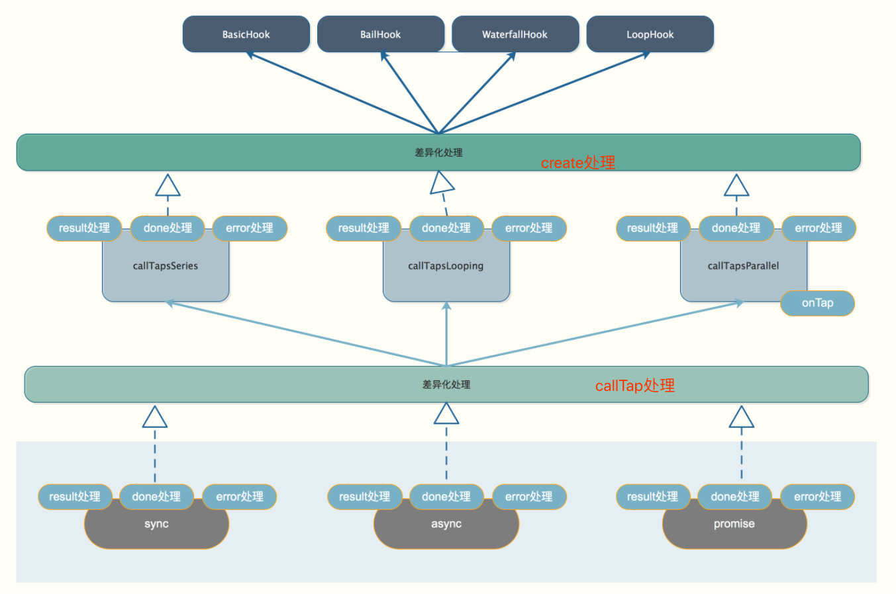
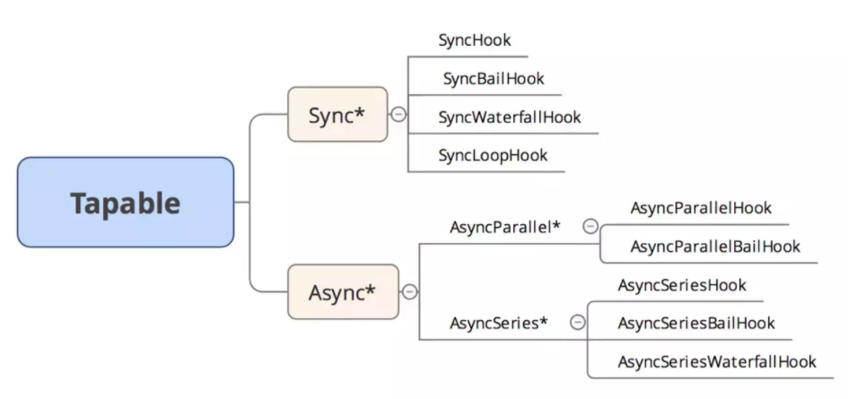
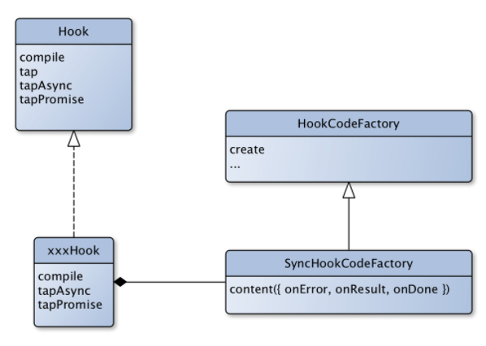

# 学习

1. 事件注册可以注册不同类型，都push到taps数组中，关键在于事件触发，需要根据不同类型，实现不同的逻辑

2. 事件触发与事件注册拆分到两个不同类中
   - 但为了方便使用，需要将事件触发绑定到Hook类中
   - 而call的具体逻辑，是需要子类去覆盖重写的，即需要子类定义一个compile函数
   
3. 利用new Function形式生成最终代码
   - HookCodeFactory通过new Function的形式生成针对sync/async/promise的具体函数，而对于sync不同方法的差异，则是在子类的`this.content`中实现的
   - 相比于我们平时直接遍历或者递归的调用每一个事件来说，这种执行方法效率上来说相对更高效
   
4. 通过`function.tostring()`可以看到函数的代码

5. 对于串行异步代码，其实就是用function，生成具有回调地狱形式的代码

6. node中，如之前某个方法 HookMap.tap，现在不推荐使用了，可以这样

   ```javascript
   HookMap.prototype.tap = util.deprecate(function(key, options, fn) {
   	return this.for(key).tap(options, fn);
   }, "HookMap#tap(key,…) is deprecated. Use HookMap#for(key).tap(…) instead.");
   ```

   - 这样，当调用`hookMap.tap(key,options)`时，会转而调用 `this.for(key).tap()`，并报错

## 逻辑设计

1. 事件注册与触发，是一个最基本的观察者模式

   - 有不同类型，肯定是使用继承的方式，如下提供了分别处理同步与异步的api

     ```javascript
     class Hook {
       tap() {};
       tapAsync() {};
       tapPromise() {};
       call() {};
       callAsync() {};
       promise() {};
     }
     ```

   - 不可能每个子方法都支持基类的api，故需要在子类将某些方法禁用（即重写抛出异常）

   - 事件触发逻辑会很多，如果都写在Hook会很重，故可以写在新的HookCodeFactory里面，利用如下方式将两者关联起来

     ```javascript
     class AbcHook extend Hook {
       this.compile = new HookCodeFactory().create(); // 伪代码，类似这样的方式
     }
     class Hook {
       call() {
         this.compile();
       };
     }
     ```

2. 根据可用api可以得到如下

   - 方式： sync与async
   - 类型： basic，bail，waterfall，loop
   - 本质：并行与串行，而对于同步代码，其实就只有串行
   - 实现：
     - 同步：其实就是一个个函数循环调用，只是针对不同类型（basic/bail），为函数写一写条件
     - 异步： 串行，普通就是类似回调地狱，promise就是then的方式；并行就是直接循环调用函数

3. 因此，Tapable

   - 先利用create函数处理不同类型整体上的差异，并处理Interceptor
   - 然后会根据串行还是并行逻辑，调用callTapsSeries或callTapsParallel，这两个函数处理在串或并结构上的差异
   - 最后，会调用callTap，这个是处理单次函数，但不同类型还是有些差异，这个函数进行处理

4. 那么还有个关键的是，不同类型的函数，逻辑是不同的，如何注入在需要的地方

   - Tabpable是通过继承HookCodeFactory时，传入content函数，而这个函数的参数onError，onResult等函数，用于处理这个差异

   

# 概述

1. 类似EventEmit，但功能要强大的多

   ```javascript
   const {
   	SyncHook,
   	SyncBailHook,
   	SyncWaterfallHook,
   	SyncLoopHook,
   	AsyncParallelHook,
   	AsyncParallelBailHook,
   	AsyncSeriesHook,
   	AsyncSeriesBailHook,
   	AsyncSeriesWaterfallHook
    } = require("tapable");
   ```

   

2. 如不分异步和同步，从类型角度将hook进行划分

   - basicHook：执行每一个，不关心函数的返回值，有 SyncHook、AsyncParallelHook、AsyncSeriesHook
   - BailHook：顺序执行 Hook，遇到第一个结果 result !== undefined 则返回，不再继续执行；主要作用是：如需要满足A或B或C，将M模块单独打包，则可以使用这个钩子
   - WaterfallHook：类似于reduce，如前一个 Hook 函数的结果 result !== undefined，则 result 会作为后一个 Hook 函数的第一个参数；因为是有序的，故异步只有seriesHook
   - LoopHook: 不停的循环执行 Hook，直到所有函数结果 result === undefined。同样的，由于对串行性有依赖，所以只有 SyncLoopHook 和 AsyncSeriseLoopHook（PS：暂时没看到具体使用 Case）


# 基本使用

## SyncHook

1. 不关心返回值

   ```javascript
   const { SyncHook } = require("tapable");
   let queue = new SyncHook(['name']); //所有的构造函数都接收一个可选的参数，这个参数是一个字符串的数组。
   
   // 订阅
   queue.tap('1', function (name, name2) {// tap 的第一个参数是用来标识订阅的函数的
       console.log(name, name2, 1);
       return '1'
   });
   queue.tap('2', function (name) {
       console.log(name, 2);
   });
   queue.tap('3', function (name) {
       console.log(name, 3);
   });
   
   // 发布
   queue.call('webpack', 'webpack-cli');// 发布的时候触发订阅的函数 同时传入参数
   
   // 执行结果:
   /* 
   webpack undefined 1 // 传入的参数需要和new实例的时候保持一致，否则获取不到多传的参数
   webpack 2
   webpack 3
   */
   ```

2. 基本原理

   ```javascript
   class SyncHook_MY{
       constructor(){
           this.hooks = [];
       }
       // 订阅
       tap(name, fn){
           this.hooks.push(fn);
       }
       // 发布
       call(){
           this.hooks.forEach(hook => hook(...arguments));
       }
   }
   ```

## SyncBailHook

1. 只要监听函数中有一个函数的返回值不为 `null`，则跳过剩下所有的逻辑

   ```javascript
   const {
       SyncBailHook
   } = require("tapable");
   
   let queue = new SyncBailHook(['name']); 
   queue.tap('1', function (name) {
       console.log(name, 1);
   });
   queue.tap('2', function (name) {
       console.log(name, 2);
       return 'wrong'
   });
   queue.tap('3', function (name) {
       console.log(name, 3);
   });
   queue.call('webpack');
   // 执行结果:
   /* 
   webpack 1
   webpack 2
   */
   ```

2. 基本原理

   ```javascript
   class SyncBailHook_MY {
       constructor() {
           this.hooks = [];
       }
       // 订阅
       tap(name, fn) {
           this.hooks.push(fn);
       }
       // 发布
       call() {
           for (let i = 0, l = this.hooks.length; i < l; i++) {
               let hook = this.hooks[i];
               let result = hook(...arguments);
               if (result) {
                   break;
               }
           }
       }
   }
   ```

   

## SyncWaterfallHook

1. 上一个监听函数的返回值可以传给下一个监听函数

2. 基本原理

   ```javascript
   class SyncWaterfallHook_MY{
       constructor(){
           this.hooks = [];
       }
       // 订阅
       tap(name, fn){
           this.hooks.push(fn);
       }
       // 发布
       call(){
           let result = null;
           for(let i = 0, l = this.hooks.length; i < l; i++) {
               let hook = this.hooks[i];
               result = i == 0 ? hook(...arguments): hook(result); 
           }
       }
   }
   ```

## AsyncSeriesHook

```javascript
let queue2 = new AsyncSeriesHook(['name']);
console.time('cost2');
queue2.tapAsync('1', function (name, cb) {
    setTimeout(() => {
        console.log(name, 1);
        cb();
    }, 1000);
});
queue2.tapAsync('2', function (name, cb) {
    setTimeout(() => {
        console.log(name, 2);
        cb();
    }, 2000);
});
queue2.tapAsync('3', function (name, cb) {
    setTimeout(() => {
        console.log(name, 3);
        cb();
    }, 3000);
});

queue2.callAsync('webpack', (err) => {
    console.log(err);
    console.log('over');
    console.timeEnd('cost2');
}); 
// cost3: 6021.817ms
```

1. 实现原理

   ```javascript
   class AsyncSeriesHook_MY {
       constructor() {
           this.hooks = [];
       }
       tapAsync(name, fn) {
           this.hooks.push(fn);
       }
       callAsync() {
           var slef = this;
           var args = Array.from(arguments);
           let done = args.pop();
           let idx = 0;
           function next(err) {
               if (err) return done(err);
               let fn = slef.hooks[idx++];
               fn ? fn(...args, next) : done();
           }
           next();
       }
   }
   ```

   

## AsyncParallelHook-promise

```javascript
let queue3 = new AsyncParallelHook(['name']);
console.time('cost3');
queue3.tapPromise('1', function (name, cb) {
   return new Promise(function (resolve, reject) {
       setTimeout(() => {
           console.log(name, 1);
           resolve();
       }, 1000);
   });
});

queue3.tapPromise('1', function (name, cb) {
   return new Promise(function (resolve, reject) {
       setTimeout(() => {
           console.log(name, 2);
           resolve();
       }, 2000);
   });
});

queue3.tapPromise('1', function (name, cb) {
   return new Promise(function (resolve, reject) {
       setTimeout(() => {
           console.log(name, 3);
           resolve();
       }, 3000);
   });
});

queue3.promise('webpack')
   .then(() => {
       console.log('over');
       console.timeEnd('cost3');
   }, () => {
       console.log('error');
       console.timeEnd('cost3');
   });
```


## HookMap

```javascript
const {
    HookMap,
    SyncHook
} = require('./lib/index');

const keyedHook = new HookMap(key => new SyncHook(["arg"]))
keyedHook.for("some-key").tap("MyPlugin", (arg) => {
    console.log('123')
});
keyedHook.for("some-key").tap("MyPlugin", (arg) => {
    console.log('456')
});

const hook = keyedHook.get("some-key");
if(hook !== undefined) {
    hook.callAsync("arg", err => {
        console.log('error')
    });
}
```

1. 实际就是构造一个map，key-> hook的形式

# 源码原理

## 概述

1. 根据使用可以得到Tabpable的主脉络是：

   - hook 事件注册 ——> hook 触发 ——> 生成 hook 执行代码 ——> 执行

2. 类图关系也非常清晰，一个基类Hook，一个工厂基类HookCodeFactory

   

## 事件注册

1. 基本逻辑是调用实例的tap方法注册对应的Hook

   ```javascript
   // 事件注册(sync为例)
   xxxxx.tap('a', fn)
   // Hook 内部逻辑基本是
   this.taps[this.taps.length] = {
     name: 'a',
     type: 'sync',
     fn: fn,
   };
   ```

2. Tapable提供了3种注册方式tap/tapAsync/tapPromise，实际注册到`this.taps`中的type分别为sync/async/promise

3. 而对于同步钩子，不适用tapAsync与tapPromise的，会在继承时进行覆盖，避免开发者使用错误


## 事件触发

1. 事件触发对应于call/callAsync/promise，实际都是调用`_createCall`

   ```javascript
   const CALL_DELEGATE = function(...args) {
     this.call = this._createCall("sync");
     return this.call(...args);
   };
   class Hook {
     _createCall(type) {
       return this.compile({
         taps: this.taps,
         interceptors: this.interceptors,
         args: this._args,
         type: type
       });
     }
   }
   ```

2. `this.compile`是通过HookCodeFactory.js的实例`factory.create`获得的

   - create 中只实现了代码的主模板，实现了公共的部分(函数参数和函数一开始的公共参数)，然后留出差异的部分 `content`，交给各个子类来实现

### factory.create

1. 不考虑interception逻辑，得到的伪代码是

   ```javascript
   create(options) {
   		let fn;
   		switch (this.options.type) {
   			case "sync":
   				fn = new Function(
   					this.args(),
   					'"use strict";\n' +
   						"var _context; var _x = this._x;" +
   						this.content({
   							onError: err => `throw ${err};\n`,
   							onResult: result => `return ${result};\n`,
   							resultReturns: true,
   							onDone: () => "",
   							rethrowIfPossible: true
   						})
   				);
   				break;
   		}
   		return fn;
   	}
   ```

2. 而`this.content`必须在子类重写

   ```javascript
   class SyncHookCodeFactory extends HookCodeFactory {
   	content({ onError, onDone, rethrowIfPossible }) {
   		return this.callTapsSeries({
   			onError: (i, err) => onError(err),
   			onDone,
   			rethrowIfPossible
   		});
   	}
   }
   ```

   

