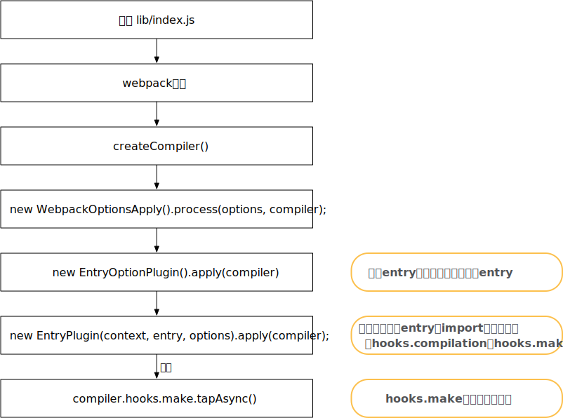

# 学习

1. 要求options，符合定义标准

   - `schema-utils`可以先利用schema对options进行校验
   - 因此，对于非规定的字段配置在`config.js`时，会报错

2. 由于webpack通过钩子的方式，需要通过cmd+f，反查某个钩子具体在哪定义

   - 还可以办法，通过debug，执行到`this.hooks.make.callAsync`通过查看hooks.make上的taps数组，查看绑定的钩子

3. 为何默认入口，编译完的文件是main.js

   - getNormalizedWebpackOptions中，会对entry进行处理
   - getNormalizedEntryStatic，其中会调用此函数将入口为string的entry进行转换

4. webpack是基于回调的，通过tapable，增加了整个代码的灵活性

   - error与success回调，可以直接类似`this.hooks.xxxx.call`即可

5. Compilation.js 中从addEntry，关键步骤，实际都使用了异步队列，道理感觉有点像vue watch队列，一种处理异步的方式（在某一时机）

   ```javascript
   addEntry(context, entry, optionsOrName, callback) {
     this.factorizeQueue.add(options, (err, newModule) => {
       this.addModuleQueue.add(newModule, (err, module) => {
         this.buildQueue.add(module, err => {
           // 根据不同逻辑，最终会调用 callback
         });
       });
     });
   })
   ```

   

# 示例代码

1. `clone`下最新的`webpack`源码，在构建如下目录结构，主要为了`debug` webpack源码

   ```json
   debug-|
         |--dist    // 打包后输出文件
         |--src
            |--index.js   // 源代码入口文件
         |--package.json  // debug时需要安装一些loader和plugin
         |--start.js      // debug启动文件
         |--webpack.config.js  // webpack配置文件
   ```

2. 代码

   ```javascript
   // webpack.config.js
   const path = require('path')
   module.exports = {
   	context: __dirname,
   	mode: 'production',
   	devtool: 'source-map',
   	entry: './index.js',
   	output: {
   		path: path.join(__dirname, './dist'),
   	},
   	optimization: {
   		usedExports: true,
   	},
   	module: {
   		rules: [
   			{
   				test: /\.js$/,
   				use: ['babel-loader'],
   				exclude: /node_modules/,
   			}
   		]
   	}
   }
   // start.js
   const webpack = require('../lib/index.js')  // 直接使用源码中的webpack函数
   const config = require('./webpack.config')
   const compiler = webpack(config)
   compiler.run((err, stats)=>{
   	if(err){
   		console.error(err)
   	}else{
   		console.log(stats)
   	}
   })
   ```

3. 可以执行`webpack ./debug/index.js --config ./debug/webpack.config.js`或利用开发者工具直接debug `start.js`来开始

# 主入口

1. 对于上文的`start.js`，我们可以看出`webpack`编译主入口是webpack函数（加载配置）和`compiler.run`（执行）

2. webpack函数（lib/webpack.js）重要步骤（伪代码）

   ```javascript
   const webpack =  ((options,callback) => {
     // 1. 校验schema
     validateSchema(webpackOptionsSchema, options);
     // 2. 根据options类型，调用不同函数，生成compiler
     if (Array.isArray(options)) {
       compiler = createMultiCompiler(options);
     } else {
       compiler = createCompiler(options);;
     }
     // 3. 运行compiler
     if (callback) {
       compiler.run();
     }
     return compiler;
   });
   ```

   - 实际webpack函数主要就3件事
     - 校验schema，保证传入的`options`是符合要求的
       - 使用`webpack`自己封装的`schema-utils`包
     - 生成编译器，生成编译器的本质逻辑是**为compiler 安装插件（由用户引入的options.plugins或webpack内置的插件）**
     - 运行编译器，即执行`compiler.run`方法

3. `createCompiler`函数（关键步骤伪代码）

   ```javascript
   const createCompiler = rawOptions => {
     // 将传入的配置`options`进行数据格式调整，方便webpack使用，注意：并无配置默认值
     const options = getNormalizedWebpackOptions(rawOptions);
     // 实例化`Compiler`
     const compiler = new Compiler(options.context);
     compiler.options = options;
     // 循环`options.plugins`，安装用户提供的插件
     if (Array.isArray(options.plugins)) {
       plugin.apply(compiler);
     }
     // 配置`options` 默认值
     applyWebpackOptionsDefaults(options);
     // 安装内部插件，并根据配置options，安装需要的插件，比如配置了`options.optimization.sideEffects = true`，会安装`SideEffectsFlagPlugin`插件，否则不安装
     new WebpackOptionsApply().process(options, compiler);
     return compiler;
   };
   ```

4. `compiler.run `

   - 如果`callback`存在，则执行，否则需要像 debug中的`start.js`一样，手动调用`run`方法

   - `compiler.run `函数其实本质是调用一系列钩子（hooks.xxxxxx.call），伪代码：

     ```javascript
     // run 函数
     run(callback) {
       this.hooks.beforeRun.callAsync(this, err => {
         this.hooks.run.callAsync(this, err => {
           this.compile((err, compilation) => {
             this.hooks.done.callAsync(stats, err => {
               this.hooks.afterDone.call(stats);
             });
           };);
         });
       });
     }
     // this.compile
     compile(callback) {
       this.hooks.beforeCompile.callAsync(params, err => {
         this.hooks.compile.call(params);
         const compilation = this.newCompilation(params);
         this.hooks.make.callAsync(compilation, err => {
           this.hooks.afterCompile.callAsync(compilation, err => {
             return callback(null, compilation);
           });
         });
       });
     }
     ```

   - **首先要特别注意**：在调用`this.hooks.beforeRun.callAsync(parasm, callback)` 会先执行`hooks.beforeRun` tap的函数，如在`NodeEnvironmentPlugin.js`中，会有如下代码，hooks上全部 tap的函数执行完，才会执行回调 `callback`

     ```javascript
     compiler.hooks.beforeRun.tap("NodeEnvironmentPlugin", compiler => {
       if (compiler.inputFileSystem === inputFileSystem) {
         inputFileSystem.purge();
       }
     });
     ```

     - 也可以通过 debug 模式，在执行到`hooks`时，查看`this.hooks.xxxxx.taps`数组，查看包含的插件

   - 根据伪代码：钩子执行是：beforeRun->run->执行`this.compiler`函数->done->afterDone

     - `this.compiler`函数执行完，才会执行回调，即再执行`done`与`afterDone`钩子

   - 而在`this.compiler`函数中，又调用一系列钩子
     
     - 钩子执行：beforeCompile->compile->make->afterCompile
     
   - 而这重中之重是make这个钩子的调用

6. 补充：`compiler`和`compilation`对象

   - 这两个对象一直贯穿webpack始终
   - **Compiler**类(`./lib/Compiler.js`)：webpack的主要引擎，在compiler对象记录了完整的webpack环境信息，在webpack从启动到结束，`compiler`只会生成一次。你可以在`compiler`对象上读取到`webpack config`信息，`outputPath`等；
   - **Compilation**类(`./lib/Compilation.js`)：代表了一次单一的版本构建和生成资源。`compilation`编译作业可以多次执行，比如webpack工作在`watch`模式下，每次监测到源文件发生变化时，都会重新实例化一个`compilation`对象。一个`compilation`对象表现了当前的模块资源、编译生成资源、变化的文件、以及被跟踪依赖的状态信息。

7. 流程图

   

# hooks.make

1. `this.hooks.make.callAsync` tap的函数是`webpack`的主要处理流程，即`EntryPlugin.js` 中的`compilation.addEntry`函数开始
2. 首先我们看下`EntryPlugin`是何时定义的

## 何时定义的

1. 全局搜索`hooks.make`（也可通过打断点的方式）， 在`EntryPlugin`中调用了`compiler.hooks.make.tapAsync`

   

2. 全局搜索`new EntryPlugin`，`new EntryOptionPlugin`，`new WebpackOptionsApply` 可以得到如下，程序流程图
  

3. 在`EntryOptionPlugin`中，伪代码：

   ```javascript
   apply(compiler) {
   		compiler.hooks.entryOption.tap("EntryOptionPlugin", (context, entry) => {
   			if (typeof entry === "function") {
   				new DynamicEntryPlugin(context, entry).apply(compiler);
   			} else {
   				// 处理entry的对象写法
   				for (const name of Object.keys(entry)) {
   					const desc = entry[name];
   					for (const entry of desc.import) {
   						new EntryPlugin(context, entry, options).apply(compiler);
   					}
   				}
   			}
   			return true;
   		});
   	}
   ```

   - 如`entry`是函数，则直接调用`DynamicEntryPlugin`
   - 否则，调用`new EntryPlugin`处理每个import

4. 在`EntryPlugin`中

   ```javascript
   apply(compiler) {
     compiler.hooks.compilation.tap("EntryPlugin",(compilation, { normalModuleFactory }) => {
         compilation.dependencyFactories.set(
           EntryDependency,
           normalModuleFactory
         );
       }
     );
     compiler.hooks.make.tapAsync("EntryPlugin", () => {});
   }
   ```

   - 实际是往`compiler.hooks.compilation`与`compiler.hooks.make`分别tap 函数
   - 因此，对于n个import，`compiler.hooks.make`和`compiler.hooks.compilation`会被tap多个函数

5. 补充：

   - webpack使用了tapable作为流程控制，是一个包含异步，promise等的订阅-发布模式的库

## 执行

1. 根据小结（主入口）分析，会执行`hooks.make`，实际是执行`EntryPlugin.js`的`compiler.hooks.make.tapAsync()`，会执行`compilation.addEntry`函数

   ```javascript
   compiler.hooks.make.tapAsync("EntryPlugin", (compilation, callback) => {
     const { entry, options, context } = this;
     // dep： new EntryDependency(entry)，entry一般是类似'src/index.js'的字符串
     // EntryDependency只有一个 get type() { return 'type'}的方法，没有其他方法；但EntryDependency extend ModuleDependency extend Dependency
     const dep = EntryPlugin.createDependency(entry, options);
     // context：入口所在文件夹
     compilation.addEntry(context, dep, options, err => {
       callback(err);
     });
   });
   ```

2. 进入`Compilation.js`后， addEntry后的伪代码（主要部分），可以说`Compilation`主要逻辑都在此js中，以 `addEntry`为入口

   ```javascript
   addEntry(context, entry, optionsOrName, callback) {
     const { name } = options;
     // 这块主要是为`this.entries` 赋值
     // 如已经存在，则检查key是否有重复，
     // 如没有缓存name，则保存对应的 entryData 
     let entryData = this.entries.get(name);
     if (entryData === undefined) {
       entryData = {
         dependencies: [entry],
         options: {
           name: undefined,
           ...options
         }
       };
       this.entries.set(name, entryData);
     } else {
       entryData.dependencies.push(entry);
       for (const key of Object.keys(options)) {
         if (entryData.options[key] === undefined) {
           entryData.options[key] = options[key];
         } else {
           return callback(new WebpackError('Conflicting entry option xxxxxxxxxxxxxx'));
         }
       }
     }
     // 调用`addModuleChain`
     this.addModuleChain(context, entry, (err, module) => {});
   }
   ```

   - `addEntry`函数就是处理`this.entries`，然后调用`addModuleChain`

3. `addModuleChain`函数

   ```javascript
   addModuleChain(context, dependency, callback) {
     const Dep = (dependency.constructor);
     const moduleFactory = this.dependencyFactories.get(Dep);
     if (!moduleFactory) {
       return callback(new WebpackError(
           'No dependency factory available for this dependency type: xxxxx'));
     }
   	// 调用 handleModuleCreation 函数
     this.handleModuleCreation(
       {
         factory: moduleFactory,
         dependencies: [dependency],
         originModule: null,
         context
       },
       err => {}
     );
   }
   ```

   - `addModuleChain`函数主要是判断Dep要是`dependencyFactories`定义的类型
   - 注：在`hooks.make`执行之前（`hooks.beforeCompile`回调函数中），会执行`this.newCompilation(params)`函数，会调用`hooks.compilation.call`，`compilation` tap了众多函数，其中一个是`EntryPlugin`，会对`compilation.dependencyFactories`赋值

4. `handleModuleCreation`函数

   ```javascript
   handleModuleCreation(
     { factory, dependencies, originModule, context, recursive = true },
     callback
   ) {
     // module依赖树
     const moduleGraph = this.moduleGraph;
     // ModuleProfile 主要功能是记录时间，如内部的markBuildingStart() { this.buildStartTime = Date.now()}
     const currentProfile = this.profile ? new ModuleProfile() : undefined;
   
     this.factorizeModule({},(err, newModule) => {
         this.addModule(newModule, (err, module) => {
   				// ....省略，之后会详细介绍
           this.buildModule(module, err => {
   					// ...省略
           });
         });
       }
     );
   }
   ```

   - 省略细节（之后会介绍），`handleModuleCreation`主要会调用`factorizeModule\addModule\buildModule`

5. 这3个函数内部都是类型`this.xxxxxxQueue.add(options, callback)`，因此，可以转换为

   ```javascript
   // 只保留了最关键的3个函数调用，并不是addEntry函数内直接调用了这3个函数
   addEntry(context, entry, optionsOrName, callback) {
     this.factorizeQueue.add(options, (err, newModule) => {
       this.addModuleQueue.add(newModule, (err, module) => {
         this.buildQueue.add(module, err => {
           // 根据不同逻辑，最终会调用 callback
         });
       });
     });
   })
   ```

6. 而`this.factorizeQueue`等又是什么呢？在`construtor`中会分别定义这3个队列

   ```javascript
   constructor() {
     this.factorizeQueue = new AsyncQueue({
       name: "factorize",
       parallelism: options.parallelism || 100,
       processor: this._factorizeModule.bind(this)
     });
     this.addModuleQueue = new AsyncQueue({
       name: "addModule",
       parallelism: options.parallelism || 100,
       getKey: module => module.identifier(),
       processor: this._addModule.bind(this)
     });
     this.buildQueue = new AsyncQueue({
       name: "build",
       parallelism: options.parallelism || 100,
       processor: this._buildModule.bind(this)
     });
   }
   ```

   - `factorizeQueue`等实际是一个异步队列，每次调用`this.factorizeModule()`时，会将`callback`加入到`this.factorizeQueue`中

7. 而`factorizeQueue.add` 内部逻辑本质，实际是在某个时机（`setImmediate`），调用processor；`AsyncQueue.js`中的伪代码：

   ```javascript
   add(item, callback) {
     this.hooks.beforeAdd.callAsync(item, err => {
       setImmediate(this._ensureProcessing);
       this.hooks.added.call(item);
     })
   };
   // 执行队列
   _ensureProcessing() {
     while (this._activeTasks < this._parallelism && this._queued.length > 0) {
       this._startProcessing(entry);
     }
     this._willEnsureProcessing = false;
   }
   // 调用processor
   _startProcessing(entry) {
     this.hooks.beforeStart.callAsync(entry.item, err => {
       try {
         this._processor(entry.item, (e, r) => {
           inCallback = true;
           this._handleResult(entry, e, r);
         });
       } catch (err) { }
       this.hooks.started.call(entry.item);
     });
   }
   ```

8. 因此，`factorizeModule\addModule\buildModule`的调用，实际是，先会调用`this._factorizeModule.bind(this)\this._addModule.bind(this)\this._buildModule.bind(this)`

## 流程图


  

  

  

