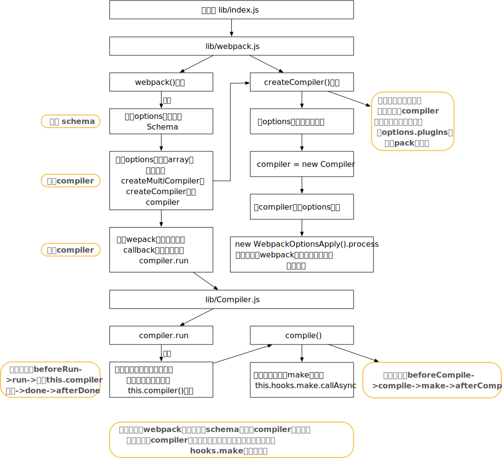
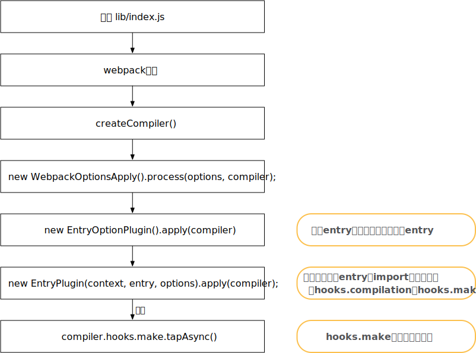

# 学习

1. 要求options，符合定义标准

   - `schema-utils`可以先利用schema对options进行校验
   - 因此，对于非规定的字段配置在`config.js`时，会报错

2. 由于webpack通过钩子的方式，需要通过cmd+f，反查某个钩子具体在哪定义

   - 还可以办法，通过debug，执行到`this.hooks.make.callAsync`通过查看hooks.make上的taps数组，查看绑定的钩子

3. 为何默认入口，编译完的文件是main.js

   - getNormalizedWebpackOptions中，会对entry进行处理
   - getNormalizedEntryStatic，其中会调用此函数将入口为string的entry进行转换

4. webpack是基于回调的，通过tapable，增加了整个代码的灵活性

   - error与success回调，可以直接类似`this.hooks.xxxx.call`即可

5. Compilation.js 中从addEntry，关键步骤，实际都使用了异步队列，道理感觉有点像vue watch队列，一种处理异步的方式（在某一时机）

   ```javascript
   addEntry(context, entry, optionsOrName, callback) {
     this.factorizeQueue.add(options, (err, newModule) => {
       this.addModuleQueue.add(newModule, (err, module) => {
         this.buildQueue.add(module, err => {
           // 根据不同逻辑，最终会调用 callback
         });
       });
     });
   })
   ```

   

# 示例代码

1. clone下最新的webpack源码，在构建如下目录结构，主要为了debug代码

   ```json
   debug-|
         |--dist    // 打包后输出文件
         |--src
            |--index.js   // 源代码入口文件
         |--package.json  // debug时需要安装一些loader和plugin
         |--start.js      // debug启动文件
         |--webpack.config.js  // webpack配置文件
   ```

2. 代码

   ```javascript
   // webpack.config.js
   const path = require('path')
   module.exports = {
   	context: __dirname,
   	mode: 'production',
   	devtool: 'source-map',
   	entry: './index.js',
   	output: {
   		path: path.join(__dirname, './dist'),
   	},
   	optimization: {
   		usedExports: true,
   	},
   	module: {
   		rules: [
   			{
   				test: /\.js$/,
   				use: ['babel-loader'],
   				exclude: /node_modules/,
   			}
   		]
   	}
   }
   // start.js
   const webpack = require('../lib/index.js')  // 直接使用源码中的webpack函数
   const config = require('./webpack.config')
   const compiler = webpack(config)
   compiler.run((err, stats)=>{
   	if(err){
   		console.error(err)
   	}else{
   		console.log(stats)
   	}
   })
   ```

3. 可以执行`webpack ./debug/index.js --config ./debug/webpack.config.js`或debug `start.js`来确定

# 主入口

1. 对于`start.js`，我们可以看出`webpack`编译主入口是webpack函数和`compiler.run`

2. webpack函数重要步骤（伪代码）

   ```javascript
   const webpack = /** @type {WebpackFunctionSingle & WebpackFunctionMulti} */ ((
   	options,
   	callback
   ) => {
     // 1. 校验schema
   	validateSchema(webpackOptionsSchema, options);
     // 2. 根据options类型，调用不同函数，生成compiler
   	if (Array.isArray(options)) {
   		compiler = createMultiCompiler(options);
   	} else {
   		compiler = createCompiler(options);;
   	}
     // 3. 运行compiler
     compiler.run();
   	return compiler;
   });
   ```

   - 实际webpack函数主要就3件事
     - 校验schema，保证传入的`options`是符合要求的
     - 生成编译器，生成编译器的本质逻辑是**为compiler 安装插件（由用户引入的options.plugins或webpack内置的插件）**
     - 运行编译器，即执行`compiler.run`方法

3. compiler.run 方法

   - 其实本质是调用一系列钩子，钩子调用会先执行钩子tap的回调函数
   - 钩子执行：beforeRun->run->执行`this.compiler`函数->done->afterDone
   - 而在`this.compiler`函数中，又调用一系列钩子
     - 钩子执行：beforeCompile->compile->make->afterCompile
   - 而这重中之重是make这个钩子的调用

4. 只能通过反向搜索`hooks.make`查看都有哪些函数绑定在这个钩子上

   - 还有个办法，通过debug，执行到`this.hooks.make.callAsync`通过查看hooks.make上的taps数组，查看绑定的函数

5. 补充：compiler和compilation对象

   - 这两个对象一直贯穿webpack始终
   - **Compiler**类(`./lib/Compiler.js`)：webpack的主要引擎，在compiler对象记录了完整的webpack环境信息，在webpack从启动到结束，`compiler`只会生成一次。你可以在`compiler`对象上读取到`webpack config`信息，`outputPath`等；
   - **Compilation**类(`./lib/Compilation.js`)：代表了一次单一的版本构建和生成资源。`compilation`编译作业可以多次执行，比如webpack工作在`watch`模式下，每次监测到源文件发生变化时，都会重新实例化一个`compilation`对象。一个`compilation`对象表现了当前的模块资源、编译生成资源、变化的文件、以及被跟踪依赖的状态信息。

6. 流程图

   

# hooks.make

## 何时定义的

1. 反向查找`hooks.make`， 在`EntryPlugin`中调用了`compiler.hooks.make.tapAsync`
2. 反向查找`new EntryPlugin`，`new EntryOptionPlugin`，`new WebpackOptionsApply` 可以得到如下，程序流程图
	

2. 在`EntryOptionPlugin`中，伪代码：

   ```javascript
   apply(compiler) {
   		compiler.hooks.entryOption.tap("EntryOptionPlugin", (context, entry) => {
   			if (typeof entry === "function") {
   				new DynamicEntryPlugin(context, entry).apply(compiler);
   			} else {
   				// 处理entry的对象写法
   				for (const name of Object.keys(entry)) {
   					const desc = entry[name];
   					for (const entry of desc.import) {
   						new EntryPlugin(context, entry, options).apply(compiler);
   					}
   				}
   			}
   			return true;
   		});
   	}
   ```

   - 如`entry`是函数，则直接调用`DynamicEntryPlugin`
   - 否则，调用`new EntryPlugin`处理每个import

2. 在`EntryPlugin`中

   ```javascript
   	apply(compiler) {
   		compiler.hooks.compilation.tap(
   			"EntryPlugin",
   			() => {}
   		);
   		compiler.hooks.make.tapAsync("EntryPlugin", () => {});
   	}
   ```

   - 实际就是往`compiler`的不同`hooks`，tap函数
   - 因此，对于n个import，`compiler.hooks.make`和`compiler.hooks.compilation`会被tap多个函数

3. 补充：webpack使用了tapable作为流程控制，是一个包含异步，promise等的订阅-发布模式的库

## 执行

1. 根据上述分析，主入口最后最后执行`hooks.make`，实际是执行`EntryPlugin.js`的`compiler.hooks.make.tapAsync()`，会执行`compilation.addEntry`函数

   ```javascript
   compiler.hooks.make.tapAsync("EntryPlugin", (compilation, callback) => {
     const { entry, options, context } = this;
     const dep = EntryPlugin.createDependency(entry, options);
     // context： 入口文件夹，dep：被包装的entry
     compilation.addEntry(context, dep, options, err => {
       callback(err);
     });
   });
   ```

2. 进入`Compilation.js`后， addEntry后的伪代码（主要部分）：

   ```javascript
   addEntry(context, entry, optionsOrName, callback) {
     this.factorizeQueue.add(options, (err, newModule) => {
       this.addModuleQueue.add(newModule, (err, module) => {
         this.buildQueue.add(module, err => {
           // 根据不同逻辑，最终会调用 callback
         });
       });
     });
   })
   ```

   - `addEntry`会调用 `addModuleChain`，然后`handleModuleCreation`,然后`this.factorizeModule`
   - 而`this.factorizeModule`，其实就是`this.factorizeQueue.add()`
   - 补：因此，进入编译`Compilation.js`的开始函数就是`addEntry`

3. 而`this.factorizeQueue`又是什么呢？在`construtor`中会分别定义这3个队列

   ```javascript
   constructor() {
     this.factorizeQueue = new AsyncQueue({
       name: "factorize",
       parallelism: options.parallelism || 100,
       processor: this._factorizeModule.bind(this)
     });
     this.addModuleQueue = new AsyncQueue({
       name: "addModule",
       parallelism: options.parallelism || 100,
       getKey: module => module.identifier(),
       processor: this._addModule.bind(this)
     });
     this.buildQueue = new AsyncQueue({
       name: "build",
       parallelism: options.parallelism || 100,
       processor: this._buildModule.bind(this)
     });
   }
   ```

4. 而`factorizeQueue.add` 内部逻辑本质，实际是在某个时机，调用processor；`AsyncQueue.js`中的伪代码：

   ```javascript
   add(item, callback) {
     this.hooks.beforeAdd.callAsync(item, err => {
       setImmediate(this._ensureProcessing);
       this.hooks.added.call(item);
     })
   };
   // 执行队列
   _ensureProcessing() {
     while (this._activeTasks < this._parallelism && this._queued.length > 0) {
       this._startProcessing(entry);
     }
     this._willEnsureProcessing = false;
   }
   // 调用processor
   _startProcessing(entry) {
     this.hooks.beforeStart.callAsync(entry.item, err => {
       try {
         this._processor(entry.item, (e, r) => {
           inCallback = true;
           this._handleResult(entry, e, r);
         });
       } catch (err) { }
       this.hooks.started.call(entry.item);
     });
   }
   ```

5. 因此，接下来会优先执行`_factorizeModule`函数

   

   

   

