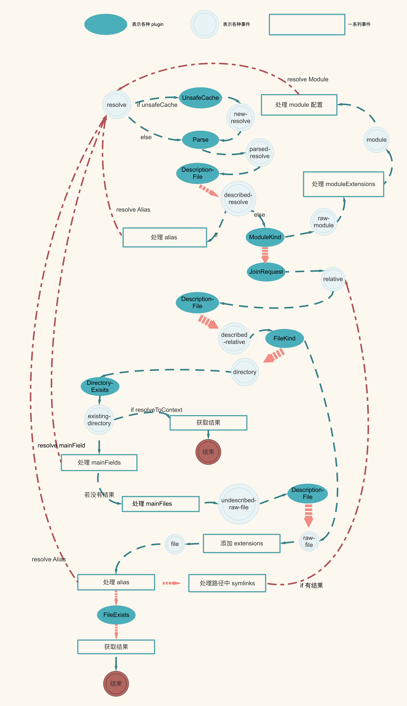
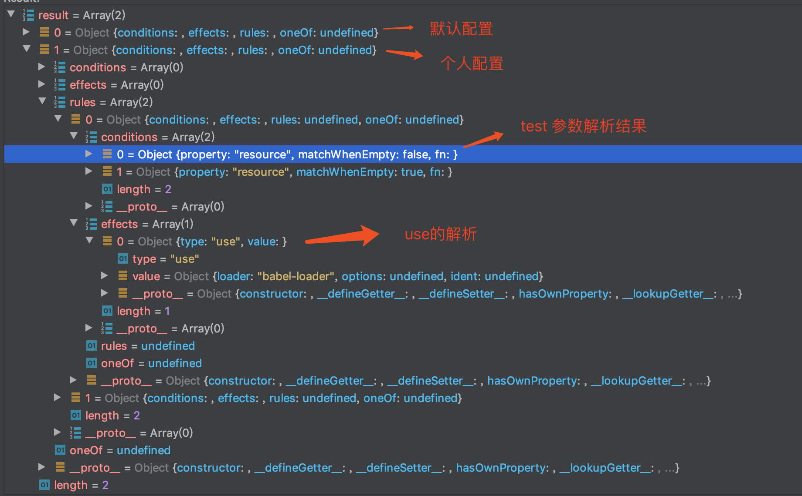

# 学习

1. webpack内部使用`enhanced-resolve`库，来处理resolve这个配置参数
   - 用于生产不同type不同options的resolver
   - xxxxxx.resolve 得到就是一个`request`的绝对路径，而对于alias、extensions等，都由这个库来处理
2. 如何禁止非法key在options上，或说不能解析的key不允许在options上
   - `webpack`在`rule`处理上，通过`new Set(Object.keys(options))`，获取非重复key，然后每个插件处理了每个key之前，都会删除这个key，这样，就可以通过 set.size 来判断，是否有其他无法处理的key在对象
3. ruleSet则是处理 module.rule 的，将不同配置，整理为相似的数据结构，方便 exec，来校验某个文件是否符合某个loader的条件，符合会push到对应的数组中，在后续使用


# 概述

1. 由于loader被揉在resolve过程，因此在这个过程中会介绍loader的前期处理，根据官网的介绍，loader 有三种配置方式，cli方式一般不常用

   - 配置方式

     ```javascript
     module: {
       rules: [
         {
           test: /\.css$/,
           use: [
             { loader: 'style-loader' },
             { loader: 'css-loader', options: { modules: true }}
           ]
         }
       ]
     }
     ```

   - 内联方式：`import Styles from 'style-loader!css-loader?modules!./styles.css';`

     - 通过为内联 `import` 语句添加前缀（`! ``!!``-!`）可覆盖配置中的 `loader`, `preLoader` 和 `postLoader`
     - 具体参见：https://webpack.docschina.org/concepts/loaders/#inline

2. 上接`_factorizeModule`函数，由于此函数后面会执行`hooks.factorize`与`hooks.resolve`钩子

3. 先来看看这两个钩子是何时何地定义的

# 定义阶段

1. 在Compiler.js

   - `compile`函数 -> `this.newCompilationParams` -> `createNormalModuleFactory` -> `new NormalModuleFactory`

2. NormalModuleFactory 构造函数constructor，除了初始化一些数据

   - 主要是定义`this.hooks.factorize.tapAsync`，`this.hooks.resolve.tapAsync`，伪代码如下

     ```javascript
     class NormalModuleFactory extends ModuleFactory {
     	constructor() {
         // 初始化一些数据
         this.hooks.factorize.tapAsync({}, () => {
           this.hooks.resolve.callAsync(resolveData, () => {})
         });
         this.hooks.resolve.tapAsync({},()=> {})
       }
     }
     ```

3. hooks定义好后，开始进入执行阶段

4. 特别注意：

   - `NormalModuleFactory`的构造函数分别绑定了`hooks.factorize`与`hooks.resolve`
   - 可以认为这两个钩子对应的数组已经有一个回调函数，每当被call时，会先执行其中的回调函数

# 执行阶段

1. 上文，在最后讲到，在Compilation.js中，进入entry后会执行如下伪代码：

   ```javascript
   addEntry(context, entry, optionsOrName, callback) {
     this.factorizeQueue.add(options, (err, newModule) => {
       this.addModuleQueue.add(newModule, (err, module) => {
         this.buildQueue.add(module, err => {
           // 根据不同逻辑，最终会调用 callback
         });
       });
     });
   })
   ```

2. 我们首先来看`this.factorizeQueue.add`，会执行其定义的processor，即执行`_factorizeModule`

3. 执行` factory.create`后进入`NormalModuleFactory`中的`create`函数，伪代码：

   ```javascript
   create(data, callback) {
     const resolveData = {};
     this.hooks.beforeResolve.callAsync(resolveData, (err, result) => {
       // 先对result进行有效性判断
       this.hooks.factorize.callAsync(resolveData, (err, module) => {});
     });
   }
   ```

   - 构建resolveData

   - 调用`this.hooks.beforeResolve`，由于当前情况，此hook未tap函数，直接进入其回调

     - 先对result进行有效性判断
     - 调用：`this.hooks.factorize.callAsync`
     - 根据定义阶段，我们得知，会执行NormalModuleFactory在实例化时为`hooks.factorize` tap的函数
     - 最终会执行constructor中的，`this.hooks.resolve.tapAsync({},()=> {})`

     

     

## 执行 constructor中的 `this.hooks.resolve`

1. 以下为`this.hooks.resolve.tapAsync`（NormalModuleFactory.js）回调函数的伪代码

2. 首先，创建了两种类型的resolver，这两个loader（注：具体细节可以看 loader章）

   ```javascript
   // 1. 创建了两种类型的resolver
   const loaderResolver = this.getResolver("loader");
   const normalResolver = this.getResolver("normal", resolveOptions);
   ```

   - `resolverFactory`是ResolverFactory实例，伪代码：

     ```javascript
     get(type, resolveOptions = EMPTY_RESOLVE_OPTIONS) {
       let typedCaches = this.cache.get(type);
       if (!typedCaches) {
         typedCaches = {
           direct: new WeakMap(),
           stringified: new Map()
         };
         this.cache.set(type, typedCaches);
       }
       // ......
       const newResolver = this._create(type, resolveOptions);
       return newResolver;
     }
     _create(type, resolveOptions) {
       const resolver = (Factory.createResolver(resolveOptions));
       return resolver;
     }
     ```

   - 而相同resolver重复生成是一种浪费，webpack利用ResolverFactory 对resolve进行缓存，创建等处理，因此，调用get，实际会先判断是否有缓存，无则创建一个resolver

   - 由于不同类型，不同参数，可能有不同的resolver，webpack利用webpack/enhanced-resolve 库，构建不同resolver

     - `Factory.createResolver(resolveOptions)`是用来创建一个resolver

     - 暂粗略阅读：node_modules/enhanced-resolve/lib/ResolverFactory.js（详下后文：[插件执行顺序原因](###插件执行顺序原因)）

       - 实际就是，如传入的options未配置resolver，则用内部`Resolver.js`创建一个实例

       - 并为resolve 配置hooks和各个插件

       - 主要目的是获取文件路径，用官方的例子说明下：

         ```javascript
         resolve.sync("/some/path/to/folder", "../../dir");
         // === "/some/path/dir/index.js"
         ```

3. 然后处理 !=! 这个内联符号

   ```javascript
   // 假设 request为： import './file.js.css!=!extract-style-loader/getStyles!./file.js';
   const matchResourceMatch = /^([^!]+)!=!/.exec(request);
   if (matchResourceMatch) {
     // matchResource 则为 ./file.js.css
     matchResource = matchResourceMatch[1];
     // 其实就是，将  ./file.js.css 逻辑，转换为 绝对路径，类似于 /user/rextao/xxx/xxx/xxx/src/file.js.css
     if (matchResource.charCodeAt(0) === 46) {
       // 46 === ".", 47 === "/"
       const secondChar = matchResource.charCodeAt(1);
       if (
         secondChar === 47 ||
         (secondChar === 46 && matchResource.charCodeAt(2) === 47)
       ) {
         // if matchResources startsWith ../ or ./
         matchResource = join(this.fs, context, matchResource);
       }
     }
     requestWithoutMatchResource = request.substr(
       matchResourceMatch[0].length
     );
   }
   ```

   - 前缀`<match-resource>!=!` 是用于设置matchResource，官方并不建议使用此语法在应用代码

   - 具体介绍可参见：https://webpack.js.org/api/loaders/#inline-matchresource

   - 我们可以假设某个js内，有这样一个：`import './file.js.css!=!extract-style-loader/getStyles!./file.js';`

   - 因此，这段逻辑，将 `!=!`的文件转换为绝对路径，得到如下结果

     ```javascript
     matchResource = /user/rextao/xxx/xxx/xxx/src/file.js.css
     requestWithoutMatchResource = extract-style-loader/getStyles!./file.js
     ```

4. 处理内联方式的`!,!!,-!` 与查询参数(`?key=value&foo=bar`)

   ```javascript
   const firstChar = requestWithoutMatchResource.charCodeAt(0);
   const secondChar = requestWithoutMatchResource.charCodeAt(1);
   const noPreAutoLoaders = firstChar === 45 && secondChar === 33; // startsWith "-!"
   const noAutoLoaders = noPreAutoLoaders || firstChar === 33; // startsWith "!"
   const noPrePostAutoLoaders = firstChar === 33 && secondChar === 33; // startsWith "!!";
   const rawElements = requestWithoutMatchResource
   .slice(
     noPreAutoLoaders || noPrePostAutoLoaders ? 2 : noAutoLoaders ? 1 : 0
   )
   .split(/!+/);
   const unresolvedResource = rawElements.pop();
   // identToLoaderRequest 则是处理 查询参数
   const elements = rawElements.map(identToLoaderRequest);
   ```

   - `unresolvedResource`则是 `./file.js` ，这个文件会被( 5 ) 中的`normalResolver.resolve`进行处理

   - `rawElements.map(identToLoaderRequest)` 则是处理loader查询参数，返回类似`[{ loader: xxx, options: xxxx }]`的数据格式

   - 如`import Styles from 'style-loader!css-loader!./styles.css';`获得的 `elements`为

     ```javascript
     [
     	{ "loader": "style-loader", options: undefined },
       { "loader": "css-loader", options: undefined }
     ]
     ```

5. 后面，对于` inline loader `的处理便是调用`resolveRequestArray`对其进行 resolve

   ```javascript
   this.resolveRequestArray(
     contextInfo,
     context,
     elements,
     loaderResolver,
     resolveContext,
     (err, result) => {
       if (err) return continueCallback(err);
       loaders = result;
       continueCallback();
     }
   );
   // 会处理`style-loader!css-loader!./styles.css`中的 ./styles.css
   normalResolver.resolve(
     contextInfo,
     context,
     unresolvedResource,
     resolveContext,
     (err, resolvedResource, resolvedResourceResolveData) => {
       if (err) return continueCallback(err);
       resource = resolvedResource;
       resourceResolveData = resolvedResourceResolveData;
       continueCallback();
     }
   );
   ```

   - `this.resolveRequestArray`是处理内联方式的前缀loaders
   - `normalResolver.resolve`则是，处理最后那个`./styless`文件，或者是普通的方式如`import vue from vue`，具体如何处理[参见](# Resolver.resolve 到底做了什么)

   ```javascript
   resolveRequestArray() {
     if (array.length === 0) return callback(null, array);
     asyncLib.map(
       array,
       (item, callback) => {
         resolver.resolve(
           contextInfo,
           context,
           item.loader,
           resolveContext,
           // result是loader的入口文件
           (err, result) => {
             // 不再允许忽略 -loader
             if (
               err &&
               /^[^/]*$/.test(item.loader) &&
               !/-loader$/.test(item.loader)
             ) {
               return resolver.resolve(contextInfo,context,item.loader + "-loader",
                 resolveContext,
                 err2 => { if (!err2) {} callback(err);}
               );
             }
             if (err) return callback(err);
   				
             const parsedResult = identToLoaderRequest(result);
             const resolved = {
               loader: parsedResult.loader,
               options:
               item.options === undefined
               ? parsedResult.options
               : item.options,
               ident: item.options === undefined ? undefined : item.ident
             };
             return callback(null, resolved);
           }
         );
       },
       callback
     );
   }
   ```

   - 比如对于`css-loader`，`asyncLib.map`回调函数`resolver.resolve`的结果result为：`/Users/rextao/xxxxx/xxxxxxxx/debug/node_modules/css-loader/dist/cjs.js`，即这个loader的绝对地址

   - 然后，将result，转换为 resolved对象，调用回调函数，注意，这个回调函数` return callback(null, resolved);`是`asyncLib.map`的，即，需要`array`数组全部有结果后，才会调用`resolveRequestArray`的回调

   - 将结果返回，然后执行`continueCallback`函数

     ```javascript
     this.resolveRequestArray(
       contextInfo,
       context,
       elements,
       loaderResolver,
       resolveContext,
       (err, result) => {
         if (err) return continueCallback(err);
         loaders = result;
         continueCallback();
       }
     );
     ```

6. 执行`continueCallback`函数

   - 首先是判断，loaders 的`options`是否符合要求与 `resource`是否有效

     ```javascript
     const continueCallback = needCalls(2, err => {
       if (err) return callback(err);
       try {
         // 判断 loaders 的options 是否符合要求
       } catch (e) {
         return callback(e);
       }
       // resource 是否有效
       if (resource === false) {
         return callback();
       }
       // 接将内联方式`loader`配置，转为绝对路径
     }
     ```

     - `needCalls`是这个`continueCallback`被调用两次后，才会真正进入

   - 然后将内联方式`loader`配置，转为绝对路径

     ```javascript
     const userRequest =
           (matchResource !== undefined ? `${matchResource}!=!` : "") +
           stringifyLoadersAndResource(loaders, resource);
     
     let resourcePath =
         matchResource !== undefined ? matchResource : resource;
     let resourceQuery = "";
     const queryIndex = resourcePath.indexOf("?");
     if (queryIndex >= 0) {
       resourceQuery = resourcePath.substr(queryIndex);
       resourcePath = resourcePath.substr(0, queryIndex);
     }
     ```

     - 将内联方式的`loader`：`style-loader!css-loader!./styles.css`，转为如下形式的绝对路径：

       ```javascript
       userRequest = '/Users/rextao/debug/node_modules/style-loader/dist/cjs.js!/Users/rextao/debug/node_modules/css-loader/dist/cjs.js!/Users/rextao/debug/src/styles.css'
       resourcePath = '/Users/rextao/debug/src/styles.css'
       ```

     - 注意：<a id="userRequest"> userRequest</a>是内联方式loader的绝对路径形式

   - 将需要处理的文件`resourcePath`，使用 `ruleSet`进行解析，过滤出符合配置（webpack.options.rules）的规则，`ruleSet`解析具体可参见：[ruleSet是如何处理](# ruleSet 是如何处理)

     ```javascript
     const result = this.ruleSet.exec({
       resource: resourcePath,
       realResource:
       matchResource !== undefined
       ? resource.replace(/\?.*/, "")
       : resourcePath,
       resourceQuery,
       issuer: contextInfo.issuer,
       compiler: contextInfo.compiler
     });
     ```

   - 将`result`的结果根据不同类型，push到不同的数组中，而对于非`use,use-post,use-pre`类型，会保存在`settings[r.type]`中

     ```javascript
     const settings = {};
     const useLoadersPost = [];
     const useLoaders = [];
     const useLoadersPre = [];
     for (const r of result) {
       if (r.type === "use") {
         if (!noAutoLoaders && !noPrePostAutoLoaders) {
           useLoaders.push(r.value);
         }
       } else if (r.type === "use-post") {
         if (!noPrePostAutoLoaders) {
           useLoadersPost.push(r.value);
         }
       } else if (r.type === "use-pre") {
         if (!noPreAutoLoaders && !noPrePostAutoLoaders) {
           useLoadersPre.push(r.value);
         }
       }  
       // 此处省略 else if ,根据某些特定情况，会给settings[r.type]的值进行转换
       else {
         settings[r.type] = r.value;
       }
     }
     ```

     - 注意：`useLoaders.push(r.value);`需要`noAutoLoaders`与`noPrePostAutoLoaders`为`false`
     - 而这俩又是啥，结合4，可以知道是当前解析request，是否以 `!!,-！，！`开头，如果存在，则不会向相应的loaders push 结果

7. 在`continueCallback`函数内，接下来是针对`useLoadersPost`,`useLoaders`，`useLoadersPre`,分别调用`resolveRequestArray`方法

   ```javascript
   this.resolveRequestArray(xxxx,xxxx,useLoadersPost,loaderResolver,xxxxx,  (err, result) => {
       postLoaders = result;
       continueCallback(err);
     }
   );
   this.resolveRequestArray(xxxx,xxxx,useLoadersPost,useLoaders,xxxxx,  (err, result) => {
       normalLoaders = result;
       continueCallback(err);
     }
   );
   this.resolveRequestArray(xxxx,xxxx,useLoadersPre,loaderResolver,xxxxx,  (err, result) => {
       preLoaders = result;
       continueCallback(err);
     }
   );
   ```

8. 执行完会执行`continueCallback(err)`，特别注意这个`continueCallback`函数是6 `continueCallback` 函数内部定义的

   ```javascript
   const continueCallback = needCalls(3, err => {
     const allLoaders = postLoaders;
     for (const loader of loaders) allLoaders.push(loader);
     for (const loader of normalLoaders) allLoaders.push(loader);
     // 省略了if-else，不同情况下，push顺序不同
     for (const loader of preLoaders) allLoaders.push(loader);
     const type = settings.type;
     const resolveOptions = settings.resolve;
     Object.assign(data.createData, {
       request: stringifyLoadersAndResource(allLoaders, resource),
       userRequest,
       rawRequest: request,
       loaders: allLoaders,
       resource,
       matchResource,
       resourceResolveData,
       settings,
       type,
       parser: this.getParser(type, settings.parser),
       generator: this.getGenerator(type, settings.generator),
       resolveOptions
     });
     callback();
   });
   ```

   - 主要逻辑是：将 `loaders.normalLoaders,preLoaders`全部 push 到 allLoaders中，因此，allLoaders是有顺序的
   - <a id="createData">最后将数据绑定在 `data.createData`上</a>
   - 注意：如果是内联方式的loader，[userRequest](#userRequest)则是带有loader的绝对路径

9. 下面先来看看`xxxx.resolve`到底做了什么

### 小结

1. `hoos.resolve ` tap的这个回调函数可以认为主要做了，如下事情
   - 创建resolver
   - 解析路径，拿到loader和文件
   - 调用xxxx.resolve 方法
2. webpack 中有很多针对路径的配置，例如 alias, extensions, modules 等等，node.js 中的 require 已经无法满足 webpack 对路径的解析的要求。因此，webpack 封装出一个单独的库 [enhanced-resolve](https://github.com/webpack/enhanced-resolve)，专门用来处理各种路径的解析

## Resolver.resolve 到底做了什么

1. 根据上述介绍，函数最终都会调用`normalResolver.resolve`或 `xxxxxx.resolve`，webpack将这部分resolve逻辑封装在`enhanced-resolve`库

2. 如未从options传入resolver配置，会默认使用内部的Resolver（定义：enhanced-resolve/lib/Resolver.js），调用其`resolve`的伪代码为：

   ```javascript
   resolve(context, path, request, resolveContext, callback) {
     const finishResolved = result => {};
     const finishWithoutResolve = log => {};
     return this.doResolve(
       this.hooks.resolve,
       obj,
       message,
       {},
       (err, result) => {
         return this.doResolve(
           this.hooks.resolve,
           obj,
           message,
           {},
           (err, result) => {
             if (err) return callback(err);
             if (result) return finishResolved(result);
           }
         );
       }
     );
   }
   ```

   - resolve方法，实际就是`return this.doResolve`，要注意doResolve第一个参数为：`this.hooks.resolve`，`resolver.resolve`是从`hooks.resolve`开始执行的
   - 还有一个要注意的是，最终执行完获得结果后，如果有结果，会执行`finishResolved`函数

3. `doResolve`伪代码：

   ```javascript
   doResolve(hook, request, message, resolveContext, callback) {
     const stackLine = hook.name + "xxxxxxxxx";
     let newStack;
     if (resolveContext.stack) {
       newStack = new Set(resolveContext.stack);
       newStack.add(stackLine);
     } else {
       newStack = new Set([stackLine]);
     }
   
     if (hook.isUsed()) {
       const innerContext = createInnerContext({
         stack: newStack,
       }, message);
       return hook.callAsync(request, innerContext, (err, result) => {
         if (err) return callback(err);
         if (result) return callback(null, result);
         callback();
       });
     } else {
       callback();
     }
   }
   ```

   - 保存hook到stack中，即hook的先后调用关系会保存在stack中（目前没看到这个stack的作用是何，`createInnerContext`伪代码如下：并未处理stack，又作为childContext的属性返回了？？？？？？）

     ```javascript
     module.exports = function createInnerContext(
     	options,
     	message,
     	messageOptional
     ) {
     	let messageReported = false;
     	let innerLog = undefined;
     	if (options.log) {}
     	const childContext = {
     		log: innerLog,
     		fileDependencies: options.fileDependencies,
     		contextDependencies: options.contextDependencies,
     		missingDependencies: options.missingDependencies,
     		stack: options.stack
     	};
     	return childContext;
     };
     
     ```

   - 然后调用`hook.callAsync`，调用此hook绑定的回调函数

4. `this.hook.resolve`绑定了两个插件回调函数（在`hook.taps`查看），先执行`ResolverCachePlugin，然后是ParsePlugin`

   - `ResolverCachePlugin`定义在`lib/cache/ResolverCachePlugin.js`，参见：[ResolverCachePlugin](# loader是如何缓存的)
   - 对于目前这个简单例子，会依次执行`enhanced-resolve`中的如下插件

5. `ParsePlugin`

   ```javascript
   apply(resolver) {
     const target = resolver.ensureHook(this.target);
     resolver
       .getHook(this.source)
       .tapAsync("ParsePlugin", (request, resolveContext, callback) => {
       // 
       const parsed = resolver.parse(request.request);
       if (parsed && resolveContext.log) {
         // 打印日志
       }
       // 调用下一个插件
       resolver.doResolve(target, obj, null, resolveContext, callback);
     });
   }
   ```

   - 初步解析路径，对是否为绝对路径，相对路径，module，等做标识

   - 如果`resolveContext.log`存在，则打印是否为module，或目录的日志

   - 通过doResolve，去执行当前插件的下一个插件（target）绑定的回调函数

   - 下一个`target`为`parsedResolve`，根据`ResolverFactory.js`中的定义，实际是`DescriptionFilePlugin`插件

     ```javascript
     plugins.push(
       new DescriptionFilePlugin(
         "parsed-resolve",
         descriptionFiles,
         false,
         "described-resolve"
       )
     );
     ```

6. `DescriptionFilePlugin`，结合下面的流程图，会感受更深

   - 寻找描述文件，默认会寻找 package.json。首先会在 request.path 这个目录下寻找，如果没有则按照路径一层一层往上寻找
   - 同时会读取`package.json`的一些描述信息保存下来
   - 之后如配置了`alias`，则会先调用`AliasPlugin`，然后调用AliasFieldPlugin`

7. `AliasFieldPlugin`

   - 由于本例子未配置`alias`，故进入`AliasFieldPlugin`
   - 指定一个字段，例如 `browser`，根据[此规范](https://github.com/defunctzombie/package-browser-field-spec)进行解析。默认是browser
   - 由于`package.json`未配置`browser`，故会直接`callback`
   - 如果有配置，会将路径进行转换，然后重新进入`resolve`过程
   - 接下来进入`ModuleKindPlugin`

8. `ModuleKindPlugin`

   - 此插件，如果是module ，则会进入`rawModule`
   - 否则直接执行`callback`
   - 之后进入`JoinRequestPlugin`

9. `JoinRequestPlugin`

   - 此插件主要就是将`request.path`和` request.request`拼接在一起
   - 实际就是把文件，如`./index.js`，转为电脑的绝对路径：`/user/xxx/xxx/xxx/xx/index.js`
   - 再次进入`DescriptionFilePlugin`插件

10. `DescriptionFilePlugin`

   - 不过与第一次进入时不同之处在于，此时的 request.path 变成了 /dir/demo/a.js`。由于 path 改变了，所以需要再次查找一下 package.json
   - 然后触发`describedRelative`，进入`FileKindPlugin`插件

11. `FileKindPlugin`

    - 如果是目录，则直接callback返回
    - 否则进入`rawFile`事件，执行`TryNextPlugin`插件

12. `TryNextPlugin`

    - 会直接进入下个`file`事件
    - 又进入`AliasFieldPlugin`，在此步中 webpack 内部自带的很多 Alias 不会再有
    - 然后进入`FileExistsPlugin`

13. `FileExistsPlugin`

    - 读取 `request.path` 所在的文件，看文件是否存在。
    - 文件存在则进入到 existingFile 事件。进入`SymlinkPlugin`插件

14. `SymlinkPlugin`

    - 处理路径中存在 link 的情况
    - 由于此例不存在symlink情况，故，直接 callback返回

15. 最终进入`ResultPlugin`插件

    ```javascript
    this.source.tapAsync(
      "ResultPlugin",
      (request, resolverContext, callback) => {
        const obj = { ...request };
        if (resolverContext.log)  resolverContext.log("reporting result " + obj.path);
        resolver.hooks.result.callAsync(obj, resolverContext, err => {
          if (err) return callback(err);
          callback(null, obj);
        });
      }
    );
    ```

    - 此插件会直接调用`resolver.hooks.result.callAsync` ，由于目前未在`hooks.result` tap其他函数，故直接执行回调返回结果，

    - 值得注意的是，返回的obj，主要是包含path（文件的绝对路径），descriptionPath（xxxx/xxxxxx/package.json），descriptionData（package.json解析的数据）等

16. 借用didi一张图，

    

17. 小结

    - `Resolver.resolve`是从`this.hook.resolve`开始，依次执行定义的插件
    
    - 相同插件，可能有不同的事件名
    
      


### 最终的结果是什么

1. 根据上述介绍，一系列插件执行到最后，会执行`ResultPlugin`，然后依次执行各个插件的回调函数，然后回到`Resolver.resolve`的回调，即

   ```javascript
   resolve(context, path, request, resolveContext, callback) {
     // xxxxxx一部分代码，前面已经介绍过
     const finishResolved = result => {
       return callback(
         null,
         result.path === false ? false : result.path + (result.query || ""),
         result
       );
     };
     return this.doResolve(this.hooks.resolve,obj,message,{}, (err, result) => {
       if (err) return callback(err);
   
       if (result) return finishResolved(result);
   
       const log = [];
   
       return this.doResolve(
         this.hooks.resolve,
         obj,
         message,
         {
           log: msg => log.push(msg),
           stack: resolveContext.stack
         },
         (err, result) => {
           if (err) return callback(err);
   
           return finishWithoutResolve(log);
         }
       );
     }}
   ```

   - 根据上文介绍此时如果存在解析结果，result 为包含path等信息的obj，会执行`finishResolved`函数

2. 通过`finishResolved`的返回，可以知道，**最终`xxxxxxxx,resolve`的回调函数结果是**（如有解析结果）：

   - 第一个参数： 为`null`
   - 第二个参数： 为 绝对路径path + 查询参数query
   - 第三个参数： resolve的对象，比如 descriptionPath（xxxx/xxxxxx/package.json），descriptionData（package.json解析的数据）


### 插件执行顺序原因

1. `ResolverFactory.js`的`createResolver`函数主要逻辑

   - 为`webpack.resolve`的各个配置项赋默认值

   - 利用`resolver.ensureHook`创建不同名称的hook，这个方法同时兼顾的通过name获取hook的功能

   - 将各种各样的插件push到plugins中

   - 最终执行每个插件的apply方法

     ```javascript
     plugins.forEach(plugin => {
       plugin.apply(resolver);
     });
     ```

2. 根据上文，我们知道，每个插件会传入一个source和一个target，source表示，当前插件回调函数绑定到哪个（source）hook上，target表示，这个插件执行完，执行哪个（target）hook

3. 假设以resolve开始为例，执行顺序为：

   ```javascript
   plugins.push(new ParsePlugin("resolve", "parsed-resolve"));
   plugins.push(
     new DescriptionFilePlugin(
       "parsed-resolve",
       descriptionFiles,
       false,
       "described-resolve"
     )
   );
   plugins.push(new NextPlugin("after-parsed-resolve", "described-resolve"));
   aliasFields.forEach(item => {
     plugins.push(new AliasFieldPlugin("described-resolve", item, "resolve"));
   });
   ```

   - `after-parsed-resolve`会在`resolver.ensureHook`处理为特殊的`parsed-resolve`

     ```javascript
     	ensureHook(name) {
         name = name.replace(/-([a-z])/g;
     		if (/^before/.test(name)) {
     			return this.ensureHook(
     				name[6].toLowerCase() + name.substr(7)
     			).withOptions({
     				stage: -10
     			});
     		}
     		if (/^after/.test(name)) {
     			return this.ensureHook(
     				name[5].toLowerCase() + name.substr(6)
     			).withOptions({
     				stage: 10
     			});
     		}
     		return hook;
     	}
     ```

   - 因此hook会依次执行resolve->parsed-resolve-> described-resolve ->resolve

   - 为了避免循环，插件apply中会根据某些情况，直接调用callback，而非`resolver.doResolve`继续下一个插件


### 启用unsafeCache

1. 官网说：默认启用`unsafeCache（webpack 4），而webpack 5  cache为false，则为false，cache为true，对于第三方库，会为true，否则为false

2. 这个插件是使用如下字符串，拼接为key

   ```javascript
   JSON.stringify({
     context: withContext ? request.context : "",
     path: request.path,
     query: request.query,
     request: request.request
   });
   ```

   - 由于拼接了request和path，因此，需要同一个文件引入同一个文件，才会被缓存

## ResolverCachePlugin

1. 每个文件都需要经过`Compilation.js`处理，即上述代码分析的处理，相同的loader，肯定不是每次都要过一遍 `resolve`去找绝对路径，我们以'style-loader'为例

2. 根据上述介绍，进入`xxxx.resolve`会先进入`ResolverCachePlugin`回调函数，伪代码

   ```javascript
   resolver.hooks.resolve.tapAsync({name: "ResolverCachePlugin",stage: -100},
                                   (request, resolveContext, callback) => {
     // 
     if (request._ResolverCachePluginCacheMiss || !fileSystemInfo) {
       return callback();
     }
     // 1. 利用`request`生成 `identifier`，如存在，则在对应的key上 push callback
     const identifier = `/resolve/${type}${optionsIdent}${objectToString(
       request,
       !cacheWithContext
     )}`;
     const activeRequest = activeRequests.get(identifier);
     if (activeRequest) {
       activeRequest.push(callback);
       return;
     }
     let callbacks;
     const done = (err, result) => {
       if (callbacks === undefined) {
         callback(err, result);
         callbacks = false;
       } else {
         for (const callback of callbacks) {
           callback(err, result);
         }
         activeRequests.delete(identifier);
         callbacks = false;
       }
     };
     const processCacheResult = (err, cacheEntry) => { };
     // 缓存identifier，然后调用callback
     cache.get(identifier, null, processCacheResult);
     if (callbacks === undefined) {
       callbacks = [callback];
       activeRequests.set(identifier, callbacks);
     }
   }
                                  );
   ```

   - 利用`request`生成 `identifier`，作为文件的唯一标识，如存在，则在对应的key上 push callback，主要是调用done函数时，会依次调用这个callback数组
   - 实际是，对于相同的`request`会直接return，跳过`ResolverCachePlugin`的一些列后续逻辑
   - 接下来执行`cache.get(identifier, null, processCacheResult);` 进入 `Cache.js`的get方法

3. 会先调用 `this.hooks.get.callAsync`，因为`hooks.get`绑定了回调函数，先执行回调，即进入`MemoryCachePlugin`

   ```javascript
   compiler.cache.hooks.get.tap(
     { name: "MemoryCachePlugin", stage: Cache.STAGE_MEMORY },
     (identifier, etag, gotHandlers) => {
       const cacheEntry = cache.get(identifier);
       if (cacheEntry === null) {
         return null;
       } else if (cacheEntry !== undefined) {
         return cacheEntry.etag === etag ? cacheEntry.data : null;
       }
       gotHandlers.push((result, callback) => {
         if (result === undefined) {
           cache.set(identifier, null);
         } else {
           cache.set(identifier, { etag, data: result });
         }
         return callback();
       });
     }
   );
   ```

   - 首先判断 `cache`中是否有个`identifier`，如果没有，则为 `gotHandlers` push一个函数
   - push 的这个 函数就是在回调时，将当前`identifier`  和 `result`缓存在 cache 中

4. 然后回到`this.hooks.get.callAsync`的回调函数中

   ```javascript
   this.hooks.get.callAsync(identifier, etag, gotHandlers, (err, result) => {
     // 处理error与 result === null 情况
     if (gotHandlers.length > 1) {
       const innerCallback = needCalls(
         gotHandlers.length, () =>
         callback(null, result)
       );
       for (const gotHandler of gotHandlers) {
         gotHandler(result, innerCallback);
       }
     } else if (gotHandlers.length === 1) {
       gotHandlers[0](result, () => callback(null, result));
     } else {
       callback(null, result);
     }
   });
   ```

   - 其实，这个回调函数，可以理解为就是根据不同情况，执行`gotHandlers`，即回到2 执行`processCacheResult`

     ```javascript
     const processCacheResult = (err, cacheEntry) => {
       if (err) return done(err);
       // 如 cacheEntry
       if (cacheEntry) {
         fileSystemInfo.checkSnapshotValid();
       } else {
         doRealResolve(
           identifier,
           type,
           resolver,
           resolveContext,
           request,
           done
         );
       }
     };
     ```

     - 执行`doRealResolve`，又会执行`resolver.hooks.resolve`只是，`newRequest`带了`_ResolverCachePluginCacheMiss: true`的参数

       ```javascript
       const doRealResolve = () => {
         const newRequest = {
           _ResolverCachePluginCacheMiss: true,
           ...request
         };
         resolver.doResolve(
           resolver.hooks.resolve,
           newRequest,
           "Cache miss",
           newResolveContext,
           (err, result) => {
             fileSystemInfo.createSnapshot();
           }
         );
       };
       ```

5. 实际，这个插件，主要是将`fileSystemInfo.createSnapshot`增加到插件执行回调中，是处理cache的。。。具体细节之后再看。。。

# 回调结束阶段

1. 上接`NormalModuleFactory`的`constructor`阶段的`resolve` 回调，注意此处的`resolveData`就是上文的[`Object.assign(data.createData)`](#createData)

   ```javascript
   this.hooks.factorize.tapAsync(
     {
       name: "NormalModuleFactory",
       stage: 100
     },
     (resolveData, callback) => {
       this.hooks.resolve.callAsync(resolveData, (err, result) => {
         // 处理错误
         this.hooks.afterResolve.callAsync(resolveData, (err, result) => {
           const createData = resolveData.createData;
           // hoos.createModule并未tap函数，无返回值，用默认的NormalModule
           let createdModule = this.hooks.createModule.call(createData);
           // 将createData转为module
           if (!createdModule) {
             createdModule = new NormalModule(createData);
           }
           // hooks.module tap了一个SideEffectsFlagPlugin 
           createdModule = this.hooks.module.call(
             createdModule,
             createData,
             resolveData
           );
   
           return callback(null, createdModule);
         });
       });
     }
   );
   ```

   - 最终`hooks.resolve`会返回一个createdModule

2. 回到create函数的`hooks.factorize`回调

   ```javascript
   this.hooks.factorize.callAsync(resolveData, (err, module) => {
     const factoryResult = {
       module,
       fileDependencies,
       missingDependencies,
       contextDependencies
     };
   
     callback(null, factoryResult);
   });
   ```

   - 包装一个`factoryResult`返回，因此`factoryResult.module`是resolve的数据

3. 回到`Compilation.js`的`_factorizeModule`函数中，factory.create 的回调

   ```javascript
   _factorizeModule({ },callback) {
     factory.create({},  (err, result) => {
       if (result) {
         // webpack 6 会删除
         // 对result.module做一些判断，保存fileDependencies等到this.fileDependencies
         const newModule = result.module;
   			// 实际最终
         callback(null, newModule);
       }
       );
     }
   ```

   - 因此，实际create返回的还是module

4. 最终，这个结果会作为参数，传入到`this.addModuleQueue.add`中，即会执行`_addModule`函数

   - 因此，`_addModule`传入参数是`createdModule = new NormalModule(createData)`


# ruleSet 是如何处理

1. 介绍如何处理配置中的 `module.rules`

2. 参见: [webpack如何处理`options`配置](# webpack如何处理`options`配置)，在`webpack`=>`createCompiler`=>`applyWebpackOptionsDefaults`=>`applyModuleDefaults`会有rules的默认配置

   ```javascript
   F(module, "defaultRules", () => {
     const rules = [
       { type: "javascript/auto", resolve: {}},
       { test: /\.json$/i, type: "json" }
     ];
     if (mjs) {
       rules.push({
         test: /\.mjs$/i, type: "javascript/esm",
         resolve: {
           mainFields: webTarget ? ["browser", "main"] : ["main"]
         }
       });
     }
     if (asyncWebAssembly) {
       rules.push({ test: /\.wasm$/i, type: "webassembly/async" });
     } else if (syncWebAssembly) {
       rules.push({ test: /\.wasm$/i, type: "webassembly/sync" });
     }
     return rules;
   });
   ```

   - 要特别注意，这些`rules`绑定在 `defaultRules`这个key上

3. 在`NormalModuleFactory.js`的构造函数中，会初始化`ruleSet`

   ```javascript
   this.ruleSet = ruleSetCompiler.compile([
     { rules: options.defaultRules},
     { rules: options.rules }
   ]);
   ```

   - 其中`ruleSetCompiler`是`RuleSetCompiler`实例

     ```javascript
     const ruleSetCompiler = new RuleSetCompiler([
     	new BasicMatcherRulePlugin("test", "resource"),
     	new BasicMatcherRulePlugin("include", "resource"),
     	new BasicMatcherRulePlugin("exclude", "resource", true),
       // 其他BasicMatcherRulePlugin插件
     	new BasicEffectRulePlugin("parser"),
     	new UseEffectRulePlugin()
     ]);
     ```

     - `new RuleSetComiler`会循环安装传入数组的插件，即调用插件的apply方法
     - 而这些插件都是在`ruleSetCompiler.hooks.rule` 的钩子tap不同回调函数，此时并不会执行
     - 通过传入的参数，可以猜想，是处理`rule`的各种配置，如`rule.test`，`rule.include`
     - 这里面设置3种插件，`BasicMatcherRulePlugin`生成condition（后面会介绍），`BasicEffectRulePlugin`会直接往`result.effects` push 结果，`UseEffectRulePlugin`则是处理 use 参数的

   - 而传入参数是有一个数据，分别是默认的`defaultRules`和我们自己定义`rules`，假如，我们自己的配置是

     ```javascript
     module: {
       rules: [
         {
           test: /\.js$/,
           use: ['babel-loader'],
           exclude: /node_modules/,
         },
         {
           test: /\.css$/,
           use: [
             'style-loader',
             'css-loader'
           ]
         }
       ]
     },
     ```

4. 接下来执行`ruleSetCompiler.compile`的伪代码：

   ```javascript
   compile(ruleSet) {
     const refs = new Map();
     const rules = ruleSet.map((rule, i) => {
       this.compileRule(`ruleSet[${i}]`, rule, refs)
     })
     const execRule = (data, rule, effects) => {};
   
     return {
       references: refs,
       exec: data => {
         const effects = [];
         for (const rule of rules) {
           execRule(data, rule, effects);
         }
         return effects;
       }
     };
   }
   ```

   - 传入`ruleSet`是一个数组，分别是默认与用户配置的`rules`，故需要循环执行`this.compileRule`生成`rules`结果，特别注意，这个`ruleSet`的结构是： `[{rules: options.defaultRules}]`
   - `compile`函数最终返回一个对象，这个对象包含，`references` 为`rules`的编译结果，`exec`执行`rules`

5. 我们跳过默认配置的循环，进入用户配置的循环，来看下`this.compileRule()`做了什么，此时`path`参数是`ruleSet[1]`,伪代码为：

   ```javascript
   compileRule(path, rule, refs) {
     // 获取value不为空的key
     const unhandledProperties = new Set(
       Object.keys(rule).filter(key => rule[key] !== undefined)
     );
     // 返回结果
     const compiledRule = {};
     // 调用hook
     this.hooks.rule.call(path, rule, unhandledProperties, compiledRule, refs);
   
     if (unhandledProperties.has("rules")) {
       // 为了利用 unhandledProperties.size  判断是否有非标准的key在配置（rules）中
       unhandledProperties.delete("rules");
       const rules = rule.rules;
       if (!Array.isArray(rules))
         throw this.error(path, rules, "Rule.rules must be an array of rules");
       // 拿到实际的options.defaultRules与options.rules
       compiledRule.rules = this.compileRules(`${path}.rules`, rules, refs);
     }
     // 处理oneOf，当规则匹配时，只使用第一个匹配规则。
     if (unhandledProperties.has("oneOf")) {
       compiledRule.oneOf = this.compileRules(`${path}.oneOf`, oneOf, refs);
     }
     // 如果出现 非标准key，则throw error
     if (unhandledProperties.size > 0) {
       throw this.error();
     }
     return compiledRule;
   }
   ```

   - 由于此时，`rule` 参数为用户配置`{rules: [{},{}]}`,此时并不会执行`hooks.rule`，因为不存在`test,include`等 rule的key，然后会执行

     ```javascript
     compiledRule.rules = this.compileRules(`${path}.rules`, rules, refs);
     ```

   - 这时候，循环解析用户配置的每一条`rule`,以解析`babel-loader`为例

   - 注意：这个解析结果会被绑定在`compiledRule.rules`上

6. 根据`ruleSetCompiler`插件，会进入`BasicMatcherRulePlugin`插件，执行`ruleSetCompiler.hooks.rule`回调函数

   ```javascript
   ruleSetCompiler.hooks.rule.tap(
     "BasicMatcherRulePlugin",
     (path, rule, unhandledProperties, result) => {
       if (unhandledProperties.has(this.ruleProperty)) {
         // 假如当前`this.ruleProperty`为test，删除这个key，主要是为了在上面5中compileRule，最后 set.size > 0 
         unhandledProperties.delete(this.ruleProperty);
         const value = rule[this.ruleProperty];
         const condition = ruleSetCompiler.compileCondition(
           `${path}.${this.ruleProperty}`,
           value
         );
         const fn = condition.fn;
         result.conditions.push({
           property: this.dataProperty,
           matchWhenEmpty: this.invert
           ? !condition.matchWhenEmpty
           : condition.matchWhenEmpty,
           fn: this.invert ? v => !fn(v) : fn
         });
       }
     }
   );
   ```

   - `unhandledProperties`是当前这条rule配置的key，如`test,include,exclude`等
   - `ruleProperty`是实例化插件传入的`test,include`等参数，每个参数，会实例化一个组件
   - 将 key 对应的值，会传入`compileCondition`获得condition
   - 最终，会将结果绑定在传入参数` result.conditions`数组中（result是一个Map）

7. `ruleSetCompiler.compileCondition` 伪代码

   ```javascript
   compileCondition(path, condition) {
     if (typeof condition === "string") {
       return {
         matchWhenEmpty: condition.length === 0,
         fn: str => str.startsWith(condition)
       };
     }
     if (typeof condition === "function") { }
     if (condition instanceof RegExp) {}
     if (Array.isArray(condition)) { }
     if (typeof condition !== "object") {}
   
     const conditions = [];
     for (const key of Object.keys(condition)) {
       const value = condition[key];
       switch (key) {
         case "or":
           if (value) {
             if (!Array.isArray(value)) {
               throw this.error(
                 `${path}.or`,
                 condition.and,
                 "Expected array of conditions"
               );
             }
             conditions.push(this.compileCondition(`${path}.or`, value));
           }
           break;
         case "and":
           break;
         case "not":
           break;
         default:
           throw this.error(
             `${path}.${key}`,
             condition[key],
             `Unexpected property ${key} in condition`
           );
       }
     }
   }
   ```

   - 由于`rule`各个key的value，可以是正则，如`test: /\.js$/`, 可以是数组， 如`use: ['babel-loader'],`还可以配置条件：`{ and: [Condition] }`，故此函数是处理这些差异，返回`{matchWhenEmpty: xxxx , fn:xxxxx}`或`[{matchWhenEmpty: xxxx , fn:xxxxx},{matchWhenEmpty: xxxx , fn:xxxxx}]`数据，方便处理

8. 经过上述 5-7 的过程，整个`rules`被编译完，回到4，这个`rules`的到的结构：

   ```javascript
   compile(ruleSet) {
     const refs = new Map();
     const rules = ruleSet.map((rule, i) => {
       this.compileRule(`ruleSet[${i}]`, rule, refs)
     })
     const execRule = (data, rule, effects) => {};
   
     return {
       references: refs,
       exec: data => {
         const effects = [];
         for (const rule of rules) {
           execRule(data, rule, effects);
         }
         return effects;
       }
     };
   }
   ```

   

   - 搞这么复杂的数据结构是为了：webpack其实是支持 [`嵌套Rule`](https://webpack.docschina.org/configuration/module/#nested-rules) 

9. 看到这个返回的`rule`数据结构，也可以想到exec的主要逻辑，就是循环遍历，`conditions，effect`数组，然后遇到`rules` 递归，伪代码为

   ```javascript
   const execRule = (data, rule, effects) => {
     for (const condition of rule.conditions) {
       if (!condition.fn(value)) return false;
     }
     for (const effect of rule.effects) {
       effects.push(effect);
     }
     if (rule.rules) {
       for (const childRule of rule.rules) {
         execRule(data, childRule, effects);
       }
     }
     if (rule.oneOf) {
       for (const childRule of rule.oneOf) {
         if (execRule(data, childRule, effects)) {
           break;
         }
       }
     }
     return true;
   };
   ```

   - 值得注意的是，对于`rule.conditions`数组，即`new BasicMatcherRulePlugin`解析的结果，如果不满足 `condition.fn(value)`会直接返回，
   - 即表示，多个condition条件，有一个不满足，就直接返回，不会往 effects 数组添加内容

10. 因此：当` ruleSet.exec({})`被调用时，针对默认与用户自定义rules配置，过滤出，符合条件（condition）的 rules

## 小结

1. webpack，利用插件的方式`new RuleSetCompiler`,将不同的配置参数，转换为相同的数据格式`{matchWhenEmpty: xxxx , fn:xxxxx}`或`[{matchWhenEmpty: xxxx , fn:xxxxx},{matchWhenEmpty: xxxx , fn:xxxxx}]`
2. `ruleSet` 内部主要工作就是解析 rules的各个**配置**参数，返回统一的数据结构，方便在执行阶段（调用 exec）时，对于输入的某个文件（`./style.css`）过滤出符合的条件的rules


# 补充

## webpack如何处理`options`配置

1. 开始会调用`webpack(config)`，将`config`配置传入`webpack`函数

2. 在`webpack.js`的`createCompiler`中，伪代码

   ```javascript
   const createCompiler = rawOptions => {
   	const options = getNormalizedWebpackOptions(rawOptions);
   	applyWebpackOptionsBaseDefaults(options);
   	const compiler = new Compiler(options.context);
   	compiler.options = options;
     applyWebpackOptionsDefaults(options);
   	return compiler;
   };
   ```

   - `getNormalizedWebpackOptions`将传入的`options`做些调整，标准化一下
   - `applyWebpackOptionsBaseDefaults`为`options`添加`context`属性
   - `applyWebpackOptionsDefaults`函数则是为webpack 的配置添加一些默认值

##外部的webpack resolve配置如何传入

2. 在`ResolverFactory.js`中，创建`resolver._create`时，会调用

   ```javascript
   resolveOptions = this.hooks.resolveOptions.for(type).call(resolveOptions);
   ```

   - 这个会触发`WebpackOptionsApply.js`定义的：

     ```javascript
     compiler.resolverFactory.hooks.resolveOptions
       .for("normal")
       .tap("WebpackOptionsApply", resolveOptions => {
       return {
         fileSystem: compiler.inputFileSystem,
         ...cachedCleverMerge(options.resolve, resolveOptions)
       };
     });
     ```

3. 会将`options.resolve` 返回


## `NormalModuleFactory`的最外层`continueCallback`为何要被调用2次

1. 逻辑分别会处理`loaderResolver`和`normalResolver`，但对于一个request只能是他们其中一个
2. 那么执行两个resolve，都会执行回调函数，因此，可以在第二次执行回调时，再真正执行
3. 这也是为何，`continueCallback`回调函数并没有传参的原因


