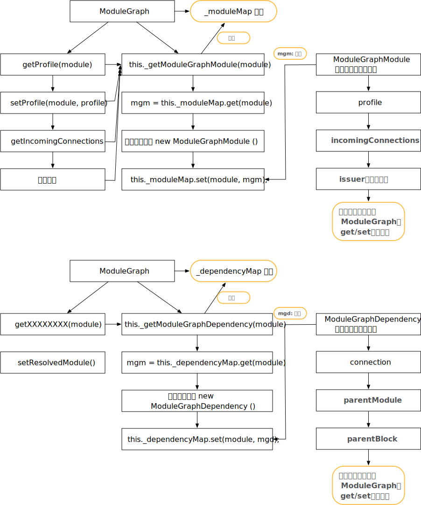
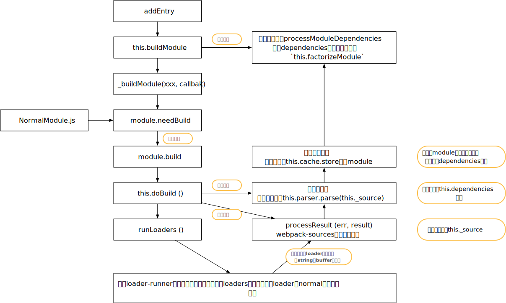
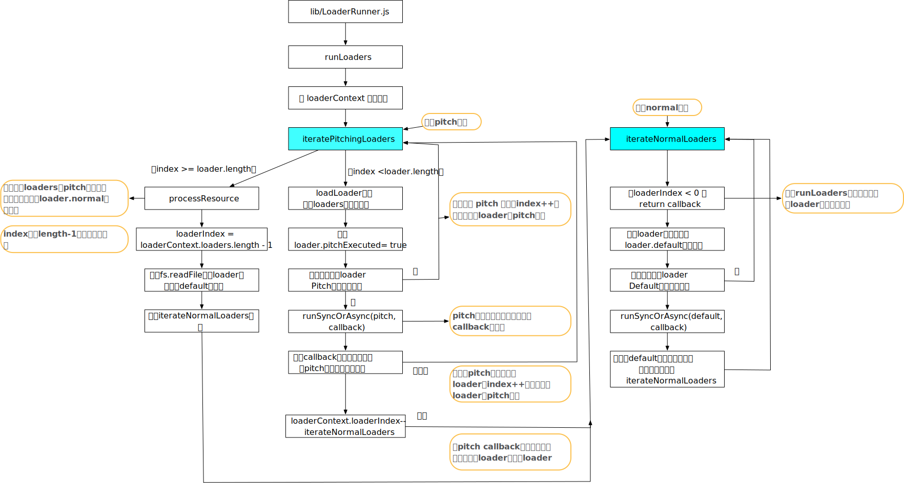

# 概述

1. 再回顾下`addEntry`，关键的3个步骤，`factorizeQueue`主要处理的是resolve

   ```javascript
   addEntry(context, entry, optionsOrName, callback) {
     this.factorizeQueue.add(options, (err, newModule) => {
       this.addModuleQueue.add(newModule, (err, module) => {
         this.buildQueue.add(module, err => {
           // 根据不同逻辑，最终会调用 callback
         });
       });
     });
   })
   ```

2. 特别注意：很多hook，写 no tap func，表示当前调试代码，当前hook没有绑定函数，可能不同配置就会有，但不影响主流程

#  ModuleGraph



1. `ModuleGraph` 主要两个属性`_moduleMap与_dependencyMap`
2. 主要操作这两个属性的方法是`_getModuleGraphModule与_getModuleGraphDependency`
3. 前者存储module 与 `new ModuleGraphModule()`关系，后者存储`dependency与new ModuleGraphDependency()`关系

# `_addModule`函数

1. 上接上文，`factorizeQueue`执行完，会执行`addModuleQueue`，即执行`_addModule`函数，`_addModule`传入参数`newModule`是`createdModule = new NormalModule(createData)`

2. `createData`是`resolve`阶段解析的最终结果，包含了 绝对路径、适用的module等；`NormalModule在NormalModule.js`

3. 执行`_addModule`函数

   ```javascript
   _addModule(module, callback) {
     // 获取 module.identifier() => return this.request
     const identifier = module.identifier();
     // this._modules =  new Map();
     const alreadyAddedModule = this._modules.get(identifier);
     // 是否被`this._modules`缓存，如果有则直接返回
     if (alreadyAddedModule) {
       return callback(null, alreadyAddedModule);
     }
   	// this.moduleGraph.getProfile(module) = mgm.profile
     const currentProfile = this.profile
     ? this.moduleGraph.getProfile(module)
     : undefined;
     if (currentProfile !== undefined) {
       // this.profile 是ModuleProfile实例，主要用于记录时间， markRestoringStart = Date.now()
       currentProfile.markRestoringStart();
     }
     const cacheName = `${this.compilerPath}/module/${identifier}`;
     this.cache.get(cacheName, null, (err, cacheModule) => {
       // 回调。。。
     });
   }
   ```

   - 最后调用`this.cache.get`，这个函数在上篇已介绍过，主要是先通过`MemoryCachePlugin`将缓存设置的方法push到`gotHandlers`中（可简单理解为，缓存下，然后调用callback）

4. 缓存处理完，会继续执行`this.cache.get`回调

   ```javascript
   _addModule(module, callback) {
   		const cacheName = `${this.compilerPath}/module/${identifier}`;
   		this.cache.get(cacheName, null, (err, cacheModule) => {
   			if (currentProfile !== undefined) {
   				currentProfile.markRestoringEnd();
   				currentProfile.markIntegrationStart();
   			}
         // 如果存在缓存module，更新module
   			if (cacheModule) {
   				cacheModule.updateCacheModule(module);
   				module = cacheModule;
   			}
   			this._modules.set(identifier, module);
   			// this.modules = new Set
   			this.modules.add(module);
         // 当前：moduleGraphForModuleMap.set(module, moduleGraph);
   			ModuleGraph.setModuleGraphForModule(module, this.moduleGraph);
   			if (currentProfile !== undefined) {
   				currentProfile.markIntegrationEnd();
   			}
   			callback(null, module);
   		});
   	}
   ```

   - 这个回调，主要是分别在`this._modules`这个Map，`this.modules`这个Set集合，缓存module
   - 注意：此时callback的第二参数还是module
   
5. `_addModule`关键是判断是否有缓存，如有用缓存更新module，根据前文介绍，`this.addModule`实际是执行`_addModule`,`_addModule`全部执行完，会执行`this.addModule`的回调函数

   ```javascript
   addEntry(context, entry, optionsOrName, callback) {
     this.factorizeModule(options, (err, newModule) => {
       // 如果没module缓存，实际newModule === module
       this.addModule(newModule, (err, module) => {
         for (let i = 0; i < dependencies.length; i++) {
           const dependency = dependencies[i];
           // 主要逻辑是：获取module.incomingConnections 绑定在dependency.connection上
           // 在module.outgoingConnections 绑定connection = new ModuleGraphConnection
           // 简单理解就是：建立dependency与module联系
           moduleGraph.setResolvedModule(originModule, dependency, module);
         }
   			// 设置 module.issuer 值
         moduleGraph.setIssuerIfUnset(
           module,
           originModule !== undefined ? originModule : null
         );
         if (module !== newModule) {
           if (currentProfile !== undefined) {
             const otherProfile = moduleGraph.getProfile(module);
             if (otherProfile !== undefined) {
               currentProfile.mergeInto(otherProfile);
             } else {
               moduleGraph.setProfile(module, currentProfile);
             }
           }
         }
         // Check for cycles when build is trigger inside another build
         // 检查build触发了另一build的情况
         let creatingModuleDuringBuildSet = undefined;
         if (!recursive && this.buildQueue.isProcessing(originModule)) {
   				// 省略
         }
         this.buildQueue.add(module, err => {
           // 根据不同逻辑，最终会调用 callback
         });
       });
     });
   })
   ```

   - 回调函数，主要是建立dependency与module关系（并不是为module.dependencies赋值），而是为 `module.outgoningConnections`与`dependency.connection`
   - 具体何用。。还要等后续。。。。。。。

### 小结

1. 主要是缓存module数据

2. 在`_modules`这个Map中，缓存：`this._modules.set(identifier, module);`

3. 在`modules`这个Set中，缓存：`this.modules.add(module);`

4. 在`compiler.cache`（`MemoryCachePlugin.js`），缓存：`cacheName = {this.compilerPath}/module/​{identifier};`

5. 在`ModuleGraph`这个WeekMap，缓存：`ModuleGraph.setModuleGraphForModule(module, this.moduleGraph);`

6. 判断是否缓存了module，如缓存则update

7. 由于，`_addModule`最终调用`callback(null,module)`，故后续函数的入参还是module

   

# buildQueue

## 流程图



1. `_addModule`执行完，回到概述1中，会执行`this.buildQueue.add`，即进入`_buildModule`

   ```javascript
   _buildModule(module, callback) {
     // 用profile标记时间
     const currentProfile = this.profile
     ? this.moduleGraph.getProfile(module)
     : undefined;
     if (currentProfile !== undefined) {
       currentProfile.markBuildingStart();
     }
     module.needBuild(
       {
         fileSystemInfo: this.fileSystemInfo
       },
       (err, needBuild) => {
         // 回调函数
       }
     );
   }
   ```

   - 根据上文可知，`module`是`NormalModule.js`实例，`needBuild`伪代码：

     ```javascript
     needBuild({ fileSystemInfo }, callback) {
       if (this._forceBuild) return callback(null, true);
       if (this.error) return callback(null, true);
       if (!this.buildInfo.cacheable) return callback(null, true);
       if (!this.buildInfo.snapshot) return callback(null, true);
       fileSystemInfo.checkSnapshotValid(this.buildInfo.snapshot, (err, valid) => {
         callback(err, !valid);
       });
     }
     ```
     
     - 主要是判断是否需要执行build操作（回调函数），满足一定条件，执行回调函数
     - 补：虽然都是`return callback(null, true)`，但if条件没被合并，可能是为了每行注释，各个条件是什么意思

2. 然后进入`needBuild`回调函数中

   ```javascript
   module.needBuild( { fileSystemInfo: this.fileSystemInfo },
     (err, needBuild) => {
       // 1. 首先处理错误与needBuild 为false的情况
       if (err) return callback(err);
       if (!needBuild) {
         if (currentProfile !== undefined) {
           currentProfile.markBuildingEnd();
         }
         this.hooks.stillValidModule.call(module);
         return callback();
       }
   		// 执行 buildModule  钩子， no tap func
       this.hooks.buildModule.call(module);
       // builtModules 缓存 module， 没发现builtModules的使用
       this.builtModules.add(module);
     	// 执行`module.build`方法
       module.build(
         this.options,
         this,
         // 获取  resolver，上篇文章有介绍
         this.resolverFactory.get("normal", module.resolveOptions),
         this.inputFileSystem,
         err => {}
       )
     }
   );
   ```

3. `module.build`方法，初始化一些值，然后执行`this.doBuild`

   ```javascript
   build(options, compilation, resolver, fs, callback) {
     this._forceBuild = false;
     this._source = null;
     if (this._sourceSizes !== undefined) this._sourceSizes.clear();
     this._ast = null;
     this.error = null;
     this.clearWarningsAndErrors();
     this.clearDependenciesAndBlocks();
     this.buildMeta = {};
     this.buildInfo = {
       cacheable: false,
       parsed: true,
       fileDependencies: undefined,
       contextDependencies: undefined,
       missingDependencies: undefined,
       hash: undefined,
       assets: undefined,
       assetsInfo: undefined
     };
     return this.doBuild(options, compilation, resolver, fs, err => {
       // 回调函数
     }
   }
   ```

4. 进入<a id="doBuild">`doBuild`</a>

   ```javascript
   doBuild(options, compilation, resolver, fs, callback) {
     // 用`createLoaderContext`创建`loadeerContext`
     const loaderContext = this.createLoaderContext(
       resolver,
       options,
       compilation,
       fs
     );
     const startTime = Date.now();
     // 会在runLoaders 回调中使用
     const processResult = (err, result) => {};
     runLoaders(
       {
         resource: this.resource,
         loaders: this.loaders,
         context: loaderContext,
         readResource: fs.readFile.bind(fs)
       },
       (err, result) => {
         // 回调函数
       }
     );
   }
   ```

   - `createLoaderContext` 伪代码为：

     ```javascript
     createLoaderContext(resolver, options, compilation, fs) {
       // 构建 loaderContext
       // 字段含义介绍：https://webpack.docschina.org/api/loaders/#the-loader-context
       const loaderContext = {
       };
       NormalModule.getCompilationHooks(compilation).loader.call(
         loaderContext,
         this
       );
       if (options.loader) {
         Object.assign(loaderContext, options.loader);
       }
       return loaderContext;
     }
     ```

     - 利用`NormalModule.getCompilationHooks` 缓存`compilation`的hooks

       ```javascript
       static getCompilationHooks(compilation) {
         let hooks = compilationHooksMap.get(compilation);
         if (hooks === undefined) {
           hooks = {
             loader: new SyncHook(["loaderContext", "module"])
           };
           compilationHooksMap.set(compilation, hooks);
         }
         return hooks;
       }
       ```

6. `loaderContext`获得后，会执行`runLoaders`函数，这个函数由独立的npm包`loader-runner`提供

   


## runLoaders

### 内部运行逻辑

1. `runLoaders`主要是执行一个文件适用的loaders，根据loader配置介绍，loader`执行是从右到左的，pitch函数是从左到右的（这个执行顺序原因后面会介绍），如配置的loader序列是：a,b,c 实际的执行是

   ```javascript
|- a-loader `pitch`
     |- b-loader `pitch`
       |- c-loader `pitch`
         |- requested module is picked up as a dependency
       |- c-loader normal execution
     |- b-loader normal execution
   |- a-loader normal execution
   ```
   
   - 这些 pitch 函数并不是用来实际处理 module 的内容的，主要是可以利用 module 的 request，来做一些拦截处理的工作，从而达到在 loader 处理流程当中的一些定制化的处理需要
   
   - `pitch`函数功能详细介绍在：https://webpack.docschina.org/api/loaders/#pitching-loader
   - 因此，整个过程可以简单理解先处理pitch函数，然后处理module内容（我们称为raw函数），在满足某些pitch函数条件时，跳过raw函数执行
   
2. 我们可以先来看一下程序流程图：

   

   - 主入口文件：`runLoaders`，先为 loaderContext 配置属性，然后就是涉及主要流程的两个函数
   - `iteratePitchingLoaders`：循环pitch函数，每次对loaders数组，index ++，即正向处理pitch函数；处理完或pitch存在返回值，则跳到`iterateNormalLoaders`，处理loader主内容
   - `iterateNormalLoaders`：循环loader的default函数（主内容），逻辑与`iteratePitchingLoaders`基本类似，只是此时是从len 逐步--操作，执行到0，会调用callback，完成整个runloader操作
   - 因此，整个函数逻辑并不复杂，如不想看实现细节，下面其实不用看

3. 源码实现：`runLoaders`内部主要逻辑可分为3块

   - 首先初始化变量

     ```javascript
     exports.runLoaders = function runLoaders(options, callback) {
     	// read options
     	// request 指的js文件请求的文件：如import Styles from 'style-loader!css-loader?modules!./styles.css';
     	var resource = options.resource || ""; // resource 指的是最终的资源（./styles.css';），模块的路径
     	var loaders = options.loaders || []; //  模块所需要使用的 loaders
     	var loaderContext = options.context || {}; // 外部createLoaderContext创建上下文环境
     	var readResource = options.readResource || readFile; // fs.readFile.bind(fs)
     
     	//
     	var splittedResource = resource && splitQuery(resource); // 按 ？将resource分隔为数组
     	var resourcePath = splittedResource ? splittedResource[0] : undefined;
     	var resourceQuery = splittedResource ? splittedResource[1] : undefined;
     	var contextDirectory = resourcePath ? dirname(resourcePath) : null; // 将path路径规范化
     
     	// execution state
     	var requestCacheable = true;
       var fileDependencies = [];
     	var contextDependencies = [];
     	var missingDependencies = [];
     }
     ```

   - 准备`loaders`对象，`request`属性具有getter与setter，

     ```javascript
     loaders = loaders.map(loader => {
       var obj = {
         path: null,
         query: null,
         normalExecuted: false
         // 等等
       };
       Object.defineProperty(obj, "request", {
         enumerable: true,
         get: function() {
           return obj.path + obj.query;
         },
         set: function(value) {
         }
       });
       obj.request = loader;
       if(Object.preventExtensions) {
         Object.preventExtensions(obj);
       }
       return obj;
     });
     ```

   - 为`loaderContext`扩展属性

     ```javascript
     loaderContext.context = contextDirectory;
     loaderContext.loaderIndex = 0;
     loaderContext.loaders = loaders;
     loaderContext.resourcePath = resourcePath;
     loaderContext.resourceQuery = resourceQuery;
     loaderContext.async = null;
     loaderContext.callback = null;
     loaderContext.cacheable = function cacheable(flag) {};
     // 等等
     ```

   - 为`loaderContext`某些属性设置`getter`与`setter`

     ```javascript
     Object.defineProperty(loaderContext, "request", {
       enumerable: true,
       get: function() {
         return loaderContext.loaders.map(function(o) {
           return o.request;
         }).concat(loaderContext.resource || "").join("!");
       }
     });
     Object.defineProperty(loaderContext, "remainingRequest", {});
     Object.defineProperty(loaderContext, "currentRequest", {});
     Object.defineProperty(loaderContext, "previousRequest", {});
     Object.defineProperty(loaderContext, "query", {});
     Object.defineProperty(loaderContext, "data", {});
     ```

   - 最后调用`iteratePitchingLoaders`，执行每个`loader`的 `pitch`函数

     ```javascript
     iteratePitchingLoaders(processOptions, loaderContext, function(err, result) {}
     ```

4. 进入`iteratePitchingLoaders`函数，我们先假设当前解析文件需要`loader`处理，loaders数组为abc，即`loaders.length = 3 > 0`

   ```javascript
   function iteratePitchingLoaders(options, loaderContext, callback) {
   	// loaderContext.loaderIndex ：初始值为0，
   	// loaderContext.loaders 当前文件需要执行的loader数组，
   	if(loaderContext.loaderIndex >= loaderContext.loaders.length)
   		return processResource(options, loaderContext, callback);
   
     var currentLoaderObject = loaderContext.loaders[loaderContext.loaderIndex];
   
   	// iterate,在后面loadLoader中会将currentLoaderObject.pitchExecuted赋值为true
     // 即如不存在pitch函数，会进入这里，将index++，执行下一个loader
   	if(currentLoaderObject.pitchExecuted) {
   		loaderContext.loaderIndex++;
   		return iteratePitchingLoaders(options, loaderContext, callback);
   	}
   
   	// load loader module
   	loadLoader(currentLoaderObject, function(err) {
   	});
   }
   ```

   - 根据上述流程图：`processResource`可以认为是执行 loader.default函数的入口

   - 执行`loadLoader`，这个方法就是获取loader内容

     ```javascript
     module.exports = function loadLoader(loader, callback) {
     	try {
         // 利用`require`获取 loader 文件内容
     		var module = require(loader.path);
     	} catch(e) {
         // 处理可能出现的错误
     	}
       // 导入的模块module必须是function或 object
     	if(typeof module !== "function" && typeof module !== "object") {}
     	loader.normal = typeof module === "function" ? module : module.default;
     	loader.pitch = module.pitch;
     	loader.raw = module.raw;
       // 要求loader里面 normal 与  pitch 两者都必须是function
     	if(typeof loader.normal !== "function" && typeof loader.pitch !== "function") {}
     	callback();
     };
     ```

   - 执行完回到`loadLoader`的回调函数

     ```javascript
     loadLoader(currentLoaderObject, function(err) {
       var fn = currentLoaderObject.pitch;
       // 标记当前执行对象已经处理了pitch函数
       currentLoaderObject.pitchExecuted = true;
       // 不存在pitch函数，则直接执行iteratePitchingLoaders
       if(!fn) return iteratePitchingLoaders(options, loaderContext, callback);
     
       runSyncOrAsync(
         fn,
         loaderContext, [loaderContext.remainingRequest, loaderContext.previousRequest, currentLoaderObject.data = {}],
         function(err) {
         }
       );
     });
     ```
     
   - 如果module不存在`pitch`函数，执行`iteratePitchingLoaders`函数，执行loaders数组的下一项
     
   - 如果module存在pitch函数，则执行`runSyncOrAsync`，执行pitch函数，获取执行结果
     
       ```javascript
       function runSyncOrAsync(fn, context, args, callback) {
         var isSync = true; // 是否同步
         var isDone = false;
         var isError = false; // internal error
         var reportedError = false;
         // context.async，context.callback 在3 中初始值被设为null，此处对两个变量赋值
         context.async = function async() {};
         var innerCallback = context.callback = function() {};
         try {
           // fn为module的pitch 方法
           var result = (function LOADER_EXECUTION() {
             return fn.apply(context, args);
           }());
           // 同步情况下
           if(isSync) {
             isDone = true;
             // 如果 loader 执行后没有返回值，执行 callback 开始下一个 loader 执行
             if(result === undefined)
               return callback();
             //  loader 返回值为一个 promise 实例，待这个实例被resolve或者reject后执行下一个 loader。
             if(result && typeof result === "object" && typeof result.then === "function") {
               return result.then(function(r) {
                 callback(null, r);
               }, callback);
             }
             // 如果 loader 执行后有返回值，执行 callback 开始下一个 loader 执行
             return callback(null, result);
           }
         } catch(e) {}
       }
     ```
     
       - 重点是：`var result = ((function LOADER_EXECUTION){....}())`，这个子执行函数，获取pitch函数执行结果
     
   - 回到`runSyncOrAsync`回调函数中，注意这个函数在pitch函数处理时使用，在后面normal函数处理时还会使用

     ```javascript
     runSyncOrAsync(
       fn,
       loaderContext, [],
       function(err) {
         if(err) return callback(err);
         var args = Array.prototype.slice.call(arguments, 1);
         // 通过webpack注释，这块的逻辑主要是判断arguments，即判断` module.pitch` 的返回值
         // Determine whether to continue the pitching process based on
         // argument values (as opposed to argument presence) in order
         // to support synchronous and asynchronous usages.
         var hasArg = args.some(function(value) {
           return value !== undefined;
         });
         // 如有返回值，则 -- ，比如abc 三个loader，此时执行到b的pitch函数，即index=1，如果存在返回值，则 index =0，执行normalLoaders的迭代，意味着，跳过了c的pitch函数，以及cb的normal阶段
         if(hasArg) {
           loaderContext.loaderIndex--;
           iterateNormalLoaders(options, loaderContext, args, callback);
         } else {
           // 如无返回值时，则`hasArg = false`，继续执行`iteratePitchingLoaders`，即会执行下一个loader的pitch函数
           iteratePitchingLoaders(options, loaderContext, callback);
         }
       }
     );
     ```

5. `iterateNormalLoaders`的处理逻辑与`iteratePitchingLoaders`很相似，只是index为递减操作

  ```javascript
  function iterateNormalLoaders(options, loaderContext, args, callback) {
    // index < 0 表示整个loaders全部处理完
  	if(loaderContext.loaderIndex < 0)
  		return callback(null, args);
  
  	var currentLoaderObject = loaderContext.loaders[loaderContext.loaderIndex];
  
  	// 如果当前obj已经被处理过
  	if(currentLoaderObject.normalExecuted) {
  		loaderContext.loaderIndex--;
  		return iterateNormalLoaders(options, loaderContext, args, callback);
  	}
  
  	var fn = currentLoaderObject.normal;
  	currentLoaderObject.normalExecuted = true;
    // 如果当前loader未配置noraml函数
  	if(!fn) {
  		return iterateNormalLoaders(options, loaderContext, args, callback);
  	}
  	// 此时的args，实际是上一个loader normal函数的返回结果，
    // currentLoaderObject.raw 是 loader 的default函数（根据4中介绍）
  	convertArgs(args, currentLoaderObject.raw);
  
  	runSyncOrAsync(fn, loaderContext, args, function(err) {
  		if(err) return callback(err);
  	
  		var args = Array.prototype.slice.call(arguments, 1);
  		iterateNormalLoaders(options, loaderContext, args, callback);
  	});
  }
  ```

  - `convertArgs`伪代码：

    ```javascript
    function convertArgs(args, raw) {
    	if(!raw && Buffer.isBuffer(args[0]))
    		args[0] = utf8BufferToString(args[0]);
    	else if(raw && typeof args[0] === "string")
    		args[0] = Buffer.from(args[0], "utf-8");
    }
    ```

6. loaders全部pitch函数与normal函数处理完后，又回到了3中最后一步，调用`iteratePitchingLoaders`的回调函数中

   ```javascript
   iteratePitchingLoaders(processOptions, loaderContext, function(err, result) {
     if(err) {
       return callback(err, {});
     }
     // 最终这个result，应该是第一个loader noraml的返回结果（因为loader normal函数是逆序处理）
     // 这个结果并没有被 类似convertArgs 做数据转换
     callback(null, {
       result: result,
       resourceBuffer: processOptions.resourceBuffer,
       cacheable: requestCacheable,
       fileDependencies: fileDependencies,
       contextDependencies: contextDependencies,
       missingDependencies: missingDependencies
     });
   });
   ```

### 小结

1. 由于是顺序执行pitch函数以及逆序执行normal函数，故最终返回的结果是第一个loader的normal函数执行结果，这个结果并未做数据转换，后面会通过`webpack-sources`包，转换结果
2. 返回值的`result.result`，保存了normal函数的处理结果


## 回调函数

1. `runLoaders`回调函数

   ```javascript
   runLoaders( { },(err, result) => {
     for (const loader of this.loaders) {
       compilation.buildDependencies.add(loader.loader);
     }
     // 将result的相关信息，保存在`this.buildInfo`中
     this.buildInfo.fileDependencies = new Set(result.fileDependencies);
     this.buildInfo.contextDependencies = new Set(result.contextDependencies);
     this.buildInfo.missingDependencies = new Set(result.missingDependencies);
     if (!result.cacheable) {
       this.buildInfo.cacheable = false;
       processResult(err, result.result);
       return;
     }
     this.buildInfo.cacheable = true;
     // `compilation.fileSystemInfo.createSnapshot`先跳过，不影响主流程
     compilation.fileSystemInfo.createSnapshot((err2, snapshot) => {
       this.buildInfo.snapshot = snapshot;
       // 处理结果
       processResult(err || err2, result.result);
     });
   });
   ```

   - 会在`createSnapshot`的回调函数中，调用`processRusult`函数，处理loader处理的结果

     ```javascript
     const processResult = (err, result) => {
       // result为何是数组：在`runSyncOrAsync`回调函数中，使用Array.prototype.slice.call(arguments, 1);获取的args作为result
       const source = result[0];
       const sourceMap = result.length >= 1 ? result[1] : null;
       const extraInfo = result.length >= 2 ? result[2] : null;
     	// 如果resource不是Buffer或string，会报错
       if (!Buffer.isBuffer(source) && typeof source !== "string") {
       }
       // this.createSource会使用webpack-sources这个库，将source进行处理（如转为 utf-8）
       this._source = this.createSource();
       if (this._sourceSizes !== undefined) this._sourceSizes.clear();
       this._ast =
         typeof extraInfo === "object" &&
         extraInfo !== null &&
         extraInfo.webpackAST !== undefined
         ? extraInfo.webpackAST
       : null;
       return callback();
     };
     ```
     
   - `this.createSource`，会根据不同条件，调用`webpack-sources`库中的`new SourceMapSource`或`new OriginalSource`或`new RawSource`， 因此`this._source`为这几其中一个类的实例

2. 执行callback回到[`doBuild`](#doBuild)的回调函数中

   ```javascript
   build(options, compilation, resolver, fs, callback) {
     return this.doBuild(options, compilation, resolver, fs, err => {
       this._cachedCodeGenerationHash = "";
       this._cachedCodeGeneration = undefined;
       // 如果当前module配置了noParse，则直接 return
       const noParseRule = options.module && options.module.noParse;
       if (this.shouldPreventParsing(noParseRule, this.request)) {
         this.buildInfo.parsed = false;
         this._initBuildHash(compilation);
         return callback();
       }
   
       const handleParseError = e => {};
       // 对`this.dependencies`进行sort 
       // 特别注意：这个result结果并未被使用，但`JavascriptParser.js`会填充`this.dependencies`
       const handleParseResult = result => {
         this.dependencies.sort(
           concatComparators(
             compareSelect(a => a.loc, compareLocations),
             keepOriginalOrder(this.dependencies)
           )
         );
         this._lastSuccessfulBuildMeta = this.buildMeta;
         this._initBuildHash(compilation);
         return callback();
       };
   
       let result;
       try {
         // lib/javascript/JavascriptParser.js，
         // 利用`JavascriptParser.js`进行 parse
         result = this.parser.parse(this._ast || this._source.source(), {
           current: this,
           module: this,
           compilation: compilation,
           options: options
         });
       } catch (e) {
         handleParseError(e);
         return;
       }
       handleParseResult(result);
     });
   }
   
   ```

   - `doBuild`这个回调函数关键是利用`parser`去解析结果，我们看下parse简单实现：

     ```javascript
     // lib/javascript/JavascriptParser.js，
     parse(source, state) {
       let ast;
       let comments;
       const semicolons = new Set();
       if (Buffer.isBuffer(source)) {
         source = source.toString("utf-8");
       }
       if (typeof source === "object") {
         ast = (source);
         comments = source.comments;
       } else {
         comments = [];
         // 简单理解，内部使用 acorn 这个包，获取source的ast结果
         ast = JavascriptParser.parse(source, {
           sourceType: this.sourceType,
           onComment: comments,
           onInsertedSemicolon: pos => semicolons.add(pos)
         });
       }
       // 省略。。为this.xxxxx赋值
       if (this.hooks.program.call(ast, comments) === undefined) {
         this.detectMode(ast.body);
         this.preWalkStatements(ast.body);
         this.blockPreWalkStatements(ast.body);
         this.walkStatements(ast.body);
       }
       this.hooks.finish.call(ast, comments);
       return state;
     }
     ```

     - 内部具体逻辑不再详看，主要了解，1，整个函数返回的state是以复杂对象，包含了很多信息；2、在blockPreWalkStatements中，会针对`import xxxxx字符串，为`this.dependencies`push内容，

   - 再次强调，特别特别注意：`this.parser.parse`执行前`this.dependencies = []`,  parse会对此数组赋值，processResult并未使用 parse的最终结果result

3. 进入`module.build`的回调函数

   ```javascript
   _buildModule(module, callback) {
     module.needBuild({},(err, needBuild) => {
       module.build(
         this.options,
         this,
         this.resolverFactory.get("normal", module.resolveOptions),
         this.inputFileSystem,
         err => {
           // currentProfile记录一下 编译，存储等时间信息
           if (currentProfile !== undefined) {
             currentProfile.markBuildingEnd();
           }
           if (currentProfile !== undefined) {
             currentProfile.markStoringStart();
           }
           // 缓存module
           this.cache.store(
             `${this.compilerPath}/module/${module.identifier()}`,
             null,
             module,
             err => {
               if (currentProfile !== undefined) {
                 currentProfile.markStoringEnd();
               }
               this.hooks.succeedModule.call(module);
               return callback();
             }
           );
         }
       );
     });
   }
   ```

   - 此时，缓存的module，带有了dependencies参数，即每个文件的import等，会被认为是当前module的依赖

4. 回到`buildModule`的回到函数中

   ```javascript
   this.buildModule(module, err => {
     // 省略错误处理。。。
     this.processModuleDependencies(module, err => {
       if (err) {
         return callback(err);
       }
       callback(null, module);
     });
   });
```
   
   - 经过上述一连串处理，实际是给` module.dependencies` 赋值了一个已经排序的数组
   - 进入`buildModule`回调函数，执行`_processModuleDependencies`


### processModuleDependencies

1. `this.processModuleDependencies`执行的套路，还是会执行`this.processDependenciesQueue`，跟上面一样，会去执行`_this._processModuleDependencies`函数

2. `__processModuleDependencies`，首先是对依赖进行处理，即执行`processDependenciesBlock`

   ```javascript
   _processModuleDependencies(module, callback) {
     const dependencies = new Map();
     const sortedDependencies = [];
     let currentBlock = module;
     const processDependency = dep => { };
     const processDependenciesBlock = block => {
       if (block.dependencies) {
         currentBlock = block;
         for (const dep of block.dependencies) processDependency(dep);
       }
       if (block.blocks) {
         for (const b of block.blocks) processDependenciesBlock(b);
       }
     };
   
     try {
       processDependenciesBlock(module);
     } catch (e) {
       return callback(e);
     }
   }
   ```

   - `processDependenciesBlock` 将blocks进行递归，每个`dependencies`都要经过 `processDependency`处理
   - blocks数组可以理解为异步引入的模块，这些都是在模块build过程中生成的

3. `processDependency`做了什么，主要是为`this.moduleGraph,dependencies，sortedDependencies`赋值

   ```javascript
   let factoryCacheKey;
   const dependencies = new Map();
   const sortedDependencies = [];
   const processDependency = dep => {
     // 为当前的dependency设置 parentBlock与 parentModule
     this.moduleGraph.setParents(dep, currentBlock, module);
     // resourceIdent = `module${this.request}`
     const resourceIdent = dep.getResourceIdentifier();
     if (resourceIdent) {
       // dep 是在lib/javascript/JavascriptParser.js 过程中，实例化的，如HarmonyImportSideEffectDependency
       const constructor = dep.constructor;
       let innerMap;
       let factory;
       if (factoryCacheKey === constructor) {
         innerMap = factoryCacheValue;
         if (listCacheKey === resourceIdent) {
           listCacheValue.push(dep);
           return;
         }
       } else {
         factory = this.dependencyFactories.get(dep.constructor);
         if (factory === undefined) {
           throw new Error(
             `No module factory available for dependency type: ${dep.constructor.name}`
           );
         }
         // 可以理解构造了这样一个数据结构
         /**
         	*  dependencies{facotory{resourceIdent, [dep,dep,dep] }}
         	*  可以理解为，将相同类型的factory与resourceIdent 的 dep，放在一个list中
         	*/
         innerMap = dependencies.get(factory);
         if (innerMap === undefined) {
           dependencies.set(factory, (innerMap = new Map()));
         }
         factoryCacheKey = constructor;
         factoryCacheValue = innerMap;
         factoryCacheValue2 = factory;
       }
       let list = innerMap.get(resourceIdent);
       if (list === undefined) {
         innerMap.set(resourceIdent, (list = []));
         // 重点, 注意push 到sortedDependencies.dependencies 是 多个dep数组
         sortedDependencies.push({
           factory: factoryCacheValue2,
           dependencies: list,
           originModule: module
         });
       }
       list.push(dep);
       listCacheKey = resourceIdent;
       listCacheValue = list;
     }
   };
   ```

   - `dependencies`辅助生成`sortedDependencies.dependencies`，根据dependencies， 其实是 `fatctory与resourceIndent都相同时的 dep`，才会push到`sortedDependencies`对应的list中
   - 经过build等过程，import内容会被作为a.js的`dependencies`，异步加载c.js会被作为blocks，
   - 同样对于`b.js`，也import和requ`dependencies`不一定只有一个，而可能是多个（build过程中的parse导致的）
   - 而每一个dep，都是有某个factory生成的，因此`sortedDependencies` 存储了 某个 factory 对应的 dep

4. `sortedDependencies`数组生成后，会利用`asyncLib`异步库，循环处理

   ```javascript
   asyncLib.forEach(
     sortedDependencies,
     (item, callback) => {
       this.handleModuleCreation(item, err => {
         callback();
       });
     },
     err => {
       this.processDependenciesQueue.decreaseParallelism();
       return callback(err);
     }
   );
   ```

   - 利用`asyncLib`异步库，循环`sortedDependencies`，针对每一项，执行`this.handleModuleCreation`
   - 而这个方法内部会执行`this.factorizeModule()`，即又回到开头的流程，继续反复，将所有dependency处理完


### 小结

1. 整个回调阶段最，重要的是`processModuleDependencies`处理，是将当前module通过buildqueue解析的dependencies，进行数据整合，形成`sortedDependencies`
2. 主要是为了方便后序递归迭代操作
3. 上述过程循环反复，将全部import处理完后，整个`complier.hooks.make`阶段结束


# 后续

1. 这个之后，可以看一下vue-loader的基本实现原理，了解一个loader的实现，在vue/vueFramework/vue-laoder


# 问题

1. 入口是index.js，那么接下来。index.js里面引入的文件是从啥时候开始操作的

   - 进入loader解析后，会将文件内的所有import，全部转为为dependency
   - 然后逐一循环，利用loader进行处理

2. 如何pitch函数阻塞loader执行的？？？

   - `iteratePitchingLoaders`函数可以看出，如果pitch无返回结果，会再次执行iteratePitchingLoaders，即循环下一个loader的pitch函数

   - 如果存在result，则会

     ```javascript
     loaderContext.loaderIndex--;
     iterateNormalLoaders(options, loaderContext, args, callback);
     ```

     - pitch函数执行阶段，loaderIndex = 0 ， 故执行`iterateNormalLoaders`会直接return，执行各个回调


