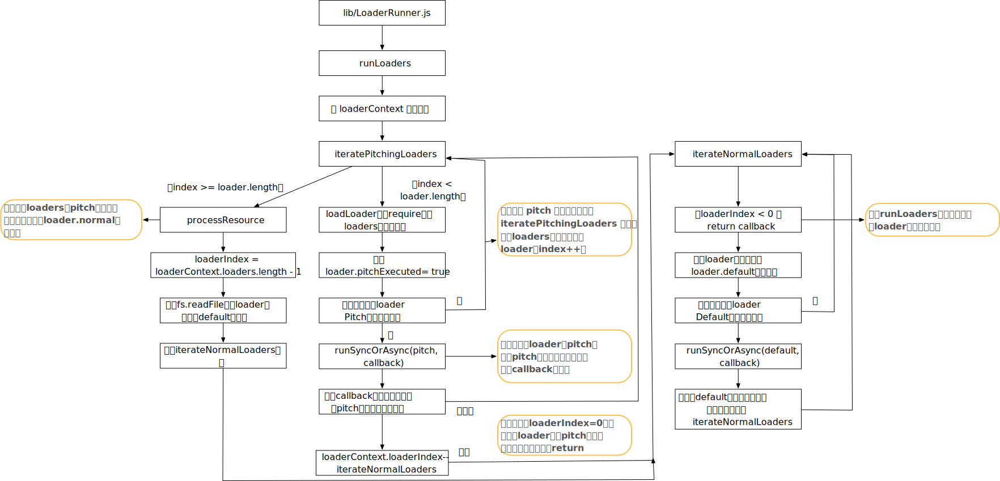

# 哦吼

1. 如下：

   ```javascript
   if (list === undefined) {
     sortedDependencies.push({
       factory: factoryCacheValue2,
       dependencies: list,
       originModule: module
     });
   }
   list.push(dep);
   ```

   - list为数组，利用数组，可以实现factory是相同情况下，不同dep，push到数组不同位置
   - 但需要一个map作为辅助

# 概述

1. 再回顾下`addEntry`，关键的3个步骤，`factorizeQueue`主要处理的是resolve

   ```javascript
   addEntry(context, entry, optionsOrName, callback) {
     this.factorizeQueue.add(options, (err, newModule) => {
       this.addModuleQueue.add(newModule, (err, module) => {
         this.buildQueue.add(module, err => {
           // 根据不同逻辑，最终会调用 callback
         });
       });
     });
   })
   ```

   


## `_addModule`函数

1. 上接上文，`factorizeQueue`执行完，会执行`addModuleQueue`，即执行`_addModule`函数，`_addModule`传入参数是`createdModule = new NormalModule(createData)`

2. `createData`是`resolve`阶段解析的最终结果，包含了 绝对路径、适用的module等；`NormalModule在NormalModule.js`

3. 执行`_addModule`函数

   ```javascript
   _addModule(module, callback) {
     // 获取 module.identifier() => return this.request
     const identifier = module.identifier();
     // this._modules =  new Map();
     const alreadyAddedModule = this._modules.get(identifier);
     if (alreadyAddedModule) {
       return callback(null, alreadyAddedModule);
     }
   
     const currentProfile = this.profile
     ? this.moduleGraph.getProfile(module)
     : undefined;
     if (currentProfile !== undefined) {
       currentProfile.markRestoringStart();
     }
     const cacheName = `${this.compilerPath}/module/${identifier}`;
     this.cache.get(cacheName, null, (err, cacheModule) => {
       // 回调。。。
     });
   }
   ```

   - 主要是判断是否被`this._modules`缓存，如果有则直接返回

   - 否则会调用`this.cache.get`，这个函数在 上篇已介绍过，主要是先通过`MemoryCachePlugin`将缓存设置的方法push到gotHandlers中

     ```javascript
     get(identifier, etag, callback) {
       const gotHandlers = [];
       this.hooks.get.callAsync(identifier, etag, gotHandlers, (err, result) => {
         if (err) {
           callback(makeWebpackError(err, "Cache.hooks.get"));
           return;
         }
         if (result === null) {
           result = undefined;
         }
         if (gotHandlers.length > 1) {
           const innerCallback = needCalls(gotHandlers.length, () =>
                                           callback(null, result)
                                          );
           for (const gotHandler of gotHandlers) {
             gotHandler(result, innerCallback);
           }
         } else if (gotHandlers.length === 1) {
           gotHandlers[0](result, () => callback(null, result));
         } else {
           callback(null, result);
         }
       });
     }
     ```

     ```javascript
     compiler.cache.hooks.get.tap(
       { name: "MemoryCachePlugin", stage: Cache.STAGE_MEMORY },
       (identifier, etag, gotHandlers) => {
         const cacheEntry = cache.get(identifier);
         if (cacheEntry === null) {
           return null;
         } else if (cacheEntry !== undefined) {
           return cacheEntry.etag === etag ? cacheEntry.data : null;
         }
         gotHandlers.push((result, callback) => {
           if (result === undefined) {
             cache.set(identifier, null);
           } else {
             cache.set(identifier, { etag, data: result });
           }
           return callback();
         });
       }
     );
     ```

4. 缓存处理完，会继续执行`this.cache.get`回调

   ```javascript
   _addModule(module, callback) {
   		const cacheName = `${this.compilerPath}/module/${identifier}`;
   		this.cache.get(cacheName, null, (err, cacheModule) => {
   			if (err) return callback(new ModuleRestoreError(module, err));
   			if (currentProfile !== undefined) {
   				currentProfile.markRestoringEnd();
   				currentProfile.markIntegrationStart();
   			}
         // 更新module
   			if (cacheModule) {
   				cacheModule.updateCacheModule(module);
   				module = cacheModule;
   			}
   			this._modules.set(identifier, module);
   			// this.modules = new Set
   			this.modules.add(module);
   			ModuleGraph.setModuleGraphForModule(module, this.moduleGraph);
   			if (currentProfile !== undefined) {
   				currentProfile.markIntegrationEnd();
   			}
   			callback(null, module);
   		});
   	}
   ```

   - 这个回调，主要是分别在`this._modules`这个Map，`this.modules`这个Set集合，缓存module
   - 然后在`ModuleGraph`缓存module，主要是进行缓存？？？？？？？（）

### 小结

1. 主要是缓存数据
2. 在`_modules`这个Map中，缓存：`this._modules.set(identifier, module);`
3. 在`modules`这个Set中，缓存：`this.modules.add(module);`
4. 在`compiler.cache`（`MemoryCachePlugin.js`），缓存：`cacheName = {this.compilerPath}/module/​{identifier};`
5. 在`ModuleGraph`这个WeekMap，缓存：`ModuleGraph.setModuleGraphForModule(module, this.moduleGraph);`


## buildQueue

1. `_addModule`执行完，会执行`this.buildQueue.add`，进入`_buildModule`

   ```javascript
   _buildModule(module, callback) {
     const currentProfile = this.profile
     ? this.moduleGraph.getProfile(module)
     : undefined;
     if (currentProfile !== undefined) {
       currentProfile.markBuildingStart();
     }
     module.needBuild(
       {
         fileSystemInfo: this.fileSystemInfo
       },
       (err, needBuild) => {
         // 回调函数
       }
     );
   }
   ```

   - `module`是由`NormalModule.js`构造的，故`needBuild`逻辑是满足一些调剂则，直接执行回调

     ```javascript
     needBuild({ fileSystemInfo }, callback) {
       if (this._forceBuild) return callback(null, true);
       if (this.error) return callback(null, true);
       if (!this.buildInfo.cacheable) return callback(null, true);
       if (!this.buildInfo.snapshot) return callback(null, true);
       fileSystemInfo.checkSnapshotValid(this.buildInfo.snapshot, (err, valid) => {
         callback(err, !valid);
       });
     }
     ```

2. 然后进入`needBuild`回调函数中

   ```javascript
   module.needBuild(
     {
       fileSystemInfo: this.fileSystemInfo
     },
     (err, needBuild) => {
       // 1. 首先处理错误与needBuild 为false的情况
       if (err) return callback(err);
       if (!needBuild) {
         if (currentProfile !== undefined) {
           currentProfile.markBuildingEnd();
         }
         this.hooks.stillValidModule.call(module);
         return callback();
       }
   		// 执行 buildModule  钩子
       this.hooks.buildModule.call(module);
       // builtModules 缓存 module， 当前文件没有builtModules的使用
       this.builtModules.add(module);
       module.build(
         this.options,
         this,
         // 获取  resolver，上篇文章有介绍
         this.resolverFactory.get("normal", module.resolveOptions),
         this.inputFileSystem,
         err => {}
       )
     }
   );
   ```

   - 首先处理错误与needBuild 为false的情况
   - 执行 `buildModule` 钩子， 这个钩子tap 了一个`SourceMapDevToolModuleOptionsPlugin`，内部就是设置`module.useSourceMap = true;`
   - 然后执行`module.build`方法

3. `module.build`方法，初始化一些值，然后执行`this.doBuild`

   ```javascript
   build(options, compilation, resolver, fs, callback) {
     this._forceBuild = false;
     this._source = null;
     if (this._sourceSizes !== undefined) this._sourceSizes.clear();
     this._ast = null;
     this.error = null;
     this.clearWarningsAndErrors();
     this.clearDependenciesAndBlocks();
     this.buildMeta = {};
     this.buildInfo = {
       cacheable: false,
       parsed: true,
       fileDependencies: undefined,
       contextDependencies: undefined,
       missingDependencies: undefined,
       hash: undefined,
       assets: undefined,
       assetsInfo: undefined
     };
     return this.doBuild(options, compilation, resolver, fs, err => {
       // 回调函数
     }
   }
   ```

4. 进入<a id="doBuild">`doBuild`</a>

   ```javascript
   doBuild(options, compilation, resolver, fs, callback) {
     const loaderContext = this.createLoaderContext(
       resolver,
       options,
       compilation,
       fs
     );
     const startTime = Date.now();
     // 会在runLoaders 回调中使用
     const processResult = (err, result) => {};
     runLoaders(
       {
         resource: this.resource,
         loaders: this.loaders,
         context: loaderContext,
         readResource: fs.readFile.bind(fs)
       },
       (err, result) => {
         // 回调函数
       }
     );
   }
   ```

5. 首先利用`createLoaderContext`创建`loadeerContext`

   ```javascript
   createLoaderContext(resolver, options, compilation, fs) {
     // 字段含义介绍：https://webpack.docschina.org/api/loaders/#the-loader-context
     const loaderContext = {
     };
     NormalModule.getCompilationHooks(compilation).loader.call(
       loaderContext,
       this
     );
     if (options.loader) {
       Object.assign(loaderContext, options.loader);
     }
     return loaderContext;
   }
   ```

   - 利用`NormalModule.getCompilationHooks` 缓存`compilation`

     ```javascript
     static getCompilationHooks(compilation) {
       let hooks = compilationHooksMap.get(compilation);
       if (hooks === undefined) {
         hooks = {
           loader: new SyncHook(["loaderContext", "module"])
         };
         compilationHooksMap.set(compilation, hooks);
       }
       return hooks;
     }
     ```

6. `loaderContext`获得后，会执行`runLoaders`函数，这个函数由独立的npm包`loader-runner`提供

   


## runLoaders

### 内部运行逻辑

1. 我们先整体看一下`LoaderRunner.js`这个文件

   

   - 主入口文件：`runLoaders`
   - `iteratePitchingLoaders`：循环pitch函数
   - `iterateNormalLoaders`：循环loader的default函数（主内容），逻辑与`iteratePitchingLoaders`基本类似
     - `runSyncOrAsync`：执行 pitch或default函数
   
2. `runLoaders`内部主要逻辑可分为3块

   - 首先初始化变量

     ```javascript
     exports.runLoaders = function runLoaders(options, callback) {
     	// read options
     	// request 指的js文件请求的文件：如import Styles from 'style-loader!css-loader?modules!./styles.css';
     	var resource = options.resource || ""; // resource 指的是最终的资源（./styles.css';），模块的路径
     	var loaders = options.loaders || []; //  模块所需要使用的 loaders
     	var loaderContext = options.context || {}; // 外部createLoaderContext创建上下文环境
     	var readResource = options.readResource || readFile; // fs.readFile.bind(fs)
     
     	//
     	var splittedResource = resource && splitQuery(resource); // 按 ？将resource分隔为数组
     	var resourcePath = splittedResource ? splittedResource[0] : undefined;
     	var resourceQuery = splittedResource ? splittedResource[1] : undefined;
     	var contextDirectory = resourcePath ? dirname(resourcePath) : null; // 将path路径规范化
     
     	// execution state
     	var requestCacheable = true;
       var fileDependencies = [];
     	var contextDependencies = [];
     	var missingDependencies = [];
     }
     ```

   - 准备`loaders`对象，`request`属性具有getter与setter，

     ```javascript
     loaders = loaders.map(loader => {
       var obj = {
         path: null,
         query: null,
         normalExecuted: false
         // 等等
       };
       Object.defineProperty(obj, "request", {
         enumerable: true,
         get: function() {
           return obj.path + obj.query;
         },
         set: function(value) {
         }
       });
       obj.request = loader;
       if(Object.preventExtensions) {
         Object.preventExtensions(obj);
       }
       return obj;
     });
     ```

   - 为`loaderContext`扩展属性

     ```javascript
     loaderContext.context = contextDirectory;
     loaderContext.loaderIndex = 0;
     loaderContext.loaders = loaders;
     loaderContext.resourcePath = resourcePath;
     loaderContext.resourceQuery = resourceQuery;
     loaderContext.async = null;
     loaderContext.callback = null;
     loaderContext.cacheable = function cacheable(flag) {};
     // 等等
     ```

   - 为`loaderContext`某些属性设置`getter`与`setter`

     ```javascript
     Object.defineProperty(loaderContext, "request", {
       enumerable: true,
       get: function() {
         return loaderContext.loaders.map(function(o) {
           return o.request;
         }).concat(loaderContext.resource || "").join("!");
       }
     });
     Object.defineProperty(loaderContext, "remainingRequest", {});
     Object.defineProperty(loaderContext, "currentRequest", {});
     Object.defineProperty(loaderContext, "previousRequest", {});
     Object.defineProperty(loaderContext, "query", {});
     Object.defineProperty(loaderContext, "data", {});
     ```

   - 最后调用`iteratePitchingLoaders`，执行每个`loader`的 `pitch`函数

     ```javascript
     iteratePitchingLoaders(processOptions, loaderContext, function(err, result) {}
     ```

     - 由于`loader`执行是从右到左的，pitch函数是从左到右的，如配置的loader序列是：a,b,c 实际的执行是

       ```javascript
       |- a-loader `pitch`
         |- b-loader `pitch`
           |- c-loader `pitch`
             |- requested module is picked up as a dependency
           |- c-loader normal execution
         |- b-loader normal execution
       |- a-loader normal execution
       ```

     - 这些 pitch 函数并不是用来实际处理 module 的内容的，主要是可以利用 module 的 request，来做一些拦截处理的工作，从而达到在 loader 处理流程当中的一些定制化的处理需要

     - `pitch`函数功能详细介绍在：https://webpack.docschina.org/api/loaders/#pitching-loader

3. 进入`iteratePitchingLoaders`函数，我们先假设当前解析文件需要`loader`处理，即`loaders.length > 0`

   ```javascript
   function iteratePitchingLoaders(options, loaderContext, callback) {
   	// abort after last loader
   	// loaderContext.loaderIndex ：初始值为0
   	// 如无匹配的loaders。则loaderContext.loaders.length 为0
   	if(loaderContext.loaderIndex >= loaderContext.loaders.length)
   		return processResource(options, loaderContext, callback);
   
   	var currentLoaderObject = loaderContext.loaders[loaderContext.loaderIndex];
   
   	// iterate,在后面loadLoader中会将currentLoaderObject.pitchExecuted赋值为true
     // 即如不存在pitch函数，会进入这里，将index++，执行下一个loader
   	if(currentLoaderObject.pitchExecuted) {
   		loaderContext.loaderIndex++;
   		return iteratePitchingLoaders(options, loaderContext, callback);
   	}
   
   	// load loader module
   	loadLoader(currentLoaderObject, function(err) {
   	});
   }
   ```

   - 如果存在`loaders`，则先用`loaders[0]`作为`currentLoaderObject`

   - 根据上述流程图：`processResource`可以认为是执行 loader.default函数的入口

   - 执行`loadLoader`，这个方法就是获取loader内容

     ```javascript
     module.exports = function loadLoader(loader, callback) {
     	try {
     		var module = require(loader.path);
     	} catch(e) {
     	}
     	if(typeof module !== "function" && typeof module !== "object") {}
     	loader.normal = typeof module === "function" ? module : module.default;
     	loader.pitch = module.pitch;
     	loader.raw = module.raw;
     	if(typeof loader.normal !== "function" && typeof loader.pitch !== "function") {}
     	callback();
     };
     ```

     - 利用`require`方式获取 module 文件内容，并处理错误，要求module必须是function或 object

     - 初始化`loader.noraml`与`loader.pitch`，并要求，两者都必须是function

   - 然后回到`loadLoader`的回调函数

     ```javascript
     loadLoader(currentLoaderObject, function(err) {
       var fn = currentLoaderObject.pitch;
       currentLoaderObject.pitchExecuted = true;
       // 不存在pitch函数，则直接执行iteratePitchingLoaders
       if(!fn) return iteratePitchingLoaders(options, loaderContext, callback);
     
       runSyncOrAsync(
         fn,
         loaderContext, [loaderContext.remainingRequest, loaderContext.previousRequest, currentLoaderObject.data = {}],
         function(err) {
         }
       );
     });
     ```
     
   - 如果module不存在`pitch`函数，设置 `pitchEecuted = true`，再执行`iteratePitchingLoaders`函数，这样，会执行loaders数组的下一项
     
   - 如果module存在pitch函数，则直接执行`runSyncOrAsync`
     
       ```javascript
       function runSyncOrAsync(fn, context, args, callback) {
         var isSync = true; // 是否同步
         var isDone = false;
         var isError = false; // internal error
         var reportedError = false;
         // context.async，context.callback初始值被设为null
         context.async = function async() {};
         var innerCallback = context.callback = function() {};
         try {
           // fn为module的pitch 方法
           var result = (function LOADER_EXECUTION() {
             return fn.apply(context, args);
           }());
           // 同步情况下
           if(isSync) {
             isDone = true;
             // 如果 loader 执行后没有返回值，执行 callback 开始下一个 loader 执行
             if(result === undefined)
               return callback();
             //  loader 返回值为一个 promise 实例，待这个实例被resolve或者reject后执行下一个 loader。
             if(result && typeof result === "object" && typeof result.then === "function") {
               return result.then(function(r) {
                 callback(null, r);
               }, callback);
             }
             // 如果 loader 执行后有返回值，执行 callback 开始下一个 loader 执行
             return callback(null, result);
           }
         } catch(e) {}
       }
     ```
     
       - 先分别定义`context.async`与`context.callback`函数
     - 然后执行module的pitch函数，根据返回结果，调用callback
     
   - 回到`runSyncOrAsync`回调函数中

     ```javascript
     runSyncOrAsync(
       fn,
       loaderContext, [],
       function(err) {
         if(err) return callback(err);
         var args = Array.prototype.slice.call(arguments, 1);
         // Determine whether to continue the pitching process based on
         // argument values (as opposed to argument presence) in order
         // to support synchronous and asynchronous usages.
         var hasArg = args.some(function(value) {
           return value !== undefined;
         });
         if(hasArg) {
           loaderContext.loaderIndex--;
           iterateNormalLoaders(options, loaderContext, args, callback);
         } else {
           iteratePitchingLoaders(options, loaderContext, callback);
         }
       }
     );
     ```

     - 通过webpack注释，可以得知，这块的逻辑主要是判断arguments，即判断` module.pitch` 的返回值

     - 如无返回值时，则`hasArg = false`，执行`iteratePitchingLoaders`

     - 此时有返回值，先将`loaderContext.loaderIndex--`，然后执行`iterateNormalLoaders`

       ```javascript
       function iterateNormalLoaders(options, loaderContext, args, callback) {
       	// 如果loaders数组不存在，就会返回
       	if(loaderContext.loaderIndex < 0)
       		return callback(null, args);
         // 等等其他逻辑
       }
       ```

       - 直接会执行call，回到`iteratePitchingLoaders`函数的回调函数中
     
   - `iteratePitchingLoaders`回调函数主要是处理错误，然后调用callback，回到`runLoaders`的回调函数

     ```javascript
     iteratePitchingLoaders(processOptions, loaderContext, function(err, result) {
       if(err) {
         return callback(err, {});
       }
       callback(null, {
         result: result,
         resourceBuffer: processOptions.resourceBuffer,
         cacheable: requestCacheable,
         fileDependencies: fileDependencies,
         contextDependencies: contextDependencies,
         missingDependencies: missingDependencies
       });
     });
     ```

     - 因此，loader 的pitch函数的返回值，实际是这个result

### 回调函数

1. `runLoaders`回调函数

   ```javascript
   runLoaders( { },(err, result) => {
     for (const loader of this.loaders) {
       compilation.buildDependencies.add(loader.loader);
     }
     this.buildInfo.fileDependencies = new Set(result.fileDependencies);
     this.buildInfo.contextDependencies = new Set(result.contextDependencies);
     this.buildInfo.missingDependencies = new Set(result.missingDependencies);
     if (!result.cacheable) {
       this.buildInfo.cacheable = false;
       processResult(err, result.result);
       return;
     }
     this.buildInfo.cacheable = true;
     compilation.fileSystemInfo.createSnapshot((err2, snapshot) => {
       this.buildInfo.snapshot = snapshot;
       processResult(err || err2, result.result);
     });
   });
   ```

   - `compilation.fileSystemInfo.createSnapshot`先跳过

   - 主要是将result的信息，保存在`this.buildInfo`中，然后调用`processRusult`函数

     ```javascript
     const processResult = (err, result) => {
       // result为何是数组：在`runSyncOrAsync`回调函数中，使用Array.prototype.slice.call(arguments, 1);获取的args，最为result参数
       const source = result[0];
       const sourceMap = result.length >= 1 ? result[1] : null;
       const extraInfo = result.length >= 2 ? result[2] : null;
     	// 如果resource不是Buffer或string，会报错
       if (!Buffer.isBuffer(source) && typeof source !== "string") {
       }
       // this.createSource会使用webpack-sources这个库，将source进行处理（如转为 utf-8）
       // this._source 是一个对象
       this._source = this.createSource();
       if (this._sourceSizes !== undefined) this._sourceSizes.clear();
       this._ast =
         typeof extraInfo === "object" &&
         extraInfo !== null &&
         extraInfo.webpackAST !== undefined
         ? extraInfo.webpackAST
       : null;
       return callback();
     };
     ```

     - 根据注释的分析，`processResult`主要是将source（即result结果），通过`this.createSource`进行转换，规范下source结果
     - 在module上绑定`_source`与`_ast`这两个属性，

2. 执行callback回到[`doBuild`](#doBuild)的回调函数中

   ```javascript
   build(options, compilation, resolver, fs, callback) {
     return this.doBuild(options, compilation, resolver, fs, err => {
       this._cachedCodeGenerationHash = "";
       this._cachedCodeGeneration = undefined;
       // 如果当前module配置了noParse，则直接 return
       const noParseRule = options.module && options.module.noParse;
       if (this.shouldPreventParsing(noParseRule, this.request)) {
         this.buildInfo.parsed = false;
         this._initBuildHash(compilation);
         return callback();
       }
   
       const handleParseError = e => {};
       const handleParseResult = result => {
         this.dependencies.sort(
           concatComparators(
             compareSelect(a => a.loc, compareLocations),
             keepOriginalOrder(this.dependencies)
           )
         );
         this._lastSuccessfulBuildMeta = this.buildMeta;
         this._initBuildHash(compilation);
         return callback();
       };
   
       let result;
       try {
         // lib/javascript/JavascriptParser.js，解析出ast来
         result = this.parser.parse(this._ast || this._source.source(), {
           current: this,
           module: this,
           compilation: compilation,
           options: options
         });
       } catch (e) {
         handleParseError(e);
         return;
       }
       handleParseResult(result);
     });
   }
   
   ```

   - 因为`doBuild`这个回调函数会利用`jsParser`去解析结果，故
   - 先会对`options.noParser`进行处理，如配置了则提前返回 **？？？？？？？具体逻辑？？？？**
   - 然后利用`JavascriptParser.js`对上面返回source进行 parse，得到result；特别注意：这个result结果并未被随后的`handleParseResult`使用，`JavascriptParser.js`会填充`this.dependencies`
   - 然后执行：`handleParseResult`函数中，对`this.dependencies`进行sort 
   - 然后调用callback

3. 进入`module.build`的回调函数

   ```javascript
   _buildModule(module, callback) {
     module.needBuild({},(err, needBuild) => {
       module.build(
         this.options,
         this,
         this.resolverFactory.get("normal", module.resolveOptions),
         this.inputFileSystem,
         err => {
           // currentProfile记录一下 编译，存储等时间信息
           if (currentProfile !== undefined) {
             currentProfile.markBuildingEnd();
           }
           if (currentProfile !== undefined) {
             currentProfile.markStoringStart();
           }
           this.cache.store(
             `${this.compilerPath}/module/${module.identifier()}`,
             null,
             module,
             err => {
               if (currentProfile !== undefined) {
                 currentProfile.markStoringEnd();
               }
               this.hooks.succeedModule.call(module);
               return callback();
             }
           );
         }
       );
     });
   }
   ```

   - 每个模块的module.build 的回调函数，主要把当前编译后的module缓存下

4. 回到`buildModule`的回到函数中

   ```javascript
   this.buildModule(module, err => {
     this.processModuleDependencies(module, err => {
       if (err) {
         return callback(err);
       }
       callback(null, module);
     });
   });
   ```

   - 我们之前说过，`this.buildModule`会执行`this.buildQueue.add`
   - 经过上述一连串处理，实际是给` module.dependencies` 赋值了一个已经排序的数组
   - 最终会执行`processModuleDependencies`，即`this.processDependenciesQueue.add()`
   - 按照之前介绍，会进入`_processModuleDependencies`

## processModuleDependencies

5. `__processModuleDependencies`，首先是对依赖进行处理，即执行`processDependenciesBlock`

   ```javascript
   _processModuleDependencies(module, callback) {
     const dependencies = new Map();
     const sortedDependencies = [];
     let currentBlock = module;
     const processDependency = dep => { };
     const processDependenciesBlock = block => {
       if (block.dependencies) {
         currentBlock = block;
         for (const dep of block.dependencies) processDependency(dep);
       }
       if (block.blocks) {
         for (const b of block.blocks) processDependenciesBlock(b);
       }
     };
   
     try {
       processDependenciesBlock(module);
     } catch (e) {
       return callback(e);
     }
   }
   ```
   
   - `processDependenciesBlock` 将blocks进行递归，每个`dependencies`都要经过 `processDependency`处理
   - blocks数组可以理解为异步引入的模块，这些都是在模块build过程中生成的
   
2. `processDependency`做了什么，主要是为`this.moduleGraph,dependencies，sortedDependencies`赋值

   ```javascript
   const dependencies = new Map();
   const sortedDependencies = [];
   const processDependency = dep => {
     this.moduleGraph.setParents(dep, currentBlock, module);
     // module{this.request}
     const resourceIdent = dep.getResourceIdentifier();
     if (resourceIdent) {
       // dep 是在lib/javascript/JavascriptParser.js 过程中，实例化的，如HarmonyImportSideEffectDependency
       const constructor = dep.constructor;
       let innerMap;
       let factory;
       if (factoryCacheKey === constructor) {
         innerMap = factoryCacheValue;
         if (listCacheKey === resourceIdent) {
           listCacheValue.push(dep);
           return;
         }
       } else {
         factory = this.dependencyFactories.get(dep.constructor);
         if (factory === undefined) {
           throw new Error(
             `No module factory available for dependency type: ${dep.constructor.name}`
           );
         }
         innerMap = dependencies.get(factory);
         if (innerMap === undefined) {
           dependencies.set(factory, (innerMap = new Map()));
         }
         factoryCacheKey = constructor;
         factoryCacheValue = innerMap;
         factoryCacheValue2 = factory;
       }
       let list = innerMap.get(resourceIdent);
       if (list === undefined) {
         innerMap.set(resourceIdent, (list = []));
         // 重点。。。。
         sortedDependencies.push({
           factory: factoryCacheValue2,
           dependencies: list,
           originModule: module
         });
       }
       list.push(dep);
       listCacheKey = resourceIdent;
       listCacheValue = list;
     }
   };
   ```

   - `dependencies`辅助生成`sortedDependencies`的，因此需要 `fatctory与resourceIndent都相同时`，才会push到`sortedDependencies`对应的list中

   - 举个例子，假设现在处理的文件是 `a.js`, 即 a-module，内容如下

     ```
     import add from './b.js'
     add(1, 2)
     import('./c').then(del => del(1, 2))
     ```

   - 经过build等过程，import内容会被作为a.js的`dependencies`，异步加载会被作为blocks，

   - 同样对于`b.js`，`dependencies`不一定只有一个，而可能是多个（build过程中的parse导致的）

   - 而每一个dep，都是有某个factory生成的，因此`sortedDependencies` 存储了 某个 factory 对应的 dep

3. `this.moduleGraph` 

   - 实际是在构建其中的`this._dependencyMap`，其中key为 dep， 而value 是 `new ModuleGraphDependency()`
   - 同时将当前文件的block与module，保存在ModuleGraphDependency的parentBlock与parentModule上
   - 通过`this.moduleGraph._dependencyMap`，每个文件是由哪个module或block生成的，都被记录下

4. `sortedDependencies`数组生成后，会利用`asyncLib`异步库，循环处理

   ```javascript
   asyncLib.forEach(
     sortedDependencies,
     (item, callback) => {
       this.handleModuleCreation(item, err => {
         callback();
       });
     },
     err => {
       this.processDependenciesQueue.decreaseParallelism();
       return callback(err);
     }
   );
   ```

   - 然后，利用`asyncLib`异步库，循环`sortedDependencies`，针对每一项，执行`this.handleModuleCreation`
   - 而这个方法内部会执行`this.factorizeModule()`，即又回到开头的流程，继续反复


### 小结

1. pitch函数的内容，会被parse解析，然后作为最后的dependency，然后每个依赖会去执行`this.factorizeModule`
2. 因此，实际如果配置的是abc3个loader，a 的pitch函数 内部只是一行`import d`，那么实际最终只有一个d依赖
3. 上述过程循环反复，将全部import处理完后，整个`complier.hooks.make`阶段结束


# 后续

1. 这个之后，可以看一下vue-loader的基本实现原理，了解一个loader的实现，在vue/vueFramework/vue-laoder


# 问题

1. 入口是index.js，那么接下来。index.js里面引入的文件是从啥时候开始操作的

   - 进入loader解析后，会将文件内的所有import，全部转为为dependency
   - 然后逐一循环，利用loader进行处理

2. 如何pitch函数阻塞loader执行的？？？

   - `iteratePitchingLoaders`函数可以看出，如果pitch无返回结果，会再次执行iteratePitchingLoaders，即循环下一个loader的pitch函数

   - 如果存在result，则会

     ```javascript
     loaderContext.loaderIndex--;
     iterateNormalLoaders(options, loaderContext, args, callback);
     ```

     - pitch函数执行阶段，loaderIndex = 0 ， 故执行`iterateNormalLoaders`会直接return，执行各个回调


# ？？？？？？？？？？？

1. 这个buildQueue是处理完的数据保存在？