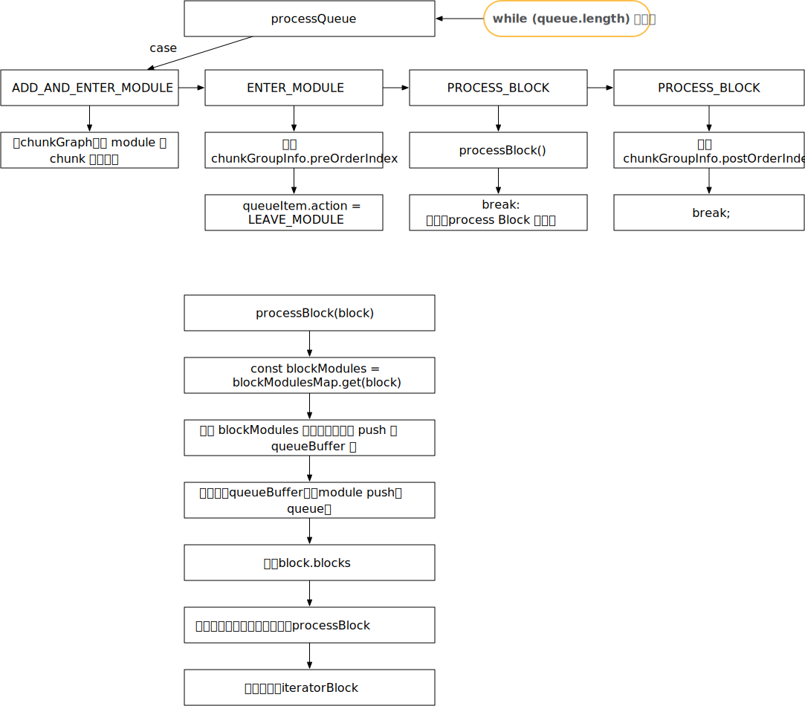

# 呕吼

1. 提供set，递归的一种方式

   ```javascript
   blockQueue.add(module);
   for (const block of blockQueue) {
     if(xxxxxx) {
        blockQueue.add(b);
   	}
   }
   ```

   

# 概述

1. 接上文，loader通过递归方式，全部处理完，即每个文件都经过loader的处理后，`hooks.make.tap`定义的函数就执行完，进入回调（Compiler.js）

   - 我们再回顾一下，入口文件，会执行`compoile`函数

   - 在执行`hooks.make.callAsync`前，会先执行`hooks.make`上tap的函数，前面resolve与loader的处理，就是在执行`hooks.tap `的函数

     ```javascript
     compile(callback) {
       this.hooks.beforeCompile.callAsync(params, err => {
         this.hooks.make.callAsync(compilation, err => {
           process.nextTick(() => {
             compilation.finish(err => {
               compilation.seal(err => {
                 if (err) return callback(err);
                 this.hooks.afterCompile.callAsync(compilation, err => {
                   return callback(null, compilation);
                 });
               });
             });
           });
         });
       });
     }
     ```

2. `make hook`结束后，先执行`compilation.finish`然后执行`compilation.seal`

# compilation.finish

1. 进入`finish`函数，首先会执行`this.hooks.finishModules`

   ```javascript
   finish(callback) {
     this.logger.time("finish modules");
     const { modules } = this;
     this.hooks.finishModules.callAsync(modules, err => {
       this.logger.time("report dependency errors and warnings");
       for (const module of modules) {
         // 省略error处理
       }
       this.logger.timeEnd("report dependency errors and warnings");
     });
   }
   ```

   - 这个hooks主要tap了4个函数
     - `ResolverCachePlugin`(在满足条件（`realResolves + cachedResolves > 0`）将一些变量初始化为0)、
     - `InferAsyncModulesPlugin`：主要是处理`module.buildMeta.async为true`的module
     -  `FlagDependencyExportsPlugin`：根据webpack注释，尝试从缓存还原缓存提供的导出信息
     - `InnerGraphPlugin`：不知道干嘛的。。。。
   - 插件逻辑暂时跳过

6. 小结

   - `finish`函数主要是执行`hooks.finishModules`，经过几个插件处理module
   - 然后循环`modules`，处理module存在的错误

7. 然后执行`compilation.seal`


# compilation.seal

## 例子

1. 后面的chunk分析，使用如下例子

   ```javascript
   // webpack.config.js
   module.exports = {
   	entry: {
   		app: './src/a.js'
   	},
   	output: {
   		filename: '[name].[chunkhash].js',
   		chunkFilename: '[name].bundle.[chunkhash:8].js',
   		publicPath: '/'
   	},
   	optimization: {
   		runtimeChunk: {
   			name: 'bundle'
   		}
   	},
   	mode: 'development'
   }
   // a.js (webpack config 入口文件)
   import add from './b.js'
   add(1, 2)
   import('./c').then(del => del(1, 2))
   // b.jsimport mod from './d.js'
   export default function add(n1, n2) {
   	return n1 + n2
   }
   mod(100, 11)
   // c.js
   import mod from './d.js'
   mod(100, 11)
   import('./b.js').then(add => add(1, 2))
   export default function del(n1, n2) {
   	return n1 - n2
   }
   // d.js
   export default function mod(n1, n2) {
   	return n1 % n2
   }
   
   ```

2. 依赖关系图：

   

## 概述

1. `seal`函数，首先利用`this.moduleGraph`构造一个chunkGraph实例

   ```javascript
   seal(callback) {
     const chunkGraph = new ChunkGraph(this.moduleGraph);
     this.chunkGraph = chunkGraph;
     for (const module of this.modules) {
       // todo webpack6 remove
       // 内部实际是： 在chunkGraphForModuleMap 缓存module与chunkGraph关系
       // const chunkGraphForModuleMap = new WeakMap();
       // chunkGraphForModuleMap.set(module, chunkGraph)
       ChunkGraph.setChunkGraphForModule(module, chunkGraph);
     }
     // WarnCaseSensitiveModulesPlugin:模块文件路径需要区分大小写
     this.hooks.seal.call();
   }
   ```

   - `this.hooks.seal`只有一个插件`WarnCaseSensitiveModulesPlugin`用于处理模块文件路径需要区分大小写

2. 优化`dependencies`

   ```javascript
   seal(callback) {
     // 省略1 ....代码
     this.logger.time("optimize dependencies");
     // tap 了两个函数
     while (this.hooks.optimizeDependencies.call(this.modules)) {
     }
     // taps no func
     this.hooks.afterOptimizeDependencies.call(this.modules);
     this.logger.timeEnd("optimize dependencies");
     this.logger.time("create chunks");
     // 省略....参见 create chunks 小节
     this.logger.timeEnd("create chunks");
   	this.logger.time("optimize");
     // 省略....  create chunks 后，会执行一系列 optimize
   }
   ```

   - `hooks.optimizeDependencies` tap 两个插件
     - `SideEffectsFlagPlugin`：识别 package.json 或者 module.rules 的 sideEffects 标志（纯的 ES2015 模块)，安全地删除未用到的 export 导出
     - `FlagDependencyUsagePlugin`： 编译时标记依赖 unused harmony export 用于 Tree shaking

3. 下面我们先来看下，优化`dependencies` 后的 create chunks 做了什么


## create chunks

1. 图示：chunkgroup，entrypoint

   

2. 生成chunks，首先会遍历每个`entries`，然后对每个 entry 进行处理

   ```javascript
   this.logger.time("create chunks");
   // taps no func
   this.hooks.beforeChunks.call();
   // addEntry 方法里，会对 this.entries 赋值，实际是入口文件
   for (const [name, { dependencies, options }] of this.entries) {
     const chunk = this.addChunk(name);
     chunk.name = name;
     // 此选项决定了每个输出 bundle 的名称
     if (options.filename) {
       chunk.filenameTemplate = options.filename;
     }
     // 实例化entrypoint
     const entrypoint = new Entrypoint(name);
     // 内部实际是：this.runtimeChunk = chunk;
     if (!options.dependOn) entrypoint.setRuntimeChunk(chunk);
     // 将entrypoint 分别保存在`namedChunkGroups、entrypoints、chunkGroups`中
     this.namedChunkGroups.set(name, entrypoint);
     this.entrypoints.set(name, entrypoint);
     this.chunkGroups.push(entrypoint);
     // 建立了 chunk 与 entrypoint，chunk 与 module 之间的联系
     connectChunkGroupAndChunk(entrypoint, chunk);
     // 处理当前入口的直接依赖
     for (const dep of dependencies) {
       // 实际是将dep保存在 `entrypoint.origins`中，
       entrypoint.addOrigin(null, { name }, (dep).request);
       // 通过`this.moduleGraph`获取当前dep的module
       const module = this.moduleGraph.getModule(dep);
       if (module) {
         chunkGraph.connectChunkAndEntryModule(chunk, module, entrypoint);
         // 设置module在`moduleGraph`的depth, 暂时略过
         this.assignDepth(module);
       }
     }
   }
   ```

   - `this.addChunk(name)`，主要就是分别缓存下name和name对应的chunk，即
     - 在``Compilation.js`的`namedChunks` 保存`name`， 在`chunks` 保存` new Chunk(name)`
     - 每个entry，都会通过addChunk方法创建一个chunk ( new  Chunk(name))

   - `connectChunkGroupAndChunk`内部实现是

     ```javascript
     const connectChunkGroupAndChunk = (chunkGroup, chunk) => {
     	// 如存在 返回false，否则会将chunk push到 this.chunks里，
     	// chunkGroup === new Entrypoint(name); chunk ==  new Chunk(name)
     	if (chunkGroup.pushChunk(chunk)) {
     		// chunk是 SortableSet 实现的一个set，提供了sort功能
     		// Chunk.js 实际是 sortableSet.add(chunkGroup)
     		chunk.addGroup(chunkGroup);
     	}
     };
     ```

     - 根据上文的介绍，传入参数chunkGroup，每次都是 新实例，此处应该不会存在 `chunkGroup.pushChunk(chunk) = false` 情况
     - 创建`Entrypoint`与chunk的联系，即相当于 在chunkGroup保存了chunk信息`chunkGroup.chunks.push(chunk)`；在chunk中保存chunkGroup信息：`chunk._groups.add(chunkGroup)`
     
   - 循环依赖dependencies，通过`chunkGraph.connectChunkAndEntryModule`构建`chunkGraph`  与 chunk、module、entrypoint联系

     ```javascript
     connectChunkAndEntryModule(chunk, module, entrypoint) {
       const cgm = this._getChunkGraphModule(module);
       const cgc = this._getChunkGraphChunk(chunk);
       if (cgm.entryInChunks === undefined) {
         cgm.entryInChunks = new Set();
       }
       cgm.entryInChunks.add(chunk);
       cgc.entryModules.set(module, entrypoint);
     }
     ```

     - 获取`chunkGraph`中的cgm（new ChunkGraphModule） 和 cgc （new ChunkGraphChunk）,分别为其中的`entryInChunks\entryModules`配置新值

3. **小结**：由于后序会处理`this.chunkGroups`，我们简单小结下与chunkGroups相关的数据

   - Entrypoint 继承自 ChunkGroup
   - `compilation.chunkGroups`：每一个entries，会往`this.chunkGroups.push`一个 `new Entrypoint(name)`
   - `chunkGroup.origins`：经过`connectChunkGroupAndChunk`函数（内部会调用`chunkGroup.pushChunk(chunk)`）后，`entrypoint.origins.push({module: null, loc: { name }, request})`

4. 至此，遍历每个`entries`结束，之后对每个entry处理`dependOn`：这个选项是为了在多个 chunk 之间共享模块

   ```javascript
   for (const [
     name,
     {
       options: { dependOn }
     }
   ] of this.entries) {
     // 省略.....
   }
   ```

5. 然后，`buildChunkGraph`， 生成并优化chunk依赖图

   ```javascript
   buildChunkGraph(this,(this.chunkGroups.slice()));
   ```

6. 最后，进行一系列优化工作，完成seal调用，下面看一下 chunk依赖图是生成

### ChunkGraph

1. 基本逻辑

   ```javascript
   class ChunkGraph {
     /**
   	 * @param {ModuleGraph} moduleGraph the module graph
   	 */
     constructor(moduleGraph) {
       this._modules = new WeakMap();
       this._chunks = new WeakMap();
       this._blockChunkGroups = new WeakMap();
       this.moduleGraph = moduleGraph;
       // 缓存key和value
       this._cacheChunkGraphModuleKey1 = undefined;
       // 等等_cachexxxxxkey
     }
   }
   ```

   - 分别在modules与chunks，保存chunk和module数据

2. 保存方式是

   ```javascript
   cgm = new ChunkGraphModule();
   this._modules.set(module, cgm);
   // 或
   cgc = new ChunkGraphChunk();
   this._chunks.set(chunk, cgc);
   ```

3. 如果调用get方法是，发现缓存的key`_cacheChunkGraphModuleKey1`与输入module相等，则直接返回缓存的`_cacheChunkGraphModuleValue1`，一个简单的缓存机制

4. 而`chunkGraph.connectChunkAndEntryModule(chunk, module, entrypoint);`，上面也介绍了，在`cgm.entryInChunks`保存chunk信息，在`cgc.entryModules`保存entrypoint信息

5. chunkGraph图示

   

### buildChunkGraph

1. 首先初始化一些map，然后调用 `visitModules`方法，然后调用`connectChunkGroups`，最后做cleanup 工作

   ```javascript
   xxxxxxxxxx27 1// 这几个map 在下面多个函数中公用2const chunkGroupDependencies = new Map();3const allCreatedChunkGroups = new Set();4const chunkGroupInfoMap = new Map();5const blocksWithNestedBlocks = new Set();6logger.time("visitModules");7visitModules(8  logger,9  compilation,10  inputEntrypoints,11  chunkGroupInfoMap,12  chunkGroupDependencies,13  blocksWithNestedBlocks,14  allCreatedChunkGroups15);16logger.timeEnd("visitModules");17logger.time("connectChunkGroups");18connectChunkGroups(19  compilation,20  blocksWithNestedBlocks,21  chunkGroupDependencies,22  chunkGroupInfoMap23);24logger.timeEnd("connectChunkGroups");25logger.time("cleanup");26cleanupUnconnectedGroups(compilation, allCreatedChunkGroups);27logger.timeEnd("cleanup");javascript
   ```
   
   - 因此，就是3函数`visitModules`，`connectChunkGroups`， `cleanupUnconnectedGroups`

####visitModules

1. 进入准备阶段，先构造`blockModulesMap`

   ```javascript
   // 处理module.outgoingConnections  感觉应该是获取 异步引用模块与modules关系
   const blockModulesMap = extractBlockModulesMap(compilation);
   ```

   - 内部使用了`outgoingConnections`属性，这个属性会在`this.addModule`回调时，通过`moduleGraph.setResolvedModule`配置

     ```javascript
     this.addModule(newModule, (err, module) => {
       for (let i = 0; i < dependencies.length; i++) {
         const dependency = dependencies[i];
         moduleGraph.setResolvedModule(originModule, dependency, module);
       }
     });
     // setResolvedModule 内部实现
     setResolvedModule(originModule, dependency, module) {
       const connection = new ModuleGraphConnection();
       const mgd = this._getModuleGraphDependency(dependency);
       mgd.connection = connection;
       const connections = this._getModuleGraphModule(module).incomingConnections;
       connections.add(connection);
       const mgm = this._getModuleGraphModule(originModule);
       if (mgm.outgoingConnections === undefined) {
         mgm.outgoingConnections = new Set();
       }
       mgm.outgoingConnections.add(connection);
     }
     ```

      - 归纳就是，分别为 `dependency.connection`,`module.incomingConnections`，`originModule.outgoningConnections `增加connection（new ModuleGraphConnection）
      - 简单了解，是何时为module.connection 赋值，大致是当前module 使用 import引入的模块


   - extractBlockModulesMap 最终返回值是  blockModulesMap 

     ```javascript
     const extractBlockModulesMap = compilation => {
       const { moduleGraph } = compilation;
       const blockModulesMap = new Map();
       const blockQueue = new Set();
       // 循环全部modules
       for (const module of compilation.modules) {
         let moduleMap;
         // 暂时理解为，获取存在异步模块的`module`，保存在`moduleMap`中
         // 即满足此循环条件，即在moduleMap里的module，才会被set到blockModulesMap
         for (const connection of moduleGraph.getOutgoingConnections(module)) {
           const d = connection.dependency;
           // 省略。。。。
           moduleMap.set(connection.dependency, m);
         }
         blockQueue.clear();
         blockQueue.add(module);
         // block可以理解为module的异步引用模块
         // 生成 blockModulesMap 关键
         for (const block of blockQueue) {
           let modules;
           if (moduleMap !== undefined && block.dependencies) {
             for (const dep of block.dependencies) {
               const module = moduleMap.get(dep);
               if (module !== undefined) {
                 if (modules === undefined) {
                   modules = new Set();
                   // 注意modules是一个Set集合
                   blockModulesMap.set(block, modules);
                 }
                 modules.add(module);
               }
             }
           }
           // block 存在异步模块，则add到 `blockQueue`中，继续循环
           if (block.blocks) {
             for (const b of block.blocks) {
               blockQueue.add(b);
             }
           }
         }
       }
       // 看起来像，每个异步block，对应的modules
       return blockModulesMap;
     
     };
     ```

     - 故最终得到<a id="blockModulesMap">`blockModulesMap`</a>，大致数据结构是

       ```javascript
       {
         a(NormalModule): [b(NormalModule)],
         c(ImportDependenciesBlock): [c(NormalModule)],
         b(NormalModule): [d(NormalModule)],
         c(NormalModule): [d(NormalModule),
         b(ImportDependenciesBlock): [b(NormalModule)]
       }
       ```

       - 我们测试例的module依赖关系是
       - webpack 同步模块为`NormalModule`实例，异步模块是`ImportDependenciesBlock`实例
       - `blockModulesMap`是遍历`compilation.modules`，拿到每个module的dependency与blocks；即先循环a与a的blocks，即a(NormalModule) 与c(ImportDependenciesBlock)
       - 大概是：经过过滤后的module依赖关系（module.dependency， 对于同一模块不一定只有一个（why？？？？？？））

2. 先进入<a id='visitModulesPrepare'>准备阶段</a>

   ```javascript
   // inputEntrypoints = this.chunkGroups.slice()
   // 循环`inputEntrypoints`数组，将每个entry的每个chunks的每个module，全部push到 queue中
   const chunkGroupsForCombining = new Set();
   for (const chunkGroup of inputEntrypoints) {
     // 构造chunkGroupInfo 对象
     const chunkGroupInfo = {
   
     };
     if (chunkGroup.getNumberOfParents() > 0) {
       // ... 省略一部分逻辑
     } else {
       for (const chunk of chunkGroup.chunks) {
         // cgc.entryModules.keys()，理解为，chunk，保存的module
         for (const module of chunkGraph.getChunkEntryModulesIterable(chunk)) {
           queue.push({
             action: ADD_AND_ENTER_MODULE,
             block: module,
             module,
             chunk,
             chunkGroup,
             chunkGroupInfo
           });
         }
       }
     }
   }
   // chunkGroup.getNumberOfParents() > 0 时，会为chunkGroupsForCombining add 内容
   for (const chunkGroupInfo of chunkGroupsForCombining) {
     // ... 省略
   }
   // 队列，为了调用pop，先入先出
   queue.reverse();
   // 准备阶段结束
   logger.timeEnd("visitModules: prepare");
   ```

   - 准备阶段，即使用入口chunk 构造初始queue数组
   - 根据上文介绍，每个`entries`会往自己的`chunkGroups`里面push一个 `new Entrypoint`，并将 `chunk`加入到 `chunks数组中`（非重复），而每个chunk 实际就是 name 对应的`new Chunk`
   - 循环`inputEntrypoints`数组，将每个entry的每个chunks的每个module，全部push到 queue中
   - 注意：此时整个queue里面的`item.action = ADD_AND_ENTER_MODULE`

4. 准备阶段结束后，开始<a id="whileQueue">循环queue数组</a>，完成`module graph`的迭代遍历

   ```javascript
   while (queue.length || queueConnect.size) {
     // 遍历modules
     logger.time("visitModules: visiting");
     processQueue();
     logger.timeEnd("visitModules: visiting");
     // 合并modules
     if (chunkGroupsForCombining.size > 0) {
       logger.time("visitModules: combine available modules");
       // 主要处理：chunkGroupsForCombining
       processChunkGroupsForCombining();
       logger.timeEnd("visitModules: combine available modules");
     }
     // 计算可用modules
     if (queueConnect.size > 0) {
       logger.time("visitModules: calculating available modules");
       // 主要处理 queueConnect
       // 并为：chunkGroupsForMerging 赋值
       processConnectQueue();
       logger.timeEnd("visitModules: calculating available modules");
       if (chunkGroupsForMerging.size > 0) {
         logger.time("visitModules: merging available modules");
       	// 主要处理：chunkGroupsForMerging 这个Set集合
         // 会为outdatedChunkGroupInfo赋值
         processChunkGroupsForMerging();
         logger.timeEnd("visitModules: merging available modules");
       }
     }
   
     if (outdatedChunkGroupInfo.size > 0) {
       logger.time("visitModules: check modules for revisit");
   		// 主要是处理 outdatedChunkGroupInfo 这个Set集合
       processOutdatedChunkGroupInfo();
       logger.timeEnd("visitModules: check modules for revisit");
     }
  if (queue.length === 0) {
       // 会处理queueDelayed
     }
   }
   ```
   
   - 根据logger注释，整个循环过程大致分为如下几个步骤：遍历modules，合并modules、计算可用modules、再检查modules（避免遗漏）
   - 重点是：`processQueue` 遍历modules，会处理chunkGroup
   - 后面的步骤基本都略过
     - processConnectQueue 得到chunkGroupsForMerging，如果存在则调用processChunkGroupsForMerging
     - processChunkGroupsForMerging得到outdatedChunkGroupInfo，如果存在，则调用processOutdatedChunkGroupInfo

##### 遍历modules

1. <a id="connectChunkAndModule">首先</a>，我们来看下遍历modules，做了什么，即`processQueue`在干嘛，主要是根据`queueItem.action`不同类型，执行不同操作，由于默认queue，都是ADD_AND_ENTER_MODULE类型

   ```javascript
   const processQueue = () => {
     while (queue.length) {
       const queueItem = queue.pop();
       module = queueItem.module;
       block = queueItem.block;
       chunk = queueItem.chunk;
       chunkGroup = queueItem.chunkGroup;
       chunkGroupInfo = queueItem.chunkGroupInfo;
       switch (queueItem.action) {
         case ADD_AND_ENTER_MODULE: {
           // 上文：chunkGraph.getChunkEntryModulesIterable(chunk) 是判断chunk.entryModules是否有此module
           // 此处是，判断chunk.modules是否有，可以简单理解为，未被处理的应为false
           if (chunkGraph.isModuleInChunk(module, chunk)) {
             break;
           }
           // 分别在`cgm.chunks.add(chunk);`和`cgc.modules.add(module);
           chunkGraph.connectChunkAndModule(chunk, module);
           // 注意这个 case，如不进入if，语句，并没 break，执行 ENTER_MODULE内部逻辑
         }
           // fallthrough
         case ENTER_MODULE: {}
           // fallthrough
         case PROCESS_BLOCK: {}
         case LEAVE_MODULE: {}
       }
     }
   };
   ```

   - 因此：ADD_AND_ENTER_MODULE主要逻辑是，在chunk加入module，在module加入chunk，建立二者之间关系

   - 图示

     

2. ENTER_MODULE内部逻辑

   ```javascript
   case ENTER_MODULE: {
     // chunkGroup的一个自上而下的index
     // this._modulePreOrderIndices.get(module)
     const index = chunkGroup.getModulePreOrderIndex(module);
     if (index === undefined) {
       // 在chunkGroup保存当前module在所在chunkGroupInfo的index值
       chunkGroup.setModulePreOrderIndex(
         module,
         chunkGroupInfo.preOrderIndex++
       );
     }
     // 配置`moduleGraph`中`mgm.preOrderIndex= index`
     if (
       moduleGraph.setPreOrderIndexIfUnset(
         module,
         nextFreeModulePreOrderIndex
       )
     ) {
       nextFreeModulePreOrderIndex++;
     }
     queueItem.action = LEAVE_MODULE;
     queue.push(queueItem);
   }
   ```

   - 因此，这段主要功能是配置 preOrderIndex，
   - 经过ENTER_MODULE处理后，action变为LEAVE_MODULE， 但由于未break，会进入下一环节PROCESS_BLOCK

3. PROCESS_BLOCK内部逻辑，即执行`processBlock`，[根据上文](#visitModulesPrepare)（注意看queue开始push的item）此时的block实际就是module

   ```javascript
   case PROCESS_BLOCK: {
     processBlock(block);
     break;
   }
   ```

   ```javascript
   const processBlock = block => {
     // 获取block对应的全部`blockModules`
     const blockModules = blockModulesMap.get(block);
     if (blockModules !== undefined) {
       const { minAvailableModules } = chunkGroupInfo;
       // 循环`blockModules`，构建一个queueBuffer
       // 目的是为了根据情况跳过某些modules，
       for (const refModule of blockModules) {
         if (chunkGraph.isModuleInChunk(refModule, chunk)) {
           continue;
         }
         if (
           minAvailableModules.has(refModule) ||
           minAvailableModules.plus.has(refModule)
         ) {
           // 暂时跳过skipBuffer逻辑，不知何用
           skipBuffer.push(refModule);
           continue;
         }
         queueBuffer.push({
           action: ADD_AND_ENTER_MODULE,
           block: refModule,
           module: refModule,
           chunk,
           chunkGroup,
           chunkGroupInfo
         });
       }
       if (skipBuffer.length > 0) {
         // 暂时跳过
       }
       // 将 queueBuffer 逆序添加到 queue中
       if (queueBuffer.length > 0) {
         for (let i = queueBuffer.length - 1; i >= 0; i--) {
           queue.push(queueBuffer[i]);
         }
         queueBuffer.length = 0;
       }
     }
     for (const b of block.blocks) {
       // 异步模块，如通过`mport('./c').then(del => del(1, 2))`加载的模块
       // 即 blockModulesMap 中 ImportDependenciesBlock 类型
       if (b.isAsync(chunkGroup)) {
         iteratorBlock(b);
       } else {
         // 同步模块，则直接进行递归操作
         processBlock(b);
       }
     }
     if (block.blocks.length > 0 && module !== block) {
       blocksWithNestedBlocks.add(block);
     }
   };
   ```

4. `iteratorBlock` 内部逻辑： 为异步模块生成新的`chunkGroup`，并push 到`queueDelayed`队列中，并会对外部传入的map赋值

   ```javascript
   const iteratorBlock = b => {
     // 1. 获取异步模块，如本例中的 c.js 所在的ChunkGroupInfo，如果不存在，则生成一个新的
     // blockChunkGroups 就是缓存异步模块的chunkGroupInfo信息
     let cgi = blockChunkGroups.get(b);
     let c;
     if (cgi === undefined) {
       const chunkName = (b.groupOptions && b.groupOptions.name) || b.chunkName;
       // 是否存在chunkName
       cgi = namedChunkGroups.get(chunkName);
       if (!cgi) {
         c = compilation.addChunkInGroup(
           b.groupOptions || b.chunkName,
           module,
           b.loc,
           b.request
         );
         c.index = nextChunkGroupIndex++;
         // 构造新的chunkGroupInfo
         cgi = {
           chunkGroup: c,
           minAvailableModules: undefined,
           minAvailableModulesOwned: undefined,
           availableModulesToBeMerged: [],
           skippedItems: undefined,
           resultingAvailableModules: undefined,
           children: undefined,
           availableSources: undefined,
           availableChildren: undefined,
           preOrderIndex: 0,
           postOrderIndex: 0
         };
         // 缓存chunkGroup和chunkGroupInfoMap
         allCreatedChunkGroups.add(c); // chunkGroup
         chunkGroupInfoMap.set(c, cgi); // cgi,chunkGroupInfo,一个包装对象
         if (chunkName) {
           namedChunkGroups.set(chunkName, cgi);
         }
       } else {
         c = cgi.chunkGroup;
         if (c.isInitial()) {
           compilation.errors.push(
             new AsyncDependencyToInitialChunkError(chunkName, module, b.loc)
           );
           c = chunkGroup;
         }
         c.addOptions(b.groupOptions);
         c.addOrigin(module, b.loc, b.request);
       }
       blockChunkGroups.set(b, cgi);
     } else {
       c = cgi.chunkGroup;
     }
   
     // .........
   };
   ```

   - `iteratorBlock` 第1部分逻辑较为简单，就是获取入参b（block），对应的chunkGroupInfo，如有缓存则使用缓存，否则创建一个新的

   - 接下是在<a id="chunkGroupDependencies">`chunkGroupDependencies`</a>保存当前block与 chunkGroup

     ```javascript
     // 2. 注意， deps中的chunkGroup，是入参b（block）对应的chunkGroup，
     // 而chunkGroupDependencies.get(chunkGroup)的chunkGroup，可以理解为父级的chunkGroup
     // 此处，相当chunkGroupDependencies 保存了chunkGroup的父子关系
     let deps = chunkGroupDependencies.get(chunkGroup);
     if (!deps) chunkGroupDependencies.set(chunkGroup, (deps = []));
     deps.push({
       block: b,
       chunkGroup: c
     });
     ```

   - 接下来是，<a id="queueConnect">queueConnect</a> 保存`chunkGroupInfo`的父子关系（与chunkGroupDependencies）逻辑是一致的

     ```javascript
     // 同理，queueConnect 保存了父子的chunkGroupInfo的信息
     let connectList = queueConnect.get(chunkGroupInfo);
     if (connectList === undefined) {
       connectList = new Set();
       queueConnect.set(chunkGroupInfo, connectList);
     }
     connectList.add(cgi);
     ```

   - 最后是构建一个<a id="queueDelayed">queueDelayed队列</a>，而`queueDelayed`队列会（在上面`while (queue.length || queueConnect.size)`循环中）最后`queue.length === 0`时处理

     ```javascript
     // 4. We enqueue the DependenciesBlock for traversal
     queueDelayed.push({
       action: PROCESS_BLOCK,
       block: b,
       module: module,
       chunk: c.chunks[0],
       chunkGroup: c,
       chunkGroupInfo: cgi
     });
     ```

5. processBlock 全部执行完，又回到[processQueue](#processQueue) 这个while循环，因为在上述过程中，queue在ENTER_MODULE中push了一个值（action=LEAVE_MODULE），然后PROCESS_BLOCK阶段，`queueBuffer`值被逆序push到queue中的一个（这个值会先被循环处理），根据[`blockModulesMap`](#blockModulesMap),会依次执行完ABD（a对应的value是b，b对应value是d）

6. LEAVE_MODULE：内部逻辑，注意此处是设置`_modulePostOrderIndices`的index，ENTER_MODULE是设置`modulePreOrderIndices`，key是module，值是index

   ```javascript
   case LEAVE_MODULE: {
     const index = chunkGroup.getModulePostOrderIndex(module);
     if (index === undefined) {
       chunkGroup.setModulePostOrderIndex(
         module,
         chunkGroupInfo.postOrderIndex++
       );
     }
     if (
       moduleGraph.setPostOrderIndexIfUnset(
         module,
         nextFreeModulePostOrderIndex
       )
     ) {
       nextFreeModulePostOrderIndex++;
     }
     break;
   }
   ```

   - 此时遍历结束，回到[循环queue数组](#whileQueue)，
   - 开始合并可用模块步骤，由于`chunkGroupsForCombining`无内容，暂时跳过，到计算可用模块


##### 计算可用模块

1. 根据上文，[queueConnect](#queueConnect)介绍，queueConnect 保存了chunkGroupInfo父子关系

2. 源码：

   ```javascript
   const processConnectQueue = () => {
     // 根据上述介绍，queueConnect[chunGroupInfo, targets]， targets理解为chunGroupInfo的子
     for (const [chunkGroupInfo, targets] of queueConnect) {
       // 配置children
       if (chunkGroupInfo.children === undefined) {
         chunkGroupInfo.children = targets;
       } else {
         for (const target of targets) {
           chunkGroupInfo.children.add(target);
         }
       }
   
       // 2. Calculate resulting available modules
       // 暂略，2,3暂略，未看到通过命名看，似乎是为了计算可以合并的Modules？？
       const resultingAvailableModules = calculateResultingAvailableModules(
         chunkGroupInfo
       );
   
       // 3. Update chunk group info，
       // 暂略，
       for (const target of targets) {
         target.availableModulesToBeMerged.push(resultingAvailableModules);
         chunkGroupsForMerging.add(target);
       }
     }
     queueConnect.clear();
   };
   ```

3. 小结：主要是配置chunkGroupInfo的children，并计算可合并的availableModulesToBeMerged有哪些（待考证）

   - 整个过程，会将`chunkGroupsForMerging`值，提供给后序流程


##### 处理queue.length ===0 情况

1. 当queue被处理完，会遍历[queueDelayed](#queueDelayed)

   ```javascript
   if (queue.length === 0) {
     const tempQueue = queue;
     queue = queueDelayed.reverse();
     queueDelayed = tempQueue;
   }
   ```

2. 注意，此时`item.action`是PROCESS_BLOCK，并且chunk.name 并不是a.js时的app，而是新的（由于未配置异步模块，故是null）

3. 至此，例子中描述的关系，会生成 三个 chunkGroup，abd是一个，c是一个，b是一个，信息会保存在`chunkGroupInfoMap`

4. 进入第二阶段，connectChunkGroups

##### 小结

1. 

#### connectChunkGroups

1. 上一步，主要是将不同模块，或者是有关系的模块，划分不同的chunkGroup，

2. 此过程是，将这些chunkGroup建立联系，即异步模块，进行关系建立

3. 主要源码：

   ```javascript
   const connectChunkGroups = (
     compilation,
     blocksWithNestedBlocks,
     chunkGroupDependencies,
     chunkGroupInfoMap
   ) => {
     const { chunkGraph } = compilation;
   
     let resultingAvailableModules;
     // For all deps, check if chunk groups need to be connected
     for (const [chunkGroup, deps] of chunkGroupDependencies) {
       if (deps.length === 0) continue;
   
       // 1. Get info from chunk group info map
       const info = chunkGroupInfoMap.get(chunkGroup);
       resultingAvailableModules = info.resultingAvailableModules;
   
       // 2. Foreach edge
       for (let i = 0; i < deps.length; i++) {
         const dep = deps[i];
         、、
         if (!filterFn(dep)) {
           continue;
         }
         const depChunkGroup = dep.chunkGroup;
         const depBlock = dep.block;
   
         // 5. Connect block with chunk
         chunkGraph.connectBlockAndChunkGroup(depBlock, depChunkGroup);
   
         // 6. Connect chunk with parent
         connectChunkGroupParentAndChild(chunkGroup, depChunkGroup);
       }
     }
   };
   ```

   - 其实整体逻辑，很简单，不过是在chunkGroup上保存信息
   - 值得注意的一点是：`filterFn(dep)`会跳过，已经存在的module，比如会跳过b，因为abd这个chunkGroup已经存在，如需详细了解，需要查看visitModules，针对异步引入b，并没有在chunk对应的`cgc.modules`存储值

4. [根据chunkGroupDependencies](#chunkGroupDependencies)，生成规则，每个异步模块，默认会有个新的chunkGroup，会在对应的chunkGroup添加deps， 对于本例，会有c，b两个chunkGroup

5. `chunkGraph.connectBlockAndChunkGroup(depBlock, depChunkGroup);`

   - 将dep的block与chunkGroup信息保存在`chunkGraph._blockChunkGroups.set(depBlock, chunkGroup);`中
   - 并在dep的chunkGroup保存 dep的block信息
   - 可以理解为，在chunkGraph保存chunkGroup信息

6. `connectChunkGroupParentAndChild(chunkGroup, depChunkGroup);`建立层级关系

   ```javascript
   const connectChunkGroupParentAndChild = (parent, child) => {
   	if (parent.addChild(child)) {
   		child.addParent(parent);
   	}
   };
   ```

   - 实际是，分别为`chunkGroup._childrens`与`depChunkGroup._parents`赋值
   - 这样，chunkGroup依赖关系树建立
   - 全部存在chunkGroup中

7. 然后进入清理工作

#### cleanupUnconnectedGroups

1. 主要工作是将没有联系的chunk，从chunkGraph中删除

2. 删除的主要逻辑，就是判断每个异步模块的`_parents.size`是否===0

   ```javascript
   const cleanupUnconnectedGroups = (compilation, allCreatedChunkGroups) => {
     const { chunkGraph } = compilation;
     // allCreatedChunkGroups也是在visitModules的iteratorBlock阶段生成的，每个异步模块会有一个chunkGroupInfo添加到此
     for (const chunkGroup of allCreatedChunkGroups) {
       // chunkGroup.getNumberOfParents() = this._parents.size;
       if (chunkGroup.getNumberOfParents() === 0) {
         for (const chunk of chunkGroup.chunks) {
           compilation.chunks.delete(chunk);
           chunkGraph.disconnectChunk(chunk);
         }
         chunkGraph.disconnectChunkGroup(chunkGroup);
         chunkGroup.remove();
       }
     }
   };
   ```

3. 至此，获得具有chunk关系图谱的chunkGraph

4. 然后执行：`hooks.afterChunks(this.chunks)`，未tap 函数，至此，整个create chunks，结束`buildChunkGraph`过程

#### 小结

1. 以入口文件为准的import，会组建为一个chunkGroup（name=app）
2. 异步模块（默认）会生成新的chunkGroup，并保存在`chunkGraph._blockChunkGroups`中（排除在app的模块）
3. 建立整个chunkGroup依赖关系，并清理到未被依赖的异步模块

## 问题

1. 如何chunk和modules建立联系的
   - `chunkGraph.connectChunkAndEntryModule(chunk, module, entrypoint);`方法中，将每个module相当保存在chunk中
2. `create chunks`结束时，`this.chunks`都包含什么内容
   - n个entries 会有n个chunk，参见：`this.addChunk(name);`
   - 和入口直接异步引用：本例就是c.js的chunk，而b则不会被加入
   - 故此时，根据本例只有两个chunk
3. `this.chunkGroups`是什么
   - 根据小结，每个入口文件，涉及到的import内容，组件为一个chunkGroup
   - 每个异步模块，会默认生成一个新的chunkGroup
4. `chunkGraph`保存的信息，即其中的`_chunks与_modules`，以及为何其中的`_chunks`与`this.chunks`可能不同？？？？
   - 每个入口文件的每个`dependencies`，会调用`chunkGraph.connectChunkAndEntryModule`，将chunk和module分别保存，但`this.chunks`只会保存入口
   - 在`buildChunkGraph-visitModules`中，对于每个`ADD_AND_ENTER_MODULE`类型的action，都会调用`chunkGraph.connectChunkAndModule`，内部会保存新的module与chunks，因此，每个异步模块会被保存

