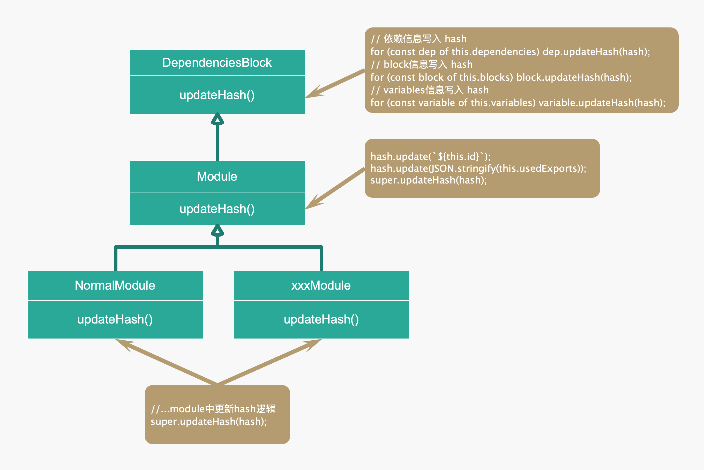
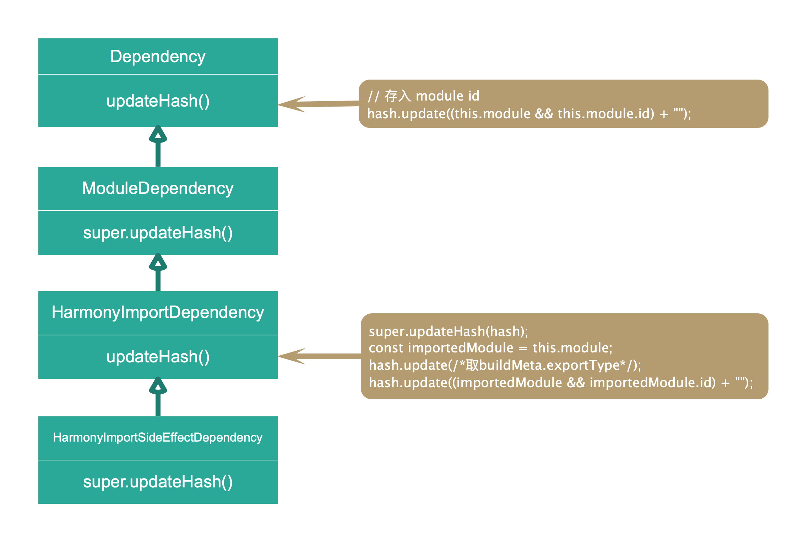

# 文件生成

## 概述

1. 上接，`Compilation.js`的 `seal函数`，生成chunk文件之后

2. 即在`create chunks`，会进行一些列优化，即一些`optimize` hooks的调用，这些hook暂时跳过

3. 优化的最后一步是`optimizeTree`，并在其中的`optimizeChunkModules`，会生成module 与 chunk的id、hash等关键内容

   ```javascript
   seal(callback) {
     this.logger.time("create chunks");
     buildChunkGraph( );
     this.logger.timeEnd("create chunks");
   
     this.logger.time("optimize");
     // no taps
     this.hooks.optimize.call();
     // no taps
     while (this.hooks.optimizeModules.call(this.modules)) { /* empty */}
     // no taps
     this.hooks.afterOptimizeModules.call(this.modules);
     // 此处会对chunks处理，如将第三方库合并为bundle，合并重复的，等等
     while (this.hooks.optimizeChunks.call(this.chunks, this.chunkGroups)) { /* empty */}
     // no taps
     this.hooks.afterOptimizeChunks.call(this.chunks, this.chunkGroups);
     // no taps
     this.hooks.optimizeTree.callAsync(this.chunks, this.modules, err => {
       // tap no func
       this.hooks.afterOptimizeTree.call(this.chunks, this.modules);
       // tap no func
       this.hooks.optimizeChunkModules.callAsync(
         this.chunks,
         this.modules,
         err => {
           // 主要看这里面。。。。。。
           // 1、生成moduleId与chunkId
           // 2、生成module hash
           // 3、code generation
           // 4、runtime requirements
           // 5、chunk hash
         }
       );
     });
   }
   
   ```
   
   - 默认情况下，优化的大部分hook都没有tap函数，主要是`this.hooks.optimizeChunks`会安装几个插件
   - 优化的hooks，会根据`optimization`的配置，在以`WebpackOptionsApply.js`，函数中实例化不同的插件，不同的插件，会在相应的hooks上tap函数

## module Id 与chunk Id 生成

1. 进入`optimizeChunkModules`回调函数，首先是要生成module与chunk的id

   ```javascript
   // tap no func
   this.hooks.afterOptimizeChunkModules.call(this.chunks, this.modules);
   // tap no func
   const shouldRecord = this.hooks.shouldRecord.call() !== false;
   // tap RecordIdsPlugin, 由于records.modules = undefined， 会直接
   /******************生成moduleId****************************/
   this.hooks.reviveModules.call(this.modules, this.records);
   // tap no func
   this.hooks.beforeModuleIds.call(this.modules);
   // tap NamedModuleIdsPlugin，生成id的关键
   this.hooks.moduleIds.call(this.modules);
   // tap no func
   this.hooks.optimizeModuleIds.call(this.modules);
   // tap no func
   this.hooks.afterOptimizeModuleIds.call(this.modules);
   /******************生成chunkId****************************/
   this.hooks.reviveChunks.call(this.chunks, this.records);
   this.hooks.beforeChunkIds.call(this.chunks);
   // tap NamedChunkIdsPlugin
   this.hooks.chunkIds.call(this.chunks);
   this.hooks.optimizeChunkIds.call(this.chunks);
   this.hooks.afterOptimizeChunkIds.call(this.chunks);
   ```

2. id的生成逻辑基本一致，主要是在`hooks.moduleIds`与`hooks.chunkIds`，分别tap了`NamedModuleIdsPlugin`与`NamedChunkIdsPlugin`插件

3. 以NamedModuleIdsPlugin为例

   ```javascript
   compilation.hooks.moduleIds.tap("NamedModuleIdsPlugin", modules => {
     const chunkGraph = compilation.chunkGraph;
     const context = this.options.context
     ? this.options.context
     : compiler.context;
     const unnamedModules = assignNames(
       // 有效的module
       Array.from(modules).filter(module => {
         if (!module.needId) return false;
         // cgm.chunks.size
         if (chunkGraph.getNumberOfModuleChunks(module) === 0) return false;
         // cgm.id
         return chunkGraph.getModuleId(module) === null;
       }),
       m => getShortModuleName(m, context, root),
       (m, shortName) => getLongModuleName(shortName, m, context, root),
       compareModulesByIdentifier,
       getUsedModuleIds(compilation),
       // 设置module的cgm.id = name;
       (m, name) => chunkGraph.setModuleId(m, name)
     );
     if (unnamedModules.length > 0) {
       assignAscendingModuleIds(unnamedModules, compilation);
     }
   });
   ```

   - 主要是调用`assignNames`与assignAscendingModuleIds（将未name的module，设置id）

4. 我们先看下`assignNames`的传入参数

   - 1：过滤出有效的module
   - 2：定义获取shortName的函数，目前module的方式是拿到相对路径
   - 3：定义获取longName函数，传入shotName和module，目前module的方式是`${shotName}?${getHash(相对路径,4)}`
   - 4：比较函数：`compareModulesByIdentifier`，目前module的方式，就是比较下`a.identifier(), b.identifier()`，大返回1，小返回-1，否则是0
   - 5：获取modules+ records.modules 的 id Set，即哪些id是被用过的
   - 6：给`chunkGraph`对应module的 `cgm.id` 设置 name

5. 根据`assignNames`参数，可以大致想到，这个函数主要功能是设置module内部cgm.id ，把没有name的过滤出来

   ```javascript
   const assignNames = (
     items, // 有效的module
     getShortName,
     getLongName,
     comparator, // 判断a.identifier(), b.identifier()的大小，返回1，-1或0
     usedIds, // 返回的modules+ records.modules 的 id Set，即哪些id是被用过的
     assignName // 设置module的cgm.id = name;
   ) => {
     const nameToItems = new Map();
   	// 第1步： 将module，转为类似` { [shortName]: [module, module] }`的形式
     for (const item of items) {
       // 类似 ./src/a.js
       const name = getShortName(item);
       // 形成nameToItems[name] = [item1,item2,item3]形式
       addToMapOfItems(nameToItems, name, item);
     }
   
     // 第2步： 由于，相同的shortName可能存在多个module，将这种情况的shortName转为longName，生成nameToItems2
     const nameToItems2 = new Map();
   
     for (const [name, items] of nameToItems) {
       if (items.length > 1 || !name) {
         for (const item of items) {
           const longName = getLongName(item, name);
           addToMapOfItems(nameToItems2, longName, item);
         }
       } else {
         addToMapOfItems(nameToItems2, name, items[0]);
       }
     }
   
     // 第3步： 过滤出`unnamedItem`；保存使用过的id，并将生成的name配置到`chunkGraph`的`cgm.id`上；对于有重复longName的 module，还需要将longName++，保证name唯一
     const unnamedItems = [];
   
     for (const [name, items] of nameToItems2) {
       if (!name) {
         for (const item of items) {
           unnamedItems.push(item);
         }
       } else if (items.length === 1 && !usedIds.has(name)) {
         assignName(items[0], name);
         usedIds.add(name);
       } else {
         items.sort(comparator);
         let i = 0;
         for (const item of items) {
           while (nameToItems2.has(name + i) && usedIds.has(name + i)) i++;
           assignName(item, name + i);
           usedIds.add(name + i);
           i++;
         }
       }
     }
   
     unnamedItems.sort(comparator);
     return unnamedItems;
   };
   ```

6. 最终

   - 经过`hooks.moduleId`的处理，`chunkGraph._modules`每一项的id会被赋值
   - 经过`hooks.chunkId`的处理，`this.chunks`每一项的id与ids会被赋值，如'chunk.name = app'，则` id = app, ids = [app]`，由于`chunkGraph._chunks`数量与`this.chunks`不同，故会存在某个chunk的id与ids为null

## module hash生成

1. 在`this.hooks.optimizeChunkModules`，回调中，调用`createModuleHashes`

   ```javascript
   this.logger.time("module hashing");
   // tap no func
   this.hooks.beforeModuleHash.call();
   // module hash
   this.createModuleHashes();
   // tap no func
   this.hooks.afterModuleHash.call();
   this.logger.timeEnd("module hashing");
   ```

2. ` createModuleHashes`

   ```javascript
   createModuleHashes() {
     const chunkGraph = this.chunkGraph;
     const { hashFunction, hashDigest, hashDigestLength } = this.outputOptions;
     for (const module of this.modules) {
       const moduleHash = createHash(hashFunction);
       module.updateHash(moduleHash, chunkGraph);
       const moduleHashDigest = (moduleHash.digest(hashDigest));
       chunkGraph.setModuleHashes(
         module,
         moduleHashDigest,
         moduleHashDigest.substr(0, hashDigestLength)
       );
     }
   }
   ```

3. 首先，`createHash`函数定义在`createHash.js`，根据参数不同导出不同的实例

   ```javascript
   module.exports = algorithm => {
   	if (typeof algorithm === "function") {
   		return new BulkUpdateDecorator(() => new algorithm());
   	}
   	switch (algorithm) {
   		case "debug":
   			return new DebugHash();
   		default:
   			if (crypto === undefined) crypto = require("crypto");
   			return new BulkUpdateDecorator(
   				() => crypto.createHash(algorithm),
   				algorithm
   			);
   	}
   };
   ```

   - `BulkUpdateDecorator`与`DebugHash`分别继承自`Hash`类主要是重写`Hash`里面的`update`（生成hash的原始内容）与`digest`（得到最终的hash值）方法
   - `BulkUpdateDecorator`使用的是node crypto 库，实现的加密hash算法，而非直接使用`node crypto`，是因为`BulkUpdateDecorator`这个类机制是做了个缓存，如`buffer.lenght > 1000 `时，再调用`crypto`库的update方法
   - 目前看：webpack todo项是要实现一个非加密的hash算法
   - 小结：由于每个`createHash`都会new实例，故实际上对于每个module，`moduleHash`是新实例，只要hash值不超过`BulkUpdateDecorator`内置阈值，都会将hash存在其实例的`this.buffer`上

4. 调用`module.updateHash`，后面会详细介绍

   - 根据配置项output，可以通过`hashDigest\hashDigestLength\hasFunction`分别配置生成哈希的编码方式，散列摘要前缀长度和散列算法

5. 最后将实际的hash值与截取长度的hash分别保存在`chunkGraph`对应module的cgm上

   ```javascript
   setModuleHashes(module, hash, renderedHash) {
     // 前面分析过，如果this._modules.get(module)存在则直接返回，否则返回new ChunkGraphModule
     const cgm = this._getChunkGraphModule(module);
     cgm.hash = hash;
     cgm.renderedHash = renderedHash;// 默认是20长度
   }
   ```

6. 最终，

   - 当`module hashing`结束，在`chunkGraph._modules`每一项hash与renderHash会配置上值

### module.updateHash 干了什么

1. 由于目前大部分`createHash`使用的是`BulkUpdateDecorator`，故下文中每次调用`hash.update(xxxxxx)`，是把xxxxxx缓存，到达一定数量后，调用`crypto`库`hash.update`，生成 hash 的原始内容

2. 从`createModuleHashes`调用`module.updateHash`的调用图

   

3. 本例子，通常普通import的模块是一个`NormalModule.js`实例（可能还有其他类型的xxxxxModule），因此，`module.updateHash `会调用实例方法

   ```javascript
   updateHash(hash, chunkGraph) {
     hash.update(this.buildInfo.hash);
     super.updateHash(hash, chunkGraph);
   }
   ```

   - 在build过程中，会对`this.buildInfo.hash`赋值，此处会有一个hash值
   - 父类是`Module.js`

4. 进入`Module.js`的`updateHash`方法

   ```javascript
   updateHash(
     hash,
     chunkGraph = ChunkGraph.getChunkGraphForModule(
       this,
       "Module.updateHash",
       "DEP_WEBPACK_MODULE_UPDATE_HASH"
     )
   ) {
     hash.update(`${chunkGraph.getModuleId(this)}`);
     // 获取当前module是否存在export xxxx
     const exportsInfo = chunkGraph.moduleGraph.getExportsInfo(this);
     for (const exportInfo of exportsInfo.orderedExports) {
       hash.update(exportInfo.name);
       hash.update(`${exportInfo.used}`);
       hash.update(`${exportInfo.usedName}`);
     }
     // module解析时，会将module的dependency加入到presentationalDependencies中
     if (this.presentationalDependencies !== undefined) {
       // dependency的实例不同，会进入对应的Class，调用updateHash方法，大致是多次调用
       // hash.update(xxxxxxxx);
       for (const dep of this.presentationalDependencies) {
         dep.updateHash(hash, chunkGraph);
       }
     }
     super.updateHash(hash, chunkGraph);
   }
   ```

   - 综述下，`module.js`中的`updateHash`，实际就是将`module`文件中的`export`信息与`dependency`信息，构建到hash中
   
5. 最后，进入父类`DependenciesBlock`的`updateHash`

   ```javascript
   updateHash(hash, chunkGraph) {
     for (const dep of this.dependencies) {
       dep.updateHash(hash, chunkGraph);
     }
     for (const block of this.blocks) {
       block.updateHash(hash, chunkGraph);
     }
   }
   ```

   - 此处的`dependency`与`blocks`分别是，module的依赖与异步引入模块

   - 由于不同依赖或异步模块会有不同类型，同样会进入父类，调用`updateHash`方法，调用关系图

     

6. 最终其实执行`module.updateHash`就是将各种信息，如依赖，异步模块，当前模块id等，全部加入到hash中


### 小结

1. 由于hash绑定了很多信息，如模块本身id，依赖等等，故不仅仅是修改模块内容，会导致hash变化
2. 如果修改顺序或者其他的操作造成 module 的 id 改变了， hash会改变
3. 修改了 webpack 的相关配置时，如改变 module id 生成方式等，hash会改变

## code generation

1. `module hash`生成后，会进入`code generation`阶段

   ```javascript
   this.logger.time("code generation");
   // no taps
   this.hooks.beforeCodeGeneration.call();
   // ***************关键***********************
   this.codeGenerationResults = this.codeGeneration();
   // no taps
   this.hooks.afterCodeGeneration.call();
   this.logger.timeEnd("code generation");
   ```

2. `this.codeGeneration`内部主要调用`module.codeGeneration`

   ```javascript
   codeGeneration() {
     const {
       chunkGraph,
       moduleGraph,
       dependencyTemplates, // new DependencyTemplates();
       runtimeTemplate // new RuntimeTemplate(outputOptions,requestShortener)
     } = this;
     const results = new Map();
     const errors = [];
     for (const module of this.modules) {
       if (chunkGraph.getNumberOfModuleChunks(module) > 0) {
         try {
   				// ***************关键***********************
           const r = module.codeGeneration({
             chunkGraph,
             moduleGraph,
             dependencyTemplates,
             runtimeTemplate
           });
           results.set(module, r);
         } catch (err) {
      			 // 处理err
         }
       }
     }
     if (errors.length > 0) {
       // 处理errors
     }
     return results;
   }
   ```

3. 以`NormalModule`的module为例，调用`module.codeGeneration`会进入`NormalModule.js`，伪代码

   ```javascript
   codeGeneration({
     dependencyTemplates,
     runtimeTemplate,
     moduleGraph,
     chunkGraph
   }) {
     // 1、判断是否可以使用缓存
     // hashDigest = `${chunkGraph.getModuleHash(this)}-${dependencyTemplates.getHash()}`
     const hashDigest = this._getHashDigest(chunkGraph, dependencyTemplates);
     if (this._cachedCodeGenerationHash === hashDigest) {
       // We can reuse the cached data
       return this._cachedCodeGeneration;
     }
   
     const runtimeRequirements = new Set();
   	// 2、暂时略过
     if (!this.buildInfo.parsed) {
       runtimeRequirements.add(RuntimeGlobals.module);
       runtimeRequirements.add(RuntimeGlobals.exports);
       runtimeRequirements.add(RuntimeGlobals.thisAsExports);
     }
   
     const sources = new Map();
     // 进入实际module对应的generator，进行generate操作
     // this.generator 是 resolve后，createData内部的一个属性
     // 每个module都会对应一个type， 如javascript/auto
     for (const type of this.generator.getTypes(this)) {
       const source = this.error
       ? new RawSource(
         "throw new Error(" + JSON.stringify(this.error.message) + ");"
       )
       : this.generator.generate(this, {
         dependencyTemplates,
         runtimeTemplate,
         moduleGraph,
         chunkGraph,
         runtimeRequirements,
         type
       });
   
       if (source) {
         sources.set(type, new CachedSource(source));
       }
     }
   
     const resultEntry = {
       sources,
       runtimeRequirements
     };
     this._cachedCodeGeneration = resultEntry;
     this._cachedCodeGenerationHash = hashDigest;
     return resultEntry;
   }
   ```

   - 根据补充的说明，故`this.generator.generate`会执行`JavascriptGenerator.js`的generate方法
   - 整个generate过程较为复杂，暂时略过

4. 最终

   - `this.codeGeneration();`执行结果`this.codeGenerationResults`是一个` Map(module, codeResult)`
   - 结果中不但包含了源码，以及import，export等转为为webpack代码，不同module，webpack为其注入了不同代码，如类似`/* harmony import */ var _b_js__WEBPACK_IMPORTED_MODULE_0__ = __webpack_require__(/*! ./b.js */ "./src/b.js");`

5. 特别注意：`code generation`之后会到`runtime requirements`步骤（主要是执行`processRuntimeRequirements`函数）（跳过。。。）


### 补充：generator是何时定义的

1. 根据之前resolve过程的介绍，在`NormalModuleFactory.js`中`hooks.resolve` 后，会将解析的数据分配给`data.createData`

   ```javascript
   Object.assign(data.createData, {
     request: stringifyLoadersAndResource(allLoaders, resource),
     userRequest,
     rawRequest: request,
     loaders: allLoaders,
     resource,
     matchResource,
     resourceResolveData,
     settings,
     type,
     parser: this.getParser(type, settings.parser),
     // 如果有缓存，则返回，否则调用`this.createGenerator`
     generator: this.getGenerator(type, settings.generator),
     resolveOptions
   });
   ```

   - 值得注意的每个module，会根据`Rule.type`被定义一个类型，如`'javascript/auto' | 'javascript/dynamic' | 'javascript/esm'`等

2. `this.getGenerator()`内部如有缓存则返回`generator`，否则调用`this.createGenerator`创建新的

   ```javascript
   createGenerator(type, generatorOptions = {}) {
     const generator = this.hooks.createGenerator
     .for(type)
     .call(generatorOptions);
     if (!generator) {
       throw new Error(`No generator registered for ${type}`);
     }
     // this.hooks.generator.for(type)：no taps
     this.hooks.generator.for(type).call(generator, generatorOptions);
     return generator;
   }
   ```

   - `this.hooks.createGenerator.for(type)`，不同的type类型，会在JavascriptModulesPlugin.js return generator 新实例
   - 目前都是`JavascriptGenerator.js`


## chunk hash生成

1. 进入hash生成过程，主要是执行`this.createHash`函数

   ```javascript
   this.logger.time("hashing");
   // no tap func
   this.hooks.beforeHash.call();
   // ********** chunk hash *****************
   this.createHash();
   // no tap func
   this.hooks.afterHash.call();
   this.logger.timeEnd("hashing");
   ```

2. `this.createHash()`内部逻辑

   ```javascript
   createHash() {
     this.logger.time("hashing: initialize hash");
     // 目前主要是利用crypto生成hash值，可以传入自定义函数，todo项是之后会提供一个非加密的hash算法
     const hash = createHash(hashFunction);
     if (outputOptions.hashSalt) {
       // 使用 data 更新加密
       hash.update(outputOptions.hashSalt);
     }
     this.hooks.fullHash.call(hash);
     // 此段逻辑主要是将`children、warnings、errors`等内容，加入到hash中
     if (this.children.length > 0) {
       for (const child of this.children) {
         hash.update(child.hash);
       }
     }
     if (this.warnings.length > 0) {
       // 。。。
     }
     if (this.errors.length > 0) {
       // 。。。
     }
     this.logger.time("hashing: sort chunks");
     const chunks = Array.from(this.chunks);
     // 将chunks进行排序（根据注释，主要是将`falsy`放在最前面）
     chunks.sort((a, b) => {
       const aEntry = a.hasRuntime();
       const bEntry = b.hasRuntime();
       if (aEntry && !bEntry) return 1;
       if (!aEntry && bEntry) return -1;
       return byId(a, b);
     });
     this.logger.timeEnd("hashing: sort chunks");
   }
   ```

3. 循环chunks，分别获取` runtime modules hash` 与 `chunks hash`

   ```javascript
   for (let i = 0; i < chunks.length; i++) {
     const chunk = chunks[i];
     // chunkGraph.getChunkModulesIterable(chunk) 获取 cgc.modules
     // 在`RuntimePlugin`插件中，将module加入到`cgc.modules`
     for (const module of chunkGraph.getChunkModulesIterable(chunk)) {
       // 会先将这些modules （webpack称这些modules为 runtime modules）绑定hash值
       if (!chunkGraph.getModuleHash(module)) {
         const moduleHash = createHash(hashFunction);
         module.updateHash(moduleHash, chunkGraph);
         const moduleHashDigest =  (moduleHash.digest(
           hashDigest
         ));
         chunkGraph.setModuleHashes(
           module,
           moduleHashDigest,
           moduleHashDigest.substr(0, hashDigestLength)
         );
       }
     }
     // 生成chunk的`chunkHash`
     const chunkHash = createHash(hashFunction);
     try {
       if (outputOptions.hashSalt) {
         chunkHash.update(outputOptions.hashSalt);
       }
       chunk.updateHash(chunkHash, chunkGraph);
       //  tap "JavascriptModulesPlugin"
       // 通过`this.hooks.chunkHash`把需要绑定的hash内容加入到 chunkHash中，最终将生成的hash值，加入到 hash中
       this.hooks.chunkHash.call(chunk, chunkHash, {
         chunkGraph,
         moduleGraph: this.moduleGraph,
         runtimeTemplate: this.runtimeTemplate
       });
       const chunkHashDigest = (chunkHash.digest(
         hashDigest
       ));
       hash.update(chunkHashDigest);
       //  此处会生成chunk的hash，分别保存在`chunk.hash = chunkHashDigest;`与`chunk.renderedHash = chunk.hash.substr(0, hashDigestLength);`
       chunk.hash = chunkHashDigest;
       chunk.renderedHash = chunk.hash.substr(0, hashDigestLength);
       // 获取chunk的`fullHashModules`，即chunk的 `cgc.fullHashModules`，如存在会将chunk 加入到 `fullHashChunks`，后面会对`fullHashChunks`处理
       const fullHashModules = chunkGraph.getChunkFullHashModulesIterable(
         chunk
       );
       if (fullHashModules) {
         fullHashChunks.add(chunk);
       } else {
         this.hooks.contentHash.call(chunk);
       }
     } catch (err) {
     }
   }
   ```

4. `chunks`全部循环完，利用hash，生成最终涉及全部内容的hash值

   ```javascript
   this.fullHash = (hash.digest(hashDigest));
   this.hash = this.fullHash.substr(0, hashDigestLength);
   ```
   
- 因此，`this.hash`与`this.fullHash`存储了上面这一堆hash，是一个综合（也包含了全部chunkHash）
   
5. `createHash`函数最后，会循环`fullHashChunks`，将内部fullHashModules 添加 hash值

6. 小结

   - 这部分就是将`this.chunk` 配置hash
   - `chunk`的`runtime`和内部的`fullHashModules`配置hash
   - 将全部hash值，保存在`this.hash`与`this.fullHash`中


## assets

### module assets

1. `chunk hash`生成后，首先会进入`module assets`阶段

   ```javascript
   this.logger.time("module assets");
   this.clearAssets();
   // no tap func
   this.hooks.beforeModuleAssets.call();
   // ***************重要**********
   this.createModuleAssets();
   this.logger.timeEnd("module assets");
```
   
- 首先执行`this.clearAssets()`，主要是清空`chunk.files`与`chunk.auxiliaryFiles`
   
     ```javascript
     clearAssets() {
       for (const chunk of this.chunks) {
         // chunk.files 是 Set，即清空
         chunk.files.clear();
         chunk.auxiliaryFiles.clear();
       }
     }
  ```
   
- 然后进入：`createModuleAssets`，此函数主要是当`module.buildInfo.assets`存在时，执行
   
     ```javascript
     createModuleAssets() {
       const { chunkGraph } = this;
       for (const module of this.modules) {
         if (module.buildInfo.assets) {
           // 本例无`module.buildInfo.assets`，故暂时略过`module assets`的生成
         }
       }
     }
     ```

### chunk assets

1. 然后进入`seal`的最后阶段：`create chunk assets`

   ```javascript
   this.logger.time("create chunk assets");
   // no tap func
   if (this.hooks.shouldGenerateChunkAssets.call() !== false) {
     // no tap func
     this.hooks.beforeChunkAssets.call();
     this.createChunkAssets(err => {
       this.logger.timeEnd("create chunk assets");
       if (err) {
         return callback(err);
       }
       cont();
     });
   } else {
     this.logger.timeEnd("create chunk assets");
     cont();
   }
   ```

2. `createChunkAssets` 内部

   ```javascript
   createChunkAssets(callback) {
     const outputOptions = this.outputOptions;
     const cachedSourceMap = new WeakMap();
     const alreadyWrittenFiles = new Map();
     asyncLib.forEach(
       this.chunks,
       // iterator
       (chunk, callback) => {
         // chunks的iterator 逻辑
       },
       callback,
     )
   }
   ```

   - 利用`iterator`异步处理`this.chunks`数组

3. 而 `chunks`的`iterator` 逻辑是

   ```javascript
   createChunkAssets(callback) {
     asyncLib.forEach(
       this.chunks,
       // iterator
       (chunk, callback) => {
         const manifest = this.getRenderManifest({});
         asyncLib.forEach(
           manifest,
           (fileManifest, callback) => {
             // manifest 的 iterator
           }，
           callback，
         )
       },
       callback,
     )
   }
   ```

   - 通过`getRenderManifest`获取`result`数组，主要包含`render`函数，详见：[getRenderManifest做了什么](#getRenderManifest做了什么)
   - 然后进入`manifest 的 iterator`

4. `manifest 的 iterator`

   ```javascript
   createChunkAssets(callback) {
     asyncLib.forEach(
       this.chunks,
       // iterator
       (chunk, callback) => {
         const manifest = this.getRenderManifest({});
         asyncLib.forEach(
           manifest,
           (fileManifest, callback) => {
             // manifest 的 iterator
             this.cache.get(cacheName, usedHash, () => {
          				// 1、根据filenameTemplate，获取filename
               	// 2、利用render函数，获取source
             })
           }，
           callback，
         )
       },
       callback,
     )
   }
   ```
   
   - `this.cache.get`逻辑之前介绍过，大致就是根据`cacheName\usedHash`不同条件，去调用回调，回调大致可分为如下步骤：
     - 步骤一：根据，获取`filename`，即替换`[name][hash].js`为具体的值，参见：[获取filenameTemplate](#获取filenameTemplate)
     - 步骤二：调用`render`函数，生成`source`文件，参见：[生成source文件](#生成source文件)

5. 当`createChunkAssets`处理完，会回到步骤1，执行回调函数，即执行`cont`函数

   ```javascript
   this.createChunkAssets(err => {
     this.logger.timeEnd("create chunk assets");
     if (err) {
       return callback(err);
     }
     cont();
   });
   ```

   - 主要是执行`assets`生成后的一些hook的执行，默认（目前这个简单例子）情况下，这些hook并未tap 函数，主要是执行，如下hooks`additionalChunkAssets\additionalAssets`，然后是`optimizeChunkAssets\afterOptimizeChunkAssets` ，然后是`optimizeAssets\afterOptimizeAssets`，最后是`finishAssets\afterFinishAssets`

6. 最终：

   - 至此，整个`compilation.seal`过程结束，回到`Compiler.js`中，执行回调，即执行`afterCompile`后，执行callback

     ```javascript
     compile(callback) {
       this.hooks.beforeCompile.callAsync(params, err => {
         this.hooks.make.callAsync(compilation, err => {
           process.nextTick(() => {
             compilation.finish(err => {
               // 执行回调
               compilation.seal(err => {
                 if (err) return callback(err);
                 this.hooks.afterCompile.callAsync(compilation, err => {
                   return callback(null, compilation);
                 });
               });
             });
           });
         });
       });
     }
     ```

     - 即执行`this.compile(onCompiled);`的`onCompiled`函数：参见：[onCompiled 函数执行](#onCompiled 函数执行)

   

   


#### getRenderManifest做了什么

1. `this.getRenderManifest({})` 主要会执行`this.hooks.renderManifest.call([], options);`

2. 故会执行`JavascriptModulesPlugin.js`中`compilation.hooks.renderManifest.tap`的回调函数，伪代码：

   ```javascript
   compilation.hooks.renderManifest.tap(
     "JavascriptModulesPlugin",
     (result, options) => {
       const hotUpdateChunk =
             chunk instanceof HotUpdateChunk ? chunk : null;
       let render;
       // `filenameTemplate`会根据webpack配置条件返回如下值的其中一个：`chunk.filenameTemplate\outputOptions.hotUpdateChunkFilename \outputOptions.filename\outputOptions.chunkFilename`；
       // 由于事例配置为`output.filename='[name].[chunkhash].js'`，故`filenameTemplate=[name].[chunkhash].js`  
       const filenameTemplate = JavascriptModulesPlugin.getChunkFilenameTemplate(
         chunk,
         outputOptions
       );
       if (hotUpdateChunk) {
         render = () => this.renderChunk();
         // 由于当前事例的入口文件`chunk.hasRuntime() === true`，故`render = () => this.renderMain()`，注意：并未执行
       } else if (chunk.hasRuntime()) {
         render = () => this.renderMain();
       } else {
         if (!chunkHasJs(chunk, chunkGraph)) {
           return result;
         }
         render = () =>this.renderChunk();
       }
       // 最后，将结果全部push到result中并返回
       result.push({
         render,
         ...
       });
       return result;
     }
   );
   ```

3. 最终：

   - 这个插件主要功能是，根据不同条件（是否为`hotUpdateChunk`,是否`chunk.hasRuntime()`等），构造不同的render
   - `render`主要是`renderChunk与renderMain`，参数也会有些不同


#### 获取filenameTemplate

1. `ths.cache.get`回调首先会根据`filenameTemplate`获取`filename类似于（app）`，伪代码：

   ```javascript
   // 类似：[name].[chunkhash].js
   filenameTemplate = fileManifest.filenameTemplate;
   const pathAndInfo = this.getPathWithInfo(
     filenameTemplate,
     fileManifest.pathOptions
   );
   file = pathAndInfo.path;
   const assetInfo = pathAndInfo.info;
   ```

   - `getPathWithInfo`就是对无`hash`值时做了兼容，然后调用`getAssetPathWithInfo`

     ```javascript
     	getPathWithInfo(filename, data = {}) {
     		if (!data.hash) {
     			data = {
     				hash: this.hash,
     				...data
     			};
     		}
     		return this.getAssetPathWithInfo(filename, data);
     	}
     ```

   - `getAssetPathWithInfo`实际是调用`this.hooks.assetPath`获得`new Path`

     ```javascript
     getAssetPathWithInfo(filename, data) {
       const assetInfo = {};
       const newPath = this.hooks.assetPath.call(
         typeof filename === "function" ? filename(data, assetInfo) : filename,
         data,
         assetInfo
       );
       return { path: newPath, info: assetInfo };
     }
     ```
     
- 目前hooks主要tap了 `TemplatedPathPlugin.js`
   
2. 执行`TemplatedPathPlugin.js`，即执行`replacePathVariables`函数

   ```javascript
   const replacePathVariables = (path, data, assetInfo) => {
     const chunkGraph = data.chunkGraph;
     const replacements = new Map();
     if (data.hash) {	
       // .....省略.....
     }
     if (data.chunk) {
       // .....省略.....
       replacements.set("id", idReplacer);
       replacements.set("name", nameReplacer);
       replacements.set("chunkhash", chunkhashReplacer);
       replacements.set("contenthash", contenthashReplacer);
     }
     path = path.replace(REGEXP, (match, content) => {
       // .....省略.....
       return match;
     });
   }
   ```

   - 整个函数，逻辑主要分为两部分
   - 根据data是否存在`hash\chun\module\filename`等，分别为`replacements`set不同的`replace`函数，这里面主要用到下面的两个辅助函数
   - 然后根据用户配置的类似`[name].[chunkhash].js`，替换为不同的`replacer`，获取结果

3. 辅助函数`replacer`

   ```javascript
   const replacer = (value, allowEmpty) => {
   	const fn = (match, arg, input) => {
   		if (value === null || value === undefined) {
   			if (!allowEmpty) {
   				throw new Error(
   					`Path variable ${match} not implemented in this context: ${input}`
   				);
   			}
   			return "";
   		} else {
   			return `${value}`;
   		}
   	};
   	return fn;
   };
   ```

   - `replacer`返回 `value或空字符串`，主要是默认情况，如果`value == null` 会报错

4. 辅助函数`hashLength`

   ```javascript
   const hashLength = (replacer, handler, assetInfo) => {
   	const fn = (match, arg, input) => {
   		if (assetInfo) assetInfo.immutable = true;
   		const length = arg && parseInt(arg, 10);
   		if (length && handler) {
   			return handler(length);
   		}
   		const hash = replacer(match, arg, input);
   		return length ? hash.slice(0, length) : hash;
   	};
   	return fn;
   };
   ```

   - 小结一下，未传`arg`参数，直接返回hash，否则会根据arg，截取下

5. 最终

   - 将类似`[name].[chunkhash].js`中的变量，全部替换为具体hash值
   - 这些值全部取自`chunkGraph`，故这些hash值，都是在之前生成好的


#### 生成source文件

1. 伪代码如下：

   ```javascript
   // 1、如有缓存，则使用缓存，否则利用render函数生成source
   const alreadyWritten = alreadyWrittenFiles.get(file);
   if (alreadyWritten !== undefined) {
     source = alreadyWritten.source;
   } else if (!source) {
     source = fileManifest.render();
   }
   // 2、将file和生成好是source数据保存在Compliation.js  的 assets上
   this.emitAsset(file, source, assetInfo);
   // 3、chunk 绑定file数据
   if (fileManifest.auxiliary) {
     chunk.auxiliaryFiles.add(file);
   } else {
     chunk.files.add(file);
   }
   // no tap func
   this.hooks.chunkAsset.call(chunk, file);
   // 4. 缓存file等数据
   alreadyWrittenFiles.set(file, {
     hash: usedHash,
     source,
     chunk
   });
   if (source !== sourceFromCache) {
     this.cache.store(cacheName, usedHash, source, err => {
       if (err) return errorAndCallback(err);
       inTry = false;
       return callback();
     });
   } else {
     inTry = false;
     callback();
   }
   ```

2. 根据`getRenderManifest`介绍，不同chunk会有一个`render`函数，我们以入口chunk-app为例，会执行`this.renderMain`函数：就是在拼接生成文件的代码字符串

   - 最终返回的`source._children`这个array包含了要生成代码字符串
   - 至于chunk是如何生成代码的：可以参见`Template.js`的`renderChunkModules`

3.  将`file`和生成好是`source`数据保存在`Compliation.js ` 的 `assets`上

   ```javascript
   emitAsset(file, source, assetInfo = {}) {
     this.assets[file] = source;
     this.assetsInfo.set(file, assetInfo);
   }
   ```

4. 最终

   - 生成`source`文件阶段，实际就是生成需要生成的webpack代码字符串

   - 使用类似`Map(key, array)`的方式，将代码片段分别push到不同数组中，而不是直接拼接字符串

   - 会在`this.assets[file] = source` 保存source信息

     


# onCompiled 函数执行

1. 由于使用js方式加载`webpack.config`文件，并调用`compiler.run`方法，在`run`方法中会执行`this.compile(onCompiled)`

2. `onCompiled`伪代码：

   ```javascript
   const onCompiled = (err, compilation) => {
     // no tap func
     if (this.hooks.shouldEmit.call(compilation) === false) {
       // 省略。。。。。
       return;
     }
     process.nextTick(() => {
       this.emitAssets(compilation, err => {
         if (compilation.hooks.needAdditionalPass.call()) {
             // 省略。。。。。
           return;
         }
   			// if (!this.recordsOutputPath) return callback();
         this.emitRecords(err => {
           const stats = new Stats(compilation);
           stats.startTime = startTime;
           stats.endTime = Date.now();
           this.hooks.done.callAsync(stats, err => {
             if (err) return finalCallback(err);
             return finalCallback(null, stats);
           });
         });
       });
     });
   };
   ```

   - 首先执行`shouldEmit`这个hook
   - 然后执行`this.emitAssets`方法，这个方法主要是根据asset生成文件（略过）

3. 最终

   - 会根据`this.assets`生成文件，主要是`this.emitAssets`这个方法

# 问题

1. module hash有何用
   - 在生成hash时，会使用
2. 使用不同hash模式，是如何处理的？？？？？？？
   - 参见：[获取filenameTemplate](#获取filenameTemplate) ,会将不同hash需要的拼好，然后根据配置进行replace

