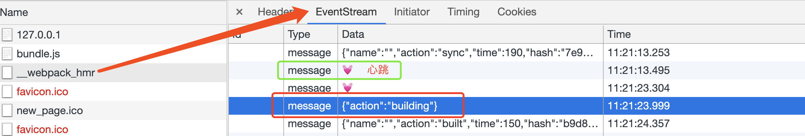

## 总结

1. 热更新的关键是，即如何替换更新内容，主要是通过`module.hot`，即webpack的热更新插件生成的各种方法
   - 热更新的关键，实际是 webpack编译时，生成的`hot-update.json` 与`main.xxx.hot-update.js`
   - 这个js，包含 哪些文件需要更新的更新方法，只需重新require，即可
   - 但需要手动将dispose的模块，在当前module 树中删除
   - 思考下，snowpack的热更新逻辑，实际是利用了浏览器的import能力，修改某个模块，实际是，让浏览器重新import当前模块（浏览器做了卸载+重新引用新模块及子模块的事情）
   - webpack，则需要手动require，并手动卸载dispose模块
2. webpack-hot-middleware此插件，
   - 主要就是提供一个eventSource，从server想client传输需要数据，并在编译完成等不同时机调用 `module.hot`相关函数
   - 获取更新文件，module，chunks等信息
   - 将webpack编译输出到内存等功能
3. 对于server中间件，默认会返回原请求内容
   - 只有请求`/__webpack_hmr(options.path配置)`时，才会执行`eventStream.handler(req, res);`

## webpack-hot-middleware

### 备注

1. 使用example例子，修改`client.js`可以尝试热更新
2. 向服务器发送消息，可以使用websocket（webpack-dev-server）或enentSource（此中间件）


### server做了什么

1. 思考下，hot-middleware 

   - 主要是提供给客户端发热更新的操作，一般与webpack-dev-middleware联合使用，
   - 需要拿到webpack编译内容后，然后发送到客户端

2. `server`源码：

   ```javascript
   function webpackHotMiddleware(compiler, opts) {
     // 1. 配置默认值
     opts = opts || {};
     opts.log =
       typeof opts.log == 'undefined' ? console.log.bind(console) : opts.log;
     opts.path = opts.path || '/__webpack_hmr'; // 判断是否为eventSource发来的
     opts.heartbeat = opts.heartbeat || 10 * 1000;// 判断连接是否断了
     // 1. 创建 createEventStream
     var eventStream = createEventStream(opts.heartbeat);
     var latestStats = null;
     var closed = false;
     // 1. 绑定compiler.hooks
     if (compiler.hooks) {
       compiler.hooks.invalid.tap('webpack-hot-middleware', onInvalid);
       compiler.hooks.done.tap('webpack-hot-middleware', onDone);
     } else {
       compiler.plugin('invalid', onInvalid);
       compiler.plugin('done', onDone);
     }
     function onInvalid() {}
     function onDone(statsResult) {}
     // 包装函数，返回express满足的中间件
     var middleware = function (req, res, next) {
       if (closed) return next();
       if (!pathMatch(req.url, opts.path)) return next();
       // 特别注意：如果请求的不是/__webpack_hmr, 则不会执行
       eventStream.handler(req, res);
       if (latestStats) {
         // Explicitly not passing in `log` fn as we don't want to log again on
         // the server
         publishStats('sync', latestStats, eventStream);
       }
     };
     // 绑定方法，外露api
     middleware.publish = function (payload) {
       if (closed) return;
       eventStream.publish(payload);
     };
     middleware.close = function () {
       if (closed) return;
       closed = true;
       eventStream.close();
       eventStream = null;
     };
     return middleware;
   }
   ```
   
   - 配置默认值
   - 创建createEventStream
   - 绑定`compiler.hooks`，根据不同条件调用`eventStream.publish()`
   - 包装函数，返回express满足的中间件，主要是调用`eventStream.handler(req, res);`
   - 绑定方法，外露api，主要是close与publish方法
   
3. 特别注意：

   - 如果请求的不是/__webpack_hmr, 则不会执行`eventStream.handler(req, res);`及其后面的代码
   - 故只有刷新页面时，会重新请求此，会发送`action:sync`，热更新不会

#### 创建`createEventStream`

1. 主要是根据`heartbeat` 循环向各个client发送信息

   ```javascript
   function createEventStream(heartbeat) {
     var clientId = 0;
     var clients = {};
     function everyClient(fn) {
       Object.keys(clients).forEach(function (id) {
         fn(clients[id]);
       });
     }
     var interval = setInterval(function heartbeatTick() {
       everyClient(function (client) {
         // 发送什么，不重要，主要是为了判断客户端是否还在连接
         client.write('data: \uD83D\uDC93\n\n');// 是一个这个💓
       });
     }, heartbeat).unref();
     return {
       close: function () {},
       handler: function (req, res) {},
       publish: function (payload) {},
     };
   }
   ```

2. `createEventStream.close` 是清空定时器，关闭连接，清除`clients`

   ```javascript
   close: function () {
     clearInterval(interval);
     everyClient(function (client) {
       if (!client.finished) client.end();
     });
     clients = {};
   },
   ```

3. `createEventStream.publish ，向`clients`发送结构化数据

   ```javascript
   publish: function (payload) {
     everyClient(function (client) {
       client.write('data: ' + JSON.stringify(payload) + '\n\n');
     });
   },
   ```

4. `createEventStream.handler`，此中间件的关键调用函数

   ```javascript
   handler: function (req, res) {
     var headers = {
       // 省略
     };
   
     var isHttp1 = !(parseInt(req.httpVersion) >= 2);
     if (isHttp1) {
       req.socket.setKeepAlive(true);
       Object.assign(headers, {
         Connection: 'keep-alive',
       });
     }
   	// 1. 设置header
     res.writeHead(200, headers);
     
     res.write('\n');
     var id = clientId++;
     // 缓存res对象，如客户端close，则删除并断开连接
     clients[id] = res;
     req.on('close', function () {
       if (!res.finished) res.end();
       delete clients[id];
     });
   },
   ```
   
- 主要是设置header
   - 缓存res对象，方便在客户端close时，断开连接
   - 发送\n，给客户端
   
5. 小结

   - 虽然中间件调用的是handler函数，但实际这个和热更新并无关系
   - 热更新主要是当编译完成时，像浏览器push的数据

#### 绑定`compiler.hooks`

1. 在编译过程中

   ```javascript
   compiler.hooks.invalid.tap('webpack-hot-middleware', onInvalid);
   function onInvalid() {
     if (closed) return;
     latestStats = null;
     if (opts.log) opts.log('webpack building...');
     eventStream.publish({ action: 'building' });
   }
   ```

   - 如未close，则输出 building

     

2. 热更新的关键，是编译完成

   ```javascript
   compiler.hooks.done.tap('webpack-hot-middleware', onDone);
   function onDone(statsResult) {
     if (closed) return;
     // Keep hold of latest stats so they can be propagated to new clients
     latestStats = statsResult;
     publishStats('built', latestStats, eventStream, opts.log);
   }
   ```

   - 编译完成，调用`publishStats`，此函数主要是拼接一些客户端需要的数据给`eventStream.publish`

     ```javascript
     // statsResult 根据官网介绍，是包含统计数据的文件(stats data)
     // https://www.webpackjs.com/api/compiler-hooks/#done  done钩子，参数是stats
     // 
     function publishStats(action, statsResult, eventStream, log) {
       // toJson 介绍https://www.webpackjs.com/api/node/#stats-tojson-options-
       // 参数可以准确地控制并展示你想要的信息
       // 具体含义在https://www.webpackjs.com/configuration/stats/
       var stats = statsResult.toJson({
         all: false,
         cached: true,
         children: true,
         modules: true,
         timings: true,
         hash: true,
       });
       // For multi-compiler, stats will be an object with a 'children' array of stats
       var bundles = extractBundles(stats);
       bundles.forEach(function (stats) {
         var name = stats.name || '';
         // Fallback to compilation name in case of 1 bundle (if it exists)
         if (bundles.length === 1 && !name && statsResult.compilation) {
           name = statsResult.compilation.name || '';
         }
     
         if (log) {
         	// 暂略。。。
         }
         eventStream.publish({
           name: name,
           action: action,
           time: stats.time,
           hash: stats.hash,
           warnings: stats.warnings || [],
           errors: stats.errors || [],
           // 构建模块信息，构建map[module.id] = module.name 的映射
           modules: buildModuleMap(stats.modules),
         });
       });
     }
     function buildModuleMap(modules) {
       var map = {};
       modules.forEach(function (module) {
         map[module.id] = module.name;
       });
       return map;
     }
     ```
   
3. server会向client发送的action类型有

   - 编译中： `action: 'building' `
   - Done： `action: 'built'`
   - 刷新页面：`action: 'sync'`

### client做了什么

1. 首先，要特别注意，需要在`webpack.config.js`的entry，加入此中间件的`entry.js`，用于处理server发来的消息

2. `client.js`源码

   ```javascript
   var options = {
     path: '/__webpack_hmr',
     timeout: 20 * 1000,
     overlay: true,
     reload: false,
     log: true,
     warn: true,
     name: '',
     autoConnect: true,
     overlayStyles: {},
     overlayWarnings: false,
     ansiColors: {},
   };
   // 参见 https://www.webpackjs.com/api/module-variables/#__resourcequery-webpack-%E7%89%B9%E6%9C%89%E5%8F%98%E9%87%8F-
   // 如这样调用require('file.js?test')，则在file.js中，存在 __resourceQuery === '?test'
   if (__resourceQuery) {
     var querystring = require('querystring');
     var overrides = querystring.parse(__resourceQuery.slice(1));
     // 根据解析参数复写options
     setOverrides(overrides);
   }
   
   // 省略 window.EventSource 等判断
   // 会调用connect函数
   connect();
   ```

   - 主要是调用`connect`函数

#### `connect`函数

1. `connect`函数

   ```javascript
   function connect() {
     getEventSourceWrapper().addMessageListener(handleMessage);
   
     function handleMessage(event) {
       // 心跳标识
       if (event.data == '\uD83D\uDC93') {
         return;
       }
       try {
         processMessage(JSON.parse(event.data));
       } catch (ex) {
         if (options.warn) {
           console.warn('Invalid HMR message: ' + event.data + '\n' + ex);
         }
       }
     }
   }
   ```

2. 我们先看看`getEventSourceWrapper`做了什么

   ```javascript
   function getEventSourceWrapper() {
     if (!window.__whmEventSourceWrapper) {
       window.__whmEventSourceWrapper = {};
     }
     if (!window.__whmEventSourceWrapper[options.path]) {
       window.__whmEventSourceWrapper[options.path] = EventSourceWrapper();
     }
     // 会返回 addMessageListener 函数
     return window.__whmEventSourceWrapper[options.path];
   }
   ```

   - 理解为，就是缓存`options.path`，即 eventSource实例
   - 默认情况下，`options.path = '/__webpack_hmr'`，与server是对应的

3. `EventSourceWrapper`函数

   ```javascript
   function EventSourceWrapper() {
     var source;
     var lastActivity = new Date();
     var listeners = [];
     // 主函数****
     init();
     // 超时重连机制
     var timer = setInterval(function () {
       if (new Date() - lastActivity > options.timeout) {
         handleDisconnect();
       }
     }, options.timeout / 2);
     function init() {
       source = new window.EventSource(options.path);
       source.onopen = handleOnline;
       source.onerror = handleDisconnect;
       source.onmessage = handleMessage;
     }
   
     function handleOnline() {
       if (options.log) console.log('[HMR] connected');
       lastActivity = new Date();
     }
   
     function handleMessage(event) {
       lastActivity = new Date();
       for (var i = 0; i < listeners.length; i++) {
         listeners[i](event);
       }
     }
   
     function handleDisconnect() {
       clearInterval(timer);
       source.close();
       setTimeout(init, options.timeout);
     }
   
     return {
       addMessageListener: function (fn) {
         listeners.push(fn);
       },
     };
   }
   ```

   - 主要就是调用init函数，
   - 返回`addMessageListener`，会将回调函数`push`到`listeners`中，方便`source.onmessage`时处理
   - 特别注意：会启动一个定时器检测连接是否超时，然后重连。原理通过 `lastActivity` 来记录最近收到server信息的时间，然后定期检查 `new Date() - lastActivity > options.timeout` 来判断是否超时。如果超时就调用 `handleDisconnect` 方法去处理

4. 当一切准备就绪，收到message后，会调用1中的`handleMessage`，通过`processMessage`处理解析数据

   ```javascript
   
   function processMessage(obj) {
     switch (obj.action) {
       case 'building':
         // 打印log信息
         break;
       case 'built':
         // 打印log信息
         // fall through
       case 'sync':
         if (obj.name && options.name && obj.name !== options.name) {
           return;
         }
         var applyUpdate = true;
         // 省略。。。处理errors，warning等
         if (applyUpdate) {
           // 执行 update 操作
           processUpdate(obj.hash, obj.modules, options);
         }
         break;
       default:
         if (customHandler) {
           customHandler(obj);
         }
     }
   
     if (subscribeAllHandler) {
       subscribeAllHandler(obj);
     }
   }
   ```

#### processUpdate函数

1. 定义在：`process-update.js`

   ```javascript
   module.exports = function (hash, moduleMap, options) {
     var reload = options.reload;
     // status(): 取得模块热替换进程的当前状态; idle 该进程正在等待调用 check
     if (!upToDate(hash) && module.hot.status() == 'idle') {
       if (options.log) console.log('[HMR] Checking for updates on the server...');
       check();
     }
   
     function check() {
       var cb = function (err, updatedModules) {
         if (err) return handleError(err);
   			// 新module不存在，直接重新加载
         if (!updatedModules) {
           // window.location.reload();
           performReload();
           return null;
         }
   
         var applyCallback = function (applyErr, renewedModules) {
           if (applyErr) return handleError(applyErr);
           // 如此时有新文件，则重新check
           if (!upToDate()) check();
           logUpdates(updatedModules, renewedModules);
         };
   			// applyOptions 配置的函数，会在执行 hot.apply的不同阶段调用
         var applyResult = module.hot.apply(applyOptions, applyCallback);
         // 兼容  webpack 2 promise
         if (applyResult && applyResult.then) {
            // 省略。。。。
         }
       };
       // module.hot.check 测试所有加载的模块以进行更新，如果有更新，则应用它们。
       // 具体这参数false何意，参见下文
       var result = module.hot.check(false, cb);
       // 兼容 webpack 2 promise
       if (result && result.then) {
         // 省略。。。。
       }
     }
   };
   ```

   - 如果新文件hash与当前文件hash不同，且`module.hot`处于idle状态，则执行check
   - 对于`module.hot`，
     - 这里面主要是调用 check，传入 cb 回调，处理updatedModules不存在情况
     - 然后在其中调用apply，传入applyCallback 回调，处理error，并打印日志

## module.hot详解

### 回顾

1. 正常webpack打包后结果，大致是

   ```javascript
   (function(modules){
     ...(webpack的函数)
     return __webpack_require__(__webpack_require__.s = "./main.js");
   })(
    {
      "./a.js": (function(){...}),
      "./b.js": (function(){...}),
    }
   )
   ```

2. `__webpack_require__`函数

   ```javascript
   function __webpack_require__(moduleId) {
     if(installedModules[moduleId]) {
       return installedModules[moduleId].exports;
     }
     var module = installedModules[moduleId] = {
       i: moduleId,
       l: false,
       exports: {}
     };
     modules[moduleId].call(module.exports, module, module.exports, __webpack_require__);
     module.l = true;
     return module.exports;
   }
   ```

   - 每个import，都会调用`__webpack_require__`，来加载内容

### 热更新插件（HotModuleReplacementPlugin）

1. 此插件是webpack内置插件，首先是对`__webpack_require__`进行改写

   ```javascript
   function __webpack_require__(moduleId) {
     if(installedModules[moduleId]) {
       return installedModules[moduleId].exports;
     }
     var module = installedModules[moduleId] = {
       i: moduleId,
       l: false,
       exports: {},
       // 主要差异*****
       hot: hotCreateModule(moduleId),
       parents: (hotCurrentParentsTemp = hotCurrentParents, hotCurrentParents = [], hotCurrentParentsTemp),
       children: []
     };
     // 主要差异*****
     modules[moduleId].call(module.exports, module, module.exports, hotCreateRequire(moduleId));
   
     module.l = true;
     return module.exports;
   }
   ```

   - 主要差异，一个是在module上绑定hot，parents，children属性
     - `hot: hotCreateModule(moduleId)`，会生成hot相关方法，如check，apply等，这也是为何在hot中间件，可以调用`module.hot.check`的原因
   - 另一个是，传入给子module的require 函数是 `hotCreateRequire`

#### hot.check

1. 当一个文件改动后，会触发webpack重新编译，webpack-hot-middleware会将编译后的chunk，module信息，通过eventSource发送给client.js

2. 首先会执行`module.hot.check`，即`hotCheck`函数

   ```javascript
     function hotCheck(apply) {
         if (hotStatus !== "idle") {
             throw new Error("check() is only allowed in idle status");
         }
         hotApplyOnUpdate = apply;
         // 更改hot状态为check
         // 执行 hotStatusHandlers 函数数组
         // hot.status(l) => hotStatusHandlers.push(l)
         // 或调用 hot.addStatusHandler
         hotSetStatus("check");
       	// update 是 hotDownloadManifest  结果，即 xxxx.hot-update.json
         return hotDownloadManifest(hotRequestTimeout).then(function(update) {
           // 暂略
         });
     }
   ```

   - 因此，此函数，就是设置check状态，并执行`hotStatusHandlers`函数数组
   - `hotDownloadManifest`，主要是xhr的promise封装，下载`hotCurrentHash + ".hot-update.json"` 指定hash的hot-update.json
   - 备注：这个文件是webpack，引入hmr插件自动生成的，由于example使用`webpack-dev-middleware`，默认将文件输出在内存，可设`writeToDisk: true`，看到每次编译后，都会有xxxx.hot-update.json生成

3. 文件下好后，执行`hotDownloadManifest(hotRequestTimeout).then`

   ```javascript
   function hotCheck(apply) {
     // update 是 hotDownloadManifest  结果，即 xxxx.hot-update.json
     return hotDownloadManifest(hotRequestTimeout).then(function(update) {
       if (!update) {
         hotSetStatus(hotApplyInvalidatedModules() ? "ready" : "idle");
         return null;
       }
       hotRequestedFilesMap = {};
       hotWaitingFilesMap = {};
       // 配置为json的c和h
       hotAvailableFilesMap = update.c;
       hotUpdateNewHash = update.h;
   
       hotSetStatus("prepare");
       var promise = new Promise(function(resolve, reject) {
         hotDeferred = {
           resolve: resolve,
           reject: reject
         };
       });
       hotUpdate = {};
       // 对应热更新js是 main.xxxxxx.js
       var chunkId = "main";
       // eslint-disable-next-line no-lone-blocks
       {
         // 如果未缓存当前chunkId对应的 js
         // 则将js利用script插在head末尾；只添加不删除
         // 当前情况下：hotWaitingFiles++ ，故不会执行下面hotUpdateDownloaded
         hotEnsureUpdateChunk(chunkId);
       }
       // 暂时略过，未进入此条件
       if (
         hotStatus === "prepare" &&
         hotChunksLoading === 0 &&
         hotWaitingFiles === 0
       ) {
         hotUpdateDownloaded();
       }
       return promise;
     });
   }
   ```

4. 因此，check 函数主要就是下载对应hot-update.json，以及xxxxxx.js（插入在header中）

#### 加载新的main.xxxxxx.hot-update.js

1. 这个热更新js，大致是，类似于jsonp请求

   ```javascript
   webpackHotUpdate(main, { "./xxxxx.js": (function() { .... })})
   ```

2. 会优先调用bundle中的`webpackHotUpdate`

   ```javascript
   window["webpackHotUpdate"] = function webpackHotUpdateCallback(chunkId, moreModules) {
     // 主要是对 hotUpdate赋值， 
     // 循环hotUpdate获取hasOwnProperty，将key push到outdatedModules，调用deferred.resolve(outdatedModules); 返回结果
     hotAddUpdateChunk(chunkId, moreModules);
     if (parentHotUpdateCallback) parentHotUpdateCallback(chunkId, moreModules);
   } ;
   ```

   - 因此，processUpdate函数的 check 的cb函数，参数实际是outdatedModules，即 hotUpdate对象

#### hot.apply

1. 即执行`hotApply`函数，执行最关键的`hotApplyInternal`

2. `hotApplyInternal`内部逻辑简述，首先是，遍历需要热更新的模块`hotUpdate`

   ```javascript
   function hotApplyInternal(options) {
     for (var id in hotUpdate) {
       if (Object.prototype.hasOwnProperty.call(hotUpdate, id)) {
         moduleId = toModuleId(id);
         var result;
         // 如果模块卸载，会被设为false
         if (hotUpdate[id]) {
           result = getAffectedStuff(moduleId);
         } else {
           result = {
             type: "disposed",
             moduleId: id
           };
         }
         if (result.chain) {
           chainInfo = "\nUpdate propagation: " + result.chain.join(" -> ");
         }
         // 针对不同type ，会调用，外部options定义的对应方法
         switch (result.type) {
           case "self-declined":
             if (options.onDeclined) options.onDeclined(result);
             break;
           case "declined":
             if (options.onDeclined) options.onDeclined(result);
             break;
           case "unaccepted":
             if (options.onUnaccepted) options.onUnaccepted(result);
             break;
           case "accepted":
             if (options.onAccepted) options.onAccepted(result);
             doApply = true;
             break;
           case "disposed":
             if (options.onDisposed) options.onDisposed(result);
             doDispose = true;
             break;
           default:
             throw new Error("Unexception type " + result.type);
         }
         if (abortError) {
           // 暂略。。
         }
         if (doApply) {
           // 暂略。。
         }
         if (doDispose) {
           // 暂略。。
         }
       }
     }
   
     // Store self accepted outdated modules to require them later by the module system
  // 遍历outdatedModules，符合某些条件的加入outdatedSelfAcceptedModules
     var outdatedSelfAcceptedModules = [];
  for (i = 0; i < outdatedModules.length; i++) {
       // 暂略。。
  }
   }
   ```
   
   - 如`clint.js`内部引入`test.js`，当删除`test.js`时，请求的update.json，`test.js: false`，即`hotUpdate['./test.js'] = false`
   
   - `getAffectedStuff`会针对`moduleId`返回，如下结构化数据（修改了client.js 会得到如下结果）， 具体细节过。。
   
     ```javascript
  {
       moduleId: "./client.js"
       outdatedDependencies: {}
       outdatedModules: ["./client.js"]
       type: "accepted"
     }
     ```
   
   - `doApply与doDispose`，主要是配置`appliedUpdate[moduleId] 方法`，并对`outdatedModules` 赋值
   
     ```javascript
     if (doApply) {
       // 方法,  hotUpdate[moduleId] 实际是xxxxx.hot-update.js，返回对象，对应的方法
       appliedUpdate[moduleId] = hotUpdate[moduleId];
       addAllToSet(outdatedModules, result.outdatedModules);
       for (moduleId in result.outdatedDependencies) {
         if (
           Object.prototype.hasOwnProperty.call(
             result.outdatedDependencies,
             moduleId
           )
         ) {
           if (!outdatedDependencies[moduleId])
             outdatedDependencies[moduleId] = [];
           addAllToSet(
             outdatedDependencies[moduleId],
             result.outdatedDependencies[moduleId]
           );
         }
       }
     }
     if (doDispose) {
       // push到outdatedModules中
       addAllToSet(outdatedModules, [result.moduleId]);
       // warnUnexpectedRequire实际是 一个console.warn 函数
       appliedUpdate[moduleId] = warnUnexpectedRequire;
     }
     ```
   
   - 遍历完`hotUpdate`后，遍历outdatedModules，符合某些条件的加入outdatedSelfAcceptedModules
   
3. 进入 `dispose`阶段

   ```javascript
   hotSetStatus("dispose");
   // 暂略.. 也是删除信息的
   Object.keys(hotAvailableFilesMap).forEach(function(chunkId) {
     if (hotAvailableFilesMap[chunkId] === false) {
       // delete installedChunks[chunkId];
       hotDisposeChunk(chunkId);
     }
   });
   
   var idx;
   var queue = outdatedModules.slice();
   // 循环outdatedModules 队列
   while (queue.length > 0) {
     moduleId = queue.pop();
     // 当前全部安装的模块 installedModules 
     module = installedModules[moduleId];
     if (!module) continue;
   
     var data = {};
   
     // Call dispose handlers
     // 外部调用 dispose 时， 会 hot._disposeHandlers.push(cb)
     // 如经常会在js写
     // if (module.hot) {
     //     module.hot.dispose(function () {
     //         xxxxxxx
     //     });
     // }
     var disposeHandlers = module.hot._disposeHandlers;
     for (j = 0; j < disposeHandlers.length; j++) {
       cb = disposeHandlers[j];
       cb(data);
     }
     hotCurrentModuleData[moduleId] = data;
   
     // disable module (this disables requires from this module)
     module.hot.active = false;
     // remove module from cache
     delete installedModules[moduleId];
     // when disposing there is no need to call dispose handler
     delete outdatedDependencies[moduleId];
   
     // remove "parents" references from all children
     for (j = 0; j < module.children.length; j++) {
       var child = installedModules[module.children[j]];
       if (!child) continue;
       idx = child.parents.indexOf(moduleId);
       if (idx >= 0) {
         child.parents.splice(idx, 1);
       }
     }
   }
   
   // remove outdated dependency from module children
   var dependency;
   var moduleOutdatedDependencies;
   for (moduleId in outdatedDependencies) {
   	// 暂略。。。删除过时依赖
   }
   ```

   - 删除当前模块`installedModules[moduleId]`
   - 调用，外部调用`dispose`方法时，传入的回调函数
   - 把所有模块的children，删除当前模块
   - 总之，dispose，就是在模块树结构中，把要删除的模块全部剔除掉

4. 进入`apply`阶段

   ```javascript
   hotSetStatus("apply");
   // 更新最新hash，并重置一些数据
   if (hotUpdateNewHash !== undefined) {
     hotCurrentHash = hotUpdateNewHash;
     hotUpdateNewHash = undefined;
   }
   hotUpdate = undefined;
   
   // insert new code
   // 对于需要插入的module，直接绑到modules上
   for (moduleId in appliedUpdate) {
     if (Object.prototype.hasOwnProperty.call(appliedUpdate, moduleId)) {
       // 有何用？？ 主要是__webpack_require__调用时，会执行
       // modules[moduleId].call(module.exports, module, module.exports, hotCreateRequire(moduleId));
       modules[moduleId] = appliedUpdate[moduleId];
     }
   }
   
   // call accept handlers
   var error = null;
   // 内部调用： modele.hot._acceptedDependencies, 会根据 hot.accept(dep,callback)，对其进行赋值
   for (moduleId in outdatedDependencies) {
     // 暂略。。。。
   }
   
   // Load self accepted modules
   for (i = 0; i < outdatedSelfAcceptedModules.length; i++) {
     var item = outdatedSelfAcceptedModules[i];
     moduleId = item.module;
     hotCurrentParents = item.parents;
     hotCurrentChildModule = moduleId;
     try {
       // 重新加载：moduleId， 即可以简单理解为，去执行xxxxx.hot-update.js['./client.js']返回的函数
       __webpack_require__(moduleId);
     } catch (err) {
       // 暂略。。。处理错误。。
     }
   }
   
   // handle errors in accept handlers and self accepted module load
   if (error) {
     hotSetStatus("fail");
     return Promise.reject(error);
   }
   
   if (hotQueuedInvalidatedModules) {
     // 暂略。。
   }
   hotSetStatus("idle");
   ```

   - 因此，应用模块，主要是
   - 将`modules[moduleId]`重新赋值
   - 调用：`__webpack_require__`，重新加载新模块

   

#### 加载新模块

1. 根据回顾，默认情况下，模块加载调用

   ```javascript
   modules[moduleId].call(module.exports, module, module.exports, __webpack_require__);
   ```

2. 而经过hrm改写后，实际会调用

   ```javascript
   modules[moduleId].call(module.exports, module, module.exports, hotCreateRequire(moduleId));
   ```

3. 即，针对每个moduleId，会调用`hotCreateRequire`

   ```javascript
   function hotCreateRequire(moduleId) {
     var me = installedModules[moduleId];
     if (!me) return __webpack_require__;
     var fn = function(request) {};
     var ObjectFactory = function ObjectFactory(name) {};
     // 将 __webpack_require__ 原有方法，全部定义到 fn上
     for (var name in __webpack_require__) {
       if (
         Object.prototype.hasOwnProperty.call(__webpack_require__, name) &&
         name !== "e" &&
         name !== "t"
       ) {
         Object.defineProperty(fn, name, ObjectFactory(name));
       }
     }
     fn.e = function(chunkId) {};
     fn.t = function(value, mode) { };
     return fn;
   }
   ```

   - 相当于为`__webpack_require__` 扩展了 e 和 t方法
   - 具体改写，作用暂略。并不影响主流程

4. 总结

   - 能热更新，实际依赖于hrm，编译时生成的xxxx.hot-update.js 只是将返回的函数重新require
   - 但需要手动将当前模块，删除掉