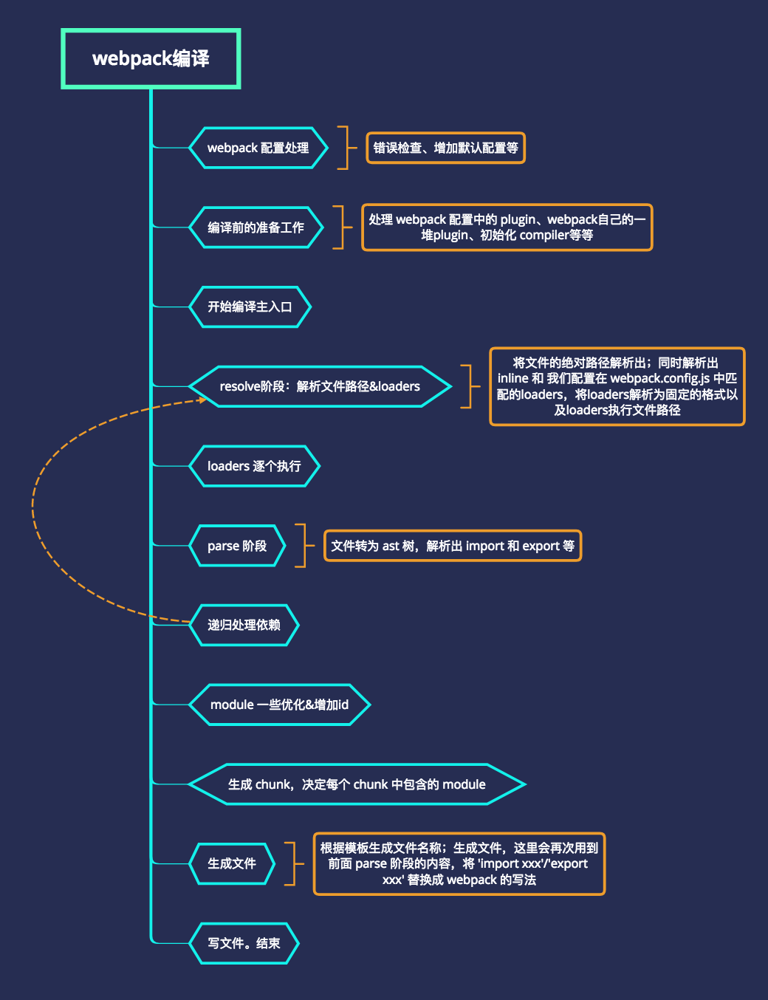

# 学习

1. window["webpackJsonp"]
   - 如果一个 HTML 页面中，会加载多个 webpack 独立打包出来的文件。那么这些文件异步加载的回调函数，默认都叫 "webpackJonsp"，会相互冲突。需要通过 output.jsonpFunction 配置修改这个默认的函数名称。
2. 基本demo与异步加载是如何进行的
   - 异步加载主要是通过在 HTML 中插入一个 script 标签加载，并在`window["webpackJsonp"]`绑定异步模块，避免多次加载
   - 基本demo，主要是学习如何处理import与export

# 总览

## 基本事例

1. 简单的demo例子

   ```javascript
   // main.js
   import { A } from './a'
   import B from './b'
   console.log(A)
   B()
   // a.js
   export const A = 'a'
   // b.js
   export default function () {
       console.log('123')
   }
   // webpack.config.js
   const path = require('path');
   module.exports = {
       entry: './main.js',
       output: {
           path: path.resolve(__dirname, 'dist'),
           filename: 'bundle.js'
       },
       mode: 'development'
   };
   // package.json
   "build": "webpack"
   ```

   - 注意：直接运行webpack命令，进行打包

2. 经过webpack打包得到的文件是

   ```javascript
   (function(modules){
     ...(webpack的函数)
     return __webpack_require__(__webpack_require__.s = "./main.js");
   })(
    {
      "./a.js": (function(){...}),
      "./b.js": (function(){...}),
      "./main.js": (function(){...}),
    }
   )
   ```

   - 可以看到webpack打包后的文件是一个立即执行函数，modules对应的是传入的`{"./a.js": xxx, "./b.js": xxxx}`
   - 自执行函数最后会调用`__webpack_require__(main.js)`从入口文件main.js开始执行

3. `__webpack_require__`函数

   ```javascript
   function __webpack_require__(moduleId) {
     // Check if module is in cache
     if(installedModules[moduleId]) {
       return installedModules[moduleId].exports;
     }
     // Create a new module (and put it into the cache)
     var module = installedModules[moduleId] = {
       i: moduleId,
       l: false,
       exports: {}
     };
     // Execute the module function
     modules[moduleId].call(module.exports, module, module.exports, __webpack_require__);
     // Flag the module as loaded
     module.l = true;
     // Return the exports of the module
     return module.exports;
   }
   ```

   - 此函数非常简单，查看是否有缓存，如果没有则调用 modules
   - 首先会执行`modules["main.js"].call()`

4. main.js

   ```javascript
   __webpack_require__.r(__webpack_exports__);
   /* harmony import */ var _a__WEBPACK_IMPORTED_MODULE_0__ = __webpack_require__(/*! ./a */ "./a.js");
   /* harmony import */ var _b__WEBPACK_IMPORTED_MODULE_1__ = __webpack_require__(/*! ./b */ "./b.js");
   console.log(_a__WEBPACK_IMPORTED_MODULE_0__["A"])
   Object(_b__WEBPACK_IMPORTED_MODULE_1__["default"])()
   ```

   - 首先执行的r函数，实际就是配置`__webpack_exports__`对象`__esModule`为true，并且`Object.prototype.toString.call(__webpack_exports__);`为"[object Module]"而不是"[object Object]"
   - 可以看到我们import都会调用`__webpack_require__`函数执行，那么进入a.js后，还需要处理export

5. a.js

   ```javascript
   __webpack_require__.r(__webpack_exports__);
   /* harmony export (binding) */ __webpack_require__.d(__webpack_exports__, "A", function() { return A; });
   const A = 'a'
   ```

   - 主要是将A收集到`__webpack_exports__`中
   - 这样main.js 中的返回值module.exports就具有a.js 的导出值

6. 而对于默认导出，实际会直接设置`__webpack_exports__["default"]`

   ```javascript
   __webpack_exports__["default"] = (function () {
       console.log('b')
   })
   ```

## 异步加载

1. 注意配置`output.publicPath: 'dist/'`， 否则异步加载文件会从`''`下开始查找

2. 异步加载的简单demo

   ```javascript
   // main.js
   import('./c.js').then(test => {
       console.log(test)
   });
   // c.js
   export default {
       key: 'something'
   }
   ```

3. main.js会被编译为，会调用`e`这个函数异步加载c.js

   ```javascript
   __webpack_require__.e(/*! import() */ 0).then(__webpack_require__.bind(null, /*! ./c.js */ "./c.js")).then(test => {
       console.log(test)
   });
   ```

   - e这个函数实际是通过在 HTML 中插入一个 script 标签加载c.js

4. c.js

   ```javascript
   (window["webpackJsonp"] = window["webpackJsonp"] || []).push([[0],{
   "./c.js":(function(module, __webpack_exports__, __webpack_require__) {
   eval("__webpack_require__.r(__webpack_exports__);\n/* harmony default export */ __webpack_exports__[\"default\"] = ({\n    key: 'something'\n});\n\n\n//# sourceURL=webpack:///./c.js?");
   })
   }]);
   ```

   - 实际会执行`window["webpackJsonp"] = window["webpackJsonp"] || []).push([[0],{ "./c.js": xxxxx]}`
   - 由于webpack将``window["webpackJsonp"].push`重写为`webpackJsonpCallback`函数
   - `webpackJsonpCallback`函数主要功能是将c.js保存在modules里面，并设置`installedChunks`标志位
   - 这样在then中就可以获取c.js这个module了

## 小结

1. 通过上述demo可以大致liaojwebpack的流程
2. 首先对配置文件进行处理
3. 根据入口，进行文件位置解析
4. 加载解析的文件，然后递归查找全部依赖的文件
5. 利用module对文件进行处理
6. 最终输出结果



# 打包原理

## chunk 和 module

1. module：每一个源码 js 文件其实都可以看成一个 module
2. chunk：每一个打包落地的 js 文件其实都是一个 chunk，每个 chunk 都包含很多 module
   - 默认的 chunk 数量实际上是由你的入口文件的 js 数量决定的，但是如果你配置动态加载或者提取公共包的话，也会生成新的 chunk。

# webpack 流程分析

## debug Webpack

1. `npm install --global node-nightly`
2. 在浏览器中访问 `chrome://inspect`
3. `node-nightly --inspect-brk ./node_modules/webpack/bin/webpack.js`
	- --inspect-brk：会在脚本第一句有断点

## shell与config解析

1. 每次在命令行输入 webpack 后，操作系统都会去调用 `./node_modules/.bin/webpack` 这个 shell 脚本
2. 这个脚本会去调用 `./node_modules/webpack/bin/webpack.js` 并追加输入的参数，如 -p , -w
3. cmd的脚本看不懂，但在本地文件的node_modules/webpack/bin/webpack.js写个console
4. 在命令行运行时，会发现运行的确实是这个脚本

# 代码分离

## 手动配置entry

1. 如入口有多个重复模块，会被引入到各个bundle中
2. 不够灵活

## 防止重复

1. 利用`SplitChunksPlugin`替换之前的`commonsChunkPlugin`，由于之前插件无法进一步优化

2. 如使用splitChunksPlugin默认行为，则直接使用：

	```javascript
	optimization: {
	    splitChunks: {
	        chunks: 'all'
	    }
	}
	```

## 动态代码拆分

1. 推荐方式：es的import()提案，实现动态导入
	- import()会在内部用到promises
2. 遗留方式：webpack的require.ensure

# tree-shaking

## 概述

1. 消除无用的js代码，编译器可以判断出某些代码根本不影响输出，然后消除这些代码，这个称之为DCE（dead code elimination）。
2. tree-shaking是DCE的新实现，传统方法消灭不可能执行的代码，而Tree-shaking 更关注消除没有用到的代码

# 文件Hash值

## hash

1. hash是跟整个项目的构建相关

2. 只要项目里有文件更改，整个项目构建的hash值都会更改，并且全部文件都共用相同的hash值

3. 主要作用可以是：

   ```json
   output: {
       filename: '/dest/[hash]/[name].js'
   }
   ```

   - 将每次编译放在一个文件夹内

## chunkhash

1. 采用hash计算的话，每一次构建后生成的哈希值都不一样，即使文件内容压根没有改变，这样子是没办法实现缓存效果
2. chunkhash根据不同的入口文件(Entry)进行依赖文件解析、构建对应的chunk，生成对应的哈希值
3. 只要公共库代码不改变，就可以保证hash值不变

## contenthash

1. 假如index.css被index.js引用，两个共用相同是chunkhash
2. 如js改变导致css文件重新构建，会生成新的chunkhash
3. 因此使用contenthash保证文件内容不变化

# 如何调试webpack程序

1. 不知如何调试整个webapck的项目，可以调试某个具体文件
2. node --inspect-brk build/utils.js，控制台会输出
3. 在浏览器地址栏输入，chrome://inspect/#devices，并点击Open dedicated DevTools for Node，打开node调试的控制台
4. 在Node控制台输入要监听的地址
5. 