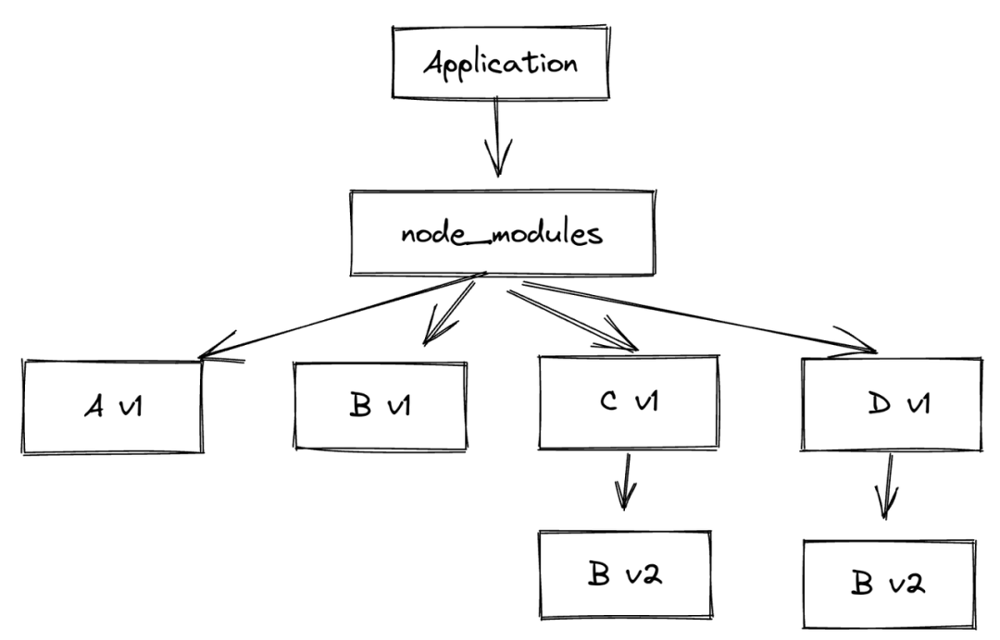
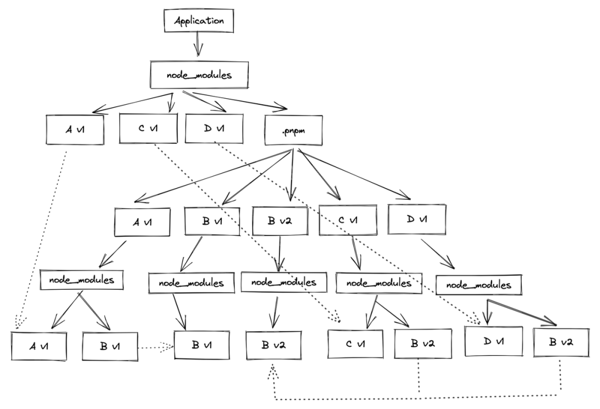

# npx

## 简化模块调用

1. 如在项目安装一个模块，如想在命令行使用需要`node-modules/.bin/mocha --version`

2. npx想要解决的就是这个问题，利用npx可以

   `npx mocha --version`

## 避免全局安装模块

1. `npx create-react-app my-react-app`运行create-react-app但不安装
2. 会下载使用后删除create-react-app，之后再次执行上述命令，会再次下载
3. `--no-install`参数会强制使用本地模块，如本地没有，会报错`npx --no-install http-server`
4. `--ignore-existing`参数强制使用远程模块

# 

# NPM

1. npm 是 Node.js 能够如此成功的主要原因之一。npm 团队做了很多的工作，以确保 npm 保持向后兼容，并在不同的环境中保持一致。

2. npm 是围绕着[语义版本控制（semver）](http://semver.org/)的思想而设计的

3. 语义版本控制：给定一个版本号：主版本号. 次版本号. 补丁版本号

   - 主版本号： 当 API 发生改变，并与之前的版本不兼容的时候
   - 次版本号： 当增加了功能，但是向后兼容的时候
   - 补丁版本号： 当做了向后兼容的缺陷修复的时候

4. npm的问题

   - 大多数 npm 库都严重依赖于其他 npm 库，这会导致嵌套依赖关系，并增加无法匹配相应版本的几率。
   - 为了解决这个问题，npm 提供了 [`shrinkwrap`](https://docs.npmjs.com/cli/shrinkwrap)命令。

5. `npm 2`会安装每一个包所依赖的所有依赖项。如果我们有这么一个项目，它依赖项目 A，项目 A 依赖项目 B，项目 B 依赖项目 A与C，那么依赖树将如下所示：

   ```
   node_modules
   - package-A
   -- node_modules
   --- package-B
   ----- node_modules
   ------ package-A
   ------ package-C
   -------- some-really-really-really-long-file-name-in-package-c.js
   ```

   - 主要问题：
     - 层层嵌套：很多程序无法处理超过 260 个字符的文件路径名，嵌套层级太深很容易超过这个限制
     - 依赖包重复安装

6. `npm 3`采用了扁平依赖关系树来解决这个问题：

   ```
   node_modules
   - package-A
   - package-B
   - package-C
   -- some-file-name-in-package-c.js
   ```


主要缺点

1. npm 必须首先遍历所有的项目依赖关系，然后再决定如何生成扁平的`node_modules`目录结构。

2. npm 必须为所有使用到的模块构建一个完整的依赖关系树，这是一个耗时的操作

3. [幽灵依赖](#Phantom dependencies(幽灵依赖))问题

4. doppelgangers(双胞胎陌生问题)，解决的办法是lock文件

   - 一个包不同版本会按照两次，如下，Bv1被提升，Bv2安装在C/D的子目录下

   - 如果Av1升级到Av2，内部依赖了BV2，那么BV2包可能会被提升，导致安装顺序不同产生问题

     

# Yarn

1. Yarn 一开始的主要目标是解决由于语义版本控制而导致的 npm 安装的不确定性问题。
   - 每个 yarn 安装都会生成一个类似于`npm-shrinkwrap.json`的`yarn.lock`文件，而且它是默认创建的。
   - 除了常规信息之外，`yarn.lock`文件还包含要安装的内容的校验和，以确保使用的库的版本相同。
2. yarn 无需互联网连接就能安装本地缓存的依赖项，它提供了离线模式，npm不可以
3. yarn 还提供了一些其他改进，例如，它允许合并项目中使用到的所有的包的许可证。

## yarn berry(yarn 2.x)

1. pnp 模式

   - 认为目前出现的各种问题很大程度上来自于 node_modules 本身：无论怎么样利用缓存，或者使用什么样的思路以及目录结构来设计 node_modules，只要你生成它，那么就需要知道 node_modules 要包含的内容并且执行繁重的 I/O 操作。

   - 为什么要生成Node_modules依赖呢？因为，node 会一层一层的依照目录层级顺序去 node_modules 中去寻找相应的依赖

   - pnp 特性要解决是上述问题，它会创建一个.pnp.cjs文件，做两件事：

     - 维护依赖包的版本、依赖包之间相互的依赖关系以及依赖包 zip 存储的位置

     - 对 node 的文件解析模块打上 monkey patch，使得代码在引入依赖的时候不走原本的 node_modules 解析那一套，而是直接寻找依赖包所在的位置。

   - 完全脱离了 node_modules resolution 机制，步子迈得太大，目前不太受欢迎

2. 插件化

   - 通过插件扩展，我们可以实现很多增强性功能，比如@yarnpkg/plugin-typescript，如果装一个包，没装ts，会自动装ts

# pnpm

举例

```javascript
Application -> A_v1 -> B_v1
            -> C_v1 -> B_v2
            -> D_v1 -> B_v2
```



1. 只有应用直接依赖的 A v1、C v1 以及 D v1 包在 node_modules 顶层中，而依赖的依赖，比如 B v1 和 B v2 都不在。那么如果在项目中直接引用 B 就无法找到相应的依赖包，直接报错。
2. 顶层 node_module 中的 A v1、C v1 以及 D v1 包都是源文件依赖包的 symbol link，源文件依赖包还有其相应的子依赖包都放在了 .pnpm 目录中。
3. 虽然表面上看起来 C v1 的依赖 B v2 以及 D v1 的依赖 B v2 也被重复的安装了两次，但是这两个 B v2 都是源文件 B v2 的 symbol link，

## hard link 机制

1. 利用Hard link机制，用户可以通过不同的路径引用方式去找到某个文件，pnpm 会在全局的 store 目录里存储项目 `node_modules` 文件的 `hard links` ，安装两个一样的文件实际存储是一个
2. 一般 store 目录默认是设置在 `${os.homedir}/.pnpm-store` 这个目录下
3. pnpm store prune： 清除仓库一些没有被引用的包，避免store无限膨胀

## Phantom dependencies(幽灵依赖)

1. 幽灵依赖，解释起来很简单，即某个包没有被安装(`package.json` 中并没有，但是用户却能够引用到这个包)。
2. 场景一，yarn会扁平化Node_modules安装包，依赖里面有个依赖叫做 foo，foo 这个依赖同时依赖了 bar，这两者会出现在同一级，根据 nodejs 的寻径原理，用户能 require 到 foo，同样也能 require 到 bar。
3. 场景二， yarn 中提供了 hoist 机制，一些底层的子项目经常会去 require 一些在自己里面没有引入的依赖，而直接去找顶层 node_modules 的依赖(nodejs 这里的寻径是个递归上下的过程)并使用。
4. pnpm被打平的依赖会被放到 `.pnpm` 这个虚拟磁盘目录下面，用户通过 require 是根本找不到的。

## NPM doppelgangers

1. hoist 情况下，如果一个包多个版本，由于只能有一个被hoist，故其他包还是被多次安装
2.  pnpm 依赖始终都是存在 store 目录下的 hard links 

# 依赖分发机制

1. 一般使用其他语言开发的 addon 之类的会把产物打包成一个可执行的二进制文件(例如 C++ 拓展一般是 `.node` 结尾的文件)。
2. postinstall 脚本安装的方式，例如安装 node-sass，会把 `native addon`(C++ 开发) 的预编译产物放在一个 CDN 地址里面，然后用户在使用 `npm install` 安装 `node-sass` 的时候，会通过 `postinstall` 脚本将 `addon` 产物文件从 CDN 上下载下来
   - 主要问题是：二进制文件地址是个 `Github release` 地址，无法兼顾海外和国内，虽然有镜像，但镜像不同步的问题也是时常会发生的
3. 通过`optionalDependencies`,`swc` 和 `esbuild` (v0.13之后)就采用的这种方式
   - 让对应的包管理工具在安装的时候对不同平台的包自动选择去安装哪个 `native package`
   - 缺点是：对开发者的负担会比较大，因为需要同时维护多个系统以及 CPU 架构的包。同时开发/调试也需要消耗很大的工作量。
4. vue周边迁移的原因
   - `yarn1` 的依赖安装机制问题导致在 `vite` 进行开发时，每次都会下载 `esbuild` 中所有的跨平台包(例如在 `android` 平台上也会下载 ios 的包)，对此会导致每次给 `vite` 仓库进行依赖安装的时候，耗费很久的时间。
   - 虽然yarn，npm后续版本也支持了这个特性， 但`pnpm` 的一些其他优势(例如对依赖的严格管理，快速的依赖安装，天然的 `monoreo workspace` 支持等)也吸引着 `vue` 生态迁移了包管理工具


# 软连接与硬链接

## inode

1. 文件存储在硬盘上，硬盘的最小存储单位叫做 "扇区"（ Sector,每个扇区存储 512 字节）。操作系统为提高效率，读取硬盘的时候，一次性连续读取多个扇区，这种一次性读取的连续多个扇区就是"块"( block )。这种由多个扇区组成的"块"，是文件存取的最小单位。"块"的大小，最常见的是 4KB，即连续八个 sector 组成一个 block。
2. 文件数据都储存在 "块" 中，必须有一个地方储存文件的元信息，比如文件的创建者、文件的创建日期、文件的大小等等。这种储存文件元信息的区域就叫做 inode ，中文译名为 "索引节点"。

## 软连接

1. 软链接类似于 Window 中的 “快捷方式” 。创建软链接会创建一个新的 inode，比如为文件 a 创建了软链接文件b，文件 b 内部会指向 a 的inode。当我们读取文件b的时候，系统会自动导向文件 a ，文件 b 就是文件 a 软连接(或者叫符号链接)。
2. npm link 是通过软连接实现的

## 硬链接

1. 一般情况，一个文件名"唯一"对应一个 inode。但是 linux 允许多个文件名都指向同一个 inode。表示我们可以使用不同对文件名访问同样的内容；对文件内容进行修改将放映到所有文件；删除一个文件不影响另一个文件对访问。这种机制就被称为"硬链接"
2. 只能给文件建立硬链接，不能给目录建立硬链接


