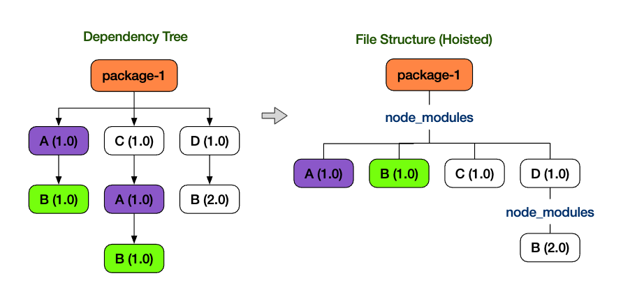
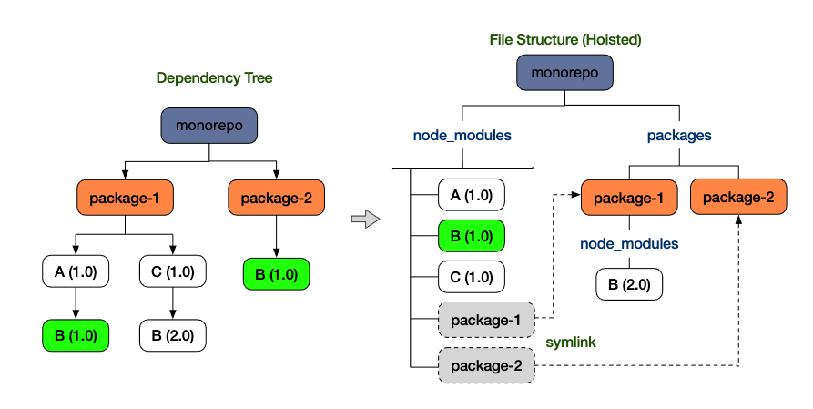
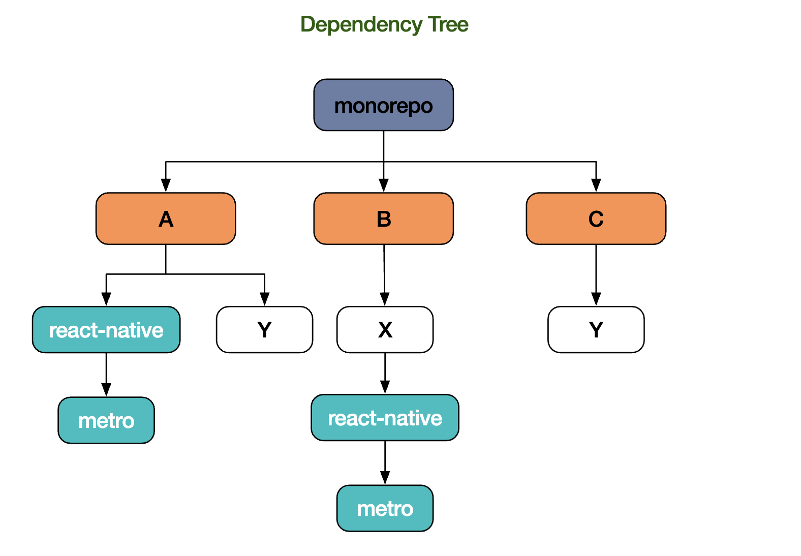
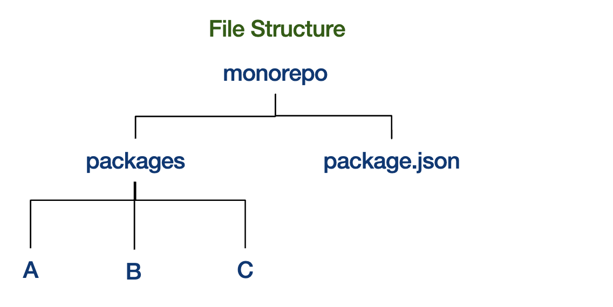
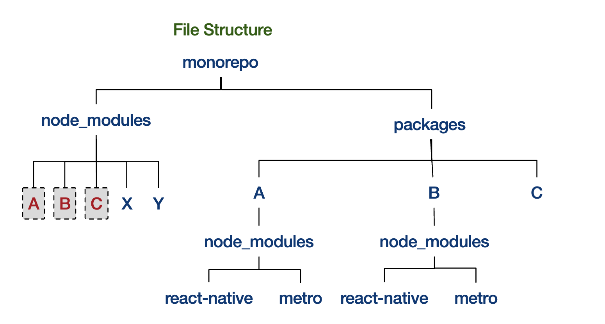

# 学习

1. 在独立项目与monorepo，包的不同依赖安装方式

2. nohoist：

   - monorepo由于某些包不兼容yarn的提升方案，或模块搜寻器无法准确搜索到包，或某些包根本就不支持monorepo环境
   - 总之就是。运行时报module not found，但子项目或根目录的node_modules实际是存在这个包的
   - 就利用nohoist机制，将包不进行提升，只安装在子项目中

3. 不但可以禁止某些包被提升到根目录，还可以在某些包中依赖另一些包

   ```json
   "nohoist": ["A/react-native", "A/react-native/**", "A/C"]
   ```

   

# yarn Workspaces 的 nohoist


其他社区还没有实现像yarn workspaces一样精彩的monorepo 提升机制。而yarn引入nohoist是尝试提供一个简单可用的机制，使yarn workspaces 可以与一些不兼容的库一起使用

# 问题是什么

首先，让我们快速了解下独立项目中的提升（hoist）工作方式：

为了减少冗余，大多数程序包管理器，都会采用某种提升方案，将所有依赖尽可能的集中在一个位置。在独立项目中，原始依赖关系如左图所示，右图为提升后的依赖关系树：



通过提升机制，我们可以消除重复的依赖“ A@1.0”和“ B@1.0”，同时保留版本差异（B@2.0）并保持相同的根目录结构`package-1/node_modules`。通过从项目根目录遍历“ node_modules”树，大多数模块搜寻器（crawlers）/加载器（loaders）/打包器（bundlers）可以非常有效地定位模块。

如相同的依赖出现在monorepo 项目中，项目出现了新的层次结构，依赖会被分散在各个子packages下



yarn workspaces通过将子模块依赖提升到其父目录`monorepo/node_modules`，来实现跨packages共享依赖。Monorepo项目中，子包有很多相同依赖，即有很高冗余度时，这样优化就显得尤为突出。

## 找不到模块！！

虽然看起来我们可以从项目的根目录node_modules访问所有依赖，但我们经常在子package构建项目（子包中执行 npm run build），而子package的依赖自己的node_modules下是不可见的。此外，并非所有模块搜寻器（crawlers）都遍历symlink

因此，使用yarn workspaces 的开发者，在构建子项目时，经常会看到：module not found 相关报错，例如：

- 在monorepo项目根目录下，可能会报：can’t find module “B@2.0” （原因是：模块遍历器并没通过`symlink`去找到`package-1/nodeules/B(2.0)`）
- 在目录“ package-1”，可能会报：can’t find module “A@1.0” （原因是：package-1并不知道在“ monorepo”的上述依赖树）

为了使monorepo项目能够从任何地方可靠地找到任何模块，它需要遍历每个node_modules树：` monorepo / node_modules`和` monorepo / packages / package-1 / node_modules`

# 为什么不能解决？

确实，库所有者可以通过多种方式解决这个问题，例如多根目录（multi-root），自定义模块映射（custom module map），更巧妙的遍历方案等等。但是，

1. 并非所有的第三方库都具有适配Monorepo项目的资源
2. 最弱一环问题：js得益于庞大的第3方库。所以，一个复杂的工具链的最强能力实际是由这个工具链最弱一环决定的，比如：在工具链深处的某个有问题的依赖可能会使整个工具失效。
3. bootstrap 问题：例如，react-native提供了一种通过`rn-cli.config.js`来配置`multi-root`的方法。但无法配合使用react-native init`或`create-react-native-app`，因为，在App 创建/安装之前，是无法访问这些工具的

独立项目的解决方案，却无法在monorepo中很好的使用，这是令人沮丧。理想的解决方案是解决底层库，但现实远非完美且我们的项目已经不能再等了

# 什么是“ nohoist”？

是否有一种简单但通用的机制可以使这些不兼容的库在monorepo环境中工作？

事实证明，可以使用nohoist，nohoist已在lerna monorepo得到了证明。

“ nohoist”使workspaces可以使用与yarn提升方案不兼容的第三方库。这样做的目的是禁止将选定的模块提升到项目根目录。它们被放置在实际的（子）项目中，就像在独立项目中一样。

由于大多数第三方库在独立项目中工作完全没问题，因此通过nohoist的方式，将workspaces模拟为独立项目能够消除许多已知的兼容性问题。

## 注意事项

尽管nohoist有用，但确实有缺点。最明显的问题是：nohoist模块可能会在多个地方重复。因此，我们建议在项目中使用nohoist范围保持尽可能小并且更明确。

## 什么时候可用？

需要在1.4.2版本之后

# 如何使用nohoist？

使用nohoist非常简单。它由package.json中定义的nohoist规则驱动。从1.4.2开始，yarn将采用新的workspaces配置格式，包含（可选）nohoist设置：

```javascript
// flow type definition:
export type WorkspacesConfig = {
  packages?: Array<string>,
  nohoist?: Array<string>,
};
```

例如：

1. 配置nohoist（注：monorepo根目录）

   ```json
   "workspaces": {
     "packages": ["packages/*"],
     "nohoist": ["**/react-native", "**/react-native/**"]
   }
   ```

2. 未配置nohoist

   ```json
   "workspaces": {
     "packages": ["packages/*"],
   }
   ```

3. 子项目，未配置nohoist

   ```json
   "workspaces": {
     "nohoist": ["react-native", "react-native/**"]
   }
   ```

   - 注意：对于不需要nohoist的用户，将旧的*workspaces*配置格式依然是支持的

nohoist规则只是用于在依赖树中进行模块路径匹配的 [glob 模式](https://github.com/isaacs/minimatch)集合。模块路径是依赖树的虚拟路径，而不是实际的文件路径，因此无需在nohoist模式中指定“ node_modules”或“ packages”。

# 如何关闭nohoist？

默认情况下，nohoist处于打开状态。如果在private package.json中看到nohoist配置，yarn将使用它

要关闭nohoist，只需从package.json中删除nohoist配置，或通过使用`.yarnrc`设置`workspaces-nohoist-experimental false`或通过命令yarn config set workspaces-nohoist-experimental false`。

# 调查（yarn why）

如果事情没有按预期发生怎么办？本地node_modules多了或少了某些模块？yarn 提供了强大的[`yarn why`](https://yarnpkg.com/en/docs/cli/why)命令告诉你某个包安装原因，你可以满足好奇心的仔细研究

该命令将确定为什么安装了某个包，例如详细说明了哪些软件包依赖于该包，或者是否在package.json中将其明确标记为依赖项


# 图示

让我们看一个简化的伪示例，以说明在我们的monorepo项目“ monorepo”中如何使用nohoist来防止`react-native`被提升。“ monorepo”下有3个子包：A，B和C：



`yarn install`执行前的文件目录结构如下：



项目monorepo根目录的package.json文件：

```json
{
  "name": "monorepo",
  "private": true,
  "workspaces": {
    "packages": ["packages/*"],
    "nohoist": ["**/react-native", "**/react-native/**"]
}
```

让我们仔细看一下package.json配置：

## Scope: private

nohoist仅适用于私有子包（private packages），因为workspaces仅适用于私有子包。

## glob 模式匹配

yarn内部会根据每个依赖的原始位置（提升之前）构造一个虚拟模块路径。如果此路径与提供的nohoist模式匹配，它将被提升到最近的子项目/包中

### 模块路径

A

- monorepo/A
- monorepo/A/react-native
- monorepo/A/react-native/metro
- monorepo/A/Y

B

- monorepo/B
- monorepo/B/X
- monorepo/B/X/react-native
- monorepo/B/X/react-native/metro

C

- monorepo/C
- monorepo/C/Y

### nohoist模式

package.json中nohoist配置的具体含义

1. `"**/react-native"`

   告诉yarn，无论`react-native`在哪，都不要对其自身进行提升

   前缀`**`表示：`react-native`前可以有0-n个元素，表示将匹配任何`react-native`，无论它出现在路径上的什么位置。

   模式以`react-native`结尾，表示` react-native / metro`之类的与该模式不匹配，因此称为“浅匹配”。

2. **/react-native/** `

   告诉yarn，不要提升自身与自身依赖的库

   后缀`**`：匹配1到n个元素，即只有react-native的依存关系会匹配此模式，而不是react-native本身。

   注意：并不是只有react-native的直接依赖与此模式匹配，依赖的依赖项也将匹配，因此称为“深匹配”。

结合这两种模式（浅匹配+深匹配），yarn不会提升`react-native `及其所有依赖

让我们尝试其他模式：

1. 仅对A 包的react-native设置

   ```json
   "nohoist": ["A/react-native", "A/react-native/**"]
   ```

2. 在构建`react-native` app时，A包需要B包

   ```json
   "nohoist": ["A/react-native", "A/react-native/**", "A/C"]
   ```

   - 在包A的node_modules下会创建到程序包C的symlink

## 提升后的文件结构

`yarn install` 后的文件结构



因为“ monorepo / A / Y”，“ monorepo / B / X”和“ monorepo / C / Y”与任何nohoist模式都不匹配，所以X与Y模块被提升到根目录下。请注意，即使“ monorepo / B / X / react-native”与nohoist模式匹配，但“ monorepo / B / X”是不匹配的。因此，`react-native`模块将保留在包“ B”中，而其原始父级“ X”被提升到根目录。

react-native和metro分别被放在A和B包下，因为它们与react-native nohoist模式匹配。请注意，即使B不直接依赖于`react-native`，它们仍然被提升为“ B”，就像在一个独立项目中一样。(注意与图示第一张图对比)

