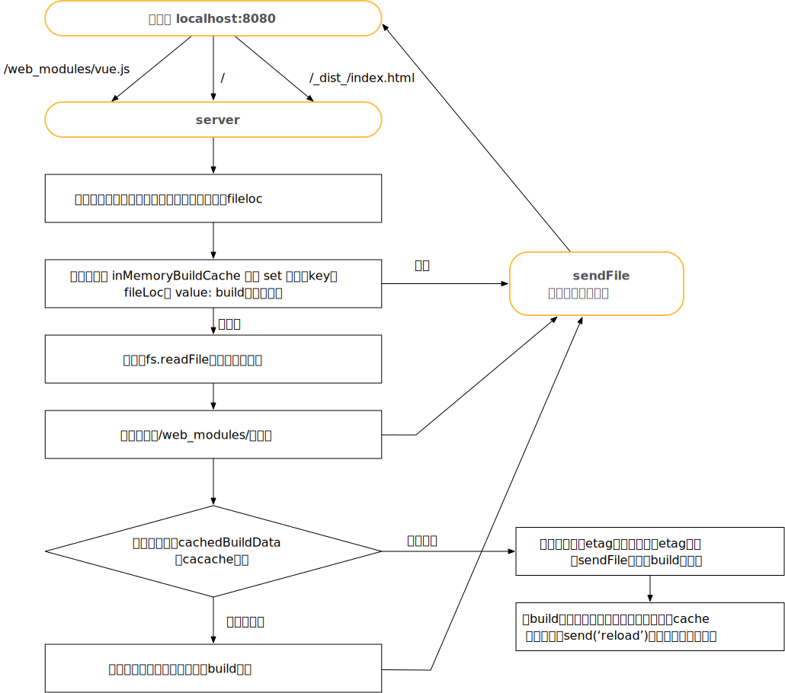
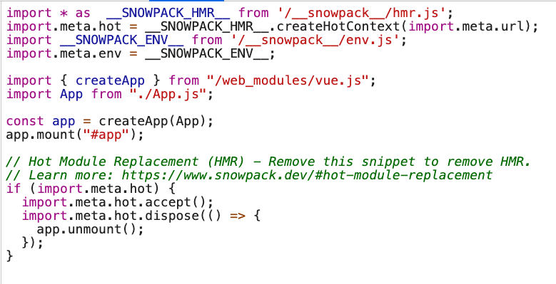
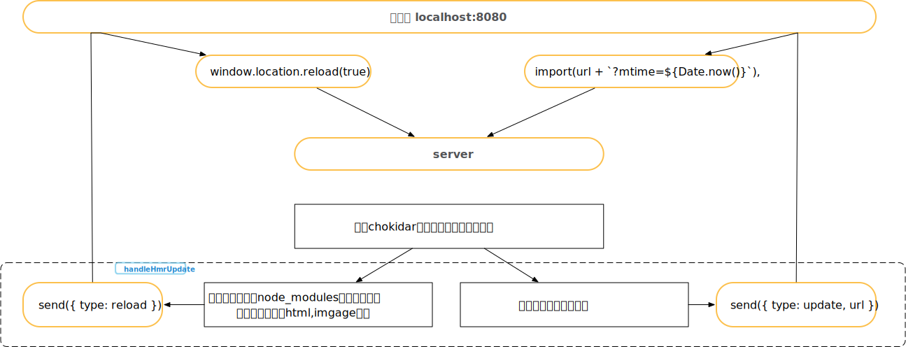

# 准备

1. 需要先将项目进行build，然后将命令行 snowpack dev转写为：node ../pkg/dist-node/index.bin.js dev 启用debug模式

1. `require('../') `会读取 package.json, index.js, or index.node

1. playground，package.json 直接利用如下形式，直接引用外部包

   ```javascript
   "lodash-es": "link:../node_modules/lodash-es",
   ```


# 概述

## 特点

1. dev 环境无需打包，start up 可以在50ms 或更少
   - 这主要是解决webpack或Parcel 在保存文件时，会rebuild & rebundle整个chunks文件
2. 可以在开发环境使用非 bundle 模式，生产环境使用bundle模式
3. 内置支持ts，jsx，css Modules
4. build时，可以使用官方提供的插件结合webpack使用
5. 设计目标
   - install npm包后可以直接在浏览器中执行代码
   - 理论上，只有 npm 安装的包需要 bundle
   - 借力浏览器对 import的支持，直接将文件发往浏览器
   - 这不仅仅是一个快速的工具，是一个新的web编译系统

## 详细介绍


1. bundle过程是O(n) 复杂度的问题
   - 更改一个文件，并不能单独打包当前文件，需要把这个文件相关的文件（chunk）都重新编译并打包
   - 每个编译过的文件会被独立缓存，只要文件没改过就永远不会rebuild
2. 但还不支持：yarn workspace https://www.pika.dev/npm/snowpack/discuss/286

# 源码解析

## 打包node_modules为esm 模块

1. 首先执行`yarn add --dev snoackpack`
   - 这个命令，内部会调用`install`方法，即遍历`package.json`将模块通过rollup打包为 esm module，放在`web_modules`文件夹下
   - 由于目前很多模块都有ESM支持，故这个命令执行与实际`npm install`速度差不多
2. 在默认配置下，会将src下的文件映射到`_dist_/`，node_modules的文件放在 `web_modules`，入口文件为`public/index.html`

## 准备工作

1. 利用`http\https\http2`的`createServer`方法，构造一个server
2. 然后 利用 ws(一个websocket包)+ server 构建一个 ESMHmrEngine
3. 利用chokidar这个模块，来 watch 文件，包括自己写的和node_modules全部 

## server开始运行

1. 请求过程示意图

   

   - 每个请求都会以上述流程进行处理，文件缓存与发送流程如上

2. 我们以`localhost:8080/`请求，针对`/`

   - snowpack会默认加载入口文件`public/index.html`

3. 请求到html后，

   ```html
   <!DOCTYPE html>
   <html lang="en">
     <body>
       <div id="app"></div>
       <script type="module" src="/_dist_/index.js"></script>
     </body>
   </html>
   
   ```

   - 会根据html的script，请求`/_dist_/index.js`
   - 然后根据 index.js 文件请求需要加载的文件

## 热更新



1. 当文件发生改变时，会`send({ type: update})`等标识符，浏览器的hrm.js 监听到有这些值时，会通过 `import('./xxx/xxxx')`方式加载更新文件

1. css是如何解析的呢？


# 问题

## 热更新配置

1. 启动热更新需要在`index.js`中增加，如下配置

   ```javascript
   if (import.meta.hot) {
     import.meta.hot.accept();
     import.meta.hot.dispose(() => {
       app.unmount();
     });
   }
   
   ```

2. 对于接受到的文件，如果有`import.meta.hot`，在接收文件解析时（resolveResponseImports），会对入口文件打标记`isHmrEnabled = true`

3. 然后每次修改文件时，如果这个标记为true，则会 `send({type: update,url})`

## css是如何解析的

1. 主要是如App.vue 会被编译为两个文件，一个App.js ，另一个是App.css.proxy.js
2. 因此，存在重要的bug是，当App.vue 的样式更改时，App.css.proxy.js 并没有被构建为新的文件，因此样式无法热更新


# 与vite区别

1. 缓存策略
   - vite 使用 lru-cache（包）做文件缓存，缓存策略是会删除最近最少使用的项目，有缓存则读缓存，否则`fs.readFile`
   - Snowpack 实际是用简单的set，做了一个一级缓存
2. 文件监视
   - vite  忽略了node_modules文件夹的watch
3. vue的支持
   - vite，只支持vue3，因为使用了ts+vue3的能力
4. 热更新方面
   - vite，有更多的类型，尤其细化了vue的更新，如`vue-rerender,style-update`，解决了样式更新问题
     - vite 在浏览器热更新文件，加入了类似queue的概念，会将多个hot update一起处理
   - Snowpack，只有 reload + update，
5. 基础方面
   - vite 代码更简洁，更整齐，提供playground，可以查看支持的各种能力
   - vite 基于koa，可以通过写插件方式，对server进行调整
6. 构建方面
   - vite 说是根据vue 构建做了增强（未看）
   - snowpack，还是需要引用webpack插件，感觉很难保证编译与运行的一致性，无法支持yarn workspace 类似这样的特性


