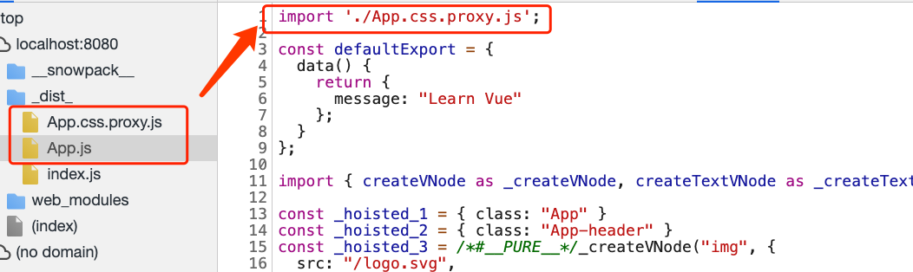

# 准备

1. 需要先将项目进行build，然后将命令行 snowpack dev转写为：node ../pkg/dist-node/index.bin.js dev 启用debug模式

1. `require('../') `会读取 package.json, index.js, or index.node

1. playground，package.json 直接利用如下形式，直接引用外部包

   ```javascript
   "lodash-es": "link:../node_modules/lodash-es",
   ```
   
1. 可以查看`import-map.json`实现，看是如何将文件缓存在.cache中的

# 概述

1. 基于 [ESM import](https://developer.mozilla.org/en-US/docs/Web/JavaScript/Reference/Statements/import) 的构建框架不止 [snowpack](https://www.snowpack.dev/) 一个，还有比如基于 vue 的 [vite](https://github.com/vitejs/vite)，因为浏览器支持模块化是一个标准，

2. ESM import带来的最直观的改变有：

   - node_modules` 完全不需要参与到构建过程，让构建效率提升至少 10 倍。
   - 模块化交给浏览器管理，修改任何组件都只需做单文件编译，时间复杂度永远是 O(1)，reload 时间与项目大小无关
   - 浏览器完全模块化加载文件，不存在资源重复加载问题，做到单文件级别的按需构建

3. `bundle`过程是O(n) 复杂度的问题，而基于 ESM 则是O(1)，借用snowpack官方图示

   

   - 


   

## 核心特征

1. dev 环境无需打包，start up 可以在50ms 或更少
2. 热更新速度非常快。
3. 构建时可以结合任何 bundler，比如 webpack。
4. 内置支持 TS、JSX、CSS Modules 等。
5. 支持自定义构建脚本以及三方插件。

# 源码解析

## 如何调试代码

1. 调试`snowpack`源码，clone 代码后，首先进去`snowpack`目录，执行`npm run build`，会生成一个`pkg`文件夹，包含snowpack运行时代码

2. 自己简单的应用，可以配置执行命令为

   ```json
   "scripts": {
     "start": "node ../pkg/dist-node/index.bin.js dev",
   },
   ```

3. 这样可以使用断点方式详细查看执行过程

## snowpack dev 特殊之处

1. 根据官网的`Get Started`介绍，使用`SnowPack`只需2步：安装` snowpack` 和执行` snowpack dev`

   ```javascript
   # using npm
   npm install --save-dev snowpack
   # 或 using yarn
   yarn add --dev snowpack
   # 然后： Start your dev server, load your site locally
   snowpack dev
   ```

2. 是不有个疑问？？？难道不需要`npm install` 安装依赖？？？？？

3. 根据上述调试代码方式，执行`npm start `, 会执行`snowpack/pkg/dist-src/index.js`中的 `cli`函数，伪代码：

   ```javascript
   import { command as devCommand } from './commands/dev';
   export async function cli(args) {
       // .....
       if (cmd === 'dev') {
           await devCommand(commandOptions);
           return process.exit(0);
       }
     	// .....
   }
   ```

4. `devCommand`，伪代码：

   ```javascript
   export async function command(commandOptions) {
     const dependencyImportMapLoc = path.join(DEV_DEPENDENCIES_DIR, 'import-map.json');
     // Start with a fresh install of your dependencies, if needed.
     if (!(await checkLockfileHash(DEV_DEPENDENCIES_DIR)) || !existsSync(dependencyImportMapLoc)) {
       await installCommand(installCommandOptions);
       await updateLockfileHash(DEV_DEPENDENCIES_DIR);
     }
   }    
   
   ```

   - 首先会check下`node_modules/.cache/snowpack/dev/import-map.json`是否需要更新依赖
   - 如果需要，则会执行`installCommand`

5. `installCommand`主要是遍历`node_modules`，获取各个依赖的的ESM打包结果，如果没有则使用`snowpack`的`rollup`重新打包，详细过程可参见：`pkg/dist-src/commands/install.js`

### 小结

1. 执行`snowpack dev`，snowpack会获取依赖的ESM，如没有则利用rollup打包为ESM，缓存在`import-map.json`
   - 由于目前很多模块都有ESM支持，故这个命令执行与实际`npm install`速度差不多
   - 由于首次执行可能有额外的rollup打包时间，故第一次启动dev环境可能会比较慢
2. 在默认配置下，snockpack会将
   - src下的文件映射到`_dist_/`，
   - node_modules的文件放在 `web_modules`，
   - 入口文件为`public/index.html`
   - 具体的配置可参见手册，或`pkg/dist-node/index.js`的 `DEFAULT_CONFIG`

## snowpack 启动

1. 整个`snowpack`启动主流程，全部在`devCommand`函数中，目前大概600多行代码，主要可分为4大块

2. 首先是获取依赖的ESM（上面已经介绍了）

3. 接下来是利用`http\https\http2`的`createServer`方法，构造一个server，伪代码：

   ```javascript
   const createServer = (requestHandler) => {
     if (credentials && config.proxy.length === 0) {
       return http2.createSecureServer({ ...credentials, allowHTTP1: true }, requestHandler);
     }
     else if (credentials) {
       return https.createServer(credentials, requestHandler);
     }
     return http.createServer(requestHandler);
   };
   const server = createServer(async (req, res) => {}).listen(port);
   ```

4. 然后利用 ws(一个websocket包)+ server 构建一个 ESMHmrEngine

   ```javascript
   const hmrEngine = new EsmHmrEngine({ server });
   ```

5. 利用`chokidar`这个模块，来 `watch` 文件，包括自己写的文件、`node_modules`全部文件、以及`symlinked`文件

   ```javascript
   const chokidar = await import('chokidar');
   // Watch src files
   const watcher = chokidar.watch(mountedDirectories.map(([dirDisk]) => dirDisk), {});
   watcher.on('add', (fileLoc) => onWatchEvent(fileLoc));
   watcher.on('change', (fileLoc) => onWatchEvent(fileLoc));
   watcher.on('unlink', (fileLoc) => onWatchEvent(fileLoc)); 
   
   const depWatcher = chokidar.watch([...symlinkedFileLocs], {});
   depWatcher.on('add', onDepWatchEvent);
   depWatcher.on('change', onDepWatchEvent);
   depWatcher.on('unlink', onDepWatchEvent);
   ```

### 小结

1. dev 环境主要涉及两种情况，
2. 一是，浏览器主动发起请求某个页面以及对应的资源，server需要根据请求，确定资源位置返给浏览器
3. 二是，文件修改（chokidar监视），通过热更新服务器`EsmHmrEngine`，即websocket，让浏览器进行更新
4. 下面将从 server开始运行与热更新来分别介绍这两个过程


## server开始运行

1. `server`启动后，首先通过浏览器访问 `localhost:8080` 会请求server，执行`server`的`requestHandler`函数（代码不贴了），主流程如下：

   

2. 以`localhost:8080/`请求开始，针对`/`

   - `snowpack`首先会找到 `/` 对应的文件路径，默认是`public/index.html`
   - 判断是否文件在临时缓存inMemoryBuildCache中，如果是，则将文件发到浏览器
   - 否则，通过`fs.readFile`读取对应文件，然后判断是否在持久化缓存中，如果在，则先将文件发到浏览器，然后build
   - 如果不在持久化缓存，则通过不同插件build文件，将结果发到浏览器

3. 请求到html后，会根据html的script，请求`/_dist_/index.js`，然后依次请求`html`相关的文件到浏览器

   ```html
   <!DOCTYPE html>
   <html lang="en">
     <body>
       <div id="app"></div>
       <script type="module" src="/_dist_/index.js"></script>
     </body>
   </html>
   
   ```

   

4. 我们可以看到`index.js`中，对于代码中`import { createApp } from "vue";`，会被转义为`import { createApp } from '/web_modules/vue.js'`

   - 即最开始说的，snowpack 会将node_modules的包全部映射到默认配置`web_modules`下
   
5. 我们的`import App from './App.vue'`，被编译为`import App from './App.js'`，这个过程是通过`snowpack`的vue插件，将vue 文件build 为 `xxxx.js`

### snowpack 是如何处理css的

1. 我们以vue举例，`Vue`的`template` 我们会写css，`snowpack vue `插件会将样式`build`为 `App.css.proxy.js`

   

2.  `App.css.proxy.js`会将样式通过`document.head.appendChild()`到head中

3. 注：

   - 目前`snowpack`的样式处理存在bug，如果样式更改，虽然触发了App.vue 的重新编译，但由于`build`结果还是`App.css.proxy.js`，故不会热更新


### 小结

1. server的功能其实，就是针对浏览器的请求，即不同的请求路径，去找到对应的文件位置（这可能会有不同的缓存策略），并发给浏览器
2. `snowpack`做了简单的临时缓存+持久化缓存
   - 临时缓存：就是一个map结构，存在则将文件发到浏览器
   - 持久化缓存：使用cache包，主要一个特点是，针对文件Etag相同时，先将缓存发到浏览器，然后再build文件的一个策略

## 热更新

1. 由于项目中的文件都被`snowpack` 用`chokidar`包监控，项目文件的添加(add)、改变(change)、删除(unlink)，都会执行`onWatchEvent`

   ```javascript
   async function onWatchEvent(fileLoc) {
     handleHmrUpdate(fileLoc);
     inMemoryBuildCache.delete(fileLoc);
     filesBeingDeleted.add(fileLoc);
     await cacache.rm.entry(BUILD_CACHE, fileLoc);
     filesBeingDeleted.delete(fileLoc);
   }
   ```

   - 可以理解为，主要是执行`handleHmrUpdate`
   - 然后是删除各种缓存

2. `handleHmrUpdate`会根据不同情况，向浏览器发送不同`type`类型的`Message`

   - 如果改动的是当前文件，则：`hmrEngine.broadcastMessage({ type: 'update', url })`
   - 如果改动文件不支持热更新（如图片等）或`node_modules`包，则：`hmrEngine.broadcastMessage({ type: 'reload' });`

3. 每个启用热更新的`snowpack`，会在为浏览器为`socket`添加`message`事件，用于接收server 发送的 message

   ```javascript
   socket.addEventListener('message', ({data: _data}) => {
     const data = JSON.parse(_data);
     if (data.type === 'reload') {
       location.reload(true);
       return;
     }
     log('message: update', data);
     runModuleAccept(data.url)
       .then((ok) => {
       if (!ok) {
         reload();
       }
     }).catch((err) => {
       console.error(err);
       reload();
     });
   });
   ```

   - 对于`server`，发送的`{type: reload}`的 message，则会直接刷新当前页面，即重新请求当前页面的html资源

4. 而对于 `{type: update}`， 会执行`runModuleAccept`方法

   ```javascript
   const REGISTERED_MODULES = {};
   async function runModuleAccept(id) {
     const state = REGISTERED_MODULES[id];
     if (!state) {
       return false;
     }
     const updateID = Date.now();
     for (const {deps, callback: acceptCallback} of acceptCallbacks) {
       const [module, ...depModules] = await Promise.all([
         import(id + `?mtime=${updateID}`),
         ...deps.map((d) => import(d + `?mtime=${updateID}`)),
       ]);
      }
      return true;
   }
   ```

   - 利用`import()`+ 时间戳的方式，更新指定文件

5. 热更新流程图如下

   - `chokidar`监视文件改动，向浏览器发送不同type类型的message

   - 浏览器的`hmr.js`，根据不同的message 类型，执行不同请求操作，如`window.location.reload`或`import(url)`

   - 这样，server会根据不同的请求，返回不同的资源（回到`snowpack`启动流程中）

     


# 与vite简单对比

## 概述

1. 与`vite 1.0.0`的简单对比，只是简单看了下vite实现
2. vite 来源于法语： 快 的意思
3. 已官方尤大在vite readme 写的
   - 尤大写`vite`时，snowpack 还不支持热更新
   - production 打包，vite内置了配置，而snowpack，还需要使用webpack或parcel插件
   - vite 做了与vue更好的整合

## 代码基础方面

1. vite **提供`playground`**，可以查看并测试当前vite支持的各种能力

2. vite 代码更简洁，更整齐

   - `sever`使用`koa`，不同功能可以放在不同是插件中（不同的js文件中）
   - 还可以通过写插件方式，对`server`进行调整
   - 可以利用`custom Blocks`，写`server`插件，对server进行扩展，增加官方没有的能力

3. snowpack 的扩展，类似于webpack，通过plugin的方式

   - webpack 的插件是基于 hook的形式
   - 而snowpack，则是，如果 某个插件处理 `xxxx`为后缀的文件，则直接执行这个插件的回调

   

## 对vue的支持

1. vite，只支持vue3，因为使用了`ts+vue3`的能力
2. snowpack，支持vue2，但暂时官方还不支持vue3


## 文件监视

1. vite  忽略了node_modules文件夹的watch

   ```javascript
   const watcher = chokidar.watch(root, {
     ignored: [/node_modules/, /\.git/],
     awaitWriteFinish: {
       stabilityThreshold: 100,
       pollInterval: 10
     }
   }) as HMRWatcher
   ```

   

## 缓存策略

1. vite 使用 lru-cache（包）做文件缓存，缓存策略是会删除最近最少使用的项目，有缓存则读缓存，否则`fs.readFile`
2. Snowpack 实际是用简单的set，做了一个一级缓存


## 热更新方面

1. `vite`在client有更多的类型，细化了vue的相关操作，如`vue-rerender,style-update`，解决了样式更新问题

   ```javascript
   async function handleMessage(payload: HMRPayload) {
     const { path, changeSrcPath, timestamp } = payload as UpdatePayload
     switch (payload.type) {
       case 'connected':
         break
       case 'vue-reload':
         break
       case 'vue-rerender':
         break
       case 'style-update':
         break
       case 'style-remove':
         break
       case 'js-update':
         break
       case 'custom':
         break
       case 'full-reload':
         return
     }
   }
   
   ```

   - Snowpack，只有 reload + update 两种类型

2. vite 在浏览器热更新文件，加入了类似queue的概念，会将多个hot update一起处理


## 构建production方面

1. `vite` 对 vue 构建做了增强，直接执行`vie build`即可完成打包
2. snowpack，还是需要引用webpack等插件，并进行一系列配置，感容易出现production与 dev 环境不一致的bug 


# 问题

## 热更新配置

1. 启动热更新需要在`index.js`中增加，如下配置

   ```javascript
   if (import.meta.hot) {
     import.meta.hot.accept();
     import.meta.hot.dispose(() => {
       app.unmount();
     });
   }
   
   ```

2. 对于接受到的文件，如果有`import.meta.hot`，在接收文件解析时（resolveResponseImports），会对入口文件打标记`isHmrEnabled = true`

3. 然后每次修改文件时，如果这个标记为true，则会 `send({type: update,url})`

1. 


