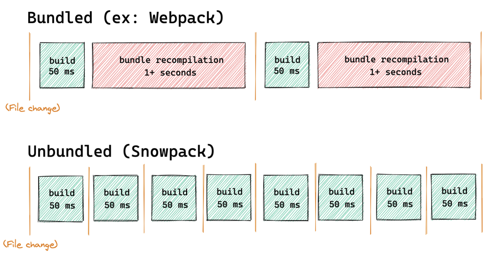

# Snowpack

## 特点

1. dev 环境无需打包，start up 可以在50ms 或更少
   - 这主要是解决webpack或Parcel 在保存文件时，会rebuild & rebundle整个chunks文件
2. 可以在开发环境使用非 bundle 模式，生产环境使用bundle模式
3. 内置支持ts，jsx，css Modules
4. build时，可以使用官方提供的插件结合webpack使用
5. 设计目标
   - install npm包后可以直接在浏览器中执行代码
   - 理论上，只有 npm 安装的包需要 bundle
   - 借力浏览器对 import的支持，直接将文件发往浏览器
   - 这不仅仅是一个快速的工具，是一个新的web编译系统

## 详细介绍

1. bundle过程是O(n) 复杂度的问题
   - 更改一个文件，并不能单独打包当前文件，需要把这个文件相关的文件（chunk）都重新编译并打包
   - 每个编译过的文件会被独立缓存，只要文件没改过就永远不会rebuild
2. 但还不支持：yarn workspace https://www.pika.dev/npm/snowpack/discuss/286