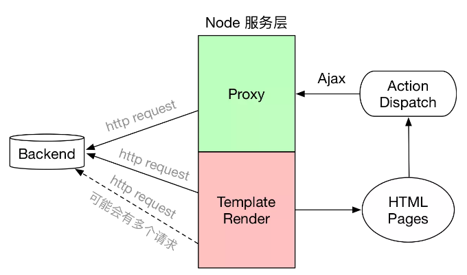
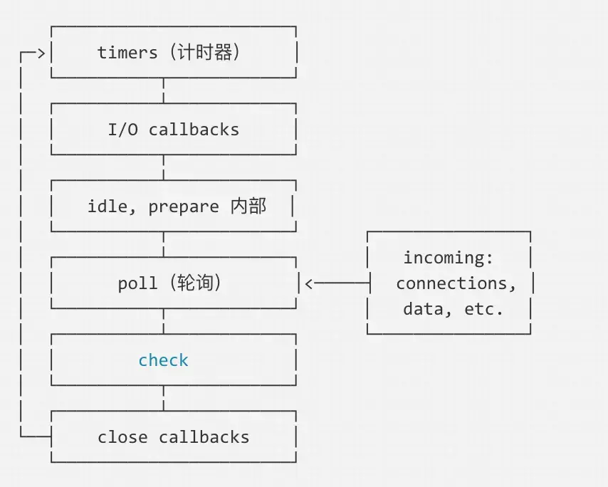
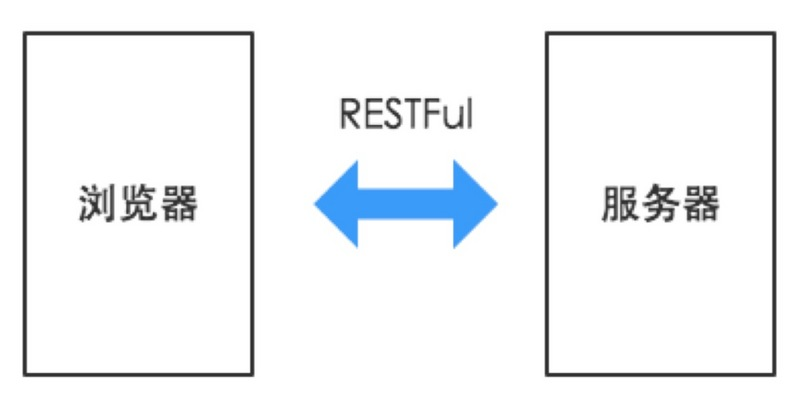
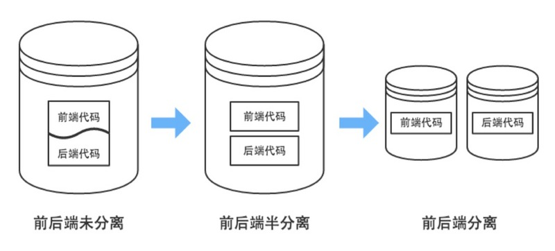

# 

# Node服务层

## 概述

1. 典型的node作为服务层的前后端结构

   

## node作用

1. 请求代理
   - 跨域
   - 数据需要二次加工
   - 后端服务部署在内网时，前端无法直接调用
2. 路由
3. 模板渲染

## 优势

1. 前后端分离，节省沟通、联调成本。
2. 生态圈繁荣，第三方模块很多，合理使用可以大量提升开发效率。
3. 处理高并发场景性能更高，适合 web 应用。

## 劣势

1. js 是弱类型语言，可靠性不高，潜在问题很难发现。
2. 不适合 CPU 密集型的应用，如视频编解码。

# 事件循环

## 概述

1. node的event Loop有六个阶段
	- timers 阶段：执行 setTimeout、setInterval 的 callback 回调。
	- I/O callbacks阶段：除了定时器与close事件
	- idle，prepare阶段：node内部，process.nextTick在此阶段
	- poll 阶段：获取新的IO事件
	- check 阶段：执行setImmediate回调
	- close阶段：close的回调，如socket.on('close', callback);

## node里面的微任务

1. process.nextTick ，promise在各个阶段切换的中间执行,即从一个阶段切换到下个阶段前执行

# NodeAPI

## path

### path.resolve()

1. 不带参数`path.resolve()`  
   - 返回的是当前的文件的绝对路径`/Users/xxxx/`
2. 带不是`/`开头的参数或`./`开头的参数
   - `path.resolve('a')`  `path.resolve('./a')`  返回的是当前绝对路径拼接现在的参数`/Users/xxxx/a`
   - `path.resolve('a'，'b')` `path.resolve('./a','./b')`   返回的是当前绝对路径拼接现在的参数`/Users/xxxx/a/b`
3. `__dirname` 总是指向被执行 js 文件的绝对路径

# 前后端分离

## 交互方式

1. 后端只需要负责按照约定的数据格式向前端提供可调用的API服务即可

	

## 代码组织形式

1. 前后端未分离：前后端代码在同一个代码库，甚至是同一个工程目录下，页面夹杂很多后端代码

2. 半分离：前后端代码共用一个代码库，代码分别在两个工程中，但前端不能单独进行开发测试

3. 分离：前后端代码库分离，前端可以通过mock来进行独立开发测试

	

## 开发流程上

1. 前后端分离，实现了前后端并行开发
2. 传统开发模式：前台开发页面->翻译为模板->前后端对接
3. 前后端分离：设计约定接口->前后端并行开发