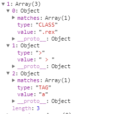

## 5.4 function Sizzle() ---(754)
### 5.4.1 概述
1.  此函数为选择器引擎的入口函数，随便写一个选择器$("div:first p,a")，在L755行打上断点，可以看到运行到此行时的调用栈为：Sizzle函数之前是，jQuery.find(selector, self[ i ], ret)，源码L2795, jQuery.find = Sizzle;而var Sizzle=(function(window){})(window)内部返回的是函数Sizzle


2.  Sizzle函数
- 首先判断selector是否为单标签选择器，如$("#id"),$(".class"),$("span")等，如果是，直接使用get*By*方法
- 接着，如果浏览器支持querySelectorAll，则优先使用querySelectorAll方法进行查询，查询到直接返回results，
- 最后，不符合上述情况的，传给select处理
3.  注意：
- 可根据源码逐行解析，看到具体函数跳到对应小结


### 5.4.2 createCache-------------------(L893)
1.  arr.push返回添加数据之后数据长度，因此直接可以使用arr.push()>50来进行比较
2.  delete使用
-  对象属性删除（delete obj.name）
-  直接用delelte删除不了变量
```javascript
/**
 * 创建有限大小的键值缓存
 * @returns {function(string, object)} 返回一个对象，且数据存储在对象本身的，键为key + " "
 *  如cahce大于Expr.cachLength，删除最早加入数组的元素
 *  存储值时，var tokenCache = createCache()(key, value)
*/
function createCache() {
   var keys = [];
   function cache( key, value ) {
      // 使用 (key + " ") 来避免与本地原型属性冲突(see Issue #157)
      // Expr.cacheLength默认50，可以由使用者设置
      // 如keys大于cache容量，将最旧的元素删除
      if ( keys.push( key + " " ) > Expr.cacheLength ) {
         // Only keep the most recent entries
         delete cache[ keys.shift() ];
      }
      return (cache[ key + " " ] = value);
   }
   return cache;
}
```

### 5.4.3 testContext( context ) ---(L1084)
```javascript
/**
 * 检查节点有效性作为Sizzle上下文
 * ？？？？为何这样就是Sizzle有效上下文
 * @param {Element|Object=} context
 * @returns {Element|Object|Boolean} The input node if acceptable, otherwise a falsy value
 */
function testContext( context ) {
   return context && typeof context.getElementsByTagName !== "undefined" && context;
}
```


### 5.4.4 Sizzle.tokenize(2170)
1.  主要作用是将selector表达式（$(“div,a>p”)中的div,a>p即为selector表达式）转换为group数组
2.  关键是理解while ( soFar )循环，针对输入的selector会返回groups数组
3.  源码逐行解析
```javascript
/**
 * 主要是用来转换selector
 * 如$("#div, span>a,.c1:first,input[type = button]")等
 * @type {Sizzle.tokenize}
 */
tokenize = Sizzle.tokenize = function( selector, parseOnly ) {
   var matched, match, tokens, type,
      soFar, groups, preFilters,
      //只是检查tokenCache中有selector么
      // tokenCache要返回数组，jquery返回groups，用slice(0)返回整个数组
      cached = tokenCache[ selector + " " ];
   if ( cached ) {
      return parseOnly ? 0 : cached.slice( 0 );
   }
   soFar = selector;
   groups = [];
   preFilters = Expr.preFilter;   // ATTR,CHILD,PSEUDO
   // 将selector数据全解析完放入groups中
   while ( soFar ) {//假设，soFar = selector = "#div, span>a,.c1:first,input[type = button]"

      // 首先寻找逗号
      // matched：控制循环
      // 第1次循环，matched，match为undefined，创建groups这个二维数组，里面每项是tokens数组
      // 第2次循环，soFar = ", span>a,.c1:first,input[type = button]"，此时matched=#div,但match为true
      // rcomma.exec( soFar ):匹配以"   ,"开头的表达式
      if ( !matched || (match = rcomma.exec( soFar )) ) {
         if ( match ) {
            // 将匹配到的match数组从soFar中删除
            // ||soFar，当两个逗号没有内容， soFar.slice( match[0].length )返回""
            // 第2次循环： soFar = ", span>a,.c1:first,input[type = button]"
            //        去除后变为soFar = "span>a,.c1:first,input[type = button]"
            soFar = soFar.slice( match[0].length ) || soFar;
         }
         // 熟悉创建二维数组方式，后面可以直接往tokens中push
         groups.push( (tokens = []) );
      }
      matched = false;
      // 选择符
        // 第3次循环，soFar=">a,.c1:first,input[type = button]"，进入此循环
        // tokens = [value:'>',type:'>']
      if ( (match = rcombinators.exec( soFar )) ) {
         matched = match.shift();
         tokens.push({
            value: matched,
            // Cast descendant combinators to space
            type: match[0].replace( rtrim, " " )
         });
         soFar = soFar.slice( matched.length );
      }

      // 只是利用了Expr.filter 中的key，此key表明了sizzle引擎能处理是哪些类型
      // matchExpr为匹配ID，TAG，CLASS，ATTR等的正则表达式
      // preFilters为ATTR，CHILD，PSEUDO的过滤器函数
      // 利用正则表达式看能匹配出哪个selector
      // 第1次循环找出#div，matched = #div，故tokens1 = [value:'#div',type:'ID',matches:match]，groups= [tokens1]
      //   通过 soFar.slice( matched.length )，去除#div后，soFar = ", span>a,.c1:first,input[type = button]"
      for ( type in Expr.filter ) {
         if ( (match = matchExpr[ type ].exec( soFar )) && (!preFilters[ type ] ||
            (match = preFilters[ type ]( match ))) ) {
            matched = match.shift();//获取匹配项
            tokens.push({
               value: matched,
               type: type,
               matches: match
            });
            soFar = soFar.slice( matched.length );//去除匹配项后的长度
         }
      }
      // match中无数据，退出循环
      if ( !matched ) {
         break;
      }
   }

   // parseOnly表示只是解析，返回soFar长度
   // 否则返回tokens或抛出异常
   return parseOnly ?
      soFar.length :
      soFar ?
         Sizzle.error( selector ) :
         // 缓存tokens
         tokenCache( selector, groups ).slice( 0 );
};
```

### 5.4.5 function toSelector( tokens )-------------- (L2237)
1.  tokenize的逆操作，将tokens拼接为selector
```javascript
/**
 * 获取tokens中对象的value值，并拼接在一起
 * @param tokens
 * @return {string}
 */
function toSelector( tokens ) {
   var i = 0,
      len = tokens.length,
      selector = "";
   for ( ; i < len; i++ ) {
      selector += tokens[i].value;
   }
   return selector;
}
```


### 5.4.6 源码逐行解析
```javascript
// 引擎的主要入口函数
// jquery.find未传递seed，并不代表Sizzle中的if(!seed)无意义，并不是seed一直是undefined
// 此函数并不只是在jquery.find中调用一次，当selector复杂时，可能会被后面complie内部再次调用，
// 如Line2329，multipleContexts中又调用Sizzle函数
function Sizzle( selector, context, results, seed ) {
   var m, i, elem, nid, match, groups, newSelector,
      newContext = context && context.ownerDocument,

      // nodetype=9为Document
      nodeType = context ? context.nodeType : 9;

   results = results || [];

   // 如selector不是Element(1),DocumentFragment(11)返回results
   if ( typeof selector !== "string" || !selector ||
      nodeType !== 1 && nodeType !== 9 && nodeType !== 11 ) {

      return results;
   }

   // 尝试在HTML文档中快捷地查找操作（而不是过滤器）
   if ( !seed ) { //如果外界没有指定初始集合seed了。
      // 如context不是document调用setDocument函数设置,因为传入window对象，document为window上属性
      // preferredDoc = window.document
      // ownerDocument:返回当前节点的顶层的document对象
      if ( ( context ? context.ownerDocument || context : preferredDoc ) !== document ) {
         setDocument( context );
      }
      context = context || document;
      // !isXML( document )的为documentHtml
      if ( documentIsHTML ) {
         // 如selector足够简单（单标签选择器，如$("#id"),$(".class"),$("span")等），使用get*By*的DOM方法
         // DocumentFragment不使用，因为DocumentFragment没有这些方法
         if ( nodeType !== 11 && (match = rquickExpr.exec( selector )) ) {

            // match[1]，match[2]，match[3]分别为id，元素，class选择器
            if ( (m = match[1]) ) {

               // Document context
               if ( nodeType === 9 ) {
                  if ( (elem = context.getElementById( m )) ) {

                     // Support: IE, Opera, Webkit
                     // IE，Opera，Webkit某些版本有这个bug
                     // getElementById 能根据name匹配而不是id
                     if ( elem.id === m ) {
                        results.push( elem );
                        return results;
                     }
                  } else {
                     return results;
                  }

               // Element context
               } else {

                  // Support: IE, Opera, Webkit
                  // getElementById 能根据name匹配而不是id
                  // 不是document，利用顶层根元素获取m，并且保证context有elem
                  if ( newContext && (elem = newContext.getElementById( m )) &&
                     contains( context, elem ) &&
                     elem.id === m ) {

                     results.push( elem );
                     return results;
                  }
               }

            // Type selector
            } else if ( match[2] ) {
               push.apply( results, context.getElementsByTagName( selector ) );
               return results;

            // Class selector
            } else if ( (m = match[3]) && support.getElementsByClassName &&
               context.getElementsByClassName ) {

               push.apply( results, context.getElementsByClassName( m ) );
               return results;
            }
         }

         // 利用querySelectorAll优势
         // support.qsa = rnative.test( document.querySelectorAll )
         // compilerCache[ selector + " " ] :缓存selector
         // selector未缓存过，并未出现rbuggyQSA中的问题
         if ( support.qsa &&
            !compilerCache[ selector + " " ] &&
            (!rbuggyQSA || !rbuggyQSA.test( selector )) ) {

            if ( nodeType !== 1 ) {
               newContext = context;
               newSelector = selector;

            // qSA会检查外部Element context，这并不是我们想要的
            // Support: IE <=8
            // 解决IE8下一个bug（Andrew Dupont提供的方法）
            // 不理解bug起因，难理解bug修复？？？？？？？？？
            } else if ( context.nodeName.toLowerCase() !== "object" ) {

               // 捕获context的 ID, 如需要首先设置它
               if ( (nid = context.getAttribute( "id" )) ) {
                  nid = nid.replace( rcssescape, fcssescape );
               } else {
                  context.setAttribute( "id", (nid = expando) );
               }

               // 获取selector分组
               groups = tokenize( selector );
               i = groups.length;
               while ( i-- ) {
                  groups[i] = "#" + nid + " " + toSelector( groups[i] );
               }
               newSelector = groups.join( "," );

               // Expand context for sibling selectors
               newContext = rsibling.test( selector ) && testContext( context.parentNode ) ||
                  context;
            }

            if ( newSelector ) {
               try {
                  push.apply( results,
                     newContext.querySelectorAll( newSelector )
                  );
                  return results;
               } catch ( qsaError ) { // 处理qsa问题
               } finally {
                  if ( nid === expando ) {
                     context.removeAttribute( "id" );
                  }
               }
            }
         }
      }
   }

   // selector.replace( rtrim, "$1" )删除selector两端空格
   // rtrim：匹配字符串两端空格，分组$1为不包含两端空格的内容
   return select( selector.replace( rtrim, "$1" ), context, results, seed );
}
```


## 5.5 Sizzle.select = function( selector, context, results, seed )---(2656)
### 5.5.1 概述
1. 因目前新浏览器大多都支持querySelectorAll，写较复杂selector不容易理解源码过程，故将L711-L882注释掉，让选择器直接进入select函数，用来理解select函数
1. 此函数首先，判断selector中是否有分组（$(“div,a”)有逗号的表示有分组），如无分组则针对selector第一个为id，第二个为关系选择器(> + ~  )缩小文档查找范围，针对selector第一个不是关系选择器，且整个选择器无sizzle自定义伪类
1. 最后，处理不了的传给compile生成编译函数再处理
1. ***注意：select函数通过处理特殊情况，获得加快后面编译函数运行的context或seed，进入complie产生编译函数***


### 5.5.2 源码逐行解析
```javascript
/**
 * Sizzle()解析不了传给此函数，此函数首先处理无分组selector的某些情况
 * 然后传给Sizzle.compile解析
 * @param {String|Function} selector或由Sizzle.compile预编译的selector函数
 * @param {Element} context
 * @param {Array} [results]
 * @param {Array} [seed] A set of elements to match against
 */
select = Sizzle.select = function( selector, context, results, seed ) {
   var i, tokens, token, type, find,
      compiled = typeof selector === "function" && selector,
      match = !seed && tokenize( (selector = compiled.selector || selector) );

   results = results || [];   //

   // match中无分组(无逗号分隔情况下)，在编译前（执行complie函数）缩小范围
   if ( match.length === 1 ) {

      // 缩小文档查找范围，selector第一个为id，第二个为关系选择器(> + ~  )
        // 对于$("#div > .p > a +b")，通过token[0]的id选择器，将context从document缩小为div#div.p
      tokens = match[0] = match[0].slice( 0 );
      if ( tokens.length > 2 && (token = tokens[0]).type === "ID" &&
            context.nodeType === 9 && documentIsHTML && Expr.relative[ tokens[1].type ] ) {

         context = ( Expr.find["ID"]( token.matches[0].replace(runescape, funescape), context ) || [] )[0];
         if ( !context ) {
            return results;

         // 预编译matcher需要验证祖先，所以context提高为parentNode
         } else if ( compiled ) {
            context = context.parentNode;
         }
            // 去掉第一个token，即id
         selector = selector.slice( tokens.shift().value.length );
      }

      // 缩小备选种子范围,从右向左匹配
        // 第一个token是[>+~]关系选择器，或整个选择器中有sizzle自定义伪类,i为0，不进行循环
        // 故，处理的是，第一个token不是关系选择器，且整个选择器无sizzle自定义伪类
      i = matchExpr["needsContext"].test( selector ) ? 0 : tokens.length;
      // 如对于  $("div > .p  > a + b ")，第一次tokens[7]为b这个group（通过tokenize解析过的）
      // 循环主要是处理$("div > .p > a +b:first-child ")情况，将:first-child跳过，去查询b
      while ( i-- ) {
         token = tokens[i];

         // 遇到关系选择器则终止循环
         if ( Expr.relative[ (type = token.type) ] ) {
            break;
         }
         // 处理type为ID/CLASS/TAG的token,这些方法在setDocument中定义
         if ( (find = Expr.find[ type ]) ) {
            // find是Expr.find返回的函数，形如function( tag, context )
            // 如查询到b，则seed中有值，否则为0，最后一个元素查询不到则不会有result
            if ( (seed = find(
               token.matches[0].replace( runescape, funescape ),
                  // rsibling = /[+~]/,
                  // aa && bb || cc ===>(aa && bb) || cc
                  // testContext判断是否为有效的sizzle上下文
               rsibling.test( tokens[0].type ) && testContext( context.parentNode ) || context
            )) ) {

               // 如seed为空，或无tokens，直接返回
               // tokens删除i这个元素
               tokens.splice( i, 1 );
               selector = seed.length && toSelector( tokens );    // 将tokens拼接为selector
               // seed=0表示未找到b元素，故results为空
               if ( !selector ) {
                  push.apply( results, seed );
                  return results;
               }

               break;
            }
         }
      }
   }

   // 如编译函数不存在，会调用complie产生一个编译函数，因为Sizzle函数并不只是调用一次   
   // compiled存在，直接运行compiled(seed,context....)
   // compiled为false，运行compile生成cache,cache为最终匹配函数，运行cache(seed,context....)
   ( compiled || compile( selector, match ) )(
      seed,
      context,
      !documentIsHTML,
      results,
      !context || rsibling.test( selector ) && testContext( context.parentNode ) || context
   );
   return results;
};
```

## 5.6 Sizzle.compile = function( selector, match )---(2617)
### 5.6.1 概述
1.  此函数主要是根据match(match即是selector通过tokenize解析后的groups数组)
2.  L2629这个while循环为i--，则表明selector是使用从右到左的解析方式生成编译函数的，以每个逗号为分组标志，循环解析每个分组
3.  主要流程是：
- 首先，循环match数组，利用matcherFromTokens将match数组转换为编译函数matcher，然后将无伪类的分组push到elementMatchers数组，将有伪类的数组push到setMatchers数组
- 其次，利用matcherFromGroupMatchers函数将elementMatchers与setMatchers合并为最终匹配函数返回；
4.  利用较为简单$("div:first p,.rex > a")来分析complie函数生成
5.  Complie函数将selector分为两种情况，有无伪类；伪类让sizzle选择器选择到内容，可以在html中写一些代码（之后不对html做改变），如
```html
<div class="rex">
　　<a>hello rextao</a>
    <p class="group">group1</p>
　　<p class="group">group2</p>
　　<span class="group"></span>
</div>
<div class="aaa"></div>
```

### 5.6.2 源码逐行解析
```javascript
/**
 * 创建编译函数
 * 如对于$("div:first p,.rex > a"),第1分组push到setMatchers，第2分组push到elementMatchers
 * @type {Sizzle.compile}
 */
compile = Sizzle.compile = function( selector, match /* Internal Use Only */ ) {
   var i,
      setMatchers = [],
      elementMatchers = [],
      // 查询当前选择器是否有被处理并保存在缓存compilerCache中
      cached = compilerCache[ selector + " " ];

   if ( !cached ) {
      // 如果没有被词法解析先进行词法解析
      if ( !match ) {
         match = tokenize( selector );
      }
      i = match.length;
      // 第1次迭代".rex > a"对应的tokens(match)数组
      // 第2次迭代"div:first p" 对应的tokens(match)数组
      while ( i-- ) {
         // 根据tokens返回matcher函数
         cached = matcherFromTokens( match[i] );
         // 如果选择器中有伪类的选择器压入setMatchers，
         // cached[expando]在生成匹配器函数(markFunction)的时候就判断是否有伪类而赋值了
         if ( cached[ expando ] ) {
            setMatchers.push( cached );
         //普通选择器压入elementMatchers
         } else {
            elementMatchers.push( cached );
         }
      }
      // 利用matcherFromGroupMatchers整合为终极匹配函数
   cached = compilerCache( selector, matcherFromGroupMatchers( elementMatchers, setMatchers ) );

      // 缓存selector
      cached.selector = selector;
   }
   return cached;
};
```

### 5.6.3 第1次迭代
1. 由于选用$("div:first p,.rex > a")，complie第一次迭代，match[i]是".rex > a"对应的tokens(match)数组


### 5.6.4 第2次迭代
1. complie第2次迭代，match[i]是"div:first p "对应的tokens(match)数组，其中tokens.length= 4，因为div:first与p之间为子代关系，有一个关系选择器


## 5.7 matcherFromTokens---(2448)
### 5.7.1 概述
1. 针对一个块（不包含逗号分隔的选择器字符串）选择器生成匹配函数
 - 针对不同类型的选择器产生不同的执行函数
 - 若包含伪类，则返回setMatcher，否则返回的是elementMatcher，
 - 通过鉴别matcher是否包含expando属性来区别是否有伪类
 - 充当了selector“tokens”与Expr中定义的匹配方法的串联与纽带的作用
 - 只是生成匹配函数，并未执行，最后统一执行
2. 注意：
 - 此函数只是根据tokens生成匹配函数matcher，多为闭包，故函数并没有调用，在生成匹配函数期间，不容易理解某些函数为何这么比，为何传这个参数
1. 重点理解创建了何种编译函数


### 5.7.2 第1次迭代，处理无伪类的情况
1.  第1次迭代".rex > a"对应的tokens(match)数组，elementMatchers中的函数被层层包裹，Sizzle.compile中push到elementMatchers函数为
elementMatcher ([addCombinator(elementMatcher( [baseMatch,RexFuc] ), Obj>),aFuc]具体详见源码逐行解析(无伪类情况)


#### function addCombinator( matcher, combinator, base )---(2247)
```javascript
/**
 * 根据关系创建函数，如div > p，通过此函数处理>,"",+,~这些关系
 * 其中，matcher为div的匹配函数，combinator，为>,
 * 通过addCombinator联系起来返回一个具有关系的函数，即
 * addCombinator将“>”的处理和“div”关联起来
 * @param matcher
 * @param combinator Expr.relative中的值
 * @param base
 * @return {Function}
 */
function addCombinator( matcher, combinator, base ) {
   var dir = combinator.dir,
      // 默认Expr.relative并无next值
      skip = combinator.next,
      key = skip || dir,
      // base为true时，>与""返回ture，+与~返回false
      // checkNonElements字面意思检查是否为元素节点
      checkNonElements = base && key === "parentNode",
      doneName = done++;  //判断是第几个关系选择器
   // 是否为紧邻关系，
   // 如div>p,表示div子代p（紧邻关系），div p（非紧邻），表示div内部所有p
   return combinator.first ?
      // 检查最接近的祖先/前元素
      // 若关系选择器是>或+
      function( elem, context, xml ) {
         // 紧邻关系为何要迭代，有些浏览器会把节点之间换行符看作TextNode
         while ( (elem = elem[ dir ]) ) {
            if ( elem.nodeType === 1 || checkNonElements ) {
               return matcher( elem, context, xml );
            }
         }
         return false;
      } :

      // 若关系选择器是""或~
      function( elem, context, xml ) {
         var oldCache, uniqueCache, outerCache,
                // 用以区别不同的执行过程。
                //每次执行addCombinator函数时，done变量都会加1，用以区别生成的不同的位置关系匹配函数。
            newCache = [ dirruns, doneName ];

         // 不能在xml节点上设置任意数据，所以，他们不会受益于缓存
         if ( xml ) {
            while ( (elem = elem[ dir ]) ) {
               if ( elem.nodeType === 1 || checkNonElements ) {
                  if ( matcher( elem, context, xml ) ) {
                     return true;
                  }
               }
            }
         } else {
            while ( (elem = elem[ dir ]) ) {
               if ( elem.nodeType === 1 || checkNonElements ) {
                  // 若elem节点的expando属性不存在，则赋予空对象
                  outerCache = elem[ expando ] || (elem[ expando ] = {});

                  // Support: IE <9 only
                  // 避免克隆attroperties (jQuery gh-1709)
                  uniqueCache = outerCache[ elem.uniqueID ] || (outerCache[ elem.uniqueID ] = {});

                  if ( skip && skip === elem.nodeName.toLowerCase() ) {
                     elem = elem[ dir ] || elem;
                  } else if ( (oldCache = uniqueCache[ key ]) &&
                     oldCache[ 0 ] === dirruns && oldCache[ 1 ] === doneName ) {

                     // 分配给newCache，所以，结果返回到以前元素
                     return (newCache[ 2 ] = oldCache[ 2 ]);
                  } else {
                     // 重新使用
                     uniqueCache[ key ] = newCache;

                     // 匹配则结束，未匹配继续检查
                            // newCache = [ dirruns, doneName ,matcher];
                     if ( (newCache[ 2 ] = matcher( elem, context, xml )) ) {
                        return true;
                     }
                  }
               }
            }
         }
         return false;
      };
}
```

#### 3.function elementMatcher( matchers )---(2311)
```javascript
/**
 * 无伪类的匹配器匹配器，执行每个matchers函数返回true或false
 * @param matchers 每个元素都是非伪类的匹配器执行函数
 * @return {Function}   仅仅返回true或false，而非jquery对象
 */
function elementMatcher( matchers ) {
   // matchers.length =1表示只有基础匹配函数，直接返回自己
   return matchers.length > 1 ?
      // 多匹配器情况下，要elem全部符合匹配器规则
      function( elem, context, xml ) {
         var i = matchers.length;
         while ( i-- ) {
            if ( !matchers[i]( elem, context, xml ) ) {
               return false;
            }
         }
         return true;    // 匹配传入的elem节点是否满足要求，全部满足返回true
      } :
      matchers[0];
}
```

#### 源码逐行解析(无伪类情况)
```javascript
function matcherFromTokens( tokens ) {
   var checkContext, matcher, j,
      len = tokens.length,
      leadingRelative = Expr.relative[ tokens[0].type ],//获取关系
      //当获取不到关系给一个隐形关系parentNode
      implicitRelative = leadingRelative || Expr.relative[" "],
      i = leadingRelative ? 1 : 0,

      // 基本匹配，确保元素从最顶层的context可找到
      matchContext = addCombinator( function( elem ) {
         return elem === checkContext;
      }, implicitRelative, true ),
      matchAnyContext = addCombinator( function( elem ) {
         return indexOf( checkContext, elem ) > -1;
      }, implicitRelative, true ),
      // 确定元素在哪个context，也是最后一个执行的匹配器
      // matchers[0]为一函数，通过判断checkContext.nodeType返回matchContext或matchAnyContext
      // 假设这个基础match函数为baseMatch，故matchers=[baseMatch]
      matchers = [ function( elem, context, xml ) {
         var ret = ( !leadingRelative && ( xml || context !== outermostContext ) ) || (
            (checkContext = context).nodeType ?
               matchContext( elem, context, xml ) :
               matchAnyContext( elem, context, xml ) );
         // 避免挂在元素上(issue #299)
         checkContext = null;
         return ret;
      } ];
   // 无伪类时迭代的为".rex > a"对应的tokens数组,此循环为正序查找
   // 第1次循环，处理.rex,如生成的matchers函数为RexFuc，循环结束matchers=[baseMatch,RexFuc]
   // 第2次循环，处理>,此时的matcher为>对应的对象(L1664)，假设为 >,
   // matchers=[baseMatch,RexFuc]经过elementMatcher包装，elementMatcher函数循环运行matchers，返回true或false
   // addCombinator为关系("",+,>,~)处理函数，将Obj>与elementMatcher( matchers )进行包装，得到
   // matchers = [addCombinator(elementMatcher( [baseMatch,RexFuc] ), Obj>) ]
   // 第3次循环，处理a,如生成的matchers函数为aFuc，
   // 循环结束matchers=[addCombinator(elementMatcher( [baseMatch,RexFuc] ), Obj>),
   //                 aFuc]
   // 因为addCombinator，elementMatcher此处不运行，
   // addCombinator为何能处理关系，elementMatcher循环运行matchers又有何用等问题很难此时解决
   // 最终返回给compile的函数又包裹了一层elementMathcer 
   for ( ; i < len; i++ ) {
       // 判断tokens.type是否为关系选择器(>,"",+,~)
      if ( (matcher = Expr.relative[ tokens[i].type ]) ) {
         matchers = [ addCombinator(elementMatcher( matchers ), matcher) ];
      } else {
         // 根据tokens.type产生过滤函数
         matcher = Expr.filter[ tokens[i].type ].apply( null, tokens[i].matches );

         // 处理伪类(由markFunction创建的，才有expando属性)
         // 只是返回函数并不运行
         if ( matcher[ expando ] ) {
            // 判断伪类后是否还有operator
            j = ++i;
            for ( ; j < len; j++ ) {
               if ( Expr.relative[ tokens[j].type ] ) {
                  break;
               }
            }
            return setMatcher(
               i > 1 && elementMatcher( matchers ),
               i > 1 && toSelector(
                  // 如当前位置之前的token是一个后代组合，插入隐含的*
                  // 类似 "div :first"这样的选择器，传入setMatcher为div *
                  tokens.slice( 0, i - 1 ).concat({ value: tokens[ i - 2 ].type === " " ? "*" : "" })
               ).replace( rtrim, "$1" ),
               matcher,
               i < j && matcherFromTokens( tokens.slice( i, j ) ),
               // 从tokens的j元素选取，即伪类后面元素
               j < len && matcherFromTokens( (tokens = tokens.slice( j )) ),
               j < len && toSelector( tokens )
            );
         }
         matchers.push( matcher );
      }
   }
   // elementMatcher，即是循环matchers(elem, context, xml),返回true或false
   return elementMatcher( matchers );
}
```

### 5.7.3 第2次迭代，处理伪类的情况
```javascript
function matcherFromTokens( tokens ) {
   var checkContext, matcher, j,
      len = tokens.length,
      leadingRelative = Expr.relative[ tokens[0].type ],//获取关系
      //当获取不到关系给一个隐形关系parentNode
      implicitRelative = leadingRelative || Expr.relative[" "],
      i = leadingRelative ? 1 : 0,

      // 基本匹配，确保元素从最顶层的context可找到
      matchContext = addCombinator( function( elem ) {
         return elem === checkContext;
      }, implicitRelative, true ),
      matchAnyContext = addCombinator( function( elem ) {
         return indexOf( checkContext, elem ) > -1;
      }, implicitRelative, true ),
      // 确定元素在哪个context，也是最后一个执行的匹配器
      // matchers[0]为一函数，通过判断checkContext.nodeType返回matchContext或matchAnyContext
      // 假设这个基础match函数为baseMatch，故matchers=[baseMatch]
      matchers = [ function( elem, context, xml ) {
         var ret = ( !leadingRelative && ( xml || context !== outermostContext ) ) || (
               (checkContext = context).nodeType ?
                  matchContext( elem, context, xml ) :
                  matchAnyContext( elem, context, xml ) );
         // 避免挂在元素上(issue #299)
         checkContext = null;
         return ret;
      } ];
   // 第2次循环，处理"div:first p"这个token数组时，len=4;
   // i = 0时，处理div，生成matchers函数为funDiv，此时matchers为[baseMatch,funDiv]
   for ( ; i < len; i++ ) {
      // 如果有父子选择器（关系选择器）
      if ( (matcher = Expr.relative[ tokens[i].type ]) ) {
         matchers = [ addCombinator(elementMatcher( matchers ), matcher) ];
      } else {
         matcher = Expr.filter[ tokens[i].type ].apply( null, tokens[i].matches );

         // 处理伪类(由markFunction创建的，才有expando属性)
         // 只是返回函数并不运行
         // 假设此时选择器$("div:first p")
         // i = 0时，处理div，生成matchers函数为funDiv，此时matchers为[baseMatch,funDiv]
         // i = 1时，处理:first，此时i=1，经过j =++i，i与j都为2，此时Expr.relative[ tokens[j].type，
         //          表示的为""（div:first后的子代选择器），故为true，退出当前循环，返回setMatcher，参数分别为：
         //          参数1：[baseMatch,funDiv]
         //          参数2：:first的前置selector，即div，toSelector里面的替换
         //                    只是针对类似 "div :first"这样的选择器的特殊处理，并未改变tokens数组长度
         //           参数3: :first的matcher函数
         //           参数4: :false
         //           参数5: :选取tokens数组伪类之后部分，此时伪类为i=1,故选取j=2以后部分，
         //                    即p元素，将p元素再传入matcherFromTokens进行解析得到一系列函数，
         //                    针对$("div:first p")情况，传入参数为[baseMatch,funP]
         //           参数6：将tokens用toSelector拼接为selector
         // setMatcher会返回一个markFunciton函数，这只是定义函数，等程序运行到setMatcher时再分析
         // 伪类后面的选择器直接传入到setMatcher中，并将setMatcher返回的markFunction函数返回到complie中的setMatchers中
         if ( matcher[ expando ] ) {
            // 判断伪类后是否还有operator
            j = ++i;
            for ( ; j < len; j++ ) {
               if ( Expr.relative[ tokens[j].type ] ) {
                  break;
               }
            }
            return setMatcher(
               i > 1 && elementMatcher( matchers ),
               i > 1 && toSelector(
                  // 如当前位置之前的token是一个后代组合，插入隐含的*
                  // 类似 "div :first"这样的选择器，传入setMatcher为div *
                  tokens.slice( 0, i - 1 ).concat({ value: tokens[ i - 2 ].type === " " ? "*" : "" })
               ).replace( rtrim, "$1" ),
               matcher,
               i < j && matcherFromTokens( tokens.slice( i, j ) ),
               // 从tokens的j元素选取，即伪类后面元素
               j < len && matcherFromTokens( (tokens = tokens.slice( j )) ),
               j < len && toSelector( tokens )
            );
         }
         matchers.push( matcher );
      }
   }
   // elementMatcher，即是循环matchers(elem, context, xml),返回true或false
   return elementMatcher( matchers );
}
```

### 5.7.4 两次迭代之后，将编译函数返回到compile中
1. 当循环结束，matcherFromTokens分别产生了无伪类的编译函数elementMatchers和有伪类的编译函数setMatchers，L2639行，matcherFromGroupMatchers将上面两个编译函数组合为最终super匹配函数，并缓存在compilerCache中，将cached返回到Sizzle.select中
1. 其中，matcherFromGroupMatchers，创建了一个superMatcher函数，通过判断selector中有伪类，返回markFunction( superMatcher )，无伪类返回superMatcher
1. 最后，L2644行，将最终的匹配函数cached返回到Sizzle.select，开始L2716后面括号，传入参数开始运行这个superMatcher编译函数


## 5.8 Sizzle.compile函数运行
1. Compile函数返回的cached是matcherFromGroupMatchers构造是superMatcher，故compile运行即首先运行superMatcher，即matcherFromGroupMatchers函数


### 5.8.1 matcherFromGroupMatchers( elementMatchers, setMatchers )----（2506）
1. 此函数运行分两大主要部分进行处理，L2529处理无伪类的selector情况，L2572处理有伪类的情况
1. 通过L2599，将results结果去重后，返回到compile函数中并返回Sizzle引擎处理的最终结果
```javascript
/**
 *  将不同的块选择器生成的最终执行函数，该函数还负责将最终结果过滤掉重复对象。
 * @param elementMatchers
 * @param setMatchers
 * @return {superMatcher}
 */
function matcherFromGroupMatchers( elementMatchers, setMatchers ) {
   var bySet = setMatchers.length > 0,
      // seed,context首次调用未改变，故seed为undefined，context为document
      // xml:true，or false，是否为html
      // result:select方法中查找结果集，sizzle函数不只允许1次，故首次调用results为[]
      byElement = elementMatchers.length > 0,
      superMatcher = function( seed, context, xml, results, outermost ) {
         var elem, j, matcher,
            matchedCount = 0,
            i = "0",
            unmatched = seed && [],
            setMatched = [],
            contextBackup = outermostContext,
            // 必须总是具有seed或外部context
            // 确定起始查找范围或是参数中传递过来的备选种子seed,或是搜索范围context的所有后代节点
            // 如seed集合不存在，elems则是html中全部tag，通过一个个循环匹配elementMatchers函数
            elems = seed || byElement && Expr.find["TAG"]( "*", outermost ),
            //使用整数dirruns当且仅当这是最外面的匹配
            dirrunsUnique = (dirruns += contextBackup == null ? 1 : Math.random() || 0.1),
            len = elems.length;

         if ( outermost ) {
            outermostContext = context === document || context || outermost;
         }

         // elementMatchers匹配成功的元素直接加入到result集合中
         // 因为没有seed集合，elems为html全部tag，逐个匹配matcher函数，看哪个元素节点符合匹配函数
         // elem循环次序，html，head，meta，title，body，div.rex等等
         for ( ; i !== len && (elem = elems[i]) != null; i++ ) {
            if ( byElement && elem ) {
               j = 0;
               if ( !context && elem.ownerDocument !== document ) {
                  setDocument( elem );
                  xml = !documentIsHTML;
               }
               // 执行elementMatchers函数
               // 此时的elementMatchers为".rex > a"对应的编译函数，
               // 因为被层层包裹为elementMatcher ([addCombinator(elementMatcher( [baseMatch,RexFuc] ), Obj>),aFuc]
               // 实际elementMatchers.length = 1；
               // (matcher = elementMatchers[j++])将elementMatcher返回函数赋给matcher
               // matcher( elem, context || document, xml),循环执行matchers，运行（elementMatcher函数），详细参见function elementMatcher( matchers )
               // 如匹配不到，matcher返回false，j=1，再循环一次，此时elementMatchers[1]为undefined，while循环为false，退出循环
               // 故matchedCount--
               // 如匹配到,matcher返回true,将elem加到results里面，然后退出循环，故此时!matcher为false
               // 故matchedCount不在进行--操作
               while ( (matcher = elementMatchers[j++]) ) {
                  if ( matcher( elem, context || document, xml) ) {
                     results.push( elem );
                     break;
                  }
               }
               if ( outermost ) {
                  dirruns = dirrunsUnique;
               }
            }

            // 追踪未匹配元素
            // 如selector存在伪类，则bySet>0,matchedCount
            if ( bySet ) {
               // 当有matcher函数返回为true时
               if ( (elem = !matcher && elem) ) {
                  matchedCount--;
               }

               // Lengthen the array for every element, matched or not
               if ( seed ) {
                  unmatched.push( elem );
               }
            }
         }

         // `i` 现在是上面访问元素的个数，把他与matchedCount加在一起，使matchedCount非负
         // 如不存在伪类，bySet为false，故matchedCount==i，上面循环会找到全部elementMatchers元素
         matchedCount += i;

         // 对unmatched元素应用set过滤器
         // NOTE: 如无未匹配元素，则跳过（如matchedCount ==i），
         // 除非上述循环中因为无seed或无元素matchers造成未访问任何元素
         if ( bySet && i !== matchedCount ) {
            j = 0;
            // 无seed时，unmatched为seed&&[]，故为undefined，setMatched为[]
            while ( (matcher = setMatchers[j++]) ) {
               // unmatched：为传入setMatcher的seed
               // setMatched:为[]
               // context:document
               // xml :为true或false
               matcher( unmatched, setMatched, context, xml );
            }

            if ( seed ) {
               // Reintegrate element matches to eliminate the need for sorting
               if ( matchedCount > 0 ) {
                  while ( i-- ) {
                     if ( !(unmatched[i] || setMatched[i]) ) {
                        setMatched[i] = pop.call( results );
                     }
                  }
               }

               // Discard index placeholder values to get only actual matches
               setMatched = condense( setMatched );
            }

            // 将matches加入result结果集
            push.apply( results, setMatched );

            // 对结果去重和排序
            // 例如$("div:first a,.rex > a")查询到的可能是同一个a标签，
            // 这样results中有两个一样的a，因此通过Sizzle.uniqueSort将重复的去掉
            if ( outermost && !seed && setMatched.length > 0 &&
               ( matchedCount + setMatchers.length ) > 1 ) {

               Sizzle.uniqueSort( results );
            }
         }

         // 用嵌套匹配函数覆盖全局函数
         if ( outermost ) {
            dirruns = dirrunsUnique;
            outermostContext = contextBackup;
         }

         return unmatched;
      };

   return bySet ?
      markFunction( superMatcher ) :
      superMatcher;
}
```

### 5.8.2 function elementMatcher( matchers ) ----（2311）
1. 函数在L2537调用，此时因为无seed并且context为document，故调用时，elem实际为html页面全部的tag标签（上面已经介绍），当外围（L2529）每次循环时，elem从html，head，meta，title，body，div.rex逐步循环
1. 此时matchers为".rex > a"的编译函数elementMatcher ([addCombinator(elementMatcher ( [baseMatch,RexFuc] ), Obj>),aFuc]，此while循环从后往前找，故首次循环查找的是aFunc，即在elem(html，head，meta，title，body，div.rex等)中查询a标签
1. 如何查找a标签呢？利用```matchers[i]( elem, context, xml )```，即用L1753行的```Expr.filter[“Tag”]```，对于a标签，nodeName为a，elem.nodeName根据外围循环，分别为HTML，HEAD，META等，无匹配返回false，当```matchers[i]( elem, context, xml )```返回false，则直接返回false给matcherFromGroupMatchers函数
```javascript
"TAG": function( nodeNameSelector ) {
   var nodeName = nodeNameSelector.replace( runescape, funescape ).toLowerCase();
   return nodeNameSelector === "*" ?
      function() { return true; } :
      function( elem ) {
         return elem.nodeName && elem.nodeName.toLowerCase() === nodeName;
      };
}
```

1. 但对于本文的html代码，当i为4时，即为a标签，Expr.filter[“Tag”]返回true，elementMatcher则接着循环，判断matchers[0],即[addCombinator(elementMatcher ( [baseMatch,RexFuc] ), Obj>)，如下为addCombinator部分代码（详细见后面）
```javascript
return combinator.first ?
  function( elem, context, xml ) {
      while ( (elem = elem[ dir ]) ) {
         if ( elem.nodeType === 1 || checkNonElements ) {
            return matcher( elem, context, xml );
         }
      }
      return false;
   } :
{……………}
```

1. combinator为Obj>，即.rex > a关系选择器（>），匹配关系在L1664，combinator.first:true表示直接相邻关系，根据a.parentNode，判断是否元素节点，是则返回matcher函数运行结果，此时matcher为elementMatcher ( [baseMatch,RexFuc] )，又进入elementMatcher，继续运行，查找.rex是否存在，只是此时的elem不在是a，而是a.parentNode
1.  小结，elementMatcher是通过外围不断循环传入的elem(html,head,meta等对象集合)，查询当前selector是否存在，如查询到a存在，则根据关系匹配符(>)，将elem按照规则转换a.parent，再次判断a.parent是否有.rex
```javascript
//匹配关系
relative: {
   ">": { dir: "parentNode", first: true },
   " ": { dir: "parentNode" },
   "+": { dir: "previousSibling", first: true },
   "~": { dir: "previousSibling" }
},
```

1.  elementMatcher代码
```javascript
function elementMatcher( matchers ) {
   return matchers.length > 1 ?
      function( elem, context, xml ) {
         var i = matchers.length;
         while ( i-- ) {
            if ( !matchers[i]( elem, context, xml ) ) {
               return false;
            }
         }
         return true;
      } :
      matchers[0];
}
```

### 5.8.3 addCombinator( matcher, combinator, base ) ---(L2247)
```javascript
/**
 * 根据关系创建函数，如div > p，通过此函数处理>,"",+,~这些关系
 * 其中，matcher为div的匹配函数，combinator，为>,
 * 通过addCombinator联系起来返回一个具有关系的函数，即
 * addCombinator将“>”的处理和“div”关联起来
 * @param matcher
 * @param combinator Expr.relative中的值
 * @param base
 * @return {Function}
 */
function addCombinator( matcher, combinator, base ) {
   var dir = combinator.dir,
      // 默认Expr.relative并无next值
      skip = combinator.next,
      key = skip || dir,
      // base为true时，>与""返回ture，+与~返回false
      // checkNonElements字面意思检查是否为元素节点
      checkNonElements = base && key === "parentNode",
      doneName = done++;  //判断是第几个关系选择器
   // 是否为紧邻关系，
   // 如div>p,表示div子代p（紧邻关系），div p（非紧邻），表示div内部所有p
   return combinator.first ?
      // 检查最接近的祖先/前元素
      // 若关系选择器是>或+
      function( elem, context, xml ) {
         // 紧邻关系为何要迭代，有些浏览器会把节点之间换行符看作TextNode
         while ( (elem = elem[ dir ]) ) {
            if ( elem.nodeType === 1 || checkNonElements ) {
               return matcher( elem, context, xml );
            }
         }
         return false;
      } :

      // 若关系选择器是""或~
      function( elem, context, xml ) {
         var oldCache, uniqueCache, outerCache,
                // 用以区别不同的执行过程。
                //每次执行addCombinator函数时，done变量都会加1，用以区别生成的不同的位置关系匹配函数。
            newCache = [ dirruns, doneName ];

         // 不能在xml节点上设置任意数据，所以，他们不会受益于缓存
         if ( xml ) {
            while ( (elem = elem[ dir ]) ) {
               if ( elem.nodeType === 1 || checkNonElements ) {
                  if ( matcher( elem, context, xml ) ) {
                     return true;
                  }
               }
            }
         } else {
            while ( (elem = elem[ dir ]) ) {
               if ( elem.nodeType === 1 || checkNonElements ) {
                  // 若elem节点的expando属性不存在，则赋予空对象
                  outerCache = elem[ expando ] || (elem[ expando ] = {});

                  // Support: IE <9 only
                  // 避免克隆attroperties (jQuery gh-1709)
                  uniqueCache = outerCache[ elem.uniqueID ] || (outerCache[ elem.uniqueID ] = {});

                  if ( skip && skip === elem.nodeName.toLowerCase() ) {
                     elem = elem[ dir ] || elem;
                  } else if ( (oldCache = uniqueCache[ key ]) &&
                     oldCache[ 0 ] === dirruns && oldCache[ 1 ] === doneName ) {

                     // 分配给newCache，所以，结果返回到以前元素
                     return (newCache[ 2 ] = oldCache[ 2 ]);
                  } else {
                     // 重新使用
                     uniqueCache[ key ] = newCache;

                     // 匹配则结束，未匹配继续检查
                            // newCache = [ dirruns, doneName ,matcher];
                     if ( (newCache[ 2 ] = matcher( elem, context, xml )) ) {
                        return true;
                     }
                  }
               }
            }
         }
         return false;
      };
}
```

### 5.8.4 setMatcher( preFilter, selector, matcher, postFilter, postFinder, postSelector ) ---（L2355）
1. matcherFromGroupMatchers函数在，L2572处理selector中有伪类的情况，并在L2575调用matcher( unmatched, setMatched, context, xml )，unmatched为传入setMatcher闭包的seed，setMatched为[]，xml :为true或false，函数调用后进入setMatcher的return函数(L2362)中


####  multipleContexts( selector, contexts, results )-----(L2325)
1. 主要是将有伪类的selector分组，如$("div:first p ")，此时selector为div，会将div再传入到Sizzle函数中查询，会得到div.rex和div.aaa
```javascript
/**
 * setMatcher中，处理setMatcher第二个参数，将selector再传入Sizzle中解析
 * 返回selector查询到的结果
 * @param selector
 * @param contexts
 * @param results
 * @return {*}
 */
function multipleContexts( selector, contexts, results ) {
   var i = 0,
      len = contexts.length;
   for ( ; i < len; i++ ) {
      Sizzle( selector, contexts[i], results );
   }
   return results;
}
```

1. setMatcher返回的markFunction的L2389，此时的matcher实为Expr.pseudos.first的matcher函数(L2109)，所有的关于位置处理的（:first,:last,:eq,:even等）都是调用了createPositionalPseudo函数


####  Expr.pseudos.first----(L2109)
```javascript
"first": createPositionalPseudo(function() {
   return [ 0 ];//返回数组第一个元素
})
```

####   createPositionalPseudo( fn )-----(L1061)
1. .first情况最为简单，fn只是返回匹配数组的第一项即可，因此matchIndexex = [0],i=1;此时seed为div匹配到元素，即div.rex和div.aaa; matches为空，并将matches，seed进行修改后返回到setMatcher函数中
```javascript
/**
 * 返回一个在Expr.Pseudo使用的伪类位置函数
 * 会创建fn[expandoo] = true
 * 以Expr.pseudos.first为例，此返回[0];
 * @param {Function} fn
 */
function createPositionalPseudo( fn ) {
   return markFunction(function( argument ) {
      argument = +argument;
      return markFunction(function( seed, matches ) {
         var j,
            // 对于Expr.pseudos.first,matchIndexes为[0]
            matchIndexes = fn( [], seed.length, argument ),
            i = matchIndexes.length;

         // 匹配指定下标元素
         while ( i-- ) {
            if ( seed[ (j = matchIndexes[i]) ] ) {
               seed[j] = !(matches[j] = seed[j]);
            }
         }
      });
   });
}
```

1. 因为!!seed与!!postFilter为false，因此程序运行到L2439，因为setMatcher函数开始将postFinder用setMatcher又包裹了一层，故当postFinder为真时，setMatcher又运行一遍去查询$(‘div:first p’)中的p，此时的context已经根据上述查询出的结果matcherOut改为div.rex
1. 将最终的结果返回到matcherFromGroupMatchers的results集中


####  源码逐行解析
```javascript
/**
 * 伪类分割器
 * 假如选择器$("div:first p")
 * @param preFilter       [baseMatch,funDiv]
 * @param selector    first的前置selector，即div
 * @param matcher     first的matcher函数
 * @param postFilter   false
 * @param postFinder   选取tokens数组伪类之后部分，传入参数为[baseMatch,funP]
 * @param postSelector 将tokens用toSelector拼接为selector
 * @return {*}
 */
function setMatcher( preFilter, selector, matcher, postFilter, postFinder, postSelector ) {
   if ( postFilter && !postFilter[ expando ] ) {
      postFilter = setMatcher( postFilter );
   }
   // 后置匹配器postFinder存在，且无伪类，则将postFinder用setMatcher包装
   if ( postFinder && !postFinder[ expando ] ) {
      postFinder = setMatcher( postFinder, postSelector );
   }
   return markFunction(function( seed, results, context, xml ) {
      var temp, i, elem,
         preMap = [],
         postMap = [],
         preexisting = results.length,

         // 从seed或context中获取初始化参数
         // elems为匹配到的节点；
         // multipleContexts主要是将伪类的前置选择器（div）代入Sizzle函数中查询
         // 本例，elems查询到的为div.rex和div.aaa
         elems = seed || multipleContexts( selector || "*", context.nodeType ? [ context ] : context, [] ),

         // 利用预处理器进行匹配，主要是保证seed结果同步
         // 对于本例子，seed不存在，故matcherIn返回elems
         matcherIn = preFilter && ( seed || !selector ) ?
            condense( elems, preMap, preFilter, context, xml ) :
            elems,
         // 注意多个三元表达式连接时顺序；通过代码层级也可得知
         // matcherOut = matcher ?（postFinder || (() ? [] :results)） ：results
         matcherOut = matcher ?
            // 如果存在postFinder，或filtered seed，non-seed postFilter，preexisting results
            postFinder || ( seed ? preFilter : preexisting || postFilter ) ?

               // 中间处理是必要的。
               [] :

               // 否则直接用results结果
               results :
            matcherIn;
      // 针对$("div:first p")，此处matcher其实是:first的matcher
      // matcher为Expr.pseudos.first,matcher中会根据内部内容修改matcherIn，matcherOut这些传入参数
      // 因此matcher运行完，matcherIn = (2) [false, div.aaa], matcherOut = [div.rex]
      if ( matcher ) {
         matcher( matcherIn, matcherOut, context, xml );
      }

      // 此例postFilter为fasle
      if ( postFilter ) {
         temp = condense( matcherOut, postMap );
         postFilter( temp, [], context, xml );

         // Un-match failing elements by moving them back to matcherIn
         i = temp.length;
         while ( i-- ) {
            if ( (elem = temp[i]) ) {
               matcherOut[ postMap[i] ] = !(matcherIn[ postMap[i] ] = elem);
            }
         }
      }

      if ( seed ) {
         if ( postFinder || preFilter ) {
            if ( postFinder ) {
               // Get the final matcherOut by condensing this intermediate into postFinder contexts
               temp = [];
               i = matcherOut.length;
               while ( i-- ) {
                  if ( (elem = matcherOut[i]) ) {
                     // Restore matcherIn since elem is not yet a final match
                     temp.push( (matcherIn[i] = elem) );
                  }
               }
               postFinder( null, (matcherOut = []), temp, xml );
            }

            // Move matched elements from seed to results to keep them synchronized
            i = matcherOut.length;
            while ( i-- ) {
               if ( (elem = matcherOut[i]) &&
                  (temp = postFinder ? indexOf( seed, elem ) : preMap[i]) > -1 ) {

                  seed[temp] = !(results[temp] = elem);
               }
            }
         }

      // 如果postFinder定义了， 则通过postFinder为结果集添加元素
      } else {
         matcherOut = condense(
            matcherOut === results ?
               matcherOut.splice( preexisting, matcherOut.length ) :
               matcherOut
         );
         // postFinder存在，调用postFinder会接着运行setMatcher，因为postFinder被postFinder包裹
         // 因为通过第一次setMatcher，匹配出matcherOut，即div:first是哪个元素，div.rex
         // 相当于此时再次调用setMatcher函数，是将context改为div.rex去查询符合的p
         if ( postFinder ) {
            postFinder( null, results, matcherOut, xml );
         } else {
            push.apply( results, matcherOut );
         }
      }
   });
```


## 5.9 处理Seed情况
1. select函数在L2665行，通过判断match.length === 1来缩减context和寻找seed，如有分组，则直接进入compile；
1. 对于$(‘div a’)满足寻找seed条件的selector，L2686从selector最后一个元素(a)开始循环，会查询到seed集合a，并将原始的selector转为”div ”（注意div后有个子代选择器），这时将新的selector传入compile生成编译函数后compile运行
1. Compile运行时，因为seed集合的存在，L2517行```elems = seed || byElement && Expr.find["TAG"]( "*", outermost )```的elems不再是html,head,body等全部页面对象集合，而是seed，缩减了查找范围
1. 总之，select函数处理特殊情况的结果就是，缩减context和寻找seed


## 5.10 Expr = Sizzle.selectors(1651)
### 5.10.1 markFunction()
```javascript
/**
 * 标记一个函数为Sizzle特殊用途
 * expando = "sizzle" + 1 * new Date()
 * fn.expando =true;
 * @param {Function} fn The function to mark
 */
function markFunction( fn ) {
   fn[ expando ] = true;
   return fn;
}
```

### 5.10.2 Expr. Filter---(1746)
```javascript
filter: {
    // 如下函数创建，都是在matcherFromTokens函数中，参数为tokens.matches提供,此tokens.matches为
       // matchExpr[ type ].exec( selectors )的结果
   // 函数运行到matcherFromGroupMatchers才能理解，matcherFromGroupMatchers中会调用
   // 其中elem为外层循环的html、head、body等对象
   // nodeNameSelector为selector，如div
   // 如当循环运行到elem为head，则elem.nodeName = HEAD && head === div
   "TAG": function( nodeNameSelector ) {
      var nodeName = nodeNameSelector.replace( runescape, funescape ).toLowerCase();
      return nodeNameSelector === "*" ?
         function() { return true; } :
         function( elem ) { //html中nodeName会返回大写
            return elem.nodeName && elem.nodeName.toLowerCase() === nodeName;
         };
   },
   // 判断元素上有某个类
   "CLASS": function( className ) {
      var pattern = classCache[ className + " " ];

      return pattern ||
         (pattern = new RegExp( "(^|" + whitespace + ")" + className + "(" + whitespace + "|$)" )) &&
         classCache( className, function( elem ) {
            return pattern.test( typeof elem.className === "string" && elem.className || typeof elem.getAttribute !== "undefined" && elem.getAttribute("class") || "" );
         });
   },
   // 对于 $("div[class='rex']")，根据matcherFromTokens生成matcher函数的
   // matcher = Expr.filter[ tokens[i].type ].apply( null, tokens[i].matches );
   // 可得知tokens.matches分别为class,=,rex,分别为参数name, operator, check
   "ATTR": function( name, operator, check ) {
      return function( elem ) { //返回一个attr匹配器
               // 获取某个元素节点elem上属性为name的属性值
         var result = Sizzle.attr( elem, name );
         //看看属性值有木有！
         if ( result == null ) {
            // 属性不存在，是不等于任何值的，故判断operator是否为！=
            return operator === "!=";
         }
         if ( !operator ) {
            return true;
         }

         result += "";

         return operator === "=" ? result === check :
            operator === "!=" ? result !== check :
               // 判断目标值是否在当前属性值的头部
            operator === "^=" ? check && result.indexOf( check ) === 0 :
               //  lang*=en 匹配这样 <html lang="xxxxenxxx">的节点，包含en子串就行
               // 在result能查询到check
            operator === "*=" ? check && result.indexOf( check ) > -1 :
               // 判断是否为结尾***************
            operator === "$=" ? check && result.slice( -check.length ) === check :
               // 选择包含check这个词的，
            operator === "~=" ? ( " " + result.replace( rwhitespace, " " ) + " " ).indexOf( check ) > -1 :
               //  匹配这样 <html lang="en-US">的节点
            operator === "|=" ? result === check || result.slice( 0, check.length + 1 ) === check + "-" :
            false;
      };
   },
       // 对于$("div:nth-child(2)")，tokens.matches结果为[nth,child,2,0,2....]
       // nth-child与nth-of-type有个特殊之处，可以使用p:nth-child(2n),返回的是子元素为p的第2,4,6,8元素
       // 对于div:nth-child(2)，first为0,last为2；
       // 对于div:nth-child(2n)，first为2,last为0；
   "CHILD": function( type, what, argument, first, last ) {
      var simple = type.slice( 0, 3 ) !== "nth",
               // 对于$("div:nth-last-child(2)"),type为nth-last
         forward = type.slice( -4 ) !== "last",
               // p:nth-of-type(2),选择属于其父元素第二个 <p> 元素的每个 <p> 元素。
         ofType = what === "of-type";

      return first === 1 && last === 0 ?
               // 对于$("div:nth-child(1n)")，则为true
               // 表示选择全部div，故需要有父级元素
         function( elem ) {
            return !!elem.parentNode;
         } :

         function( elem, context, xml ) {
            var cache, uniqueCache, outerCache, node, nodeIndex, start,
               dir = simple !== forward ? "nextSibling" : "previousSibling",
               parent = elem.parentNode,
               name = ofType && elem.nodeName.toLowerCase(),
               useCache = !xml && !ofType,
               diff = false;

            if ( parent ) {

               // :(first|last|only)-(child|of-type)
                       // 非nth模式
                       // 主要是查询elem的nextSibling和previousSibling元素，
                       // 每个元素上都存储了nextSibling和prviousSibling元素，通过判断同辈元素来判断当前元素的位置
               if ( simple ) {
                  while ( dir ) {
                     node = elem;
                     while ( (node = node[ dir ]) ) {
                        if ( ofType ?
                           node.nodeName.toLowerCase() === name :
                           node.nodeType === 1 ) {

                           return false;
                        }
                     }
                     // 如type为only，唯一元素，故需要查询两个方向，只要同辈有元素，则返回false
                     start = dir = type === "only" && !start && "nextSibling";
                  }
                  return true;
               }
                       // 根据方向判断，开头元素是firstChild还是lastChild
               start = [ forward ? parent.firstChild : parent.lastChild ];

                       // 处理非xml的nth-child,nth-child存储缓存数据在parent元素上
               if ( forward && useCache ) {

                  node = parent;
                           // 如缓存过此node，则直接获取为outerCacher，否则创建一个空对象
                           // 为何要缓存，因为nth针对都是parent相同的child查找
                  outerCache = node[ expando ] || (node[ expando ] = {});

                  // Support: IE <9 only
                           // 解决(jQuery gh-1709)bug，
                  uniqueCache = outerCache[ node.uniqueID ] ||
                     (outerCache[ node.uniqueID ] = {});

                  cache = uniqueCache[ type ] || [];
                  nodeIndex = cache[ 0 ] === dirruns && cache[ 1 ];
                  diff = nodeIndex && cache[ 2 ];
                  node = nodeIndex && parent.childNodes[ nodeIndex ];

                  while ( (node = ++nodeIndex && node && node[ dir ] ||

                     // 从开始寻找elem
                     (diff = nodeIndex = 0) || start.pop()) ) {

                     // 在node.childNodes中查询elem，查询到后，将次序缓存起来
                     if ( node.nodeType === 1 && ++diff && node === elem ) {
                        uniqueCache[ type ] = [ dirruns, nodeIndex, diff ];
                        break;
                     }
                  }

               } else {
                  // 使用缓存
                  if ( useCache ) {
                     // ...in a gzip-friendly way
                     node = elem;
                     outerCache = node[ expando ] || (node[ expando ] = {});

                               // Support: IE <9 only
                               // 解决(jQuery gh-1709)bug，
                     uniqueCache = outerCache[ node.uniqueID ] ||
                        (outerCache[ node.uniqueID ] = {});

                     cache = uniqueCache[ type ] || [];
                     nodeIndex = cache[ 0 ] === dirruns && cache[ 1 ];
                     diff = nodeIndex;
                  }

                  // xml :nth-child(...)
                  // or :nth-last-child(...) or :nth(-last)?-of-type(...)
                  if ( diff === false ) {
                     // 使用如上类似的循环结构，只是缓存的数据不同
                     while ( (node = ++nodeIndex && node && node[ dir ] ||
                        (diff = nodeIndex = 0) || start.pop()) ) {

                        if ( ( ofType ?
                           node.nodeName.toLowerCase() === name :
                           node.nodeType === 1 ) &&
                           ++diff ) {

                           // 缓存每个元素的index
                           if ( useCache ) {
                              outerCache = node[ expando ] || (node[ expando ] = {});

                                           // Support: IE <9 only
                                           // 解决(jQuery gh-1709)bug，
                              uniqueCache = outerCache[ node.uniqueID ] ||
                                 (outerCache[ node.uniqueID ] = {});

                              uniqueCache[ type ] = [ dirruns, diff ];
                           }

                           if ( node === elem ) {
                              break;
                           }
                        }
                     }
                  }
               }

               diff -= last;
                       //
               return diff === first || ( diff % first === 0 && diff / first >= 0 );
            }
         };
   },

   "PSEUDO": function( pseudo, argument ) {
      // 伪类不区分大小写
      // http://www.w3.org/TR/selectors/#pseudo-classes
      // setFilters继承自pseudos
      var args,
         // Expr.setFilters = Expr.filters = Expr.pseudos
         fn = Expr.pseudos[ pseudo ] || Expr.setFilters[ pseudo.toLowerCase() ] ||
            Sizzle.error( "unsupported pseudo: " + pseudo );

      // 可以使用createPseudo表明参数需要创建一个过滤器函数，正如Sizzle所做的
      // 其实是Expr.pseudos是由MarkFunction创建的，返回fn( argument )
      if ( fn[ expando ] ) {
         return fn( argument );
      }

      // 支持旧的签名
      // ???????????????????????????????????????
      if ( fn.length > 1 ) {
         args = [ pseudo, pseudo, "", argument ];
         return Expr.setFilters.hasOwnProperty( pseudo.toLowerCase() ) ?
            markFunction(function( seed, matches ) {
               var idx,
                  matched = fn( seed, argument ),
                  i = matched.length;
               while ( i-- ) {
                  idx = indexOf( seed, matched[i] );
                  seed[ idx ] = !( matches[ idx ] = matched[i] );
               }
            }) :
            function( elem ) {
               return fn( elem, 0, args );
            };
      }

      return fn;
   }
},
```

### 5.10.3 Expr.pseudos----(1959)
1. innerText与textContent区别：
- textContent会获取全部内容，包括```<script>```和```<style>```
- textContent不会受css样式的影响，不会触发重排
- textContent会意识到隐藏元素的文本
- innerText，是IE引入的

2.  textContent与innerHtml区别：
-  textContent有更好的性能，能防止xss攻击

```javascript
pseudos: {
   // :not(selector):去除所有与给定选择器匹配的元素
   // 如input:not(:checked):查询未选中的input
   "not": markFunction(function( selector ) {
      // 去掉selector的前后空格，便于创建compile函数
      var input = [],
         results = [],
         matcher = compile( selector.replace( rtrim, "$1" ) );

      return matcher[ expando ] ?
         markFunction(function( seed, matches, context, xml ) {
            var elem,
               unmatched = matcher( seed, null, xml, [] ),
               i = seed.length;

            // Match elements unmatched by `matcher`
            while ( i-- ) {
               if ( (elem = unmatched[i]) ) {
                  seed[i] = !(matches[i] = elem);
               }
            }
         }) :
         function( elem, context, xml ) {
            input[0] = elem;
            // 因为matcher=compile，此处为compile调用
            matcher( input, null, xml, results );
            // 不要保留input[0],处理(issue #299)
            input[0] = null;
            return !results.pop();
         };
   }),
   // :has(selector)：判断是否有某个选择器
   // p:has(a),其实就是为selector传入p的context
   "has": markFunction(function( selector ) {
      return function( elem ) {
         return Sizzle( selector, elem ).length > 0;
      };
   }),
   // 匹配包含给定文本的元素
   "contains": markFunction(function( text ) {
      text = text.replace( runescape, funescape );
      return function( elem ) {
         return ( elem.textContent || elem.innerText || getText( elem ) ).indexOf( text ) > -1;
      };
   }),
       // 选择指定语言的所有元素
       // div:lang(en)，会匹配<div lang="en"></div>和<p lang="en-us"></p>
   // 元素是否:lang()选择器表示，仅基于元素的语言值等于标识符C，或者C-
   // 且C的匹配不区分小写，C不一定是有效的语言name
       // 总之是根据如下w3.org提供的方式获取具有lang的元素
   // http://www.w3.org/TR/selectors/#lang-pseudo
   "lang": markFunction( function( lang ) {
      // lang值必须是有效的identifier
      if ( !ridentifier.test(lang || "") ) {
         Sizzle.error( "unsupported lang: " + lang );
      }
      lang = lang.replace( runescape, funescape ).toLowerCase();
      return function( elem ) {
         var elemLang;
         do {
            if ( (elemLang = documentIsHTML ?
               elem.lang :
               elem.getAttribute("xml:lang") || elem.getAttribute("lang")) ) {

               elemLang = elemLang.toLowerCase();
               return elemLang === lang || elemLang.indexOf( lang + "-" ) === 0;
            }
            // ??????????????????????????为何迭代parentNode
         } while ( (elem = elem.parentNode) && elem.nodeType === 1 );
         return false;
      };
   }),
       // 选择由文档URI的格式化识别码表示的目标元素
       // 如输入http://www.xxx.com/#foo,p:target,会查询到<p id=foo></p>
   "target": function( elem ) {
      var hash = window.location && window.location.hash;
      return hash && hash.slice( 1 ) === elem.id;
   },
       // 选择该文档的根元素,html文档中选择的是html元素
       // docElem当前文档
   "root": function( elem ) {
      return elem === docElem;
   },

   "focus": function( elem ) {
       // activeElement:返回当前页面中获得焦点的元素,如果没有某个元素获得焦点,则该属性的值为当前页面中的<body>元素
           // document.hasFocus():来判断当前文档中的活动元素是否获得了焦点。
           //          为何(!document.hasFocus || document.hasFocus())判断：因为opera浏览器未实现此方法
           // tabIndex:表示元素（如果可聚焦）是否能够接受输入焦点,通过这这tabIndex值，
           //          可以规定使用键盘方向键或tab键时获取焦点的顺序，可以让div等元素获得焦点
           //        ~tabIndex == tabIndex != -1;~运算，按位取反
      return elem === document.activeElement && (!document.hasFocus || document.hasFocus()) && !!(elem.type || elem.href || ~elem.tabIndex);
   },
       /********************************表单对象属性******************************/
   "enabled": createDisabledPseudo( false ),
   "disabled": createDisabledPseudo( true ),
       // 匹配所有选中的被选中元素(复选框、单选框等，select中的option)
   "checked": function( elem ) {
      // css3中，:checked返回checked和selected元素
      // http://www.w3.org/TR/2011/REC-css3-selectors-20110929/#checked
      var nodeName = elem.nodeName.toLowerCase();
      return (nodeName === "input" && !!elem.checked) || (nodeName === "option" && !!elem.selected);
   },
       // 对于select元素来说，获取选中推荐使用 :selected

   "selected": function( elem ) {
      // 这个主要是为了让Safari默认选项正确
      if ( elem.parentNode ) {
               // selectedIndex表示select中选择<option>的索引
         elem.parentNode.selectedIndex;
      }

      return elem.selected === true;
   },

       /********************************内容处理******************************/
       // 匹配所有不包含子元素或者文本的空元素
   "empty": function( elem ) {
      // http://www.w3.org/TR/selectors/#empty-pseudo
      // :empty 对于element (1) or content nodes (text: 3; cdata: 4; entity ref: 5)返回false,
      //  对于(comment: 8; processing instruction: 7; etc.)返回true
      // nodeType < 6 可以判断empty，因为attributes (2) 不会出现在子节点
           // *********************提供遍历dom的方法
      for ( elem = elem.firstChild; elem; elem = elem.nextSibling ) {
         if ( elem.nodeType < 6 ) {
            return false;
         }
      }
      return true;
   },
       // 匹配含有子元素或者文本的元素
   "parent": function( elem ) {
      return !Expr.pseudos["empty"]( elem );
   },

       /********************************表单元素******************************/
       // 匹配如 h1, h2, h3之类的标题元素
   "header": function( elem ) {
       // rheader = /^h\d$/i
      return rheader.test( elem.nodeName );
   },
       // 匹配所有 input, textarea, select 和 button 元素
   "input": function( elem ) {
       // rinputs = /^(?:input|select|textarea|button)$/i,
      return rinputs.test( elem.nodeName );
   },
       // 匹配所有按钮
       // <input type="button" />,<button></button>
   "button": function( elem ) {
      var name = elem.nodeName.toLowerCase();
      return name === "input" && elem.type === "button" || name === "button";
   },
       // 查找所有文本框
   "text": function( elem ) {
      var attr;
      return elem.nodeName.toLowerCase() === "input" &&
         elem.type === "text" &&

         // Support: IE<8
         // 新的html属性值 (如 "search")会被转换为为elem.type === "text"
         ( (attr = elem.getAttribute("type")) == null || attr.toLowerCase() === "text" );
   },

       /********************************位置判断******************************/
       // 主要是为createPositionalPseudo传递一个函数，选择符合的数组元素
   "first": createPositionalPseudo(function() {
      return [ 0 ];//返回数组第一个元素
   }),

   "last": createPositionalPseudo(function( matchIndexes, length ) {
      return [ length - 1 ];
   }),

   "eq": createPositionalPseudo(function( matchIndexes, length, argument ) {
      return [ argument < 0 ? argument + length : argument ];
   }),

   "even": createPositionalPseudo(function( matchIndexes, length ) {
      var i = 0;
      for ( ; i < length; i += 2 ) {
         matchIndexes.push( i );
      }
      return matchIndexes;
   }),

   "odd": createPositionalPseudo(function( matchIndexes, length ) {
      var i = 1;
      for ( ; i < length; i += 2 ) {
         matchIndexes.push( i );
      }
      return matchIndexes;
   }),
       // 匹配所有小于给定索引值的元素
   "lt": createPositionalPseudo(function( matchIndexes, length, argument ) {
      var i = argument < 0 ? argument + length : argument;
      for ( ; --i >= 0; ) {
         matchIndexes.push( i );
      }
      return matchIndexes;
   }),

   "gt": createPositionalPseudo(function( matchIndexes, length, argument ) {
      var i = argument < 0 ? argument + length : argument;
      for ( ; ++i < length; ) {
         matchIndexes.push( i );
      }
      return matchIndexes;
   })
}
```


## 5.11 DOM筛选与查找方法
### 5.11.1 Sizzle.matchesSelector = function( elem, expr )----(L1516)
1.  Sizzle最后将jQuery.find = Sizzle，故sizzle上的方法都会在jQuery.find上面

```javascript
/**
 * 用于检查某个元素node是否匹配选择器表达式expr。
 * Sizzle本身未调用，但jQuery通过jqeury.find.matchesSelector进行调用
 * @param elem
 * @param expr
 * @return {*}
 */
Sizzle.matchesSelector = function( elem, expr ) {
   // 如需要设置document
   if ( ( elem.ownerDocument || elem ) !== document ) {
      setDocument( elem );
   }

   // 确保引用了属性选择器
   expr = expr.replace( rattributeQuotes, "='$1']" );
   // support.matchesSelector是否存在matches方法,如原生支持，则使用原生方法
   if ( support.matchesSelector && documentIsHTML &&
      !compilerCache[ expr + " " ] &&
      ( !rbuggyMatches || !rbuggyMatches.test( expr ) ) &&
      ( !rbuggyQSA     || !rbuggyQSA.test( expr ) ) ) {

      try {
         var ret = matches.call( elem, expr );

         // IE 9's matchesSelector在未挂在dom树的nodes返回false
         if ( ret || support.disconnectedMatch ||
               // 同样，IE9，未挂在DOM上的节点会被认为在frament上
               elem.document && elem.document.nodeType !== 11 ) {
            return ret;
         }
      } catch (e) {}
   }

   return Sizzle( expr, document, null, [ elem ] ).length > 0;
};
```


