# 概述
## js实现
### 核心（ECMAScript）
1. 与浏览器没有依赖关系
2. web浏览器只是ECMAScript实现的宿主环境之一，其他环境：如Node，Flash
3. 主要是用来规定：语法、类型、语句、关键字、保留字、操作符、对象

### DOM
1. 是针对XML，经过扩展用于HTML的应用程序编程接口
2. DOM并不是只针对js，很多语言也实现了DOM，web浏览器中，基于ECMAscript实现DOM是js的重要组成部分
3. DOM级别划分
	- 	DOM 1级
       ​         DOM 核心: 如何映射基于XML的文档结构，以便简化操作和访问
       ​         DOM HTML: 添加针对HTML的对象和方法
		 	DOM 2级
		​		引入一些新模板
		 	DOM 3级
		​		进一步扩展
	- *注意：*DOM0级标准并不存在，只是历史坐标中的一个参照点而已

### BOM
1. H5致力于把BOM功能写入规范
2. 人们习惯把针对浏览器的js扩展都算作BOM

## 混合JavaScript环境
### ``` <script>```
1. 各个script标签（内联或外联）运行方式相互为独立js程序，一个报错，另外的继续运行

1. 全局作用域的提升机制，不能在不同script标签进行,如下方式会出错

   ```javascript
   <script>foo()</script>
   <script>function foo(){}</script>
   ```

1. 内联代码和外部文件区别

   - 内联代码不能出现`</scirpt>`，只要出现就被认为是代码块结束
   - 内联代码则使用其所在页面文件的字符集，外联可以charset属性指定
   - 带有src的script元素，会忽略标签中js代码

### 延迟脚本(defer)

1. 表示：document解析完后再执行脚本，因此脚本不会影响html解析
2. `<script type="" src="" defer="defer"></script>`放在head中会延迟加载

### 异步脚本(async)

1. html5属性：表示，如果可以，异步加载js
2. 浏览器默认是`async="false"`，同步加载js；而动态插入（document.createElement()）会异步加载
3. `<script type="" src="" async ></script>`放在head中会异步加载
4. async属性的目的是：不让页面等待脚本下载和执行，从而异步加载页面其他内容
5. 由于异步加载，脚本加载顺序和页面中出现顺序不一定一致，故两个脚本不能有依赖关系

### 与DOMContentLoaded的关系

#### DOMContentLoaded与load

1. DOMContentLoaded：html文档加载解析完后触发，无需等待样式表、图像和子框架的完成加载

2. load：依赖资源全部加载完

3. 蓝线代表DOMContentLoaded，红线代表load

	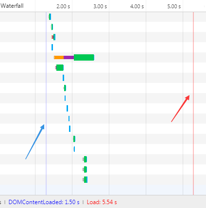

#### sync（同步）与DOMContentLoaded

1. html遇到js脚本后会进行加载与执行

	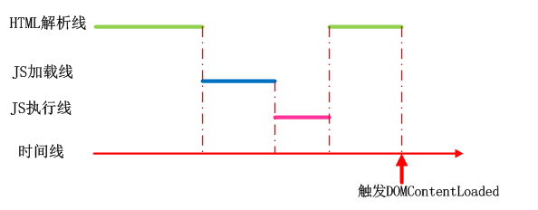

#### async(异步)与DOMContentLoaded

1. async一定在loaded之前，但可能在DOMContentLoaded之前或之后

2. 在之前的情况：html内容很多，但js脚本很小执行很快

	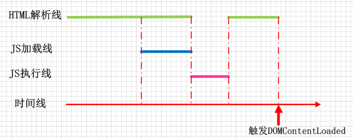

3. 在之后的情况：html很少，但js很长

	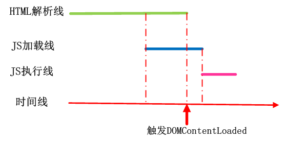

4. **DomContentLoaded 事件只关注 HTML 是否被解析完，而不关注 async 脚本。**

#### defer与DOMContentLoaded

1. 下载完js也不会执行js，要等待html解析完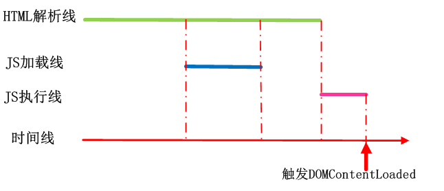
2. 注意：与async图非常像，关键是DOMContentLoaded触发点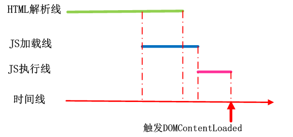

### `<noscript>`

1. 放在`<body>`中，当脚本无效情况下向用户显示其中的信息
2. 如用户启动了脚本或脚本可用，用户永远不会看到

# js引擎

## 概述

1. 当今比较知名的js引擎是 
   - Google V8：用于chrome和node中
   - SpiderMonkey：Mozilla开发的，用于Firefox中
2. node或浏览器中运行js，引擎会创建
   - 全局执行上下文（Global Execution Context）
   - 创建保存变量和函数声明的全局内存（Global Memory）（也称为全局作用域、全局变量）
   - 调用栈（ Call Stack）

## 运行时

1. 浏览器简单的可以视为：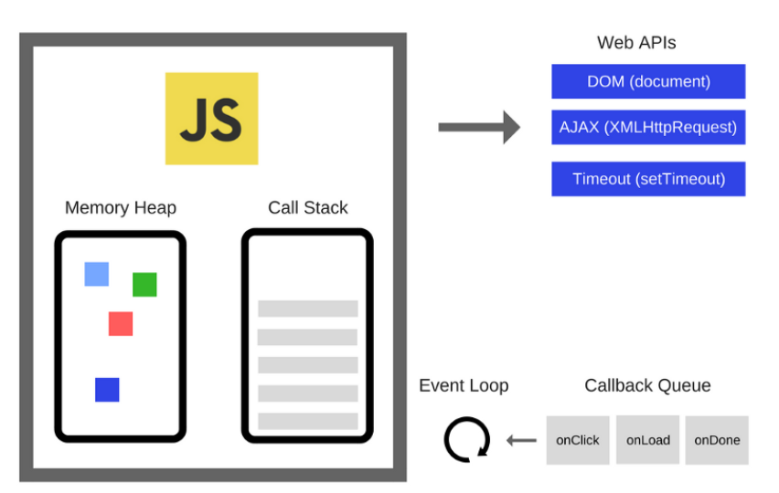
2. memory Heap：负责内存分配
3. call stack：调用栈，负责执行代码
4. web apis：是由浏览器提供，而不是由js引擎提供

## 执行上下文

### 概述

1. 任何代码在JavaScript中运行时，都在执行上下文中运行

### 执行上下文的类型

1. 全局执行上下文（Global Execution Context）
	- 代码不是在某个函数而是在全局执行上下文中运行
	- 创建全局执行上下文一般执行两件事：1、创建全局对象（浏览器中为window对象），2、设置this值为全局对象
2. 函数执行上下文（Functional Execution Context）：
	- 函数被调用时，会创建函数的执行上下文和局部内存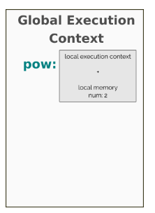
	- 注意：此函数执行上下文在函数调用时才被创建！！！！

### 执行上下文是如何创建的

1. 执行上下文创建分为两个阶段
	- 创建阶段
	- 执行阶段

#### 创建阶段

1. 在执行任何JavaScript代码之前，执行上下文将经历创建阶段。在创建阶段有三件事情发生
	- 进行this绑定
	- 词法环境（LexicalEnvironment）组件创建
	- 变量环境（VariableEnvironment ）组件创建
	- 名词定义在https://tc39.github.io/ecma262/#sec-executable-code-and-execution-contexts
	- 作者对协议进行了介绍https://blog.bitsrc.io/understanding-execution-context-and-execution-stack-in-javascript-1c9ea8642dd0
2. this绑定（具体可以看4-this全面解析）
	- 在全局执行上下的this绑定到全局对象上（浏览器为window）
	- 函数执行上下文的this，根据函数调用绑定

## 调用栈

### 概述

1. Javascript是一种单线程的语言，这意味着它可以一次处理一个任务或一段代码。
1. 由于调用堆栈是单个的，所以从上到下逐个执行函数，这意味着调用堆栈是同步的，代码执行是同步的

### 代码解释

1. 这是一个记录函数调用的数据结构，如调用一个函数来执行，我们将其推入堆栈，当函数返回时，弹出堆栈的顶部 

    ```javascript
    function foo(b){
        var a = 5;
        return a*b;
    }
    function bar(x) {
        return foo(x*3)
    }
    console.log(bar(6))
    ```

1. 调用栈内容，main>console.log(bar(6))>bar(6)>foo(18)，然后再依次弹出返回值

### 栈阻塞

1. 如递归出现问题时，会一直往栈中push值，导致报错Maximum call stack size exceeded
2. 如一个非常大计算的函数在栈中，会阻塞浏览器干其他事情，一旦堆栈中处理如此多的任务，页面就可能会长时间停止响应。大多浏览器会提示如下信息：
3. 基于这个原因，需要异步处理一些事情，即利用事件循环

## 垃圾回收机制

### 为何需要这样的机制

1. JavaScript程序每次创建字符串、数组或对象时，解释器都必须分配内存来存储这个实体。当这些值不再需要时，需要释放内存，否则，Js会消耗完全部内存，造成系统崩溃。
2. 垃圾回收的方法：标记清除、计数引用。

### 标记清除

1. 最常见的垃圾回收方式
2. 会为进入环境和离开环境的变量打上标记
3. 可以使用任何方式来标记变量，如通过翻转某个特殊位来记录何时进入环境，何时离开环境
4. 垃圾回收器会定期清除标记为离开环境的变量，以释放内存

### 引用计数（不常见）

1. 跟踪记录每个值被引用的次数

2. 当声明一个变量，并用一个引用类型值a赋值时，会将a引用次数标记为1，如变量更换了引用值，则a的引用次数标记减1，为0

3. 垃圾回收器会定时回收标记为0的

4. 此方式会导致内存泄漏

	```javascript
	function problem() {
	    var objA = new Object();
	    var objB = new Object();
	    objA.someOtherObject = objB;
	    objB.anotherObject = objA;
	}
	```

	- objA与objB相互引用，会被标记为2，当两个对象离开作用域后，计数不为0
	- 垃圾回收器并不能回收这样的对象，故会造成内存泄露

# 引擎介绍

## 常见引擎

1. V8：开源，Google开发，C++
2. [Rhino](https://en.wikipedia.org/wiki/Rhino_%28JavaScript_engine%29)：开源，Mozilla ，java开发
3. [SpiderMonkey](https://en.wikipedia.org/wiki/SpiderMonkey_%28JavaScript_engine%29)：第一个js引擎，原来服务于网景公司，现在Firfox
4. [JavaScriptCore](https://en.wikipedia.org/wiki/JavaScriptCore) ：开源，Apple为Safari开发
5. [JerryScript](https://en.wikipedia.org/wiki/JerryScript)：为互联网开发的轻量级引擎
6. [Chakra (JScript9)](https://en.wikipedia.org/wiki/Chakra_%28JScript_engine%29)：IE引擎
7. [Chakra (JavaScript)](https://en.wikipedia.org/wiki/Chakra_%28JavaScript_engine%29) ：Edge引擎

## v8引擎介绍

### 概述

1. v8引擎开始的设计目标是提高js在web浏览器的性能
2. 为了提高速度，v8引擎不是使用js解释器，而是直接利用JIT(Just-In-Time)编译器将js代码直接编译为机器码
3. SpiderMonkey or Rhino (Mozilla)也是这样做的，v8与他们主要区别是v8不会产生字节码或任何中间代码
4. v8引擎相关blog(https://v8.dev/)

### 字节码

1. 字节码是机器代码的抽象。如果字节码采用和物理 CPU 相同的计算模型进行设计，则将字节码编译为机器代码更容易。

	

2.  V8 的字节码看作是小型的构建块（bytecodes as small building blocks），这些构建块组合在一起构成任何 JavaScript 功能。

3. V8 有数以百计的字节码。比如 Add 或 TypeOf 这样的操作符，或者像 LdaNamedProperty 这样的属性加载符，还有很多类似的字节码。头文件  [bytecodes.h](http://link.zhihu.com/?target=https%3A//github.com/v8/v8/blob/master/src/interpreter/bytecodes.h) 定义了 V8 字节码的完整列表。

### 优化流程

1. 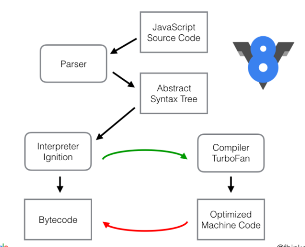

2. 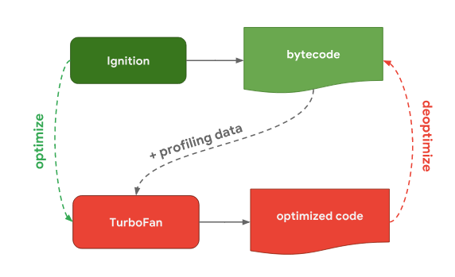

	- 解释器 Ignition 根据语法树生成并执行字节码，在执行字节码时会收集数据（profiling data）,这些数据可以被TurboFan优化器使用以加快之后的执行，但只有hot 函数（经常执行的，是否为hot由引擎决定）才会被传入TurboFan
	- TurboFan 是 V8 的优化编译器，TurboFan 根据其所拥有的分析数据进行某些假设，然后将字节码生成高度优化的机器代码。
	- 不同js引擎，大多采用解释器与优化器，只是不同js引擎可能优化器数量以及工作流不同（参见：https://mathiasbynens.be/notes/shapes-ics）

3. 为什么有些引擎会拥有更多的优化编译器呢？这完全是一些折衷的取舍。解释器可以快速生成字节码，但字节码通常不够高效。另一方面，优化编译器处理需要更长的时间，但最终会生成更高效的机器码。到底是快速获取可执行的代码（解释器），还是花费更多时间但最终以最佳性能运行代码（优化编译器），这其中包含一个平衡点

4. 虽然不同js引擎有不同的解释器和优化器，但从更高层次来看，所有js引擎都属于同一种架构

### 属性访问优化

#### shapes

1. 在js程序中，将多个对象具有相同键值属性的称为`shape`访问具有相同`shape`的相同属性也很常见

	```javascript
	const object1 = { x: 1, y: 2 };
	const object2 = { x: 3, y: 4 };
	// object1与object2有相同的shape
	// 访问shape相同属性
	function logX(object) {
		console.log(object.x);
	}
	const object1 = { x: 1, y: 2 };
	const object2 = { x: 3, y: 4 };
	logX(object1);
	logX(object2);
	```

2. 普通存储方式是即存储属性名又存储属性值，但对于相同的shape，可以进行优化，即存一份属性名：每个具有相同形状的 `JSObject` 都指向这个 `Shape` 实例

	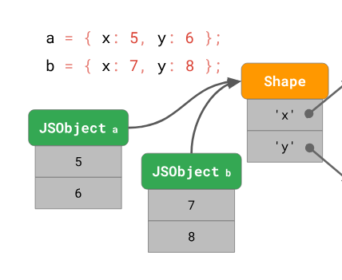

3. 所有浏览器都对类似的shape进行了优化，只是叫法不同，学术论文称之为*Hidden Classes*，SpiderMonkey称之为Shape，V8称之为Maps

#### Transition 链与树

1. 在 JavaScript 引擎中，shapes 的表现形式被称作 *transition 链*

2. 如向对象添加新属性，js引擎会如何处理呢？

	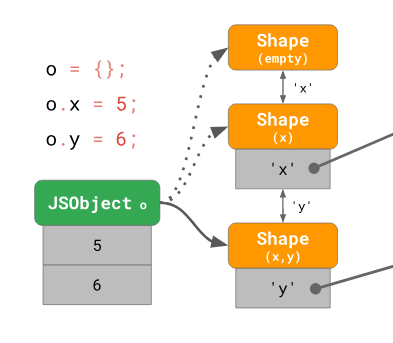

	```:1st_place_medal:
	const object = {};
	object.x = 5;
	object.y = 6;
	```

	- 开始创建一个空的shape，当添加x属性时，则创建新的Shape(x)，每次创建的shape表示新增的属性

3. 如果你有两个空对象，并且你为每个对象都添加了一个不同的属性？

	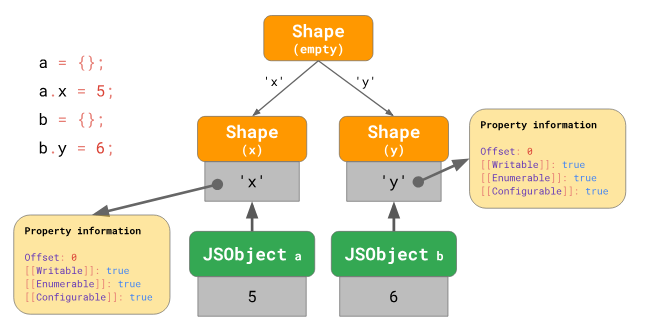

	```javascript
	const object1 = {};
	object1.x = 5;
	const object2 = {};
	object2.y = 6;
	```

	- 进行分支操作，构建一个 *transition 树* 而不是 transition 链

4. 如并不是从空对象开始添加属性？

	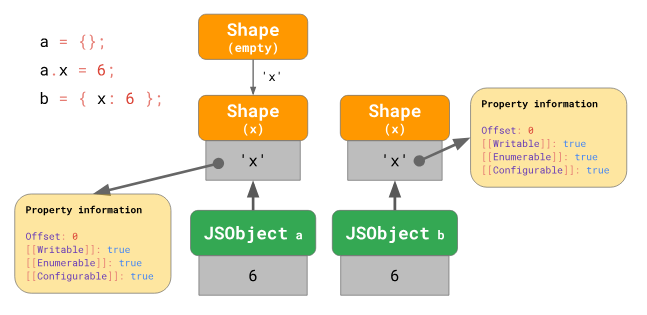

	```javascript
	const object1 = {};
	object1.x = 5;
	const object2 = { x: 6 };
	```

	- 包含属性 `'x'` 的对象字面量从包含 `'x'` 的 shape 开始，可以有效地跳过空的 shape。

#### Inline Caches(ICs)

1. js是基于原型的语言，没有class，对象的创建是通过克隆，并且js是动态语言，因此对象实例化后可以添加或删除属性

2. 大多解释器使用hash结构在内存定位obj，如java这样固定类型，可以通过key（类型确定），预测value在内存的最大偏移量，但js的类型可以在运行期改变，这就造成这种方式存储会比java存储花费更大的计算成本

3. JavaScript 引擎利用 ICs 来记忆去哪里寻找对象属性的信息，以减少昂贵的查找次数。

4. 如进行如下操作

	```javascript
	function getX(o) {
		return o.x;
	}
	getX({x:'1'})//1
	getX({x:'1'})//2
	getX({x:'1',y:'2'})//3
	```

	- getX是获取对象属性x的值，需要进行shape遍历，当第1遍历后，js引擎会记录遍历位置；故`{x:'1',y:'2'}`与`{y:'2',x:'1'}`实际会生成不同的shape
	- 第1次调用getX时，传入相同参数，即js引擎会对比shape，如与以前的相同，则直接通过相同遍历位置获取属性x值
	- 第2次调用getX，传入并不是相同参数，即对比shape是不同的，不能使用优化后的代码，需要重回基本的字节码

5. 对于不同shape，如这样调用foo函数`foo{a:1};foo({a:2,b:3});foo({a:3,b:4,c:5})`foo传入虽为对象，但对象属性不同，故会认为是4种shape，每次都会存储，故需要比较4次，高于4种类型时，v8不再进行比较，而是直接查找（消耗较大）

6. 因此建议的优化方式是对象使用相同结构，如这样`foo{a:1,b:undefined,c:undefined};foo({a:2,b:3,c:undefined});foo({a:3,b:4,c:5})

7. 可以使用`node --v8-options test.js` 查看v8命令

#### 举例说明ICs优化的重要性

1. ```javascript
	(() => {
	  const han = {firstname: "Han", lastname: "Solo",job: "Jedi"};
	  const luke = {firstname: "Luke", lastname: "Skywalker",gender: "female"};
	  const leia = {firstname: "Leia", lastname: "Organa", retired: true};
	  const obi = {firstname: "Obi", lastname: "Wan", spacecraft: "Falcon"};
	  const yoda = {firstname: "", lastname: "Yoda",rex: "ha"};
	  const people = [
	    han, luke, leia, obi,
	    yoda, luke, leia, obi
	  ];
	  const getName = (person) => person.lastname;
	  console.time("engine");
	  for(var i = 0; i < 1000 * 1000 * 1000; i++) {
	    getName(people[i & 7]);
	  }
	  console.timeEnd("engine");
	})();
	```

2. ```javascript
	(() => {
	  const han = {firstname: "Han", lastname: "Solo",        job: "Jedi" , gender: undefined, retired: undefined,spacecraft: undefined,rex:undefined};
	  const luke = {firstname: "Luke", lastname: "Skywalker",job:undefined, gender: "female",  retired: undefined,spacecraft: undefined,rex:undefined};
	  const leia = {firstname: "Leia", lastname: "Organa",   job:undefined, gender:undefined,  retired: true,     spacecraft: undefined,rex:undefined};
	  const obi = {firstname: "Obi", lastname: "Wan",        job:undefined, gender:undefined,  retired:undefined, spacecraft: "Falcon",rex:undefined};
	  const yoda = {firstname: "", lastname: "Yoda",         job:undefined, gender:undefined,  retired:undefined, spacecraft:undefined,rex: "ha"};
	  const people = [
	    han, luke, leia, obi,
	    yoda, luke, leia, obi
	  ];
	  const getName = (person) => person.lastname;
	  console.time("engine");
	  for(var i = 0; i < 1000 * 1000 * 1000; i++) {
	    getName(people[i & 7]);
	  }
	  console.timeEnd("engine");
	})();
	```

3. 两者重要的区别是，第一个js片段属性名不同，每个对象会生成5个不同的shape，而第二个js片段对于无值的属性名赋了undefined，保证属性名顺序与名称一致，故js引擎会视为一个shape，故两者运行时间会相差几倍(本机测试：20129/3899=5.16)

### 原型属性优化

1. 对于如下代码，可以获得js引擎的transition树：

	```javascript
	function Bar(x) {
		this.x = x;
	}
	Bar.prototype.getX = function getX() {
		return this.x;
	};
	const foo = new Bar(true);
	const qux = new Bar(false);
	```

	

	- 原型Bar.prototype是一个对象，上面的方法可以理解为Bar.prototype的属性
	- 而Bar内的this.x = x实际是在实例对象有一个属性为x
	- `Bar.prototype` 的原型是 `Object.prototype`。由于 `Object.prototype` 是原型树的根节点，因此它的原型是 `null`。

2. 调用`const x = foo.getX();`所有的调用可以理解为两步

	```javascript
	const $getX = foo.getX;
	const x = $getX.call(foo);
	```

	- 第一步，加载这个方法
	- 第二步，使用实例作为 `this` 值来调用该函数

3. 加载方法

	

	- 引擎从 `foo` 实例开始，意识到 `foo` 的 shape 上没有 `'getX'` 属性，所以必须向原型链追溯。到了 `Bar.prototype`，查看它的原型 shape，发现它在偏移0处有 `'getX'` 属性。我们在 `Bar.prototype` 的这个偏移处查找该值，并找到我们想要的`JSFunction getX`
	- 如上的检索方式，需要检索1+2N次（N为涉及的原型数量）；foo需要检索自己Shape为1次，然后检索其原型Bar.prototype，然后再检索Bar.prototype的Shape

4. 考虑到原型链可以改变，而且通常情况下原型链很长，此检索方式可以优化

	

	- 引擎将原型链在 Shape 上，而不是直接链在实例上。
	- 每次 `foo` 原型发生变化时，引擎都会转换到一个新 shape
	- 将检查次数从 `1 + 2N` 降到 `1 + N`，以便在原型上更快地访问属性
	- 引擎还采用了不同的技巧，特别是对于相同属性访问的后续执行，以进一步降低检查次数

### 使用2个编译器

1. full-codegen编译器
  - 简单、非常迅速的编译器，产生简单但相对比较慢的机器码
  - 主要用于代码第一次执行时，此编译器将js代码转换为机器码，不进行任何优化，没有中间语言
2. Crankshaft 编译器
  - 更复杂的（Just-In-Time）优化编译器，为hot方法生成优化的代码
  - 某个函数运行多次后，引擎会识别为`hot`方法，Crankshaft 会启用一个线程将抽象逻辑树（解析编译后的代码）转换为名为Hydrogen的高级static single-assignment (SSA)  ，然后优化Hydrogen

# 事件循环

## 概述

1. js引擎不是独立运行的，他运行在宿主环境中（web，nodejs等）
2. 所有环境都有一个共同“点”（线程），即都提供了一种机制来处理程序中多个块的执行，且执行每块时调用 JavaScript 引擎，这种机制被称为事件循环（Event Loop）。这里面的“事件”调度由环境决定
3. Js引擎本身并没有时间的概念，只是一个按需执行 Js任意代码片段的环境
   - 如写一个setTimeout并不是将回调函数挂载事件循环中，而是告诉环境，我需要1分钟后运行这个函数，当时间到了，才会将回调函数挂上事件循环中，但可能事件循环还有其他未运行函数，这也解释了为何setTimeout不准
   - 故可简单理解异步机制：如ajax，写一个回调函数，告诉宿主环境拿到数据后就调用，当监听到数据后，会将回调函数放到事件循环中准备调用
4. ES6标准指定了事件循环应该如何工作，故将事件循环的管理纳入js引擎，这样做主要原因是ES6中Promise（promise需要对事件循环进行直接、细粒度的控制）的引入

## 与调用栈的关系

1. 事件循环（event loop）会检查调用栈（call stack）是否为空，如空，则去查询事件队列（ Event Loop queue）
2. 如事件队列有内容，则将内容加入调用栈并执行
3. 事件循环会不断的运行，直到浏览器内容loaded完或关闭浏览器
4. 事件表（ event table ）跟踪已触发的所有事件，并将它们发送到要执行的事件队列。 

## 事件队列

1. 因为js的单线程的，看到异步操作，如定时器、ajax等，会将回调函数放到事件队列中
2. 至于何时放在事件队列中，由js运行环境决定

## task

1. 是严格按照时间顺序压栈和执行的
2. 可以理解为事件循环中的每个正常事件（task）

## microtask（jobs）

1. ES6引入新的“Job 队列”，即任务队列，主要是为了处理promise，当js主线程空时，会优先从任务队列拿回调函数执行，故优先级会高于事件队列，类似于插队效果
2. microtask：通常来说就是需要在当前 task 执行结束后立即执行的任务
3. microtask 任务队列是一个与 task 任务队列相互独立的队列，microtask 任务将会在每一个 task 任务执行结束之后执行。
4. 每一个 task 中产生的 microtask 都将会添加到 microtask 队列中，microtask 中产生的 microtask 将会添加至当前队列的尾部，并且 microtask 会按序的处理完队列中的所有任务。
5. microtask 类型的任务目前包括了 MutationObserver (DOM3 Events，会在指定的DOM发生变化时被调用 )以及 Promise 的回调函数。

## 如何判断 task 和 microtask

1. 直接测试输出是个很好的办法，看看输出的顺序是更像 Promise 还是更像 setTimeout，趋向于 Promise 的则是 microtask，趋向于 setTimeout 的则是 task。
2. 为啥要用 microtask？根据HTML Standard（https://link.zhihu.com/?target=https%3A//html.spec.whatwg.org/multipage/webappapis.html%23event-loop-processing-model），在每个 task 运行完以后，UI 都会重渲染，那么在 microtask 中就完成数据更新，当前 task 结束就可以得到最新的 UI 了。反之如果新建一个 task 来做数据更新，那么渲染就会进行两次。


## 


