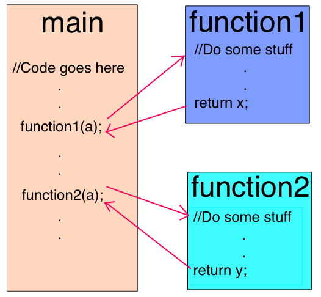
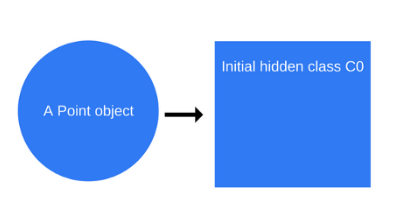
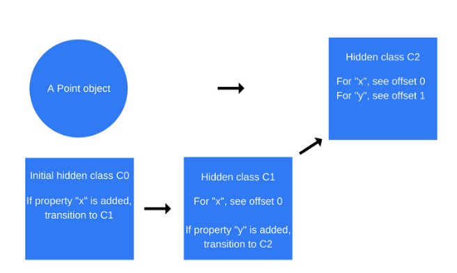
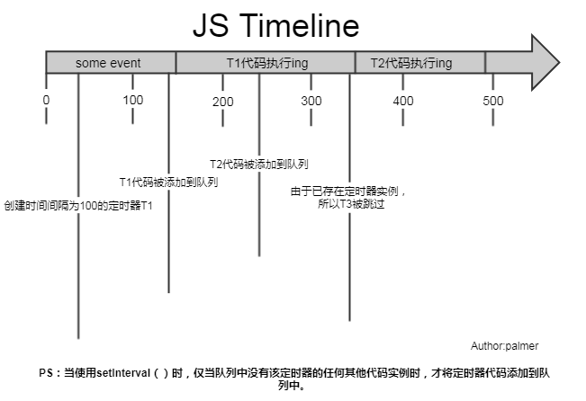

# 概述
## js实现
### 核心（ECMAScript）
1. 与浏览器没有依赖关系
2. web浏览器只是ECMAScript实现的宿主环境之一，其他环境：如Node，Flash
3. 主要是用来规定：语法、类型、语句、关键字、保留字、操作符、对象

### DOM
1. 是针对XML，经过扩展用于HTML的应用程序编程接口
2. DOM并不是只针对js，很多语言也实现了DOM，web浏览器中，基于ECMAscript实现DOM是js的重要组成部分
3. DOM级别划分
	- 	DOM 1级
                DOM 核心: 如何映射基于XML的文档结构，以便简化操作和访问
                DOM HTML: 添加针对HTML的对象和方法
		 	DOM 2级
				引入一些新模板
		 	DOM 3级
				进一步扩展
	- *注意：*DOM0级标准并不存在，只是历史坐标中的一个参照点而已

### BOM
1. H5致力于把BOM功能写入规范
2. 人们习惯把针对浏览器的js扩展都算作BOM

## 混合JavaScript环境
### ``` <script>```
1. 各个script标签（内联或外联）运行方式相互为独立js程序，一个报错，另外的继续运行

1. 全局作用域的提升机制，不能在不同script标签进行,如下方式会出错

   ```javascript
   <script>foo()</script>
   <script>function foo(){}</script>
   ```

1. 内联代码和外部文件区别

   - 内联代码不能出现`</scirpt>`，只要出现就被认为是代码块结束
   - 内联代码则使用其所在页面文件的字符集，外联可以charset属性指定
   - 带有src的script元素，会忽略标签中js代码

### 延迟脚本

1. `<script type="" src="" defer="defer"></script>`放在head中会延迟加载

### 异步脚本

1. `<script type="" src="" async ></script>`放在head中会异步加载
2. async属性的目的是：不让页面等待脚本下载和执行，从而异步加载页面其他内容
3. 由于异步加载，脚本加载顺序和页面中出现顺序不一定一致，故两个脚本不能有依赖关系

### `<noscript>`

1. 放在`<body>`中，当脚本无效情况下向用户显示其中的信息
2. 如用户启动了脚本或脚本可用，用户永远不会看到

# js引擎

## 概述

1. 当今比较知名的js引擎是 
   - Google V8：用于chrome和node中
   - SpiderMonkey：Mozilla开发的，用于Firefox中
2. node或浏览器中运行js，引擎会创建
   - 全局执行上下文（Global Execution Context）
   - 创建保存变量和函数声明的全局内存（Global Memory）（也称为全局作用域、全局变量）
   - 调用栈（ Call Stack）

## 运行时

1. 浏览器简单的可以视为：
2. memory Heap：负责内存分配
3. call stack：调用栈，负责执行代码
4. web apis：是由浏览器提供，而不是由js引擎提供

## 执行上下文

### 概述

1. 任何代码在JavaScript中运行时，都在执行上下文中运行

### 执行上下文的类型

1. 全局执行上下文（Global Execution Context）
	- 代码不是在某个函数而是在全局执行上下文中运行
	- 创建全局执行上下文一般执行两件事：1、创建全局对象（浏览器中为window对象），2、设置this值为全局对象
2. 函数执行上下文（Functional Execution Context）：
	- 函数被调用时，会创建函数的执行上下文和局部内存
	- 注意：此函数执行上下文在函数调用时才被创建！！！！

### 执行上下文是如何创建的

1. 执行上下文创建分为两个阶段
	- 创建阶段
	- 执行阶段

#### 创建阶段

1. 在执行任何JavaScript代码之前，执行上下文将经历创建阶段。在创建阶段有三件事情发生
	- 进行this绑定
	- 词法环境（LexicalEnvironment）组件创建
	- 变量环境（VariableEnvironment ）组件创建
	- 名词定义在https://tc39.github.io/ecma262/#sec-executable-code-and-execution-contexts
	- 作者对协议进行了介绍https://blog.bitsrc.io/understanding-execution-context-and-execution-stack-in-javascript-1c9ea8642dd0
2. this绑定（具体可以看4-this全面解析）
	- 在全局执行上下的this绑定到全局对象上（浏览器为window）
	- 函数执行上下文的this，根据函数调用绑定

## 调用栈

### 概述

1. Javascript是一种单线程的语言，这意味着它可以一次处理一个任务或一段代码。
1. 由于调用堆栈是单个的，所以从上到下逐个执行函数，这意味着调用堆栈是同步的，代码执行是同步的

### 代码解释

1. 这是一个记录函数调用的数据结构，如调用一个函数来执行，我们将其推入堆栈，当函数返回时，弹出堆栈的顶部 

    ```javascript
    function foo(b){
        var a = 5;
        return a*b;
    }
    function bar(x) {
        return foo(x*3)
    }
    console.log(bar(6))
    ```

1. 调用栈内容，main>console.log(bar(6))>bar(6)>foo(18)，然后再依次弹出返回值

### 栈阻塞

1. 如递归出现问题时，会一直往栈中push值，导致报错Maximum call stack size exceeded
2. 如一个非常大计算的函数在栈中，会阻塞浏览器干其他事情，一旦堆栈中处理如此多的任务，页面就可能会长时间停止响应。大多浏览器会提示如下信息：
3. 基于这个原因，需要异步处理一些事情，即利用事件循环

## v8引擎介绍

### 概述

1. v8引擎开始的设计目标是提高js在web浏览器的性能
2. 为了提高速度，v8引擎不是使用js解释器，而是直接利用JIT(Just-In-Time)编译器将js代码直接编译为机器码
3. SpiderMonkey or Rhino (Mozilla)也是这样做的，v8与他们主要区别是v8不会产生字节码或任何中间代码

### v8使用2个编译器

1. full-codegen编译器
	- 简单、非常迅速的编译器，产生简单但相对比较慢的机器码
	- 主要用于代码第一次执行时，此编译器将js代码转换为机器码，不进行任何优化
2. Crankshaft 编译器
	- 更复杂的（Just-In-Time）优化编译器
	- 代码运行多次后，Crankshaft 会启用一个线程将js抽象逻辑树转换为名为Hydrogen的高级static single-assignment (SSA)  ，然后优化Hydrogen

### Crankshaft优化举例

#### 提前内联函数

1. 提前内联尽可能多的代码，即提前找到每个函数对应的位置。 

#### 隐藏class

1. js是基于原型的语言，没有class，对象的创建是通过克隆，并且js是动态语言，因此对象实例化后可以添加或删除属性

2. 大多解释器使用hash结构在内存定位obj，如java这样固定类型，可以通过key（类型确定），预测value在内存的最大偏移量，但js的类型可以在运行期改变，这就造成这种方式存储会比java存储花费更大的计算成本

3. v8使用hidden class这样的方式，如代码

	```javascript
	function Point(x, y) {
	    this.x = x;
	    this.y = y;
	}
	var p1 = new Point(1, 2);
	```

4. 当new Point(1, 2) 调用，v8会创建一个C0的hidden class ，由于Point没有属性，故C0为空

5. 如运行到this.x = x为Point添加x属性，v8会构建一个hidden Class C1，将状态转为C1，this.y= y 时，会构建个C2

6. 最终，相当于构建了一个从c0到c2的路径

7. 结论

	- 虽然不知道这个如何起到高效的作用！！

	- 但由于v8会构建路径，因此，对于如下不同顺序的赋值操作，v8会构建两条不一样的path

		```javascript
		function Point(x, y) {
		    this.x = x;
		    this.y = y;
		}
		var p1 = new Point(1, 2);
		p1.a = 5;
		p1.b = 6;
		var p2 = new Point(3, 4);
		p2.b = 7;
		p2.a = 8;
		```

# 事件循环

## 概述

1. js引擎不是独立运行的，他运行在宿主环境中（web，nodejs等）
2. 所有环境都有一个共同“点”（线程），即都提供了一种机制来处理程序中多个块的执行，且执行每块时调用 JavaScript 引擎，这种机制被称为事件循环（Event Loop）。这里面的“事件”调度由环境决定
3. Js引擎本身并没有时间的概念，只是一个按需执行 Js任意代码片段的环境
   - 如写一个setTimeout并不是将回调函数挂载事件循环中，而是告诉环境，我需要1分钟后运行这个函数，当时间到了，才会将回调函数挂上事件循环中，但可能事件循环还有其他未运行函数，这也解释了为何setTimeout不准
   - 故可简单理解异步机制：如ajax，写一个回调函数，告诉宿主环境拿到数据后就调用，当监听到数据后，会将回调函数放到事件循环中准备调用
4. ES6从本质上改变了在哪里管理事件循环，将事件循环的管理纳入js引擎，主要原因是ES6中Promise的引入

## 与调用栈的关系

1. 事件循环（event loop）会检查调用栈（call stack）是否为空，如空，则去查询事件队列（event queue）
2. 如事件队列有内容，则将内容加入调用栈并执行
3. 事件循环会不断的运行，直到浏览器内容loaded完或关闭浏览器
4. 事件表（ event table ）跟踪已触发的所有事件，并将它们发送到要执行的事件队列。 

## task

1. 是严格按照时间顺序压栈和执行的
2. 可以理解为事件循环中的每个正常事件（task）

## microtask

1. microtask：通常来说就是需要在当前 task 执行结束后立即执行的任务
2. microtask 任务队列是一个与 task 任务队列相互独立的队列，microtask 任务将会在每一个 task 任务执行结束之后执行。
3. 每一个 task 中产生的 microtask 都将会添加到 microtask 队列中，microtask 中产生的 microtask 将会添加至当前队列的尾部，并且 microtask 会按序的处理完队列中的所有任务。
4. microtask 类型的任务目前包括了 MutationObserver (DOM3 Events，会在指定的DOM发生变化时被调用 )以及 Promise 的回调函数。

## 如何判断 task 和 microtask

1. 直接测试输出是个很好的办法，看看输出的顺序是更像 Promise 还是更像 setTimeout，趋向于 Promise 的则是 microtask，趋向于 setTimeout 的则是 task。
2. 为啥要用 microtask？根据HTML Standard（https://link.zhihu.com/?target=https%3A//html.spec.whatwg.org/multipage/webappapis.html%23event-loop-processing-model），在每个 task 运行完以后，UI 都会重渲染，那么在 microtask 中就完成数据更新，当前 task 结束就可以得到最新的 UI 了。反之如果新建一个 task 来做数据更新，那么渲染就会进行两次。

## setInterval 的问题

1. 如setInterval(func,100)，即100ms往队列添加一个事件，100ms后的某个事件，101ms，func调用；
2. 
3. 根据事件循环，100ms添加一个定时器事件；在过了300ms后，应该t3创建，但此时t2创建的func还未执行完，故跳过t3创建


