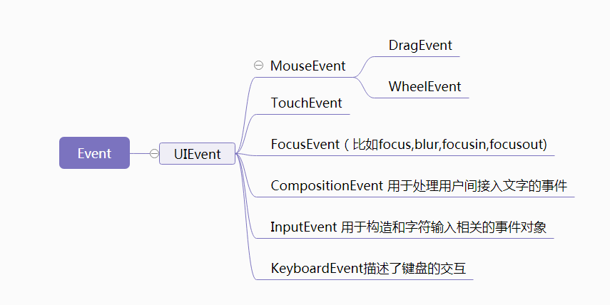
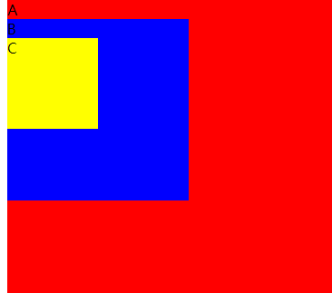

# 事件
## 概述
1. js和HTML交互是通过事件实现的
1. 可以使用监听器（或处理程序）来预订事件，以便事件发生时执行某段代码
1. IE8是最后一个仍用专有事件系统的主要浏览器
1. DOM3级出现，增强的DOM事件API更加繁琐，使事件有时难，有时容易，核心概念要知道

## 事件流
1. 概述
    - 事件流描述的是从页面中接收事件的顺序
1. 事件冒泡
    - 事件由最具体的元素接收，然后逐级向上传播
    - 所有现代浏览器都支持事件冒泡，但具体实现还有一定的差异
1. 事件捕获
    - 从不太具体的节点更早接收事件，然后最具体的节点最后接收事件
    - DOM2规范要求从document对象开始传播，但浏览器都是从window对象开始传播
1. DOM事件流
    - DOM2级事件，规定具体事件包含三个阶段：事件捕获阶段，处理目标阶段和事件冒泡阶段
1. 如何让事件先冒泡后捕获
    - 在DOM标准事件模型中，是先捕获后冒泡
    - 对于同一个事件，监听捕获和冒泡，分别对应相应的处理函数，监听到捕获事件，先暂缓执行，直到冒泡事件被捕获后再执行捕获之间。
    - addEventListener，第3个参数true为捕获阶段的处理函数，false为冒泡阶段的处理函数

## 事件处理程序
### 概述

1. 响应某个事件的函数叫事件处理程序（或事件监听）
2. 有三种方式可以为DOM元素注册事件处理函数

### HTML属性

1. 把事件写在HTML代码中：`<button onclick="alert('Hello world!')">`
2. 独到之处
   - 内部可以直接使用event对象，不用定义也不用从函数参数列表中读取
   - 函数内部，this值等于事件的目标元素
3. 缺点
   - 如函数定义在HTML最底部，页面一加载就点击按钮，会没有反应
   - 事件处理程序的作用域链在不同浏览器可能会导致不同结果
   - HTML与js紧耦合，可读性却较差

### DOM元素属性

1. `myButton.onclick = function(event){alert('Hello world');};`
2. 这种方式是DOM0级事件处理程序
3. 每一个元素都有自己的事件处理程序属性，如onclick
4. 使用DOM0级方法指定的事件处理程序被认为是元素的方法，因为这时候事件处理程序的作用域是在元素作用域中运行的，this为当前元素
5. 问题在于每个元素和事件只能设置一个处理函数。
6. 删除事件处理程序：`btn.onclick = null`

### addEventListener()

1. `myButton.addEventListener('click', function(){alert('Hello world');}, false);`
2. 此方法定义的事件处理函数只能使用`removeEventListener()`删除，这意味着匿名函数添加的事件处理程序将无法删除
3. 所有节点都支持这两个方法
   - 参数：要处理的事件名，参数为click，无on
   - 参数：事件处理程序的函数
   - 参数：true，捕获阶段，flase，冒泡阶段
4. 这种方式是DOM2级事件处理程序
5. 优势是：能添加多个事件处理程序
6. 大多数情况下，都是将事件处理程序添加到事件流的冒泡阶段，可以最大限度兼容浏览器

### addEventListener与onclick同时作用时

1. 谁先绑定先触发谁（chrome测试）

## 事件对象
### 概述

1. 在触发DOM上的事件时，会产生一个事件对象event，这个对象包含着所有事件相关的信息
2. 所有浏览器都支持event对象，但支持方式不同
3. 事件对象是事件接口的实例，接口的继承关系如下：

### Event接口

1. 兼容DOM的浏览器（无论是DOM0还是DOM2），都会传入event对象
2. event对象会因为触发的事件类型不同，可用的属性和方法也不一样
3. event.currentTarget：指向事件绑定的元素
4. event.target：事件触发的元素
5. event.type：需要一个函数处理多个事件，利用switch
6. preventDefault()
	- 阻止特定事件的默认行为，如a链接的
	- 只有cancelable（是否可以取消默认行为）属性设置为true的，才可以用此方法取消
7. stopPropogation()方法
	- 立即停止事件在DOM层的传播
	- 可同时取消事件捕获和冒泡
8. eventPhase属性
	- 确定事件当前正位于事件流的什么阶段
9. 只有事件处理程序执行期间，event对象存在，一旦事件处理程序结束，event被销毁

### UIEvent接口

#### UIEvent.detail

1. 当值为非空的时候, 提供当前点击数(和环境有关) 。
2. 对 click 或者 dblclick 事件, UIEvent.detail 是当前点击数量
3. 对 mousedown 或者 mouseup 事件, UIEvent.detail是1加上当前点击数。
4. 对所有的其它UIEvent 对象, UIEvent.detail 总是零.
5. mouseup和mousedown相继发生算一次点击，如中间移动位置则重新计数

### MouseEvent接口

#### 客户区坐标位置

1. `MouseEvent.clientX`与`MouseEvent.clientY`是只读属性
2. 不论页面是否有水平滚动，当你点击客户端区域的左上角时，鼠标事件的 `clientX` 值都将为 0 

#### 页面坐标位置

1. pageX和pageY属性：基于文档的边缘，考虑任何页面的水平方向上的滚动
2. 举个例子，如果页面向右滚动 200px 并出现了滚动条，这部分在窗口之外，然后鼠标点击距离窗口左边 100px 的位置，pageX 所返回的值将是 300。

#### 屏幕坐标位置

1. screenX和screenY属性：鼠标相对于屏幕坐标系的水平偏移量

#### 修改键

1. 点击鼠标，键盘的某些键的状态也可以影响到所要采取的行动
2. MouseEvent.altKey：当鼠标事件触发的时，如果alt 键被按下，返回true；
3. MouseEvent.metaKey ：当鼠标事件触发的时，如果meta键被按下，返回true；
	- metaKey：windows下表示windows键，苹果下表示Cmd键
4. MouseEvent.shiftKey ：当鼠标事件触发的时，如果shiftKey 键被按下，返回true；
5. `if(event.shiftKey){...} `点击鼠标且按下shift键会执行

#### 鼠标按钮判断

1. MouseEvent.button：
	- 当鼠标事件触发的时，如果鼠标按钮被按下（如果有的话），将会返回一个数值。
	- 0：鼠标主按钮
	- 1：鼠标中间按钮
	- 2：鼠标次按钮
2. 用户可能会改变鼠标按键的配置，因此当一个事件的`MouseEvent.button`值为0时，它可能不是由物理上设备最左边的按键触发的

#### MouseEvent.relatedTarget 

1. 鼠标事件的次要目标（如果存在）
2. 比如mouseenter，指针移入的元素为target，离开的那个元素为relatedTarget
3. 如果事件没有次要目标，`relatedTarget` 将返回 `null`

#### WheelEvent 接口

##### 概述

1. wheel事件，替换了已被弃用的非标准mousewheel事件。
2. 依据滚轮方法判断文档滚动方向是不准确的
3. 标准未定义滚轮事件具体会引发什么样的行为，引发的行为实际上是各浏览器自行定义的。
4. 可在文档内容滚动事件（scroll）中监视scrollLeft和scrollTop二值变化情况，即可推断出滚动方向了。

##### deltaX、deltaY、deltaZ

1. 分别表示滚轮的横向、纵向、z轴的滚动量

### KeyboardEvent接口

#### KeyboardEvent.key 

1.  返回用户按下的物理按键的值，会受到shift等影响
2. 对于e.char、e.charCode、

#### KeyboardEvent.code

1. 返回一个值，该值不会被键盘布局或修饰键的状态改变
2. 如按shift+f，此值返回KeyF，而e.key返回是F；
3. 如按f，此值返回KeyF，而e.key返回是f；

#### KeyboardEvent.location

1. 返回一个表示键盘或其他输入设备上按键位置的Number
2. 按下什么位置的键，值为0,1,2,3,4,5，表示数字小键盘，手柄等

#### getModifierState

1. 检测alt、shift、Ctrl等修改键是否被按下

## 事件类型
### 概述
1. IE9在内的主流浏览器都支持DOM2级事件和DOM3级事件

1. 有些浏览器会为DOM和BOM实现其他专有事件

1. 常见事件类型：https://developer.mozilla.org/zh-CN/docs/Web/Events，其中详细列举了标准事件与各浏览器专有事件

	

### 资源事件
#### load事件

1. 页面完全加载完会触发window上的load事件
2. 一般说，在window发生的任何事件都可以body元素中通过相应特性来指定
3. 根据DOM2级规范，应该在document实现这个事件，为确保向后兼容，都是在window上实现的
4. 图像上也可以触发事件
5. script元素也会被触发load事件，方便判断js文件是否加载完

#### unload事件

1. 文档被完全卸载后触发
2. 用户从一个页面切换到另一个页面，会触发unload事件
3. unload事件发生，那么页面加载后存在的对象，此时不一定存在，操作DOM节点或元素的样式可能会出错

### 视图事件

#### resize事件

1. 事件在window上触发
2. 何时触发，不同浏览器机制不同，Firefox是用户停止调整窗口大小时触发，其他是改变1px就触发
3. 不要加入大量代码，因为会频繁执行，会使浏览器反应变慢

#### scroll事件

1. 在window对象上发生，实际表示的是页面中相应元素的变化
2. 会在文档滚动期间重复调用

### 焦点事件

1. focus和blur不冒泡
2. 当焦点从a元素移动到b元素，触发事件顺序是
       a——focusout（一个元素将要失去focus）
       b——focusin
       a——blur
       b——focus   

### 鼠标事件

#### mouseenter与mouseleave

1. mouseenter和mouseleave不冒泡

2. mouseover和mouseout冒泡

3. 对于如下代码：

   ```html
   <!DOCTYPE html>
   <html>
   <head lang="en">
     <meta charset="UTF-8">
     <style>
       .a {width: 500px;height: 500px;background: aliceblue;}
       .b {width: 200px;height: 200px;background: beige;}
       .c {width: 100px;height: 100px;background: violet;}
     </style>
   <body>
   <div class="a">A
     <div class="b"       onmouseenter="console.log('mouseenter')"     onmouseleave="console.log('mouseleave')"
   onmouseout="console.log('mouseout')"       onmouseover="console.log('mouseover')">B
       <div class="c">C</div>
     </div>
   </div>
   </body>
   </html>
   
   ```

   

   - 从A到B，mouseover、mouseenter
   - 但无论从B到C还是从C到B，由于冒泡都会触发mouseover、mouseout
   - B到A触发，mouseout、mouseleave

#### click事件特殊性

1. 只有同一个元素上相继发生mousedown和mouseup，才会触发click，其中一个被取消，click事件就不会发生
2. 双击一个元素，事件发生顺序
   - mousedown
   - mouseup
   - click
   - mousedown
   - mouseup
   - click
   - dbclick

### 键盘事件

1. keydown：按下任意键触发
2. keypress：按下字符键
3. keyup：释放任意按键
4. 用户按着一个字符键不放，会重复触发keydown和keypress
5. 用户按着非字符键不放，重复触发keydown


### 变动事件
1. MutationObserver接口提供了监视对DOM树所做更改的能力。它被设计为旧的Mutation Events功能（如DOMAttrModified、DOMNodeInserted等事件）的替代品，该功能是DOM3 Events规范的一部分。

### input事件与change事件

1. 当input、select、textarea的value被修改时，会触发input事件
2. change 事件仅当 value 被提交时触发
3. 比如对于input框来说，每次输入都会触发input事件，但只有当按回车时，才会触发change事件


### HTML事件
#### 概述

1. html5标准的事件

#### contextmenu事件

1. 右键菜单显示前会触发

2. 事件出现的目的是：屏蔽右键关联的默认上下文菜单

3. 事件是冒泡的，可以在document指定事件处理程序，用以处理页面发生的所有此类事件

4. 使用这个事件

	- 首先应先屏蔽事件的默认行为，保证浏览器不显示默认的上下文菜单
	- 创建一个div，当事件发生时，获取鼠标点击位置，将位置给div设置上

5. 屏蔽右键菜单：

	```javascript
	window.oncontextmenu = function({
		event.returnValue = false;
	}
	```

	

#### beforeunload事件

1. 当浏览器窗口关闭或者刷新时，会触发beforeunload事件 

2. 如果处理函数为Event对象的`returnValue`属性赋值非空字符串，浏览器会弹出一个对话框，来询问用户是否确定要离开当前页面（如下示例）。

3. 有些浏览器会将返回的字符串展示在弹框里，但有些其他浏览器只展示它们自定义的信息 

4. 有些浏览器，如firefox，webkit，在window或document添加这个事件，浏览器就不会缓存当前页面 

5. ```javascript
	window.addEventListener("beforeunload", function (event) {
	  event.returnValue = "haha"; 
	});
	```

6. 补：2-HTML\2-HTML5\Document.visibilityState （页面卸载）

#### DOMContentLoad事件

1. 形成完整DOM树后触发，不理会js，css，图像是否下载完
2. 与onload不同，支持页面早期添加事件处理程序，意味着可尽早让用户和页面交互
3. 事件冒泡到window，但目标实际是document
4. 在不支持这个事件的浏览器，可以设置一个0毫秒的超时调用，js处理完后立即调用，但无法保证所有环境中超时调用都早于load事件触发

#### readystatechange事件

1. 目的：提供与文档或元素加载状态有关的信息
2. 支持事件的有个readyState属性：包含5个值，表示状态（未初始化，正在加载，加载完毕，交互）
3. 问题：
	- 并非所有对象都经历这个几个状态
	- event事件不提供任何信息，没有目标对象
	- 与load事件一起用，无法预测两者的先后顺序
	- 交互阶段不一定早于完成阶段
		- 解决办法：同时检测两个阶段
		- 检测到了要移除事件处理程序，避免其他阶段再执行
4. document.readyState == "interactive" 与DOMContentLoaded事件触发时间大致相同
5. 注意
	- 最重要的是一并检测readyState的两个状态
	- 注意事件涉及的问题

#### pageshow和pagehide事件

1. Firefox和Opera特性，往返缓存（back-forward cache或bfcache）

1. 使用户在使用浏览器后退和前进，加快页面转换速度，缓存保存了DOM结构和js状态

1. 如页面在bfcache中，再打开页面不会触发load事件

1. Firefox提供的新事件，但除IE9之前，其他支持

    - pageshow
    	- 页面显示时触发，load事件之后
    	- 事件目标为document，但事件处理程序必须添加到window上
    	- persisted属性
    		- true：页面保存在bfcache中
    - pagehide
    	- 页面卸载时触发，unload事件之前

1. 注意

    - 指定了onunload事件处理程序的页面会自动排除在bfcache中，即使事件处理程序为空
    - 原因，unload事件一般是撤销load事件中执行的操作，跳过load事件，可能导致页面不正常

    

#### hashchange事件

1. URL列表发生变化时，通知开发人员
1. 必须添加到window对象上
1. 事件处理程序中，最好使用location.hash确定当前的参数列表

## 内存与性能
### 概述
1. js添加到页面事件数量直接影响页面整体运行性能
1. 原因
    - 每个函数都是对象，都占内存
    - 导致DOM访问次数增多

### 事件委托
1. 解决事件处理程序过多的解决方案，利用事件冒泡
1. 如click，会冒泡到document层，无需为每个按钮设置click，可以在document同一处理
1. 可以利用target.id，确认是点击的哪个按钮
1. 优点
    - document对象很快就可以访问，单击元素呈现在页面上，就立即具备适当功能
    - 事件处理程序添加少，DOM引用就少，花时间更少
1. 缺点：
    - 如果把所有事件都用事件代理，可能会出现事件误判，在事件处理函数中需要些大量判断

### 移除事件处理程序
1. 当事件处理程序给元素时，运行的浏览器代码和js之间存在一个连接，这样连接越多，页面执行起来越慢
1. 空事件处理程序造成性能问题
    - 原因一
        - 文档中删除带有事件处理的元素
        - 如使用removeChild()，replaceChild(),innerHTML等方法
        - 如带事件处理程序的元素被innerHTML删除，事件处理程序可能无法被gc回收
        - 可以在替换直接将事件处理函数置null，btn.onclick = null
    - 原因二
        - 页面卸载之前，未清理干净的事件处理程序会在内存中

## 模拟事件

1. 之前的方法不推荐使用，如何构建新的模拟事件？