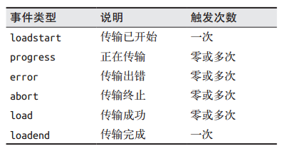
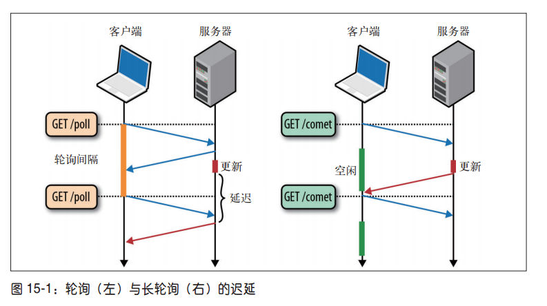

# Ajax
## 什么是ajax
1. 是Asynchronous JavaScript+XML简写
1. 核心是XMLHTTPRequest对象（简称XHR）

## 解决缓存问题

1. 设置请求头If-Modified-Since为0；Cache-Control为no-cache
2. URL后面加上一个随机数： "fresh=" + Math.random()。
3. URL后面加上时间戳："nowtime=" + new Date().getTime()。

# XMLHTTPRequest

## 概述

1. XMLHttpRequest（ XHR） 是 浏 览 器 层 面 的 API， 可 以 让 开 发 人 员 通 过 JavaScript 实 现 数 据 传 输  
2. XHR是ajax的核心技术，能力不仅仅是实现了异步通信，还极大的简化了这个异步通信过程（开发人员无需关系底层http协议，缓存，套接字等）
3. XHR可以并基本已经实现了大部分网络应用，如下载、上传、流传输等，但并不是说XHR在任何场景都是最有效的传输方式
4. 2011年将“ XMLHttpRequest Level 2” 规 范 与 原 来 的 XMLHttpRequest 工 作草案合并，Level 1与Level 2已经没有什么关系了，今天只有一个统一的XHR规范，通过XMLHttpRequest API 提供的：接口不变，功能增强
5. XHR 并不适合用来实现流式数据处理，之后可以使用Streams API
  - streams API （MDN）：https://developer.mozilla.org/en-US/docs/Web/API/Streams_API
  - w3c：https://streams.spec.whatwg.org/
6. XHR的自身局限性：
  - XHR 不适合流式数据处理 
  - XHR 实时交付更新方式都不好（XHR使用轮询）
  - 对于这两方面应用，可以选用Server-Sent Events 和 WebSocket

## 同源策略

1. 一个“源”由应用协议、域名和端口这三个要件共同定义。  
2. 同源策略的出发点很简单：浏览器存储着用户数据，比如认证令牌、 cookie 及其他私有元数据，这些数据不能泄露给其他应用；如果不同源，那么a.com的脚本就可以操作b.com的用户数据了

## 创建XHR对象
1. ```var xhr = new XMLHttpRequest()```

## XHR用法
### xhr.open('get', 'rextao.com', false)

1. 初始化请求
	- 参数：请求类型
	- 参数：请求URL
	- 参数：请求是异步（true，默认值）还是同步
2. 并不是真正发送请求，而是启动一个请求以备发送
3. 只能向同一域相同端口和协议的URL发送请求，如有差别，则会引发安全错误

### xhr.send()

1. 向服务器发送数据：`XMLHttpRequest.send(body)`

	- 请求主体发送的数据
	- 如不需要，必须传入null
	- 这个参数对有些浏览器是必须的

2. 收到响应后

	- 数据自动填写到XHR对象的属性上
	- 第一步
		- 检查status属性，以确定响应成功
		- HTTP:200表示成功
		- HTTP:304表示请求资源未修改，可从缓存中获得

3. 发送异步请求时

	- 检测XHR.readyState属性

	- 该属性表示请求/响应过程的当前活动阶段
	- 值改变就会触发readystatechange事件
	- 必须在调用open()之前指定onreadystatechange事件处理程序才能保证跨浏览器兼容性
	- 之所以使用onreadystatechange(DOM0级)，是因为并不是所有浏览器都支持DOM2级

4. xhr.abort()
    - 取消异步请求
    - 会停止触发事件，也不允许访问任何与相应有关的对象属性

5. 由于内存原因，不建议重用XHR对象


### HTTP头信息（设置获取头信息）
### setRequestHeader(头部字段名称，头部字段值)

1. 设置自定义头信息
2. 必须在open和send之间调用
3. 用户可以使用自定义的头部字段（服务器接收到自定义字段后执行后序操作），但不要使用浏览器正常发送的字段名称，可能会影响浏览器响应
4. 有些字段，如Accept-Charset、Host、Upgrade等首部字段，浏览器出于安全原因，是不能通过此api修改的

### getResponseHeader(头部字段名称)

1. 可以取得响应的头部信息

### getAllResponseHeader()

1. 包含所有头部信息的长字符串

## get与post请求

### get请求

1. 可以将查询字符串参数添加到URL尾部
1. 位于open方法的URL的查询字符串必须经过正确编码才行
1. 查询字符串中每个参数的名称和值都必须使用encodeURIComponent()进行编码


### post请求
1. 将数据作为请求主体提交
1. 消耗资源比get多，以相同数据计算，get请求速度最多可达post请求的2倍
### 两者区别

1. GET与POST是HTTP协议的两种发送请求的方法
2. HTTP的底层是TCP/IP。所以GET和POST的底层也是TCP/IP。GET和POST能做的事情是一样一样的。你要给GET加上request body，给POST带上url参数，技术上是完全行的通的。 
3. 但由于浏览器与服务器的限制，导致他们在应用过程中体现了不同
	- 如get请求即使加上request body，服务器可能也会忽略
4. **重大区别**：GET产生一个TCP数据包；POST产生两个TCP数据包。
	- 对于GET方式的请求，浏览器会把http header和data一并发送出去，服务器响应200（返回数据）；
	- 对于POST，浏览器先发送header，服务器响应100 continue，浏览器再发送data，服务器响应200 ok（返回数据）。
	- 并不是所有浏览器都会在POST中发送两次包，Firefox就只发送一次。
5. 其他区别
	- post发送的数据更大（get有url长度限制） 
	- post比get慢 （post两次TCP）
	- post用于修改和写入数据，get一般用于搜索排序和筛选之类的操作
	- post更安全（不会作为url的一部分，不会被缓存、保存在服务器日志、以及浏览器浏览记录中） 

## XMLHttpRequest2级

1. 概述，虽然现在统一了XHR，但有的浏览器不支持如下特性

	

### FormData

1. ie11，ie10部分支持

2. 为序列化表单和创建与表单格式相同的数据提供便利

3. `var formdata= new FormData()`

4. 常用方法：

  - formdata.append(key,value)：在数据末尾追加数据
  - formdata.set(key, value)：设置修改数据；key值不存在，则追加一个值，否则修改
  - formdata.has(key)：判断是否有key
  - formdata.delete(key)：删除key
  - formdata.get(key)：获取第一个
  - formdata.getAll(key)：获取全部

5. 方便之处是：不用设置请求头，XHR对象可识别传入FormData的实例，并适配头部信息

6. 举例

	```html
	<form id="advForm">
	    <p>广告名称：<input type="text" name="advName" value="xixi"></p>
	    <p>广告类别：<select name="advType">
	        <option value="1">轮播图</option>
	        <option value="2">轮播图底部广告</option>
	        <option value="3">热门回收广告</option>
	        <option value="4">优品精选广告</option>
	        </select></p>
	    <p>广告图片：<input type="file" name="advPic"></p>
	    <p>广告地址：<input type="text" name="advUrl"></p>
	    <p>广告排序：<input type="text" name="orderBy"></p>
	    <p><input type="button" id="btn" value="添加"></p>
	</form>
	```

	```javascript
	var btn=document.querySelector("#btn");
	btn.onclick=function(){
	    var formdata=new FormData(document.getElementById("advForm"));
	    var xhr=new XMLHttpRequest();
	    xhr.open("post","http://127.0.0.1/adv");
	    xhr.send(formdata);
	    xhr.onload=function(){
	        if(xhr.status==200){
	            //...
	        }
	    }
	}
	```

	

### XHR.timeout属性
1. 超时设定，请求多少毫秒之后终止，默认值为0，即无超时设定
1. XHR对象的属性
1. 不可以用在同步XMLHttpRequest请求中
1. 规定时间没收到响应，会触发timeout事件，调用ontimeout事件处理程序

### XMLHttpRequest.overrideMimeType()
1. 指定响应的MIME类型
1. 例如可以强制数据流解析为'text/xml'
1. 返回响应的MIME类型决定了XHR对象如何处理它

## XHR进度事件

1. 概述
	- 定义了客户端服务器通信有关的事件
	- 主要是针对XHR操作的
	- 
2. 每个 XHR 请求开始时都会触发 loadstart 事件，而结束时都会触发 loadend 事件。 
3. 无论load 和error中的哪一个被触发了，都代表XHR传输的最终状态  
4. progress事件
	- 事件会在浏览器接受新数据期间周期性触发
	- 接受event对象，target属性是XHR对象
	- lengthComputable属性
		- 进度信息是否可用布尔值
	- position属性
		- 接受字节数
	- totalSize属性
		- 根据Content-Length响应头确定的预期字节数
		- 要估算传输完成的数据量，服务器必须在其响应中提供内容长度（ ContentLength）首部。  
	- 必须在open之前添加事件处理程序
	- 通过这个可以为用户创建一个进度指示器
5. 注意：XHR请求默认没有超时限制，这意味着一个请求的“进度”可以无限 长。作为最佳实践，一定要为应用设置合理的超时时间，并适当处理错误。  

## XHR应用举例

### 通过XHR下载数据

1. 浏览器可以自动为如下原生数据类型提供编码和解码服务 

	- ArrayBuffer：固定长度的二进制缓冲区
	- Blob：二进制大对象或不可变数据（HTML5 API），主要是作为各种 JavaScript API 之间的一种高效的互操作机制。
	- Document：解析后的html或xml
	- JSON：简单数据结构的js对象
	- Text：文本

2. 浏览器依靠http的content-type 首部来推断适当的数据类型，发送XHR时也可以显式重写数据类型

3. 获取图片

	```javascript
	var xhr = new XMLHttpRequest();
	xhr.open('GET', '/images/photo.webp');
	xhr.responseType = 'blob'; // ➊
	xhr.onload = function() {
	if (this.status == 200) {
	    var img = document.createElement('img');
	    img.src = window.URL.createObjectURL(this.response);// ➋
	    img.onload = function() {
	       window.URL.revokeObjectURL(this.src); // ➌
	    }
	    document.body.appendChild(img);
	    }
	};
	xhr.send();
	```

	- ➊返回类型设置为blob
	- ➋基于返回的对象创建唯一的对象 URI 并设置为图片的源
	- ➌图片加载完释放对象

### 通过XHR上传数据

1. 上传数据很简单，而且高效，只不过最后在调用 XHR 请求对象的 send() 方法时，要传入相应的数据对象（ArrayBuffer、blob、text、Document、JSON等）

2. ```javascript
	var xhr = new XMLHttpRequest();
	xhr.open('POST','/upload');
	xhr.onload = function() { ... };
	xhr.send("text string"); // ➊上传简单文本
	
	// ➋通过 FormData API 动态创建表单数据
	var formData = new FormData(); 
	formData.append('id', 123456);
	formData.append('topic', 'performance');
	var xhr = new XMLHttpRequest();
	xhr.open('POST', '/upload');
	xhr.onload = function() { ... };
	xhr.send(formData); // ➌上传multipart/form-data对象
	
	var xhr = new XMLHttpRequest();
	xhr.open('POST', '/upload');
	xhr.onload = function() { ... };
	// ➍创建无符号、 8 字节整型的有类型数组                      
	var uInt8Array = new Uint8Array([1, 2, 3]); 
	xhr.send(uInt8Array.buffer); // ➎ 上传字节块 
	```

## 实时通知与交付（轮询）

### 概述

1. 客户端可以发送XHR请求，然后更新数据，但如服务器数据更新了，怎么通知客户端呢？

2. HTTP 没有提供服务器向客户端发起连接的方式 

3. 鉴于主流浏览器对XHR流的支持有限，就只能使用XHR 轮询了

4. 这里的实时通知在不同应用有不同的含义，有的应用需要几毫秒，有的可能几分钟轮询一次就可以


### 定时轮询

1.  最简单的方式就是客户端定时发起XHR请求，这样方式简单，但效率很低
	- 长轮询间隔意味着延迟交付
	- 短轮询间隔会导致客户端与服务器间不必要的流量和协议开销。
2. 定时轮询的一个大问题就是很可能造成大量没必要的空检查 

### 长轮询（通过XHR实现）

1. 改进的方式是：在没有更新的时候不再返回空响应， 而是把连接保持到有更新的时候。  
2. 利用长时间保留的 HTTP 请求（“挂起的 GET”）来让服务器向浏览器推送数据的技术，经常被称作 Comet，也被称之为“保留 AJAX”、“ AJAX 推送”或“ HTTP 推送”。  

## 跨资源共享（CORS）

### 概述

1. 通过XHR实现Ajax通信的主要限制，来源于跨安全策略（同源策略）
2. 同源策略保护了用户数据，但也带来了麻烦，如服务器想要给另一个网站中的脚本提供资源怎么办？这就是CORS（cross-origin Resource Sharing）的来由
3. CORS跨源资源共享，背后思想：使用自定义HTTP头部让浏览器与服务器进行沟通，从而决定请求或响应是否成功

### 举例CORS

1. ```javascript
	// 脚本来源： (http, example.com, 80)
	var xhr = new XMLHttpRequest();
	xhr.open('GET', '/resource.js'); ➊
	xhr.onload = function() { ... };
	xhr.send();
	var cors_xhr = new XMLHttpRequest();
	cors_xhr.open('GET', 'http://thirdparty.com/resource.js');➋
	cors_xhr.onload = function() { ... };
	cors_xhr.send();
	```

2. 上面例子是(http, example.com, 80)的一个脚本，1是同源XHR，2是跨域XHR（请求的是非同源地址的脚本）

3. 注意：CORS请求使用相同的XHR API

### CORS的请求与响应

1. ```http
	=> 请求
	GET /resource.js HTTP/1.1
	Host: thirdparty.com
	Origin: http://example.com ➊
	...
	<= 响应
	HTTP/1.1 200 OK
	Access-Control-Allow-Origin: http://example.com ➋
	...
	```

2. 注意：

	- CORS请求，浏览器会自动添加Origin首部
	- Access-Control-Allow-Origin 由服务器设置

3. 这个例子，请求浏览器自动在Origin带上当前源，服务器（thirdparty.com）决定与 example.com 跨源共享资源 ，则在Access-Control-Allow-Origin 返回适当的控制首部，如未返回，则浏览器自动将请求作废

4. CORS 还允许服务器返回一个通配值 (Access-Control-Allow-Origin: *)，表示它允许来自任何源的请求。不过，在启用这个选项前，请大家务必三思！  

### 预备请求（preflight  ）

1. CORS会采取一些安全措施

	- 默认情况下，请求会省略 cookie 和 HTTP 认证等用户凭据
	- 客户端被限制只能发送“简单的跨源请求”，包括只能使用特定的方法（ GET、 POST 和 HEAD）
	- 客户端只能访问可以通过 XHR 发送并读取的 HTTP 首部，即XHR不可以setRequestHeader，CORS默认也不可以
	- 如想不采取默认措施，需要先获得第三方服务器的许可

2.  用 cookie 和 HTTP 认证

	- 客户端必须在发送请求时通过 XHR 对象发送额外的属（withCredentials）

	- ```javascript
		const invocation = new XMLHttpRequest();
		invocation.open('GET', 'http://bar.other/', true);
		invocation.withCredentials = true;
		invocation.send(); 
		```

	- 服务器必须以适当的首部（ Access-Control-AllowCredentials：true）响应，表示它允许应用发送用户的隐私数据。  

3. 允许使用非简单跨域请求，需要读自定义的HTTP首部

	```http
	=> 预备请求
	OPTIONS /resource.js HTTP/1.1 ➊
	Host: thirdparty.com
	Origin: http://example.com
	Access-Control-Request-Method: POST
	Access-Control-Request-Headers: My-Custom-Header
	...
	<= 预备响应
	HTTP/1.1 200 OK ➋
	Access-Control-Allow-Origin: http://example.com
	Access-Control-Allow-Methods: GET, POST, PUT
	Access-Control-Allow-Headers: My-Custom-Header
	...
	（正式的 HTTP 请求） ➌
	```

4. 请求头与响应头介绍

	- Access-Control-Request-Method：预备请求中使用，告诉服务器实际请求使用HTTP的哪个请求方法
	- Access-Control-Request-Headers：预备请求中使用，HTTP哪个请求头会在实际请求中被用到
	- Access-Control-Allow-Methods：指定允许访问资源的方法
	- Access-Control-Allow-Headers：服务器允许的请求头

5. 注意：预备请求会增加一次网络往返，但只要完成预备请求，客户端就会将结果缓存起来，后续请求就不必重复验证了。

# 服务器发送事件(SSE)

## 概述

1. SSE提供的是一个高效、跨浏览器的 XHR 流实现，消息交付只使用一个长 HTTP 连接
2. 与我们自己实现 XHR 流不同，浏览器会帮我们管理连接、解析消息，从而让我们只关注业务逻辑
3. Server-Sent Events（ SSE）让服务器可以向客户端流式发送文本消息，为达到这个目标，设计了两个组件
	- 浏览器中的 EventSource：让浏览器以DOM事件接收服务器推送的通知
	- 新的“事件流”数据格式：用于交付每一次更新

## EventSource API

1. EventSource接口优势：

	- 隐藏了所有的底层细节，包括建立连接 和解析消息
	- 会丢弃已处理消息，节省内存消耗等等

2. ```javascript
	// ➊ 打开到流终点的SSE连接
	var source = new EventSource("/path/to/stream-url"); 
	// ➋ 可选的回调，建立连接时调用
	source.onopen = function () { ... }; 
	// ➌ 可选的回调，连接失败时调用
	source.onerror = function () { ... }; 
	// ➍ 监听 "foo" 事件，调用自定义代码
	source.addEventListener("foo", function (event) {
		processFoo(event.data);
	});
	// ➎ 监听所有事件，不明确指定事件类型
	source.onmessage = function (event) { 
	    log_message(event.id, event.data);
	    if (event.id== "CLOSE") {
	        // ➏ 如果服务器发送 "CLOSE" 消息 ID，关闭 SSE 连接
	        source.close(); 
	    }
	}
	```

	很多流行的库，如jQuery.EventSource利用XHR轮询模拟SSE，为一些不支持SSE的浏览器提供了简单却不高效的选择

## Event Stream协议

1. 客户端发起常规 HTTP 请求，服务器以自定义的“ text/event-stream”内容类型响应，然后交付UTF-8 编码的事件数据。 
2. 由于是UTF-8编码数据，故SSE 不是为传输二进制载荷而设计的，设计目标是简单、高效，作为一种服务器向客户端传送文本数据的机制
3. 如果你想传输二进制数据， WebSocket 才是更合适的选择
4. EventSource 不会对实际载荷进行任何额外处理，从一或多个data字段中提取出来的消息，会被拼接起来直接交给应用，即需要应用自己解码

## 局限性

1. 只能从服务器向客户端发送数据，不能满足需要请求流的场景（比如向服务器流式上传大文件）
2. 事件流协议设计为只能传输 UTF-8 数据，即使可以传输二进制流，效率也不高。  
3. 注意：现有网络中间设备，比如代理服务器和防火墙，都不支持 SSE，而这有可能带来问题：中间设备可能会缓冲事件流数据，导致额外延迟，甚至彻底毁掉 SSE 连接。 

# WebSocket

## 概述

1. WebSocket 可以实现客户端与服务器间双向、基于消息的文本或二进制数据传输

## WebSocket API

1. ```javascript
	// ➊ 打开新的安全 WebSocket 连接（ wss）
	var ws = new WebSocket('wss://example.com/socket');
	// ➋ 可选的回调，在连接出错时调用
	ws.onerror = function (error) { ... } 
	// ➌ 可选的回调，在连接终止时调用
	ws.onclose = function () { ... } 
	// ➍ 可选的回调，在 WebSocket 连接建立时调用
	ws.onopen = function () { 
	    // ➎ 客户端先向服务器发送一条消息
		ws.send("Connection established. Hello server!"); 
	}
	// ➏ 回调函数，服务器每发回一条消息就调用一次
	ws.onmessage = function(msg) { 
	    // 根据数据类型，调用不同的处理方式
		if(msg.data instanceof Blob) { 
	    	processBlob(msg.data);
	    } else {
	    	processText(msg.data);
	    }
	}
	```

2. api与EventSource API 很像

3. 模拟 WebSocket 最难的地方不是 API，而是传输层 

	- SockJS、Socket.IO 通过各种备用传输方式实现了模拟websocket

### WS与WSS

1. WebSocket 资源 URL 采用了自定义模式： 
	- ws 表示纯文本通信（如 ws://example. com/socket）
	- wss 表示使用加密信道通信（ TCP+TLS）  
2. 使用自定义模式主要目的是在浏览器中的应用与服务器之间提供优化的、双向通信机制，让WebSocket可以通过非HTTP协商机制交换数据

### 接收文本和二进制数据

1. WebSocket 协议不作格式假设，对应用的净荷也没有限制：文本或者二进制数据都没问题

2. 浏览器接收到新消息后，如果是文本数据，会自动将其转换成DOMString 对象，如果是二进制数据或 Blob 对象，会直接将其转交给应用

3.   可以通过如下设置，如接收的是二进制数据，则将数据转换为arraybuffer类型

	```javascript
	var ws = new WebSocket('wss://example.com/socket');
	ws.binaryType = "arraybuffer"; 
	```

4. arraybuffer在内存处理会更有效，对于需要再处理的二进制数据，这个格式很合适

5. 如接收的数据不需要修改或不需要切分为小块，直接存储在硬盘上，使用一个完整的Blob对象更合适

### 发送文本和二进制数据

1. 建立WebSocket连接后，客户端可以随时发送或接收数据

2. ```javascript
	var ws = new WebSocket('wss://example.com/socket');
	ws.onopen = function () {
	socket.send("Hello server!"); // ➊ 发送 UTF-8 编码的文本消息
	socket.send(JSON.stringify({'msg': 'payload'})); // ➋ 发送 UTF-8 编码的 JSON 净荷
	var buffer = new ArrayBuffer(128);
	socket.send(buffer); // ➌ 发送二进制 ArrayBuffer
	var intview = new Uint32Array(buffer);
	socket.send(intview); // ➍ 发送二进制 ArrayBufferView,ArrayBufferView是通过不同格式展示ArrayBuffer内容
	var blob = new Blob([buffer]);
	socket.send(blob); 
	}
	```

3. 注意：send方法是异步的，提供的数据会在客户端排队；websocket消息会在客户端排队逐个发送，大量排队消息会导致队首阻塞

4. 为避免队首阻塞，可以使用bufferedAmount监控浏览器缓存数据量

	```javascript
	var ws = new WebSocket('wss://example.com/socket');
	ws.onopen = function () {
		// ➊ 预订应用更新
	    subscribeToApplicationUpdates(function(evt) {
	        // ➋ 检查客户端缓冲的数据量
	        if (ws.bufferedAmount == 0) 
	            // ➌ 如果缓冲是空的，发送下一次更新
	        	ws.send(evt.data); 
	    });
	};
	```

5. 要实现最优化传输，应用必须关心任意时刻在套接字上排队的是什么消息！  

### 子协议协商  

1. WebSocket 协议对每条消息的格式事先不作任何假设，只用一位标志是文本还是二进制信息，除此之外的消息内容是未知的

2. http或xhr请求会通过HTTP首部沟通元数据，但WebSocket并没有这样的机制，因此两端必须达成沟通这一数据的子协议

3. 子协议名由应用自己定义，如自协议协商成功，则会触发客户端的onopen回调，否则会触发onerrror回调

	```javascript
	// ➊ 握手期间发送自定义的两个协议
	var ws = new WebSocket('wss://example.com/socket',
	['appProtocol', 'appProtocol-v2']);
	ws.onopen = function () {
	// ➋ 判断服务器使用了哪个协议
	if (ws.protocol == 'appProtocol-v2') { 
	...
	} else {
	...
	}
	```


# 其他跨域技术
### 图像ping
1. 一个网页可以从任何网页加载图像，而无需担心跨域问题
1. 概念
    - 图像ping是与服务器进行简单、单向的跨域通信的一种方式
    - 通过图像ping，浏览器得不到任何具体数据，但通过load和error事件，可以知道响应是什么时候接受的
1. 请求数据
    - 通过查询字符串形式发送
1. 响应
    - 可以是任意内容，通常是像素图或204响应
1. 主要作用
    - 跟踪用户点击页面或动态广告曝光次数
1. 缺点
    - 只能发get请求
    - 只能单向通信
    - 无法访问服务器的响应文本


### JSONP
1. JSON with padding缩写（填充式JSON或参数式JSON）
1. 由回调函数和数据组成
    - 回调函数：响应到来时应该在页面调用的函数，一般在请求中指明
    - 数据：传入回调函数中的JSON数据
1. 缺点
    - JSONP从其他域中加载代码执行，无法保证代码安全
    - 确定JSONP请求是否失败并不容易，H5在script元素增加了onerror事件，可以查看


