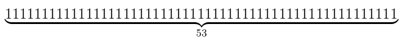
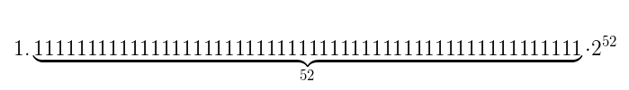
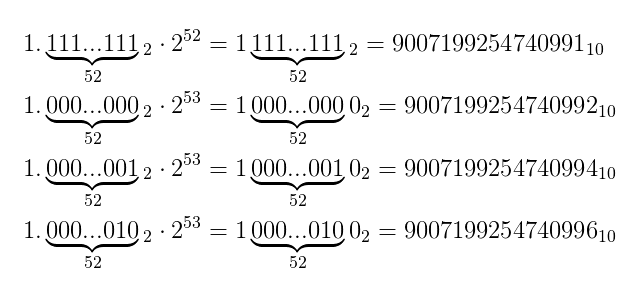
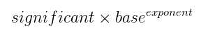
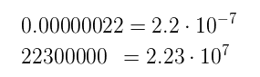
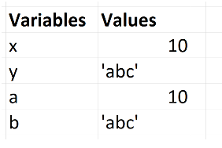

# 类型

## 内置类型
1. 内置类型包括6种基本类型（undefined，Null，Boolean，Number，String，symbol（ES6新增））与复杂类型（object）
2. 所有值都是上述6种类型之一
3. function、array为object的子类型
4. 不能给基本类型的值添加属性，尽管这样不会导致任何错误

## 类型检测

### typeof
1. 检测给定变量的数据类型，typeof是操作符，不是函数

2. 主要用于区别不同基本数据类型，进行与Object的区别

3. typeof 基本类型，除了null（显示object）都显示正确，typeof 对象，除了函数都显示为object

4. 从技术角度看，函数在ECMAScript中是对象，不是一种数据类型(虽然返回是function);

    ```javascript
    typeof function(){} ==="function"  // true
    ```

5. null的特殊情况

    - 逻辑角度看，null值表示的是一个空对象指针，所以typeof会返回Object

    - 最初js使用32位系统，为了性能考虑使用低位存储了变量的类型信息，`000` 开头代表是对象，然而 `null` 表示为全零，所以将它错误的判断为 `object` 

    - 这是一个bug，虽然js内部机制不同了，但标准无法修复，因为涉及web页面太多

    	```typeof null ===“object"  // true```

    - 正确检测null值

    	```javascript
    	(！a && typeof a === "object")//true检测是null
    	```

### instanceof

#### 概述

1. 对象是否是特定类型的实例 

	```javascript
	function Animal(){}
	var a = new Animal()
	a instanceof Animal // true
	```

2. 基本类型并没有继承链，故`3 instanceof Number // false`

#### constructor判断

1. 也可以使用constructor，`a.constructor === Animal // true`

2. 但constructor存在两个问题

	- 不能遍历prototype链

		```javascript
		function Cat(){}
		Cat.prototype = new Animal
		Cat.prototype.constructor = Cat
		var felix = new Cat
		felix instanceof Cat // true
		felix instanceof Animal // true
		felix.constructor === Cat // true
		felix.constructor === Animal // false
		```

	- 如对象为null或undefined，会报错

		```javascript
		felix = null
		felix instanceof Animal // true
		felix.constructor === Animal // throws TypeError
		```

#### instanceof的跨window问题

1. 当您尝试测试来自另一个窗口的对象时，会出现问题

	```javascript
	var iframe = document.createElement('iframe')
	document.body.appendChild(iframe)
	var iWindow = iframe.contentWindow 
	iWindow.document.write('<script>var arr = [1, 2, 3]</script>')
	iWindow.arr // [1, 2, 3]
	iWindow.arr instanceof Array // false
	```

2. 注意：iframe中的Array与外面window的Array不是相同的array，需要`iWindow.arr instanceof iWindow.Array // true`

#### 鸭子类型

1. 由于typeof与instanceof都有各自的缺陷，有点类似补丁的意思，例如jQuery这样判断是否为window对象：

	```javascript
	isWindow: function( obj ) {
	    return obj && typeof obj === "object" && "setInterval" in obj;
	}
	```

2. 但这种方式可能有很多种方式，并不能达成统一

#### Object.prototype.toString

1. 所有 typeof 返回值为 "object" 的对象都包含一个内部属性 [[Class]]

2. 这个属性无法直接访问，需要Object.prototype.toString(..) 来查看，如

	```javascript
	Object.prototype.toString.call( [1,2,3] );// "[object Array]"
	Object.prototype.toString.call( null );// "[object Null]"
	Object.prototype.toString.call( undefined );// "[object Undefined]"
	Object.prototype.toString.call( "abc" );//[Object String]
	```

	- 注意：对于基本类型值，会自动包装，因此基本类型的包装类型具有[[Class]]属性


## Undefined类型
1. 只有一个值：undefined，这个字面量主要用于比较
2. 对未初始化和未声明的变量执行typeof都返回undefined值
3. 非严格模式下，可以为全局标识符 undefined 赋值
4. ~~可以声明一个名为undefined的局部变量~~，不要这么做

### void运算符
1. 让表达式不返回表达式值，因此会返回undefined
2. void 0、 void 1 和 undefined 之间并没有实质上的区别

## Null类型
1. 只有一个值：null
2. 逻辑角度看，null值表示的是一个空对象指针，所以typeof会返回Object
3. 如定义变量准备将来保存对象，最好将该变量初始化为null
4. undefined值派生自null，所以undefined==null

## Boolean类型
1. 两个字面值：true和false
2. Boolean类型的字面量true和false是区别大小写，True和False不是Boolean值，是标识符
3. Boolean()：将一个值转换为其对应的Boolean值
4. false，""（空字符串），0和NaN，null，undefined会转换为false

## Number类型
### 概述
1. 全部是浮点型
2. js没有真正意义的整数，只有没有小数的十进制数
3. 数字值可以用Number对象进行封装(js引擎会做自动装箱)，故数值可直接调用Number的方法
4. （.运算符）会优先识别为数字常量一部分,基本不会如此调用
    ```javascript
    42.toFixed(3)   // 会报错SyntaxError
    42..toFixed(3)  // 42.000
    (42).toFixed(3) // 42.000
    ```

### 进制数
1. ES6开始，严格模式下，不支持045这样的8进制,js引擎会报错
1. E6以前，八进制前置0，如字面值中的数值超出范围，前置0忽略，按10进制解析，如012解析为10，,091解析为91
3. 算数运算时，十六进制和八进制都会转换为十进制
    - 0o123:八进制，已经不允许超过8进制范围了0o91会报错
    - 0b101:二进制
    - 0x123:十六进制

### 较小数值
1. ES6中，Number.EPSILON定义“机器精度”

2. 机器精度主要目的是用来处理数字相等比较的，如下

   ```javascript
   0.1+0.2 ==0.3 // false（后面浮点数问题会介绍）
   Math.abs( n1 - n2 ) < Number.EPSILON; // 可以判断n1与n2相等
   ```
### 数值范围
1. Number.MIN_VALUE：最小值
2. Number.MAX_VALUE：最大值，超过范围会转换为Infinity
3. 如某次运算返回Infinity，则无法再进行计算
4. isFinite()函数：判断是否超范围

#### 最大安全数

1. 整数安全范围
   - Number.MAX_SAFE_INTEGER：ES6，能够被“安全”呈现的最大整数是 2^53 - 1
   - Number.MIN_SAFE_INTEGER：ES6，最小整数
2. js使用双精度浮点数，双精度存储有效数字最多52位，根据浮点数的计算，因此可以**连续**存储最大的数是：由于浮点数存储默认第一位是1，故有效数字位可以存52个1
3. 如想存大于MAX_SAFE_INTEGER值，唯有指数部分增加为53，有效数字部分从000000开始，即表示为：故可以发现指数为53，根本无法表示9007199254740993这个数，故控制台输入9007199254740993其实返回的是9007199254740992，故9007199254740993 === 9007199254740992
4. 因此，最大安全数表示的是，能连续表示数的最大值

### 特殊数值
#### 无穷数(Infinity)
1. 运算结果溢出后，会根据IEEE规范，进行向下或向上取整
2. 二进制表示正无穷1 11111111 000000，符号位正负分别表示正或负无穷，指数部分全为1，有效数部分全为0

#### NaN
1. 用于表示应该返回数值的操作数，但未返回数值的情况（避免抛出错误，如1/0，就不会出错）

2. 任何涉及NaN的操作都是返回NaN

3. NaN与任何值都不相等，包括自己（唯一一个与自己不相等的 **数值**）

4. 二进制表示为0 11111111 1000000000，符号位为0，指数部分都为1，有效数部分为10000

5. isNaN()
    - 判断是否为“不是数值”

    - 方法同样可以判断对象：对象调用时，会先调用对象的valueof()，看返回的能否转换为数值，如果不能，调用toString()方法，再测试返回值

    - 重要bug：

      ```javascript
       var a ="foo"
          isNaN(a)  //true   
      ```

6. ES6使用可靠的工具函数：Number.isNaN()
#### 零值
1. 为什么需要负零：如在一些动画，数字的符号位可能要表示运动方向，当为0时，丢失符号位会导致方向丢失

2. 负零的判断

   ```javascript
   function isNegZero(n) {
       n = Number( n );
       return (n === 0) && (1 / n === -Infinity);
   }
   ```
#### 特殊等式
1. ES6新增工具函数Object.is():判断两个值是否绝对相等
2. 主要是为了解决NaN与自身不等，`+0 === -0` 为true的情况
3. 虽然Object.is()能准确判断，但为了效率能使用==与=== 就不要使用此函数

### 浮点数问题

#### 概述

1. number类型在js中都使用双精度64位二进制格式（IEEE 754）
2. 浮点数由于存储问题，都会造成0.1+0.2 !=0.3，这个是浮点数问题，并不是js问题（2.计算机基础/README.md中有介绍） 
3. 新的js草案（stage 3 20181211），新的数据类型BigInt提出，此类型可以表示任意精度的整数，通过此可以非常安全的操作很大的整数（除了chrome67+，node10.4+，其他基本没实现的）

#### 何为浮点数

1. 数字可以表示为科学计数法的形式，通过科学计数法，数字可以表示为有效数字，基数，指数3个部分
2. 但一个数字基于科学计数法可以表示为多种形式：
3. 科学计数法可以被认为是数字的浮点表示法，浮点含义是，这种表示方法可以移动数字的小数点，小数点可以放在任何位置

#### 如何处理

1. 如必须处理浮点数，最好先round，而不是让引擎转为二进制后再四舍五入
2. 建议将所有内容存储为整数，这个建议表明看起来不错，但实际会有一些问题，如处理金钱，可以将美分直接作为存储单位，而不是用美元；但有些国家货币并不都是十进制的，或者rmb，除了100，还有10，50等
3. 比较好的建议是使用数学库，如[mathjs](https://github.com/josdejong/mathjs)


## string类型
1. 主要特点：字符串是不可变的，对字符串的任何修改都会创建新的不可变的字符串值。 

1. 字符串与字符数组（“abc"与["a","b","c"]）
    - 都有 length 属性、 indexOf(..)、 concat(..)等方法

    - 字符串经常被当成字符数组，但并不一是一回事

    - 可以借用数组方法处理字符串，但字符串反转不可以用，因为字符串是不可变的

      ```javascript
      var obj = "abc";
      var arrObj  = ["a","b","c"];
      arrObj[0] = 1;
      obj[0] = 1;
      console.log(obj);                     // abc
      console.log(arrObj);                  // [1,"b","c"]
      Array.prototype.join.call(obj,"-");   //"a-b-c"
      Array.prototype.reverse.call(arrObj); //["c", "b", 1]
      Array.prototype.reverse.call(obj);    //Uncaught TypeError
      ```

      - 字符串转数组：split()
      - 数组转字符串：join()
## 复杂类型
### 概述
1. 一组数据和功能的集合，如array，function，object都是复杂类型（引用类型或Object类型）
2. object类型分为数组、函数和内置对象，内置对象包括String，Number，Date等，如"hello world"为String类型，能调用indexof方法是因为，js有sring的内置对象，hello world继承自这个内置对象
2. 在ES中，Object类型是所有它的实例的基础，但并不适用于js其他对象，比如dom或bom中的对象

### Object类型
#### 概述

1. Object类型本身不具备多少功能（如只有toString,isPrototypeOf等），但对于在应用程序中存储和传输数据而言，是非常理想的选择
2. 对象中，属性名永远是字符串，非字符串会被转为字符串

#### 创建Object实例的方式

1. new Object()
2. 对象字面量表示法：var person = { name:"tom",age:29}
3. 两者唯一区别是：构造形式需要逐个添加属性

#### 访问属性

1. person.name
2. person["name"]
3. 方括号语法的优点是可通过变量来访问属性
    ```javascript
    var properNmae ="name";
    person[properName]
    ```
      - 属性名中可以包含非字母非数字字符的，也需要用方括号语法来访问
      - 除非必须使用变量访问属性，否则建议使用点表示法

### 对象
#### 概述

1. 面向对象的标志是有类的概念，js没有类的概念，故js对象与其他语言对象有所不同
2. 对象定义：无序属性集合，其属性可以包含基本值、对象或函数

#### 属性描述符

1. 概述
	- 这些特性是js为了实现js引擎，用[[.....]]定义了一些特性，js不能直接访问
	- 包含数据属性和访问器属性
2. 数据属性
	- [[configurable]]：
		- 属性是可配置的，就可用defineProperty修改属性描述符
		- 把 configurable 修改成false 是单向操作， 无法撤销！
		- configurable:false 还会禁止删除这个属性
	- [[Enumerable]]：是否会出现在对象的属性枚举中，能否用for-in循环返回属性
	- [[Writable]]：能否修改属性值
	- [[Value]]：属性的数据值
	- 默认前三个为false
	- ES5可以通过Object.defineProperty()更改属性的默认特性
3. 访问器属性
	- [[configurable]]
	- [[Enumerable]]
	- [[Get]]：读取属性时默认调用
	- [[Set]]
	- 访问器属性不能直接定义，必须使用Object.definetProperty()定义
	- 对象默认的 [[Put]] 和 [[Get]] 操作分别可以控制属性值的设置和获取
	- ```console.log(myObject.a)```，底层实现了了[[Get]操作
4. 获取属性描述符
	- Object.getOwnPropertyDescriptor( myObject, "a" );
5. 配置属性描述符
	- Object.defineProperty( myObject, "a", {} )

#### 对象不变性

1. ES5（下述方法） 所有的方法创建的都是浅不变性，即定义防篡改对象
	- 只会影响目标对象和它的直接属性
	- 对象定义为防篡改后，不能撤销
	- js深不变性很少需要
2. 对象常量
	- 设置writable:false 和 configurable:false
3. 禁止扩展
	- Object.preventExtensions(..)：
	- Object.preventExtensions(persion)
		- 阻止默认行为，不可再添加属性和方法
		- 严格模式下：这个方法之后再添加属性或方法，会抛出错误
		- 非严格模式下：会静默失败，新添加的属性会是undefined
	- Object.isExtensible(persion)：判断person对象是否可以扩展
4. 密封Object.seal(..)
	- 相当于调用Object.preventExtensions(..) 并把所有现有属性标记为 configurable:false
	- 不能删除属性和方法，但属性值是可以改变的
	- Object.isSealed()：判断是否密封对象
5. 冻结Object.freeze(..)
	- 相当于调用Object.seal()并把所有“ 数据访问” 属性标记为 writable:false
	- Object.isFrozen()：判断是否冻结对象
6. 深冻结tip
	- 对象上调用 Object.freeze(..)
	- 遍历它引用的所有对象并在这些对象上调用 Object.freeze(..)
	- 小心不要冻结公共对象

#### Getter和Setter

1. 概述

	- 部分改写默认操作， 但是只能应用在单个属性上(ES5)

	- getter,setter 是隐藏函数， 会在获取属性值/设置参数值时调用

	- 当你给一个属性定义 getter、 setter 或者两者都有时， 这个属性会被定义为“ 访问描述符”

	- 对于访问性描述符，js忽略value和writable特性，只关心set和get

		```javascript
		var obj ={
		    get a(){ // 给a定义一个getter
		        return 2;
		    }
		};
		Object.defineProperty(obj,"b",{
		    get : function () {
		        return this.a * 3;
		    }
		});
		console.log(obj.a); // 2
		console.log(obj.b); // 6
		```

#### 对象存在性

1. 如何判断一个属性值为undefined还是不存在
	- ```("a" in myObject)```;
		- in 操作符：是否在对象及其 [[Prototype]] 原型链中
		- 检查的是某个属性名是否存在
			- 4 in [2, 4, 6] 的结果为false，4表示的属性名，数组只有属性名0,1,2
	- myObject.hasOwnProperty( "a" );
		- 是否在 myObject 对象中， 不会检查 [[Prototype]] 链
2. 区别是否可枚举
	- for-in
		- 最好只用于对象
		- 用于数组，会返回数值索引和可枚举属性
	- myObject.propertyIsEnumerable( "a" );
		- 是否直接存在于对象中（ 而不是在原型链上） 并且满足 enumerable:true
	- Object.keys( myObject );
		- 包含所有可枚举属性
	- Object.getOwnPropertyNames( myObject );
		- 包含所有属性， 无论它们是否可枚举

#### 对象复制

1. 概述

	- Javascript中的对象只是对内存中的位置的引用。

	- 这些引用是可变的，即它们可以被重新分配。

	- 因此，简单地复制一个引用只导致两个引用指向内存中的相同位置

		```javascript
		var foo = {
		    a : "abc"
		}
		console.log(foo.a); // abc
		var bar = foo;
		console.log(bar.a); // abc
		```

2. 浅复制

	- 如果对象中的值都是简单值，可以用ES6提供Object.assign()或`...`进行浅复制

		- Object.assign()内部使用=操作符来赋值，不能复制对象特性（如writable）

			```javascript
			var obj = { foo: "foo", bar: "bar" };
			var copy1 = { ...obj }; // Object { foo: "foo", bar: "bar" }
			var copy2 = Object.assign({}, obj); // Object { foo: "foo", bar: "bar" }
			```

3. 深复制

	- JSON.parse( JSON.stringify( someObj ) );

		- 此方法只能用于someObj包含序列化值类型，并且没有任何循环引用

		- 需要someObj是JSON安全对象（json双向解析对象是一模一样的）

		- 如date这不是序列化值类型，即通过JSON.parse得到的是String类型，而不是Date类型

			```javascript
			const a = new Date();
			const b = JSON.parse(JSON.stringify(a));
			Object.prototype.toString.call(a);// "[object Date]"
			Object.prototype.toString.call(b);// "[object String]"
			```

	- 通过 history API

		- `history.pushState() `和`history.replaceState()`会针对第一个参数构建结构化克隆

			```javascript
			let aaa = {a:1,b:{c:'cc'}}
			const oldState = history.state;
			history.replaceState(obj, null);
			const clonedObj = history.state;
			history.replaceState(oldState, null);
			aaa.b.c = '1111'
			clonedObj.b.c = 'cc'
			```

4. node（ 8.0.0 ）深复制

	- 利用serialization api

		```javascript
		const v8 = require('v8');
		const buf = v8.serialize({a: 'foo', b: new Date()});
		const cloned = v8.deserialize(buf);
		```

	- 对于其他情况，小于8.0，可以使用loash的cloneDeep实现

5. 深拷贝demo

	```javascript
	function deepClone(obj) {
	  var copy;
	
	  // Handle the 3 simple types, and null or undefined
	  if (null == obj || "object" != typeof obj) return obj;
	
	  // Handle Date
	  if (obj instanceof Date) {
	    copy = new Date();
	    copy.setTime(obj.getTime());
	    return copy;
	  }
	
	  // Handle Array
	  if (obj instanceof Array) {
	    copy = [];
	    for (var i = 0, len = obj.length; i < len; i++) {
	        copy[i] = deepClone(obj[i]);
	    }
	    return copy;
	  }
	
	  // Handle Function
	  if (obj instanceof Function) {
	    copy = function() {
	      return obj.apply(this, arguments);
	    }
	    return copy;
	  }
	
	  // Handle Object
	  if (obj instanceof Object) {
	      copy = {};
	      for (var attr in obj) {
	          if (obj.hasOwnProperty(attr)) copy[attr] = deepClone(obj[attr]);
	      }
	      return copy;
	  }
	
	  throw new Error("Unable to copy obj as type isn't supported " + obj.constructor.name);
	}
	```

	

1. 
2. 

### 内置对象Array
1. 概述
	- 数组每一项可以保存任何类型的数据
	- 数组大小是可动态调整的
1. 创建数组
	- 方式一：使用Array构造函数
	- 方式二：数组字面量
```javascript
/*方式一*/
new Array()
new Array(20) //长度已知,创建长度为20的数组
new Array("a","b") //可以省略new操作符，结果相同
/*方式二*/
var a = [1,2,3,4]
```
	- 注意：new Array只带一个数字参数的时候，表示的是数组长度
1. 读取和设置数组的值
	- 可以使用length属性，从数组的末尾移除项或向数组添加项
```javascript
var arr =[1,2];
arr[arr.length] = 'rextao'  // [1,2,"rextao"],由于数组最后一项的索引始终是length-1，新项的位置是length
```
	- 数组是对象，只是下标都为整数，也可以为数组设置属性值，但不影响数组长度
```javascript
    var arr =[1,2,3,4];
    arr["5"] = "rextao";	 //"5"并不会作为key，作为arr的属性名，而是被转换为数值，当数字索引对待；对于未赋值元素arr[4]默认为undefined
    console.log(arr.length); // 6
    arr.say = "hello";
    console.log(arr.length); // 6，为arr设置say并不影响数组长度
    arr.sayHello = function () {
        console.log("hello world!")
    };
    arr.sayHello();
    console.log(arr.say);
    console.log(arr)
```

1. 检测数组
	- instanceof操作符（value instanceof Array）：对于一个网页或者全局作用域而言可用，但对于网页包含多个iframe，就会有两个不同的全局执行环境，两个不同版本的Array构造函数，就会出现问题(可查看本文的instantof)
	- Array.isArray()：ES5新增方法，不管在哪个全局执行环境中创建的，都可以确定是否为数组

1. 转换方法
	- toString()：返回数组每个值字符串以逗号分隔拼接的字符串
	- toLocalString()：与toString类似，区别是，每一项调用toLocalString方法拼接字符串
	- valueof()：返回的是数组
	- join()：可传入一个参数作为创建字符串的分隔符；无参数或undefined参数，会默认使用逗号作为分隔符

1. 栈方法
	- push和pop方法，让数组可以表现为栈数据结构（后入先出）
	- push可以接受任何参数,arr.push(1,2,3,4,5,6)，将参数逐个添加到数组尾部

1. 队列方法
    - shift和push方法配合使用
	- unshift和pop方法配合使用，可以模拟反向队列

1. 重排序方法
    - reverse()：反转数组项顺序
    	 sort(values，function(value1,value2){}):可以自定义比较函数;	默认情况下，会调用values数组每一项的tostring方法，然后比较字符串

1. 操作方法
    - concat():
        复制当前数组副本，参数是一个或多个数组，会将参数添加到数组副本的后面
    - slice():
        slice(1,3)：基于参数获取当前数组的一个新数组
        不会影响原始数组
    - splice():主要用途是向数组中部插入值
     - 删除：
            splice(1,2)：从1开始删，删除2项
     - 插入：
            splice(1,0,'a','b')：从1开始，删除0项，插入a，b
     - 替换：
            splice(1,1,'a','b')：从1开始，删除1项，插入a，b,；插入项不必等于删除项
     - 返回值：
            从原始数组中删除的项，如没有任何删除项，返回空数组

1. 位置方法
    - indexof()和lastIndexof()：使用全等===比较

1. 迭代方法
    - 每个方法接收两个参数：要在每一项运行的函数，运行该函数的作用域对象（影响this值),如num.every(function(数组项的值，该项在数组中的位置，数组对象本身){})
    - num.every(function(item,index,array){ return item>2})：
      - 如每一项返回true，则方法返回true
      - num数组全部大于2，则返回true
    - num.some(function(item,index,array){ return item>2})：
      - 有一项返回true，则方法返回true
      - num数组一项大于2，则返回true
    - num.filter(function(item,index,array){ return item>2})：
      - 用指定函数确定是否返回的数组中包含的某一项
      - 结果是返回num中大于2数，组成的数组
    - num.map(function(item,index,array){ return item*2})：
      - 返回数组，新数组的每一项都是在原始数组中的对应项上运行结果
      - 新数组每一项都乘以2
      - 适用于创建包含的项与另一个数组一一对应的数组
    - num.foreach(function(item,index,array){。。。。})
      - 本质上与使用for循环迭代数组一样

1. 缩小方法
    - 都会迭代数组的所有项，然而构建一个最终返回的值（不是数组）,参数1为callback，参数2为初始值
    - reduce()：从数组第一项开始遍历数组
    - reduceRight()：从数组最后一项开始遍历数组
    - 两个方法的选用，取决于从哪头开始遍历数组

### 内置对象Date
1. 创建日期对象
    - new Date()：
      - 无参数，新创建的对象自动获取当前日期和时间
      - 传入毫秒数，1970年加上毫秒数的日期
      - 不调用new时，即直接写为Date(),返回日期字符串，具体格式未规定
    - Date.parse()
      - es没定义支持哪种日期格式，行为因实现而异
      - 如果传入字符串不能表示日期，返回NaN
    - Date.UTC()：返回表示日期的毫秒数
    - Date.now()： es5支持
      - 表示调用这个方法时的日期和时间的毫秒数
      - es5不支持的情况下，可以使用 **var start = +new Date()**，把Date对象转换为字符串
    - 只有构造形式，没有字面量形式

1. 继承的方法
    - 重写了toLocaleString()，toString()，valueOf()

1. 日期格式化方法
   - toDateString()
   - toTimeString()
   - 等等，将日期格式化为指定格式，格式因浏览器而异

1. 日期处理方法
   - getTime()
   - setTime()
   - 等等

### 内置对象RegExp
1. 创建正则表达式
    - var exp = /pattern/flags：
       - flags：g（全局模式），i（不区分大小写），m（多行模式）
       - 模式中的所有元字符（如\ $^）都必须转义
    - 使用RegExp构造函数：
      - 参数：要匹配的字符串模式
      - 参数：可选的标志字符串
      - 这两个参数都要是字符串（不可把正则字面量传递给RegExp构造函数）

1. 实例属性
    - global：是否设置了g标志
    - ignoreCase：是否设置了i标志
    - source：正则表达式的字符串表示（字面量形式的字符串）
    - 通过这些属性可以获知一个正则表达式的各方面信息，但却没什么用
1. RegExp方法
	- exec()：
       - matches = pattern.exec(text)：返回第一个匹配项信息组，无匹配项返回null
       - matches.index：匹配项在字符串中的位置
       - matches.input：正则表达式的字符串
       - 每次执行只返回一项匹配项，pattern中有无g标记，则每次返回第一个匹配项
    - test()：判断模式和参数是否匹配，返回true或false

1. 模式的局限性
    有些正则的高级用法并不支持

### Function类型
1. 概述
    - 函数实际上是对象，每个函数是Function类型的实例，函数名实际是指向函数对象的指针
    - 函数是可调用对象
1. 没有重载
    - 将函数名理解为指针，有助于理解ES没有重载的概念
1. 函数声明与函数表达式
   - 解析器会先读取函数声明，并使其在执行任何代码之前可用
   - 函数表达式，必须等到解析器执行到它所在的代码行，才会被解析到
1. 作为值的函数
    - ES中函数名本身是变量，所以函数也可作为值来使用
    - 可以像传递参数一样把一个函数传递给另一个函数
1. 函数内部属性
    - arguments对象
       - 保存函数的参数
       - arguments.calle（因为潜在安全性，被移除）：指针，指向拥有这个arguments对象的函数： 主要用于阶乘
    - this对象：this引用的是函数的执行环境对象
    - caller：函数对象的属性，调用当前函数的函数的引用
    - arguments对象使用Array.prototype.slice():转化为数组
1. 函数的属性和方法
   - length：函数希望接收的命名参数的个数，函数定义时的命名参数个数
   - prototype属性
       - prototype是保存所有实例方法的真正所在
       - 属性是不可枚举的，无法用for-in发现
   - apply()与call()
       - apply()
           - 在特定作用域上调用函数，实际是设置函数体内this对象的值
           - 两个参数：一个是运行函数作用域，另一个是参数数组
       - call()
           - 与apply主要区别是，第一个参数是运行函数作用域，其余参数是直接传递给函数的参数
       - 两者主要区别：看给函数传递参数的方式
       - 两者主要作用：扩充函数的运行作用域
   - bind()
       - ES5定义的方法
       - 创建一个函数的实例，其this值会被绑定到传给bind()函数的值
   - toString()
       - 返回函数的代码，不同浏览器可能存在差异

### 包装类型
1. 概述
	- 每当读取一个基本类型值的时候，后台会创建一个对应的基本包装类型的对象
	- 自动创建的包装类型的对象，只存在于一行代码执行瞬间，然后立即销毁，不能在运行时为基本类型值添加属性和方法
	- 最好不要自己创建包装，js引擎对此进行了优化，让js引擎自己选择何时封装或拆封对象
	- 使用valueof函数可以进行拆包
1. Boolean类型
    ```javascript
    var a = true;
    var b = new Boolean(true);
    console.log(typeof a);		//boolean
    console.log(typeof b);		//object
    console.log(a instanceof Boolean); //false
    console.log(b instanceof Boolean); //true
    ```
1. Number类型
   - num.toFixed()：显示几位小数
   - num.toExponential()：指数形式显示
   - num.toPrecision()：选择某个数值的最合适格式显示
   - 注意：这几个函数返回值是string类型，用+时是拼接字符串
1. String类型
   - length属性：字符串有多少字符
   - 字符方法
     - charAt()：返回指定位置字符
     - charCodeAt()：返回指定位置的ASCii编码字符
     - ES5：stringValue[1]，可以使用方括号加数字索引来访问字符串中特定字符
   - 字符串操作
     - concat()：字符串拼接，一般用+
     - slice(),substr(),substring()：获取子字符串，对原始字符串无影响
   - 字符串位置
     - indexof(),lastIndexof()
   - trim():ES5
   - 字符串匹配
     - text.match(pattern)与pattern.exec(text)类似
     - text.search(pattern)
        - 返回第一个匹配项的索引
     - text.replace()
        - 参数：RegExp对象或一个字符串
        - 参数：字符串（可以使用特殊的字符序列，将正则结果插入到结果集中）或函数
     - text.split()
        - 按照指定分隔符分割字符串，可以传入正则

### Math对象
- 提供的计算功能执行要快

## Global对象
1. 概述
	- 所有全局作用域中的属性和函数，都是Global对象的属性
1. window对象
    - ES没有指出如何直接访问Global对象，但web浏览器都会将这个全局对象作为window对象的一部分加以实现
1. URI编码
    - encodeURI()：只编码空格
    - encodeURIComponent()：所有非标准字符都编码
1. eval()方法
    - 像一个完整的ES解析器，参数为要执行的ES字符串
    - 要谨慎使用，尤其是涉及用户输入时，避免用户的代码注入

## 类型与值
### 概述
1. JavaScript 中的变量是没有类型的，只有值才有
2. 其实是变量可以随时持有任何类型的值，即JavaScript是弱类型，一个变量携带的变量类型可以随时改变
3. 对变量执行typeof操作时，得到的结果并不是该变量的类型，而是该变量持有的值的类型

### undefined 和 undeclared
1. b为未声明，但浏览器报错是is not defined，这与undefined不一样，相当于是undeclared

   ```javascript
   var a;
   a; // undefined
   b; // ReferenceError: b is not defined
   ```

2. typeof b，返回也是undefined，对于未声明变量，typeof有安全机制，故返回也是undefined，通过这个机制可以判断内建api或变量是否存在

   ```javascript
   if(typeof at ===“undefined”）
   ```
## 值类型和引用类型

### 概述

1. 基本类型（`Boolean`, `null`, `undefined`, `String`, `Number`， `symbol`）使用值传递的方式
2. Object对象（array，function，Object）使用引用方式传值
3. 我们无法自行决定使用值复制还是引用复制，一切由值的类型来决定

### 值类型

1. 基本类型值传递，即是在内存中又开辟一块新内存，存储新值，改变之前的值，新值不会改变

   ```javascript
   var x = 10;
   var y = 'abc';
   var a = x;
   var b = y;
   ```

2. 内存空间可以表示为，当接下来`x=123`时，a的值并不会改变

### 引用类型

1. 通过引用方式来赋值 / 传递：会改变原值，可以理解为传递的实际是引用地址

2. 因此，有时候想`let a = ['1'];b = a`实际目的是想复制对象a，故需要使用对象复制的方法，看此文《对象复制小结》

3. `===`用于object比较的是地址，因此`console.log([10] === [10])`返回false，两个数组的地址是不一致的

4. 引用指向的是值本身而非变量，所以一个引用无法更改另一个引用的指向

    ```javascript
    function foo(x) {
        x.push(4);
        console.log(x); // [1,2,3,4]
        x =[4,5,6];
        x.push(7);
        console.log(x); // [4,5,6,7]
    }
    var a = [1,2,3];
    foo(a);
    ```

    - 当调用foo(a)时，传递的是a的副本，a还是指向[1,2,3]
        - x=[4,5,6]并不影响a的指向

###  传递值给函数

1. 基本类型按照值传递，

	```javascript
	var myName = "Carlos";
	function myNameIs(aName){
	  aName = "Carla";
	}
	myNameIs(myName);
	console.log(myName); // "Carlos"
	```

2. 对象按照引用传递

	```javascript
	var myName = {};
	function myNameIs(aName){
	  aName.firstName = "Carla";
	}
	myNameIs(myName);
	console.log(myName); // Object {firstName: "Carla"}
	```

3. 考虑如下例子，注意与2的区别：

	```javascript
	var myName = {
	  firstName: "Carla"
	};
	function myNameIs(aName){
	  aName = {
	    nickName: "Carlita"
	  };
	}
	myNameIs(myName);
	console.log(myName); // Object {firstName: "Carla"}
	```

	- 函数内部并不能改变myName的引用
	- 函数内的aName分配了一个新的引用，当函数结束，这个内部对象会被抛弃

	

### 复杂例子

1. 举例说明：

   ```javascript
   var people = [
       { name: 'John Hill', age: 22 },
       { name: 'Jack Chill', age: 27 }
   ]; 
   var getInitials = function( name ) {
       return `hello!${name}`;
   } 
   var increaseAge = function( person ) {
       person.age += 1;
   } 
    
   // Part 1: getInitials
   console.log( getInitials( people[0].name ) ); // hello!John Hill
   console.log( people[0].name );// John Hill
    
   // Part 2: increaseAge
   increaseAge( people[1] );
   console.log( people[1].age );// 28
   
   ```
   - getInitials传入的`people[0].name`实际是String类型，虽然people是数组，但传递的并不是people，故是值传递；
   - increaseAge实际是传递的对象，引用传递，外面的person.age也会随之改变

2. 总之，一定要注意值传递与引用传递

## 垃圾收集
1. 标记清除
    - 会为进入环境和离开环境的变量打上标记
    - 可以使用任何方式来标记变量，如通过翻转某个特殊位来记录何时进入环境
1. 引用计数（不常见）
    -  跟踪记录每个值被引用的次数
    - IE一部分对象并不是原生js对象，是使用c++以COM对象的形式实现的，COM对象的垃圾回收机制采用的是引用计数
        - 会导致循环引用的问题，垃圾回收器永远不会回收变量
        - 解决办法：手工断开，将引用设为null
    - IE9中的BOM和DOM都转换成真正的js对象  
_ _ _
# 操作符与语句
## 操作符
### 一元操作符
1. \++，\--
	- 注意分清前置与后置的区别
	- 应用不同类型值，遵循不同规则，如a++，a为false值，会将a转换为0后加1
1. +，-
    - 对非数值应用，会像Number()一样对数值转换
    - 负号将转换的数值变为负数，规则与+号相同

### 位操作符
1. 按内存中表示的数值的位来操作数值
1. ES会帮我们隐藏信息，如-8用二进制输出时，不会出现实际内存的32位，而是-1000
1. 对NaN和Infinity值位操作，会当0处理
1. 对非数值应用这个操作符，会用Number()函数，将其转换为数值
1. 左移（<<）:不影响符号位
1. 有符号右移（>>）：符号位填充空位
1. 无符号右移（>>>）：0填充空位
	- 由于负数以其绝对值的二进制补码表示，会导致右移结果非常大

### 布尔操作符
1. 逻辑非（！）
    - 将任何数据类型返回一个布尔值，但是原值取反返回
    - ！！相当于模拟了Boolean()函数的行为
1. 逻辑或（||）
    - 可以避免为变量赋null或undefined

### 乘性操作符
1. *，/，%
 - 利用类型转换规则，会将非数值进行自动转换后再运算

### 加性操作符
1. +号
	- 如操作数有字符串遵循的规则
	- 如两个都是字符串，拼接
	- 如一个是字符串，将另一个操作数转换为字符串，拼接
1. 忽略加法中的数据类型是ES常见错误之一


### 关系操作符
1. 如两个是字符串，比较的是两个字符串对应位置的字符编码值
1. 对于两个数字字符串，同样是比较字符编码值
1. 比较结果返回true或false
1. 任何值与NaN比较都是false

```javascript
2 > NaN   //false;
2 < NaN   //false
```

### 相等操作符
1. null == undefined ---------true，它们是相似值
1. null === undefined ---------false，它们是不同类型的值

### 条件操作符
1. 同java的三目运算

### 赋值运算符
1. +=这样的复合操作符是简化操作，但不能提升性能

### 逗号操作符
1. 在一条语句中执行多个操作
   - 多用于声明多个变量
1. 用于赋值,返回表达式的最后一项，基本不用
```javascript
var num =（5,1,3,0）//num为0
```

## 语句
### 语句与表达式
1. 语句的结果值
    - 获得语句结果值最直接办法是在控制台中输入语句
    - 根据规范var的结果值为undefined，即在浏览器输入```var a =42```返回的是undefined，为何是undefined，从技术角度解释较为复杂（规范有说明）
    - 代码块的结果值就如同一个隐式的返回，即返回最后一个语句的结果值
        - 但目前语法不允许a = if(true){b= 4;}//浏览器中返回4
        - ES7，有个do{}语法提案，用来解决上述问题

### 自动分号
1. Js 会自动为代码行补上缺失的分号，即自动分号插入(ASI)
1. ASI 只在换行符处起作用，而不会在代码行的中间插入分号
1. ASI 的目的在于提高解析器的容错性

### for-in语句
1. 一种精准的迭代语句，用于枚举对象的属性
1. 因为ES的对象没有顺序，所以循环输出的属性名顺序不可测
1. 如迭代对象的变量值为null或undefined会报错，ES5修复了这个bug，为了兼容，应先检测对象不包含null和undefined

### with语句
1. 将代码作用域设置到一个特定对象中
1. 定义这个语句的目的：简化多次编写同一个对象的工作
1. 大量使用会导致性能下降

### switch语句
1. 特点
    - 可以使用任何数据类型
    - case的值不一定是常量，可以是变量或者是表达式
1. 使用的是全等操作符，因此不会发生类型转换


