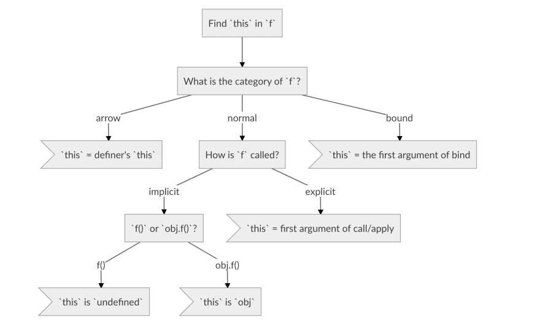

# this全面解析
## 关于this
1. 为什么使用this
    - "this"关键字允许您在调用函数或方法时决定哪个对象应该是焦点对象
    - 可以在不同上下文或对象上重用函数
1. this概述
    - this的运行期绑定，与函数声明位置无关，取决于函数的调用方式
    - this既不指向自身，也不指向词法作用域
1. this是什么
   - 函数调用时会创建上下文
   - this是上下文的一个属性

## 绑定规则
### 默认绑定
1. this绑定到全局对象上，严格模式下，this绑定到undefined
1. 独立函数调用会采用默认绑定
    - 注意二者细微差别：foo函数内部使用严格模式，后者是调用域使用严格模式，前者this绑定到undefined上，后者绑定到全局上
    - 代码中不要混合使用严格与非严格模式，如第三方是严格模式，要小心
    - 扩展：利用this可以查看当前代码是否为严格模式，看返回是全局对象还是undefined
        ```javascript
        function foo(){
            "use strict"
            console.log(this);
        }
        foo();//undefined
        ```
        ```javascript
        function foo(){
            console.log(this);
        }
        (function(){
            "use strict"
            foo();//window
        })()
        ```

### 隐式绑定

#### 概述

1. 调用位置是否有上下文对象，或是否被某个对象拥有或包含

2. 大概80%的情况是这样

3. 小窍门：函数调用时，如左侧有点（.），则点左侧的对象是this引用的对象

	- 基于此，下面介绍的隐式丢失，其实可以理解为不是隐式绑定

	 

#### 正常情况

1. 对于foo，无论是在obj中声明还是先定义后引用，函数严格来说不属于obj对象

2. 可以看做是obj调用foo函数，foo会隐式使用obj上下文，同时this绑定到obj上

    ```javascript
    function foo(){
        console.log(this.a);
    }
    var obj={
        a: 2,
        foo : foo
    };
    obj.foo(); //2
    ```

    - 对象属性引用链中最后一层会影响调用位置
    - 但如obj2中无a属性，则会返回undefined，而不会再引用obj1上下文

3. ```javascript
     function foo(){
         console.log(this.a);
     }
     var obj2={
         a: 42,
         foo : foo
     };
     var obj1={
         a : 2,
         obj2 : obj2
     };
     obj1.obj2.foo(); //42
     ```

     

#### 隐式丢失

1. 函数别名

    ```javascript
    function foo(){
        console.log(this.a);
    }
    var obj={
        a: 42,
        foo : foo
    };
    var bar = obj.foo;//函数别名
    var a = "hello world";//a是全局属性
    bar(); //"hello world"
    ```
    - `var bar  = obj.foo；`实际引用的是foo函数本身
    - 因此bar()调用时，是一个不带任何修饰的函数调用

2.  参数传递
    ```javascript
    function foo(){
        console.log(this.a);
    }
    function doFoo(fn) {
        // fn其实引用的是foo
        fn();// <---调用位置
    }
    var obj = {
        a : 2,
        foo : foo
    };
    var a = "hello world";//a是全局属性
    doFoo(obj.foo); //"hello world"
    ```
    - doFoo调用时，有一个隐式赋值，fn = obj.foo
    - 和上述一样，fn获得foo函数引用，与obj无关
    - 类似的将函数传入内置函数,如setTimeout(fn)，因为内置函数也会有fn()调用，会造成this绑定丢失

### 显式绑定

1. 应用call或apply，强制把函数的this绑定到某个对象上

	
#### 普通绑定

1. 如obj是一个原始值，会自动“装箱”为对象形式

    ```javascript
    function foo(){
        console.log(this.a);
    }
    var obj = {
        a : 2
    };
    foo.call(obj); //2
    ```

    
#### call绑定

1. call方法：允许指定在什么上下文环境调用函数。

2. func.call(params1,params2,params3....)：params要绑定的this，后面的params会依次传入func；如第一参数不传入，会绑定在全局对象上

    ```javascript
    function foo(){
        console.log(this.a);
    }
    var obj = {
        a : 2
    };
    var bar = function () {
        foo.call(obj);
    };
    var a = "hello world";
    bar();//2
    setTimeout(bar ,100);// 2
    bar.call(window);//硬绑定的bar不能再修改它的this
    ```
    - 相当于创建一个函数bar，手动绑定到obj上，调用bar就绑定到bar上
    - 这种模式，不能再改变bar的绑定对象

3. 

#### apply绑定

1. 与call绑定主要区别是：传入的参数是数组，而不是一个个参数

#### bind绑定

1. 与call类似，但bind绑定返回的是新函数，而不像call直接将函数调用

2. 可以这样理解：`a.call(obj)` 等价于 `a.bind(obj)()`

3. bind提供了两次传入参数的机会

	```javascript
	// 方式1
	const newObj = func.bind(obj,1,2,3,4);
	newObj();
	// 方式2
	const newObj = func.bind(obj);
	newObj(1,2,3,4);
	```

4. 保存了this的上下文环境，便于之后使用

	```javascript
	const obj = {
	    name = 'ha',
	    showName(){
	        const p = function(){
	            console.log(this.name)
	        }.bind(this);
	        setTimeout(p)
	    }
	}
	```

	

### new绑定
1. js的构造函数
    - 只是使用new操作符时被调用的函数
    - 只是被new操作符调用的普通函数而已
    - 包括内置对象在内的所有函数都可以使用new调用
        - 实际上并不存在所谓的”构造函数“，只是对函数进行”构造调用“罢了
1. new调用会执行下面操作
    - 创建一个全新对象
    - 会被执行[[原型]]连接
    - 会绑定到函数调用this
    - 未返回其他对象，会返回这个新对象

### 词法绑定（箭头函数）

1. ES6的箭头函数，涉及this绑定时的行为与普通函数的行为不一致，它放弃了普通this绑定规则，用当前词法作用域覆盖this本来值
2. 根据外层作用域来确定this

    ```javascript
    function foo() {
        return (a) => {
            //this 继承foo()
            console.log(this.a)
        }
    }
    var obj1 = {
        a: 2
    },
        obj2 = {
            a: 3
        };
    var bar = foo.call(obj1);
    bar.call(obj2); //2 不是3！！！
    ```

    - 由于foo的this被绑定到obj1，箭头函数即bar的this绑定到obj1上
    - 箭头函数绑定无法修改，new也不能修改

1. 箭头函数用词法作用域取代传统的this机制

    ```javascript
    function foo() {
        var self = this;
        setTimeout(function () {
            console.log(self.a)
        },1000);
    }
    var obj1 = {
        a: 2
    };
    foo.call(obj1); //2
    ```

    - 利用self=this，其实就是为了利用词法作用域取代this机制，ES6主要通过箭头函数代替这样机制

### 绑定规则汇总图

1. 找到this，查看this的调用方式，如是显式绑定、则直接看绑定的对象，如是箭头函数，则this为箭头函数外面的this；然后再查看函数调用方式




## 优先级
1. 为何new中使用硬绑定
    - 预先设置一些参数，这样在使用new初始化时，可传入其他参数
        ```javascript
        function foo(p1,p2){
            this.value = p1+'...'+p2;
        }
        var bar = foo.bind(null,'hello');
        var baz = new bar('rextao');
        console.log(baz.value); // hello...rextao
        ```

1. 优先级
    - new绑定，this绑定创建的新对象
        - var bar = new Foo();
    - 硬绑定
        - 绑定的指定的对象
    - 函数在某个上下文对象调用
        - this绑定这个上下文对象
    - 默认绑定

##　绑定例外
1. 被忽略的this
	- 如把null或undefined作为绑定对象传入call等，这些值被忽略，实际应用默认绑定
    - 何时需要传入null为参数
        - 使用apply展开数组
        - 使用bind对参数进行柯里化（预先设置一些参数）
    - 如不关心this绑定，仍需要一个占位符，null并不是最好选择
        - ES6可以使用...（三个点）
    - 传入null还存在一个问题
        - 如第三方库确实使用了this，传入null，会使this应用默认绑定规则
    - 解决办法，可以创建一个空对象，将this限制在空对象中
        - Object.create(null)
        - 上述方法比{}更空，不会创建Object.prototype委托
1. 间接引用
    - 调用这个函数会应用默认绑定规则
        ```javascript
        function foo(){
            console.log(this.a)
        }
        var a = 2;
        var obj = {
            a : 3,
            foo : foo
        };
        var p ={
            a : 4
        };
        obj.foo(); //3
        (p.foo = obj.foo)() ; //2
        ```
        - 赋值表达式p.foo = o.foo返回值是目标函数的引用
        - 调用位置是foo()
1. 软绑定

    - 为默认绑定指定一个全局对象和undefined以外的值


