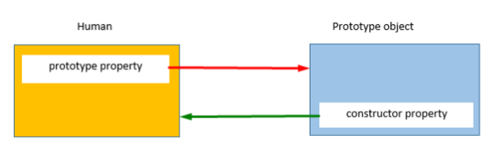
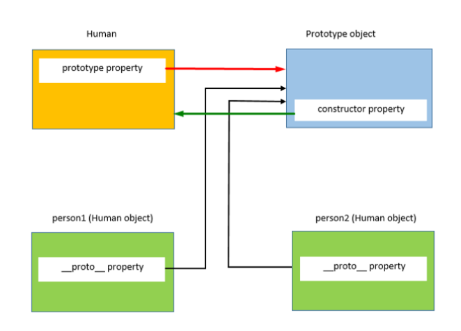
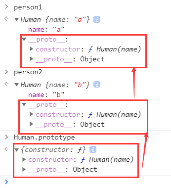
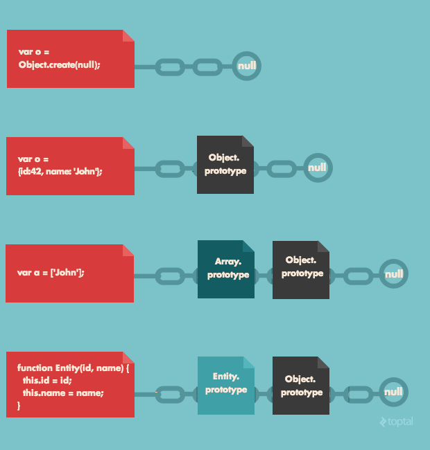
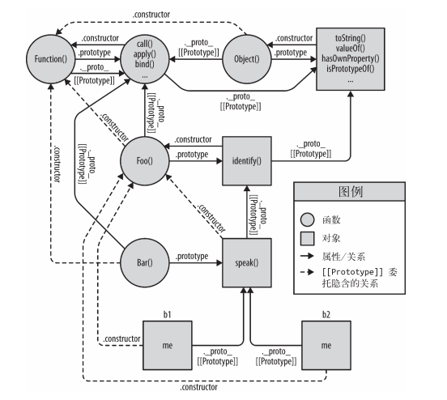
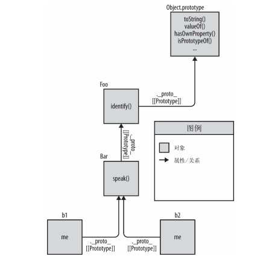

# 构造函数与new

## 概述

1. 构造函数在技术上是常规函数。
2. 不过有两个约定：
	- 他们首先用大写字母命名
	- 它们只能用 `"new"` 操作符来执行。
3. 构造函数的主要目的：实现可重用的对象创建代码；这种方式比每次使用字面量创建对象要短得多，而且易于阅读。

## new 操作符

1. 当使用new操作符时，会发生如下事情

      - 创建一个空对象
      - 绑定this到这个新对象
      - 添加一个`__proto__`属性（非标准属性），并指向function.prototype；换种理解方式是实例对象的[[Prototype]] 链接到函数的prototype上，即`a1.[[Prototype]]=A.prototype`这样实例可以访问函数的共享部分
      - 函数结尾会`return this`

2. 举例说明

      ```javascript
      function Foo(name, age) {
        this.name = name;
        this.age = age;
      }
      var b = new Foo('John', 26);
      console.log(Foo.prototype.constructor === Foo);// true
      console.log(b.constructor === Foo); //true
      ```

      - 实例构建过程
      	- 构建一个b新对象
      	- this绑定到新对象，即任何引用this的地方指向b
      	- 添加属性`__proto__`，得到`b.__proto__ === Foo.prototype// true`相当于构建了[[Prototype]]链
      	- 构造的b对象，会返回给`var b`这个b变量
      - 函数的prototype.constructor指向原函数本身（不是函数名）
      - 虽然b对象无属性constructor，但可以沿Prototype链向上查找

3. 换句话说，`new Student`做了类似的事情

      ```javascript
      function Student(name, age) {
        // this = {} （隐藏创建）
        this.name = name;
        this.age = age;
        // return this （隐藏创建）
      }
      ```

4. 如忘了在构造函数前使用new，会出现问题，this会绑定到window对象上

      ```javascript
      function Foo(name, age) {
        this.name = name;
        this.age = age;
      }
      var a = Foo('rex',1);
      console.log(window.name,window.age);// rex
      console.log(a instanceof Foo);//  1
      ```


## new.target

1. 在一个函数内部，我们可以使用 `new.target` 属性来检查它是用 `new` 还是不用它来调用。

2. ```javascript
     function User() {
     console.log(new.target);
      }
      // 不带 new：
      User(); // undefined
      // 带 new：
      new User(); // function User { ... }
     ```


3. 利用`new.target`避免非new调用（某些库常用做法）

      ```javascript
      function User(name) {
        if (!new.target) { // 如果你没有运行 new
          return new User(name); // ...会为你添加 new
        }
        this.name = name;
      }
      let john = User("John"); // 重新调用 new User
      ```

      - 同样可以利用`if (!(this instanceof Book)) `实现相同效果

# `__proto__`

## 字面量的`__proto__`

1. 对于字面量形式的对象，数组，可以认为底层调用了new Object 、new Array()

2. 因此，字面量的`__proto__`指向对应的类型，如

      ```javascript
      var obj = {};
      var arr = [];
      function fn() {}
      console.log(obj.__proto__ === Object.prototype); // -> true
      console.log(arr.__proto__ === Array.prototype); // -> true
      console.log(fn.__proto__ === Function.prototype); // -> true
      ```

## 与[[Prototype]]链的关系

1. 可以理解为是原型链的外在表现形式，可以通过查看`__proto__`来查看一个对象的原型链
2. 但此属性不应该用于开发中


# prototype

## 概述

1. 当创建一个函数时，js引擎会为函数增加一个名为 prototype 的公有并且不可枚举的属性（称为prototype 对象），prototype对象上有一个constructor属性（指回创建的函数），但其他对象中并没有prototype这个属性

	

2. 上面这句话用代码可以理解为：

	```javascript
	function Foo() {}
	var b = new Foo();
	console.log(Object.getPrototypeOf(b) === Foo.prototype);// true
	console.log(Foo.hasOwnProperty("prototype")); //true
	```

3. `__proto__`：是每个对象都具有的属性

4. 因此，函数即具有`__proto__`又具有prototype

## 原生原型

### 概述

1. js有9个内置的原生构造函数：`Object()`, `Array()`, `String()`, `Number()`, `Boolean()`, `Date()`, `Function()`, `Error()` ,`RegExp()`，这些对象包含其对应子类型所特有的行为特征
2. null没有原型，Object.prototype（虽然是个对象）但原型链指向null

### 将原型作为默认值

1. 了解即可，因为ES6提供了配置新的默认值方式

2. Function.prototype 是一个空函数

3. RegExp.prototype 是一个“空”的正则表达式（无任何匹配）

4. Array.prototype 是一个空数组

	```javascript
	function foo(vals, fn, rx) {
	vals = vals || Array.prototype;
	fn = fn || Function.prototype;
	rx = rx || RegExp.prototype;
	}
	```

5. 利用Array.prototype而非[]进行默认赋值的优缺点

	- 优点：prototype已被创建并且仅创建一次，每次调用函数不会多次创建，减少内存和cpu消耗
	- 缺点：如Array.prototype默认值改变，会发生错误，但一般Array.prototype不随意改变

### 不要扩展原生方法

1. 在扩展原生方法时需要加入判断条件
2. 这样并不一定百分百安全，比如push，开始自定义可能只是用于push一个参数，但是标准则可以push多个，会造成错误
3. shim/polyfill
	- 能有效地为不符合最新规范的老版本浏览器填补缺失的功能
	- 但是无法填补新的语法
	- 利用ES6-Shim或ES5-Shim可以填充新API，需要利用Traceur等工具才能实现新旧语法转换


## 模拟类行为

1. 普通实例与prototype直接的关系

      ```javascript
      function Human(name){
          this.name = name
      }
      var person1 = new Human('a')
      var person2 = new Human('b')
      ```

      

      - Human红线，表示Human.prototype就是右边的prototype对象

      - person1与person2 为Human的实例

      - 根据结果也很容易看出实际上`person1.__proto__`、`person2.__proto__`指向的是Human.prototype

        

2. 模拟类的行为

    ```javascript
    function Foo(name) {
    this.name = name;
    }
    Foo.prototype.myName = function () {
    return this.name;
    };
    var a = new Foo('hello');
    var b = new Foo('world');
    console.log(a.myName()); // hello
    console.log(b.myName()); // world
    ```

    - new Foo会创建一个对象，分别赋给a，b，根据this默认指向，会为a，b创建一个name属性
    - 在创建的过程中， a 和 b 的内部 [[Prototype]] 都会关联到 Foo.prototype 上
    - 当 a和 b 中无法找到 myName 时， 它会（ 通过委托） 在 Foo.prototype 上找到。
    - 不要使用.constructor作为Foo的引用,因为Foo.prototype.constructor并不总指向Foo

## 覆写父类方法

1. 覆写父类的方法同时，还想在子类方法中调用父类方法

	```javascript
	function Animal() {}
	Animal.prototype.hi = function () {
	    console.log(`this is Animal ${this.name}`)
	};
	function Dog(name) {
	    this.name = name
	}
	Dog.prototype = Object.create(Animal.prototype);
	let dog = new Dog('foo');
	Dog.prototype.hi = function() {
	    Animal.prototype.hi();// this is Animal undefined
	    console.log('wowowowowowow')
	};
	dog.hi()
	```

	- 由于想调用父级Animal的方法hi，需要使用类似上述方式，但上述调用this会指向Animal对象
	- 故需要改为`Animal.prototype.hi.call(this)`

## 改变函数的prototype或constructor

1. ```javascript
     function Foo() {}
       // 原本应该为Foo
       Foo.prototype.constructor = "haha";
       var a = new Foo();
       console.log(a.constructor === "haha");// true
       console.log(a.constructor === Foo); //false
       Foo.prototype = {};
       var b = new Foo();
       console.log(b.constructor === Foo);// false
       console.log(b.constructor === Object); //true
     ```

    - b实例本身并没有 `constructor` 属性，会委托 [[Prototype]] 链上的 `Foo.prototype ` 
    - `Foo.prototype`也没有这个属性，会委托给委托链顶端的 Object.prototype，这个对象有.constructor属性，故指向Object函数
    - 上述方式重写Foo.prototype.constructor是不对的，这个属性要是不可枚举的，需要使用Object.defineProperty来定义

2. 在prototype上定义属性值要`Foo.prototype.a =1;Foo.prototype.b =2`；千万不可以`Foo.prototype={a:1,b:2}`，这相当直接打破了原型链


## 注意

1. 通常在构造函数中定义所有实例对象属性，在原型中定义所有共享属性和方法


# [[Prototype]]
## 概述
1. [[Prototype]]是内部连接属性

1. 几乎所有的对象在创建时 [[Prototype]] 属性都会被赋予一个非空的值（可以为空，但很少见）

1. 主要解决属性查找，即当进行属性查找时，当前对象无此属性，会查找[[Prototype]]链

1. 如图，介绍了各种情况下[[Prototype]]链上的情况

	

## Object.prototype
1. 所有普通的 [[Prototype]] 链最终都会指向内置的 Object.prototype
1. 普通对象，指的是不是特定扩展的（如自己弄个空对象，自己扩展）

## 属性设置与屏蔽

1. `obj.foo = "bar"`的过程
    - obj有foo，[[Prototype]]无foo：设置obj中foo值
    - obj有foo，[[Prototype]]有foo：设置obj中foo值
    - obj无foo，[[Prototype]]无foo：为obj创建一个foo属性，并设值
    - obj无foo，[[Prototype]]有foo
        - [[Prototype]]的foo未标记为只读(writable:false)；
            - obj创建foo，并屏蔽上层链所以foo属性
        - [[Prototype]]的foo标记为只读(writable:true)；
            - obj不创建foo，不屏蔽上层链所以foo属性
            - 严格模式下：报错
            - 非严格模式：忽略赋值
        - [[Prototype]]的foo是一个setter
            - obj不创建foo，也不会重新定义这个setter
        - 使用Object.defineProperty(..)可以屏蔽上层属性
        - 因此，此种情况赋值，并不一定会屏蔽prototype链上的值
1. 注意如下情况
    ```javascript
    var original = {
        a:2
    };
    var obj = Object.create( original );
    console.log(original.a); // 2
    console.log(obj.a); // 2
    console.log(original.hasOwnProperty( "a" )); // true
    console.log(obj.hasOwnProperty( "a" )); // false,a属性不是obj的直接属性
    obj.a++; // 隐式屏蔽！
    console.log(original.a); // 2
    console.log(obj.a); // 3
    console.log(obj.hasOwnProperty( "a" )); // true
    ```
  
      - ++操作符相当于，`obj.a = obj.a + 1`;故右边obj.a会先查找prototype链，然后+1后，赋给obj新建的属性a值，屏蔽了original.a


## Object.create

1. 手动设置一个对象的prototype，提供了新的方式设置原型链

2. Object.create(proto, [propertiesObject])

      - 新创建对象的原型对象
      - 是要添加到新创建对象的可枚举属性（自身属性，而不是原型链上），这个参数类似于`Object.defineProerties（）`的第二个参数

3. 返回新对象，新对象的`__proto__`为传入参数（关键点）

      ```javascript
      var prototypeObj = {
          testValue: 'Hello!'
      };
      var obj = Object.create(prototypeObj);
      console.log(obj); // -> {}
      console.log(obj.__proto__ === prototypeObj); // -> true
      console.log(obj.testValue); // -> 'Hello!'
      ```


4. 使用`propertiesObject`参数

      ```javascript
      function Foo() {}
      let oo = Object.create(Foo.prototype, {
          a: {
              value: 1
          },
          b: {
              writable: true,
              configurable: true,
              value: 'hello'
          }
      })
      ```
      - 不配置a的属性描述符，默认是不可写，不可枚举，不可配置的

5. 综上，创建对象和生成原型链可以使用`Object.create()`、`new`操作符、或ES6的`class`语法糖

6. Object.create(null)

      - 创建空[[prototype]]链接的对象
      - 因为原型链是空，故instance任何对象都为false
      - 因为不受原型链影响，非常适合数据存储

7. 注意：与`new`关键字构造新对象的不同，`Object.create`并未执行构造函数的代码

      ```javascript
      function Dog(name) {
          console.log('this is Dog');
          this.name = name;
      }
      Dog.prototype.hi = function () {
          console.log(`${this.name} is woowowowow`)
      };
      const d = new Dog('foo');
      const obj = Object.create(Dog.prototype);
      d.hi(); // this is Dog ; foo is woowowowow
      console.log('**************')
      obj.hi();// undefined is woowowowow
      ```

      

      

## 小问题

1. 解释如下现象：

      ```javascript
      Object instanceof Function
      //true
      Object instanceof Object
      //true
      Function instanceof Object
      //true
      Function instanceof Function
      //true
      ```
	- `a instanceof Foo`表示：a在整条 [[Prototype]] 链中是否有指向 Foo.prototype 的对象
	- Object与Function是一个对象，故应由构造函数生成，因此，`Object.__proto__ === Function.prototype// true`，故1,4 为true
	- instanceof查看的是整条原型链，`Function.prototype`在原型链上，`Function.prototype`为对象，故有`Function.prototype.__proto__ === Object.prototype//true`

# 原型继承

## 概述

1. OO语言一般支持两种继承：接口继承和实现继承
2. js函数没有签名，故支持实现继承，依靠原型链来实现的
3. 继承实现的本质就是重写原型对象

## 代码说明

### 基本情况

1. ```javascript
     function Foo(name) {
      this.name = name;
       }
       Foo.prototype.myName = function() {
      console.log(this.name);
       };
       function Bar(name,label) {
      Foo.call( this, name );
      this.label = label;
       }
       Bar.prototype.myLabel = function() {
      console.log(this.label);
       };
       var a = new Bar( "a", "obj a" );
       a.myName(); // 报错，Uncaught TypeError: a.myName is not a function
       a.myLabel(); //
     ```
2. a是Bar实例，当调用a.myName()时，会在Bar和Bar.prototype寻找此函数，找不到报错；

3. Bar函数中的Foo.call只是调用了Foo函数，并不是将Bar与Foo建立原型链联系

建立联系方式1

1. ```javascript
     function Foo(name) {
         this.name = name;
     }
     Foo.prototype.myName = function() {
         console.log(this.name);
     };
     function Bar(name,label) {
         Foo.call( this, name );
         this.label = label;
     }
     //建立Foo与Bar的联系
     Bar.prototype = Foo.prototype;
     Bar.prototype.myLabel = function() {
         console.log(this.label);
     };
     var a = new Bar( "a", "obj a" );
     a.myName(); // "a"
     a.myLabel(); // "obj a"
     console.log(Foo.prototype.myLabel); // function () {console.log(this.label);}
     ```
     - 主要问题是Bar.prototype直接引用Foo.prototype，二者会指向相同内容
     - 故当为Bar.prototype添加属性或方法时，实际Foo.prototype也会添加

### 建立联系方式2
1. ```javascript
     function Foo(name) {
         this.name = name;
     }
     Foo.prototype.myName = function() {
         console.log(this.name);
     };
     function Bar(name,label) {
         Foo.call( this, name );
         this.label = label;
     }
     //*********************
     Bar.prototype = new Foo();
     Bar.prototype.myLabel = function() {
         console.log(this.label);
     };
     var a = new Bar( "a", "obj a" );
     a.myName(); // "a"
     a.myLabel(); // "obj a"
     ```
      - 通过new创建联系，会有一些副作用， 如果函数 Foo 有一些（ 比如写日志、 修改状态、 注册到其他对象、 给 this 添加数据属性， 等等） 的话， 就会影响到 Bar() 的“ 后代”， 后果不堪设想


### 最合适的联系方式

1. ```javascript
      function Foo(name) {
          this.name = name;
      }
      Foo.prototype.myName = function() {
          console.log(this.name);
      };
      function Bar(name,label) {
          Foo.call( this, name );
          this.label = label;
      }
      //*********************
      Bar.prototype = Object.create(Foo.prototype);
      Bar.prototype.constructor = Bar;// 1
      Bar.prototype.myLabel = function() {
          console.log(this.label);
      };
      var a = new Bar( "a", "obj a" );
      a.myName(); // "a"
      a.myLabel(); // "obj a"
      ```
        - 要创建一个合适的关联对象， 必须使用 Object.create(..)
        - 代码1处要注意：此时Bar.prototype对象本身并没有constructor属性（Object.keys()可以查看当前对象可枚举属性），故当调用`Bar.prototype.constructor`会往上找原型链，找到Foo.prototype.constructor；
        - 但利用`Bar.prototype.constructor`也不完全正确，解见：[改变函数的prototype或constructor](#改变函数的prototype或constructor)


## 修改对象的 [[Prototype]] 关联

1. ES6 之前
	- 设置 .__proto__ 属性来实现：不是标准方法，并不完全兼容
	- ```Bar.ptototype = Object.create( Foo.prototype )```;
		- 让Bar抛弃默认的Bar.prototype
2. ES6
	- Object.setPrototypeOf( Bar.prototype, Foo.prototype );


## 检查“类”关系

1. `a instanceof Foo`

    - 在 a 的整条 [[Prototype]] 链中是否有指向 Foo.prototype 的对象

    - 只能处理对象（ a） 和函数（ 带 .prototype 引用的 Foo） 之间的关系，不能处理两个对象之间关系

    - 另一个理解是：检查a的继承链[[Prototype]]与Foo.prototype的关系

      ```javascript
      function foo() {}
      const bar = { a: 'a'};
      foo.prototype = bar;
      // bar是普通对象，原型链直接链在Object.prototype
      console.log(bar instanceof foo); // false
      const baz = Object.create(bar);
      // baz.__proto__ === bar
      // foo.prototype === bar
      // baz的原型链与foo.prototype具有关系
      console.log(baz instanceof foo); // true
      ```

2. b.isPrototypeOf( c );

    - b 是否出现在 c 的 [[Prototype]] 链中？

    - Object.create()构造的新对象，用instanceof无法检测

      ```javascript
      function Foo(){}
      const obj = Object.create(Foo);
      obj.__proto__ === Foo;//true
      obj instanceof Foo;// false
      Foo.isPrototypeOf(obj);// true
      ```

3. `a.__proto__`

    - 通过  _proto_属性来获取[[prototype]]链
    - 不是标准，不推荐使用

4. Object.getPrototypeOf( a );

    - 获取一个对象的 [[Prototype]] 链
    - `Object.getPrototypeOf( a ) === a.__proto__//true`


# 行为委托
## 面向委托的设计
1. 类理论
    - 创建基类，写共有方法和属性
    - 子类重写
    - 创建实例，复制类行为
1. 委托理论
    - 可以任意方向委托关联，不像类与子类，只能是垂直方向
    - 调试:js并未控制浏览器开发者工具对特定值或结构的表示方式,如
        ```javascript
        function Foo() {}
        var a1 = new Foo();
        a1; // Foo {}
        ```
        - chrome
            - 输出：Foo {}
            - Chrome 实际上想说的是“ {} 是一个空对象， 由名为 Foo 的函数构造”
            - Chrome 内部跟踪（ 只用于调试输出）“ 构造函数名称”
        - Firfox
            - 输出：Object {}
            - Firefox 想说的是“ {}是一个空对象， 由 Object 构造”

## 比较思维模型
1. 面向对象风格
    ```javascript
    function Foo(who) {
        this.me = who;
    }
    Foo.prototype.identify = function() {
        return "I am " + this.me;
    };
    function Bar(who) {
        Foo.call( this, who );
    }
    Bar.prototype = Object.create( Foo.prototype );
    Bar.prototype.speak = function() {
        console.log( "Hello, " + this.identify() + "." );
    };
    var b1 = new Bar( "b1" );
    var b2 = new Bar( "b2" );
    b1.speak();
    b2.speak();
    ```


    - 考虑思维图，因为Foo和Bar都是函数，必定隐含链接到Function.prototype
    - 函数又是Object，链接到Object.prototype
    - 虽然有些是不必要的，但去除后，依然很复杂
1. 面向委托风格
    ```javascript
    Foo = {
        init: function(who) {
            this.me = who;
        },
        identify: function() {
            return "I am " + this.me;
        }
    };
    Bar = Object.create( Foo );
    Bar.speak = function() {
        console.log( "Hello, " + this.identify() + "." );
    };
    var b1 = Object.create( Bar );
    b1.init( "b1" );
    var b2 = Object.create( Bar );
    b2.init( "b2" );
    b1.speak();
    b2.speak();    
    ```


    - 这种代码只关注一件事： 对象之间的关联关系。
    - 需要那些既复杂又令人困惑的模仿类的行为（ 构造函数、 原型以及 new）。

## 类与对象
1. 通过学习，可以创建如UI控件，不用任何“类”辅助库或语法的情况下
1. 可以使用ES6的class，但这个也是根据[[Prototype]]机制实现的，只是精简了语法
1. 利用委托关系创建，即主要不使用prototype
