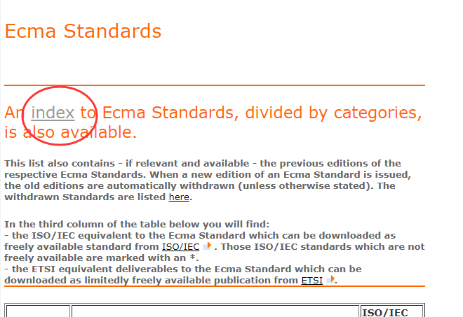
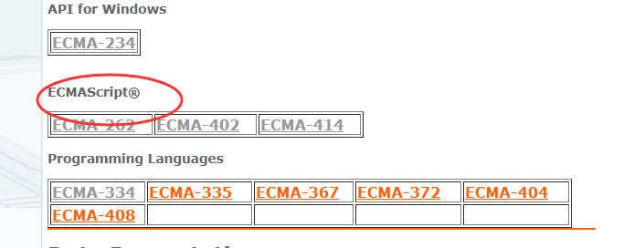
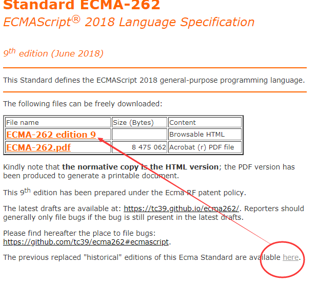

# 概述

1. 《1.es6支持的项目》
	- 包含可以运行es6的简易项目

# 书目

1. [《33-js-concepts》](https://github.com/leonardomso/33-js-concepts#13-dom-and-layout-trees)
2. [《Exploring ES6》](http://exploringjs.com/es6/index.html#toc_ch_modules)
  - Modules

# 参考

## 如何查最新官方ES标准

1. http://www.ecma-international.org/publications/standards/Standard.htm

2. 利用此进行分类查看，因为协会并不只制定ECMAScript标准

	

3. 

4. 主页显示是最新的ES版本，可以查看历史版本，找到ES6

	