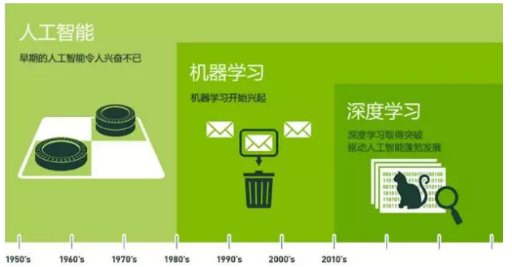

# 概述

1. 1956年，几个计算机科学家相聚在达特茅斯会议，提出了“人工智能”的概念

2. 人工智能、机器学习、深度学习主要的关系：

	

# 人工智能

## 概述

1. 2015年以来，人工智能开始大爆发。很大一部分是由于GPU的广泛应用，使得并行计算变得更快、更便宜、更有效。当然，无限拓展的存储能力和骤然爆发的数据洪流（大数据）的组合拳，也使得图像数据、文本数据、交易数据、映射数据全面海量爆发。
2. 人工智能研究的各个分支，包括专家系统、机器学习、进化计算、模糊逻辑、计算机视觉、自然语言处理、推荐系统等。
3. 人工智能分为：
	- 弱人工智能：让机器具备观察和感知的能力，可以做到一定程度的理解和推理，例如：Pinterest上的图像分类；或者Facebook的人脸识别。
	- 强人工智能：让机器获得自适应能力，解决一些之前没有遇到过的问题
	- 目前主要研究在弱人工智能方向，强人工智能很难在现实实现（多为电影描述的）
4. “智能”又从何而来呢？这主要归功于一种实现人工智能的方法——机器学习

# 机器学习

## 概述

1. 一种实现人工智能的方法
2. 机器学习就是设计一个算法模型来处理数据，输出我们想要的结果，我们可以针对算法模型进行不断的调优，形成更准确的数据处理能力。但这种学习不会让机器产生意识

# 深度学习

## 概述

1. 人工神经网络是一种拟人数据处理模式。它是深度学习的基础，深度学习是一种使用深度神经网络进行大量数据构建的系统