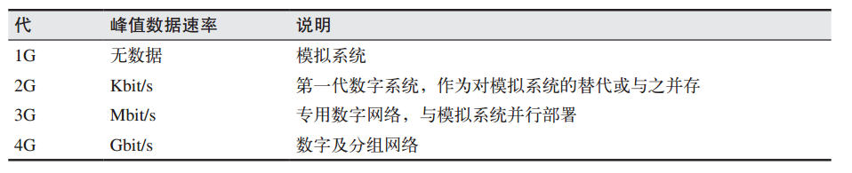
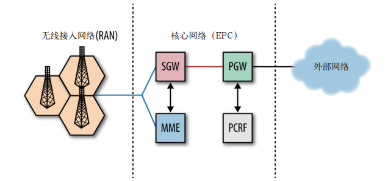
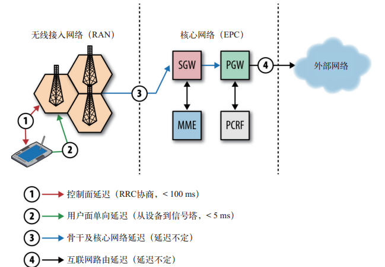
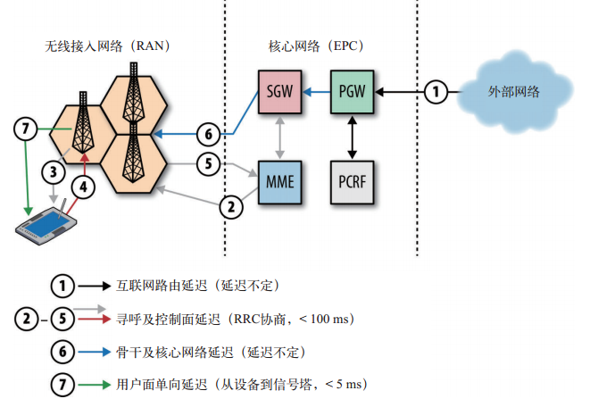

# 概述

## 书目

1. 20181204《Web性能权威指南》

## 涵盖内容

1. TCP、UDP、LTS、HTTP等协议概述

# 第一章  延迟与带宽

## 1.1　速度是关键  

1. 所有网络通信都有决定性影响的两个方面：延迟和带宽  

## 1.2　延迟的构成  

1. 任何系统都有很多因素可能影响传送消息 的时间。  
2. 传播延迟：消息从发送端到接收端需要的时间，一般传输速速不会超过光速，故传输延迟与距离有关
3. 传输延迟：把消息中的所有比特转移到链路中需要的时间，把消息转移到链路上，与距离无关，假设有一个 10 MB 的文件，分别通一个 1 Mbit/s，另一个 100 Mbit/s 传输，在 1 Mbit/s 的链路上，需要花10 s，而在 100 Mbit/s 的链路上，只需 0.1 s 
4. 处理延迟：处理分组首部、检查位错误及确定分组目标所需的时间 ，虽然是硬件处理，而且非常快，但也是需要有延迟的
5. 排队延迟：如果分组到达的速度超过了路由器的 处理能力，那么分组就要在入站缓冲区排队  

## 1.3　光速与传播延迟  

1.  光纤在纽约与旧金山（16000km）传输一个来回约160ms，如计算涉及寻路、处理、排队和传输延迟，大约在 200~300 ms 之间
2. 研究表明：在软件交互中，哪怕 100~ 200 ms 左右的延迟，我们中的大多数人就会感觉到“拖拉”；如果超过了 300 ms 的 门槛，那就会说“反应迟钝”；  因此，要给用户最佳体验，应用最好在几百ms之内响应
3. question：如北京直接连接纽约服务器（15000km），响应应该也有200ms，怎么降低到10几毫秒？？？？？？？
4. CDN（ Content Delivery Network，内容分发网络）：通过把内容部署在全球各地，让用户从最近的服务器加载内容， 大幅降低传播分组的时间。通过改变传输距离，降低延迟

## 1.5　网络核心的带宽  

1. 光纤就是一根“光导管”，比人的头发稍微粗一点  
2. 到 2010 年初，研究人员已经可以在每个信道中耦合 400 多种波长的光线，最大容量可达 171 Gbit/s，而一条光纤的总带宽能够达到 70 Tbit/s  
3. 每条光缆会封装几条光纤（常见的是 4 条） 

## 1.7　目标： 高带宽和低延迟  

1. 虽然不一定很便宜，但我们有很 多方法可以提高容量 ，比如部署更多光纤，提高WDM（波分复用）技术等，相对而言还是可以提高的
2. 降低延迟则要困难得多 ，传播速度提供困难（发明更好的传输材料，降低损耗），缩短距离（如现在铺设的光纤，由于地形、政治等原因并不是最短的）

# 第二章 TCP的构成

## 2.0 　概述

1. 因特网有两个核心协议： IP 和 TCP。 
	- IP，即 Internet Protocol（因特网协议），负责联网主机之间的路由选择和寻址； 
	- TCP，即 Transmission Control Protocol（传输 控制协议），负责在不可靠的传输信道之上提供可靠的抽象层，向应用层隐藏了大多数网络 通信的复杂细节，比如丢包重发、按序发送、拥塞控制及避免、数据完整，等等  。 
	- TCP/IP 也常被称为 “因特网协议套件”（ Internet Protocol Suite）  
2. TCP 数据流可以确保发送的所有字节能够完整地被接收到，而且到达客户端的顺序也一样。TCP 专门为精确传送做了优化，但并未过多顾及时间 。
3. HTTP 标准并未规定 TCP 就是唯一的传输协议 ，可以使用任意协议发送http消息
4. 理解 TCP 的某些核心机制就成为了优化 Web 体验的必修课。虽然我们一般不会直接使用TCP 套接口，但应用层的一些决定可能会对 TCP 以及底层网络的性能产生极大影响。
5. IPv4 中的 4 表示 TCP/IP 协议的第 4 个版本，发布于 1981 年 9 月  

## 2.1　三次握手  

1. 所有 TCP 连接一开始都要经过三次握手 
2. 理解三次握手
	- 进行1次握手：A向B发送信息，但并不知道B是否收到信息
	- 进行2次握手：B接到A信息后，告诉A已经收到信息，但并不知道A是否收到B信息
	- 进行3次握手：A收到B的信息后，就知道B是可以收到信息的，即可以通信了
3. 三次握手带来的延迟使得每创建一个新 TCP 连接都要付出很大代价。而这也决定了提高 TCP 应用性能的关键，在于想办法重用连接。  

## 2.2　拥塞预防及控制  

### 2.2.0　概述

1. 路由接收信息如果超过自身处理速度，会出现延迟；
2. 当系统出现轻度拥塞时，路由的队列中有大量的数据排队等待路由
3. 系统严重拥塞时，路由接收数据超过路由容量时，路由只有丢掉接收数据
4. 由于TCP采用超时重传机制，如拥塞不加以控制，会出现死循环，使整个网路瘫痪，这种现象称为拥塞崩溃

### 2.2.1　流量控制  

1. 概述：流量控制就是相互交流自己的接收能力，避免发送端发送过多数据
2. 流量控制是一种预防发送端过多向接收端发送数据的机制。否则，接收端可能因为忙碌、负载重或缓冲区既定而无法处理
3. 为实现流量控制， TCP 连接的每一方都要通告自己的接收窗口（ rwnd），如果其中一端跟不上数据传输，那它可以向发送端通告一个较小的窗口
4. 发送rwnd贯穿TCP的整个生命周期，以便动态调整两端数据速率
5. 如果你的服务器或客户端的连接不能 完全利用现有带宽，那往往该先查一查窗口大小  

### 2.2.2　慢启动  

1. 主要解决充分利用带宽问题，连接建立之初，并不知道各自带宽是多少
2. 比如，看视频时，视频网站提供最高速的下载，但家人突然下载个软件包，视频网站需要调整下载速度，否则会使数据在网关堆积，降低网络效率，因此根据网络状况动态改变速度是有利的
3. 慢启动理解：开始两端并不知道带宽，开始先发送个小的包数据，然后逐渐增大发送数据量，达到带宽最大利用率
4. 用拥塞窗口大小（cwnd）有几个TCP段表示开始发送包大小，一个TCP段约1460字节，最大可设置为10段，即最开始发送数据包最多为10*1460字节=14.26KB
5. 把服务器的初始 cwnd 值增大到 RFC 6928 新规定的10 段（IW10），是提升用户体验以及所有 TCP 应用性能的最简单方式。
6.  慢启动对小文件文件传输非常不利

### 2.2.3　拥塞预防  

1. 拥塞预防算法把丢包作为网络拥塞的标志，即路径中某个连接或路由器已经拥堵了， 以至于必须采取删包措施。因此，必须调整窗口大小，以避免造成更多的包丢失， 从而保证网络畅通。 
2. 如果你看到过 TCP 连接的吞吐量跟踪曲线，发现该曲线呈锯齿状，这是拥塞控制和预防算法在调整拥塞窗口，进而消除网络中的丢包问题  

## 2.4　窗口机制

1. TCP协议里窗口机制有2种：一种是固定的窗口大小；一种是滑动的窗口。 
2. 固定窗口的问题：

  - 
  - 假设窗口的大小是1，也是就每次只能发送一个数据只有接受方对这个数据进行确认了以后才能发送第2个数据
  - 如窗口过小，传输较大数据，会导致需要等待接收方ack，造成延迟
  - 如窗口过大，但接收数据窗口过小，会导致链路拥塞
3. 滑动窗口
	- 
	- 假设开始发送窗口是3，发送3个数据，ack为2，知道接收方只能接受2个数据，第三个数据没有收到，故从第三个数据再发送
	- 当链路变好了或者变差了这个窗口还会发生变化

## 2.3　带宽延迟积  

1. 数据链路的容量与其端到端延迟的乘积。这个结果就是任意时刻处于在途未确认状态的最大数据量。  
2. 无论发送端发送的数据还是接收端接收的数据超过了未确认的最大数据量，都必须停下来等待另一方 ACK 确认某些分组才能继续。
3. 意味着，如果rwnd与cwnd为16KB时，往返时间100ms，TCP连接速率不会超过1.31Mbit/s(16\*1024\*8/0.1s/(10^6))
4. 因为，如高于这个速率传输，接收窗口会出现拥塞，如想提高传输速率，需要等待接收方返回ACK后才可以
5. 结论：如在高速连接的客户端与服务器之间，实际传输速度只有可用带宽的几分之一，那窗口大小很可能就是罪魁祸首。  

## 2.4　队首阻塞  

1. 由于TCP是可靠传输，如中途有一个分组丢失，接收端需要缓存其他分组，然后等待丢失分组重发；对于应用层的结果就是必须等分组全部到达后才可以访问数据；这种现象叫TCP队首阻塞
2. 这个问题对于应用程序而言，会造成分组到达时间会存在无法预知的延迟变化。这个时间变化通常被称为抖动 
3. 但某些应用不需要可靠交付或按顺序交付，如每个分组都是独立信息，或者每个消息都会覆盖前面的消息，这些情况TCP不支持了

## 2.5　针对TCP的优化建议  

### 2.5.1　服务器配置调优  

1. TCP 的最佳实践以及影响其性能的底层算法一直在与时俱进，而且大多数变化都只在最新内核中才有实现  
2. 让你的服务器跟上时代是优化发送端 和接收端 TCP 栈的首要措施 （虽然可能升级风险很大，某些服务根据特定内核开发）
3. 调优 TCP 性能可以让服务器和客户端之间达到最大吞吐量和最小延迟 
4. 主要是：
	- 增大TCP的初试拥塞窗口，增大第一次传输数据量
	- 连接空闲时禁用慢启动，改善瞬间发送数据的长TCP连接的性能
	- 等

### 2.5.2　应用程序行为调优  

1. 重用 TCP 连接是提升性能的关键  
2. 减少不必要的数据传输也是很大的优化，如通过压缩算法把发送数据降到最低等

### 2.5.3　总结

1. 把服务器内核升级到最新版本
2. 确保 cwnd 大小为 10；
3. 禁用空闲后的慢启动； 
4. 确保启动窗口缩放； 
5. 减少传输冗余数据；
6.  压缩要传输的数据；
7. 把服务器放到离用户近的地方以减少往返时间；
8. 尽最大可能重用已经建立的 TCP 连接  

# 第三章 UDP构成

## 3.0 　概述

1. TCP使用分组，UDP使用数据报
	- 分组可以用来指代任何格式化的数据块；
	- 数据报则通常只用来描述那些通过不可靠的服务传输的分组，既不保证送达，也不发送失败通知  
2. WebRTC（ Web Real-Time Communication， Web 实时通信），着眼于在浏览器中通过 UDP 实现原生的语音和视频实时通信，以及其他形式的 P2P（ Peer-to-Peer， 端到端）通信。  
3. UDP，Unreliable Datagram Protocol  （u本来是user，但很多时候理解为Unreliable），称之为不可靠数据报协议

## 3.1　无协议服务  

1. IP层主要任务就是按照地址从源主机向目标主机发送数据报 ，这个数据报暗示，IP层并不保证消息可靠交付，将底层网络的不可靠性暴露给上层，让上层去解决
2. UDP协议用自己的分组结构封装用户信息，只增加了4个字段（源端口、目标端口、分组长度和校验和），校验和IP分组也有，因此，所有错误检测和错误纠正工作都委托给上层的应用程序。  
3. UDP 仅仅是在 IP 层之上通过嵌入应用程序的 源端口和目标端口，提供了一个“应用程序多路复用”机制  

## 3.2 UDP与网络地址转换器  

1. 由于IPv4地址只有32位长，最多提供42.9亿个唯一IP地址
2. 为解决地址要耗尽的问题，IP 网络地址转换器（ NAT， Network Address Translator） 规范出台了
3. 这样NAT设备后的IP地址空间可以在各种不同网络重用
4. 为了防止路由错误，IANA（ Internet Assigned Numbers Authority， 因特网号码分配机构） 为私有网络保留了三段IP地址，即不允许外网计算机分配这些地址
	- 10.0.0.0~10.255.255.255      16 777 216个  
	- 172.16.0.0~172.31.255.255    1 048 576  个
	- 192.168.0.0~192.168.255.255   65 536  个

### 3.2.1　连接状态超时  

1. 主要为了解决，不可以预测的连接状态（UDP）
2. NAT 转换的问题（至少对于 UDP 而言）在于必须维护一份精确的路由表才能保证 数据转发。  
3. TCP有状态，从握手到关闭连接，路由设备可以监控连接状态，创建和删除NAT路由表的条目，但UDP没有状态
4. UDP并不报告何时停止传输数据，因此，UDP路由记录会定时过去，至于时间是多少，会根据不同设备有不同
5. 对于较长时间的 UDP 通信，有一个事实上的最佳做 法，即引入一个双向 keep-alive 分组，周期性地重置传输路径上所有 NAT 设备中转换记录的计时器。  

### 3.2.2 NAT分类

1. 从实现技术角度，可以将NAT分为
	- 全锥NAT（Full Cone NAT）： 把所有来自相同内部 IP 地址和端口的请求映射到相同的外部 IP 地址和端口；任何一个外部主机均可通过该映射发送数据包到该内部主机。 
	- 限制性锥 NAT：与（1）的主要区别是，只有当内部主机先给外部主机发送数据包, 该外部主机才能向该内部主机发送数据包 
	- 端口限制性锥 NAT：与（2）的主要区别是，需要先抢外部主机+端口号发送数据包
	- 对称NAT：与上3个都不同，在与外部主机通信时，会分配不同的端口号

### 3.2.2 NAT穿透  

1. 要让处于 NAT 设备之后的拥有私有 IP 地址的主机之间建立 P2P 连接，就必须想办法穿透 NAT 
2. 如下图，ClientA-1要直接与ClientB-1进行p2p通信
3. 如ClientA-1看到ClientB-1在线，需要与B进行交流
4. 全锥NAT不需要任何辅助手段，但限制性NAT是不允许内部主机直接通信的，所以果现在 ClientA-1 直接发送 UDP 数据包到 ClientB-1 ，那么数据包将会被 NAT-B 无情的丢弃 
5. 解决办法：

  - ClientA-1发送数据包给 Server ，请求和 ClientB-1 通信。
  - Server 将 ClientA-1 的地址和端口发送给 ClientB-1 ，告诉 ClientB-1，ClientA-1 想和它通信。 
  -  ClientB-1 向 ClientA-1发送 UDP 数据包，当然这个包在到达 NAT-A 的时候，还是会被丢弃，这并不是关键的，因为发送这个 UDP 包只是为了让 NAT-B 记住这次通信的目的地址：端口号，当下次以这个地址和端口为源的数据到达的时候就不会被 NAT-B 丢弃，这样就在 NAT-B 上打了一个从 ClientB-1 到 ClientA-1 的孔。 
  - 为了让 ClientA-1 知道什么时候才可以向 ClientB-1 发送数据，之后还要向 Server 发送一个消息，告诉 Server 它已经准备好了。 
  - Server 发送一个消息给 ClientA-1 ，内容为：ClientB-1 已经准备好了，你可以向 ClientB-1 发送消息了。
  - ClientA-1 向 ClientB-1 发送 UDP 数据包。这个数据包不会被 NAT-B 丢弃，以后 ClientB-1 向 ClientA-1 发送的数据包也不会被 ClientA-1 丢弃，因为 NAT-A 已经知道是 ClientA-1 首先发起的通信。

## 3.3　针对UDP的优化建议  

1. UDP 是一个简单常用的协议，经常用于引导其他传输协议，是面向消息的最简单的传输层协议
2. UDP应用程序必须自己实现诸如，连接状态、拥塞预防、流量控制等机制，需要好好研究下RFC 5405这个文档
3. WebRTC 就是符合RFC 5405要求的框架  

# 第四章 传输层安全（ **TLS**）  

## 4.0 　概述

1. SSL（ Secure Sockets Layer，安全套接字层）协议最初是网景公司为了保障网上交易安全而开发的，该协议通过加密来保护客户个人资料，通过认证和完整性检查来 确保交易安全。  
2. SSL 协议在直接位于 TCP 上一层的应用层被实现  
3. 
4. 后来SSL被标准化改名：Transport Layer Security （ TLS，传输层安全）。  严格来讲它们并不相 同，因为它们指代的协议版本不同  
5. TLS设计初衷是在TCP上使用的，UDP上的实现是DTLS，以TLS为基础
6. TLS提供三项基本服务：加密、身份验证和数据完整性 

## 4.2　TLS握手  

1. 握手机制中设计最巧妙的地方，就是其使用的公钥密码系统 （也称“非对称密钥加密”）  
2. TLS在TCP之上运行，故需要等TCP三次握手后进行
3. 主要步骤（往返一次28ms）：
  - 0ms：TCP三次握手，即一个完整往返；
  - 56ms：客户端发送TLS版本，加密套件列表，支持的TLS选项等
  - 84ms：服务器从加密套件中选一个，附上自己的证书
  - 112ms：客户端生成一个新的对称密钥，用服务器给的公钥加密发给服务器，这之前的数据都是明文
  - 140ms：服务器解密，验证信息的MAC检测信息完整性，给客户端发送加密的finished信息
  - 168ms：客户端用之前生成的对称密钥解密，验证MAC，一切顺利，则可以加密通信

### 4.2.1   　应用层协议协商（ ALPN）  

1. 理论上，网络上的任意两端都可以使用自定义的协议进行通信。为此，需要提前确定使用什么协议、指定端口号（ HTTP 是 80， TLS 是 443），并配置所有客户端和服 务器使用它们。  
2. 在实践中，这种方法效率很低且很难做到。因为每个端口都必须得到认可，而防火墙及其他中间设备通常只允许在 80 和 443 端口上通信 
3. 为了简化自定义协议的部署，我们往往必须重用 80 或 443 端口
4. 80端口为HTTP保留，协商协议需要一次额外的往返时间，因此解决办法是使用443端口
5. 应用层协议协商（ ALPN， Application Layer Protocol Negotiation）作为 TLS 扩展，让我们能在 TLS 握手的同时协商应用协议（图 4-2），从而省掉了 HTTP 的 Upgrade 机制所需的额外往返时间。  

### 4.2.2　服务器名称指示（ SNI） 

1. SNI（ Server Name Indication，服务器名称指示）扩展被引入 TLS 协议，该扩展允许客户端在握手之初就指明要连接的主机名。  
2. 主要解决：如果服务器想在一个 IP 地 址为多个站点提供服务，而每个站点都拥有自己的 TLS 证书的问题（类似于相同IP地址服务不同域名）

## 4.3 　TLS会话恢复 

1. TLS握手会带来额外的延迟与计算量，为了挽回某些损失， TLS 提供了恢复功能，即在多个连接间共享协商后的安全密钥。  

### 4.3.1　会话标识符 （会话缓存  ）

1. 服务器与客户端都会保存会话ID和协商后的会话参数，假如客户端和服务器都在缓存中找到共享的会话 ID 参数，就可以进行简短握手
2. 借助会话标识符可以节省一次往返，还可以省掉用于协商共享加密密钥的公钥加密计算。  
3. 主要问题是：服务器需要维护一段会话缓存，如服务器每天有几百万独立连接，内存消耗会很大，但通过一套会话缓存和清除策略并不是无解

### 4.3.2　会话记录单 

1. 为解决上述问题，将所有会话数据保存在客户端
2. 服务器可以在完整 TLS 握手的最后一次交换中添加一条“新会话记录单”（ New Session Ticket）记录，包含只有服务器知道的安全密钥加密过的所有会话数据。
3. 保存在客户端的数据是服务器加密的，故数据也是安全的

## 4.4　信任链与证书颁发机构  

1. 理解如何验证通信两端的身份
	- A,B分别生成自己的公钥和私钥
	- 双方交换公钥（如可以当面交换）并隐藏私钥
	- 发信息使用私钥加密
	- 接收信息使用公钥解密
2. 信任链，就是A信任B，B信任C，则A信任C
	- A信任B，B信任C，C给A发信息，A需要验证C是可信任的
	- C用B的私钥加密自己的公钥，并在信息中附上签名
	- A收到C的信息后，用B的公钥解密，可以验证B确实签署了C的公钥
	- A信任B对C的签名，这个过程建立了信任链
3. 实践中，保存并手工验证每个网站的密钥是不可行的，因此一般浏览器是指定可信任的证书颁发机构（根CA），然后让他们去验证
4. 所有操作系统和浏览器在默认情况下都会提供一个它们信任的证书颁发机构名单  

## 4.5　证书撤销 

1. 由于种种原因，证书可能会作废或撤销
2. 为此，证书本身会包含如何检测其是否过期的指令

### 4.5.1　证书撤销名单（ CRL） 

1. 一种检查所有证书状态的简单机制：每个证书颁发机构维护并定期发布已撤销证书的序列号名单
2. 任何想验证证书的人都可以下载这个名单，判断证书是否过期
3. 主要问题：
	- 会随着撤销的证书增多而增多
	- 无法立即更新刚刚被撤销的证书序号

### 4.5.2　在线证书状态协议（ OCSP） 

1. 提供了一种实时检查证书状态的机制，支持验证端直接查询证书数据库中的序列号
2. 存在问题：
	- CA需要处理实时查询
	- CA必须保持随时可以访问
	- CA知道客户端要访问哪些站点，可能会泄露隐私
3. 实践中，一般是OCSP与CRL互补存在

## 4.6 TLS记录协议 

1. TLS 记录协议负责识别不同的消息类型（握手、 警告或数据，通过“内容类型”字段），以及每条消息的安全和完整性验证。  

## 4.7　针对TLS的优化建议

1. 在 TLS 之上运行应用与直接通过 TCP 通信没有什么不同，因此对应用少量改动或不改动就可以在TLS通信 
2. 了解优化建议：禁用TLS压缩（有安全漏洞）、减少证书链的长度（避免证书链里面有不必要的整数）、TLS记录大小调整（小记录会造成浪费，大记录会造成延迟）等，实际上，接触不到TLS的这些复杂性
3. 可以使用 Qualys SSL Server Test（ https://www. ssllabs.com/ssltest/）等在线服务来扫描你的服务器，以发现常见的配置和安全漏洞。 此外，通过 openssl 命令行工具  检查本地服务器配置情况

# 第五章  无线网络概况

## 5.2　无线网络的类型

1. 很多技术和标准最初都源自某个特定的使用场景，例如蓝牙技术最初就是针对PAN（个人局域网、个人活动范围）应用和为替代线缆而出现的、WiMAX最初是定点无线连接等，但随着技术的发展，界限也不那么鲜明了
2. 了解无线网络类型，主要不是为了区分界限，要突出的是各种使用场景下的宏观差异，如有些设备不需要考虑节省电量，有的生来只能传输几十到几百字节数据（如NFC）等
3. 类似的，应用使用NFC进行付款，蓝牙实现基于WebRTC的P2P通信，通过wifi传输高清视频等。

## 5.3　无线网络的性能基础 

1. 根据香农定律，在所有这些因素中，与数据传输速度最直接相关的就是接收端与发送端之间的可用带宽和信号强度  

### 5.3.1　带宽 

1. 无线通信使用的无线电波，即电磁辐射，通信前提是使用相同的频率范围
2. 如802.11b 和 802.11g 在所有 Wi-Fi 设备上都使用 2.4~2.5 GHz 频带 
3. 地方政府会负责频带的分配，因此不同国家不同地区对相同的无线技术分配的频率范围可能不同
4. 根据香农公式，在其他条件等同的情况下，频率范围加倍，传输速度加倍 
5. 但要注意的是，并不是所有频率范围的性能是一样的，低频信号传输距离远，覆盖广，但要求天线更大、而且竞争更激烈 

### 5.3.2　信号强度 

1. 所有无线电通信使用的都是共享媒体，因此别的设备很可能在这个媒体中产生干扰信号。比如，以 2.5 GHz 频率工作的微波炉很可能与 Wi-Fi 使用的频率范围重合，从而产生交叉干扰
2. 如果想在存在干扰的情况下达到预期的数据传输速度，要么增大发射功率，也就是提高信号强度，要么缩短收发两端的距离

### 5.3.3　调制 

1. 用于编码信号的算法对无线性能同样有显著影响 
2. 调制主要是将数字信号转换为模拟信号，通过电磁波发送出去
3. 如接收端和发送端每秒可以处理1000个脉冲或符号（1000波特）
4. 信道的比特率是1000*2比特/符号（每秒2000比特）
5. 要理解调制算 法确实会影响无线信道的容量，但同时它也会受到 SNR、可用处理能力， 以及其他常见制约因素的影响  

## 5.4　测量现实中的无线性能  

1. 所有无线技术都在宣传自己的峰值或最大数据速率。比如， 802.11g 标准的最大传输速率为 54 Mbit/s，而 802.11n 标准则提高到了 600 Mbit/s。类似地，某些移动运 营商宣传自己能通过 LTE 提供 100+ MBit/s 的上网速度  
2. 但这些速率都是在带宽最大、频段独有、噪声最小、调制算法最优等理想情况下
3. 度量无线网络性能并不容易，如接收端离发送端近十几厘米，可能速率会翻倍

# 第六章 Wi-Fi

## 6.1　从以太网到无线局域网

1. 802.11 无线标准主要是作为既有以太网标准（ 802.3）的扩展来设计的
2. 以太网与Wi-Fi协议调度通信方式是：把共享媒体（无论是线缆还是无线电波） 视为“随机访问通道”，即没有中心控制环节或者调度中心控制谁或哪台设备在哪个时刻可以发送数据
3. 以太网过去的标准是依赖于概率访问CSMA，意思是：
	- 检查是否有人正在发送； 
	- 如果信道忙，监听并等待信道空闲； 
	- 信道空闲后，立即发送数据。 
4. 信号传播需要时间，冲突也会发送，以太网增加了冲突检测机制 ：如果检测到冲突，则双方都立即停止发送数据并小睡一段随机的时间 
5. Wi-Fi采用冲突避免机制解决冲突：每个发送方都会在自己认为信道空闲时发送数据， 以避免冲突

## 6.2 Wi-Fi标准及功能

1. 

## 6.3　测量和优化Wi-Fi性能

1. Wi-Fi 标准没有规定任何中央调度机制，因而对任何客户端的吞吐量和延迟都不提供保证 
2. 同一个地方覆盖多个Wi-Fi网络，其中一些网络一定会重叠，如邻居正在用wifi看高清视频，你的带宽就会减少一半，甚至不到一半，因为你需要跟同一信道内的其他无线客户端竞争  
3. Wi-Fi 性能的哪些重要因素 ：
	- 不保证用户的带宽和延迟时间  
	- 信噪比不同，带宽也随之不同  
	- 发射功率被限制在 200 mW 以内  
	- 信道分配决定了接入点信号会重叠  
	- 接入点与客户端争用同一个无线信道  
4. Wi-Fi 网络的设计天然会导致多个客户端的大量冲突  

# 第七章 移动网络

## 7.1 G字号移动网络简介

1. 四代移动网络

2. 每一代无线技术都以其峰值频谱效率（ bps/Hz）为标志，为了让用户直观理解，这个会转换为数据传输速率，如4G传输速率以Gbit/s来衡量，但这都是理想状态下

	

## 7.2　设备特性及能力  

1.  无线网络的性能一半是由于协议、频谱等，另一半来源于不同厂商的设备，如CPU速度，核数，内存大小等
2. 还要考虑UE的无线电收发能力，3GPP和3GPP2标准的推行，即是不断提高对无线电接口的要求，包括调制方法、射频数量等等
3. 为保证性能最佳，设备需要达到每种网络的要求

## 7.3　无线电资源控制器（ RRC）  

1. 3G 和 4G 网络都有一个独特的装置，无线电资源控制器（ RRC， Radio Resource Controller ）  ，负责调度协调移动设备与无线电基站之间所有的通信连接
2. RRC 直接影响延迟、吞吐量和设备电池的使用时间  
3. 在2G、3G网络中RRC在核心运营网络，4G移动到了无线信号塔（eNodeB）
4. 这小结主要叙述，现在的各网都有RRC，为避免电池消耗，会将无线电模块在连接与空闲之间切换，但RRC切换是根据定时器超时进行的，如设计的应用请求数据小于这个超时，那么会造成很大的耗电；举例说上层应用，如间隔60s发送分析报告，可能会造成46%的电量消耗，因此，上层应用的功能设计可能会因为RRC的控制造成电池无法进入空闲

### 7.3.1 3G、 4G和Wi-Fi对电源的要求  

1. 实践中，必须在保持无线电开启以降低通信延迟，与保持低电量消耗以延长待机时间之间取得平衡。  
2. wifi网络中，每个设备自己设定传输功率，通常30-200mW，而3G/4G网络发射功率由网络说的算，考虑到覆盖范围大干扰等情况，可能会达到1000-3500mW
3. 信号强度足够大，通信效率就会越高，但就会越耗电，因此，要获得最佳性能，最理想的做法就是能够在不同类型的连接之间动态切换。  
4. 吞吐量和延迟时间都与设备的功率管理策略直接相关，设备发送功率越高，吞吐量越大，为了省电，需要停止发射无线电，断开与eNodeB的数据信道，这意味每次数据传输之前都需要有几十毫秒甚至几百毫秒的延迟
5. 3G和4G网络的无线电功率都是由RRC控制，RRC会告诉什么时候开始通信，发射功率多大

### 7.3.2 LTE RRC状态机

1. 所有 LTE 设备的无线电状态都由当前为用户提供服务的无线信号塔控制。  
2. 状态机描述了连接到网络的每个设备的功率状态 
3. 设备要么处于空闲状态，要么处于连接状态。处于空闲状态时，设备只监听控制信道的广播，不能发送或接收任何数据，如想发送数据需要向RRC发送切换到“已连接”请求，经过几次往返，网络准备就绪后可以发送数据
4. 数据传输结束，RRC状态机依赖于计时器来触发状态切换
5. LTE 的性能更好，就是因为它简化了状态机的架构，从而提升了状态切换的性能，更高的吞吐量需要更改的电量支持，故LTE设备的耗电量比之前的 3G 设备高得多。  

## 7.4　端到端的运营商架构 

1. 介绍这个的目的：介绍那些直接影响运营商网络中数据流的因素，以及它们影响我们应用性能的原因。  

### 7.4.1　无线接入网络（ RAN）

1. 主要任务是把请求转发到分配好的无线信道，从用户设备接收或者向用户设备发送数据  

### 7.4.2　核心网络

1. 核心网络（EPC（ Evolved Packet Core，演进分组核心网） ，就是把无线网络和公共互联网连接到一起的部分
2. 分组网关PGW：充当的NAT的角色，负责分配和维护IP地址；由于终止外部链接的是PGW，故设备无线电模块的状态（空闲、活动、休眠），不会与任何外部连接的状态相关
3. 服务网关SGW
4. 移动管理实体MME：管理着网络上所有用户的全部状态，如网络位置、用户类型等
5. 如PGW从公共互联网接收到一个分组，需要给某个用户，PGW把分组给SGW，SGW向MME查询用户所在位置、服务信号塔等信息，然后SGW利用这些信息建立与信号塔连接，然后将数据转发给无线接入网

### 7.4.3　回程容量与延迟

1. LTE 无线接口下的用户与信号塔之间可以达到 100 Mbit/s 的速度，但每个信号塔需要服务多个用户，信号塔与核心网连接会受到速率限制
2. 真正体验4G（网速快），不仅仅是部署新的无线网络，还需要EPC 和无线网络之间必须存在容量足够大的链路 
3. 理解为：无线接口提高了速率，如用户和基站的信息传输速率很快，但无线接入网与核心网并没有部署新的链路，故网速也不会提高

## 7.5　移动网络中的分组流  

1. 看一看端到端的分组数据流，从而揭示出延迟时间变化不定的原因  
2. 主要是分析手机请求一个url和外部网络发给UE一个数据的延迟问题
3. 第一个分组延迟会略长一些

### 7.5.1　初始化请求 

1. 在手机浏览器输入url的过程
2. 第1步：由于手机处于空闲状态，需要先发送请求（给RRC），建立无线通信环境
3. 第2步：用户数据到信号的传输延迟，第一个分组需要RRC切换，故花的时间略多
4. 第3步：无线接入网到核心网是延迟，不确定
5. 第4步：PGW到外部网络的延迟，不确定
6. 当用户请求完数据，无线电模块空闲几十秒，RRC可能将用户切换到短不连续接收（DRX）状态，再请求URL，RRC切换状态速度会略快于无线电模块在空闲状态时
7. 1,2两步的延迟时间是4G标准，不同标准延迟时间不同

### 7.5.2　入站数据流  

1. 外部网络需要给用户一个数据
2. 第1步：外部网络到PGW，延迟不定
3. 第2-5步（寻呼过程）：PGW将分组给SGW，SGW通过MME去查询基站，确定用户信息，并让用户与无线接入网建立无线环境，延迟小于100ms
4. 第6步：SGW把数据传输给无线接入网，延迟不定
5. 第7补：信号塔将数据传输给用户，延迟小于5ms
6. 设备一旦处于连接状态，就可以跳过2-5步（不用再经过寻呼） 

## 7.6　异质网络（ HetNet）

1. 现有 4G 无线及调制技术已经接近无线信道的理论极限。事实上，下一个改进无线性能的研究方向不在无线接口，而在智能无线网络拓扑。  
2. HetNet背后思想是：将大的小区进行细分为小的分区，但通过划分将无线网络部署为层叠式的，提供更高的网络容量，覆盖更广泛的地理区域。
3. 这对我们意味着：由于小区变多，会出现更多的不同小区之间的切换  

# 第8章 移动网络优化建议

## 8.1　节约用电 

1. 在一个功能需不需要开发时，可以考虑下这个功能对电量的影响
2. 应该尽最大可能在无线电开启时传输数据， 而尽量把唤醒无线电以传输数据的次数减到最少。  

## 8.2　消除周期性及无效的数据传输 

1. 简单地把多个通知集合到一个推送事件中，可以显著提升任何应用的电池效率 
2. 在客户端无线模块激活时再进行推送更新，如把消息延迟到客户端发了请求再发送推送
3. 周期性轮询会大大消耗电能，如无线模块从空闲切换到连接状态需要消耗10J，10分钟一次的轮询，1小时就600J，电池可能才18000J，占了3%
4. 消除不必要的长连接：大多数移动运营商的 NAT 连接超时时间为 5~30 分钟  ，因此，keep-alive保持连接的请求可以多于5分钟发送

## 8.5　爆发传输数据并转为空闲  

1. 移动无线接口专门为爆发性传输做过优化， 因此对于移动端渐进加载资源在移动网络中弊大于利。每次只下载 一点数据会导致应用的吞吐量和延迟都摇摆不定  
2. 要尽可能预先下载数据，预测用户接下来可能需要看什么，提前下载，尽量 让无线模块空闲

# 第9章  **HTTP 1.x**  

