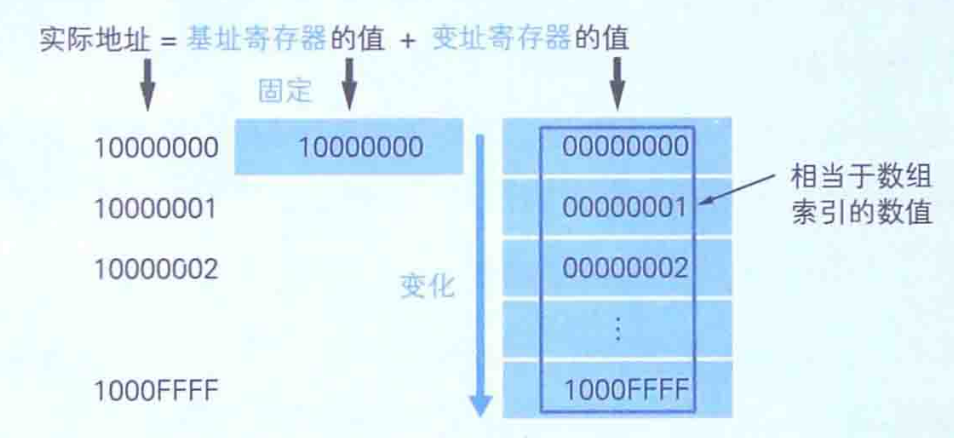
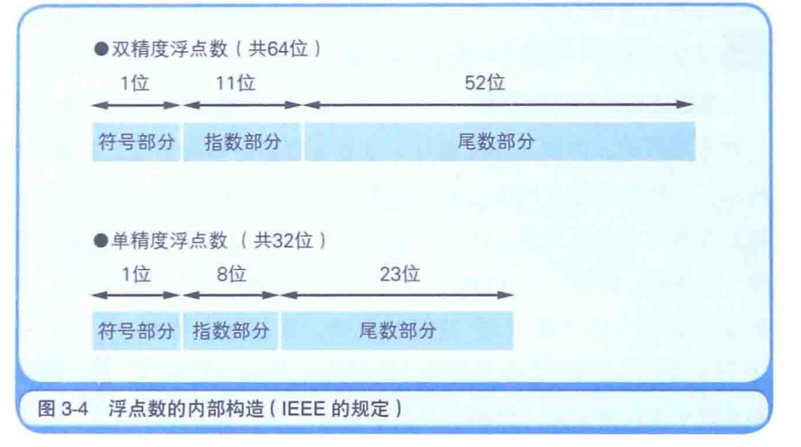
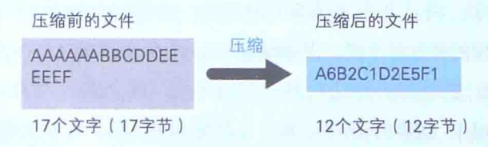
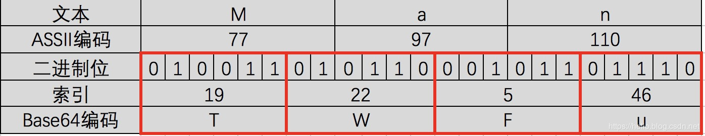

# 概述

## 书目

1. 2018年12月1日《程序是怎么跑起来的》
	- 非常浅显易懂的解释计算的各个组成部分

# 第1章 CPU是什么

## 概述

1. CPU由数百万至数亿晶体管构成
2. 如想弄清CPU是如何运行的，要弄清楚负责保存指令和数据的寄存器的机制

## 1.1 CPU的内部结构解析

1. CPU的内部由寄存器、控制器、运算器和时钟（时钟可能在CPU外部）四部分组成
2. 寄存器：暂存数据和指令，可以看为内存的一种
3. 程序（高级语言）便以为机器语言，程序运行时，会在内存生成机器语言副本，CPU解释并执行内容
4. 通常说的内存是计算机的主存储器，称之为主存，通常使用DRAM芯片，可以对任何地址进行对写操作

## 1.2 CPU是寄存器的集合

1. 程序是把寄存器作为对象来描述的，对于汇编语言近似于机器语言，操作的是寄存器（有点类似单片机的感觉）
2. 高级语言也是编译为机器语言，也是操作的寄存器

## 1.3 决定程序流程的程序计数器

1. 一个命令和数据通常被存储在多个地址上
2. 假设程序起始地址是0100，而且每个指令和数据都分配在一个地址上，程序开始时，会将计数器设定为0100
3. CPU每执行一个指令，计数器的值加1，如CPU执行了0100指令后，计数器变为0101，然后控制器从0101地址读取命令或数据并执行

## 1.4 条件分支和循环机制

1. 条件分支是指根据条件执行任意地址的指令；循环是重复执行同一地址的指令
2. 条件分支，就是根据条件将程序计数器的值设定为任意地址；
3. CPU的比较机制是将两个值进行减法运算，通过正负表示大小

## 1.5 函数的调用机制

1. 函数调用也是通过把计数器的值设定为函数的存储地址实现的
2. 与条件分支和循环机制不同的是，仅仅转跳指令是实现不了的，因为函数调用完，需要回到当前地址，继续程序运行
3. 解决办法是利用机器语言的call和return指令，call调用函数时，将当前地址压入栈，然后计数器设定为函数存储地址，运行函数，当函数运行完，return指令将保存在栈的地址设定到程序计数器中
4. 函数的调用原点与被调用函数的参数传递可以通过内存或寄存器来实现

## 1.6 通过地址和索引实现数组

1. 使用基址寄存器和变址寄存器对主内存特定的内存区域进行划分，实现类似数组操作
2. 32位2进制数，可以用8位十六进制数表示，如a[0]...a[10]，可以找到a[0]的基址寄存器是10000000，变址寄存器是00000000，故变址寄存器向后加10则可以得到相应的数值

## 1.7 CPU的处理其实很简单

1. CPU能执行的机器指令大致是
	- 数据转送指令：寄存器与内存，内存与内存，寄存器和外围设备的数据读写操作
	- 运算指令：移位、逻辑、比较、算数
	- 跳转指令：实现条件、循环等
	- call/return指令：调用函数

# 第2章 数据是用二进制数表示的

## 2.1 用二进制表示计算机信息的原因

1. 集成电路引脚只有直流电压表示0v或5v，一个引脚只能表示两个状态，用二进制表示最合适
2. 计算器处理信息最小单位是位bit，8位为一个字节，作为信息基本单位，如32位的奔腾处理器，有32个引脚用于信息输入输出，故一次可以处理32位，4字节的二进制信息
3. 对于计算器来说，如一个图、一段文字等都可以表示为0101010101000，如何处理需要取决于程序的编写方式

## 2.3 移位运算和乘除运算的关系

1. 十进制左移n位相当于乘以2^n，右移相当于除以2^n（后面详细说）
2. 十进制可以直接进行移位运算的原因是，计算机中所有值都是二进制表示

## 2.4 便于计算机处理的“补数”

1. 二进制一般把最高位作为符号位，0表示正数，1表示负数，并使用补数表示负数（取反+1）
2. 如-1，二进制的1表示为：00000001，取反+1：1111 1111，因此-1的二进制表示为1111 1111
3. 计算机将减法运算，变为补数的加法运算，如5-3表示为5+(-3)，5表示为0101，-3表示为1101，运算结果为0010，为2
4. 注意：如运算结果为负数，这个值是补数形式，如3-5，运算结果为（0011+1011=1110），1110取反+1：0010为2，故结果为-2
5. 2字节，16位的有符号数，是从-32768~32767（2^16=65536，正负数分别32768个），因为最高位符号位0表示正数，故0归为正数，故0~32767共32768个，负数从-1~-32768，共32768个

## 2.5 逻辑右移和算数右移的区别

1. 逻辑右移就是高位补0,类似于霓虹灯往右滚动
2. 算数右移：根据符号位，高位补符号位，如-4的补数为1110，右移2位1111，是0001的补数，即为-1，满足-4/(2^2)的结果
3. 只有右移时才区分逻辑右移还是算数右移
4. 逻辑运算不会有进位，即按位或、与、非、异或等

# 第3章 计算机进行小数运算时出错的原因

## 3.3 计算机运算出错的原因

1. 十进制小数的二进制表示方法，如只用4位2进制表示小数，0.0000表示0，0.0001表示0.0625，因此这之间的十进制小数则无法用二进制表示
2. 由于计算机存储数据是有限的，对于0.1表示为二进制会为0.00011001100（1100循环），计算机会截取这样的循环小数，类似于十进制表示1/3为0.3333333333......，计算机会截取为0.3333333，再乘以3，结果为0.9999999
3. 注意，只有分母为2的幂数的分数才能被二进制有限表示，如0.1(1/10)，0.2（1/5）都不是分母为2的幂数，故无法被二进制有限表示

## 3.4 什么是浮点数

1. 实际计算机并不是按照纸面上二进制表现形式处理小数的
2. 很多语言提供双精度浮点数（64位）和单精度浮点数（32）位来表示小数
3. 浮点数是指用符号、尾数、基数（2）和指数四部分表示小数，表现形式有很多种，一般使用IEEE标准
4. 符号为1时表示正数，0表示负数或0；
5. 数值大小用尾数部分（将小数点前面的值固定为1的正则表达式）和指数部分（用EXCESS系统表示）表示

## 3.5正则表达式和EXCESS系统

1. 尾数部分使用正则表达式，为了统一浮点数的表现形式，如十进制的0.75可以表示为0.75*10^0，也可以表示为75\*10^-2；
2. 十进制的正则表达式规则为：小数点前面是0，小数点后面第1位不能是0，故只能用尾数0.75，指数部分0的方法表示这个小数
3. 二进制的正则表达式规则为：将小数点前面的值固定为1的正则表达式，将小数逻辑左移或右移，使整数第1位为1，其他为0，如小数1011.0011，右移为0001.0110011，确保小数点后23位（单精度浮点数），保留小数部分0110011000000......作为浮点数的尾数
4. 指数部分使用EXCESS系统：主要为了负数不使用符号为，比如1-13，可以用7表示0，那么10就是+3，3表示-4；单精度指数部分有8为，故最大值为11111111，对应的十进制值为255，中间127表示为0，故00000000，EXCESS系统表示为0-127= 127
   - 故如指数部分为0，则用x-0=127，得到x=127，转为2进制为0111 1111
   - 如指数为1，则x=128，转为2进制为1000 0000
5. 如0.75用单精度浮点数表示为：0-01111110-100000.....，第1位为符号位，0表示正数，指数部分01111110，十进制为126,126-127实际上EXCESS系统表示的为-1；尾数部分10000，根据规则小数点前面第一位是1，故实际表示的数为1.100000000000000转为十进制是1*2^0+1\*2^-1=1.5，然后再1.5\*2^-1结果是+0.75

## 3.7 如何避免计算机计算出错

1. 回避策略，无视这些错误，对于某些科学技术计算领域，近似结果就可以，微小误差可以完全忽略
2. 把小数转换为整数计算
3. 更换二进制表示十进制的方式，如使用BCD

# 第4章 内存、磁盘

## 4.1 内存的物理机制

1. 内存包含DRAM（需要经常刷新以保存数据的DRAM）、SRAM（不需要刷新电路）、ROM（只读内存）等多种形式
2. 内存IC有电源、地址信号、数据信号、控制信号等用来输入输出的大量引脚，如地址引脚A0-A9，共10个，表示1024个地址；数据引脚D0-D7，共8个，一次可以输入8位数据，即1字节，故这个内存可以存储1024个1字节数据，容量为1K
3. 如想写入数据，则控制引脚设为1（写入操作），选择要写入的地址，地址引脚设定具体的值，然后在数据引脚给具体的数值
4. CPU通过计数器来指定内存地址，才能读出程序，即使CPU能从磁盘直接读，但速度也太慢了

### 4.2 磁盘的物理结构

1. 磁盘通过将表面划分为多个空间来使用，划分方式有扇区方式和可变长方式两种
2. windows采用扇区的方式，逻辑方面对磁盘进行读取的单位是扇区的整数倍簇，一般一个扇区是512字节，磁盘容量越大，簇越大
3. 无论多小的文件，都会占1簇，不同文件不在相同的簇上
4. 因此，簇越小空间浪费越小，但读取速度要更慢，故扇区和簇的大小，是由处理速度和存储容量的平衡来决定的

## 4.3 磁盘缓存

1. 在内存中开辟一块区域存放磁盘数据，第二次读取时，就可以从内存高速读出
2. 但由于磁盘读写速度在增快，磁盘缓存效果不再那么明显了

## 4.4 虚拟内存

1. 把磁盘的一部分作为假象的内存来使用
2. 借助虚拟内存，在内存不足时，也可以运行程序，但CPU是从内存中运行程序，虚拟内存其实是将磁盘的某些内容与内存的某些内容进行置换

# 第5章 压缩机制

## 文件以字节为单位存储

1. 文件存储数据单位是字节，大小之所以用xxKB、xxMB，是因为字节（B=Byte）
2. 字节都是连续存储的

## RLE压缩算法

1. 使用数据*重复次数来表示，行程长度编码算法

2. 即AAAAABBBBCCCC可以表示为A5B4C4

	

3. 算法主要是针对有大量重复字符的，如图像或文件，但对于文本（很少出现字符）就不适用了

	- 如this is a pen这样14个字符，利用RLE算法压缩完，变为了28个字符

## 哈夫曼算法

1. 1952年提出的压缩算法

# Base64编码

## 概述

1. 在参数传输的过程中一旦涉及到中文就会出现乱码
2. Base64为了解决此问题，它是基于64个可打印的字符来表示二进制的数据的一种方法

## 具体步骤

1. 针对文本的二进制码，6个一组分为4组
2. 根据Base64编码索引，替换为TWFu

## 注意

1. 大部分编码是从字符串转换为二进制，而Base64是将二进制转换为字符串
2. 中文有多种编码（比如：utf-8、gb2312、gbk等），不同编码对应Base64编码结果都不一样
3. Base64编码主要用在传输、存储、表示二进制领域，不能算得上加密，只是无法直接看到明文