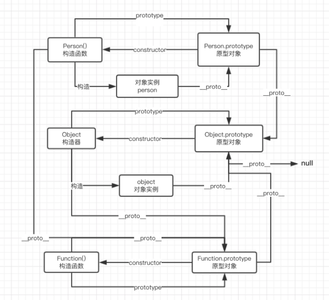
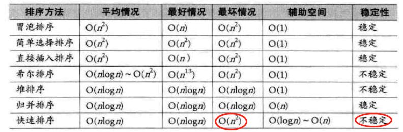

# ES5

## 1-js概述

1. ECMAScript
   - ECMAScript是Js的规范，Js是ECMAScript的实现
2. 内联js代码和外部文件区别？
   - 内联代码不能出现`</scirpt>`，只要出现就被认为是代码块结束
   - 内联代码则使用其所在页面文件的字符集，外联可以charset属性指定
   - 带有src的script元素，会忽略标签中js代码
3. 一个script出错是否会影响其他script？
   - 不会
4. 不同script之间的全局作用域提升机制？
   - 没有
5. DOMContentLoaded与load区别
    - async加载完，触发DOMContentLoaded
    - defer解析完，触发DOMContentLoaded
    - load全部资源加载完毕
    - DOMContentLoaded：dom解析完毕，dom树构建完毕
6. defer与async的区别
    - async是异步加载js，加载好后就执行
    - defer，延迟解析js，html解析完后解析js
7. `<noscript>`标签含义
	- 脚本无效情况下向用户显示其中的信息
8. 执行上下文的类型？
    - js代码被解析和执行时所在环境
9. 常见引擎
	- spiderMonkey，v8，javascriptCore
10. 什么事件循环？
    - 提供了一种机制来处理程序中多个块的执行，且执行每块时调用 JavaScript 引擎
11. 与调用栈的关系？
    - 事件循环会检查调用栈是否为空，如空，则去查询事件队列
12. macrotask
    - setTimeout、setInterval、IO操作
13. microtask
	- promise、MutationObserver、process.nextTick
14. 为啥要用 microtask
	- 每个 task 运行完以后，UI 都会重渲染

## 2-类型与值

1. 内置类型？
   - string，number，symbol，null，undefined，Boolean
   - 复杂类型
2. typeof
   - 结果是字符串，如typeof 123  => 'number'
   - typeof 基本类型，除了null（显示object）都显示正确
   - typeof 对象，除了函数都显示为object
   - js最初为了性能考虑，用000表示对象，故null表示为全000，故判断为object
3. instanceof
   - 判断是否a为b的实例
   - 并不是多有对象都是object实例，`Object.create(null) instanceof Object`
4. Object.prototype.toString
   - 返回值"[object Array]"
5. Undefined类型与void操作符
   - undefined类型只有undefined一个值，且可以被更改
   - void表达式不放表达式值
6. Number类型
   - 都是浮点数，没有整型，只有没有小数的浮点数
   - 42.toFixed(3)// 报错，点会被优先识别为数字常量的一部分
7. 进制转换
   - toString(num)
8. 最大安全数
   - 2^53 - 1
9. NaN
   - 唯一一个不等于自身的数值
   - isNaN有bug，如isNaN('foo')=》true
10. 正负0
    - 可以在动画中，用正负表示方向
    - 利用1/n = +Infinity或-Infinity来判断正负零
11. Object.is
    - 判断两个值是否绝对相等
    - 解决NaN，-0===+0=》true的情况
12. 如何处理浮点数
    - 转为整数
    - 利用round处理，而不是让引擎四舍五入
13. 两种数据类型存储有什么区别？
14. Object类型
    - key一定是字符串，非字符串会被转为字符串
15. 获取属性描述符，配置属性描述符
    - Object.getOwnPropertyDescriptor( myObj, "a" );
    - Object.defineProperty( myObj, "a", {} )
16. Object.defineProperty()属性描述符默认值
    - false
17. 对象不变性
    - Object.preventExtensions，禁止添加
    - Object.seal，禁止删除
    - Object.freeze，禁止修改
    - 都是浅不变性
18. 对象浅拷贝
    - for-in
    - Object.assign
19. Array构造器的问题
    - new Array()：[]空数组
    - new Array(2)：[empty × 2]
    - new Array(1,2)：[1,2]
20. 修改length对数组的影响
    - arr.length = 5；原数组为5
    - arr.length=3，会删除数据
    - arr.length=7,后面会添加[empty*2]
21. 检测数组
    - instanceof
    - Array.isArray()
    - Object.prototype.toString
22. pop，push方法
    - 返回弹出的最后一个元素
    - push返回数组长度，可以将1或多个数据添加到末尾
23. reverse与sort
    - 返回数组与原数组保持相同引用
24. cancat
    - 返回新数组
    - 浅拷贝
25. slice
    - 提取元素，start，end
    - 返回新数组
26. splice(0,2,1)
    - 从0位置删除2项，然后插入1
    - 返回值为删除的元素
27. foreach如何跳出循环
    - 没有办法跳出或终止forEach循环，除非抛出异常
28. 正则常见字符含义
    - `* ` 0次或多次  
    - `+` 1次或多次  
    - ?  0次或一次
    - \d  匹配数字  
    - \D  非数字 
    -  \s  匹配空白字符
    -   \S  非空白字符
    -   \w  匹配一个字符，等价于[A-Za-z0-9_] 
    -  \W  非空字符
29. 未完。。


## 3-作用域

1. RHS与LHS，以及抛出的异常有何不同

   - LHS查询不到会创建变量（非严格模式）
   - RHS查询不到会抛出ReferenceError错误，查询到但进行不合理操作会报typeerror

2. 临时性死区

   - 区块中使用了let或const
   - 凡是在声明之前就使用这些变量，就会报错。

3. 词法作用域

   - js使用的是词法作用域
   - 词法作用域是由函数声明处的位置决定

4. 闭包

   - 当函数可以记住并访问所在的词法作用域时，就产生了闭包

5. 如下代码输出结果

   ```javascript
   for(var i = 1 ; i <= 5 ; i++){
       setTimeout(function timer() {
           console.log(i); 
       },1000)
   }
   ```

   -  结果输出5次6


## 4- this全面解析

1. 为什么使用this？绑定规则？


## 5-强制类型转换

1. toString方法转换不同类型值？JSON字符串化
2. toNumber方法转换规则？Object.create(null) 的问题？
3. 假值有哪些？对象转基本类型？`Symbol.toPrimitive `?Date对象的特殊性？
4. 字符串和数字互转？a + ""（隐式）和 String(a)（显式）的差别？
5. 转换为布尔值？symbol的特殊性？
6. 解析和转换两者之间有明显的差别？parseInt的坑？
7. || 和 &&？==的比较过程？

## 6-函数

1. 函数的返回值
   - 不指定返回值，函数无return语句，函数返回undefined
   - return后不带任何返回值，函数返回undefined
   - 位于return后的代码永远不会执行
2. arguments对象
   - 参数列表
3. caller、callee
   - 调用当前函数的函数
   - 指向当前函数
4. length
   - 希望接收参数的个数
5. call、apply、bind
   - 参数列表
   - 数组
   - 返回函数
6. toString()
   - 返回函数的代码，不同浏览器可能存在差异
7. 函数的两种方式
   - 函数声明，函数表达式
8. 函数与变量提升的顺序？
   - 函数声明会提升，函数表达式不会
   - 函数优先，函数提升完后，变量提升，发现有声明，会忽略变量声明
   - 函数后面声明会覆盖前面的声明
9. 纯函数
   - 输出由输入决定，预测性、易测性、并行计算
10. 防抖和节流的区别？典型应用
    - 防抖：是将多次执行变为最后一次执行，用户调用间隔必须大于wait，才会触发func
      - 每次 resize/scroll 触发统计事件
      - 文本输入的验证（连续输入文字后发送 AJAX 请求进行验证，验证一次就好）
    - 节流：将多次执行变成每隔一段时间执行。
      - DOM 元素的拖拽功能实现（mousemove）
      - 射击游戏的 mousedown/keydown 事件（单位时间只能发射一颗子弹）
      - 搜索联想（keyup）

## 7-构造函数

1. 构造函数的两个约定？

	- 必须首字母大写
	- 必须使用new调用

2. 构造函数的目的？

	- 重用对象创建的代码

3. 使用new操作符会发生？

	- 构建一个空对象{}
	- `{}.__proto__ = Foo.prototype`
	- Foo.call({})
	- return {}

4. new.target？

	- 是否是用new调用的

5. `var obj={},arr=[]，obj.__proto__,arr.__proto__分别指向什么`

	- `obj.__proto__ === Object.prototype;//true`
	- `arr.__proto__ === Array.prototype;//true`

6. `__proto__的理解`

	- 原型链的外在表现形式

7. prototype概述？

	- 创建一个函数时，js引擎会自动为函数增加一个共有不可枚举的prototype属性，prototype上有一个constructor属性，指向这个函数

8. [[Prototype]]链主要解决？

  - 属性查找问题

9. `obj.foo = "bar"`的过程？隐式屏蔽的问题？
  - obj有foo，则直接设置值
  - obj无foo，原型链也无foo，设置值
  - obj无foo，原型链有writable:false（未标记只读），创建foo

10. 隐式屏蔽问题

	```javascript
	var original = {
	    a:2
	};
	var obj = Object.create( original );
	console.log(original.a); // 2
	console.log(obj.a); // 2
	console.log(original.hasOwnProperty( "a" )); // true
	console.log(obj.hasOwnProperty( "a" )); // false,a属性不是obj的直接属性
	obj.a++; // 隐式屏蔽！
	console.log(original.a); // 2
	console.log(obj.a); // 3
	console.log(obj.hasOwnProperty( "a" )); // true
	```

	

11. Object.create？

   - 手动设置一个对象的原型链
   - es5创建原型链的方式
   - 可以传入任意对象`obj = Object.create(obj1)`

12. Object.create(null)？

   - 创建一个无原型链对象，方便数据存储
   - 由于原型链为空，故instanceof任何值都为false

13. new与Object.create

	- Object.create未执行构造函数

14. 绘制p=new Person的完整原型链关系图

	

15. 继承实现

   ```javascript
   function Parent (param) {
       this.names = [];
   }
   Parent.prototype.getName = function () {
       console.log(this.names);
   };
   function Child () {
       Parent.call(this,'aaaaaaaaaaaaaa');// 关键
   }
   // 主要区别+
   function F(){};
   F.prototype = Parent.prototype;
   Child.prototype = new F();// 继承关系
   Child.prototype.constructor = Child;
   // ****************
   const child1 = new Child();
   child1.names.push('c');
   child1.getName(); // [ "c"]
   const child2 = new Child();
   child2.getName(); // []
   // 解决问题：
   child1.names === child2.names;// false,属性独立(正确)
   child1.getName === child2.getName;// true,，方法共享
   child1.__proto__.names ;// undefined，proto上不存在parent的属性
   ```

16. es5实现上述继承

	- ```javascript
		Child.prototype = Object.create(Parent.prototype,{
		    constructor:{
		        value:Child
		    }
		})
		```

		

17. 修改对象的prototype关联的方式？

   - Object.create()
   - `__proto__`
   - es6：Object.setPrototypeOf( Bar.prototype, Foo.prototype );

18. 检查类的关系4种方式？
   - instanceof
   - `__proto__`
   - Object.getPrototypeOf()：获取原型链
   - a.isPrototypeOf(b)：a是否出现在b的原型链上

19. 面向委托的设计风格？
	- `obj = {a:1}`
	- `newObj = Object.create(obj)`
	- `newObj.b = 2`

20. `Object.__proto__`和Object.prototype结果有何不同

	- ƒ () { [native code] }
	- `{constructor: ƒ, __defineGetter__: ƒ, __defineSetter__: ƒ, hasOwnProperty: ƒ, __lookupGetter__: ƒ, …}`

## 8-BOM

1. BOM下的对象
   - window，location，navigator，screen，history
2. top、parent、self对象的含义？
   - top：指向最外层框架
   - parent：指向当前框架的上层框架
   - self：和window对象一样
3. 如何移动窗口、如何修改窗口大小？两个方法的异同
   - moveTo,moveBy：挪动到xy绝对位置；相对位置
   - resizeTo，resizeBy：绝对调整，相对调整
4. setInterval的问题？
   - 隔一段时间在队列添加一个事件
5. 定时间最小时间间隔
   - html5规定最少要4ms
6. 打开系统对话框
   - window.alert,window.confim,window.prompt
7. window.location
   - 只读属性，包含有关文档当前位置信息
8. search属性
   - 从问号到URL尾部
9. 改变浏览器位置的方法
   - location.assign
   - window.location
   - location.href
10. replace方法的特点
    - 不会产生历史记录，用户不能返回到之前页面
11. window.reload，参数true含义
    - 重新加载页面
    - true表示从服务器获取，否则先从缓存
12. navigator？可以获取哪些信息？
    - 获取当前代码应用程序相关的
    - 如浏览器名，浏览器引擎，浏览器版本，操作平台等
13. screen？
    - 表明客户端能力，屏幕像素，宽高等，屏幕颜色等
14. history
    - 保存用户上网的历史记录

## 9-DOM

1. node常用属性以及常用方法？
2. 创建元素？返回元素的指定的属性值？直接node.id与利用Dom方法的不同？设置与删除属性？attributes属性是？
3. 创建文本节点？
4. 创建文档片段
5. 访问元素样式及注意事项？计算样式如何获取？如何获取伪元素样式？CSSStyleDeclaration API？CSSStyleDeclaration 属性及常用方法？
6. CSSStyleSheet API优势？cssText使用？与CSSStyleDeclaration API关系

## 10-事件

1. 事件流的两种方式？如何让事件先冒泡后捕获？事件流的三个阶段？三种方式为DOM元素注册事件处理函数以及异同？
2. event.currentTarget、event.target、event.type、preventDefault()、stopPropogation()、eventPhase属性
3. event.detail?
4. MouseEvent获取客户区坐标位置、页面坐标位置、屏幕坐标位置、修改键、鼠标按钮判断、relatedTaget
5. 如何准确判断滚动方向；WheelEvent.deltaX？
6. KeyboardEvent.key与KeyboardEvent.code区别？location？getModifierState()
7. load、unload事件?
8. 不冒泡的事件有？当焦点从a元素移动到b元素，触发事件顺序是?
9. mouseenter、mouseleave、mouseover、mouseout的区别？双击一个元素，事件发生顺序?
10. contextmenu事件、beforeunload事件
11. addEventListener与onclick同时作用时
    - 谁先点先触发谁

## 11- 表单脚本

1. 获取form的引用？提交表单？重置表单？
2. 选择文本框全部文本？选择文本的起始、终止？选择部分文本？获取选择项序号？默认选中？添加options、删除option?
3. 设置全document可编辑？设置某个元素可编辑？操作富文本？

## 13-错误处理

1. 常见的js错误
2. try-catch-finally 与return的关系

## 14- Ajax

1. 什么是ajax？解决缓存的3个办法？xhr的局限性？
2. 同源策略？创建XHR对象？ XHR常用方法？发送异步请求时需要检测xxx属性？xx属性改变会触发xx事件？如何设置HTTP头？如何获取响应头？
3. get请求特点？post请求特点？两者异同？
4. FormData类型？timeout属性，overrideMimeType？
5. XHR事件？progress事件，position属性，totalSize属性？
6. responseType的ArrayBuffer、Blob、Document、JSON、Text表示的含义
7. 定时轮询？定时时间的长短有何影响？改进方式？
8. 跨资源共享？背后的思想是？与XHR的异同？CORS默认的安全措施？
9. SSE目的？局限性？
10. WebSocket？资源URL的自定义模式？

# ES6

## 基本类型扩展

1. array
   - Array.from()：将类数组转为数组
   - Array.of()：将一组值转为数组
   - find：找到一个满足条件的
2.  箭头函数的特点
   - this使用外部作用域。
   - 不能使用new命令，否则会抛出错误
   - 不可以使用arguments，使用rest参数代替
   - 不可以使用yield命令，箭头函数不能用作Generator函数

## Class

1. super主要作用
	- 访问父级constructor，访问父类方法与属性
	- 必须是子类才能调用super
2. 与ES5类的区别
  - ES6必须使用 new 调用
  - ES6不存在变量提升
  - class定义的prototype是不可写的，ES5函数定义的prototype是可写的，即es6定义了class后，不能更改prototype
  - ES6内部所有定义的方法都是不可枚举的

## modules

1. 使用`<script>`标签的问题？
   - 污染全局变量
   - 无法解决循环引用
   - 不知道标签依赖关系
   - 每个标签是一个http请求
2. 模块化的不同方式以及问题？
   - 不同函数方式
   - 立即调用函数
3. CommonJS概述？导入与导出模块？
   - 同步加载模块，服务器优先
   - module.exports、require
4. AMD？requireJS解决的问题？
   - 异步加载模块，浏览器优先
   - require主要解决多文件依赖关系
5. requireJs加载原理
   - 通过data-main属性获取入口文件
   - require前面数组文件通过创建脚本异步加载
   - 利用onload事件监听加载完成，调用回调
6. UMD？
   - 通过代码判断分别支持commonJS与AMD
7. 模块加载器与捆绑器的不同
   - requireJS与webpack是不同的
   - webpack先打包为bundle文件，然后运行时直接加载
8. es6与CommonJs区别
   - 加载方式不同：es6是执行前先解析（import会提升），CommonJs是按需加载
   - 导入方式不同：es6是引用拷贝（导出文件会影响导入的），CommonJs是值拷贝
9. 如何应对回退？
   - `<script nomodule src="runs-if-module-not-supported.js"></script>`

## Promise

1. 处理异步的方式
   - 基于事件的，如XMLHTTPRequest
   - 回调（回调地域，控制反转）
2. promise的状态？
3. Promise的构造函数？

## async/await

1. async返回值

   - Promise对象

2. await语法描述（后面值表示何种含义）

   - 如是fulfilled，回调resolve的参数作为await表达式的值
   - 如是reject，则抛出异常原因
   - 不是promise，则返回该值本身
   - 如是一个setTimeout，直接返回id，不会等setTimeout

3. 循环与并行串行

   - promise串行

     ```javascript
     const arr = [1,2,3];
     function asyncTimetOut(arr,i) {
         return new Promise((resolve, reject)=>{
             setTimeout(()=>{
                 console.log(arr[i]);
                 resolve(i);
             },1000);
         })
     }
     function foo(){
         arr.reduce((promise,item,index)=>{
             return promise.then(()=>{
                 return asyncTimetOut(arr,index)
             })
         },Promise.resolve());
     }
     foo()
     ```

   - promise并行，promise.all()

   - await串行，直接for循环

   - await并行，map里面加await

4. 

## Proxy

1. proxy是啥，实现双向绑定
2. Reflect？

# 其他

### document.write和innerHTML的区别

1. document.write是直接写入到页面的内容流，会导致页面全部重绘
2. innerHTML将内容写入某个DOM节点，不会导致页面全部重绘

### 谈谈你对JS执行上下文栈和作用域链的理解

1. 执行上下文就是当前 JavaScript 代码被解析和执行时所在环境,

2. JS执行上下文栈可以认为是一个存储函数调用的栈结构，遵循先进后出的原则。

3. LHS和RHS查询，但无论LHS与RHS查询，都会在当前的作用域开始查找，如果没有找到，就会向上级作用域继续查找目标标识符，每次上升一个作用域，一直到全局作用域为止。

4. RHS在所有作用域都查询不到，会抛出ReferenceError（未声明）错误
	
	- 如查询到变量，但对变量值进行不合理操作（应用null中的属性等），会抛出TypeError
	
5. LHS在所有作用域查询不到，会在全局作用域创建这个变量（非严格模式）
	
	- 严格模式禁止隐式或自动创建全局变量
	
	

### ES6新的特性有哪些？

1. 新增了块级作用域(let,const)
2. 提供了定义类的语法糖(class)
3. 新增了一种基本数据类型(Symbol)
	新增了变量的解构赋值
4. 扩展运算符
5. ES6 新增了模块化(import/export)
6. ES6 新增了 Set 和 Map 数据结构
7. ES6 原生提供 Proxy 构造函数，用来生成 Proxy 实例
8. ES6 新增了生成器(Generator)和遍历器(Iterator)

### form表单提交没有跨域问题

1. 跨域本质是个域名下面的JS，没有经过允许是不能读取另外一个域名的内容，是针对js而言的
2. 提交form表单到另外一个域名，原来页面是无法获取新页面的内容，或者说form提交后不需要返回，但是ajax是需要返回的。

### 跨域综述

1. jsonp
	- HTML标签里，一些标签比如script、img这样的获取资源的标签是没有跨域限制的，利用这一点
	- html写一个script标签，请求一个url带一个function的参数
	- 后台配合，返回一个函数，函数体内为需要的数据
	- 但只能get请求
2. CORS
	- 跨域资源共享，后台需要设置Access-Control-Allow-Origin
3. nginx代理

### 对动画的理解

1. setTimeInterval，setTimeout定时时间不准
2. requestAnimationFrame
3. css3 animation,transition

### 执行上下文与作用域

1. 执行上下文：当前 JavaScript 代码被解析和执行时所在环境
2. 作用域：提供查找变量和函数方法的规则

### 为何js没有重载

1. js函数本质还是对象，java的重载指的是签名一致，即函数名一样，但参数列表不同
2. js函数声明，之后声明的会覆盖前面声明的

### 小知识

1. undefined和null区别
   - null： Null类型，代表“空值”，代表一个空对象指针，使用typeof运算得到 “object”，它是一个特殊的对象值。
   - undefined： Undefined类型
   - null是javascript的关键字，undefined是预定义的全局变量

2. JS哪些操作会造成内存泄露

	- 闭包引起的内存泄露
	- 没有清理的DOM元素引用
	- 被遗忘的定时器或者回调 

3. 怎样添加、移除、移动、复制、创建和查找节点？

	- 创建新节点

		createDocumentFragment() //创建一个DOM片段

		createElement() //创建一个具体的元素

		createTextNode() //创建一个文本节点

	- 2）添加、移除、替换、插入
		appendChild() //添加
		removeChild() //移除
		replaceChild() //替换
		insertBefore() //插入

	- 3）查找
		getElementsByTagName() //通过标签名称
		getElementsByName() //通过元素的Name属性的值getElementById() //通过元素Id，唯一性
	
4. 如何判断一个变量是不是数组？

  - 使用 Array.isArray 判断，如果返回 true, 说明是数组
  - 使用 instanceof Array 判断，如果返回true, 说明是数组
  - 使用 Object.prototype.toString.call 判断，如果值是 [object Array], 说明是数组
  - 通过 constructor 来判断，如果是数组，那么 `arr.constructor === Array`. (不准确，因为我们可以指定 `obj.constructor = Array`)

5. 类数组可以转换为数组:

	- Array.prototype.slice.call(arrayLike, start);
	- [...arrayLike];
	- Array.from(arrayLike);
6. 数组api哪些能改变原数组哪些不能（纯函数）

	- 直接修改的：splice，reverse，sort，push，pop，shift，unshift
	- 不修改的：concat，join，slice
7. 词法作用域和this的区别

	- 词法作用域是由你在写代码时将变量和块作用域写在哪里来决定的
	- this 是在调用时被绑定的，this 指向什么，完全取决于函数的调用位置
8. 闭包的作用有:

	- 封装私有变量
	- 模仿块级作用域(ES5中没有块级作用域)
	- 实现JS的模块
9. 取数组的最大值（ES5、ES6）

	- `Math.max.apply(null, [14, 3, 77, 30]);`
	- Math.max(...[14, 3, 77, 30]);
10. 请求中如何传中文？

	- 利用encodeURIComponent或encodeURI编码
11. escape、encodeURI和encodeURIComponent区别
	- escape：对字符串编码
	- encodeURI：对url编码
	- encodeURIComponent：对url参数进行编码
12. 什么情况下用相等==

	- 简而言之：没有，使用===会更清晰，也可以代替==的情况
	- 如可以用来比较：`new String('123') == '123'
	- 但可以用来比较undefined与null
	- if(!x)，但undefined，null，false，0，""
13. 为何jsonp不支持post请求

	- jsonp本质就是使用js的script标签 进行传参，那么必然是get方式的了，和浏览器中敲入一个url一样
14. html5对于input新增的属性

	- autoComplete
	- autoFocus
	- required
15. 介绍localstorage的API

	- getItem，setItem，removeItem，clear，key(n)
17. 判断`JavaScript`数据类型的方式

	- typeof，只能判断基本类型
	- instanceof，判断对象
	- toString.call
	- constructor，`c.constructor === Array` constructor可以被重写
18. 准确判断array

	- toString.call
	- isArray
19. `JavaScript`可以存储的最大数字、最大安全数、解决精度丢失的方法

	- 最大安全数：2^53-1
	- 最大数：由于js数是按照双精度浮点数，故最大值可以是1.79*10^308
	- 解决小数精度丢失：通常是*100转为整数运算，或使用bigInt（stage3非标准）
20. forEach的特殊性
	- forEach不直接改变调用它的对象，但是对象可能会被callback改变
21. 数组更改length有何结果

# 移动端相关

1. rem计算方式

   - 利用clientwidth/750

   - 阿里团队：利用DPR调整页面放缩值，达到高清
   - 

2. viewport

   - initial-scale 初始化缩放比例
   - minimum-scale 最小缩放比例
   - maxinum-scale 最大缩放比例
   - user-scalable 用户是否可以缩放

3. dpr并不都是2

   | 手机型号    | css像素宽度 | dpr  | 物理像素 |
   | ----------- | ----------- | ---- | -------- |
   | iphone 5s   | 320px       | 2    | 640px    |
   | iphone 6    | 375px       | 2    | 750px    |
   | iphone 6 sp | 414px       | 3    | 1242px   |

   - 故iphone6截图在电脑打开宽度是750px
   - 设计给的图也都是750px

# 实现代码

## 模拟实现instanceof

```javascript
function _instanceof(leftVaule, rightVaule) { 
    let rightProto = rightVaule.prototype; // 取右表达式的 prototype 值
    leftVaule = Object.getProtyotypeOf(leftVaule); // 取左表达式的__proto__值
    while (true) {
        if (leftVaule === null) {
            return false;	
        }
        if (leftVaule === rightProto) {
            return true;	
        } 
        leftVaule = Object.getProtyotypeOf(leftVaule)
    }
}
```


## 手动实现new

```javascript
function _new(fn, ...arg) {
    const obj = {}; //创建一个新的对象
    obj.__proto__ = fn.prototype; //把obj的__proto__指向fn的prototype,实现继承
    fn.apply(obj, arg) //改变this的指向***********
    return obj //返回新的对象obj
}
```

## 实现Object.create

```javascript
Object.create =  function (o) {
    var F = function () {};
    F.prototype = o;
    return new F();
};
```


## 深拷贝

```javascript
function deepClone(obj) {
    var copy;
    // Handle the 3 simple types, and null or undefined
    if (null == obj || "object" != typeof obj) return obj;
    // Handle Date
    if (obj instanceof Date) {
        copy = new Date();
        copy.setTime(obj.getTime());
        return copy;
    }

    // Handle Array
    if (obj instanceof Array) {
        copy = [];
        for (var i = 0, len = obj.length; i < len; i++) {
            copy[i] = deepClone(obj[i]);
        }
        return copy;
    }

    // Handle Function
    if (obj instanceof Function) {
        copy = function() {
            return obj.apply(this, arguments);
        }
        return copy;
    }

    // Handle Object
    if (obj instanceof Object) {
        copy = {};
        for (var attr in obj) {
            if (obj.hasOwnProperty(attr)) copy[attr] = deepClone(obj[attr]);
        }
        return copy;
    }

    throw new Error("Unable to copy obj as type isn't supported " + obj.constructor.name);
}
```


## 手写柯里化函数

```javascript
function createCurry(func, args = []) {
    const arity = func.length;
    return function() {
        const _args = Array.prototype.slice.call(arguments);
        Array.prototype.push.apply(_args, args);
        // 如果参数个数小于最初的func.length，则递归调用，继续收集参数
        if (_args.length < arity) {
            return createCurry.call(this, func, _args);
        }
        // 参数收集完毕，则执行func
        return func.apply(this, _args);
 }
}
// 调用
function add(a,b,c) {
    return a+b+c
}
const res = createCurry(add);
res(1)(1)(1);// 3，显示结果，需要调用3次
```


## 手写bind

```javascript
if (!Function.prototype.bind) {
  Function.prototype.bind = function(oThis) {
    if (typeof this !== 'function') {
      // closest thing possible to the ECMAScript 5
      // internal IsCallable function
      throw new TypeError('Function.prototype.bind - what is trying to be bound is not callable');
    }
    var aArgs   = Array.prototype.slice.call(arguments, 1),
      that = this,
      F    = function() {},
      fBound  = function() {
        // this instanceof fBound === true时,说明返回的fBound被当做new的构造函数调用
        return that.apply(this instanceof fBound
          ? this
          : oThis,
          // 获取调用时(fBound)的传参.bind 返回的函数入参往往是这么传递的
          aArgs.concat(Array.prototype.slice.call(arguments)));
      };

    // 维护原型关系
    if (this.prototype) {
      // Function.prototype doesn't have a prototype property
      F.prototype = this.prototype;
    }
    // 下行的代码使fBound.prototype是fNOP的实例,因此
    // 返回的fBound若作为new的构造函数,new生成的新对象作为this传入fBound,新对象的__proto__就是fNOP的实例
    fBound.prototype = new F();
    return fBound;
  };
}
```

## 手写call

```javascript
  Function.prototype.foo = function(context){
      if (!context) {
          //context为null或者是undefined
          context = typeof window === 'undefined' ? global : window;
      }
      context.func = this;
      const res = [...arguments].slice(1);
      const result = context.func(...res);
      delete context.func;
  	return result;
  }
  // 调用
  const obj = {a:1}
  function c(){
      console.log(this.a)
  }
  c.foo(obj);// 1
```


## 节流函数

```javascript
// 方式1
function debounce(method, context) {
    clearTimeout(method.tId);
    method.tId = setTimeout(function() {
        method.call(context);
    }, 1000);
}
function print() {
    console.log('hello world');
}
window.onscroll = function() {
    debounce(print);
};
// 方式2
function throttle(fn, mustRun = 500) {
    const timer = null;
    let previous = null;
    return function() {
        const now = new Date();
        if (!previous){
            previous = now;
        }
        const remaining = now - previous;
        if (mustRun && remaining >= mustRun) {
            fn(context);
            previous = now;
        }
    }
}
```

## 防抖函数

```javascript
// func是用户传入需要防抖的函数
// wait是等待时间
const debounce = (func, wait = 50) => { 
    let timer = 0 
    return function(...args) {
        // 当小于wait时间再调用时，
        if (timer) clearTimeout(timer)
        timer = setTimeout(() => {
            func.apply(this, args)
        }, wait)
    }
}
```


# 实际问题

## 前端处理处理海量数据

1. 方式1：

	- 利用createDocumentFragment减少dom操作次数

	- 然后利用requestAnimationFrame分次插入新节点

	- 利用事件委托，减少注册事件数

		```javascript
		// 伪代码
		const total = 100000; // 10w数据
		const num = 10；// 1次插入10条
		function addItem (){
		    fragement.append('');
		    appendBatch();
		}
		function appendBatch(){
		    if(){
		        window.requestAnimationFrame(addItem)
		    }   
		}
		```

2. 大量数据做计算:web worker

# 算法

1. 排序的稳定性与性能

	
	
2. 实现new Foo，每次返回this.id 加1

  ```javascript
  const Foo = (function () {
      let id = 0;
      return function () {
          this.id = id ++;
      }
  })();
  ```

3. 10亿数找top10

  - 分治法：分成100分，然后找最大
  - Hash法：如有很多重复数，利用Hash法去重
  - 最小堆或最大堆

4. 树的深度与广度遍历（二叉树的遍历也利用类似方式）

    - 深度遍历

    ```javascript
    function dfs(node){
        let nodes=[];
        if(node!=null){
            let stack=[];//同来存放将来要访问的节点
            stack.push(node);
            while(stack.length !== 0){
                let item=stack.pop();//正在访问的节点
                nodes.push(item);
                let childrens=item.children;
                for(let i=childrens.length-1;i>=0;i--)//将现在访问点的节点的子节点存入stack，供将来访问
                    stack.push(childrens[i]);
            }
        }
        return nodes;
    }
    ```

    - 广度遍历

    ```javascript
    function bfs(node){
        let nodes = [];
        if (node != null) {
            let queue = [];
            queue.push(node);
            while (queue.length !== 0) {
                let item = queue.shift();
                nodes.push(item);
                let children = item.children;
                for (let i = 0; i < children.length; i++)
                    queue.push(children[i]);
            }
        }
        return nodes;
    }
    ```

5. 数组reverse如何实现

   - 利用push，pop方式

   - 互换1与length-1的方式

   - js.reverse()，利用JSPerf测试是最慢或倒数第2慢

   - 利用XOR交换，速度最快

   	```javascript
   	var i = null;
   	var r = null;
   	for (i = 0, r = length - 1; i < r; i += 1, r -= 1)
   	{
   	    var left = array[i];
   	    var right = array[r];
   	    left ^= right;
   	    right ^= left;
   	    left ^= right;
   	    array[i] = left;
   	    array[r] = right;
   	}
   	```

   	

6. 提取url参数

   ```javascript
   let obj ={};
   "?ie=utf&&aa=1&&bb=2".replace(/(\w+)=(\w+)/g,function(str,p1,p2){
       obj[p1] =p2
   })
   ```

7. js数字用逗号分隔

   - 可以使用`toLocaleString()`
   - 小数会有问题：利用split+reverse，replace(`/(\d{3})/g, ``"$1,"`)，然后reverse，join
   
8. 数组去重

    - 利用filter

      ```javascript
      array.filter(function(item, index, array){
          return array.indexOf(item) === index;
      })
      ```

    - es6：` [...new Set(array)]`

    - 双重循环

    - 利用obj

9. sleep函数

    ```javascript
    function sleep (time) {
        return new Promise((resolve) => setTimeout(resolve, time));
    }
    
    // 用法
    sleep(500).then(() => {
        // 这里写sleep之后需要去做的事情
    })
    ```

10. 链表反转

    ```javascript
    function reverseList(node) {
        let pre = null;
        let next;
        while (node){
            next = node.next;
            node.next = pre;
            pre = node;
            node = next;
        }
        return pre;
    }
    ```

11. 图片懒加载

     ```javascript
     function isInSight(el) {
         const bound = el.getBoundingClientRect();
         const clientHeight = window.innerHeight;
         return bound.top <= clientHeight + 100;
     }
     function checkImgs() {
         const imgs = document.querySelectorAll('.my-photo');
         Array.from(imgs).forEach(el => {
             if (isInSight(el)) {
                 loadImg(el);
             }
         })
     }
     
     function loadImg(el) {
         if (!el.src) {
             const source = el.dataset.src;
             el.src = source;
         }
     }
     window.onscroll = chekImgs();
     ```

     - 可以将src存储在img的一个data-src属性上，当图片到达可视区域后，将data-src取出后放在src上

12. 判断回文

     ```javascript
     var str1=str.split("").reverse();
     var str2=str1.join("");
     if(str==str2){}
     ```

     