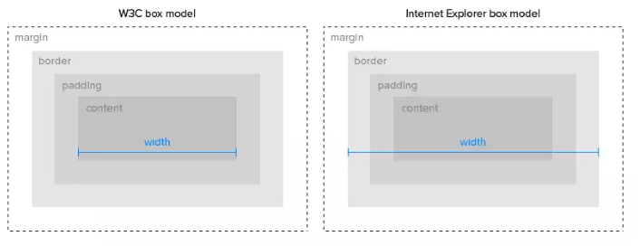
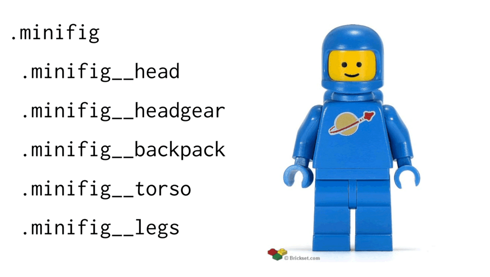
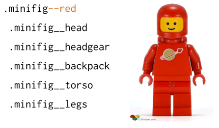

#  2-属性学习

1. 浮动特性？浮动布局的劣势？清除浮动的办法？
2. 渐变色

# 3-布局相关

1. 响应式布局方案
2. 三栏自适应布局
3. 水平垂直居中的方法
4. 多元素水平居中

# 4-易混知识总结

1. 概述？如何才能构成？有何作用？
2. 元素隐藏的三种方式以及异同
3. css三大特性？
4. 伪类与伪元素？

# 基础知识

## css3新特性

1. 新选择器：:only-child，:nth-child(n)，:last-child
2. border：border-radius、box-shadow
3. background：background-size
4. 渐变色
5. 文本：text-shadow
6. transform，transition，animation
7. flex

## 解释一下你对盒模型的理解

1. 盒模型：文档中的每个元素被描绘为矩形盒子，包括padding+margin+border+content内容区
2. 盒子模型分为标准模型与ie模型
3. 

## 请写一个简单的幻灯效果页面

1. 主要是使用css3的:target选择器

## link标签和import标签的区别

1. link属于html标签，而[@import](https://github.com/import)是css提供的
2. 页面被加载时，link会同时被加载，而[@import](https://github.com/import)引用的css会等到页面加载结束后加载
3. link方式的样式的权重高于@import的权重

## position的absolute与fixed共同点与不同点

1. 共同点：
	- 改变行内元素的呈现方式，display被置为block；
	- 让元素脱离普通流，不占据空间
	- 默认会覆盖到非定位元素上
2. 不同点：
	- absolute的”根元素“是可以设置的
	- fixed的”根元素“固定为浏览器窗口。当你滚动网页，fixed元素与浏览器窗口之间的距离是不变的。

## 你写过通用组件吗

1. 组件库设计的细粒度考量，DOM 结构的控制权交给开发者,组件只负责行为和最基本的 DOM 结构（设计通用结构，提供可以扩展的接口）

## 为何要使用前端框架

1. 天然分层：jQuery，严重耦合；组件化：react，便于维护；生态：有成熟的框架
2. 本质是解决了UI 与状态同步问题

# 其他

1. 如何优化网页的打印样式?
   - 针对打印机的样式: @media print{...}
2. 如果设计中使用了非标准的字体，你该如何去实现？ 
   - 图片替代、或利用谷歌在线字库
3. 描述下"reset"css文件的作用和使用它的好处
   - reset.css能够重置浏览器的默认属性。不同的浏览器具有不同的样式，重置能够使其统一
4. css动画和js动画的优缺点
   - 浏览器会对CSS3的动画做一些优化（比如专门新建一个图层用来跑动画）
   - js兼容性好，写得好完全可以兼容IE6，且功能强大。
   - 部分动画功能css无法实现（如滚动动画，视差滚动等）
5. 你用过媒体查询，或针对移动端的布局/CSS 吗？
   - @media screen and (min-width: 400px) and (max-width: 700px) { … }
6. img设置属性title和alt的区别?
   - alt是img的特有属性，规定图像的替代文本. 如果无法显示图像, 浏览器将显示替代文本.
   - title为元素提供附加的提示信息，用于鼠标滑到元素上的时候显示。
7. 什么是无样式内容闪烁？你如何来避免？
   - @import就是造成这个问题的罪魁祸首。
   - IE会先加载整个HTML文档的DOM，然后再去导入外部的CSS文件，因此，在页面DOM加载完成到CSS导入完成中间会有一段时间页面上的内容是没有样式的，这段时间的长短跟网速，电脑速度都有关系。
8. 使用CSS预处理器的优缺点有哪些？

   - 有sass，less，stylus
9. 什么是CSS Hack
   - 针对不同的浏览器写不同的CSS,就是 CSS Hack
10. 画一条0.5px的线
  - 利用transform: scale(0.5) 
  - viewpoint的initial-sacle=0.5
11. transition和animation的区别
	- transition从某种层度上讲，动画控制的更粗一些，它唯一能定义动画变化过程效果的便是transition-timing-function属性
	- animation提供的keyframe方法，可以让你手动去指定每个阶段的属性。此外animation还封装了循环次数，动画延迟，反向循环等功能,更加自由和强大。
	
12. box-sizing常用的属性有哪些？分别有什么作用？
	- content-box；在CSS中定义的宽度和高度之外绘制元素的内边距和边框
	- border-box；元素在设置内边距和边框是在已经设定好的宽度和高度之内进行绘制
	
13. px和em的区别
	- px表示像素 ，是绝对单位，不会因为其他元素的尺寸变化而变化；
	- em表示相对于父元素的字体大小。em是相对单位 ，没有一个固定的度量值，而是由其他元素尺寸来决定的相对值。
	
14. eval()的作用
	- 把字符串参数解析成JS代码并运行
	- 由于js引擎无法事先获得eval中的js代码，无法对代码进行优化，不建议使用
	
15. postion
	- sticky：在屏幕范围（viewport）时该元素的位置并不受到定位影响（设置是top、left等属性无效），当该元素的位置将要移出偏移范围时，定位又会变成fixed，根据设置的left、top等属性成固定位置的效果。兼容性不太好
	- fixed：会受到父级定位的影响（父级`position:absolute;left:10px`,当前元素为`position:fixed;left:10px`），相当于当前元素距离左边20px，滚动时，保持位置不变；父级有transform会根据父级定位
	- relative：相对于原文档流位置进行偏移
	- absolute：绝对定位
	
16. 介绍下flexbox

17. css兼容性写法

	- -webkit-：针对safari、chrome
	- -moz-：针对firefox
	- -ms-：针对ie
	- -o-：针对Opera

18. css模块化方案

	- BEM（Block、Element、Modifier）：块、元素、修饰符，如这样定一个小人的样式

		

		那么，可以通过增加--red将小人变色

		

19. css加载会阻塞渲染吗？

	- 不会阻塞dom解析，会阻塞dom渲染（浏览器渲染解释了，dom与cssdom是并行解析过程，但要合并为render tree才能渲染到屏幕上）
	- 会阻塞后面的js语句执行
	- 解决办法：尽可能快的加载css

