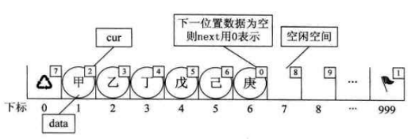

## 2-线性表

1. 概念？

   - 零个或多个数据元素的有限序列

2. 线性表的存储方式？各个存储方式的存储分配方式、时间性能（查询？插入与删除？），空间性能？

   - 顺序存储：插入与删除O(n)，查找O(1)，需要预分配存储空间
   - 链表存储：插入与删除O(1)，查找O(n)，不需要预分配存储空间

3. 静态链表的主要目的？设计思路？

   - 为没有指针的高级语言提供一种实现单链表的方法

   - 

   - a[0].cur`表示的空余数组起始游标

   - 如要乙后面插入元素

     ```javascript
     // 要插入的位置
     var i = a[0].cur;// 7
     a[0].cur = 8;
     a[7].val = '丙'
     a[2].cur = 7;
     a[7].cur = 3;
     ```

   - 删除甲元素

     ```javascript
     a[1].cur = a[0].cur
     a[0].cur = 1;
     ```

4. 静态链表的优缺点

   - 插入删除元素不需要移动元素
   - 无法解决表长问题

5. 循环列表？主要解决的问题？

   - 首尾相连形成环
   - 主要解决单链表只能从头遍历链表的缺点

6. 双向链表解决的问题

   - 解决无法反向遍历链表的缺点

## 3-栈与队列

1. 栈定义？
   - 先进后出
2. Dijkstra的双栈算术表达式？
   - 两个栈，遇到数字放数字栈，遇到符号放符号栈
   - 遇到右括号，弹出数据运算后，压入数字栈
3. 列表定义？
   - 先入后出
4. 队列顺序存储添加元素与出队的时间复杂度？
   - 添加元素是O(1)
   - 出队由于需要挪动元素，故是O(n)
5. 挪动队首解决办法的缺点？
   - 数组本来长度为5，可能出队几次后数组元素为3，但添加元素会报错
   - 造成假溢出

## 4-字符串

1. 与线性表的关系？
   - 并不是每个节点只存一个字符，一般是存一个字符串
2. 朴素模式匹配算法？时间复杂？
   - 最坏情况是O(n*m)
3. KMP模式匹配算法？
   - 是对朴素匹配算法的改进

## 5-树

1. 度、叶子结点、分支结点、树的度？

2. 有序树？森林？线性结构与树结构

3. 树的主要操作？树的存储结构常见的3种方式？以及各自的优势

4. 二叉树特点？斜树？满二叉树？完全二叉树？

5. 二叉树的存储方式？优缺点？

6. 二叉树的遍历方法？前序遍历、中序遍历、后序遍历、层序遍历的口诀？如下图的遍历结果

	

7. 如前序遍历序列为ABCDEF，中序为CBAEDF，后序排列应该为什么呢？

8. 线索二叉树？

9. 树转换为二叉树？森林转换为二叉树？这种转换好处？

10. 赫夫曼树定义与原理？路径长度？树的路径长度？

11. 赫夫曼编码的意义？构造赫夫曼编码

## 6-图

1. 与线性表、树，图：元素称呼，没有数据元素，相邻元素关系之间的区别？

2. 无向边与无向图？有向边与有向图？简单图？无向完全图，多少条边的计算？有向完全图，多少条边的计算？稀疏图？网

3. 顶点的度？图的边与顶点度数之间的关系？有向图的度？路径？树的路径与图路径之间的差别？路径长度？

4. 环或回路？简单环？

5. 连通图？连通分量？强连通图？

6. 图的存储结构？邻接矩阵及其存在的问题？邻接表及其缺点？十字链表特点？邻接多重表？边集数组？

7. 图的深度优先遍历？广度优先遍历？

8. 最小生成树解决的问题？构造的两种算法？

9. 最短路径？迪杰斯特拉算法，求最短路径？

10. Floyd求最短距离

11. 拓扑排序主要解决？AOV网？下图的拓扑排序序列是？

   

12. 关键路径解决的问题？AOE网？关键路径？求下图的关键路径？

    

## 7- 查找

1. 静态表查找和动态表查找？
2. 折半查找？前提？时间复杂度？缺点？
3. 差值查找？时间复杂度？缺点？
4. 斐波那契查找？时间复杂度？三者的异同
5. 索引查找的概述？稠密索引及其要求？分块索引？倒序索引？
6. 二叉排序树主要性质？主要目的？对集合{62,88,58,47,35,73,51,99,37,93}进行二叉排序树构建，分别删除35,58,47节点后的结果？时间复杂度？
7. 平衡二叉树（ALV）解决的问题？平衡二叉树的要求？平衡因子？主要的实现原理
8. B树的主要考虑？2-3树主要特征？B+树的主要特征？
9. 散列技术主要特征？散列表的构建？散列函数的构造方法？

## 8-排序

1. 排序稳定性？

   - 假设ki=kj，如排序前ki在kj前面，排序后ki还在kj前面，则认为排序算法是稳定的；

2. 内排序？外排序？

   - 内排序排序整个过程都在内存中
   - 外排序需要与硬盘进行交互

3. 冒泡排序？时间复杂度？比较次数？

   ```javascript
   function sort2(){
       for(var i = 0 ; i < a.length ;i ++){
           for(var j =(a.length-1 ); j >i ;j--){
               if(a[j] < a[j-1]){// 关键两两比较相邻元素
                   var temp = a[j];
                   a[j] = a[j-1];
                   a[j-1] = temp
               }
           }
       }
   }
   ```

   - 比较次数为：$n*(n-1)/2$
   - $O(n^2)$
   - 稳定

4. 简单选择排序？最大的特点是？比较次数？交换次数？复杂度分析

   ```javascript
   function sort1(){
       var min;
       for(var i = 0 ; i < a.length ;i++){
           min = i;
           for(var j = i + 1 ; j<a.length;j++){
               if(a[min] > a[j]){
                   min = j ;//选择每次最小的
               }
           }
           // min!= i 表示在数组中找到了更小，需要交换元素\
           if(min != i){
               var temp ;
               temp = a[min];
               a[min] = a[i];
               a[i] = temp;
           }
       }
   }
   ```

   - 最大的特点是，交换移动数据次数少
   - 比较次数：n\*(n-1)/2
   - 交换次数：最好为0次，最坏为n-1次
   - O($n^2$)
   - 稳定
   - 略好于冒泡（交换移动少）

5. 直接插入排序？与选择排序的不同点？

   ```javascript
   function sort1(){
       for(var i = 1 ; i< a.length ;i ++){
           if(a[i] < a[i-1]){// 假设a[i]不是最小的
               var key = a[i] // 保存这个最小值
               var j = i - 1;
               while(a[j]> key){
                   a[j +1 ] = a[j]; // 数据后移动
                   j -- ;
               }
               a[j+1] = key
           }
       }
   }
   ```

   - 插入排序是在一个空间进行的
   - 比较次数为$(n-1)*n/2;$
   - 移动次数也是$(n-1)*n/2$；
   - O($n^2$)
   - 稳定

6. 希尔排序？

   - 插入升级版
   - 有个增量的概念
   - O(n^(3/2))
   - 不稳定

7. 堆排序，大顶堆与小顶堆？时间复杂度？

   - 每个结点的值都大于或等于其左右孩子结点的值，称为最大堆，反之为最小堆

   - 构建无序堆：将一个数组排为完全二叉树形式，然后从第一个非叶子节点开始，交换节点与叶子的值，保证最大堆（节点最大）

   - 排序：将堆顶与末尾元素进行互换（堆顶相当pop出去了，不再参与调整堆），然后调整堆

   - 不稳定，最好最好平均都是nlogn

   - 构建堆

     ```javascript
     function heapAjust(array, index, heapSize) {
         var iMax, iLeft, iRight;
         while (true) {
             iMax = index;// 当前节点序号
             // 左孩子与右孩子的序号
             iLeft = 2 * index + 1;// 完全二叉树，根节点从1开始，数组则从0开始
             iRight = 2 * (index + 1);
             // 左孩子大，则imax为左孩子
             if (iLeft < heapSize && array[index] < array[iLeft]) {
                 iMax = iLeft;
             }
             // 右孩子大，则imax为右孩子
             if (iRight < heapSize && array[iMax] < array[iRight]) {
                 iMax = iRight;
             }
             // 上述就是选出谁是最大的，如当前结点不是最大的
             if (iMax != index) {
                 swap(array, iMax, index);// 最大元素交换到结点上
                 index = iMax;
             } else {
                 break;
             }
         }
     }
     
     function swap(array, i, j) {
         var temp = array[i];
         array[i] = array[j];
         array[j] = temp;
     }
     function buildMaxHeap(array, heapSize) {
         var i,
             // 因为heapAjust是以结点开始，故对于n个元素的序列，需要找到n对应的父节点
             // 此处减1是因为数组从0开始
             iParent = Math.floor((heapSize - 1) /2);
         for (i = iParent; i >= 0; i--) {
             heapAjust(array, i, heapSize);
         }
     }
     ```

   - 排序堆

     ```javascript
     function heapSort(array, heapSize) {
         // 构建最大堆
         buildMaxHeap(array, heapSize);
         for (var i = heapSize - 1; i > 0; i--) {
             // 交换第一与最后一个元素，再调整堆满足最大堆特性
             swap(array, 0, i);
             heapAjust(array, 0, i);
         }
     }
     ```

8. 堆排序的作用

   - 主要是解决topk问题，可以达到`O(NlogK)`
   - 构建最小堆，如下个元素大于堆顶，替换堆顶，调整堆

9. 归并排序？最好，最坏，平均时间复杂度？

   - 最好，最坏，平均时间复杂度都是nlogn
   - 稳定
   - 

10. 快速排序？时间复杂度

    

