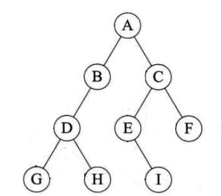
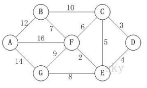
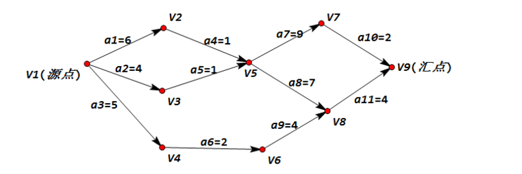

## 1-算法概述

1. 算法的度量方法？时间复杂度的关系？
2. 主要的逻辑结构？计算机存储的物理结构？
3. 数据类型？

## 2-线性表

1. 概念？线性表的存储方式？各个存储方式的存储分配方式、时间性能（查询？插入与删除？），空间性能？
2. 静态链表的主要目的？设计思路？优缺点？
3. 循环列表？主要解决的问题？

## 3-栈与队列

1. 栈定义？Dijkstra的双栈算术表达式？变长栈实现与缺点？
2. 列表定义？队列顺序存储的不足？添加元素与出队的时间复杂度？挪动队首解决办法的缺点？

## 4-字符串

1. 串的定义？与线性表的关系？链式存储与线性表的区别？
2. 朴素模式匹配算法？时间复杂？
3. KMP模式匹配算法？

## 5-树

1. 度、叶子结点、分支结点、树的度？

2. 有序树？森林？线性结构与树结构

3. 树的主要操作？树的存储结构常见的3种方式？以及各自的优势

4. 二叉树特点？斜树？满二叉树？完全二叉树？

5. 二叉树的存储方式？优缺点？

6. 二叉树的遍历方法？前序遍历、中序遍历、后序遍历、层序遍历的口诀？如下图的遍历结果

	

7. 如前序遍历序列为ABCDEF，中序为CBAEDF，后序排列应该为什么呢？

8. 线索二叉树？

9. 树转换为二叉树？森林转换为二叉树？这种转换好处？

10. 赫夫曼树定义与原理？路径长度？树的路径长度？

11. 赫夫曼编码的意义？构造赫夫曼编码

## 6-图

1. 与线性表、树，图：元素称呼，没有数据元素，相邻元素关系之间的区别？

2. 无向边与无向图？有向边与有向图？简单图？无向完全图，多少条边的计算？有向完全图，多少条边的计算？稀疏图？网

3. 顶点的度？图的边与顶点度数之间的关系？有向图的度？路径？树的路径与图路径之间的差别？路径长度？

4. 环或回路？简单环？

5. 连通图？连通分量？强连通图？

6. 图的存储结构？邻接矩阵及其存在的问题？邻接表及其缺点？十字链表特点？邻接多重表？边集数组？

7. 图的深度优先遍历？广度优先遍历？

8. 最小生成树解决的问题？构造的两种算法？

9. 最短路径？迪杰斯特拉算法，求最短路径？

10. Floyd求最短距离

11. 拓扑排序主要解决？AOV网？下图的拓扑排序序列是？

   

12. 关键路径解决的问题？AOE网？关键路径？求下图的关键路径？

    

## 7- 查找

1. 静态表查找和动态表查找？
2. 折半查找？前提？时间复杂度？缺点？
3. 差值查找？时间复杂度？缺点？
4. 斐波那契查找？时间复杂度？三者的异同
5. 索引查找的概述？稠密索引及其要求？分块索引？倒序索引？
6. 二叉排序树主要性质？主要目的？对集合{62,88,58,47,35,73,51,99,37,93}进行二叉排序树构建，分别删除35,58,47节点后的结果？时间复杂度？
7. 平衡二叉树（ALV）解决的问题？平衡二叉树的要求？平衡因子？主要的实现原理
8. B树的主要考虑？2-3树主要特征？B+树的主要特征？
9. 散列技术主要特征？散列表的构建？散列函数的构造方法？

## 8-排序

1. 排序稳定性？内排序？外排序？排序的性能影响？

2. 冒泡排序？时间复杂度？比较次数？可以优化的方式？

3. 简单选择排序？最大的特点是？比较次数？交换次数？复杂度分析

4. 直接插入排序？与选择排序的不同点？

5. 希尔排序？

6. 堆排序的定义，大顶堆与小顶堆？时间复杂度？

7. 归并排序？最好，最坏，平均时间复杂度？

8. 快速排序？时间复杂度

	

