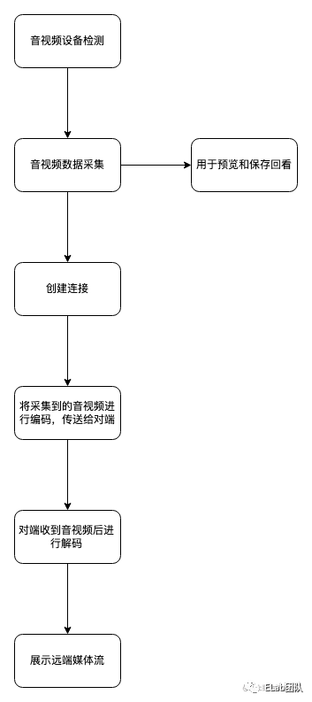

# UDP

## 概述

1. TCP使用分组，UDP使用数据报
   - 分组可以用来指代任何格式化的数据块；
   - 数据报则通常只用来描述那些通过不可靠的服务传输的分组，既不保证送达，也不发送失败通知  
2. WebRTC（ Web Real-Time Communication， Web 实时通信），着眼于在浏览器中通过 UDP 实现原生的语音和视频实时通信，以及其他形式的 P2P（ Peer-to-Peer， 端到端）通信。  
3. UDP，Unreliable Datagram Protocol  （u本来是user，但很多时候理解为Unreliable），称之为不可靠数据报协议

## 无协议服务  

1. IP层主要任务就是按照地址从源主机向目标主机发送数据报 ，这个数据报暗示，IP层并不保证消息可靠交付，将底层网络的不可靠性暴露给上层，让上层去解决
2. UDP协议用自己的分组结构封装用户信息，只增加了4个字段（源端口、目标端口、分组长度和校验和），校验和IP分组也有，因此，所有错误检测和错误纠正工作都委托给上层的应用程序。  
3. UDP 仅仅是在 IP 层之上通过嵌入应用程序的源端口和目标端口，提供了一个“应用程序多路复用”机制  

## UDP与网络地址转换器  

1. 由于IPv4地址只有32位长，最多提供42.9亿个唯一IP地址
2. 为解决地址要耗尽的问题，IP 网络地址转换器（ NAT， Network Address Translator） 规范出台了
3. 这样NAT设备后的IP地址空间可以在各种不同网络重用
4. 为了防止路由错误，IANA（ Internet Assigned Numbers Authority， 因特网号码分配机构） 为私有网络保留了三段IP地址，即不允许外网计算机分配这些地址
   - 10.0.0.0~10.255.255.255      16 777 216个  
   - 172.16.0.0~172.31.255.255    1 048 576  个
   - 192.168.0.0~192.168.255.255   65 536  个

### 连接状态超时  

1. 主要为了解决，不可以预测的连接状态（UDP）
2. NAT 转换的问题（至少对于 UDP 而言）在于必须维护一份精确的路由表才能保证数据转发。  
3. TCP有状态，从握手到关闭连接，路由设备可以监控连接状态，创建和删除NAT路由表的条目，但UDP没有状态
4. UDP并不报告何时停止传输数据，因此，UDP路由记录会定时过去，至于时间是多少，会根据不同设备有不同
5. 对于较长时间的 UDP 通信，有一个事实上的最佳做法，即引入一个双向 keep-alive 分组，周期性地重置传输路径上所有 NAT 设备中转换记录的计时器。  

### NAT分类

1. 从实现技术角度，可以将NAT分为
   - 全锥NAT（Full Cone NAT）： 把所有来自相同内部 IP 地址和端口的请求映射到相同的外部 IP 地址和端口；任何一个外部主机均可通过该映射发送数据包到该内部主机。 
   - 限制性锥 NAT：与（1）的主要区别是，只有当内部主机先给外部主机发送数据包, 该外部主机才能向该内部主机发送数据包 
   - 端口限制性锥 NAT：与（2）的主要区别是，需要先抢外部主机+端口号发送数据包
   - 对称NAT：与上3个都不同，在与外部主机通信时，会分配不同的端口号

### NAT穿透

1. 要让处于 NAT 设备之后的拥有私有 IP 地址的主机之间建立 P2P 连接，就必须想办法穿透 NAT 
2. 如下图，ClientA-1要直接与ClientB-1进行p2p通信
3. 如ClientA-1看到ClientB-1在线，需要与B进行交流
4. 全锥NAT不需要任何辅助手段，但限制性NAT是不允许内部主机直接通信的，所以果现在 ClientA-1 直接发送 UDP 数据包到 ClientB-1 ，那么数据包将会被 NAT-B 无情的丢弃 
5. 解决办法：

- ClientA-1发送数据包给 Server ，请求和 ClientB-1 通信。
- Server 将 ClientA-1 的地址和端口发送给 ClientB-1 ，告诉 ClientB-1，ClientA-1 想和它通信。 
- ClientB-1 向 ClientA-1发送 UDP 数据包，当然这个包在到达 NAT-A 的时候，还是会被丢弃，这并不是关键的，因为发送这个 UDP 包只是为了让 NAT-B 记住这次通信的目的地址：端口号，当下次以这个地址和端口为源的数据到达的时候就不会被 NAT-B 丢弃，这样就在 NAT-B 上打了一个从 ClientB-1 到 ClientA-1 的孔。 
- 为了让 ClientA-1 知道什么时候才可以向 ClientB-1 发送数据，之后还要向 Server 发送一个消息，告诉 Server 它已经准备好了。 
- Server 发送一个消息给 ClientA-1 ，内容为：ClientB-1 已经准备好了，你可以向 ClientB-1 发送消息了。
- ClientA-1 向 ClientB-1 发送 UDP 数据包。这个数据包不会被 NAT-B 丢弃，以后 ClientB-1 向 ClientA-1 发送的数据包也不会被 ClientA-1 丢弃，因为 NAT-A 已经知道是 ClientA-1 首先发起的通信。

## 针对UDP的优化建议  

1. UDP 是一个简单常用的协议，经常用于引导其他传输协议，是面向消息的最简单的传输层协议
2. UDP应用程序必须自己实现诸如，连接状态、拥塞预防、流量控制等机制，需要好好研究下RFC 5405这个文档
3. WebRTC 就是符合RFC 5405要求的框架  

# WebRTC

## 概述

1. RTC 是 Real-Time Communication 的简写，正如其中文名称 “即时通讯” 的意思一样
2. WebRTC 则是 Google 基于 RTC 协议实现的一个开源项目，为 Web 页面提供了实时音视频传输所需的能力（前端部分）；
3. RTC 有一个非常重要的特性，它是一个支持点对点直接传输的 P2P 协议

### 其他普通直播协议

1. HLS：至少下载一个 ts 切片才能播放
   - 延迟一般会高于普通的流媒体直播协议，传输内容包括两部分：一部分 M3U8 是索引文件，另一部分是 TS 文件，用来存储音视频的媒体信息
2. RTMP：目前主流的流媒体传输协议之一，对CDN支持良好，实现难度较低，pc广泛支持，但不支持浏览器与IOS，Adobe 已停止对其更新

## 通信的大体过程



### 音视频设备检测

1. MediaDevices.enumerateDevices()

   ```javascript
   navigator.mediaDevices.enumerateDevices().then(function(deviceInfos) {
     deviceInfos.forEach(function(deviceInfo) {
       console.log(deviceInfo);
     });
   })
   ```

   -  kind 字段可以区分出设备是音频设备还是视频设备
   - 如果我们不指定某个具体设备，采集音视频数据时，就会从设备列表中的默认设备上采集数据

2. getUserMedia方法进行设备检查

   - 视频：用户能看到自己的视频，即有效
   - 音频：需要用js将处理后的音频展示在页面上判断

### 采集

1. 一般帧率达到 10～12fps 人眼就会觉得是连贯的，超过 75fps 一般就不容易察觉到有明显的流畅度提升了
2. 主要使用：`MediaDevices.getUserMedia()`
3. 音视频录制
   - 使用 getUserMedia 接口获取视频流数据
   - 使用 MediaRecorder 接口进行录制（视频流数据来源上一步获取的数据）
   - 使用 MediaRecorder 的 ondataavailable 事件获取录制的 buffer 数据
   - 将 buffer 数据转成 Blob 类型，然后使用 createObjectURL 生成可访问的视频地址
   - 利用 a 标签的 download 属性进行视频下载


## RTC优势

1. 大幅度降低服务端的负载，减少成本；
2. 用户间直接进行数据传输，延迟上能带来不小的提升；

## ICE

1. 虽然 RTC 是一个 P2P 的协议，但因为 NAT 墙的存在，就算通讯的双方知道对方的网络地址，也没办法直接沟通
2. 引入一个机制对这个沟通过程进行协调，帮助通讯双方能够越过 NAT 并成功建立连接，这套机制就是 ICE（Interactive Connectivity Establishment）

## RTP

1. 视频一帧的数据需要拆成多个 UDP 数据包进行传递，UDP 并不具备视频帧拆分及组装的能力，所以还需要在其之上构建一个应用层协议来完成音视频传输，即RTP
2. RTP （Real-time Transport Protocol）是一个基于 UDP 的应用层协议

