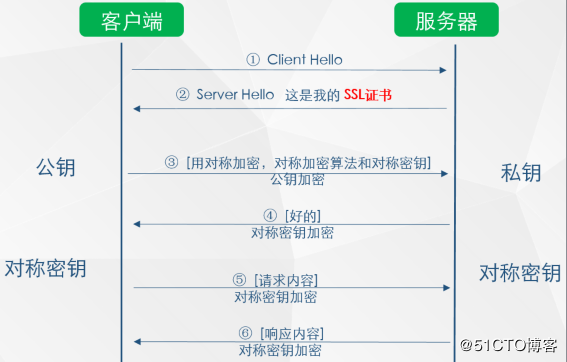

# 传输层安全（ **TLS**）  

## 概述

1. SSL（ Secure Sockets Layer，安全套接字层）协议最初是网景公司为了保障网上交易安全而开发的，该协议通过加密来保护客户个人资料，通过认证和完整性检查来 确保交易安全。  

2. SSL 协议在直接位于 TCP 上一层的应用层被实现  

3. 

4. 后来SSL被标准化改名：Transport Layer Security （ TLS，传输层安全）。  严格来讲它们并不相同，因为它们指代的协议版本不同  

5. TLS设计初衷是在TCP上使用的，UDP上的实现是DTLS，以TLS为基础

6. TLS提供三项基本服务：加密、身份验证和数据完整性

	

## TLS与SSL区别

1.  SSL由网景公司开发，现在使用版本3，而TLS是SSL标准化后的产物
2. TLS建立在SSL 3.0协议规范之上，是SSL 3.0的后续版本
3. TLS的主要目标是使SSL更安全，并使协议的规范更精确和完善

## 加密方式

## 对称加密

1. 需要密钥S加密，并利用密钥S进行解密，但对于多客户端，需要使用多个密钥进行加密解密，否则用一个密钥对所有客户端进行加密，相当于没有加密

	

2. 主要问题是：A通过明文传输和server协商采用了加密算法A，但这条信息本身是没有加密的，可能存在加密算法A被窃取的风险

## 非对称加密

### 概述

1. 主要特点是：私钥加密，公钥解密；公钥加密，私钥解密；私钥只能一人所有，公钥可以发给所有人
2. 如客户端拿有公钥，则客户端往server发送数据是安全的，因为只有服务器的私钥可以解密
3. 但server往客户端发送数据是不安全的，因为公钥大家都有

### 安全的获取公钥

1. client获取公钥最直接的方法是server端将公钥发给每一个clien用户，但如果被中间劫持

	

	- 如MAN-IN-MIddle劫持了server下发的公钥，则可以替换为自己的公钥给client

2. 为解决如何安全获取公钥的问题：使用SSL证书（需要购买）和CA机构

### SSL证书和CA

1. 客户端请求数据，服务端发送回SSL证书
2. 对SSL证书中的CA与客户端内置的CA进行对比，如可信则取出证书中的公钥
3. 这样就可确保公钥是安全的了

## TLS握手  

1. 握手机制中设计最巧妙的地方，就是其使用的公钥密码系统 （也称“非对称密钥加密”）  
2. TLS在TCP之上运行，故需要等TCP三次握手后进行
3. 主要步骤（往返一次28ms）：

- 0ms：TCP三次握手，即一个完整往返；
- 56ms：客户端发送TLS版本，加密套件列表，支持的TLS选项等
- 84ms：服务器从加密套件中选一个，附上自己的证书
- 112ms：客户端生成一个新的对称密钥，用服务器给的公钥（证书中取出）加密发给服务器，这之前的数据都是明文
- 140ms：服务器解密，验证信息的MAC检测信息完整性，给客户端发送加密的finished信息
- 168ms：客户端用之前生成的对称密钥解密，验证MAC，一切顺利，则可以加密通信

### 应用层协议协商（ ALPN）  

1. 理论上，网络上的任意两端都可以使用自定义的协议进行通信。为此，需要提前确定使用什么协议、指定端口号（ HTTP 是 80， TLS 是 443），并配置所有客户端和服 务器使用它们。  
2. 在实践中，这种方法效率很低且很难做到。因为每个端口都必须得到认可，而防火墙及其他中间设备通常只允许在 80 和 443 端口上通信 
3. 为了简化自定义协议的部署，我们往往必须重用 80 或 443 端口
4. 80端口为HTTP保留，协商协议需要一次额外的往返时间，因此解决办法是使用443端口
5. 应用层协议协商（ ALPN， Application Layer Protocol Negotiation）作为 TLS 扩展，让我们能在 TLS 握手的同时协商应用协议（图 4-2），从而省掉了 HTTP 的 Upgrade 机制所需的额外往返时间。  

### 服务器名称指示（ SNI） 

1. SNI（ Server Name Indication，服务器名称指示）扩展被引入 TLS 协议，该扩展允许客户端在握手之初就指明要连接的主机名。  
2. 主要解决：如果服务器想在一个 IP 地 址为多个站点提供服务，而每个站点都拥有自己的 TLS 证书的问题（类似于相同IP地址服务不同域名）

## TLS会话恢复 

1. TLS握手会带来额外的延迟与计算量，为了挽回某些损失， TLS 提供了恢复功能，即在多个连接间共享协商后的安全密钥。  

### 会话标识符 （会话缓存  ）

1. 服务器与客户端都会保存会话ID和协商后的会话参数，假如客户端和服务器都在缓存中找到共享的会话 ID 参数，就可以进行简短握手
2. 借助会话标识符可以节省一次往返，还可以省掉用于协商共享加密密钥的公钥加密计算。  
3. 主要问题是：服务器需要维护一段会话缓存，如服务器每天有几百万独立连接，内存消耗会很大，但通过一套会话缓存和清除策略并不是无解

### 会话记录单 

1. 为解决上述问题，将所有会话数据保存在客户端
2. 服务器可以在完整 TLS 握手的最后一次交换中添加一条“新会话记录单”（ New Session Ticket）记录，包含只有服务器知道的安全密钥加密过的所有会话数据。
3. 保存在客户端的数据是服务器加密的，故数据也是安全的

## 信任链与证书颁发机构  

1. 理解如何验证通信两端的身份
   - A,B分别生成自己的公钥和私钥
   - 双方交换公钥（如可以当面交换）并隐藏私钥
   - 发信息使用私钥加密
   - 接收信息使用公钥解密
2. 信任链，就是A信任B，B信任C，则A信任C
   - A信任B，B信任C，C给A发信息，A需要验证C是可信任的
   - C用B的私钥加密自己的公钥，并在信息中附上签名
   - A收到C的信息后，用B的公钥解密，可以验证B确实签署了C的公钥
   - A信任B对C的签名，这个过程建立了信任链
3. 实践中，保存并手工验证每个网站的密钥是不可行的，因此一般浏览器是指定可信任的证书颁发机构（根CA），然后让他们去验证
4. 所有操作系统和浏览器在默认情况下都会提供一个它们信任的证书颁发机构名单  

## 证书撤销 

1. 由于种种原因，证书可能会作废或撤销
2. 为此，证书本身会包含如何检测其是否过期的指令

### 证书撤销名单（ CRL） 

1. 一种检查所有证书状态的简单机制：每个证书颁发机构维护并定期发布已撤销证书的序列号名单
2. 任何想验证证书的人都可以下载这个名单，判断证书是否过期
3. 主要问题：
   - 会随着撤销的证书增多而增多
   - 无法立即更新刚刚被撤销的证书序号

### 在线证书状态协议（ OCSP） 

1. 提供了一种实时检查证书状态的机制，支持验证端直接查询证书数据库中的序列号
2. 存在问题：
   - CA需要处理实时查询
   - CA必须保持随时可以访问
   - CA知道客户端要访问哪些站点，可能会泄露隐私
3. 实践中，一般是OCSP与CRL互补存在

## TLS记录协议 

1. TLS 记录协议负责识别不同的消息类型（握手、 警告或数据，通过“内容类型”字段），以及每条消息的安全和完整性验证。  

## 针对TLS的优化建议

1. 在 TLS 之上运行应用与直接通过 TCP 通信没有什么不同，因此对应用少量改动或不改动就可以在TLS通信 
2. 了解优化建议：禁用TLS压缩（有安全漏洞）、减少证书链的长度（避免证书链里面有不必要的整数）、TLS记录大小调整（小记录会造成浪费，大记录会造成延迟）等，实际上，接触不到TLS的这些复杂性
3. 可以使用 Qualys SSL Server Test（ https://www. ssllabs.com/ssltest/）等在线服务来扫描你的服务器，以发现常见的配置和安全漏洞。 此外，通过 openssl 命令行工具  检查本地服务器配置情况

