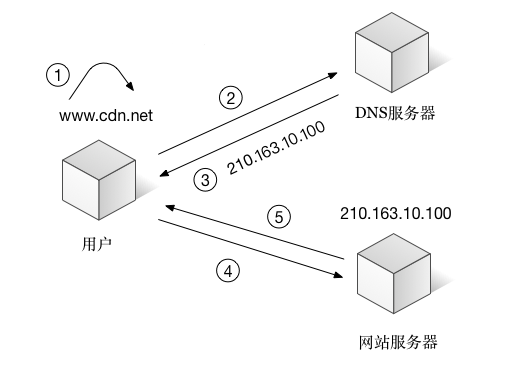
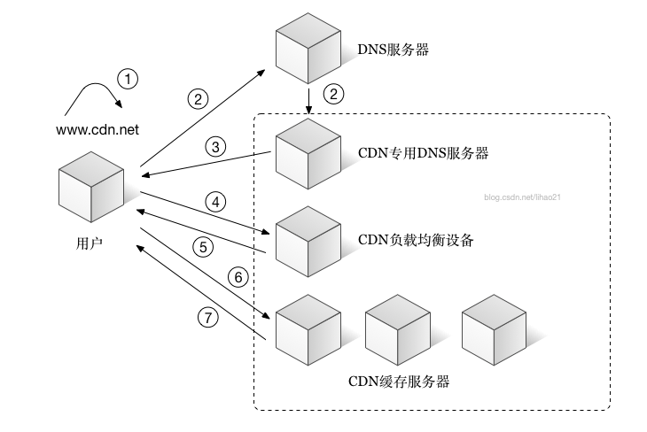

# CDN

## 概述

1. CDN（Content Distribute Network）内容分发网络
2. 解决的是如何将数据快速可靠从源站传递到用户的问题。
3. 用户获取数据时，不需要直接从源站获取，通过CDN对于数据的分发，用户可以从一个较优的服务器获取数据，从而达到快速访问，并减少源站负载压力的目的。

## 基本过程

### 传统模式

### cdn模式

1. 用户输入要浏览的域名
2. 浏览器向DNS请求域名解析，因为cdn对域名解析进行了调整，DNS会将解释权交给CDN专用DNS服务器
3. CDN负载设备会选择一个距离用户最近的服务器