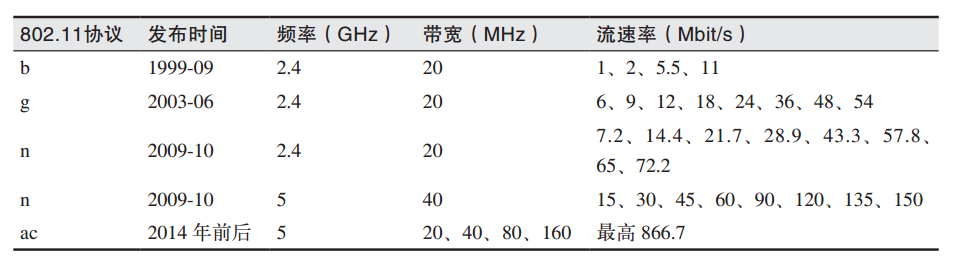
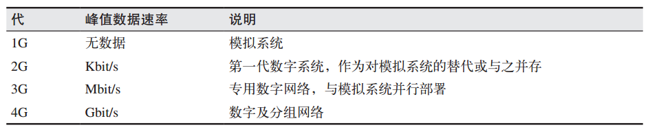
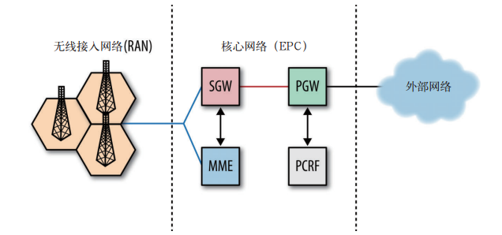
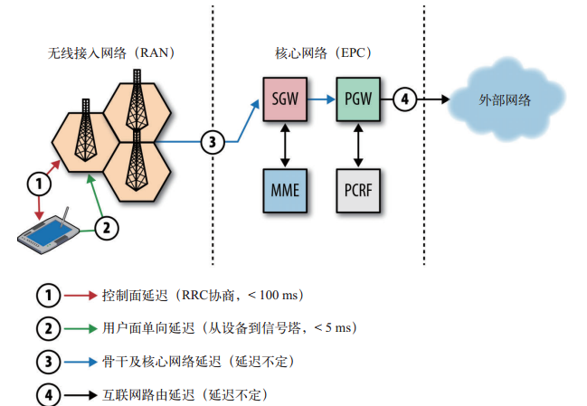
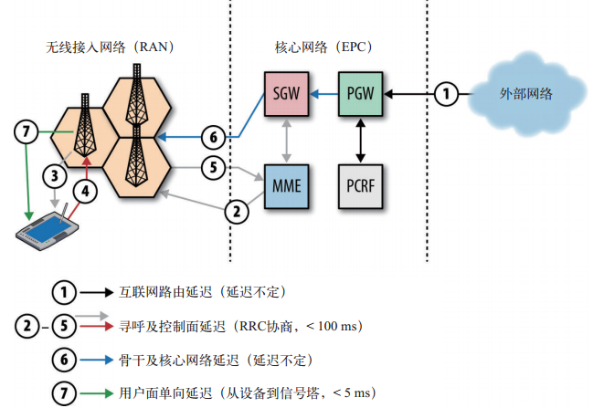
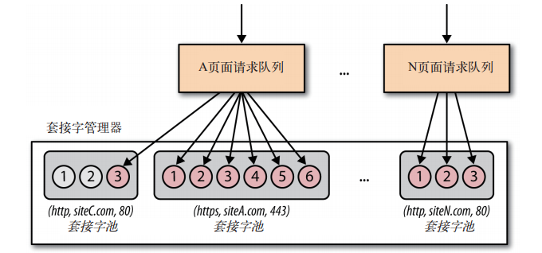

# 概述

## 书目

1. 20181204《Web性能权威指南》
	- 书以性能优化为主线，从物理层到最上层介绍影响性能的地方以及能优化的措施，但如udp等优化可能更像是一个网络优化工程师
	- 部分知识讲的不详细，如nat等，看这书并不能十分理解
	- 13章对性能优化做了整体概述，对实现http服务器的优化进行介绍

## 涵盖内容

1. TCP、UDP、LTS、HTTP等协议概述

# 第一章  延迟与带宽

## 1.1　速度是关键  

1. 所有网络通信都有决定性影响的两个方面：延迟和带宽  

## 1.2　延迟的构成  

1. 任何系统都有很多因素可能影响传送消息 的时间。  
2. 传播延迟：消息从发送端到接收端需要的时间，一般传输速速不会超过光速，故传输延迟与距离有关
3. 传输延迟：把消息中的所有比特转移到链路中需要的时间，把消息转移到链路上，与距离无关，假设有一个 10 MB 的文件，分别通一个 1 Mbit/s，另一个 100 Mbit/s 传输，在 1 Mbit/s 的链路上，需要花10 s，而在 100 Mbit/s 的链路上，只需 0.1 s 
4. 处理延迟：处理分组首部、检查位错误及确定分组目标所需的时间 ，虽然是硬件处理，而且非常快，但也是需要有延迟的
5. 排队延迟：如果分组到达的速度超过了路由器的 处理能力，那么分组就要在入站缓冲区排队  

## 1.3　光速与传播延迟  

1.  光纤在纽约与旧金山（16000km）传输一个来回约160ms，如计算涉及寻路、处理、排队和传输延迟，大约在 200~300 ms 之间
2. 研究表明：在软件交互中，哪怕 100~ 200 ms 左右的延迟，我们中的大多数人就会感觉到“拖拉”；如果超过了 300 ms 的 门槛，那就会说“反应迟钝”；  因此，要给用户最佳体验，应用最好在几百ms之内响应
3. question：如北京直接连接纽约服务器（15000km），响应应该也有200ms，怎么降低到10几毫秒？？？？？？？
4. CDN（ Content Delivery Network，内容分发网络）：通过把内容部署在全球各地，让用户从最近的服务器加载内容， 大幅降低传播分组的时间。通过改变传输距离，降低延迟

## 1.5　网络核心的带宽  

1. 光纤就是一根“光导管”，比人的头发稍微粗一点  
2. 到 2010 年初，研究人员已经可以在每个信道中耦合 400 多种波长的光线，最大容量可达 171 Gbit/s，而一条光纤的总带宽能够达到 70 Tbit/s  
3. 每条光缆会封装几条光纤（常见的是 4 条） 

## 1.7　目标： 高带宽和低延迟  

1. 虽然不一定很便宜，但我们有很 多方法可以提高容量 ，比如部署更多光纤，提高WDM（波分复用）技术等，相对而言还是可以提高的
2. 降低延迟则要困难得多 ，传播速度提供困难（发明更好的传输材料，降低损耗），缩短距离（如现在铺设的光纤，由于地形、政治等原因并不是最短的）

# 第五章  无线网络概况

## 无线网络的类型

1. 很多技术和标准最初都源自某个特定的使用场景，例如蓝牙技术最初就是针对PAN（个人局域网、个人活动范围）应用和为替代线缆而出现的、WiMAX最初是定点无线连接等，但随着技术的发展，界限也不那么鲜明了
2. 了解无线网络类型，主要不是为了区分界限，要突出的是各种使用场景下的宏观差异，如有些设备不需要考虑节省电量，有的生来只能传输几十到几百字节数据（如NFC）等
3. 类似的，应用使用NFC进行付款，蓝牙实现基于WebRTC的P2P通信，通过wifi传输高清视频等。

## 无线网络的性能基础 

1. 根据香农定律，在所有这些因素中，与数据传输速度最直接相关的就是接收端与发送端之间的可用带宽和信号强度  

### 带宽 

1. 无线通信使用的无线电波，即电磁辐射，通信前提是使用相同的频率范围
2. 如802.11b 和 802.11g 在所有 Wi-Fi 设备上都使用 2.4~2.5 GHz 频带 
3. 地方政府会负责频带的分配，因此不同国家不同地区对相同的无线技术分配的频率范围可能不同
4. 根据香农公式，在其他条件等同的情况下，频率范围加倍，传输速度加倍 
5. 但要注意的是，并不是所有频率范围的性能是一样的，低频信号传输距离远，覆盖广，但要求天线更大、而且竞争更激烈 

### 信号强度 

1. 所有无线电通信使用的都是共享媒体，因此别的设备很可能在这个媒体中产生干扰信号。比如，以 2.5 GHz 频率工作的微波炉很可能与 Wi-Fi 使用的频率范围重合，从而产生交叉干扰
2. 如果想在存在干扰的情况下达到预期的数据传输速度，要么增大发射功率，也就是提高信号强度，要么缩短收发两端的距离

### 调制 

1. 用于编码信号的算法对无线性能同样有显著影响 
2. 调制主要是将数字信号转换为模拟信号，通过电磁波发送出去
3. 如接收端和发送端每秒可以处理1000个脉冲或符号（1000波特）
4. 信道的比特率是1000*2比特/符号（每秒2000比特）
5. 要理解调制算 法确实会影响无线信道的容量，但同时它也会受到 SNR、可用处理能力， 以及其他常见制约因素的影响  

## 测量现实中的无线性能  

1. 所有无线技术都在宣传自己的峰值或最大数据速率。比如， 802.11g 标准的最大传输速率为 54 Mbit/s，而 802.11n 标准则提高到了 600 Mbit/s。类似地，某些移动运 营商宣传自己能通过 LTE 提供 100+ MBit/s 的上网速度  
2. 但这些速率都是在带宽最大、频段独有、噪声最小、调制算法最优等理想情况下
3. 度量无线网络性能并不容易，如接收端离发送端近十几厘米，可能速率会翻倍

# 第六章 Wi-Fi

## 从以太网到无线局域网

1. 802.11 无线标准主要是作为既有以太网标准（ 802.3）的扩展来设计的
2. 以太网与Wi-Fi协议调度通信方式是：把共享媒体（无论是线缆还是无线电波） 视为“随机访问通道”，即没有中心控制环节或者调度中心控制谁或哪台设备在哪个时刻可以发送数据
3. 以太网过去的标准是依赖于概率访问CSMA，意思是：
	- 检查是否有人正在发送； 
	- 如果信道忙，监听并等待信道空闲； 
	- 信道空闲后，立即发送数据。 
4. 信号传播需要时间，冲突也会发送，以太网增加了冲突检测机制 ：如果检测到冲突，则双方都立即停止发送数据并小睡一段随机的时间 
5. Wi-Fi采用冲突避免机制解决冲突：每个发送方都会在自己认为信道空闲时发送数据， 以避免冲突

## Wi-Fi标准及功能

1. 

## 测量和优化Wi-Fi性能

1. Wi-Fi 标准没有规定任何中央调度机制，因而对任何客户端的吞吐量和延迟都不提供保证 
2. 同一个地方覆盖多个Wi-Fi网络，其中一些网络一定会重叠，如邻居正在用wifi看高清视频，你的带宽就会减少一半，甚至不到一半，因为你需要跟同一信道内的其他无线客户端竞争  
3. Wi-Fi 性能的哪些重要因素 ：
	- 不保证用户的带宽和延迟时间  
	- 信噪比不同，带宽也随之不同  
	- 发射功率被限制在 200 mW 以内  
	- 信道分配决定了接入点信号会重叠  
	- 接入点与客户端争用同一个无线信道  
4. Wi-Fi 网络的设计天然会导致多个客户端的大量冲突  

# 第七章 移动网络

## G字号移动网络简介

1. 四代移动网络

2. 每一代无线技术都以其峰值频谱效率（ bps/Hz）为标志，为了让用户直观理解，这个会转换为数据传输速率，如4G传输速率以Gbit/s来衡量，但这都是理想状态下

	

## 设备特性及能力  

1.  无线网络的性能一半是由于协议、频谱等，另一半来源于不同厂商的设备，如CPU速度，核数，内存大小等
2. 还要考虑UE的无线电收发能力，3GPP和3GPP2标准的推行，即是不断提高对无线电接口的要求，包括调制方法、射频数量等等
3. 为保证性能最佳，设备需要达到每种网络的要求

## 无线电资源控制器（ RRC）  

1. 3G 和 4G 网络都有一个独特的装置，无线电资源控制器（ RRC， Radio Resource Controller ）  ，负责调度协调移动设备与无线电基站之间所有的通信连接
2. RRC 直接影响延迟、吞吐量和设备电池的使用时间  
3. 在2G、3G网络中RRC在核心运营网络，4G移动到了无线信号塔（eNodeB）
4. 这小结主要叙述，现在的各网都有RRC，为避免电池消耗，会将无线电模块在连接与空闲之间切换，但RRC切换是根据定时器超时进行的，如设计的应用请求数据小于这个超时，那么会造成很大的耗电；举例说上层应用，如间隔60s发送分析报告，可能会造成46%的电量消耗，因此，上层应用的功能设计可能会因为RRC的控制造成电池无法进入空闲

### 3G\ 4G和Wi-Fi对电源的要求  

1. 实践中，必须在保持无线电开启以降低通信延迟，与保持低电量消耗以延长待机时间之间取得平衡。  
2. wifi网络中，每个设备自己设定传输功率，通常30-200mW，而3G/4G网络发射功率由网络说的算，考虑到覆盖范围大干扰等情况，可能会达到1000-3500mW
3. 信号强度足够大，通信效率就会越高，但就会越耗电，因此，要获得最佳性能，最理想的做法就是能够在不同类型的连接之间动态切换。  
4. 吞吐量和延迟时间都与设备的功率管理策略直接相关，设备发送功率越高，吞吐量越大，为了省电，需要停止发射无线电，断开与eNodeB的数据信道，这意味每次数据传输之前都需要有几十毫秒甚至几百毫秒的延迟
5. 3G和4G网络的无线电功率都是由RRC控制，RRC会告诉什么时候开始通信，发射功率多大

### LTE RRC状态机

1. 所有 LTE 设备的无线电状态都由当前为用户提供服务的无线信号塔控制。  
2. 状态机描述了连接到网络的每个设备的功率状态 
3. 设备要么处于空闲状态，要么处于连接状态。处于空闲状态时，设备只监听控制信道的广播，不能发送或接收任何数据，如想发送数据需要向RRC发送切换到“已连接”请求，经过几次往返，网络准备就绪后可以发送数据
4. 数据传输结束，RRC状态机依赖于计时器来触发状态切换
5. LTE 的性能更好，就是因为它简化了状态机的架构，从而提升了状态切换的性能，更高的吞吐量需要更改的电量支持，故LTE设备的耗电量比之前的 3G 设备高得多。  

## 端到端的运营商架构 

1. 介绍这个的目的：介绍那些直接影响运营商网络中数据流的因素，以及它们影响我们应用性能的原因。  

### 无线接入网络（ RAN）

1. 主要任务是把请求转发到分配好的无线信道，从用户设备接收或者向用户设备发送数据  

### 核心网络

1. 核心网络（EPC（ Evolved Packet Core，演进分组核心网） ，就是把无线网络和公共互联网连接到一起的部分
2. 分组网关PGW：充当的NAT的角色，负责分配和维护IP地址；由于终止外部链接的是PGW，故设备无线电模块的状态（空闲、活动、休眠），不会与任何外部连接的状态相关
3. 服务网关SGW
4. 移动管理实体MME：管理着网络上所有用户的全部状态，如网络位置、用户类型等
5. 如PGW从公共互联网接收到一个分组，需要给某个用户，PGW把分组给SGW，SGW向MME查询用户所在位置、服务信号塔等信息，然后SGW利用这些信息建立与信号塔连接，然后将数据转发给无线接入网

### 回程容量与延迟

1. LTE 无线接口下的用户与信号塔之间可以达到 100 Mbit/s 的速度，但每个信号塔需要服务多个用户，信号塔与核心网连接会受到速率限制
2. 真正体验4G（网速快），不仅仅是部署新的无线网络，还需要EPC 和无线网络之间必须存在容量足够大的链路 
3. 理解为：无线接口提高了速率，如用户和基站的信息传输速率很快，但无线接入网与核心网并没有部署新的链路，故网速也不会提高

## 移动网络中的分组流  

1. 看一看端到端的分组数据流，从而揭示出延迟时间变化不定的原因  
2. 主要是分析手机请求一个url和外部网络发给UE一个数据的延迟问题
3. 第一个分组延迟会略长一些

### 初始化请求 

1. 在手机浏览器输入url的过程
2. 第1步：由于手机处于空闲状态，需要先发送请求（给RRC），建立无线通信环境
3. 第2步：用户数据到信号的传输延迟，第一个分组需要RRC切换，故花的时间略多
4. 第3步：无线接入网到核心网是延迟，不确定
5. 第4步：PGW到外部网络的延迟，不确定
6. 当用户请求完数据，无线电模块空闲几十秒，RRC可能将用户切换到短不连续接收（DRX）状态，再请求URL，RRC切换状态速度会略快于无线电模块在空闲状态时
7. 1,2两步的延迟时间是4G标准，不同标准延迟时间不同

### 入站数据流  

1. 外部网络需要给用户一个数据
2. 第1步：外部网络到PGW，延迟不定
3. 第2-5步（寻呼过程）：PGW将分组给SGW，SGW通过MME去查询基站，确定用户信息，并让用户与无线接入网建立无线环境，延迟小于100ms
4. 第6步：SGW把数据传输给无线接入网，延迟不定
5. 第7补：信号塔将数据传输给用户，延迟小于5ms
6. 设备一旦处于连接状态，就可以跳过2-5步（不用再经过寻呼） 

## 异质网络（ HetNet）

1. 现有 4G 无线及调制技术已经接近无线信道的理论极限。事实上，下一个改进无线性能的研究方向不在无线接口，而在智能无线网络拓扑。  
2. HetNet背后思想是：将大的小区进行细分为小的分区，但通过划分将无线网络部署为层叠式的，提供更高的网络容量，覆盖更广泛的地理区域。
3. 这对我们意味着：由于小区变多，会出现更多的不同小区之间的切换  

# 第8章 移动网络优化建议

## 节约用电 

1. 在一个功能需不需要开发时，可以考虑下这个功能对电量的影响
2. 应该尽最大可能在无线电开启时传输数据， 而尽量把唤醒无线电以传输数据的次数减到最少。  

## 消除周期性及无效的数据传输 

1. 简单地把多个通知集合到一个推送事件中，可以显著提升任何应用的电池效率 
2. 在客户端无线模块激活时再进行推送更新，如把消息延迟到客户端发了请求再发送推送
3. 周期性轮询会大大消耗电能，如无线模块从空闲切换到连接状态需要消耗10J，10分钟一次的轮询，1小时就600J，电池可能才18000J，占了3%
4. 消除不必要的长连接：大多数移动运营商的 NAT 连接超时时间为 5~30 分钟  ，因此，keep-alive保持连接的请求可以多于5分钟发送

## 爆发传输数据并转为空闲  

1. 移动无线接口专门为爆发性传输做过优化， 因此对于移动端渐进加载资源在移动网络中弊大于利。每次只下载 一点数据会导致应用的吞吐量和延迟都摇摆不定  
2. 要尽可能预先下载数据，预测用户接下来可能需要看什么，提前下载，尽量让无线模块空闲

# 第11章  浏览器网络概述

1. 现代浏览器完全是一个囊括数百个组件的操作系统，包括进程管理、安全沙箱、分层的优化缓存、JavaScript 虚拟机等等 
2. 每个组件都很重要，但网络组件通常是加倍重要，因为浏览器慢就慢在等待网络资源上，等待造成后续环节被阻塞！  
3. 理解如何最恰当地利用浏览器的网络 API、协议和服务，照样能给应用带来显著的性能提升  

## 连接管理与优化 

1. 浏览器中的 Web 应用并不负责管理个别网络套接字（TCP用主机的IP+端口号作为TCP连接的端点，这种端点就叫做套接字 ）的生命周期
2. 浏览器有意把请求管理生命周期与套接字管理分开的  
3.  套接字是以池的形式进行管理的，即按照来源，每个池都有自己的连接限制 和安全约束，比如 (http, www.example.com, 80) 与 (https, www.example.com, 443) 就是两个不同的来源  
4. 自动化的套接字池管理会自动重用 TCP 连接，从而有效保障性能  
5. 但浏览器的网络模块不仅仅是嵌套字的管理，如chrome会根据用户习惯预测下一步操作等

## 网络安全与沙箱

1. 将套接字的管理任务委托给浏览器还有另一个重要的用意：可以让浏览器运用沙箱机制，对不受信任的应用代码采取一致的安全与策略限制。
2. 浏览器可以限制连接数目，保护客户端与服务器的资源不被消耗完
3. 同源策略：限制应用向哪发送请求  

## 资源与客户端状态缓存

1. 在分派请求之前，浏览器会自动检查其资源缓存，执 行必要的验证，然后在满足限制条件的情况下返回资源的本地副本。  
2. 浏览器还提供了会话认证与cookie管理，这样多个标签页可以共享会话认证结果，当一个标签页退出时，所有窗口的会话都失效

## 应用api与协议

1. 例如套接字和连接管理、请求和响应处理、各种安全机制、缓存，等都是浏览器提供的下层服务
2. 在浏览器提供的网络服务最上层，就是应用API和协议
3. 应用API和协议指的是，XMLHttpRequest，Server-Sent Event ， WebSocket，以及和这些协议有着本质区别的WebRTC(端对端交付模型)