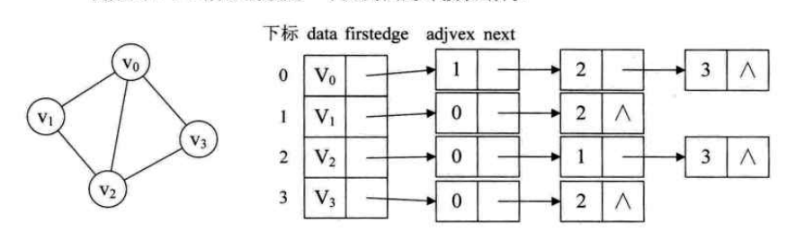
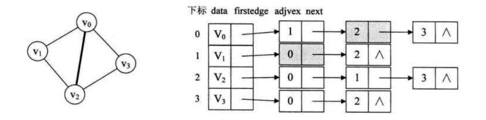
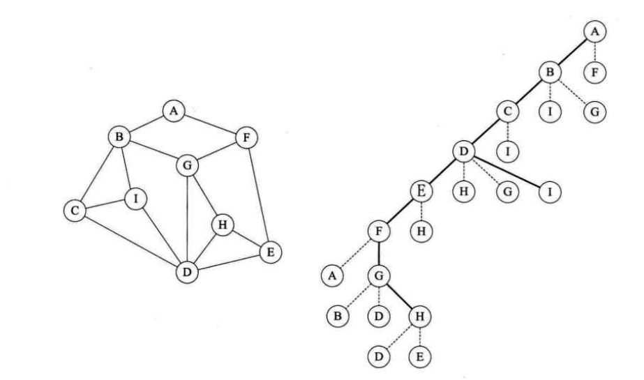
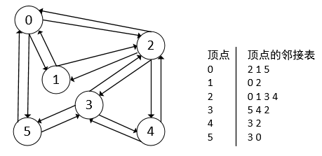
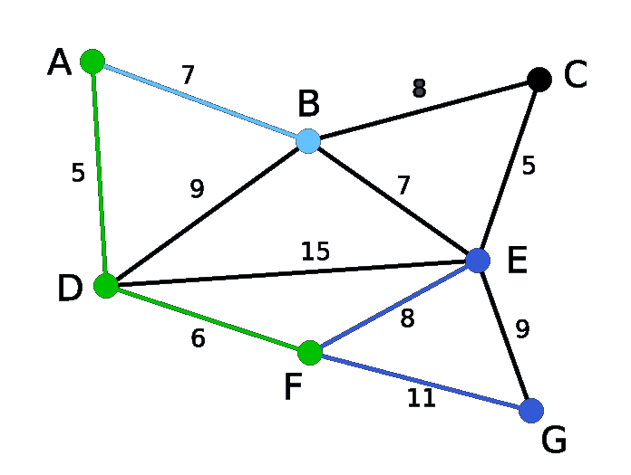
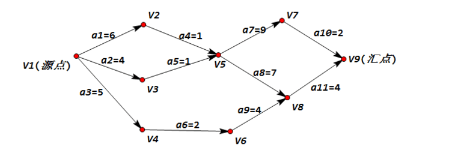
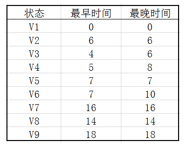

# 图

## 图概述

### 与线性表、树的区别

1. 数据元素的称呼
	- 线性表：元素
	- 树：结点
	- 图：顶点
2. 没有数据元素
	- 线性表：空表
	- 树：空树
	- **图：不允许空，图必须是有穷非空**
3. 相邻元素之间关系
	- 线性表：线性关系
	- 树：层次关系
	- 图：顶点与顶点之间的逻辑关系用边表示；边集可以是空

## 各种图定义

### 无向边与无向图

1. 若顶点V1与V2之间没有方向，则这条边称为无向边，使用无向对偶(vi,vj)表示
2. 任意两条边都是无向边的图称为无向图

### 有向边与有向图

1. 若从顶点v1到顶点v2有方向，则称为有向边，也称为弧，使用有向对偶\<vi,vj\>表示
2. 图任意两条边为有向边，则称为有向图
3. 如下图顶点A到顶点D的有向边表示为：\<A,D\>;写成\<D,A\>是错误的

### 简单图

1. 不存在顶点到自身的边，且同一条边不重复出现，则称为简单图
2. 如下非简单图

### 无向完全图

1. 在无向图中，如任意两个顶点之间都存在边，则称为无向完全图
2. 含有n个顶点的无向完全图有n\*(n-1)/2条边；4个顶点与任意3个都有边为4\*3，但每个顶点之间边计算重复一次

### 有相完全图

1. 如任意两个顶点之间都存在方向互为相反的两条弧，则称为有向完全图
2. 含有n个顶点的有向完全图有n\*(n-1)条边；因为，弧是分方向的

### 稀疏图

1. 有很少条边或弧的图称为稀疏图，反之称为稠密图
2. 这个是个相对概念，如去玩有50w人，感觉是稠密；但第二天看新闻，最多时候是200w，那50w人时候就是稀疏

### 网

1. 有些图的边具有相关数字，这种与图的边相关的数称为权
2. 权可能表示一个顶点到另一个顶点的消耗或路程
3. 这种带权的图通常称为网

### 子图

1. 有向图与无向图都有子图

## 图顶点与边间关系

### 无向图顶点度

1. {width="4.895222003499563in"
	height="0.27079943132108486in"}，则称顶点v与v1互为邻接点，即v与v1相邻接
2. 边(v,v1)依附于顶点v与v1，或顶点(v,v1)与顶点v，v1相关联
3. 顶点v的度是v相关联边的数目，记作TD(v)
4. 图的边是各顶点度数和的一半，
5. 如，AB为邻接点；边(A,B)依附于顶点A和B；顶点A的度为3，图的边为5，

### 有向图顶点度

1. {width="4.259884076990376in"
	height="0.32287620297462816in"}，则称顶点v邻接**到**顶点v1，顶点v1邻接**自**顶点v
2. 弧\<v,v1\>和顶点v,v1相关联
3. 以顶点v为头的弧的数称为v的入度，记作ID(v);
4. 以顶点v为尾的弧的数称为v的出度，记作OD(v)
5. 顶点度为TD(v) = ID(v) +OD(v)
6. 如A的入度为2，出度为1，顶点A的度为3；有向弧4条，各顶点出度和为4，入度和为4

### 路径

1. 顶点v到v1的路径是一个顶点序列

2. 如下，B到D有4条不同路径；BAD；BCD；BCAD；BACD

	

3. 如图是有向图，则路径也是有向的

4. 如下，B到D，则只有BAD与BCAD

	

5. 树中根结点到任意一个结点的路径是唯一的，图顶点到顶点之间的路径却是不唯一的

### 路径长度

1. 路径长度是路径上边或弧的数目
2. 如上面无向图B到D的路径有，BAD；BCD；BCAD；BACD；路径长度分别为2,2,3,3,

### 回路与环

1. 第一个顶点与最后一个顶点相同的路径称为环或回路
2. 简单路径：序列中顶点不重复出现的路径
3. 简单回路或简单环：除第一个顶点与最后一个顶点之外其余顶点不重复出现的的回路
4. 如左图B到D的路径是：BCDAB；只有B重复出现，因此是简单环
5. 右图：B到D的路径是：BCDACB，顶点C重复出现，不是简单环

## 连通图相关定语

### 连通图

1. 如顶点v到顶点v1有路径，称v与v1是连通的
2. 图中任意两个顶点都是连通的，则称图G是连通图
3. 左图为非连通图；右图为连通图

### 连通分量

1. 无向图中的极大连通子图称为连通分量，概念强调：
	- 要是子图
	- 子图要是连通的
	- 连通子图含义极大顶点数
	- 具有极大点数的连通子图包含依附于这些顶点的所有边
2. 如上右图为左图的连通分量
3. 但如下图，则不是上左图的连通分量；因为不具有极大顶点数

### 强连通图

1. 如每一对vi与vj，从vi到vj和从vj到vi都存在路径，称为强连通图
2. 有向图中的极大强连通子图称作有向图的强连通分量

### 生成树

1. 一个连通图的生成树是：一个极小连通图，他含义图全部n个顶点，但只有足以构成一棵树的n-1条边
2. 如图n个顶点小于n-1条边，则是非连通图；
3. N-1条边并不一定是生成树
4. 左图为一个图；右图则为其生成树

### 有向树

1. 如有向图恰有一个顶点的入度为0，其他顶点的入度均为1，则是一颗有向树
2. 入度为0的为根，其余顶点入度为1，说明树的非根结点的双亲只有一个

### 生成森林

1. 一个有向图的生成森林：由若干棵有向树组成，含有图中全部顶点，但足以构成若干棵不想交的有向树的弧
2. 图2，图3是图1有向图的生成森林

## 图的存储结构

### 概述

1. 任意两个顶点之间都可能存在联系，因为无法以数据元素在内存中的物理位置来表示元素之间的关系
2. 图在逻辑上，哪个顶点都可以作为第一顶点，任意顶点也不存在次序关系，因此不可能使用简单顺序结构来表示；
3. 使用多重链表的方式，根据树的多重链表存储方式的讨论，如顶点度相差比较大，按顶点度数存储会造成浪费，如使用每个顶点度数设计存储结构，会带来操作不便

### 邻接矩阵

#### 概述

1. 考虑到顶点与边为两个部分，顶点可以用1维数组，边，即顶点与顶点关系，可以用二维数组存储
2. 图的邻接矩阵存储方式是用两个数组表示图：一个用一维数组存储图中的顶点信息，一个二维数组（称为邻接矩阵）存储图中的边或弧的信息

#### 无向图例子

1. 如下无向图，边数组，行为v0,v1,v2,v3；列为v0,v1,v2,v3，0表示无，1表示有
2. 对角线为0：表示不存在自身到自身的边
3. 无向图的邻接矩阵是对称矩阵；因为对于无向图V0到v1的边存在，v1到v0的边也一定存在
4. 根据邻接矩阵，可以清楚的看出哪两个顶点无边（值为0的）
5. 顶点的度：行或列之和
6. Vi的所有邻接点：行或列扫描一遍

#### 有向图例子

1. 邻接数组的表示方法与无向图一致
2. 有向图的邻接矩阵是不对称的；因为v1到v2有弧，并不一定v2到v1有弧
3. 根据邻接矩阵判断出度与入度：行为出度，列为入度

#### 邻接矩阵存储网（含权的）

1. 无关的边使用无穷符号：因为权重可能是0，正数甚至是负数
2. 每个位置存储的数值为vi到vj的权重

### 邻接表

#### 概述

1. 邻接矩阵存在的问题：如对于边相对于顶点较少的图，邻接矩阵会有大量的0，浪费存储空间
2. 数组与链表相结合的存储方式称为邻接表
3. 顶点用一个一维数组存储，每个数组元素由data与指向邻接点的指针组成
4. 每个顶点的邻接点会构成一个链表

#### 无向图的邻接表

1. 如想知道某个顶点度，则直接遍历链表
2. 如要判断vi与vj是否有边，则直接遍历i的链表是否有j值

#### 有向图的邻接表

1. 顶点以弧尾来存储边表，这样容易计算每个顶点的出度
2. 如想求入度方便，可以使用弧头来存储边表，这种方式建立的邻接表称为：有向图的逆邻接表

#### 网的邻接表

1. 为边表结点定义一个数据域

### 十字链表

1. 邻接表的缺陷是：需要遍历整个链表才能知道入度；而使用逆邻接表，则需要遍历才能得到出度
2. 十字链表是将邻接表与逆邻接表结合起来使用
3. 顶点表结构多了一个firstin与firstout，firstin表示入边表头指针，firstout表示出边表头指针；
4. 而边表则分别表示，弧起始顶点，弧终止顶点，终点相同的下一条边，起点相同的下一条边
5. 比如v1的出指针有v0与v2；把边表头指针认为是v0，故边表元素应该是1，0，headlink，taillink；taillink则指向下一个，即v2，1,2，headlink，taillink；因为v1只有2个出顶点；故边链表只有两个
6. 先将所有出指针写好，然后考虑入指针情况；v0的入指针有v1与v2；那么v0的firstin指向v1边表头元素，这个头元素的headlink指向v2边表头元素
7. 十字链表只是结构较为复杂，创建图算法的时间复杂度与邻接表是相同的

### 邻接多重表

1. 普通的邻接表关注重点是顶点，但如需要对边进行操作，如记录访问过的边，或删除某个边

2. 比如，要删除v0-v2的边，需要对邻接表进行2次删除操作

3. 重新定义边表结点结构

4. Ivex，jvex分别是边的两个顶点在顶点表的下标，ilink，jlink分别为ivex，jvex顶点的下一条表

	

5. 对于如下左图，构建邻接多重表

	- 首先，构建顶点表，v0，v1，v2，v3
	- 其次，有几条表，构建几个边表，如图总共有5条边，故有5个边表结构
	- 接下来为顶点表与边表进行连线
	- 顶点表的firstedge指向边表一个ivex与其下标相同的边表，得到1,2,3,4这4步，对于V0的firstedge也可以连接到0,\^,2\^这个结构
	- 先连接ilink，如v0边表，ivex为0，则ilink是0的下一条边，v0顶点有3条边，v0-v1，v0-v2，v0-v3；如将其指向v0-v3这条边，则是图中5；
	- 依次，将v3的ilink指向v2-v3这条；v2的ilink指向v2-v1；v1的ilink指向v1-v0
	- 总之左图有5条边，右图有10条连线
	- 如想删除v0与v2这条边，直接将图中6,9改为null即可

### 边集数组

1. 由两个数组构成：一个是存储顶点的信息的数组，一个是存边的信息，边数数组由一条边的起始点下标，终点下标，以及权值组成

## 图的遍历

### 深度优先遍历

1. 深度优先遍历，又称深度优先搜索，简称DFS
2. 对于如下左图的搜索思路是：先从一个顶点出发，如A，有两个选择AF，先选择最右（从A角度看）的搜索，即到B；B有3个选择CIG，最右的到C；依次类推
3. 直到F，发现最右的是A标记过了，则查询第二右边元素，即G；G有3个可选项BDH；BD都标记过，则走H，H有DE选择，则也都标记过；则开始回退；G的元素都标记过；再回退到F，E；回退到D时，发现I元素没标记过，则走I，然后I的所有连接元素BCD都标记过，则再回退；直到搜索完
4. 深度优先遍历其实是一个递归过程，有点类似于树的前序遍历
5. 深度优先遍历是：从图的某个顶点v开始，访问此顶点，然后从v的未访问邻接点出发深度优先遍历图，直到图中所有和v的路径相同的顶点都被访问到
6. 对于非连通图，只需对连通分量分别进行深度优先搜索；若图中尚有顶点未被访问，则另选图中一个未访问的顶点开始，重复上述过程

### 广度优先遍历

1. 广度优先遍历又称广度优先搜索，检测BFS
2. 广度优先遍历类似于树的层序遍历
3. 广度优先遍历要结合邻接表更容易理解
4. 遍历顺序是
	- 如从顶点0开始遍历，先遍历顶点0的全部邻接表，然后标记
	- 然后从顶点0的邻接表第一个顶点开始；
	- 从顶点2开始，再遍历顶点2的邻接表；然后遍历1的邻接表，然后是5的邻接表
	- 再从2的邻接表开始，发现0,1都遍历过了，则遍历3的邻接表，遍历4的邻接表
	- 再从3的邻接表遍历，发现3的邻接表5，4,2都遍历过了；4的邻接表3,2也遍历过了
5. 遍历结束

## 最小生成树

### 概述

1. 把构造连通网的最小代价生成树称为最小生成树
2. 假设一个镇子有7个村子，要架设电网，数字表示村子与存在的距离，无数字的可能是不能假设电网的，可能是高山或湖泊，如何用最小代价完成？

### 普利姆（Prim）算法

1. 从任意顶点出发，如从D出发，顶点ABEF与D相连，则选最小的边高亮
2. 普利姆算法是以顶点为起点，逐步找各个顶点上最小权值的边来构建最小生成树
3. A到D的距离为5，最近；故AD高亮
4. 查询与A或D顶点相连的顶点有，BEF，这里面与A或D最近的边高亮
5. DF被高亮，因为其中DF为6，最小；再查询A或D或F相连顶点，GEB，其中最短的；依次类推
6. 直到最后剩余一个顶点G，到F是11，到E是9，故EG被选中

### 克鲁斯卡尔(Kruskal)算法

1. 从图的边考虑如何生成最小生成树

2. 如下网图，先针对网生成边集数组，并按照权值从大到小

3. 先将图的边全部去掉

	

4. 然后根据边集数组从权值由小到大依次连接图，但要保证不能出现环

5. 如对于edge\[5\]是连接1，2的边，此时1,2,4顶点构成了一个环，故不连接edge\[5\]

6. 依次类推形成最小生成树

## 最短路径

### 概述

1. 对于非网图：由于没有权值，所谓最短路径就是两顶点之间经过边数最少的路径；
2. 网图最短路径是：两顶点之间经过的边上权值之和最少的路径，并且我们称路径上第一个顶点叫源点，最后一个顶点是终点
3. 非网图，完全可以理解为权值为1的网图

### 迪杰斯特拉算法（Dijkstra）

1. 如下，以A点为起点，查询A到各个顶点的最短距离，使用迪杰斯特拉算法
2. 将S集合作为最终最短路径集合，B(6)表示b点到A点的距离
3. A起始，到A点距离为A(0),加到S集合中：s=\[A(0)\];到B为B(6),到C为C(3)；因此将C(3)加入S集合中：S=\[A(0),C(3)\]
4. 此时，从C为起始，与之相邻的有BDE，分别得到BDE到A的距离为：B(5),D(6),E(7)；则B最短，下一个起点为B，但要考虑第三步中B到A的距离B-A为6，A-C-B为5；因此S集合为S=\[A(0),C(3),B(5)\]
5. 此时，从B为起始，只有D一个顶点与之相连；D与A的距离为D(10)；比A-C-D要长，故第四步D(6)添加到S集合中，S=\[A(0),C(3),B(5),D(6)\];
6. 此时，从D起始，到F为9，到E为8；但4步中A-C-E为7，故将E(7)添加到集合中S=\[A(0),C(3),B(5),D(6),E(7)\];
7. 此时，从E开始，到F距离为12，故将F(9)添加到S数组
8. 最终得到的最短路径S为\[A(0),C(3),B(5),D(6),E(7),F(9)\];
9. 如需要B点到其他顶点的最短距离，需要再遍历一遍；此算法得到的是A到任意顶点的最短距离
10. 

### 佛洛依德算法（Floyd）

1. 先构建邻接矩阵，如不相连，则使用无穷符合进行表示，如图中有N个顶点，需要对邻接矩阵更新n次

2. Floyd算法的思路是：对于v1-v2的距离，比他近的一定需要中转，比如v1-v3-v2比v1-v2短，甚至是v1-v3-v5-v2是最短的；先以v1为中转比较$e[i][1]
	+e[1][j]< e[i][j]​$则更新值，然后分别以V2，V3，V4等更新值

3. 对于如下图使用Floyd算法求最短路径，获得邻接矩阵

	

4. 先以a为中介点，更新矩阵

	

	- 由于CDF都为INF，故对于这3行是无法更新值的

		

	- 故只能更新BG值

5. 然后以B为中介点，更新矩阵，得到AC处的值为22，CG处的值为36

	

6. 然后以C为顶点，更新值，由于C里面并没有INF，故可以将全表中的INF都更新完

	

	

7. 虽然INF全更新完，但此时并不值最小的邻接矩阵，需要继续以DFEG，求最小值（上面更新INF时，也要查看是否有最小），以D为顶点无更新

	

8. 以E为顶点的更新结果：

	

9. 最终可以得到各个顶点的最短路径矩阵

	

### Dijkstra与Floyd算法比较

1. Floyd计算所有顶点到所有顶点最短距离的程序上更简洁
2. Dijkstra在计算某个顶点到所有顶点最短距离时，时间复杂度为n^2
3. 都可以应用于有向图
4. Floyad，直接获得各个顶点最短路径

## 拓扑排序

### 拓扑排序介绍

1. 是有向无环图（DAG图）的所有顶点的线性排序，非DAG图无拓扑排序一说
2. 主要是解决：工程上能否顺序进行的问题
3. 在一个表示工程的有向图中，用顶点表示活动，用弧表示活动之间的优先关系，这样的有向图为顶点表示活动的网，称为AOV网；
4. AOV网不能有回路，如下电影制作，一般活动都不会有返工（回路），而且是有先后顺序的，不能人员到位了，资金没到位
5. 拓扑序列概念：一个具有n个顶点的有向图，V中的顶点序列为v1,v2,v3.....vn，满足从顶点vi到vj有一条路径，则在顶点序列中顶点vi必须在vj之前，则我们称这样的顶点序列为拓扑序列
6. 拓扑排序：对一个有向图构造拓扑序列的过程
7. 构造全部顶点输出，表示不存在回路的AOV网
8. 构造结果少一个或更多顶点，表示存在回路的AOV网
9. 不存在回路的AOV网实际意义更大

### 拓扑排序

1. 拓扑排序的基本思路是：从AOV网中选择一个入度为0的顶点输出，然后删除此顶点，并删除以此顶点为尾的弧，继续这个过程，直到全部顶点输出或AOV网不存在入度为0的顶点

2. 考虑到拓扑排序需要删除顶点，使用邻接表的存储结构更为方便

3. 对于如下图，因为需要对入度进行操作，因此设计邻接表的顶点数组为，in表示入度数：

	

	

4. 根据图得到邻接表如下，根据邻接表可以得出，V0，V1，V3的入度为0

	

5. 首先选择任意一个入度为0的顶点开始拓扑排序，可以使用栈结构来存储入度为0的顶点，如设计栈S=\[v3,v1,v0\],从V3开始，S弹出v3；遍历v3的邻接表，对V13与V2这两个顶点入度减1；并将V3计入排序结果

	

6. 再弹出v1，遍历邻接表；此时v2的入度为0，将v2压入栈s中；依次类推

	

7. 得到最终的拓扑序列为：3-1-2-6-0-4-5-8-7-12-9-10-13-11

## 关键路径

### 概述

1. 解决工程需要最短时间问题：如对于一个组装汽车，只有缩短关键步骤的时间，才能缩短整个工程时间，比如发动机安装2天，车轮1天，再怎么缩短车轮安装也无法缩短汽车组装时间
2. 如要对一个流程图获得最短时间，必须分析他们的拓扑关系，从中找到最关键的流程，整个流程的时间就是最短时间

### AOE网

1. 在一个表示工程的带权有向图中，用顶点表示事件，用有向边表示活动，边上的权值表活动的持续时间，这种有向图的边表示的活动的网，称为AOE网

### AOE与AOV

1. AOV网是顶点表示的活动的网，他只描述活动之间的制约关系
2. AOE网是边表示活动的网，边上权值活动持续的时间

### 关键活动

1. 把路径各个活动所持续的时间之和称为路径长度
2. 从源点到汇点具有最大长度的路径叫做关键路径
3. 在关键路径上的活动叫关键活动
4. 只有缩短关键路径上的活动时间才能减少整个工期长度

### 关键路径算法

1. 如下图，计算关键路径

2. 计算每个顶点的最早开始时间

	- 最早开始时间是到达各顶点的最早时间（按最大计）
	- V1是源点，最早开始时间是0，v2，v3，v4分别是6，4,2
	- 对于V5而言，V2到V5所花费时间是6+1=7，而V3到V5所花费时间是4+1=5。我们要按最大计，也就是V5最早时间是max{7,5}=7，按最大计是因为只有活动a4和a5同时完成了，才能到达V5状态。V3到V5需要5分钟，但是此时a4活动尚未完成（7分钟），所以都不能算到达V5，故而要按最大计。
	- 得到最短时间表

	

3. 计算每个顶点的最晚时间（按最小计算）

	- 最晚时间是，顶点超过这个时间后，会影响整个工程的进度
	- 可以从后往前推，V9是18；对于V7-v9时间是2，故v7最晚应该16开始，否则就会影响v9的时间
	- V7最晚是16，v8最晚是14，对于v5-v7需要9，v5-v8需要7；因此v5从v7计是7，从v8计是5；因此，v5最晚应是7
	- 依次计算最晚时间：

4. 求关键路径

	- 对于a1：到v2的时间，最早时间与最晚时间都是6，故a1为关键路径
	- 对于a2，即v1到v3的时间最早是4，最晚是6，即在v3可以\[0,2\]区间内任意时间完成即可；由于a2时间不确定，故不是关键活动

5. 根据上述计算方式，得到最终的

	- 蓝色的为关键路径的点

	- 根据关键路径点，得到关键路径

		

		

