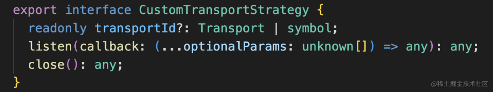
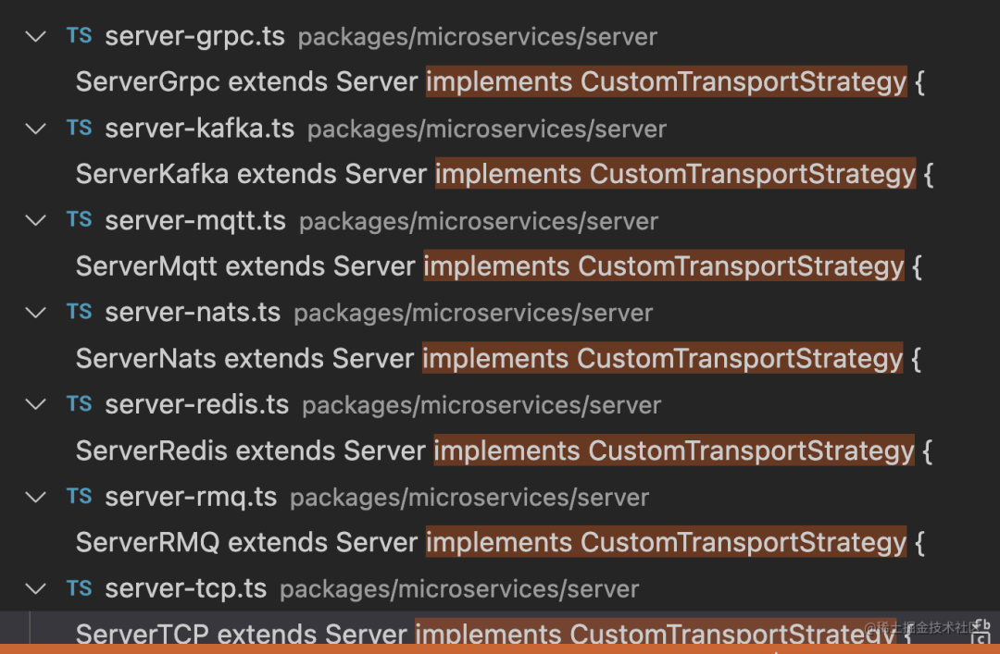
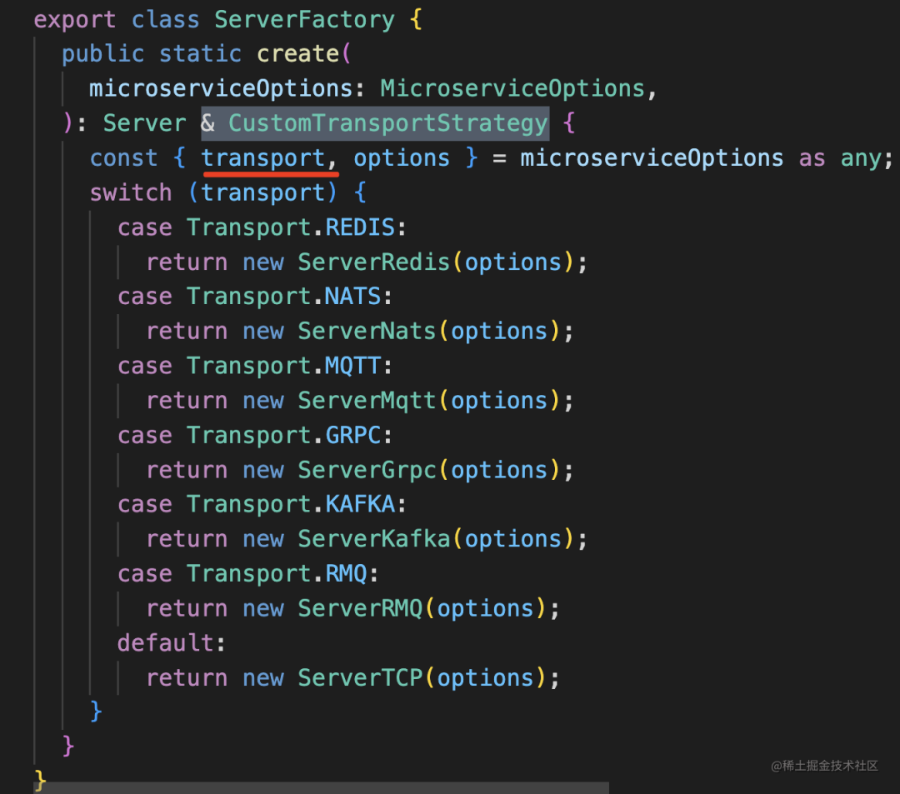
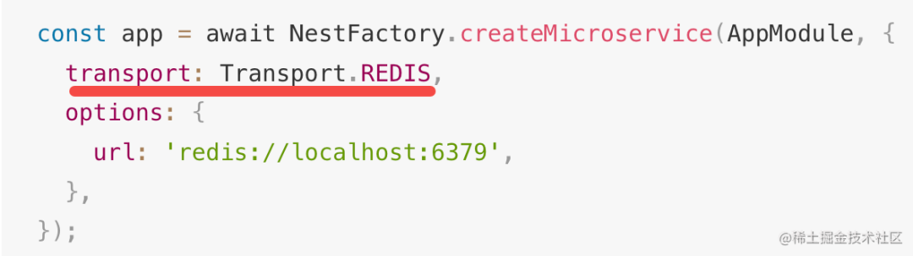

策略模式

1. 定义一系列的算法，把它们一个个封装起来，并且使它们可以互相替换。
2. 封装的策略算法一般是独立的，可以根据输入来调整采用哪个算法。
3. 关键是策略的实现和使用分离。

举例

1. Nest.js 支持 http 服务还支持微服务，微服务一般就不是直接处理 http 了，可能是和 Redis 通信、 Kafaka 等各种中间件通信等。各种不同中间件的客户端连接方式不同，next是如何管理的呢？

   

2. 它内置了 7 个实现类，分别实现了 Grpc、Redis、Kafka、MQTT、Nats、RebbitMQ、TCP 的连接建立和断开的方式

3. 又创建了一个工厂类来根据参数创建不同的策略类

   

   使用代码：

   

4. 主要优势是：可以快速扩展一个新的传输类型