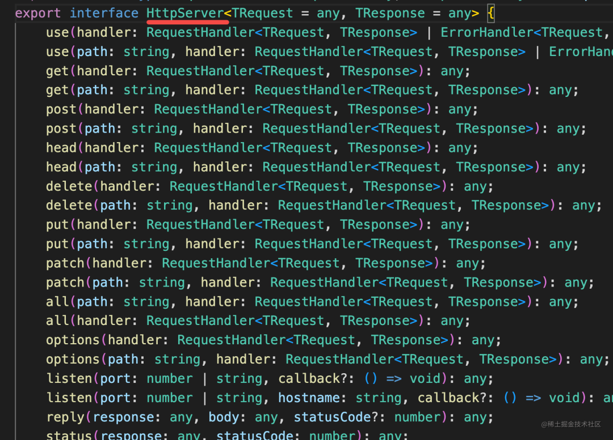
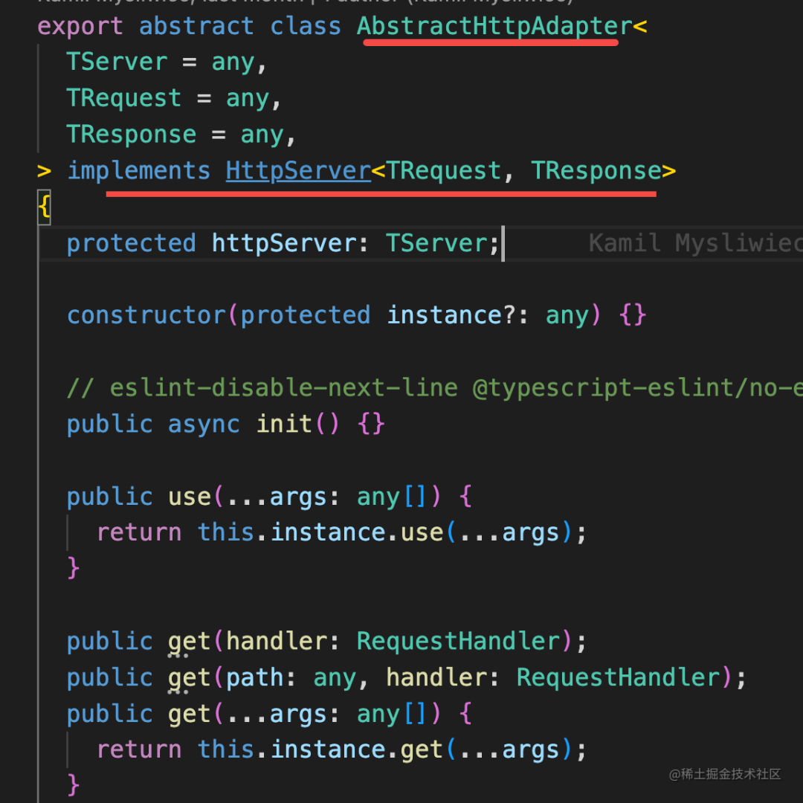
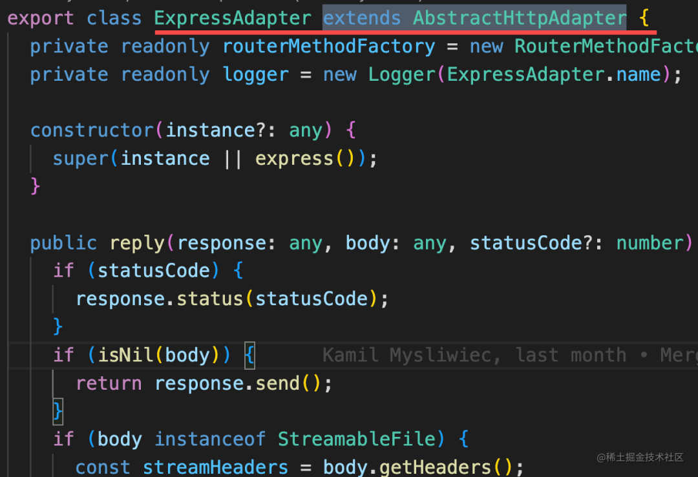
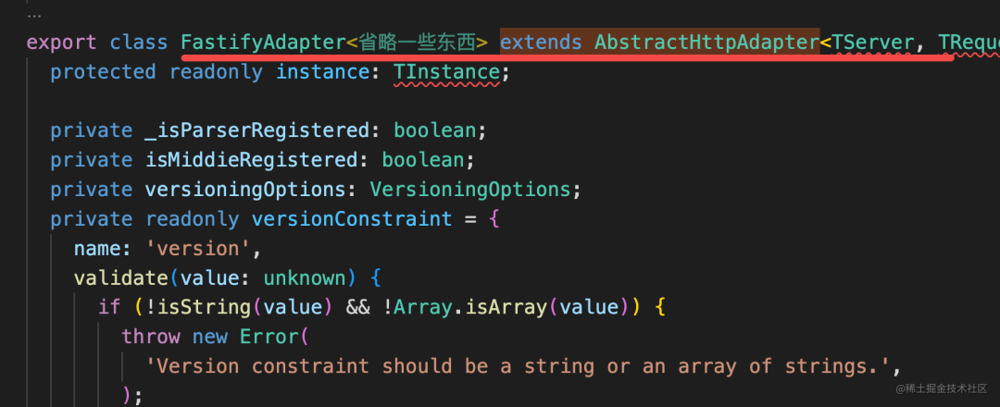

# 适配器模式

1. 作用是解决两个已有接口之间不匹配的问题，它不考虑这些接口是怎样实现的，也不考虑它们将来可能会如何演化
2. 是一种“亡羊补牢”的模式，没有人会在程序的设计之初就使用它。

举例

next是如何处理http协议的

1. Nest.js 其实本身并不处理 http 协议，处理 http 是依赖更底层的 Express 实现的，但是它又不想和 Express 强耦合。

2. 定义了个 HttpServer 的接口，里面定义了 http 服务器应该有的所有方法

   

3. 提供了个抽象类 AbstractHttpAdapter，对 HttpServer 的一些方法做了默认实现

   

4. ExpressAdapter 继承了 AbstractHttpAdapter，基于 Express 的 api 提供了这些方法的实现

   

5. 好处，可以灵活切换http实现，比如还提供了Fastify的实现

   

