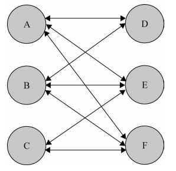

# 中介者模式

## 概述

1. 程序规模越来越大时，对象会越来越多，他们之间的关系也越来越复杂，难免形成交错的网

2. 中介者模式的作用就是解除对象与对象之间的紧耦合关系，以中介者和对象之间的一对多关系取代了对象之间的网状多对多关系，将左边图转为右边图

	

	

## 应用举例

1. 如现在有一个购物车界面，colorSelect选择颜色，numberInput为输入要买的数量，colorInfo显示选中的颜色，numberInfo，显示输入数量，nextBtn下一步操作（不输入数量时，不能点，输入数量大于库存，显示库存不足）

2. 当点击colorSelect，进行显示colorInfo、numberInfo与nextBtn的状态信息，但问题是，当现在需求不显示numberInfo与colorInfo时，需要修改代码；或者说需要增加一个内存的下拉框memorySelect，在此中还需要进行复杂判断

3. 利用中介者模式，当下拉选择框colorSelect、memorySelect 和文本输入框 numberInput 发生了事件行为时，它们仅仅通知中介者它们被改变了，剩下的所有事情都交给中介者对象来完成

4. 代码实现

	```javascript
	const goods = {  // 手机库存
	    "red|32G" : 3,
	    "red|16G" : 0,
	    "blue|32G": 1,
	    "blue|16G": 6
	};
	var mediator = (function(){
	    var colorSelect,        		 
	        memorySelect,
	        numberInput,
	        colorInfo,
	        memoryInfo,
	        numberInfo,
	        nextBtn; // 用getElementById获取的dom元素
	    return {
	        changed: function( obj ){
	            var color = colorSelect.value, // 颜色
	                memory = memorySelect.value,// 内存
	                number = numberInput.value, // 数量
	                stock = goods[ color + '|' + memory ]; // 颜色和内存对应的手机库存数量
	            if ( obj === colorSelect ){ // 如果改变的是选择颜色下拉框
	                colorInfo.innerHTML = color;
	            }else if ( obj === memorySelect ){
	                memoryInfo.innerHTML = memory;
	            }else if ( obj === numberInput ){
	                numberInfo.innerHTML = number;
	            }
	            if ( !color ){
	                nextBtn.disabled = true;
	                nextBtn.innerHTML = '请选择手机颜色';
	                return;
	            }
	            if ( !memory ){
	                nextBtn.disabled = true;
	                nextBtn.innerHTML = '请选择内存大小';
	                return;
	            }
	            if ( ( ( number - 0 ) | 0 ) !== number - 0 ){ // 输入购买数量是否为正整数
	                nextBtn.disabled = true;
	                nextBtn.innerHTML = '请输入正确的购买数量';
	                return;
	            }
	            nextBtn.disabled = false;
	            nextBtn.innerHTML = '放入购物车';
	        }}
	})();
	// 事件函数：
	colorSelect.onchange = function(){
	    mediator.changed( this );
	};
	```

## 缺点

1. 最大的缺点是系统中会新增一个中介者对象，因为对象之间交互的复杂性，转移成了中介者对象的复杂性，使得中介者对象经常是巨大的

## 注意

1. 中介者模式可以非常方便地对模块或者对象进行解耦，但对象之间并非一定需要解耦
2. 一般来说，
	如果对象之间的复杂耦合确实导致调用和维护出现了困难，而且这些耦合度随项目的变化呈指数
	增长曲线，那我们就可以考虑用中介者模式来重构代码。