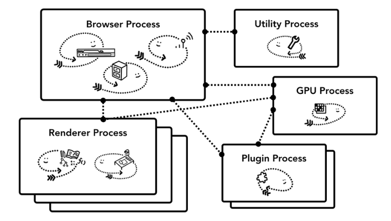
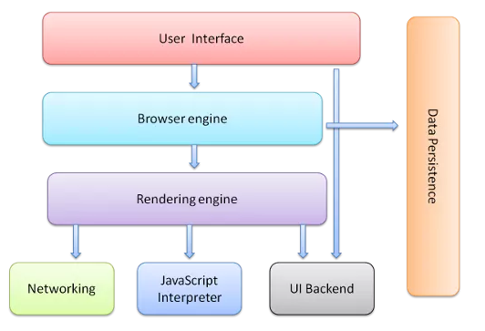
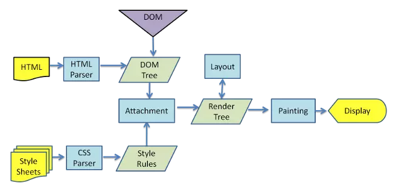
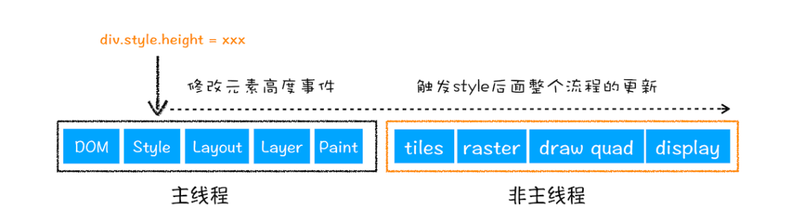
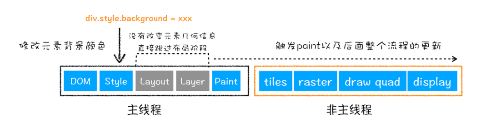
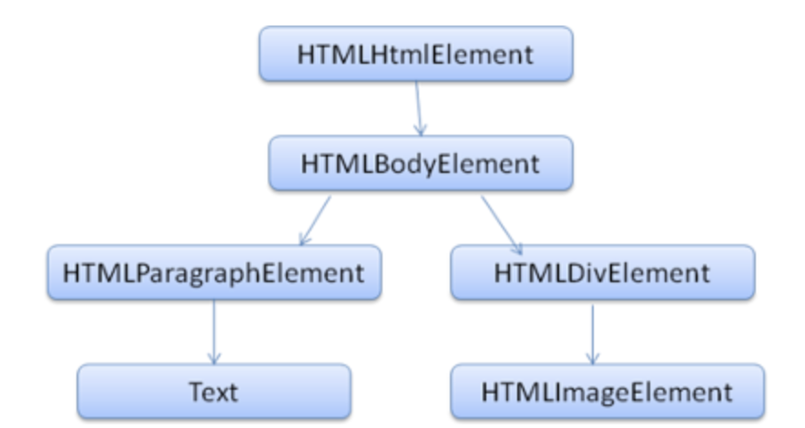
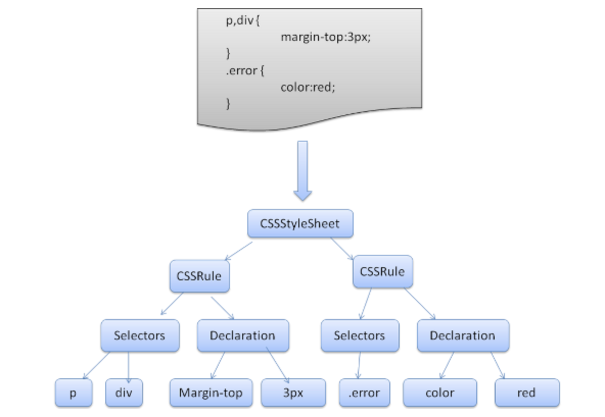

# 浏览器工作原理

## 架构

1. 不同的浏览器可能会采用不同的架构，chrome采用多进程架构

2. 主要包含：

   

   - Browser进程：负责书签、地址栏等；以及底层操作，如网络请求、文件访问等
   - renderer进程：负责tab内关于网页呈现的所有事情
   - GPU进程：负责GPU相关任务
   - Plugin进程：负责浏览器插件

3. 优点：某一个渲染进程出问题，不会影响其他的

4. 缺点：不同进程内存不共享，为了节省内存，chrome限制了最大进程数（由CPU和内存决定），到达限制后，新打开的tab会共用之前同一个站点的渲染进程

    

# 概述

1. 浏览器内核又可以分为两部分：渲染引擎（Layout Engine或Rendering Engine）和JS引擎。
2. 由于JS引擎越来越独立，内核就倾向于只指渲染引擎。 


# 浏览器构成

1. 浏览器通常由如下七个部分组成

   

2. **用户界面（User Interface）：** 包括地址栏、前进/后退按钮、书签菜单等。除了浏览器主窗口显示请求的页面外，其他显示的各个部分都属于用户界面。

3. **浏览器引擎（Browser engine）：** 是浏览器中各个部分之间相互通信的核心。

4. **呈现（渲染）引擎（Rendering engine）：** 负责显示请求的内容，并将内容排版到浏览器中显示成有样式的界面。如果请求的内容是 HTML，它就负责解析 HTML 和 CSS 内容，并将解析后的内容显示在屏幕上，也叫排版引擎

5. **网络功能模块（Networking）：** 用于网络调用

6. **用户界面后端（UI Backend）：** 用于绘制基本的窗口小部件，比如组合框和窗口。在底层使用操作系统的用户界面方法。

7. **JavaScript 解释器（Javascript Interpreter）：** 用于解析和执行 JavaScript 代码。

8. **数据存储（Data Persistence）：** 持久层。例如 Cookie、localStorage。

# 浏览器进程

## 构成

1. `Browser`进程：浏览器的主进程（负责协调，主控），只有一个，作用有：
   - 负责浏览器的界面显示，与用户交互，如前进，后退等
   - 负责各个页面的管理，创建和销毁其它进程
   - 将`Rendered`进程得到的内存中的`Bitmap`,绘制到用户界面上
   - 网络资源的管理，下载
2. 插件进程：每种类型的插件对应一个进程，仅当使用该插件时才创建。
3. 网络进程：主要负责页面的网络资源加载
4. `GPU`进程：最多一个，用于`3D`绘制等。
5. 浏览器渲染进程（浏览器内核）（`Render`进程，内部是多线程的）：默认每个`Tab`页面一个进程，互不影响。主要作用为：
   - 将 HTML、CSS 和 JavaScript 转换为用户可以与之交互的网页
   - 排版引擎 Blink 和 JavaScript 引擎 V8 都是运行在该进程中。

## 多进程优势

1. 页面运行在了单独的渲染进程中，插件运行在单独的插件进行中，进程间使用IPC进行通信。
2. Chrome 会为每个 Tab 标签创建一个渲染进程，why？
   - 因为渲染进程所有的内容都是通过网络获取的，会存在一些恶意代码利用浏览器漏洞对系统进行攻击，所以运行在渲染进程里面的代码是不被信任的。
   -  Chrome 会让渲染进程运行在安全沙箱里，保证系统的安全。
3. 多进程是浏览器用空间换时间，内存会消耗大一些
4. 如何解决单进程问题的
   - 【不稳定】由于进程之间相互隔离，当一个页面或者插件崩溃时只会影响当前的进程，不会影响其他页面。
   - 【不流畅】由于JS脚本运行在渲染进程中，即使JS阻塞了渲染进程，也只会影响当前页面的渲染，其他页面不受影响；此外，内存泄漏导致的不流畅问题也会随着一个页面的关闭导致一个进程的结束而解决。
   - 【不安全】多进程架构的安全沙箱，相当于是操作系统给进程上了一把锁，沙箱中的程序可运行不可写入、不可读取敏感数据。

# 渲染引擎

## 介绍

### Trident(IE内核)  

1. IE内核，代表产品Internet Explorer，是微软开发的一种排版引擎
2. 国内很多的双核浏览器其中之一就是Trident，美名其曰“兼容模式” 

### Gecko（Firefox） 

1. Netscape、Firefox的网页排版引擎

### Webkit（Safari）  

1. 苹果公司自己的内核，代表作品Safari和Chrome
2. 特点在于源码结构清晰、渲染速度极快。
3. 缺点是对网页代码的兼容性不高，导致一些编写不标准的网页无法正常显示 

### Presto（Opera）  

1. Presto内核代表作品Opera 
2. 在13年之后，Opera宣布加入谷歌阵营，弃用了Presto 

### Blink（Chrome）

1. 现在Chrome内核是Blink。
2. Blink其实是webkit的分支，大部分国产浏览器最新版都采用Blink内核。 

## 渲染流程

### webkit渲染过程



### Gecko渲染过程


### 渲染基本流程

1. HTML解析文件，生成DOM Tree，解析CSS文件生成CSSOM Tree
2. 将Dom Tree和CSSOM Tree结合，生成Render Tree(渲染树)
3. 生成布局（flow），计算元素位置、尺寸
4. 将布局绘制（paint），绘制页面像素信息
5. 浏览器会将各层的信息发送给`GPU`，`GPU`会将各层合成（`composite`硬件加速）,显示在屏幕上

### css加载阻塞dom渲染

1. 根据流程可知，dom与css解析是两个并行过程，故css不会阻塞dom解析
2. 但由于render tree依赖于dom tree与cssdom tree，故需要css加载完，才能生成，故css加载会阻塞dom渲染
3. 换个角度理解：加载css后又对dom节点样式进行了修改，如css加载不阻塞render树渲染的话，css加载完，render树会重新重绘或回流，造成性能浪费

## 重排(reflow)

### 概述

1. 又称之为回流，就好比向河里(文档流)扔了一块石头(dom变化)，激起涟漪，然后引起周边水流受到波及，所以叫做回流

2. 主要是dom尺寸位置的变化，浏览器需要重新计算元素的几何属性，重新安排布局

   

3. 重绘由于是外观改变，故"重绘"不一定会出现"重排"，"重排"必然会出现"重绘"

   

## 重绘(repaint)

### 概述

1. 当一个元素的外观发生改变，但没有改变布局，重新把元素外观绘制出来的过程，叫做重绘，不会导致布局阶段的执行，会直接进入绘制阶段，然后执行后来的子阶段

   

## 浏览器渲染队列

1. 对于如下代码，会产生多次重排与重绘

   ```css
   var s = document.body.style;
   s.padding = "2px"; // 回流+重绘
   s.border = "1px solid red"; // 再一次 回流+重绘
   s.color = "blue"; // 重绘
   s.backgroundColor = "#ccc"; // 重绘
   s.fontSize = "14px"; // 再一次 回流+重绘
   ```

2. 浏览器会维护1个队列，把所有会引起回流、重绘的操作放入这个队列，等队列中的操作到了一定的数量或者到了一定的时间间隔，进行批处理，让多次的回流、重绘变成一次回流重绘。

3. 但对于`offsetHeight/offsetTop;scrollTop/Left;clientTop/Left；width/height`这些获取宽高方法或getComputedStyle()方法，会提前flush队列，如

   ```css
   var s = document.body.style;
   s.padding = "2px"; // 回流+重绘
   console.log(div.offsetHeight)
   s.border = "1px solid red"; // 再一次 回流+重绘
   console.log(div.scrollTop)
   s.color = "blue"; // 重绘
   ```

   - 这样浏览器就不会对重排和重绘进行优化

## 重排重绘优化

### 分离读写操作

1. 如上面渲染队列介绍，可以分离读写操作

   ```css
   var s = document.body.style;
   s.padding = "2px"; // 回流+重绘
   s.border = "1px solid red"; // 再一次 回流+重绘
   s.color = "blue"; // 重绘
   console.log(div.scrollTop)
   console.log(div.offsetHeight)
   ```

2. 这样，前面的设置属性，浏览器会利用渲染队列进行优化

### 样式集中改变

1. 可以将样式变为集中改变，如使用class或cssText

   ```css
   // good 
   el.className += " theclassname";
   // good
   el.style.cssText += "; left: " + left + "px; top: " + top + "px;";
   ```

### 隐藏操作的dom

1. display:none的元素不会触发重排和重绘

### 利用DocumentFragment

1. 批量操作dom，这样只触发一次重排

### postion属性是absolute或fixed

1. 重绘开销比较小，不用考虑它对其他元素的影响

### 动画速率选择

1. 如1个像素为单位移动这样最平滑，但是reflow就会过于频繁，大量消耗CPU资源
2. 实现动画最好设置absolute或fixed，不影响其他布局

### 慎重选择高消耗的样式

1. box-shadows、border-radius、transforms、CSS filters（性能杀手）


# 资源预加载

## DNS 预解析dns-prefetch

### 作用

1. 根据浏览器定义的规则，提前解析之后可能会用到的域名，使解析结果缓存到系统缓存中，缩短DNS解析时间，来提高网站的访问速度
2. 该技术对第三方资源非常有用

### 如何使用

#### 关闭预解析

1. 关闭DNS预解析`<meta http-equiv="x-dns-prefetch-control" content="off">`
   - off：关闭
   - on：开启
2. 也可以响应头添加`X-DNS-Prefetch-Control`

#### 手动添加

1. `<link rel="dns-prefetch" href="http://www.google.com">`

### 更好的使用

1. 不用对超链接做手动prefetch，浏览器会自动做
2. 可以对静态资源、js发起的转跳域名、会重定向的域名手动prefetch
3. 页面Head里面有个css链接, 在当前页的Head里加上对应的手动dns prefetching的link标签，实际上并没有好处

## 预连接 Preconnect

1. 不但完成DNS预解析，还会进行TCP握手和建立传输层协议
2. `<link rel="preconnect" href="http://example.com">`

## 预获取 [Prefetch](https://www.w3.org/TR/resource-hints/#prerender)

1. 用于识别下一个导航可能需要的资源，浏览器会在闲置时

   ```html
   <link rel="prefetch" href="//example.com/next-page.html" crossorigin="use-credentials">
   <link rel="prefetch" href="/library.js" as="script">
   <link rel="prefetch" href="image.png">
   ```

   - `crossorigin`是可选的
   - 浏览器不会预处理响应，且不会自动执行将内容应用到当前页面上

2. 设置可以使用Intersection Observer动态将进入页面的link，加到prefetch中，如React官网使用了这个方式

## 预渲染 Prerender

1. 与Prefetch的主要区别是： 获取资源后会执行
2. `<link rel="prerender" href="//example.com/next-page.html">`
   - 会预处理HTML的响应，获取必要的子资源并执行它们
   - 浏览器会分配较少的CPU与GPU等资源、直到html可见才去请求媒体资源等、
3. prerender会让 Chrome 在一个不可见的页签中渲染一个页面，包含了它所有的子资源。当用户要浏览它时，这个页签被切到前台，做到了即时的体验。


# 解析与DOM树构建

## 解析

### 概述

1. 解析文档是指将文档转化成为有意义的结构

2. 解析分为两个子过程

   - 词法分析（词法分析器）：负责将输入内容分解成一个个有效标记

   - 语法分析（解析器）：根据语言的语法规则分析文档的结构，从而构建解析树

     

3. 解析是一个迭代的过程。通常，解析器会向词法分析器请求一个新标记，并尝试将其与某条语法规则进行匹配。如果发现了匹配规则，解析器会将一个对应于该标记的节点添加到解析树中，然后继续请求下一个标记。

4. 如果没有规则可以匹配，解析器就会将标记存储到内部，并继续请求标记，直至找到可与所有内部存储的标记匹配的规则。

5. 如果找不到任何匹配规则，解析器就会引发一个异常。这意味着文档无效，包含语法错误。

### 翻译（编译器）

1. 解析树还不是最终产品，翻译是指将输入文档转换成另一种格式

2. 编译器可将源代码编译成机器代码，具体过程是首先将源代码解析成解析树，然后将解析树翻译成机器代码文档

   

### 解析器类型

1. 有两种基本类型的解析器：
   - 自上而下解析器：自上而下的解析器从语法的高层结构出发，尝试从中找到匹配的结构
   - 自下而上解析器：自下而上的解析器从低层规则出发，将输入内容逐步转化为语法规则，直至满足高层规则
2. 自动生成解析器
   - 只要向其提供您所用语言的语法（词汇和语法规则），它就会生成相应的解析器
   - 创建解析器需要对解析有深刻理解，而人工创建并优化解析器并不是一件容易的事情，所以解析器生成器是非常实用的。

## HTML解析器

### 概述

1. HTML 解析器的任务是将 HTML 标记解析成解析树

2. HTML 和 XML 非常相似，有很多 XML 解析器可以使用，但细微的差别实际上却带来了巨大的影响

   - 区别在于 HTML 的处理更为“宽容”，它允许您省略某些隐式添加的标记，有时还能省略一些起始或者结束标记等等

3. 解析器的输出“解析树”是由 DOM 元素和属性节点构成的树结构

4. DOM 与标记之间几乎是一一对应的关系，如下

   ```html
   <html>
     <body>
       <p>
         Hello World
       </p>
       <div> </div>
     </body>
   </html>
   ```

   

### 解析算法

1. HTML 无法用常规的自上而下或自下而上的解析器进行解析
   - 语言的宽容本质。
   - 浏览器历来对一些常见的无效 HTML 用法采取包容态度。
   - 解析过程可能会添加额外标记
2. html解析算法由两个阶段组成：标记化和树构建

### 标记化算法

1. 该算法使用状态机来表示。每一个状态接收来自输入信息流的一个或多个字符，并根据这些字符更新下一个状态。

2. 当前的标记化状态和树结构状态会影响进入下一状态的决定。这意味着，即使接收的字符相同，对于下一个正确的状态也会产生不同的结果，具体取决于当前的状态。

3. 该算法相当复杂，简单原理是：

   ```html
   <html>
     <body>
       Hello world
     </body>
   </html>
   ```

   - 如初始状态是： 数据状态，遇到< 后，状态更改为**标记打开状态**
   - 接收一个 `a-z` 字符会创建：起始标记，状态更改为**标记名称状态**，这个状态一直会保持到遇到> 字符
   - 遇到 `>` 标记时，会发送当前的标记，状态改回**数据状态**

### 树构建算法

1. 在创建解析器的同时，也会创建 Document 对象。
2. 在树构建阶段，以 Document 为根节点的 DOM 树也会不断进行修改，向其中添加各种元素
3. 记生成器发送的每个节点都会由树构建器进行处理
4. 算法也是基于状态机进行描述的

### 浏览器的容错机制

1. 在浏览 HTML 网页时从来不会看到“语法无效”的错误。因为浏览器会纠正任何无效内容，然后继续工作
2. 不同浏览器的错误处理机制相当一致，但令人称奇的是，这种机制并不是 HTML 当前规范的一部分

## css解析器

### WebKit CSS 解析器

1. WebKit 使用 [Flex 和 Bison](https://www.html5rocks.com/zh/tutorials/internals/howbrowserswork/#parser_generators) 解析器生成器，通过 CSS 语法文件自动创建解析器

2. 解析器都会将 CSS 文件解析成 StyleSheet 对象，且每个对象都包含 CSS 规则。

3. CSS 规则对象则包含选择器和声明对象，以及其他与 CSS 语法对应的对象。

   


### 处理脚本和样式表的顺序

#### 脚本

1. 默认情况下，网络的模型是同步的。网页作者希望解析器遇到 <script> 标记时立即解析并执行脚本
2. 文档的解析将停止，直到脚本执行完毕
3. 如果脚本是外部的，那么解析过程会停止，直到从网络同步抓取资源完成后再继续

#### 预解析

1. WebKit 和 Firefox 都进行了这项优化
2. 预解析器不会修改 DOM 树，而是将这项工作交由主解析器处理；预解析器只会解析外部资源（例如外部脚本、样式表和图片）的引用。

#### 样式表

1. 样式表有着不同的模型，理论上应用样式表不会更改 DOM 树
2. 但有脚本在文档解析阶段会请求样式信息，如果此时样式还没加载好，就会出现问题
3. Firefox 在样式表加载和解析的过程中，会禁止所有脚本
4. WebKit 仅当脚本尝试访问的样式属性可能受尚未加载的样式表影响时，它才会禁止该脚本。

## 呈现树构建

1. 在 DOM 树构建的同时，浏览器还会构建另一个树结构：呈现树。
2. 这是由可视化元素按照其显示顺序而组成的树，也是文档的可视化表示。
3. 作用是让您按照正确的顺序绘制内容。

### 与DOM树的关系

1. 呈现器是和 DOM 元素相对应的，但并非一一对应。非可视化的 DOM 元素不会插入呈现树中，例如“head”元素或元素的 display 属性值为“none”
2. 有一些 DOM 元素对应多个可视化对象。它们往往是具有复杂结构的元素，无法用单一的矩形来描述。例如，“select”元素有 3 个呈现器：一个用于显示区域，一个用于下拉列表框，还有一个用于按钮。
3. 有一些呈现对象对应于 DOM 节点，但在树中所在的位置与 DOM 节点不同。浮动定位和绝对定位的元素就是这样，它们处于正常的流程之外，放置在树中的其他地方，并映射到真正的框架，而放在原位的是占位框架

### 样式计算

1. 构建呈现树时，需要计算每一个呈现对象的可视化属性，主要难点
   - 样式数据是一个超大的结构，存储了无数的样式属性，这可能造成内存问题。
   - 如果不进行优化，为每一个元素查找匹配的规则会造成性能问题。
   - 应用规则涉及到相当复杂的层叠规则


## 布局

### 概述

1. 呈现器在创建完成并添加到呈现树时，并不包含位置和大小信息。计算这些值的过程称为布局或重排。
2. dirty系统：
   - 为避免对所有细小更改都进行整体布局，浏览器采用了一种“dirty 位”系统
   - 如果某个呈现器发生了更改，或者将自身及其子代标注为“dirty”，则需要进行布局。

### 异步布局和同步布局

1. 增量布局是异步执行的
2. Firefox 将增量布局的“reflow 命令”加入队列，而调度程序会触发这些命令的批量执行。
3. WebKit 也有用于执行增量布局的计时器：对呈现树进行遍历，并对 dirty 呈现器进行布局
