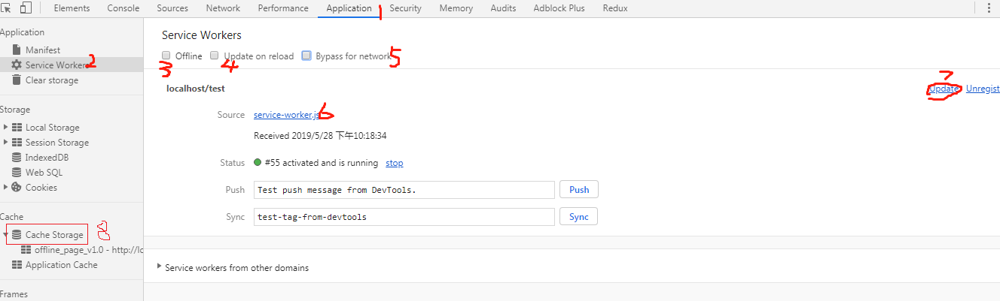

# 离线应用
## 概述
1. 支持离线应用是HTML5的一个重点
1. 离线web应用
    设备不上网的情况下，也能运行
1. 开发离线web应用的步骤
    - 应用知道设备能不能上网
    - 应用可以访问一定资源
    - 本地有一块空间保存数据

## 离线检测
### navigator.onLine属性

1. true：设备能上网
2. false：设备离线
3. 关键是：浏览器必须知道设备能否访问网络

### online事件

1. 网络从离线变为在线

### offline事件

1. 从在线变为离线
2. 检测应用是否离线
3. 页面加载后，通过navigator.onLine获取初始的状态
4. 通过online和offline事件确定网络连接状态是否变化
5. 注意：要手工轮询onLine属性检测网络状态变化

## 


## 
# Storage

## 概述

1. H5一部分
1. 为了克服cookie带来的一些限制，当数据需要严格控制在客户端上时，无须持续将数据发给服务器
1. 主要目的
    - 提供在cookie之外存储会话数据的途径
    - 提供一种大量可跨会话存在数据的机制
包括两个对象
    - window.sessionStorage：给每个源一个独立的存储空间，浏览器打开状态时可用；
    - window.localStorage：浏览器关闭后再打开仍然存在

## Storage类型
1. 提供了最大的存储空间来存储名值对
1. 每个项目作为属性存储在这个对象上
1. 虽然可以用属性直接修改存储的值，但为避免某个键覆盖已有成员，建议使用方法访问数据

## sessionStorage对象

1. 页面卸载，则会被清除

## localStorage对象

1. 数据没有到期时间

## 主要方法

1. Storage.key(n)：返回第n个key
2. Storage.getItem(name)：根据name返回值
3. Storage.setItem(name,value)：设置name的值为value，如name存在，则更新值
4. Storage.removeItem(name)：删除
5. Storage.clear()：清空全部


## storage事件
1. 对Storage对象的任何修改，都会在文档上触发storage事件

	```javascript
	window.addEventListener('storage', () => {
		//
	});
	```

	


## 限制
1. 对存储空间大小的限制是以每个来源（协议、域、端口号）为单位的
1. 键值是string类型，对于存储对象需要JSON.stringify()
1. 一般是5M或2.5M


# IndexedDB
## 概述

1. 用于客户端存储大量结构化数据

2. API使用索引来实现对该数据的高性能搜索

3. 可以离线使用

4. indexedDB API是强大的，有些库如localForage，dexie.js，ZangoDB等会使IndexedDB更方便用户

5. window.indexedDB

	

## 数据库

1. 最大特色是：使用对象保存数据，而不是使用表来存储

1. 一个indexedDB数据库，就是一组位于相同命名空间下的对象集合


# Service Worker

## 概述

1. HTML5 API，旨在提高WebApp的离线缓存能力
2. 基于它可以实现拦截和处理网络请求、消息推送、静默更新、事件同步等服务
3. js运行在单线程上，由于web复杂度越来越高，性能逐渐凸显出来，Web Worker的API被创造出来，主要目的是解放主进程
  - 可以将耗时的任务给web worker，干完活通过posetMessage通知给主线程
  - 主线程通过 onMessage 方法得到 Web Worker 的结果反馈。
  - 但新的问题是，每次做的结果不能被保存，因此提出service workder
4. 可以用来做
  - 后台消息传递
  - 网络代理，转发请求，伪造响应
  - 离线缓存
  - 消息推送

## 生命周期

1. 分为安装、激活、监听事件、销毁这个几个过程

2. 

## 调试方法



1. （序号1,2）快速打开service workers控制面板
2. （序号3）设置离线
3. （序号4）强制service worker更新并激活，方便开发者调试
4. （序号5）越过service worker，从网络加载内容
5. （序号6）进入service-worker文件，可以打断点进行调试
6. （序号7）强制更新service-worker文件
7. （序号8）查看service worker缓存的文件

## 使用方法

### 注册service worker

1. 在页面适当时期注册service worker

2. 注意：如果我们在 `/example/sw.js` 处注册 Service Worker 文件，则 Service Worker 将只能看到网址以 `/example/` 开头（即 `/example/page1/`、`/example/page2/`）的页面的 `fetch` 事件。

   ```html
   <!DOCTYPE html>
   <html>
   <head>
       <meta charset="utf-8">
       <title>Service Worker Sample: Offline Page</title>
       <link rel="stylesheet" type="text/css" href="main.css">
       <script type="text/javascript" src="main.js"></script>
       <script>
         function service_worker_register() {
           if (navigator.serviceWorker != null) {
             navigator.serviceWorker.register('service-worker.js')
               .then(function (r) {
                 console.log('service worker has registered success!');
               })
               .catch(function (whut) {
                 console.log('service worker has registered failure!');
               });
           }
         }
         window.onload = function () {
           service_worker_register();
         }
       </script>
   </head>
   <!-image，外联css，外联js，html都进行缓存，在离线时，页面还可以访问->
   <body>
   <h2>Service Worker Sample: Offline Page</h2>
   <h3>1.image</h3>
   </img>
   <h3>2.external css</h3>
   </img>
   <h3>3.external js</h3>
   <button onclick="button_click()">Click Me!</button>
   </body>
   </html>
   ```


## 主要问题

1. Service Worker 一旦注册在用户的浏览器，全站的请求都会被 Service Worker 控制，一不留神，小问题也成了大问题了。
2. 只需监听 fetch 事件，你就可以任意的操纵请求，可以返回从 CacheStorage 中读的数据，也可以通过 Fetch API 发起新的请求，甚至可以 new 一个 Response，返回给页面。

## workbox

1. 是为了解决service worker而出现的
2. 官网：<https://developers.google.com/web/tools/workbox/>

# PWA

## 什么是

1. Progressive Web App, 简称 PWA，是提升 Web App 的体验的一种新方法，能给用户原生应用的体验

2. PWA 本质上是 Web App，借助一些新技术也具备了 Native App 的一些特性，兼具 Web App 和 Native App 的优点。

3. 主要特点：

	- 可靠，即使在不稳定的网络环境下，通过service worker也能瞬间加载并展现
	- 体验：快速体验
	- 粘性：可以像原生应用一样添加到桌面

	

## 什么是渐进式

1. 主要是渐进式改善站点体验
	- 降低站点改造的代价，逐步支持各项新技术
	- 新技术标准的支持度还不完全


