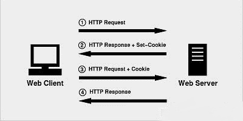
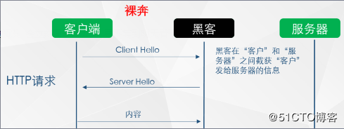
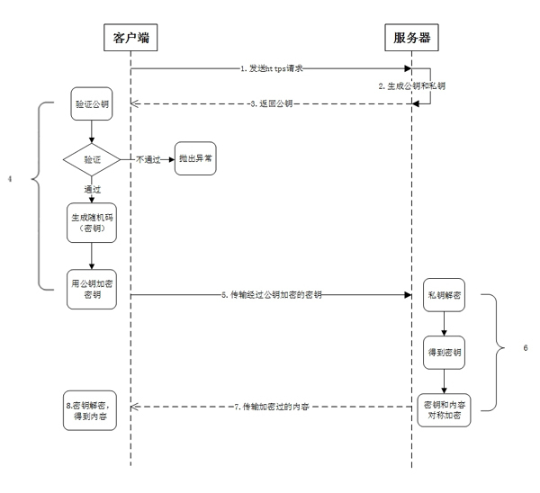

# 网络模型

## OSI七层模型

1. 应用层：http、FTP 
2. 表示层：LPP 轻量级表示协议
3. 会话层：SSL、TSL
4. 传输层：TCL、UDP
5. 网络层：IP、IPv6

## TCP/IP 五层模型

# HTTP 1.x  

1. 从1.x了解http，了解http一些关键的特性

## 持久连接的优点

1. 未添加持久化连接时，web请求资源是每次都要新建TCP连接，有三次握手的延迟
2. HTTP 1.1 的一个主要改进就是引入了持久HTTP 连接，这样可以避免后序的TCP连接时的三次握手，消除后序的TCP慢启动的往返
3. 关键是：让我们重用已有的连接来完成多次应用请求 
4. 在发送http的请求头中设置Connection: keep-alive

## HTTP管道

1. 主要就是消除了发送请求和响应的等待时间

2. 多次请求必须严格满足先进先出（ FIFO）的队列顺序：发送请求，等待响应完成，再发送客户端队列 中的下一个请求，HTTP管道把FIFO队列从客户端迁移到服务器端

   

3. 正常流程是，如发送2个HTTP请求，先发A然后等待返回，再发B，但发B除了延迟时间，还要等待服务器处理时间，可以发A、B让服务器并行计算，然后等待返回（http2的多路复用解决）

4. 由于中间代理可能不支持管道、可能造成队首阻塞等问题，HTTP 管道技术的应用非常有限，大多数浏览器都会禁用他

## 使用多个TCP连接 

1. 由于 HTTP 1.x 不支持多路复用，实践中客户端会排队所有HTTP请求，这样太慢了
2. 解决办法是：启用多个TCP连接，大多数浏览器限制在启动6个TCP连接，避免服务器消耗太大
3. 如一个主机同时打开6个并行下载，打开第7个下载请求时，会被挂起

## 域名分区

1. 据统计，每个页面平均包含90个独立资源，6 个并行的连接对你的应用来说可能仍然不够用。 但可以通过域名将不同的资源分布在不同的主机上
2. 浏览器连接限制针对的是主机名，不是 IP 地址，因此常见的做法是把多个域名（如shard1.example.com、 shard2.example.com ）解析到相同ip上
3. 但域名分区并不是越多越好，泛滥使用会造成：
   - 几十个 TCP 流都得不到充分利用  
   - 额外的 DNS 查询和 TCP 慢启动而影响性能  
4. 域名分区是一种合理但又不完美的优化手段 

## 度量和控制协议开销

1. 每个浏览器发起的 HTTP 请求， 都会携带额外 500~800 字节的 HTTP 元数据，还不算附带的Cookie
2. 所有这些未经压缩的 HTTP 元数据经常会给每个HTTP 请求增加几千字节的协议开销
3. 例如请求一个json，返回的数据为{msg:'hello'}，这个数据可能15字节，可能会被 352 字节的 HTTP 首部包裹着
4. 减少要传输的首部数据（高度重复且未压缩），注意每次请求是否要附带Cookie（Cookie可能很大），会显著提升很多 Web 应用的性能。  

## 连接与拼合

1. 为减少http请求，常用做法是将小图合并，js、css合并
2. 但问题是：
   - 把多个资源打包到一块，也可能给缓存带来负担，影响页面的执行速度  
   - 每次更新了js，客户端需要下载更大的js
   - 图片合成雪碧图，需要全部加载到内存中
   - js和css需要全部加载完，应用才能执行，拖慢了应用执行速度
3. 因此，并不是都合并了就能提高性能，chrome测试表明，js压缩后在30-50kb比较合适

## 嵌入资源 

1. 把资源嵌入文档可以减少请求的次数是比较流行的优化方法
2. js和css可以直接嵌入页面，图片、音频等可以通过数据URI嵌入页面
3. 注意：
   - 非文本资源嵌入页面需要进行编码，编码后的资源大小比原大小增大 33%  
   - 嵌入资源不会被缓存
   - 多个页面嵌入相同资源，会增大每个页面的总体大小
   - 如嵌入资源被更新，客户端需要重新从服务器获取页面
4. 常见的一个经验规则是只考虑嵌入 1~2 KB 以下的资源 
5. 一般嵌入的小tips
   - 如果文件很小，而且只有个别页面使用，可以考虑嵌入； 
   - 如果文件很小，但需要在多个页面中重用，应该考虑集中打包；
   - 如果小文件经常需要更新，就不要嵌入了； 
   - 通过减少 HTTP cookie 的大小将协议开销最小化。  

# HTTP2.0

## 概述

1. HTTP 2.0 致力于突破上一代标准众所周知的性能限制，但它也是对之前 1.x 标准的扩展，而非替代。
2. HTTP的语义不变，提供的功能不变，通过新增二进制分帧数据层，改变了客户端与服务器之间交换数据的方式。  
3. 对于开发而言，只是api多了一些，底层的分帧机制是浏览器和服务器处理的

## 技术目标 

### 二进制分帧层

1. 这个是HTTP 2.0 性能增强的核心，它定义了如何封装 HTTP 消息并在客户端与服务器之间传输，改变了客户端与服务器之间交互数据的方式
2. HTTP 1.x 以换行符作为纯文本的分隔符，而 HTTP 2.0 将所有传输的信息分割为更小的消息和帧，并对它们采用二进制格式的编码。 如下图：与

### 流、 消息和帧  

1. 流：已建立的连接上的双向字节流，每个流都有唯一的整数标识符，很多流可以并行地在同一个 TCP 连接上交换消息 
2. 消息：逻辑上的 HTTP 消息，比如请求、响应等，由一或多个帧组成。  
3. 帧：最小的通信单位，承载着特定类型的数据，如 HTTP 首部、负荷，等等。
4. 一个TCP连接上承载多个数据流，每个数据流以消息发送，而消息由一个或多个帧组成，帧可以乱序发送，然后根据帧的首部的流标识符重新组装
5. 所有帧都采用二进制编码，所有首部数据都会被压缩  

### 多向请求与响应 

1. 二进制分帧层，将http消息分解为独立的帧，则突破了http1.x必须使用多个tcp连接，队首阻塞等问题
2. 可以并行交错发送请求，请求之间互不影响；并行发送响应，响应之间互不干扰等等优点
3. 支持多向请求与响应，可以省掉针对 HTTP 1.x 限制所费的那些脑筋和工 作，比如拼接文件、图片精灵、域名分区

### 请求优先级 

1. 可以通过优化这些帧的交错和传输顺序， 进一步提升性能。
2. 为了做到这一点，每个流都可以带有一个 31 比特的优先值，0表示最高优先级；2的31次方-1表示最低优先级。
3. 如果服务器不理睬所有优先值，那么可能会导致应用响应变慢：浏览器明明在等关键的 CSS 和 JavaScript，服务器却在发送图片，从而造成渲染阻塞
4. 而严格固定优先值，可能会造成队首阻塞问题，如某个优先级很高的请求非常慢
5. 高优先级的应该优先发送，但为了最高效地利用底层连接，不同优先级的混合也是必需的

### 每个来源一个连接 

1. 大多数 HTTP 连接的时间都很短，而且是突发性的，但 TCP 只在长时间连接传输大块数据时效率才最高。 
2. HTTP 2.0 通过让所有数据流共用同一个连接，可以更有效地使用 TCP 连接。  

### 流量控制 

1. 与TCP流量控制的区别是：TCP 流量控制不能对同一条 HTTP 2.0 连接内的多个流实施差异化策略，因此出台了HTTP2.0的流量控制（但机制是一样的）
2. 在同一个 TCP 连接上传输多个数据流，就意味着要共享带宽。优先级不足以确定多个数据流或多个连接间的资源分配。

### 服务器推送  

1. 服务器可以对一个客户端请求发送多个响应，服务器向客户端推送资源无需客户端明确的请求。

2. 如下图，客户端请求stream 1(/page.html)。服务端在返回stream 1的消息的同时推送了stream 2(/script.js)和stream 4(/style.css)；如请求的是主页，则通过此方式将主页需要的样式、图片等一起发送给客户端，减少冗余请求步骤

   

3. 在http2.0前，主要可以通过把资源直接插入到文档中，就是把资源直接推送给客户端，而无需客户端请求，但这种方式有很多缺点（1.x的9.7介绍），客户端还要分析文档才能知道资源，为何不让服务器其他把这些推送给客户端呢？

4. 服务器推送与将资源写在文档显著不同是：把这个过程从应用级别放到了HTTP协议中处理，还带来了很多好处：

- 客户端可以缓存推送过来的资源；
- 客户端可以拒绝推送过来的资源；
- 推送资源可以由不同的页面共享；
- 服务器可以按照优先级推送资源 

4. 但HTTP2.0协议并没有说明在服务器端应该使用何种策略推送哪些资源，因此会有很多策略可选
5. 注意：如发送一个请求，服务器推送内容要在请求之前发送，这是为了避免客户端出现竞态条件，如请求的就是推送的资源

### 首部压缩

1. http2.0使用“首部表”来跟踪和存储之前发送的键－值对， 对于相同的数据，不再通过每次请求和响应发送； 
2. 如发送两个请求，第二个请求只更改了：path，则第二个请求首部只需要发送path这一个键值对就可以；
3. 这样就可以避免传输冗余的首部，从而显著减少每个请求的开销  

### 多路复用

1. 客户端发送多个请求和服务端给出多个响应的顺序不受限制

2. 在复用同一个TCP连接时，服务器同时(或先后)收到了A、B两个请求，先回应A请求，但由于处理过程非常耗时，于是就发送A请求已经处理好的部分， 接着回应B请求，完成后，再发送A请求剩下的部分。

   

## 优化最佳实践  

1. 应用的性能依赖于下面的所有层性能之和
2. 减少DNS查找：每次主机名解析都会增加网络往返，增加延迟
3. 用TCP连接：消除TCP握手与慢启动的延迟
4. 减少HTTP重定向：HTTP重定向非常消耗时间，可能会涉及DNS查询、TCP握手等
5. 使用CDN（内容分发网络）：访问离自己最近的服务器，降低延迟
6. 去掉不必要的资源：没有请求总比请求快
7. 在客户端缓存资源 ：避免请求相同内容
   - 主要使用http的缓存时间  Cache-Control；验证机制的Last-Modified 和 ETag  
   - 需要同时指定缓存时间和验证机制
8. 传输压缩过的内容：使传输字节数最小
   - 以图片为例
   - 选用正确的图片格式，不同的图片格式分别为不同使用场景设计
   - 不要让图片超过它需要的大小，传输了多余的字节，客户端还浪费了cpu、内存等资源
   - 看使用哪种压缩图片的格式，压缩到什么程度
9. 并行处理请求和响应：请求或响应的排队会导致延迟

## 常见请求头

| 协议头          | 说明                                                         | 示例                                          | 状态       |
| :-------------- | :----------------------------------------------------------- | :-------------------------------------------- | :--------- |
| Accept          | 可接受的响应内容类型（`Content-Types`）。                    | `Accept: text/plain`                          | 固定       |
| Accept-Charset  | 可接受的字符集                                               | `Accept-Charset: utf-8`                       | 固定       |
| Accept-Encoding | 可接受的响应内容的编码方式。                                 | `Accept-Encoding: gzip, deflate`              | 固定       |
| Accept-Language | 可接受的响应内容语言列表。                                   | `Accept-Language: en-US`                      | 固定       |
| Cache-Control   | 用来指定当前的请求/回复中的，是否使用缓存机制。              | `Cache-Control: no-cache`                     | 固定       |
| Cookie          | 由之前服务器通过`Set-Cookie`（见下文）设置的一个HTTP协议Cookie | `Cookie: $Version=1; Skin=new;`               | 固定：标准 |
| Connection      | 客户端（浏览器）想要优先使用的连接类型                       | `Connection: keep-alive``Connection: Upgrade` | 固定       |

## 常见响应头

| 响应头                      | 说明                                                         | 示例                             | 状态 |
| :-------------------------- | :----------------------------------------------------------- | :------------------------------- | :--- |
| Access-Control-Allow-Origin | 指定哪些网站可以`跨域源资源共享`                             | `Access-Control-Allow-Origin: *` | 临时 |
| Cache-Control               | 通知从服务器到客户端内的所有缓存机制，表示它们是否可以缓存这个对象及缓存有效时间。其单位为秒 | `Cache-Control: max-age=3600`    | 固定 |
| Content-Encoding            | 响应资源所使用的编码类型。                                   | `Content-Encoding: gzip`         | 固定 |
| Content-Language            | 响就内容所使用的语言                                         | `Content-Language: zh-cn`        | 固定 |
| Content-Length              | 响应消息体的长度，用8进制字节表示                            | `Content-Length: 348`            | 固定 |

## 常见状态码

### 类别

| Type | Reason-phrase | Note                                                     |
| ---- | ------------- | -------------------------------------------------------- |
| 1XX  | Informational | 信息性状态码，表示接受的请求正在处理                     |
| 2XX  | Success       | 成功状态码，表示请求已成功被服务器接收、理解、并接受     |
| 3XX  | Redirection   | 重定向状态码，表示需要客户端采取进一步的操作才能完成请求 |
| 4XX  | Client Error  | 客户端错误状态码，表示服务器无法处理请求                 |
| 5XX  | Server Error  | 服务器错误状态码，表示服务器处理请求出错                 |

### 2xx

1. 200（OK）：请求正常处理
2. 204（No Content）
	- 请求处理成功，但没有任何资源可以返回给客户端
	- 一般在只需要从客户端往服务器发送信息，而对客户端不需要发送新信息内容的情况下使用。

### 3xx

1. 301
	- 永久性重定向
	- 表示请求的资源已经被分配了新的URI，并且以后使用资源现在所指的URI
	- 收藏的uri应该提示重新保存
2. 302
  - 临时性重定向，重定向指定使用原有请求方法
  - 状态码表示请求的资源已被分配了新的URI，希望用户本次能使用新的URI访问
  - 不会更新书签
3. 303
  - 与302类似，区别是重定向使用get请求
4. 304(Not Modified)
  - 表示客户端发送附带条件请求时，服务器端允许请求访问资源，但未满足条件的情况
5. 307
  - 临时重定向
  - 不会指定客户端要用什么样的请求方法请求重定向地址

### 4xx

1. 400（Bad Request）
	- 语义有误，当前请求无法被服务器理解
	- 客户端需要修改请求的内容后再次发送请求。
2. 401（Unauthorized）
	- 未授权
3. 403（Forbidden）
	- 请求被服务器拒绝
	- 与401区别是，身份验证并不能提供任何帮助。
4. 404（Not Found）：
	- 表明服务器上无法找到指定的资源

### 5xx

1. 500
	- 服务器内部错误，web应用存在bug
2. 503（Service Unavailable）
	- 服务器暂时处于超负载或正在进行停机维护

## 常见请求方法

| 方法    | 说明                                                         |
| ------- | ------------------------------------------------------------ |
| GET     | GET请求会显示请求指定的资源。                                |
| HEAD    | 服务器在响应HEAD请求时不会回传资源的主体部分 获取服务器的响应头信息，或查看服务器的性能。 |
| POST    | POST请求会向指定资源提交数据，请求服务器进行处理             |
| PUT     | PUT请求会身向指定资源位置上传其最新内容                      |
| DELETE  | DELETE请求后指定资源会被删除                                 |
| CONNECT | CONNECT方法是HTTP/1.1协议预留的，能够将连接改为管道方式的代理服务器。 |

# 解决HTTP无状态性

## Cookie

### 概述

1. Cookies让网站服务器把少量数据储存到客户端，为了分担服务器存储负担的

2. 执行流程图：

   

3. cookie构成

   - 域，路径，失效时间，secure标志是服务器给浏览器的指示，以指定何时发送cookie，这些参数不发回服务器

### 与session的关系

1. Cookie和Session解决了http请求无状态的问题
2. 如小明需要登录某个网站，登录后，服务器会创建session，并将sessionId通过cookie返给浏览器，以后每次浏览器发送请求时，带着此sessionId，则服务器知道这个是小明

### 与session的区别

1. cookie机制采用的是在客户端保持状态的方案，而session机制采用的是在服务器端保持状态的方案
2. session会在一定时间内保存在服务器上。当访问增多，会比较占用你服务器的性能
3. cookie不是很安全，别人可以分析存放在本地的COOKIE并进行COOKIE欺骗

### js中的cookie

1. document.cookie
   - 返回当前页面可用的所有cookie字符串，一系列用分号隔开
   - 所有名都是用URL编码的
2. 创建Cookie
   - document.cookie="username=John Doe";
   - 可以配置存在时间，默认关闭浏览器清除
   - 可以配置path，默认当前网页
3. 读取Cookie
   - `var x = document.cookie`;
   - 会读取全部cookie
4. 改变Cookie：和创建一致，覆盖旧的cookie
5. 删除Cookie：设置存在时间为0
6. 子cookie
   - 为绕开浏览器单个域名的cooki限制
   - name=name1=value&name2=value
   - 浏览器存一个key为name，实际里面有两个key-value对
   - 删除子cookie，不能将key置""，需获得cookie下所有子cookie，然后再删除具体的

优点

1. 极高的扩展性和可用性 
2. Cookie有效期限未到时，Cookie能使用户在不键入密码和用户名的情况下进入曾经浏览过的一些站点 
3. 主要是：解决浏览器用户与Web服务器之间无状态通信。

### 缺点

1. cookie在性质上是绑定在特定的域名下的
2. `Cookie`数量和长度的限制。每个域的cookie总数是有限的，每个cookie长度不能超过4KB，否则会被截掉。
3. 安全性问题。如果cookie被人拦截了，那人就可以取得所有的session信息。即使加密也与事无补，因为拦截者并不需要知道cookie的意义，他只要原样转发cookie就可以达到目的了。
4. 由于所有的cookie都是由浏览器作为请求头发送，包含大量信息会无形中浪费了带宽

# HTTPS

## 概述

1. 是以安全为目标的HTTP通道，简单讲是HTTP的安全版，即HTTP下加入SSL层，HTTPS的安全基础是SSL，因此加密的详细内容就需要SSL。

2. http的传输最大的隐患是信息劫持和篡改，即在传输过程中，黑客劫持信息后，可以给你的网站添加广告

	

3. HTTPS 能很有效的解决这个现象，我们在数据传输之前，双方商量一个加密的密码，然后俩个人之间的通讯都用这个密码进行加密，即便在路由节点被第三方捕获，它没有密码，看到的也是一堆乱码

### HTTPS连接过程

1. 客户端发起https请求
2. 服务器利用非对称加密生成私钥+公钥
3. 服务器返回证书给客户端（证书包括颁发机构、过期时间、公钥等）
4. 客户端拿到证书后，验证有效性；然后利用对称加密算法生成密码a
5. 用公钥加密密钥后传给服务器
6. 服务器利用私钥解密获取对称加密的密码a
7. 开始利用密码a加密文本进行信息传输
8. 可参见《3-TLS》了解更多

## 原理总结

1. HTTPS要使客户端与服务器端的通信过程得到安全保证，必须使用的对称加密算法，但是协商对称加密算法的过程，需要使用非对称加密算法来保证安全，然而直接使用非对称加密的过程本身也不安全，会有中间人篡改公钥的可能性，所以客户端与服务器不直接使用公钥，而是使用数字证书签发机构颁发的证书来保证非对称加密过程本身的安全。
2. 这样通过这些机制协商出一个对称加密算法，就此双方使用该算法进行加密解密。从而解决了客户端与服务器端之间的通信安全问题。

### HTTPS劫持

1. 如果某些授信CA乱发证书的话，可能会https劫持，如你的网站被拿去让ca重新造了一个证书
2. 下载了某些app自己签发的证书

