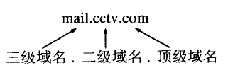
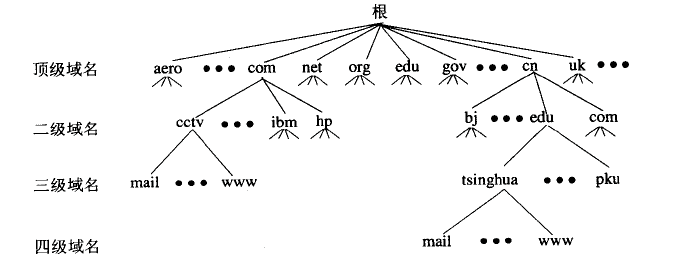
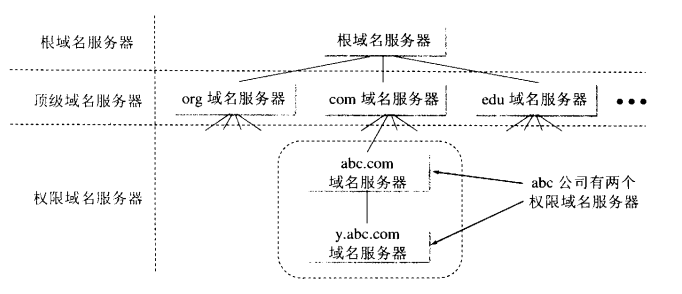
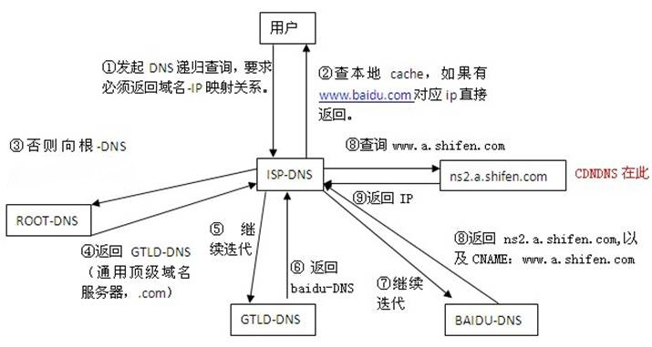

# 

# DNS

## 概述

1. DNS( Domain Name System)是“域名系统”的英文缩写
2. 用来将主机名和域名转换为IP地址，DNS是应用层协议
3.  域名到IP地址的解析是由分布在因特网上的许多域名服务器程序共同完成的。域名服务器程序在专设的结点上运行，而人们也常把运行域名服务器程序的机器称为域名服务器。

## 域名结构

1. 每一个域名都是有标号(label)序列组成，而各标号之间用点(小数点)隔开
2. 
3. 级别最低的域名写在最左边，而级别最高的字符写在最右边
4. DNS既不规定一个域名需要包含多少个下级域名，也不规定每一级域名代表什么意思
5. 各级域名由其上一级的域名管理机构管理，而最高的顶级域名则由ICANN进行管理

## 域名服务器

1. 根据结构可以得到如下的域名空间

	

2. 每一个节点都采用一个域名服务器，这样会使得域名服务器的数量太多，使域名服务器系统的运行效率降低

3. 域名服务器按区进行服务器管理，即每个域名服务器只对体系中的一部分进行管理

	

4. 根域名服务器有13个不同ip，并不是13台服务器，根域名服务器分布在全国各地

5. 权限域名服务器下面还有一个本地域名服务器，网络服务者ISP或一个大学甚至一个系里，都可以拥有本地域名服务器；如windows默认的DNS获取地址就是这个本地域名服务器，是主机距离最近的域名服务器

## 域名解析过程

注意：查询过程是先查询缓存未发现地址之后进行

### 递归查询

1. 主机向本地域名服务器查询一般是递归查询
2. 如主机请求本地域名服务器某一网站的ip地址未查询到，则本地域名服务器会以DNS客户身份直接向根域名服务器请求，而不是等待主机发送下一步查询

### 迭代查询

1. 本地域名服务器向根域名服务器的查询通常是迭代查询
2. 即根域名查询到下一级域名服务器地址后，会告诉本地域名服务器，让本地域名服务器进行后续操作，而不是自动向下一级进行请求

### 图示

## 缓存分类

1. 浏览器DNS缓存（内存中): 浏览器会按照一定频率缓存DNS记录
2. 本地DNS缓存(内存中): 操作系统缓存。
3. 本地HOSTS文件
4. 路由器DNS
5. ISP的DNS服务器:  ISP(互联网服务提供商、联通电信移动)，ISP有专门的DNS服务器应对DNS查询请求
6. 根服务器: ISP的DNS服务器还找不到的话，它就会向根服务器发出请求，进行递归查询
7. DNS查找顺序也是从1到6

### 清除浏览器的dns缓存

1. 如开发时需要某个域名绑定hosts，用于本地开发测试，绑定后发现没反应，可能是有浏览器的dns缓存
2. chrome 浏览器chrome://net-internals/#dns
3. 

## DNS 预解析

### 作用

1. 根据浏览器定义的规则，提前解析之后可能会用到的域名，使解析结果缓存到系统缓存中，缩短DNS解析时间，来提高网站的访问速度

### 如何使用

#### 关闭预解析

1. 关闭DNS预解析`<meta http-equiv="x-dns-prefetch-control" content="off">`
	- off：关闭
	- on：开启
2. 也可以响应头添加`X-DNS-Prefetch-Control`

#### 手动添加

1. `<link rel="dns-prefetch" href="http://www.google.com">`

### 更好的使用

1. 不用对超链接做手动prefetch，浏览器会自动做
2. 可以对静态资源、js发起的转跳域名、会重定向的域名手动prefetch
3. 页面Head里面有个css链接, 在当前页的Head里加上对应的手动dns prefetching的link标签，实际上并没有好处

## 域名发散与收敛

### 域名发散

1. 在PC上，为了突破浏览器的单域名多线程并发限制，大家会采用域名发散：http 静态资源采用多个子域名，以提供最大并行度，让客户端加载静态资源更为迅速
2. 为何浏览器会对并发做限制
	- 以前服务器负载能力差，容易崩溃
	- 服务器容易受到DoS攻击，攻击者占用过多服务器资源，其他用户无法访问

### 域名收敛

1. 尽量将静态资源只放在一个域名下面
2. 主要是考虑手机端利用无线网络开销比较大，进行每次的DNS都会浪费资源

### 