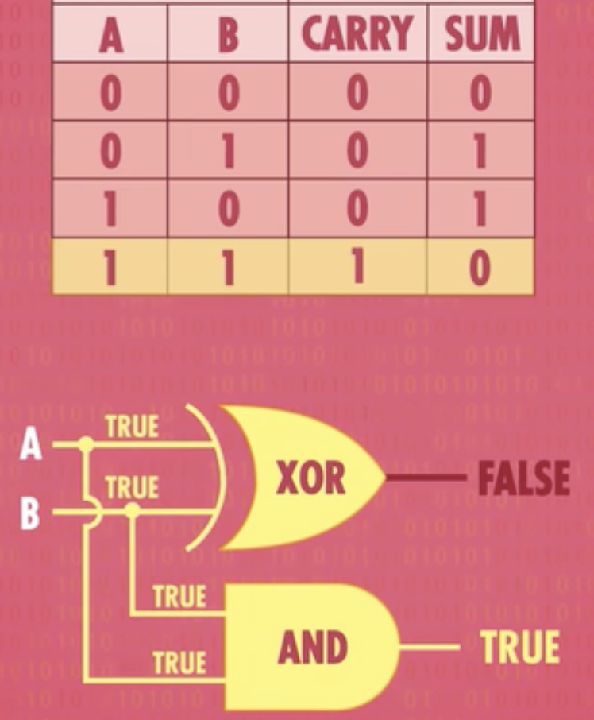
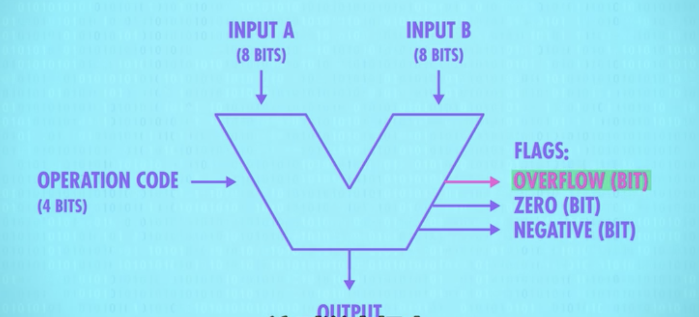
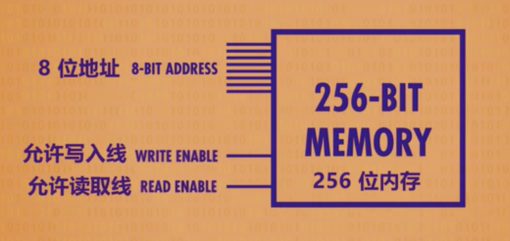
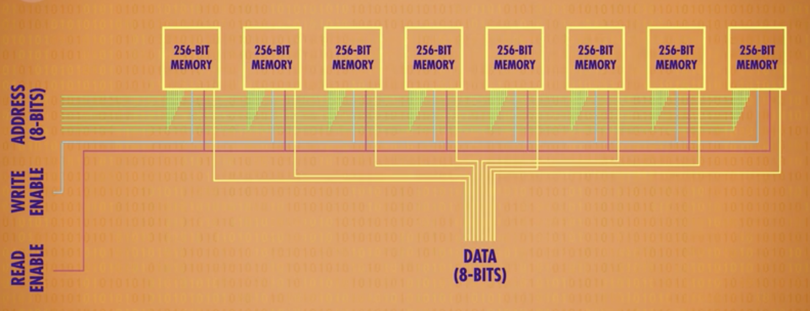
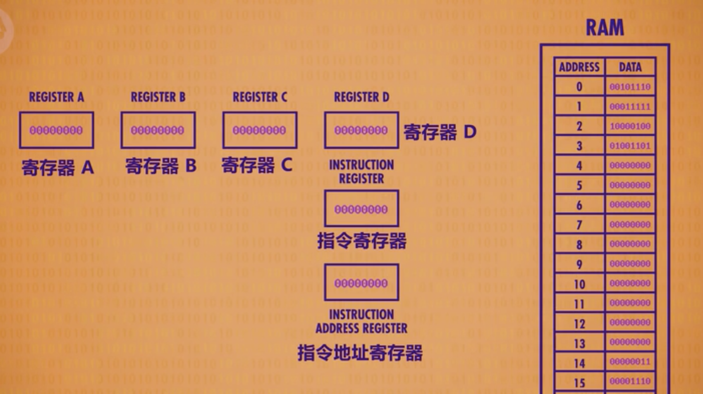
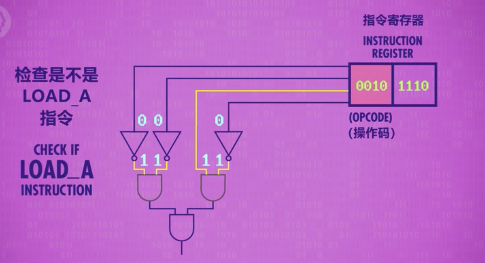
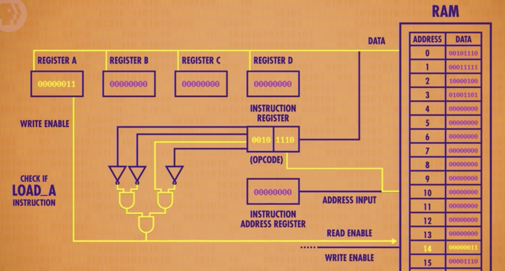
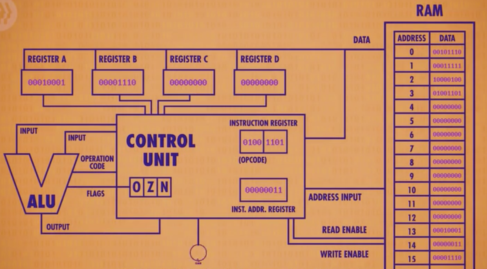
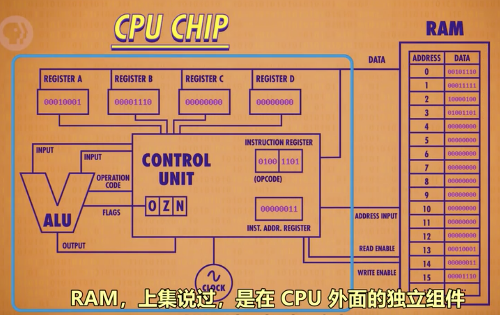

# 书目

1. 2018年12月1日《程序是怎么跑起来的》
	- 非常浅显易懂的解释计算的各个组成部分
2. 2020年3月1日《计算机科学速成课》 视频
   - 讲述计算机的历史起源到现在应用
   - https://www.bilibili.com/video/av21376839

# 概述

1. 图灵证明了计算机能力有限 ，无论有多少时间和内存，有些问题是计算机无法解决的 ，即证明了
2. 图灵测试： 只是收发信息，你分析不出是人还是电脑，则是通过了图灵测试
3. alpha版本：beta前版本，可能问题比较多，经常是内部测试使用 

# 算数逻辑单元

## 用二进制的原因

1. 为何使用二进制
   - 最早计算机有5进制，3进制，即晶体管不但可以开关，还可以传输不同大小电流，但状态越多，越不容易识别
   - 当时有专门的研究true和false的数学分支，已经通过逻辑运算解决很多数学问题
   - 晶体管可以很好实现逻辑运算的or，and与not
   - 晶体管表示true与false，利用二进制数学的方式表示更为复杂的东西
2. 计算器处理信息最小单位是位bit，8位为一个字节，作为信息基本单位
3. 如常说的32位，64位计算机，主要是计算机的处理单元是32位或64位，即一次处理32位二进制数
4. 对于计算器来说，如一个图、一段文字等都可以表示为0101010101000，如何处理需要取决于程序的编写方式，或者说是编码方式
5. 32位最多表示正负20亿，但有时还是不够用，如现在有70亿人口，所以会有64位

## 二进制运算

### 通过移位运算表示乘除

1. 十进制左移n位相当于乘以2^n，右移相当于除以2^n
2. 十进制可以直接进行移位运算的原因是，计算机中所有值都是二进制表示

### 补数

1. 二进制一般把最高位作为符号位，0表示正数，1表示负数，并使用补数表示负数（取反+1）
2. 如-1，二进制的1表示为：00000001，取反+1：1111 1111，因此-1的二进制表示为1111 1111
3. 将减法运算，变为补数的加法运算，如5-3表示为5+(-3)，5表示为0101，-3表示为1101，运算结果为0010，为2
4. 注意：如运算结果为负数，这个值是补数形式，如3-5，运算结果为（0011+1011=1110），1110取反+1：0010为2，故结果为-2
5. 2字节，16位的有符号数，是从-32768~32767（2^16=65536，正负数分别32768个），因为最高位符号位0表示正数，故0归为正数，故0~32767共32768个，负数从-1~-32768，共32768个

### 逻辑右移和算数右移的区别

1. 逻辑右移就是高位补0，类似于霓虹灯往右滚动
2. 算数右移：根据符号位，高位补符号位，如-4的补数为1110，右移2位1111，是0001的补数，即为-1，满足-4/(2^2)的结果
3. 只有右移时才区分逻辑右移还是算数右移
4. 逻辑运算不会有进位，即按位或、与、非、异或等

## 算数逻辑单元（ALU）

1. 主要是负责计算机的运算的组件，通过逻辑门可以构建ALU 

2. 表示一位的加法运算，实际就是一个xor与and，就可以实现，称之为半加器

   

3. 通过半加器，可以实现全加器，并通过大量逻辑门实现8位逻辑运算

4. 可以将ALU进行抽象为

   

   - 输入输出都是8位，操作码用来控制运算方式是加减乘除，如可能0001表示加法，0010表示减法
   - flags用于表示溢出，正负标识等

# 寄存器与内存

## 概述

1. 如何用逻辑门记录一个位数据

   

   - 对于异或电路，AB同为0时，则会输出0
   - 如果A为1，输出为1，瞬间B为1，输出还是1
   - 此时A再设置为0，输出还是1，保存了这个状态
   - 利用相同的道理，使用AND门，可以存储0这个状态
   - 因此利用异或与AND门，可以存储1和0这两个状态

2. 通过结合异或与AND的门，形成锁存器，这是存储1bit信息的方式

   - 锁存器用设置与复位来输入，有些难以理解

3. 因此，基于锁存器，形成“门锁”

   - 只有1条数据输入线和允许写入线，允许写入时，数据为0就存储0

## 寄存器

1. 多个锁存器的组合会形成寄存器，能存下数的位数称为位宽，现在一般电脑都是64位宽的寄存器
2. 如果使用上述方式并列排布寄存器，64位寄存器会有64根数据线+64根输出线+1根控制线，那么256位就需要513根线，解决办法是使用矩阵的形式
   - 使用16*16的矩阵就可以放下256位寄存器
   - 如果需要启用某个位置的寄存器，只需打开当前位置的行列线即可
   - 因此可以用一条数据线，一条控制线，加上行列启动线（32根），控制单个寄存器存储数据

### 多路复用器

1. 使用矩阵方式放置寄存器，需要用某种方式来存储交叉路口，即如何指定12行8列

   - 可以用8bit表示，11001000，前4位表示行，后4位表示列

   - 多路复用器，主要是为了将这8bit信息，转换为行列信息

2. 矩阵的行列分别用一个多路复用器

   - 其实可以理解为，行多路复用器，输入0000，会选择第一行
   - 因此可以再做一层抽象，形成一个基本的256位内存形式

3. 要注意的是256位内存，使用8位地址线，一个写入输入线，意味着1bit数据，有256个存储地方

   

4. 8个256-bit内存并列排布，形成一个8字节的存储单元

   

   - 每个模块可以存储1位，可以存储8位数据，即1个字节
   - 地址线同时连接8个模块，故有256个位置可以存储数据
   - 故上述整个可以存储256字节

5. RAM：上述整个模块可以称为一个RAM（随机存取存储器），现在内存几G也是不断扩展这个模块

6. 不同类型的RAM，实际是存储单元的构件不同，如电容器等 

# CPU

## 概述

1. CPU由数百万至数亿晶体管构成

## 运行机制

1. 为了简便，我们先用一个16位置的RAM，每个位置可以存8bit；

   - 4个寄存器，用于临时存储数据和操作数据
   - 指令地址寄存器：追踪程序运行到哪里
   - 指令寄存器：寄存器存当前指令

   

2. 运行机制

   - 程序开始时，全部的寄存器为0；

   - 指令地址寄存器会取内存第一个位置，获取数据00101110，放入指令寄存器

   - 指令寄存器会根据指令表（如前4位表示具体指令，后4位表示RAM地址），如0010是 LOAD A 指令，即把指令放在寄存器A中

   - 通过解码电路，会将0010识别出，然后打开RAM的 允许读取线，把地址1110，即14传入RAM

     

   - 由于要存入寄存器A，故打开寄存器A的存入线，将RAM14的值存入寄存器A中，得到类似这样的电路

     

   - 然后关闭全部线，指令寄存器+1，循环

   - 不同的指令由不同的解码

3. 对上述内部功能进行封装，实际会得到一个简单的cpu集合

   

   - ALU用于控制两个数进行逻辑运算，如某些指令是让AB寄存器是值进行相加
   - 控制单元还会具有一个时钟，用于控制整个循环的节奏

4. CPU的内部由寄存器、控制器、运算器和时钟（时钟可能在CPU外部）四部分组成

5. 最早的intel 4004 cpu的微架构，可以根据上述进行抽象

   

## 高级cpu设计

1. cpu的不断发展，在不断的提高时钟周期，即运算频率越来越快
   - 如何快速的将数据传递给CPU成为问题
   - RAM通过总线的方式将数据传输给CPU成为了瓶颈
2. 解决办法
   - 方式1：给CPU增加一个块缓存，用于缓存RAM的地址，一次可以取多个地址到CPU中
   - 方式2：指令流水线，即cpu的【读取-> 解码-> 执行】操作时，在进行解码时，就去读取下个指令，而不是等着执行完成
     - 问题1：如何处理指令之间的依赖关系，即读数据时，某个操作正在写数据；解决办法是，弄请数据依赖关系，然后在必要时，暂停流水线
     - 问题2：条件跳转，因为这些命令会改变程序的执行流；简单解决办法，遇到这样的命令，暂停流水线，等到结果后再继续；高级的方法是，会提前预测会走哪个分支，然后将分支的指令提前加载到流水线上，现代CPU的正确率高达90%
   - 方式3：同时运行多条指令流，即多核处理器 

# 计算机进行小数运算时出错的原因

## 计算机运算出错的原因

1. 十进制小数的二进制表示方法，如只用4位2进制表示小数，0.0000表示0，0.0001表示0.0625，因此这之间的十进制小数则无法用二进制表示
2. 由于计算机存储数据是有限的，对于0.1表示为二进制会为0.00011001100（1100循环），计算机会截取这样的循环小数，类似于十进制表示1/3为0.3333333333......，计算机会截取为0.3333333，再乘以3，结果为0.9999999

## 什么是浮点数

1. 实际计算机并不是按照纸面上二进制表现形式处理小数的
2. 很多语言提供双精度浮点数（64位）和单精度浮点数（32）位来表示小数
3. 浮点数是指用符号、尾数、基数（2）和指数四部分表示小数，表现形式有很多种，一般使用IEEE标准
4. 符号为1时表示正数，0表示负数或0；
5. 数值大小用尾数部分（将小数点前面的值固定为1的正则表达式）和指数部分（用EXCESS系统表示）表示

## 正则表达式和EXCESS系统

1. 尾数部分使用正则表达式，为了统一浮点数的表现形式，如十进制的0.75可以表示为0.75*10^0，也可以表示为75\*10^-2；
2. 十进制的正则表达式规则为：小数点前面是0，小数点后面第1位不能是0，故只能用尾数0.75，指数部分0的方法表示这个小数
3. 二进制的正则表达式规则为：将小数点前面的值固定为1的正则表达式，将小数逻辑左移或右移，使整数第1位为1，其他为0，如小数1011.0011，右移为0001.0110011，确保小数点后23位（单精度浮点数），保留小数部分0110011000000......作为浮点数的尾数
4. 指数部分使用EXCESS系统：主要为了负数不使用符号为，比如1-13，可以用7表示0，那么10就是+3，3表示-4；单精度指数部分有8为，故最大值为11111111，对应的十进制值为255，中间127表示为0，故00000000，EXCESS系统表示为0-127= 127
5. 如0.75用单精度浮点数表示为：0-01111110-100000.....，第1位为符号位，0表示正数，指数部分01111110，十进制为126,126-127实际上EXCESS系统表示的为-1；尾数部分10000，根据规则小数点前面第一位是1，故实际表示的数为1.100000000000000转为十进制是1*2^0+1\*2^-1=1.5，然后再1.5\*2^-1结果是+0.75

## 3.7 如何避免计算机计算出错

1. 回避策略，无视这些错误，对于某些科学技术计算领域，近似结果就可以，微小误差可以完全忽略
2. 把小数转换为整数计算
3. 更换二进制表示十进制的方式，如使用BCD

# 第4章 内存、磁盘

## 4.1 内存的物理机制

1. 内存包含DRAM（需要经常刷新以保存数据的DRAM）、SRAM（不需要刷新电路）、ROM（只读内存）等多种形式
2. 内存IC有电源、地址信号、数据信号、控制信号等用来输入输出的大量引脚，如地址引脚A0-A9，共10个，表示1024个地址；数据引脚D0-D7，共8个，一次可以输入8位数据，即1字节，故这个内存可以存储1024个1字节数据，容量为1K
3. 如想写入数据，则控制引脚设为1（写入操作），选择要写入的地址，地址引脚设定具体的值，然后在数据引脚给具体的数值
4. CPU通过计数器来指定内存地址，才能读出程序，即使CPU能从磁盘直接读，但速度也太慢了

### 4.2 磁盘的物理结构

1. 磁盘通过将表面划分为多个空间来使用，划分方式有扇区方式和可变长方式两种
2. windows采用扇区的方式，逻辑方面对磁盘进行读取的单位是扇区的整数倍簇，一般一个扇区是512字节，磁盘容量越大，簇越大
3. 无论多小的文件，都会占1簇，不同文件不在相同的簇上
4. 因此，簇越小空间浪费越小，但读取速度要更慢，故扇区和簇的大小，是由处理速度和存储容量的平衡来决定的

## 4.3 磁盘缓存

1. 在内存中开辟一块区域存放磁盘数据，第二次读取时，就可以从内存高速读出
2. 但由于磁盘读写速度在增快，磁盘缓存效果不再那么明显了

## 4.4 虚拟内存

1. 把磁盘的一部分作为假象的内存来使用
2. 借助虚拟内存，在内存不足时，也可以运行程序，但CPU是从内存中运行程序，虚拟内存其实是将磁盘的某些内容与内存的某些内容进行置换

# 第5章 压缩机制