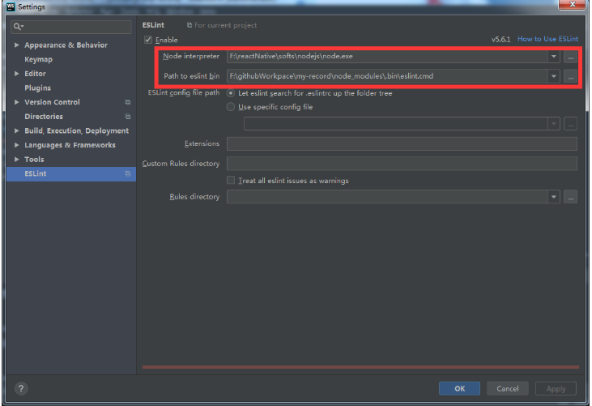

# 介绍

## airbnb代码规范

1. https://github.com/airbnb/javascript，7.6k
2. 非常严格的代码规范，涉及的不仅仅是格式，有利于书写更标准的js语法
3. 安装在，packages下，eslint-config-airbnb-base包为基础包
4. npm info "eslint-config-airbnb-base@latest" peerDependencies ，通过此来查看需要安装依赖的版本，然后安装依赖
5. 在.eslintrc.js中加入{"extends": "airbnb-base"}

## eslint初始化（官网教程）

1. https://eslint.org/docs/user-guide/getting-started
2. 可以全局安装eslint或局部安装
3. 利用eslint --init来初始化init配置
4. 通过选择，Use a popular style guide，可以选择google或Airbnb的代码书写风格

# webstorm配置

1. 
2. 注意：
	- 如选择局部安装，配置webstorm的Path to eslint bin需要选择node_modules模块下的 eslint.cmd
	- 如仅仅局部安装，但选择全局 eslint.cmd可能会报 Cannot find module 'eslint-config-airbnb-base' 
	- .bin模块下是本地可执行文件的汇总 