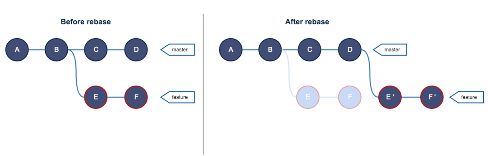
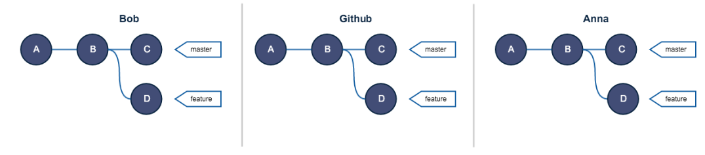
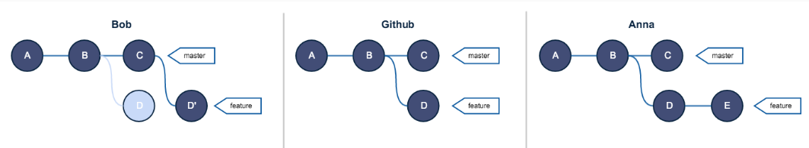
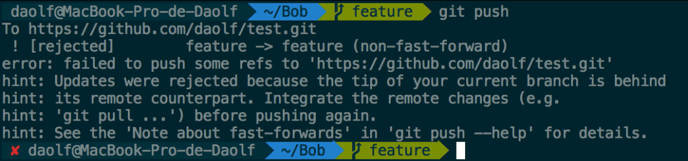
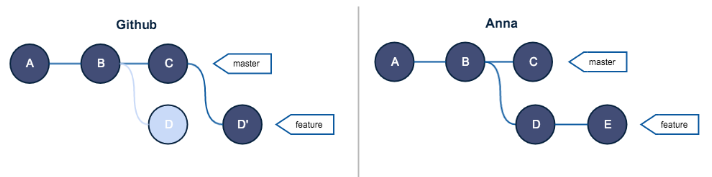
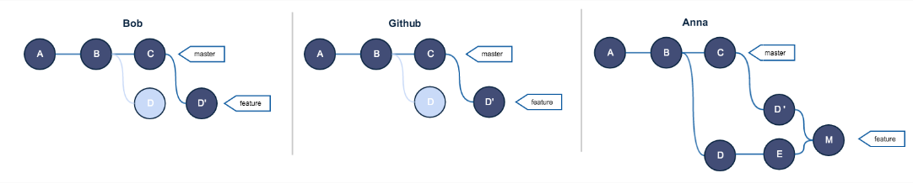

# 概述

1. 基本逻辑

   

2. 将所有提交从分支重新应用到另一个分支的尖端，并不是简单的ctrl+c与ctrl+v

   - 所有提交都是新的
   - 旧提交并没有删除

# 黄金准则

1. 不要在共享分支进行rebase

2. 假设，有如下分支结构

   

3. Bob与Anna都在feature分支上，Bob 然后进行了rebase，Anna有了新的提交

   

4. 当Bob需要push时，会报错：

   

   - 为了可以push，Bob可能会使用 push -f ，强制push到远程

5. 那么远程和Anna的git结构会变为

   ```json
   A--B--C--D'   origin/feature // GitHub
   A--B--D--E    feature        // Anna
   ```

   

6. Anna不能push -f，这样会覆盖远程分支，故需要pull，git会将通过merge，即提交一个新的M，解决这个问题

   

7. 这还是两个人，如果多人rebase，会造成复杂的git结构树，并且会存在大量相同的提交，占用空间

# 更好的方式

1. 不是强制push，而是使用pull -rebase
2. 特别注意：使用pull-rebase时，如果有20个commit，需要解决20次冲突，千万不能跳过（吃过亏。。。）


# rebase代码丢失

1. 找到项目目录下的git文件 .git\logs\refs\heads\branchname
2. 或者直接执行命令：`git reflog`
   - git checkout -b my_recovery_branch 6c6245fbd95a58ac2ec2f0de3835f448b4ac8593


