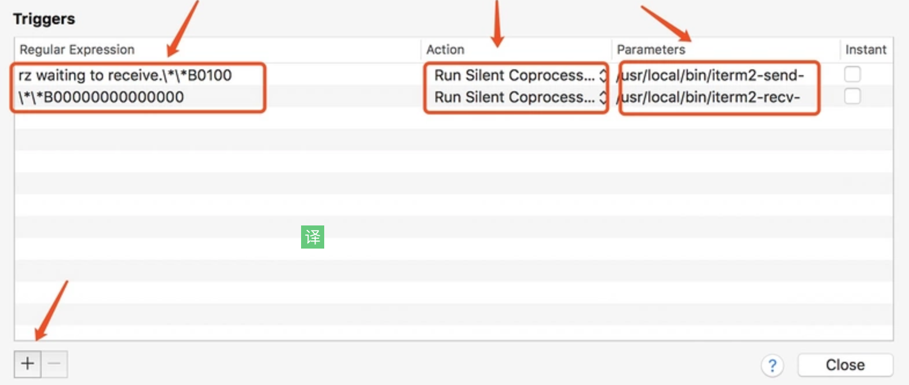

# rz

1. 结合iterm2使用，可以弹出要选择的内容或下载框

2. `brew install lrzsz ` 安装rz

3. 进入目录：`cd ／usr/local/bin`

   - 创建：`iterm2-recv-zmodem.sh`，`iterm2-send-zmodem.sh`

4. 利用vi方式，将下面代码复制到这两个文件内（这个作者的GitHub不存在了-。-）

   - iterm2-recv-zmodem.sh

     ```bash
     #!/bin/bash
     # Author: Matt Mastracci (matthew@mastracci.com)
     # AppleScript from http://stackoverflow.com/questions/4309087/cancel-button-on-osascript-in-a-bash-script
     # licensed under cc-wiki with attribution required 
     # Remainder of script public domain
     
     osascript -e 'tell application "iTerm2" to version' > /dev/null 2>&1 && NAME=iTerm2 || NAME=iTerm
     if [[ $NAME = "iTerm" ]]; then
         FILE=`osascript -e 'tell application "iTerm" to activate' -e 'tell application "iTerm" to set thefile to choose folder with prompt "Choose a folder to place received files in"' -e "do shell script (\"echo \"&(quoted form of POSIX path of thefile as Unicode text)&\"\")"`
     else
         FILE=`osascript -e 'tell application "iTerm2" to activate' -e 'tell application "iTerm2" to set thefile to choose folder with prompt "Choose a folder to place received files in"' -e "do shell script (\"echo \"&(quoted form of POSIX path of thefile as Unicode text)&\"\")"`
     fi
     
     if [[ $FILE = "" ]]; then
         echo Cancelled.
         # Send ZModem cancel
         echo -e \\x18\\x18\\x18\\x18\\x18
         sleep 1
         echo
         echo \# Cancelled transfer
     else
         cd "$FILE"
         /usr/local/bin/rz -E -e -b
         sleep 1
         echo
         echo
         echo \# Sent \-\> $FILE
     fi
     ```

   - iterm2-send-zmodem.sh

     ```bash
     #!/bin/bash
     # Author: Matt Mastracci (matthew@mastracci.com)
     # AppleScript from http://stackoverflow.com/questions/4309087/cancel-button-on-osascript-in-a-bash-script
     # licensed under cc-wiki with attribution required 
     # Remainder of script public domain
     
     osascript -e 'tell application "iTerm2" to version' > /dev/null 2>&1 && NAME=iTerm2 || NAME=iTerm
     if [[ $NAME = "iTerm" ]]; then
         FILE=`osascript -e 'tell application "iTerm" to activate' -e 'tell application "iTerm" to set thefile to choose file with prompt "Choose a file to send"' -e "do shell script (\"echo \"&(quoted form of POSIX path of thefile as Unicode text)&\"\")"`
     else
         FILE=`osascript -e 'tell application "iTerm2" to activate' -e 'tell application "iTerm2" to set thefile to choose file with prompt "Choose a file to send"' -e "do shell script (\"echo \"&(quoted form of POSIX path of thefile as Unicode text)&\"\")"`
     fi
     if [[ $FILE = "" ]]; then
         echo Cancelled.
         # Send ZModem cancel
         echo -e \\x18\\x18\\x18\\x18\\x18
         sleep 1
         echo
         echo \# Cancelled transfer
     else
         /usr/local/bin/sz "$FILE" -e -b
         sleep 1
         echo
         echo \# Received $FILE
     fi 
     ```

5. 文件复制好后，执行：`chmod 777 iterm2-*`

6. 点击 iTerm2 的设置界面 Perference-> Profiles -> Default -> Advanced -> Triggers 的 Edit 按钮

7. 添加如下内容

   

   ```
   Regular expression: rz waiting to receive.\*\*B0100
   Action: Run Silent Coprocess
   Parameters: /usr/local/bin/iterm2-send-zmodem.sh
   
   Regular expression: \*\*B00000000000000
   Action: Run Silent Coprocess
   Parameters: /usr/local/bin/iterm2-recv-zmodem.sh
   ```

8. 至此就ok了，如果需要上传文件到xxx目录，则cd到xxx目录，然后执行rz即可

9. 如需要下载：sz fileName(你要下载的文件的名字) 回车，会弹出窗口让你保存


# 压缩与解压tar

## 压缩

1. `tar –cvf dist.tar *.jpg //将目录里所有jpg文件打包成tar.jpg`
   - 一般Linux都支持这个命令
2. `rar a jpg.rar *.jpg //rar格式的压缩，需要先下载rar for linux`
3. `zip jpg.zip *.jpg //zip格式的压缩，需要先下载zip for linux`

## 解压

1. `tar –xvf file.tar //解压 tar包`
2. `unrar e file.rar //解压rar`
3. `unzip file.zip //解压zip`

# 定义快捷键

1. 检查zsh：`zsh --version`

2. 在`~/.zshrc`文件中加入：

   ```
   alias dp='npm run deploy-dev'
   ```

3. 最后记得使用： `source .zshrc`让改动文件生效

# 问题

## 将命令console直接输出到文件

1. `node ./diff.js > DIFF`
2. 会将diff里面的console输出到DIFF文件里面