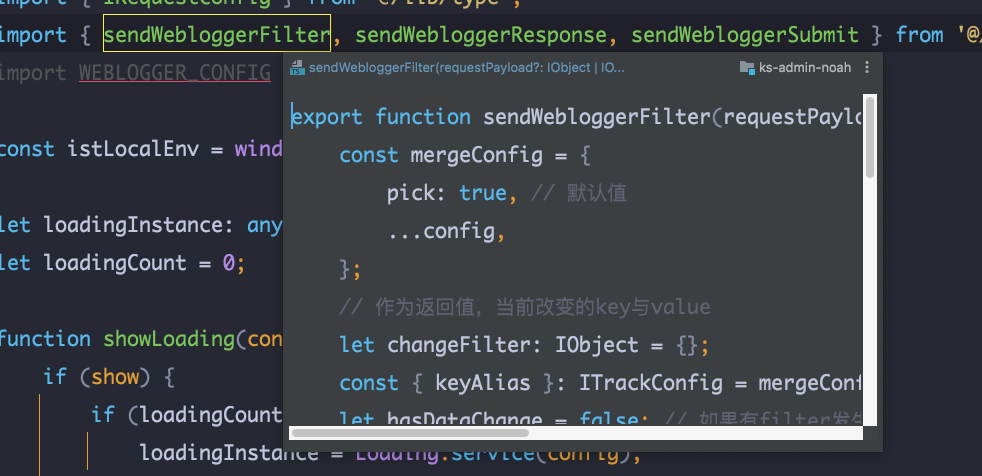

# git 父目录显示修改效果

## Idea 创建文件夹时将目录结构由点连接改为树形结构 

实现import缩略代码

快捷键：shift + comman + i

乞丐版

1. 下载webstorm
   - https://www.jetbrains.com/zh-cn/webstorm/download/other.html
2. 插件
   - https://plugins.zhile.io/files/ide-eval-resetter-2.1.6.zip

# 汇总

1. 不能在mac idea 的console使用npm等命令
   - 在Tools/Terminal/Shell Path 更换为/bin/zsh可以用