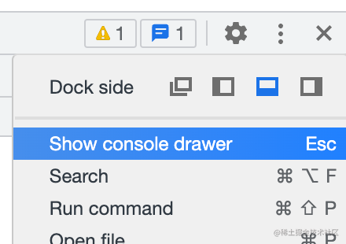

调试

如何调试eval的代码

1. 浏览器支持了这样一种特性，只要在 eval 代码的最后加上 //# sourceURL=xxx，那就会以 xxx 为名字把这段代码加到 sources 里

显示sourcemap请求

network支持过滤器

1. 输入一个 - 就会提示所有的过滤器

浏览器强制刷新原理

1. 设置了 Cache-Control 为 no-cache，然后再请求

